# 探索性数据分析 (Exploratory Data Analysis)

五十多年前，John Tukey 极力推广了一种有别于传统统计学（如置信区间、假设检验和建模）的数据分析方法。如今，Tukey 的**探索性数据分析 (Exploratory Data Analysis, EDA)** 已经被广泛应用。Tukey 将 EDA 描述为一种处理数据的哲学态度：

> **探索性数据分析是积极主动的剖析，而非被动的描述，真正的重点在于发现那些意料之外的事物。**
>
> — John Tukey

作为一名数据科学家，你应该在数据生命周期的每一个阶段都运用 EDA：从检查数据质量，到为正式建模做准备，再到确认模型的合理性。事实上，我们在上一章（数据清洗）中进行的清洗和转换工作，很大程度上就依赖于 EDA 来指导我们的质量检查和转换决策。

在 EDA 中，可以通过不断提问并深入未知领域来探索想法，从而进入一个发现的过程。你可以利用图表来揭示数据的特征，检查数值分布，并发现那些简单的数值摘要无法体现的关系。这种探索涉及转换、可视化和总结数据，旨在建立和确认我们对数据的理解，识别并解决潜在的数据问题，从而为后续分析提供依据。

EDA 充满乐趣！但这种能力需要通过练习来习得。学习如何进行 EDA 的最佳方式之一，就是观察其他人在探索数据时的思考过程。在本书的示例和案例研究中，我们将努力向你展示这种 EDA 式的思维方式。

虽然 EDA 能提供有价值的见解，但你对其得出的结论需要保持谨慎。必须认识到，EDA 可能会给你的分析带来偏差。EDA 本质上是一个筛选和决策的过程，这可能会影响你后续基于模型的发现的可复现性。如果你有足够多的数据，并且以此寻找，你往往能挖掘出一些完全是巧合的“有趣”现象。

EDA 在科学复现性危机中的角色已引起关注，数据科学家们也经常警告不要过度使用它。例如，Gelman 和 Loken 指出：

> 即使是对给定数据只进行了一次分析，多重比较（数据挖掘/Data Dredging）的问题依然存在。因为在分析过程中，关于如何组合变量、包含或排除哪些案例、变量转换、在缺乏主效应时检验交互作用等众多步骤的选择，如果换一批数据，可能会完全不同。

因此，一个好的做法是**记录并提供你的 EDA 代码**，这样其他人就能了解你在认识数据的过程中所做的选择和尝试过的路径。

关于**可视化**的主题，我们将分三章进行讲解：

1.  在**上一章（数据清洗）**中，我们使用图表来辅助数据规整。那里的图表都很基础，发现的问题也很直接。我们没有过多讨论图表的选择和解读。
2.  在**本章**中，我们将花更多时间学习如何**选择正确的图表**并**解读**它。我们通常会使用绘图函数的默认参数，因为我们的目标是在进行 EDA 时快速生成图表。
3.  在**下一章**中，我们将提供关于制作**有效且信息丰富**的图表的指南，并建议如何使我们的视觉论证清晰且令人信服。

正如 Tukey 所言，可视化是 EDA 的核心：

> **从数据中获得的最大收益往往来自于惊喜……而图片最能让我们注意到那些意料之外的事物。**

为了制作这些图片，我们需要选择合适类型的图表，而这种选择取决于我们收集的数据类型。**特征类型与图表选择之间的映射关系**将是我们下一节的主题。

随后，我们将继续讲解如何“阅读”一张图表，寻找什么信息，以及如何解释你所看到的。我们将首先讨论在**单特征 (One-feature)** 图表中寻找什么，然后专注于解读**两个特征 (Two-features)** 之间的关系，最后介绍用于**三个或更多特征**的图表。

在介绍了 EDA 的可视化工具之后，我们将提供进行 EDA 的指导原则，并遵循这些原则通过一个实例带你走完整个流程。

## 6.1 特征类型 (Feature Types)

在制作任何探索性图表之前，先检查特征（Feature，有时也称为变量/Variable）并确定其类型是一个好习惯。虽然特征类型的分类方式多种多样，但本书主要考虑三种基本类型：

1.  **名义型 (Nominal)**
    *   代表“命名”类别，类别之间没有自然顺序。
    *   *例如*：党派（民主党、共和党、其他）、犬种类别（牧羊犬、猎犬、玩赏犬等）、操作系统（Windows、macOS、Linux）。

2.  **有序型 (Ordinal)**
    *   代表有序的类别。
    *   *例如*：T恤尺寸（S, M, L）、李克特量表（不同意、中立、同意）、教育程度（高中、大学、研究生）。
    *   *注意*：有序特征中，相邻类别之间的差距可能是不相等的，甚至无法量化。比如餐厅评论中的 1 星与 2 星的差距，并不一定等于 4 星与 5 星的差距。

    > 名义型和有序型统称为**分类数据 (Categorical Data)** 或**定性数据 (Qualitative Data)**。

3.  **数值型/定量型 (Quantitative)**
    *   代表数值测量或数量。
    *   *例如*：身高（cm）、价格（USD）、距离（km）。
    *   数值型特征可进一步细分为：
        *   **离散型 (Discrete)**：只能取有限个数值（如家庭兄弟姐妹数：0, 1, 2...）。
        *   **连续型 (Continuous)**：理论上可以取任意精度的小数值（如身高）。
    *   *注意*：离散和连续的界限有时是模糊的，取决于分析需求。

### 特征类型 vs 存储类型

**特征类型 (Feature Type)** 是关于信息的概念性描述，而 **存储类型 (Storage Type)** 是计算机中信息的表示方式。二者并不总是一一对应：

*   整数 (Integer) 存储的列可能代表名义型数据（如 ID）。
*   字符串 (String) 存储的列可能代表数值型数据（如 "$100.00"）。
*   布尔值 (Boolean) 通常代表只有两个取值的名义型特征。

Pandas 中每列都有自己的存储类型 (`dtype`)，如 `int64`, `float64`, `bool`, `datetime`, `category` 和 `object`（通常用于字符串）。

!!! note "术语说明"
    Pandas 将存储类型称为 `dtype` (Data Type 的缩写)。为了避免混淆，我们在本书中尽量区分使用 **存储类型 (Storage Type)** 和 **特征类型 (Feature Type)**。

### 6.1.1 案例：犬种数据 (Dog Breeds)

我们将使用美国养犬俱乐部 (AKC) 的注册犬种数据来介绍 EDA 的概念。AKC 成立于 1884 年，致力于纯种犬的研究和繁育。该数据集包含了 172 个犬种的各种特征。

让我们读取数据：

```python
import pandas as pd
dogs = pd.read_csv('data/akc.csv')
dogs.head()
```

查看数据概况：

```python
dogs.info()
```
输出显示：

*   `breed`, `group`, `size`, `repetition` 的 dtype 是 `object`（字符串）。
*   `score`, `longevity`, `weight`, `height` 等是 `float64`。

**分析特征类型：**

1.  **Repetition (重复次数)**：
    *   虽然看起来像数值，但其值为 `<5`, `15-25` 等范围字符串。因此它是**有序型**特征。
    *   存储类型：`object`。
    
2.  **Ailments (遗传病数量) & Children (儿童适应性)**：
    *   存储类型均为 `float64`，但这并不意味着它们都是连续数值。
    *   查看唯一值计数：
        ```python
        dogs['children'].value_counts()
        # 1.0    67
        # 2.0    35
        # 3.0    10
        ```
    *   `children` 只有 1.0, 2.0, 3.0 三个值。查阅**代码簿 (Data Dictionary)** 可知：1=高适应性，2=中等，3=低。因此，`children` 是**有序型**特征，尽管它以浮点数存储。
    *   `ailments` 是遗传病的计数（0, 1, 2...），是**离散数值型**特征。

3.  **其他数值特征**：
    *   `score`, `longevity`, `weight`, `height` 根据代码簿确认为**连续数值型**。它们的比率和差值都有物理意义（如腊肠犬比吉娃娃重 5 倍）。

4.  **Group (分组)**：
    *   取值为 `terrier` (梗犬), `sporting` (运动犬) 等。无法自然排序，是**名义型**特征。

5.  **Size (体型)**：
    *   取值为 `small`, `medium`, `large`。有自然顺序，是**有序型**特征。

**修订后的数据字典：**

| 特征 | 描述 | 特征类型 | 存储类型 |
| :--- | :--- | :--- | :--- |
| **breed** | 犬种名称 | 主键 (Primary Key) | String |
| **group** | AKC 分组 | 定性 - 名义型 | String |
| **score** | AKC 评分 | 定量 - 连续 | Float |
| **longevity** | 典型寿命 | 定量 - 连续 | Float |
| **ailments** | 遗传病数量 | 定量 - 离散 | Float |
| **grooming** | 美容频率 | 定性 - 有序型 | Float |
| **children** | 儿童适应性 | 定性 - 有序型 | Float |
| **size** | 体型 | 定性 - 有序型 | String |
| **repetition**| 训练重复次数 | 定性 - 有序型 | String |

### 6.1.2 转换定性特征 (Transforming Qualitative Features)

为了便于分析和绘图，我们需要对定性特征进行转换：**重命名类别**、**合并类别**或**数值转有序**。

#### 1. 重命名类别 (Relabel Categories)

对于 `children` 特征，虽然存储为 1, 2, 3，但在计算平均值时（如 1.49）没有实际意义。更好的做法是将其转换为有意义的字符串标签。

```python
# 将数值映射为字符串
kids_map = {1: "high", 2: "medium", 3: "low"}
dogs = dogs.assign(kids=dogs['children'].replace(kids_map))

# 绘图时，可以直接使用有意义的标签
import plotly.express as px
toy_dogs = dogs.query('group == "toy"').groupby('kids').count().reset_index()

px.bar(toy_dogs, x='kids', y='breed', 
       category_orders={"kids": ["low", "medium", "high"]}, # 指定顺序
       labels={"kids": "Suitability for children"})
```

#### 2. 合并类别 (Collapse Categories)

有时类别过多，或者我们想从更高层级观察数据。
例如，我们可以创建一个布尔特征 `play`，将 `toy` 和 `non-sporting` 组视为“玩赏类”，其他视为“非玩赏类”。

```python
# 创建布尔特征
with_play = dogs.assign(play=(dogs["group"] == "toy") | 
                             (dogs["group"] == "non-sporting"))

# 计算平均值（即 True 的比例）
print(with_play['play'].mean()) 
# 0.22 (说明约 22% 的犬种属于这两组)
```

使用布尔值的好处是便于计算比例（Mean of boolean = Proportion of True）。

#### 3. 数值转有序 (Convert Quantitative to Ordinal)

当离散数值特征有“长尾”分布时（例如大部分品种只有 0-3 种遗传病，极少数有 8 种），我们可以**将其截断并转换为有序类别**：`0, 1, 2, 3, 4+`。

*注意*：这种转换会丢失信息（无法区分 4 和 9），且不可逆。因此建议保留原始列，新建一列存储转换后的数据。

### 6.1.3 特征类型的重要性

准确判断特征类型决定了我们可以进行哪些**运算**、**可视化**和**建模**。

**表 6.3：特征类型与图表的映射关系**

| 特征类型 | 维度 | 推荐图表 |
| :--- | :--- | :--- |
| **定量 (Quantitative)** | 单特征 | 频数图 (Rug plot), 直方图 (Histogram), 密度曲线 (Density), 箱线图 (Box plot) |
| **定性 (Qualitative)** | 单特征 | 条形图 (Bar plot), 点图 (Dot plot), 饼图 (Pie chart) |
| **定量** | 双特征 | 散点图 (Scatter plot), 热力图 (Heat map) |
| **定性** | 双特征 | 分组条形图 (Side-by-side Bar), 马赛克图 (Mosaic plot) |
| **混合** | 双特征 | 分组箱线图, 叠加密度图 |

此外，特征类型也决定了**统计摘要**的选择：

*   **定性**：计数 (Count)、频率 (Frequency)。
*   **定量**：均值/中位数（中心位置），标准差/四分位距（离散程度）。

!!! tip "关于百分位数"
    在 Python 中计算百分位数推荐使用 `np.percentile(data, method='lower')`，这通常能给出更直观的结果，也就是返回数据集中实际存在的数值，而不是插值计算出的浮点数。

    ```python
    import numpy as np
    data = [1, 2, 3, 4]

    # 默认方法 (线性插值)
    # 计算 50 分位数（即中位数 Median）
    print(np.percentile(data, 50)) 
    # 输出: 2.5 (2 和 3 的中间值)

    # method='lower'
    print(np.percentile(data, 50, method='lower')) 
    # 输出: 2 (数据中实际存在的数值)
    ```

在探索数据时，我们需要知道如何解读这些图表所揭示的数据形态。接下来的几节将分别介绍如何解读单特征、双特征以及多特征的图表。

## 6.2 在分布中寻找什么 (What to Look For in a Distribution)

特征的可视化展示能帮助我们看到观测值中的模式；这通常比直接查看数字或字符串本身要好得多。

### 6.2.1 地毯图与直方图

简单的**地毯图 (Rug Plot)** 将每个观测值沿着坐标轴像地毯上的“绒毛”一样标示出来。当我们只有少量观测值时，地毯图很有用，但即使只有 100 个值，想要区分高密度区域（观测值最集中的地方）也会变得困难。

下图展示了约 150 个犬种寿命数据的地毯图（位于直方图顶部）：

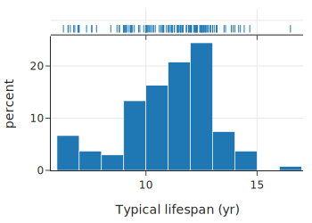

```python
import plotly.express as px

# 绘制直方图，并在边缘添加地毯图 (marginal="rug")
fig = px.histogram(dogs, x="longevity", marginal="rug", nbins=20,
                   histnorm='probability density',  # 使用密度而非计数
                   width=500, height=350,
                   labels={'longevity':'Typical lifespan (yr)'})
fig.show()
```

虽然我们能从地毯图中看出一两个异常大的值（大于 16），但很难比较其他区域的密度。相比之下，**直方图 (Histogram)** 能更好地感知不同寿命值的分布密度。同样，**密度曲线 (Density Curve)**也能描绘出高低密度的区域。

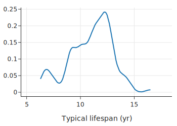

```python
from scipy.stats import gaussian_kde

new_x = dogs['longevity'].dropna()
bandwidth = 0.2
xs = np.linspace(min(new_x), max(new_x), 100)
ys = gaussian_kde(new_x, bandwidth)(xs)

f2 = go.Figure(go.Scatter(x=xs, y=ys))

f2.update_xaxes(range=[4.5, 18.5], title="Typical lifespan (yr)")
f2.update_layout(showlegend=False,width=350, height=250)
f2.show()
```


在直方图和密度曲线中，我们可以看到寿命分布是**不对称 (Asymmetric)** 的：

*   有一个大约在 12 岁的主**峰 (Mode)**。
*   在 9-11 岁范围内有一个“肩部”，意味着虽然 12 岁最常见，但许多犬种的寿命比 12 岁短 1 到 3 年。
*   在 7 岁左右有一个小的次峰。
*   只有少数犬种的寿命长达 14 到 16 年。

### 6.2.2 关键特征

在解读直方图或密度曲线时，我们主要关注以下几点：

1.  **对称性与偏态 (Symmetry and Skewness)**：分布是对称的，还是偏向一侧？
2.  **峰 (Modes)**：高频区域的数量、位置和大小（单峰、双峰等）。
3.  **长尾 (Tails)**：尾部的长度（通常与钟形曲线相比）。
4.  **间隙 (Gaps)**：没有观测值的区域。
5.  **异常值 (Anomalous Values)**：异常大或异常小的值。

通过识别这些特征，我们可以将图中的形状与实际测量的量联系起来。

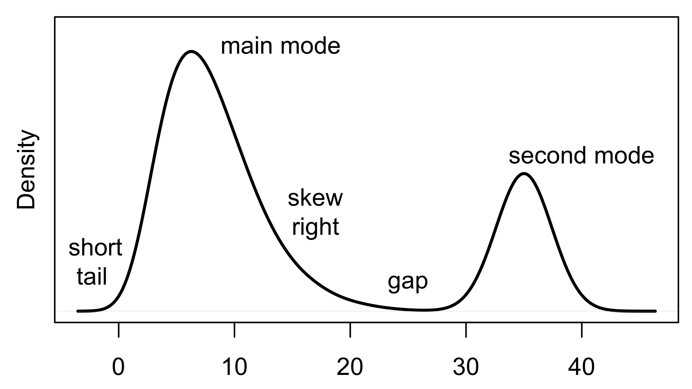

例如，犬种**遗传病数量**的分布直方图如下：

```python
import matplotlib.pyplot as plt
import seaborn as sns

# 设置分箱边界，使其以整数为中心
bins = [-0.5, 0.5, 1.5, 2.5, 3.5, 9.5]

g = sns.histplot(data=dogs, x="ailments", bins=bins, stat="density")
g.set(xlabel='Number of ailments', ylabel='density')
plt.show()
```

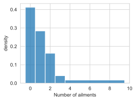

*   **0 的含义**：该品种没有遗传病。
*   **单峰 (Unimodal)**：峰值在 0 处。
*   **右偏 (Right Skewed)**：长长的右尾表明很少有犬种患有 4 到 9 种遗传病。
*   **离散性**：虽然是定量的，但遗传病数量是离散的（只有几个整数值）。因此，我们将分箱中心对准整数（如 1.5 到 2.5 的分箱只包含 2）。
*   **合并分箱**：我们将 4 到 9 种遗传病的犬种合并到一个宽分箱中。当计数较少时，使用更宽的分箱可以进一步**平滑 (Smooth)** 分布，避免过度解读小样本带来的波动。

### 6.2.3 直方图与密度曲线的三个要点

#### 1. y 轴上的密度 (Density Scale)
在上述直方图中，y 轴都被标记为“密度 (Density)”。这意味着直方图中所有条形的**总面积等于 1**。
可以将直方图想象成一个城市的天际线，高楼代表人口密集区。任何分箱中观测值的比例等于该矩形的面积。

*   *计算*：面积 = 宽度 × 高度。
*   例如，在遗传病直方图中，3.5 到 9.5 的矩形包含了约 10% 的犬种（宽度 6 × 高度 0.017 ≈ 0.10）。
*   如果所有分箱宽度相同，y 轴代表计数还是密度，形状是一样的。但如果使用了**不等宽分箱**（如上例），必须使用密度刻度，否则会得出一幅极具误导性的图像。

#### 2. 平滑 (Smoothing)
直方图通过用矩形代替点集来“平滑”地毯图中的细节。平滑是指用区域代替具体点的过程；为了揭示更广泛的趋势，我们选择不展示数据集中的每一个点。

*   **原因**：这只是一个样本，我们关心的是总体结构而非个体。
*   **密度曲线**（或称核密度估计 KDE）使用平滑的核函数将每个“绒毛”展开，是另一种平滑方式，曲线下的总面积也为 1。

#### 3. 条形图 ≠ 直方图 (Bar plot ≠ Histogram)
对于**定性数据**，条形图的作用类似于直方图，展示不同组的频率。但是，必须要区分二者：

*   **形状解读**：条形图的“尾部”和“对称性”通常没有意义（因为类别顺序可以任意调整，除非是有序特征）。
*   **宽度无关**：条形图中，频率仅由**高度**表示，**宽度**不携带任何信息。

下图展示了不同“儿童适应性”类别的计数。我们可以用条形图，也可以用**点图 (Dot Plot)** 或线图来表示，只保留高度信息（频率），去除宽度干扰：

```python
from plotly.subplots import make_subplots
import plotly.graph_objects as go

# 统计各类别计数
kid_counts = dogs.groupby(['kids']).count()
kid_counts = kid_counts.reindex(["high", "medium", "low"])

fig = make_subplots(rows=1, cols=3)

# 子图 1: 标准条形图
fig.add_trace(go.Bar(x=kid_counts.index, y=kid_counts['breed']), row=1, col=1)

# 子图 2: 极窄条形图 (暗示宽度不重要)
fig.add_trace(go.Bar(x=kid_counts.index, y=kid_counts['breed']), row=1, col=2)
fig.update_traces(width=0.1, row=1, col=2)

# 子图 3: 点图 (完全移除宽度视觉干扰)
fig.add_trace(go.Scatter(x=kid_counts.index, y=kid_counts['breed'],
                        mode='markers+lines'), row=1, col=3)

fig.update_xaxes(title='Breed suitable for kids', row=1, col=2)
fig.update_yaxes(title='count', row=1, col=1)

fig.update_yaxes(range=[0,70])
fig.update_layout(showlegend=False, width=650, height=250)              
fig.show()
```

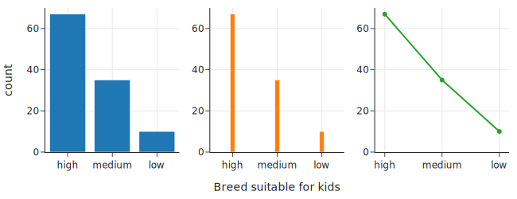

现在我们已经讲解了如何检查单个特征的分布，接下来我们将转向探索**两个特征**之间的关系。

## 6.3 关系中寻找什么 (What to Look For in a Relationship)

在研究多个变量时，除了关注它们的分布，我们还要考察它们之间的关系。在本节中，我们将考虑特征对，并描述要在其中寻找什么。对于两个特征，类型的组合（都是定量、都是定性或混合）很重要。我们将依次考虑每种组合。

### 6.3.1 两个定量特征 (Two Quantitative Features)

如果两个特征都是定量的，那么我们通常使用**散点图 (Scatter Plot)** 来检查它们的关系。散点图中的每个点标记了一个观测值的一对值的位置。所以我们可以把散点图看作是二维的地毯图。

在散点图中，我们寻找**线性**和简单的**非线性**关系，并检查关系的强度。我们还会观察对一个或两个特征进行**变换 (Transformation)** 是否能带来线性关系。

下面的散点图展示了犬种的体重和身高（两者都是定量特征）：

```python
import plotly.express as px

fig = px.scatter(dogs, x='height', y='weight', 
           marginal_x="rug", marginal_y="rug",
           labels={'height':'Height (cm)', 'weight':'Weight (kg)'},
           width=450, height=350)
fig.show()
```

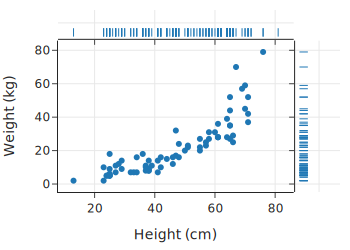

我们观察到，身高高于平均水平的狗，体重也倾向于高于平均水平。这种关系看起来是**非线性**的：身材高大的狗的体重增长速度比身材矮小的狗快。确实，如果我们把狗想象成一个盒子，这就有道理了：对于比例相似的盒子，盒子内容物的重量与其长度呈立方关系。

重要的是要注意，两个单变量图缺少双变量图中包含的信息——即关于两个特征如何**共同变化 (Covary)** 的信息。实际上，两个定量特征的直方图包含的信息不足以创建一个散点图。我们必须谨慎，不要从一对单变量图中解读太多信息。相反，我们需要使用适当的图表（如散点图、平滑曲线、等高线图、热力图或 QQ 图）来感知两个定量特征之间的关系。

### 6.3.2 一个定性特征和一个定量特征 (One Qualitative and One Quantitative Variable)

为了检查一个定量特征和一个定性特征之间的关系，我们通常使用定性特征将数据分成组，并比较这些组中定量特征的分布。例如，我们可以通过三条重叠的密度曲线来比较小型、中型和大型犬种的身高分布：

```python
fig = plt.figure(figsize=(6, 3))
ax = sns.kdeplot(data=dogs, x='height', hue='size')
ax.set(xlabel='Height (cm)', ylabel='')
ax.get_legend().set_title("Size")

lss = ['-', '--', '-.']

handles = ax.legend_.legend_handles[::-1]

for line, ls, handle in zip(ax.lines, lss, handles):
    line.set_linestyle(ls)
    handle.set_ls(ls)
```

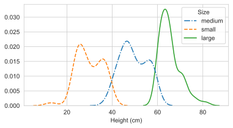

我们看到小型和中型犬种的身高分布都呈现**双峰 (Bimodal)**，且左侧的峰在其组中更大。此外，小型和中型组的身高分布范围比大型犬组更广。

**并排箱线图 (Side-by-side Box Plots)** 提供了类似的跨组分布比较。箱线图提供了一种更简单的方法来粗略了解分布。同样，**小提琴图 (Violin Plots)** 为每组沿轴绘制密度曲线。曲线被翻转以创建对称的“小提琴”形状。小提琴图旨在填补密度曲线和箱线图之间的空白。

我们根据体型分类绘制箱线图（左）和小提琴图（右）：

```python
fig = make_subplots(rows=1, cols=2)

fig.add_trace(go.Box(x=dogs["size"], y=dogs["height"]), row=1, col=1)
fig.add_trace(go.Violin(x=dogs["size"], y=dogs["height"]), row=1, col=2)

fig.update_yaxes(range=[0, 90])
fig.update_yaxes(title="Height (cm)", row=1, col=1)
fig.update_xaxes(
    categoryarray=["small", "medium", "large"], categoryorder="array", 
    title = "Size"
)
fig.update_layout(showlegend=False, width=550, height=250)
fig.show()
```

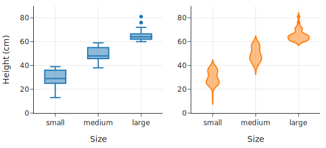

身高的三个箱线图（每个体型一个）清楚地表明，体型分类是基于身高的，因为各组的身高范围几乎没有重叠。（这一点在密度曲线中由于平滑处理而不那么明显）。我们在这些箱线图中看不到的是小型和中型组的双峰性，但我们仍然可以看到大型犬的分布范围比其他两组更窄。

**箱线图详解**：

箱线图（也称为盒须图）给出了分布的几个重要统计数据的视觉摘要。盒子表示第 25 百分位数、中位数和第 75 百分位数，须（Whiskers）表示尾部，异常大或异常小的值也会被绘制出来。箱线图不能像直方图或密度曲线那样揭示很多形状信息。它们主要显示对称性和偏态、长/短尾以及异常值。

下图是箱线图各部分的图解。不对称性可以从中位数不在盒子中间看出来，尾部的大小由须的长度显示，异常值由须之外的点显示。

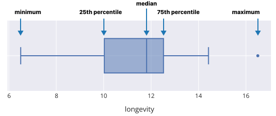

*图 6.2：箱线图及其统计量标签*

### 6.3.3 两个定性特征 (Two Qualitative Features)

当我们要检查两个定性特征之间的关系时，我们的重点是**比例 (Proportions)**。我们经常比较一个特征的分布在由另一个特征定义的子组中的情况。实际上，我们保持一个特征不变，并在该子组内绘制另一个特征的分布。我们可以使用线图或条形图。

例如，让我们检查犬种对儿童的适应性 (**kids**: high, medium, low) 与犬种体型 (**size**: small, medium, large) 之间的关系。我们计算三组比例（对儿童的适应性为低、中、高的各一组）。在每个适应性类别中，我们找出小型、中型和大型犬的比例。

注意下表中每一列的总和为 1（即 100%）：

```python
def proportions(series):
    return series / sum(series)

counts = (dogs.groupby(['kids', 'size'])
 .size()
 .rename('count')
)

prop_table = (counts
 .unstack(level=1)
 .reindex(['high', 'medium', 'low'])
 .apply(proportions, axis=1)
)

prop_table_t= prop_table.transpose()
```

接下来的折线图提供了这些比例的可视化。每个适应性水平有一条“线”（一组连接的点）。这些连接的点展示了在一个适应性类别中体型的分布情况。我们看到，不适合儿童（low suitability）的犬种主要是小型的：

```python
# 使用 Plotly Express 绘制折线图
# 注意：px.line 处理宽格式数据时，index 会作为 x 轴，columns 会作为图例区分不同的线
fig = px.line(prop_table, y=prop_table.columns, x=prop_table.index, 
              markers=True, width=500, height=300)

fig.update_layout(
    yaxis_title="proportion", xaxis_title="Size",
    legend_title="Suitability <br>for children"
)
fig.show()
```

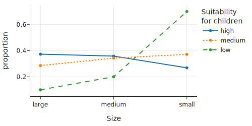

我们也可以将这些比例展示为并排条形图：

```python
# 绘制分组条形图
fig = px.bar(prop_table, y=prop_table.columns, x=prop_table.index,
        barmode='group', width=500, height=300)

fig.update_layout(
    yaxis_title="proportion", xaxis_title="Size", 
    legend_title="Suitability <br>for children"
)
fig.show()
```

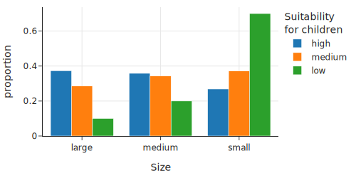

到目前为止，我们已经涵盖了包含一个或两个特征的可视化。在下一节中，我们将讨论包含两个以上特征的可视化。

## 6.4 多变量环境下的比较 (Comparisons in Multivariate Settings)

当我们检查一个分布或关系时，我们经常想要在数据的子组中比较它。这个引入额外因素的过程通常导致需要三个或更多变量的可视化。在本节中，我们将解释如何解读常用于可视化多变量的图表。

作为一个例子，让我们比较不同**训练重复次数**（repetition，狗学习新命令通常需要的次数）类别下，**身高** (height) 和**寿命** (longevity) 之间的关系。首先，我们将重复次数从 6 个类别合并为 4 个：<15, 15–25, 25–40, 和 40+：

```python
# 定义替换规则，将细分的类别合并为大类
rep_replacements = {
    '80-100': '40+', '40-80': '40+', 
    '<5': '<15', '5-15': '<15',
}

# 直接修改 repetition 列
dogs['repetition'] = dogs['repetition'].replace(rep_replacements)

# 定义合理的顺序，确保图例按逻辑排序而不是字母排序
category_orders = {"repetition": ["<15", "15-25", "25-40", "40+"]}
```

现在每个组大约有 30 个品种，较少的类别使得解读关系更容易。这些类别在散点图中由不同形状的符号表示：

```python
fig = px.scatter(dogs.dropna(subset=['repetition']), x='height', y='longevity', 
           symbol='repetition', width=500, height=300,
           category_orders=category_orders, # 指定图例顺序
           labels={'height':'Height (cm)', 
                   'longevity':'Typical lifespan (yr)',
                  'repetition':'Repetition'},
          )
fig.show()
```

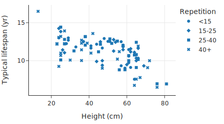

如果重复次数特征中有更多级别，这个图将很难解释。

**分面图 (Facet Plots)** 提供了另一种展示这三个特征的方法：

```python
fig = px.scatter(dogs.dropna(subset=['repetition']), 
           x='height', y='longevity', trendline='ols', 
           facet_col='repetition', facet_col_wrap=2,
           labels={'height':'Height (cm)', 
                   'longevity':'Typical lifespan (yr)'})
fig.show()
```

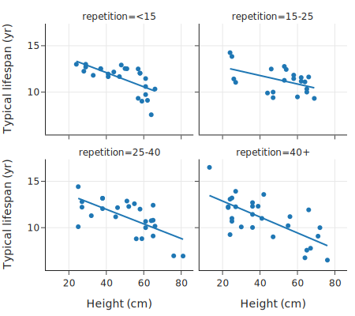

这四个散点图中的每一个都展示了在不同重复次数范围内寿命与身高的关系。通过分离散点图，我们可以更好地评估两个定量特征之间的关系如何在子组之间变化。我们还可以更容易地看到每个重复次数范围内身高和寿命的范围。

我们可以看到，**大型犬往往寿命较短**。另一个有趣的特征是，这些趋势线的斜率相似，但 40+ 次重复的线比其他线低约 1.5 年。这意味着，无论身高如何，那些学习较慢（需要更多重复次数）的品种平均寿命比其他重复次数类别的品种短约 1.5 年。

这里我们总结了当有三个（或更多）特征时进行比较的各种绘图技术：

### 6.4.1 三种特征组合的策略

**两个定量特征和一个定性特征**
我们已经演示了这种情况，即根据定性特征的类别改变散点图中的标记，或者使用散点图的分面面板，每个类别一个面板。

**两个定性特征和一个定量特征**
我们在按品种体型分类的身高箱线图集合中已经看到，我们可以通过并排箱线图比较子组间分布的基本形状。当我们有两个或更多定性特征时，我们可以根据其中一个定性特征将箱线图组织成组。

**三个定量特征**
我们可以使用类似的技术来绘制两个定量特征和一个定性特征。这一次，我们将其中一个定量特征转换为**有序特征 (Ordinal Feature)**，其中每个类别通常具有大致相同的记录数。然后我们制作其他两个特征的分面散点图。我们再次寻找跨分面的关系相似性。

**三个定性特征**
当我们检查定性特征之间的关系时，我们会检查由另一个特征定义的子组内某个特征的比例。在上一节中，一幅图中的三条折线图和并排条形图都展示了这种比较。对于三个（或更多）定性特征，我们可以继续根据特征级别的组合细分数据，并使用折线图、点图、并排条形图等比较这些比例。但是随着进一步的细分，这些图表往往变得越来越难以理解。

### 6.4.2 辛普森悖论与维度诅咒

!!! note "辛普森悖论 (Simpson’s Paradox)"
    将可视化分解以查看关系是否因定性特征确定的数据子组而改变是一种很好的做法。这种技术称为**控制变量 (Controlling for a Feature)**。
    
    当你发现散点图中原本向上的趋势在分面散点图的某些或所有分面中逆转为向下趋势时，你可能会感到惊讶。这种现象被称为**辛普森悖论**。
    
    悖论也可能发生在定性特征上。伯克利研究生院曾发生过一个著名的案例：男性的总体录取率高于女性，但当在该校的每个具体项目中检查时，录取率却偏向女性。问题在于，女性更多地申请了录取率较低的项目。

涉及多个分类变量的比较会随着类别组合数量的增加而迅速变得繁琐。例如，这里有 3 × 4 = 12 种体型-重复次数的组合（如果我们保留了原来的重复次数类别，我们将有 18 种组合）。

跨 12 个子组检查分布可能是困难的。此外，我们会遇到子组中观测值太少的问题。尽管 dogs 数据框中有近 200 行，但一半的体型-重复次数组合只有 10 个或更少的观测值。（如果某个特征有缺失值，这还会因丢失观测值而加剧。）这种**维度诅咒 (Curse of Dimensionality)** 在比较定量数据的关系时也会出现。仅用三个定量变量，分面图中的某些散点图就很容易因为观测值太少而无法确认子组中两个变量之间关系的形状。

现在我们已经看到了探索性数据分析中常用可视化的实际例子，接下来我们将讨论 EDA 的一些高级指导原则。

## 6.5 探索指南 (Guidelines for Exploration)

到目前为止，在本章中，我们介绍了特征类型的概念，了解了特征类型如何帮助确定要制作什么图表，并描述了如何在可视化中解读分布和关系。EDA 依赖于建立这些技能并灵活地发展你对数据的理解。

我们在上一章（数据清洗）中已经看到了 EDA 的实际应用，当时我们制定了数据质量检查和特征转换，以提高它们在数据分析中的实用性。以下是指导你在制作图表探索数据时的一些问题：

*   特征 X 的值是如何分布的？
*   特征 X 和特征 Y 之间有什么关系？
*   特征 X 的分布在由特征 Z 定义的子组中是否相同？
*   X 中是否有任何异常观察？在 (X, Y) 的组合中？在 Z 子组的 X 中？

当你要回答每一个问题时，重要的是将你的答案与所测量的特征和背景联系起来。采用一种积极、探究的方法进行调查也很重要。为了指导你的探索，问自己“接下来是什么”和“那又怎样”的问题，例如：

*   你是否有理由期望某个组/观察结果可能不同？
*   为什么你关于形状的发现很重要？
*   什么额外的比较可能会给调查带来附加价值？
*   是否有任何潜在的重要特征可以用来创建比较？

在这个过程中，时不时地离开电脑去思考你的发现是很重要的。你可能想要阅读有关该主题的其他文献，或者去咨询该领域的专家讨论你的发现。例如，一个不寻常的观察结果可能有很好的理由，该领域的人可以帮助澄清并提供更多背景信息。

接下来，我们将通过一个具体的 EDA 示例将这些准则付诸实践。

## 6.6 案例：房价数据 (Example: Sale Prices for Houses)

在最后一节中，我们将运用上一节提出的问题来进行一次探索性分析。虽然 EDA 通常始于数据整理阶段，但为了演示，我们使用的数据已经进行过部分清洗，以便我们将重点放在探索感兴趣的特征上。另外请注意，我们不会详细讨论如何优化可视化效果，该主题将在后续章节中介绍。

我们的数据是从 《旧金山纪事报》(San Francisco Chronicle) 网站上抓取的。这些数据包含了 2003 年 4 月至 2008 年 12 月期间该地区所有已售房屋的完整列表。由于我们不打算将我们的发现推广到该时间和地点之外，而且我们处理的是普查数据，因此总体与访问框架相匹配，样本即为整个总体。

至于粒度，每条记录代表了在指定时间段内旧金山湾区的一笔房屋销售。这意味着，如果在该时间段内一所房屋被出售了两次，那么表中有两条记录。如果湾区的一所房屋在此期间没有出售，那么它就不会出现在数据集中。

数据存储在数据框 `sfh_df` 中：

```python
import pandas as pd
import numpy as np

# 假设已加载数据
# sfh_df = pd.read_csv('data/sfh.csv') 
# 这里为了演示，我们只展示结构
# sfh_df.head()
```

数据集没有附带代码簿，但我们可以通过检查来确定特征及其存储类型：

```
<class 'pandas.core.frame.DataFrame'>
RangeIndex: 521491 entries, 0 to 521490
Data columns (total 8 columns):
 #   Column     Non-Null Count   Dtype         
---  ------     --------------   -----         
 0   city       521491 non-null  object        
 1   zip        521462 non-null  float64       
 2   street     521479 non-null  object        
 3   price      521491 non-null  float64       
 4   br         421343 non-null  float64       
 5   lsqft      435207 non-null  float64       
 6   bsqft      444465 non-null  float64       
 7   timestamp  521491 non-null  datetime64[ns]
dtypes: datetime64[ns](1), float64(5), object(2)
```

根据字段名称，我们预计主键由城市、邮政编码、街道地址和日期的某种组合构成。

**售价 (Sale Price)** 是我们的重点，所以让我们从探索它的分布开始。为了培养你对分布的直觉，在阅读下一节之前，先猜猜分布的形状。不用担心价格范围，只需画出大致形状。

### 6.6.1 理解价格 (Understanding Price)

一个合理的猜测是，售价的分布可能是高度**右偏 (Right-skewed)** 的，有少数非常昂贵的房子。以下的统计摘要证实了这种偏态：

```python
# 设置 Pandas 显示格式，避免科学计数法
pd.set_option('display.float_format', '{:.2f}'.format)

percs = [0, 25, 50, 75, 100]
prices = np.percentile(sfh_df['price'], percs, method='lower')
pd.DataFrame({'price': prices}, index=percs)
```
```
       price
0      22000.00
25    410000.00
50    555000.00
75    744000.00
100 20000000.00
```
中位数更接近下四分位数而不是上四分位数。而且，最大值是中位数的 40 倍！我们可能会想，那个 2000 万美元的售价仅仅是一个异常值，还是有许多房子以如此高的价格出售？为了弄清楚，我们可以放大分布的右尾，计算几个高百分位数：

```
95.00	1295000.00
99.00	2110000.00
99.90	3950000.00
```
我们看到 99.9% 的房子售价在 400 万美元以下，所以 2000 万美元的销售确实是罕见的。让我们检查 400 万美元以下售价的直方图：

```python
import plotly.express as px

under_4m = sfh_df[sfh_df['price'] < 4_000_000].copy()
fig = px.histogram(under_4m, x='price', nbins=50, width=450, height=300,
            labels={'price':'Sale price (USD)'})
fig.show()
```

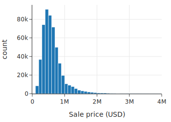

即使去掉了前 0.1%，分布仍然高度右偏，在大约 50 万美元处有一个峰值。让我们绘制**对数变换**后的售价直方图。对数变换通常能很好地将右偏分布转换为更对称的分布：

```python
under_4m['log_price'] = np.log10(under_4m['price'])
fig = px.histogram(under_4m, x='log_price', nbins=50, width=450, height=300,
            labels={'log_price':'Sale price (log10 USD)'})
fig.show()
```

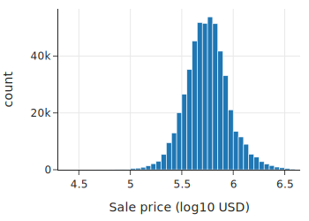

我们看到对数变换后的售价分布大致是对称的。现在我们对售价的分布有了一些了解，让我们考虑在上一节 EDA 指南中提出的“那又怎样”的问题。

### 6.6.2 接下来做什么？(What Next?)

我们已经描述了售价的形状，但我们需要考虑为什么形状很重要，并寻找分布可能不同的比较组。

形状很重要，因为基于对称分布的模型和统计量往往比基于高度偏斜分布的模型和统计量具有更稳健和稳定的性质。（我们在第 15 章介绍线性模型时会更多地解决这个问题。）因此，我们主要使用对数变换后的售价。我们也可能选择将分析限制在 400 万美元以下的售价，因为超昂贵的房子可能表现得非常不同。

至于可能的比较，我们看背景。房地产市场在这段时间内迅速上涨，然后市场崩溃。所以 2004 年的售价分布可能与 2008 年崩盘前的分布大不相同。为了进一步探索这个概念，我们可以检查价格随时间的变化。或者，我们可以固定时间，检查价格与其他感兴趣特征之间的关系。这两种方法都有价值。

我们将重点缩小到一年。我们将数据缩减为 2004 年的销售，这样价格上涨不仅对我们检查的分布和关系影响有限。为了限制非常昂贵和大型房屋的影响，我们还将数据集限制为售价低于 400 万美元且房屋小于 12,000 平方英尺。

```python
def subset(df):
    return df.loc[(df['price'] < 4_000_000) &
                  (df['bsqft'] < 12_000) & 
                  (df['timestamp'].dt.year == 2004)]

sfh = sfh_df.pipe(subset)
```

对于这些数据，售价分布的形状保持不变——价格仍然高度右偏。我们继续使用这个子集来解决是否有任何潜在的重要特征可以与价格一起研究的问题。

### 6.6.3 检查其他特征 (Examining Other Features)

除了售价这个主要关注点外，其他可能对我们调查很重要的特征还有房屋大小、地块（或财产）大小以及卧室数量。我们探索这些特征的分布以及它们与售价和彼此之间的关系。

由于房屋和地块的大小可能与价格有关，猜测这些特征也右偏是合理的，所以我们对建筑面积进行对数变换：

```python
sfh = sfh.assign(log_bsqft=np.log10(sfh['bsqft']))
```

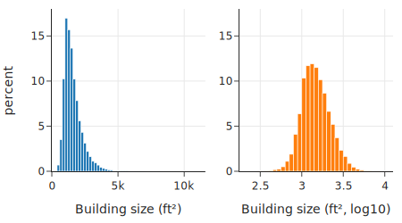

我们比较常规尺度和对数尺度上的建筑面积分布。分布是单峰的，峰值约为 1,500 平方英尺，许多房屋面积超过 2,500 平方英尺。我们证实了我们的直觉：对数变换后的建筑面积几乎是对称的，尽管它保持了轻微的偏斜。地块大小的分布也是如此。

鉴于房屋和地块大小都有偏斜分布，两者的散点图最有可能也应该在对数尺度上：

```python
sfh = sfh.assign(log_lsqft=np.log10(sfh['lsqft']))
# 绘制散点图比较（代码略，设想为左图原始，右图对数）
```

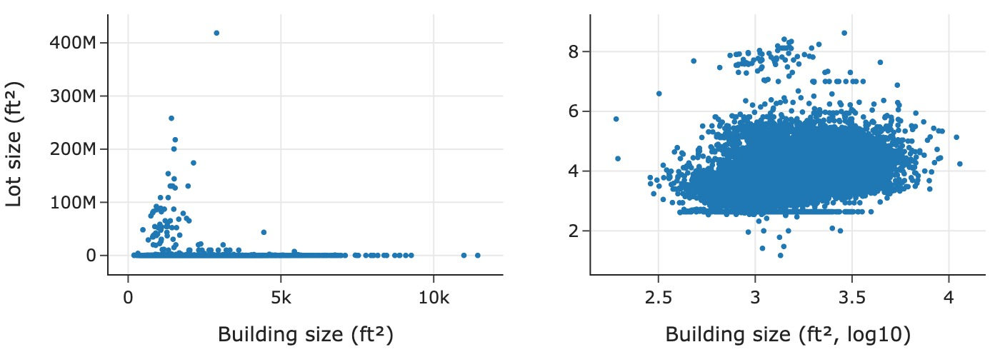

原始单位的散点图使得难以辨别关系，因为大多数点都挤在绘图区域的底部。相比之下，对数尺度的散点图揭示了一些有趣的特征：散点图底部有一条水平线，似乎许多房屋无论建筑面积大小如何，地块大小都相同；并且地块和建筑面积之间似乎存在轻微的正对数-对数线性关联。

让我们查看地块大小的一些较低分位数，试图弄清楚这个不寻常的值：

```python
# 0.5% 到 3% 的分位数
# 结果显示许多值为 436 ft^2
```

我们发现了一些有趣的事情：大约 2.5% 的房屋地块大小为 436 平方英尺。这太小了，几乎没道理，所以我们将这个异常记下来以备进一步调查。

另一个衡量房屋大小的指标是**卧室数量 (br)**。由于这是一个离散的定量变量，我们可以将其视为定性特征并制作条形图。条形图证实了我们的猜测：分布在 3 处达到峰值并向右偏斜。然而，我们发现有些房屋有超过 30 间卧室！这有点令人难以置信，指向了另一个可能的数据质量问题。

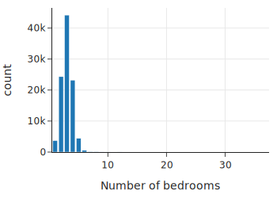

同时，我们只需将卧室数量转换为有序特征，将所有大于 8 的值重新分配为 8+：

```python
eight_up = sfh.loc[sfh['br'] >= 8, 'br'].unique()
sfh['new_br'] = sfh['br'].replace(eight_up, 8)
```

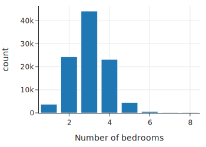

我们可以看到，即使将所有拥有8间或以上卧室的房屋归为一类，数量也并不多。卧室数量的分布近乎对称，峰值在3间卧室左右；拥有两间或四间卧室的房屋比例几乎相同，拥有一间或五间卧室的房屋比例也几乎相同。但也有少数房屋拥有六间或更多卧室，因此分布存在不对称性。

### 6.6.4 深入研究关系 (Delving Deeper into Relationships)

让我们从检查不同卧室数量房屋的价格分布变化开始。我们可以用箱线图来做这件事。中位数售价随着卧室数量从 1 增加到 5 而增加，但对于最大的房子（6 间及以上），对数售价的分布几乎相同。

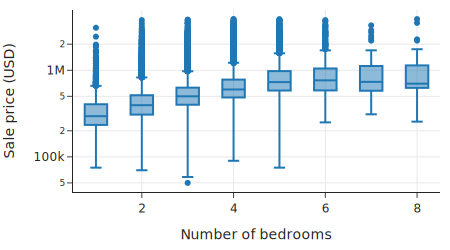

为了更深入地挖掘，我们考虑将价格除以建筑面积以得出**每平方英尺价格 (Price per Square Foot, PPSF)**。我们想看看这个特征是否对所有房屋都是恒定的；换句话说，价格主要由大小决定。

我们创建两个散点图：左图是价格对建筑面积（均为对数变换），右图是每平方英尺价格（对数变换）对建筑面积。左图显示了我们预期的——房子越大越贵。右图则显示了有趣的非线性：较小的房子每平方英尺成本比大房子高，而大房子的每平方英尺价格相对平坦。

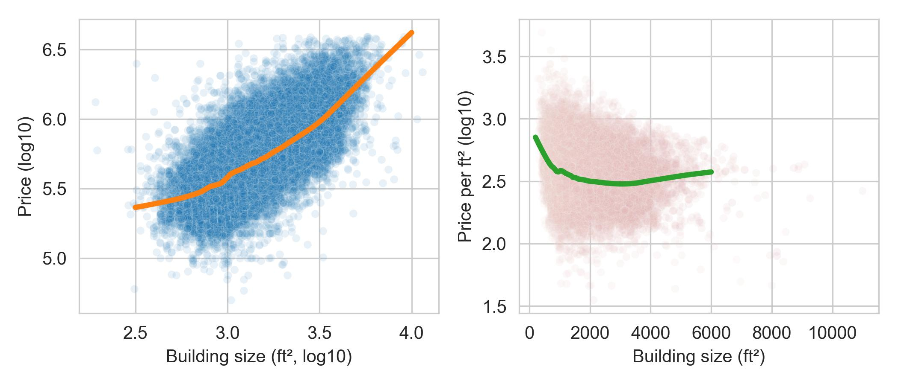

这一特征似乎很有趣，所以我们将每平方英尺价格变换保存到 `sfh` 中：

```python
def compute_ppsf(df):
    return df.assign(
    ppsf=df['price'] / df['bsqft'], 
    log_ppsf=lambda df: np.log10(df['ppsf']))

sfh = (sfh_df.pipe(subset).pipe(log_vals)
       .pipe(clip_br).pipe(compute_ppsf))
```

### 6.6.5 固定位置 (Fixing Location)

你可能听说过一句名言：房地产最重要的三件事是——**地段、地段、地段**。比较跨城市的价格可能会给我们的调查带来额外的见解。

我们检查旧金山湾区东湾的一些城市：Richmond, El Cerrito, Albany, Berkeley, Walnut Creek, Lamorinda, 和 Piedmont。箱线图显示 Lamorinda 和 Piedmont 的房价往往更贵，而 Richmond 最便宜，但许多城市的售价有重叠。

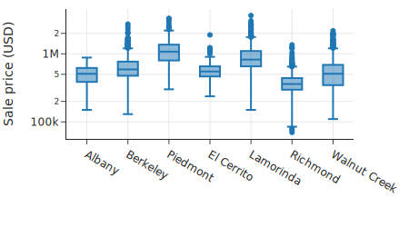

接下来，我们用分面散点图更仔细地检查每平方英尺价格和房屋大小之间的关系，四个城市各一张：

```python
four_cities = ["Berkeley", "Lamorinda", "Piedmont", "Richmond"]
fig = px.scatter(sfh.query("city in @four_cities"),
    x="bsqft", y="log_ppsf", facet_col="city", facet_col_wrap=2,
    labels={'bsqft':'Building size (ft^2)', 
            'log_ppsf': "Price per square foot"}, 
    trendline="ols", trendline_color_override="black",
)

fig.update_layout(xaxis_range=[0, 5500], yaxis_range=[1.5, 3.5],
                  width=450, height=400)
fig.show()
```

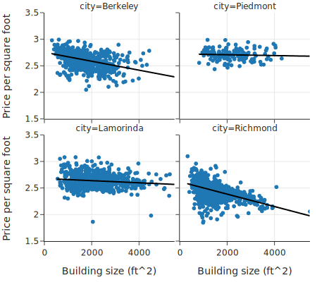

每平方英尺价格与建筑面积之间的关系大致是对数线性的，并且对于这四个地点中的每一个都呈负相关。虽然不是平行的，但似乎确实无论大小如何，房屋都有“位置”加成。例如，伯克利的房子每平方英尺比 Richmond 的房子贵约 250 美元。这些图支持了“地段，地段，地段”的格言。

在 EDA 中，我们经常回顾早期的图表，检查新发现是否为以前的可视化增加了见解。不断评估我们的发现并利用它们指导我们进一步的探索是很重要的。

### 6.6.6 EDA 发现 (EDA Discoveries)

我们的 EDA 发现了一些有趣的现象。简而言之，一些最显著的是：

1.  **右偏分布**：售价和建筑面积都呈高度右偏分布，且有一个模式。
2.  **非线性单价**：每平方英尺价格随建筑面积非线性下降，小房子每平方英尺成本高于大房子，而大房子的每平方英尺价格大致恒定。
3.  **地段溢价**：更理想的地段会增加售价，且这种增加对于不同大小的房子大致相同。

我们可以（也应该）进行许多额外的探索，还有几个检查要做。这包括调查地块大小为 436 的异常值，以及通过在线房地产应用程序交叉检查 30 间卧室和 2000 万美元豪宅等异常房屋。

我们把调查范围缩小到一年，后来又缩小到几个城市。这种缩小有助于我们**控制**可能干扰发现简单关系的特征。例如，由于数据是跨越几年收集的，销售日期可能会混淆售价和卧室数量之间的关系。在其他时候，我们想考虑时间对价格的影响。为了检查价格随时间的变化，我们经常制作折线图，并针对通货膨胀进行调整。我们将在后续章节重新审视这些数据，更仔细地观察时间趋势。

尽管简短，但这部分传达了 EDA 实际操作的基本方法。

下一章，我们将详细介绍[数据的可视化](07_数据可视化.md)。
