# 07. 数据可视化

作为数据科学家，我们创建数据可视化的目的主要有两个：**理解数据**和**解释分析**。一个好的图表应该传达明确的信息，而我们的工作就是尽可能清晰地传达这一信息。

## 核心原则

本章将讨论有效数据可视化的原则，使受众更容易掌握图表中的信息：

*   **选择合适的坐标轴刻度** (Choosing scales)
*   **处理大量数据** (Handling large amounts of data)：利用平滑 (smoothing) 和聚合 (aggregation) 技术。
*   **促进有意义的比较** (Facilitating meaningful comparisons)
*   **结合研究设计** (Incorporating study design)
*   **添加上下文信息** (Adding contextual information)

## 工具与方法

虽然可视化软件经常更新，但我们将重点放在广泛适用的**高层数据可视化原则**上，同时提供具体的代码实现。即使软件更新，这些原则仍然可以指导可视化的创建。

本章节将主要使用 Python 的 **plotly** 库进行演示。

## 1. 选择刻度以揭示结构 (Choosing Scale to Reveal Structure)

通过调整坐标轴的刻度、范围和比例，我们可以更好地揭示数据的分布形状和变量间的关系。

### 1.1 填充数据区域 (Filling the Data Region)

当大部分数据挤在图表的一小部分区域时（例如存在极值），数据的分布特征（如偏度、多峰）会被掩盖。

*   **策略**：调整坐标轴范围，排除异常大的观测值（在图表中注明），使数据主体填充绘图区域。这有助于更清晰地展示数据的实际分布。

```python
right_hist = px.histogram(sfh, x='price')
left_hist = px.histogram(sfh, x='price')
# We wrote the left_right function as a shorthand for plotly's make_subplots
fig = left_right(left_hist, right_hist, height=250)
fig.update_xaxes(range=[0, 2e6], title_text="Sale price (USD, under $2M)", row=1, col=1)
fig.update_xaxes(range=[2e6, 9e6], title_text="Sale price (USD, over $2M)", row=1, col=2)
fig.update_yaxes(range=[0, 10], row=1, col=2)
fig
```

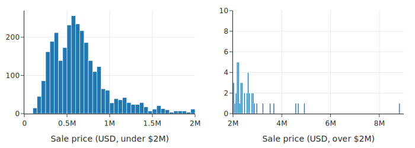

### 1.2 包含零点 (Including Zero)

是否在坐标轴上包含 0 取决于图表类型和目的：

*   **散点图 (Scatter Plots)**：通常**不需要**包含 0，尤其是当数据远离 0 时。包含 0 可能会导致大量空白区域，压缩数据展示空间，掩盖变量间的线性关系。
*   **条形图 (Bar Charts)**：**必须**包含 0。条形的高度代表数值，如果截断坐标轴，容易误导读者（例如夸大差异）。
*   **点图 (Dot Plots)** 与 **比例数据**：类似于条形图，包含 0 有助于准确比较类别大小或比例（0 到 1）。

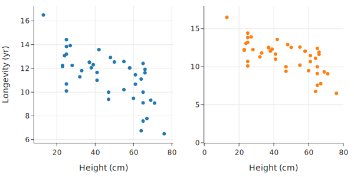

上面右侧的散点图在两个轴上都包含了 0。这使得数据被推到了数据区域的顶部，留下了空白区域，不利于我们观察线性关系。

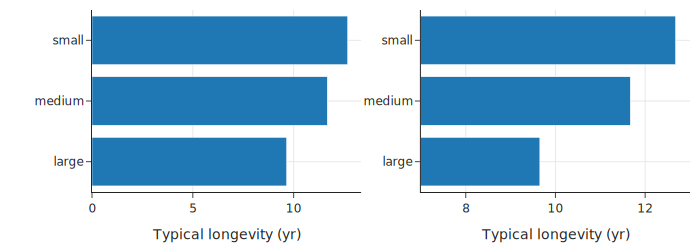

例如上图，如果不包含 0，从右侧的图表很容易得出错误的结论，即小型犬的寿命是大型犬的两倍。

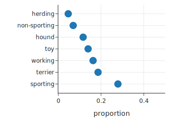

在处理比例时，我们通常也需要包含 0，因为比例的范围在 0 到 1 之间。


### 1.3 通过变换揭示形状 (Revealing Shape Through Transformations)

对于偏态分布（Skewed Data），线性刻度往往难以展示细节。

*   **对数变换 (Log Transformation)**：也就是 "Log Scale"。
    *   可以让长尾分布变得更对称，揭示隐藏的模式（如次级波峰）。
    *   变换坐标轴（Log Axis）比变换数据本身更直观，因为坐标轴保留了原始单位。
    *   也可以用于散点图，将大数值拉向中心，揭示跨越多个数量级的变量之间的关系。

```python
sfl = sfh.assign(log_price=np.log10(sfh['price']))

orig = px.histogram(sfl, x='price', nbins=100,
                    width=350, height=250)
logged = px.histogram(sfl, x='log_price', nbins=50, 
                      width=350, height=250)

fig = left_right(orig, logged)
fig.update_xaxes(title_text='Sale price (USD)', row=1, col=1)
fig.update_xaxes(title_text='Sale price (USD log10)', row=1, col=2)
fig.show()
```
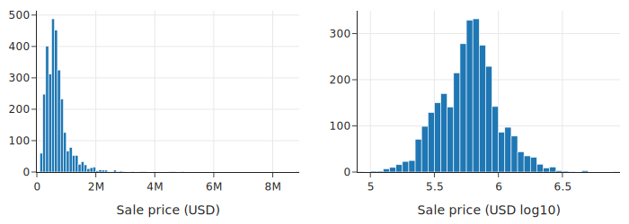

对数变换还可以揭示散点图的形状。这里，我们以建筑物面积为 x 轴，地块面积为 y 轴绘制了散点图。由于许多点都集中在数据区域的底部，因此很难看出该图的形状：

```python
px.scatter(sfh, x='bsqft', y='lsqft', 
           labels={"bsqft": "Building size (sq ft)",
                    "lsqft": "Lot size (sq ft)"},
           width=350, height=250)
```

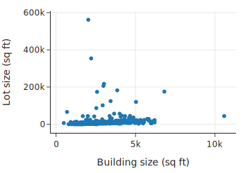

但是，当我们对 x 轴和 y 轴都使用对数刻度时，这种关系的形状就更容易看清了：

```python
px.scatter(sfh, x='bsqft', y='lsqft',
           log_x=True, log_y=True, 
           labels={"bsqft": "Building size (sq ft)",
                   "lsqft": "Lot size (sq ft)"},
           width=350, height=250)
```

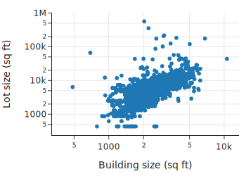

通过坐标轴变换，我们可以看到地块面积与建筑面积（​​对数坐标）大致呈线性关系。对数变换将较大的值——比其他值大几个数量级的值——向中心靠拢。这种变换有助于填充数据区域并揭示隐藏的结构，正如我们在房价分布以及房屋面积与地块面积的关系中所看到的那样。

### 1.4 倾斜以解读关系 (Banking to Decipher Relationships)

*   **Banking to 45 degrees**：调整图表的长宽比（Aspect Ratio），使数据点的趋势大致沿着 45 度线分布。这种比例最符合人眼识别偏差的习惯，能帮助我们更容易地发现数据是否遵循线性关系或存在异常。

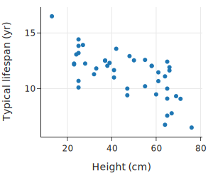

将图像倾斜 45 度有助于我们判断数据是否呈线性关系，但当数据呈现明显的曲线时，就很难确定其关系的具体形式。此时，我们可以尝试进行一些变换，使数据点落在一条直线上。对数变换有助于揭示曲线关系的一般形式。

### 1.5 通过“拉直”揭示关系 (Revealing Relationships Through Straightening)

当两个变量呈非线性关系（曲线）时，难以判断其具体形式。通过对轴进行对数变换，可以尝试将曲线“拉直”为直线，从而推断变量间的数学关系。

例如，这里我们绘制了不同犬种的身高与体重的关系图：

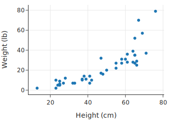

我们发现个子高的狗体重更重，但这种关系并非线性关系。

当两个变量之间看似存在非线性关系时，尝试对 x 轴、y 轴或两者都应用对数刻度会很有帮助。让我们在变换坐标轴后的散点图中寻找线性关系。这里我们重新绘制了犬种体重与身高的关系图，但这次我们对 y 轴应用了对数刻度：

```python
px.scatter(dogs, x='height', y='weight', log_y=True,
           labels={"height": "Height (cm)", "weight": "Weight (lb)"},
           width=300, height=300)
```

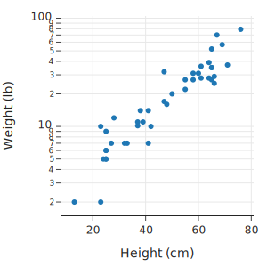


| X轴变换 | Y轴变换 | 关系类型 (Relationship) | 别名 (Also known as) |
| :--- | :--- | :--- | :--- |
| 无 (Linear) | 无 (Linear) | Linear: $y = a + bx$ | Linear |
| 对数 (Log) | 无 (Linear) | Log: $y = a + b \log_{10}(x)$ | Linear-Log |
| 无 (Linear) | 对数 (Log) | Exponential: $\log_{10}(y) = a + bx$ | Log-Linear |
| 对数 (Log) | 对数 (Log) | Power: $\log_{10}(y) = a + b \log_{10}(x)$ | Log-Log |

*   **Log-Linear**：单轴对数变换，揭示指数关系。
*   **Log-Log**：双轴对数变换，揭示幂律关系 (Power Law) 或多项式关系。

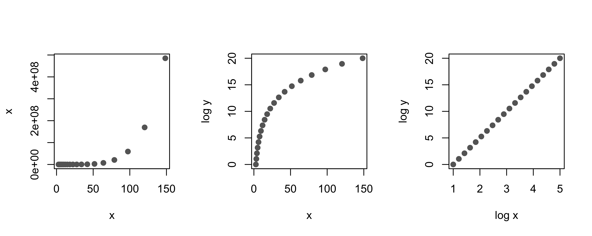
图 11.1：对数变换如何将曲线关系“拉直”为线性关系。

## 2. 平滑与聚合数据 (Smoothing and Aggregating Data)

当数据量很大时，许多点会重叠在一起（Overplotting），导致我们无法看清数据的分布和关系。为了解决这个问题，我们可以使用平滑（Smoothing）和聚合（Aggregation）的技术。

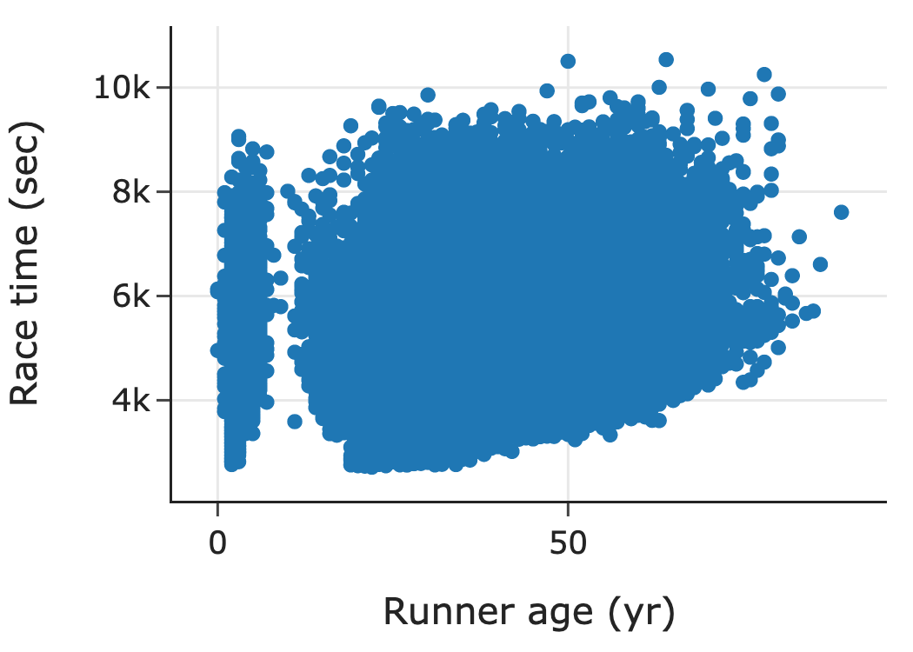

### 2.1 揭示形状的平滑技术 (Smoothing Techniques to Uncover Shape)

*   **直方图 (Histogram)**：最常见的平滑技术，将数据聚合到不同的“箱子”（Bins）中，每个箱子的高度代表该范围内数据的数量或比例。
*   **Rug Plot**：在坐标轴边缘绘制每条数据的细线。对于少量数据，它可以展示具体位置；但对于大量数据，它会严重重叠。
*   **核密度估计 (Kernel Density Estimation, KDE)**：使用平滑曲线代替柱状图来展示分布形状。它类似于直方图，但更平滑。

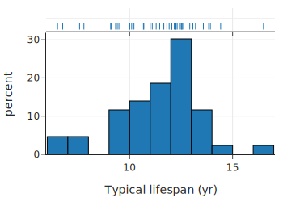

*直方图与 Rug Plot 结合，Rug Plot 显示了数据点的具体位置，而直方图展示了整体分布。*

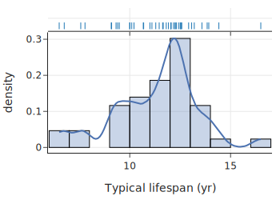

*KDE 曲线（蓝色）与直方图叠加，展示了平滑后的分布形状。*

### 2.2 揭示关系与趋势的平滑技术 (Smoothing Techniques to Uncover Relationships and Trends)

对于散点图中的重叠问题，我们可以使用类似的方法：

*   **六边形分箱图 (Hexbin Plot)**：类似于二维的直方图。将平面划分为六边形区域，根据落入每个区域的点的数量进行着色。颜色越深，密度越高。
*   **二维 KDE (2D KDE)**：类似于等高线地图（Topographical Map）。展示了数据点的高密度区域（类似山峰）。
*   **分箱均值 (Binning and Averaging)**：将 x 轴分段（例如每 5 岁一组），计算每组中 y 值（如跑步时间）的平均值，然后连接这些均值点。这能清晰地揭示 x 与 y 之间的变化趋势。

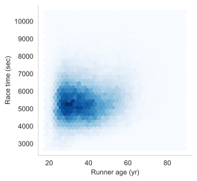

*六边形分箱图：深色区域表示跑步者集中的年龄段（25-40岁）和完赛时间。*

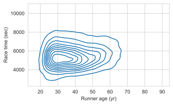

*二维 KDE 图：等高线展示了数据的高密度核心区域。*

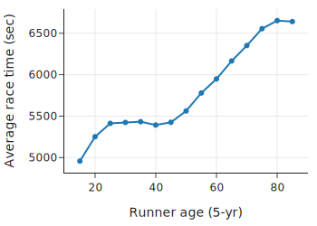

*分箱均值图：清晰地展示了跑步时间随年龄变化的趋势（年轻和年长跑者较慢，中年跑者较快）。*

分箱和核平滑技术依赖于一个调优参数，该参数指定了箱的宽度或核的扩展范围。我们在绘制直方图、核密度估计 (KDE) 或平滑曲线时，通常需要指定此参数。这将是下一节的主题。

### 2.3 平滑技术的调优 (Smoothing Techniques Need Tuning)

平滑技术通常需要调整参数：

*   **直方图**：箱体宽度 (Bin Width) 或数量。
*   **KDE**：带宽 (Bandwidth)。
*   **影响**：
    *   **过宽/带宽过大**：过度平滑 (Over-smoothed)，丢失重要细节（如多峰结构）。
    *   **过窄/带宽过小**：平滑不足 (Under-smoothed)，包含过多噪声。
    需要尝试不同的参数值，找到最能反映数据特征的平衡点。

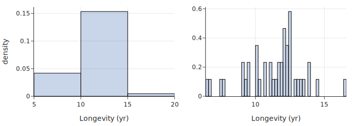

*左图过度平滑，丢失了分布形状；右图平滑不足，近似于 Rug Plot。*

### 2.4 将分布简化为分位数 (Reducing Distributions to Quantiles)

当比较两个分布时，除了直方图，我们还可以使用分位数（Quantiles）：

*   **箱线图 (Box Plot)**：基于四分位数（25%, 50%, 75%）展示分布，便于比较多个组的中心和离散程度。
*   **Q-Q 图 (Quantile-Quantile Plot)**：将两个分布的分位数对应画在散点图上。
    *   **y = x 线**：如果点落在直线上，说明两个分布形状相似。
    *   **平行线**：中心位置平移。
    *   **斜率不同**：离散程度不同。
    *   **弯曲**：形状不同（如尾部更长）。

当两个分布形状大致相似时，很难用直方图进行比较。例如，下面的直方图显示了旧金山住房数据中两居室和四居室房屋的价格分布。这些分布的形状看起来大致相似。但是，绘制它们的分位数图可以方便地比较分布的中心、离散程度和尾部

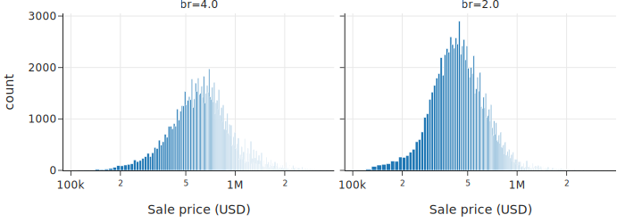

然后，我们将匹配的百分位数绘制在散点图上。我们通常还会显示参考线 y = x，以帮助进行比较。

当分位数点落在一条线上时，这些变量的分布形状相似。与参考线平行的线表示中心位置不同；斜率不为 1 的线表示离散程度不同；曲线则表示形状不同。

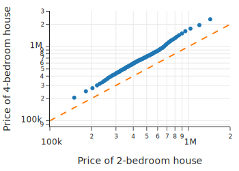

### 2.5 何时不应平滑 (When Not to Smooth)

平滑适合大量数据。当数据量很少（如少于几十个点）时，平滑会产生误导。

*   **避免使用箱线图**：对于极少量样本（如每组 2-3 个），箱线图会掩盖样本量过少的事实，并暗示不存在的分布形状。
*   **推荐使用 Strip Plot**：直接展示所有数据点。
*   **Jittering (抖动)**：如果点重叠（例如数值被取整），可以给数据点加上微小的随机噪声，使其错开，从而看清重叠的点数。

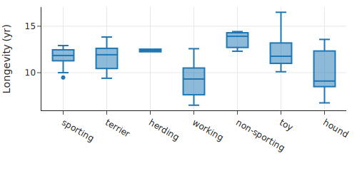

*样本量极少时，箱线图可能产生误导。*

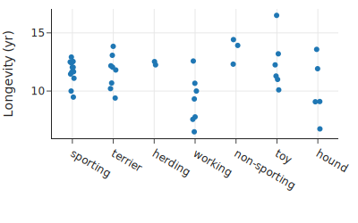

*Strip Plot 清晰展示了每组的实际数据点数量和位置。*

## 3. 促进有意义的比较 (Facilitating Meaningful Comparisons)

好的图表应该帮助读者进行有意义的比较。以下原则可以提高图表的清晰度。

### 3.1 强调重要差异 (Emphasize the Important Difference)

在比较不同组别时，确保图表设计突出了你想要强调的差异。

*   **对齐方式**：将要比较的元素对齐，比分散排列更容易比较。
*   **示例**：
    *   **并列条形图 (Grouped Bar Chart)**：如果在同一教育水平下比较男女收入，将男女的条形放在一起比分开展示更好。
    *   **点图 (Dot Plot)**：相比条形图，**垂直对齐**的点图能更清晰地展示同一类别下不同组别的差距（如教育水平增加时，男女收入差距扩大）。

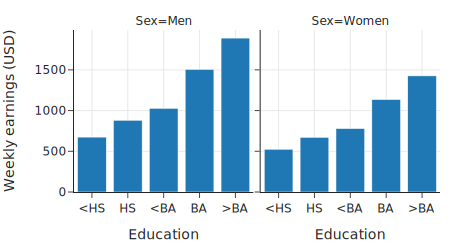

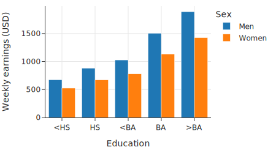

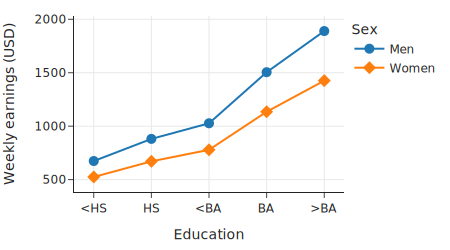

*点图通过垂直对齐，清晰展示了随教育程度提高，男女收入差距扩大的趋势。*

我们考虑了三张可视化相同数据的图表，但它们在图表信息的清晰度上有所不同。我们更倾向于最后一张图，因为它将收入差异垂直排列，使比较更加容易。

### 3.2 组别排序 (Ordering Groups)

*   **有序特征 (Ordinal Features)**：保持其自然顺序（如教育程度：小学 -> 中学 -> 大学）。
*   **名义特征 (Nominal Features)**：没有固有顺序（如城市、犬种）。**原则**：根据数值大小（如平均寿命、中位数房价）进行排序，而不是按字母顺序。这样可以更容易地比较各组的大小和分布。

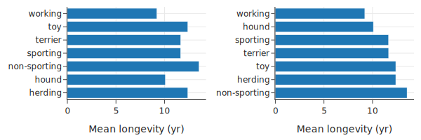

*右图按平均寿命排序，比左图按字母排序更易于比较。*

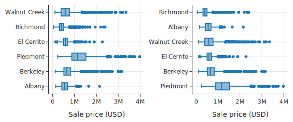

*右图按中位数房价排序，各城市的房价分布高低一目了然。*

如果可能，在条形图中按高度对条形进行排序，在箱线图中按中位数对箱体进行排序，可以更方便地进行组间比较。

### 3.3 避免堆叠 (Avoid Stacking)

*   **堆叠条形图 (Stacked Bar Plots)**：虽然能展示比例，但在比较非底层（基线不在此）的段落时非常困难。因为基线在“抖动” (Jiggling the baseline)，我们的眼睛很难准确判断长度差异。
*   **堆叠面积图/线图 (Stacked Line Plots)**：同样存在基线抖动问题，难以观察单个类别的变化趋势或进行相互比较。
*   **建议**：
    *   使用**非堆叠**的线条（可以用颜色区分）。
    *   使用对数刻度（如果数据跨度大）。
    这样每个类别的基线都是平直的 x 轴，只需比较 y 轴高度即可。

图中每个条形的高度都相同，均为 1，因为这些条形代表城市中拥有一个或多个卧室的房屋的比例，因此加起来等于 1 或 100%：

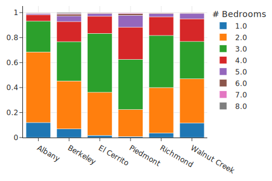

*堆叠条形图难以准确比较非底层的段落长度。*

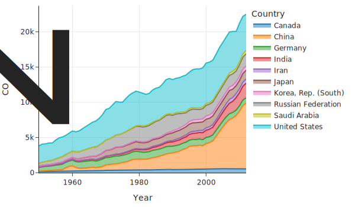

*堆叠面积图难以比较各国的排放量变化。*

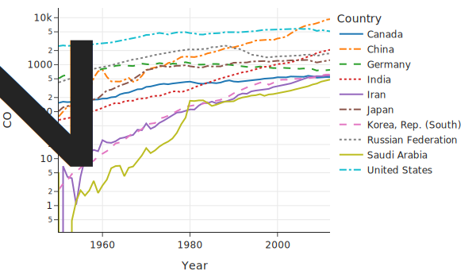

*非堆叠线图（配合对数刻度）清晰展示了各国排放量的具体趋势和比较。*

### 3.4 选择调色板 (Selecting a Color Palette)

颜色应传达信息，不应滥用。

*   **避免**：过于刺眼或过暗的颜色；对色盲不友好的配色（如红绿混用）。
*   **分类数据 (Categorical)**：使用**定性 (Qualitative)** 调色板，颜色之间区分度高，无明显顺序。
*   **数值数据 (Numeric)**：
    *   **顺序 (Sequential)**：颜色渐变（浅到深），强调大值或小值（如癌症率）。
    *   **发散 (Diverging)**：两种对比色从中间向两端加深，强调两极（如选举结果）。
*   **感知均匀 (Perceptually Uniform)**：数值翻倍时，颜色的感知强度也应翻倍。

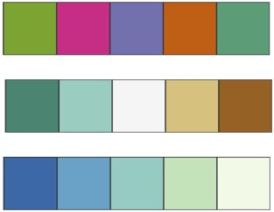

*图 11.2：ColorBrewer 提供的三种调色板：定性（上）、发散（中）、顺序（下）。*

### 3.5 图表比较指南 (Guidelines for Comparisons in Plots)

研究表明，人类对不同视觉编码的感知准确度从高到低依次为：

1.  **沿通用刻度的位置 (Positions along a common scale)**：如散点图、点图。
2.  **沿相同但不相关刻度的位置 (Positions on identical, nonaligned scales)**：如分面散点图。
3.  **长度 (Length)**：如条形图。
4.  **角度与斜率 (Angle and slope)**：如饼图。
5.  **面积 (Area)**：如气泡图。
6.  **体积与密度 (Volume and density)**：如3D图。
7.  **颜色饱和度与色调 (Color saturation and hue)**：如热力图。

**总结**：

尽量使用**位置**和**长度**来进行比较。避免使用饼图（角度难以判断），除非只有很少的切片。

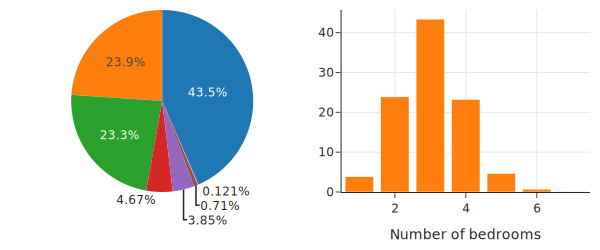

*条形图（长度）比饼图（角度）更容易准确读取比例和排序。*

## 4. 结合研究设计 (Incorporating the Data Design)

创建可视化时，必须考虑数据的来源和收集方式（Data Scope）。这些因素决定了我们应该如何展示数据以及如何得出一个有效的结论。

### 4.1 时间序列数据 (Data Collected Over Time)

对于随时间收集的数据，通常使用线图，时间作为 x 轴。

*   **通胀调整 (Inflation Adjustment)**：涉及货币的时间序列（如跨越多年的房价），通常需要根据通货膨胀率进行调整，以保持比较的公平性。
*   **基准化 (Normalization)**：将所有线条的起始点设为同一基准（如 "相对于 2003 年的价格"），可以清晰展示不同组别随时间变化的相对幅度。

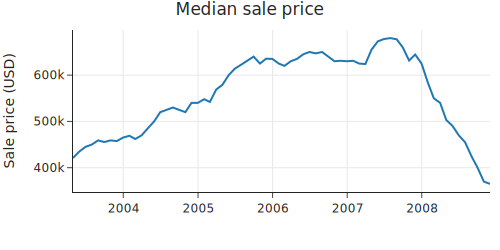

*中位数房价随时间的变化。*

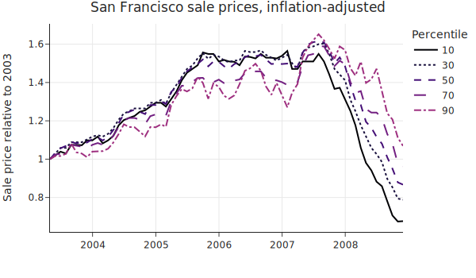

*从图中可以看出，低价位（10th percentile）房屋在崩盘中受到的冲击最大，而高价位房屋受到的影响较小。*

### 4.2 观察性研究 (Observational Studies)

观察性数据（非普查或科学抽样）需要格外小心。

*   **横截面研究 (Cross-Sectional vs. Longitudinal)**：
    *   **误区**：从横截面数据（同一时间点不同年龄的人）推断纵向趋势（同一个人随年龄的变化）。
    *   **示例**：跑步时间随年龄变化的图表是横截面的。60 岁的跑步者和 40 岁的跑步者是不同的人群（60 岁的可能本身就是更健康的幸存者或长期坚持者）。因此，不能简单得出“一个人变老后跑步速度会按此曲线下降”的结论。
*   **队列效应 (Cohort Effect)**：不同年份的参与者群体可能不同。例如，随着比赛知名度提高，更多新手参与，导致整体成绩下降。分年份绘制线图可以揭示这种变化。

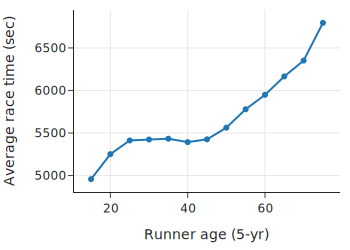

*横截面数据可能导致对个体变化的错误推断。*

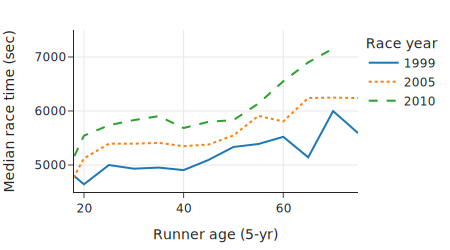

*分年份绘制显示，2010 年的跑步者在各个年龄段都比 1999 年的更慢，暗示了参与者群体的变化。*

### 4.3 不等概率抽样 (Unequal Sampling)

在科学抽样（如调查）中，如果抽样是不等概率的（例如某些群体被过度抽样），则必须使用**采样权重 (Sampling Weights)**。

*   **忽略权重的后果**：会导致对分布的有偏估计。例如，未加权的图表可能夸大了“其他”类别的急诊访问比例，而加权后的图表则还原了真实的人口比例。

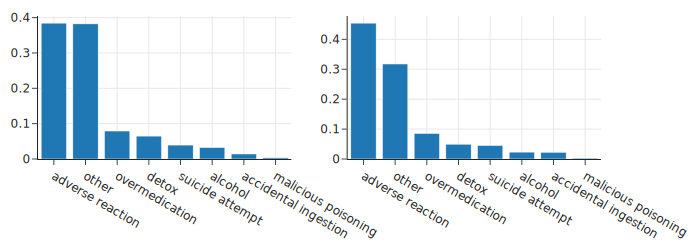

*左图未加权，右图加权。忽略权重会导致对总体分布的错误认识。*

### 4.4 地理数据 (Geographic Data)

当数据包含地理信息（经纬度）时，地图是必不可少的工具。

*   简单的直方图可能会掩盖数据的空间分布特征（如某些地区数据点密集）。
*   **建议**：结合地图展示位置，并利用颜色、大小或分面（Facet）来展示特定区域的数据分布。

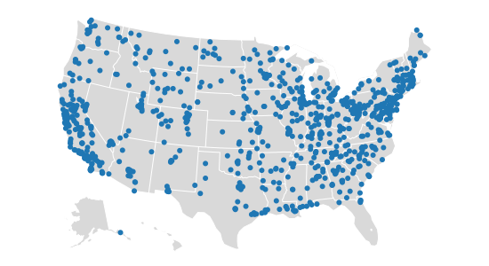

*地图揭示了数据点在地理上的不均匀分布（如集中在加州和东海岸），这是简单统计图无法体现的。*

## 5. 添加上下文信息 (Adding Context)

一个好的图表应该包含足够的上下文信息，使其能够**独立存在** (Stand Alone)。读者不需要寻找额外的解释就能理解图表的主旨。

### 5.1 文本与标签 (Text and Labels)

*   **轴标签 (Axis Labels)**：应包含测量单位及清晰的物理意义。
*   **标题 (Titles)**：直接陈述图表的主要结论或所绘内容。
*   **图例 (Legends)**：当图表包含多个系列时，图例是必须的。
*   **说明文字 (Captions)**：描述图表内容、指出重要特征并评论其含义。读者往往只看图和标题，因此说明文字应自成一体。

### 5.2 参考标记 (Reference Markers)

*   **参考线 (Reference Lines)**：
    *   在 Q-Q 图中添加 $y=x$ 线。
    *   在时间序列图中添加垂直线标记特殊事件（如政策颁布、自然灾害）。
    *   添加水平线标记基准值（如平均值、目标值、阈值）。
*   **注释 (Annotations)**：直接在图表中标记关键数据点（如最大值、最小值、异常值）。

### 5.3 案例：100米短跑成绩

我们从一个基本的散点图开始，展示自 1968 年以来男子 100 米短跑中跑进 10 秒的成绩。

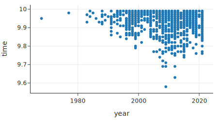

为了使图表达到发布标准，我们添加了上下文：

1.  **标题**：不仅是 "Race Times vs Year"，而是直接陈述结论（如 "The 100m Sprint is Getting Faster"）。
2.  **轴标签**：明确单位。
3.  **参考线**：在 10 秒处添加水平线，说明这是进入门槛。
4.  **注释**：特别标记了 Usain Bolt 的世界纪录 (9.58s) 和第二好成绩，吸引读者注意。

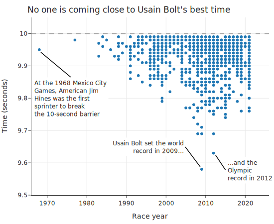

*添加上下文后的图表：清晰传达了选手成绩逐年提高以及博尔特纪录的不可撼动。*

人们往往记住了图表，而不是大段的文字或公式。为图表添加充分的上下文，是数据可视化的重要一步。

## 6. 使用 plotly 创建图表 (Creating Plots Using plotly)

`plotly` 是本书主要使用的 Python 绘图库。与静态图像库不同，它创建的是**交互式图表**，支持缩放、平移和悬停查看数据。此外，它还支持导出矢量图 (SVG) 格式。我们将主要使用简洁的 `plotly.express` 接口 (通常导入为 `px`)。

### 6.1 Figure 和 Trace 对象 (Figure and Trace Objects)

在 `plotly` 中，每个图表都被封装在一个 **Figure** 对象中。

*   **Figure**：负责管理绘图内容（如散点图、线图）和布局（如标题、图例、尺寸）。
*   **Trace**：实际的数据系列（一优曲线、一组点等）。
*   **plotly.express**：提供高级 API，函数返回的就是 Figure 对象。

```python
import plotly.express as px

fig = px.scatter(
    dogs, x="height", y="weight",
    labels=dict(height="Height (cm)", weight="Weight (kg)"),
    width=350, height=250,
)
fig.show() # 显示图表
```


### 6.2 修改布局 (Modifying Layout)

虽然 `px` 能自动生成布局，但我们经常需要通过 `update_layout`、`update_xaxes` 和 `update_yaxes` 方法进行微调。

*   **update_layout()**：修改全局布局属性，如标题、边距 (margins)、图例显示等。
*   **update_xaxes() / update_yaxes()**：修改坐标轴属性，如范围 (range)、刻度数量 (nticks)、轴标签 (title) 等。

```python
fig.update_layout(margin=dict(t=40)) # 增加顶部边距，防止标题被截断
fig.update_yaxes(range=[5, 18], title="Typical lifespan (yr)")
fig.update_xaxes(title="Average weight (kg)")
```

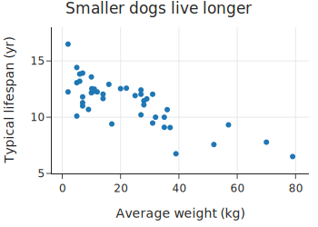

### 6.3 常用绘图函数 (Plotting Functions)

`plotly.express` 提供了丰富的绘图函数，API 设计非常统一：第一个参数是 DataFrame，然后通过 `x` 和 `y` 参数指定列名。

*   **基本图表**：
    *   `px.line()`：线图
    *   `px.scatter()`：散点图
    *   `px.bar()`：条形图
    *   `px.box()`：箱线图
    *   `px.histogram()`：直方图

*   **分面 (Faceting)**：
    *   **颜色/符号**：在同一图表中区分组别。`color='col_name'`, `symbol='col_name'`。
    *   **子图 (Subplots)**：将组别分开放置。`facet_col='col_name'`, `facet_row='col_name'`。

```python
# 使用颜色和符号进行分面
fig = px.scatter(dogs, x='height', y='weight', 
                 color='size', symbol='size',
                 labels=dict(height="Height (cm)", weight="Weight (kg)", size="Size"))
```
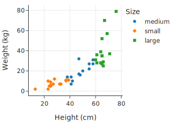

```python
# 使用列分面
fig = px.histogram(dogs, x='longevity', facet_col='size')
```
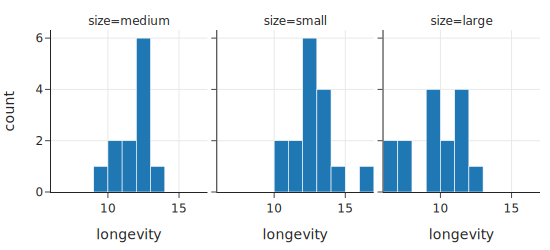

### 6.4 注释 (Annotations)

使用 `Figure.add_annotation()` 添加文本和箭头，用于标记特定数据点或提供额外说明。

```python
fig.add_annotation(text='Chihuahuas live 16.5 years on average!',
                   x=2, y=16.5, # 箭头指向的坐标
                   ax=30, ay=5,   # 文本偏移量
                   xshift=3, xanchor='left')
```
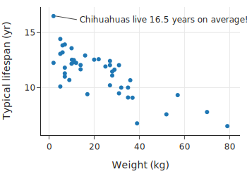

## 7. 其他可视化工具 (Other Tools for Visualization)

虽然本书主要使用 `plotly`，但了解其他常用工具也是很有价值的。

### 7.1 matplotlib & seaborn

*   **matplotlib**：Python 最早、最广泛使用的绘图库。生态系统庞大，`pandas` 内置绘图功能即基于此。适合创建静态图像。
*   **seaborn**：建立在 matplotlib 之上，提供更简洁的 API 用于统计绘图（如带置信区间的点图）。其 API 设计曾启发了 `plotly`。
*   **对比**：
    *   **优点**：社区庞大，资源丰富，适合静态出版物。
    *   **缺点**：通常生成静态图片，缺乏交互性（缩放、悬停）。
    *   *注：本书部分图表使用 seaborn/matplotlib 制作，因为 plotly 暂不支持某些特定类型的图表。*

### 7.2 图形语法 (Grammar of Graphics)

*   **理论基础**：由 Lee Wilkinson 提出，将图表分解为“几何对象”、“标度”、“坐标系”等基本组件。例如，条形图和点图的区别仅在于几何对象（矩形 vs 点）。
*   **实现**：
    *   **R 语言**：`ggplot2`
    *   **JavaScript**：`Vega`
    *   **Python**：`Vega-Altair` (基于 Vega)
*   **Vega-Altair**：
    *   **优点**：极其灵活，支持交互，基于图形语法理论。
    *   **缺点**：API 可能比 `plotly` 稍显复杂。
*   **选择理由**：本书选择 `plotly` 是因为它在交互性和 API 易用性之间取得了良好的平衡，足以满足大多数数据分析需求。

## 8. 总结 (Summary)

数据可视化是一个**迭代**的过程。我们通过创建图表来发现模式，然后不断调整或更换图表类型以更清晰地传达信息。

本章涵盖了做出这些决策的核心原则：
1.  **刻度 (Scale)**：通过调整和变换坐标轴揭示隐藏的数据结构。
2.  **平滑与聚合 (Smoothing and Aggregating)**：处理大量数据，解决重叠问题。
3.  **比较 (Comparisons)**：利用其感知原则（如对齐基线），使比较更有意义。
4.  **数据设计 (Data Design)**：考虑数据的收集背景，避免误导。
5.  **上下文 (Context)**：添加标题、标签和注释，帮助读者理解。

请记住，没有一步到位的完美图表。我们需要耐心地迭代、完善，最终挑选出最能有力支撑我们分析结论的图表呈现给受众。

下一章我们将通过一个[实例](./08_案例研究.md)来实践我们此前章节中学到的知识。