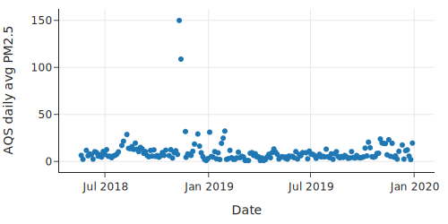
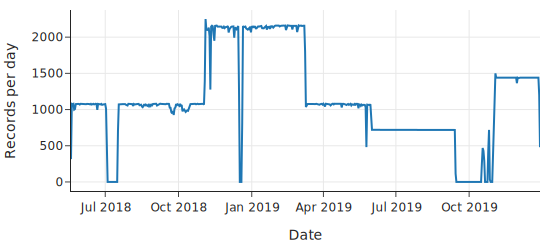
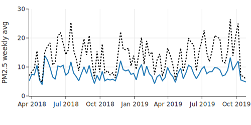
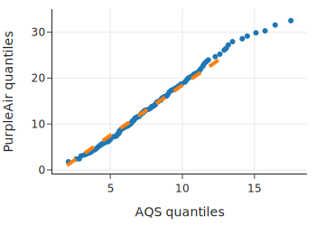
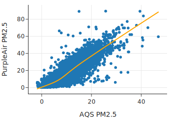

# 08. 案例研究：空气质量测量的准确性

本章将通过一个完整的案例研究——**校准空气质量传感器数据**，来回顾和综合应用前面（01-07章）所学的数据科学知识。

## 背景

加利福尼亚州经常遭受野火的侵袭，导致空气质量急剧下降。居民需要根据空气质量决定是否通过佩戴口罩、使用空气过滤器或减少外出来进行防护。

在通过数据解决问题之前，我们首先需要了解可用的数据源及其特点。

## 数据源对比

在本案例中，我们将对比两种主要的空气质量数据源：

| 特性 | **AQS (空气质量系统)** | **PurpleAir** |
| :--- | :--- | :--- |
| **运营方** | 美国政府 (EPA) | 私人/社区 (众包) |
| **精度** | **黄金标准** (Gold Standard)，严格校准 | **较低**，使用简易计数方法，倾向于高估污染程度 |
| **成本** | 昂贵 ($15,000 - $40,000) | 便宜 (~$250) |
| **密度** | 稀疏，站点少 | 密集，成千上万个家庭安装 |
| **时效性** | 滞后 1-2 小时 (经过校准处理) | **实时** (每2分钟更新) |
| **总结** | **准确但不及时** | **及时但不准确** |

## 目标与流程

**目标**：利用高精度的 AQS 数据来校准和改进及时性好的 PurpleAir 数据。

这项工作遵循 Karoline Barkjohn 等人（美国环保署）的研究思路。目前，美国政府的官方地图（如 AirNow Fire and Smoke map）已经采用了这种校准方法。

我们将按照**数据科学生命周期**进行操作，这也是对全书内容的实战复习：

1.  **问题与范围** (Question & Scope)：确立利用 AQS 校准 PurpleAir 的目标。
2.  **数据清洗与整理** (Cleaning & Wrangling)：这是最耗时的部分，需要处理脏数据、格式转换等。
3.  **探索性数据分析** (EDA)：通过可视化理解数据特征。
4.  **建模** (Modeling)：建立数学模型进行修正，以提高泛化能力。

接下来，我们将从数据的获取和设计范围开始。

## 1. 问题、设计与范围 (Question, Design, and Scope)

### 1.1 问题提出

理想的空气质量监测应兼顾**准确性**与**时效性**：
*   **不准确**：偏差的测量可能导致人们忽视风险或甚至产生不必要的恐慌。
*   **不及时**：滞后的警报会让人们暴露在有害空气中。

我们的核心问题是：**能否利用 AQS 的高质量数据来改进 PurpleAir 传感器的测量结果？**

### 1.2 数据范围与设计思路

我们拥有：

*   少量的 AQS 数据（可视为 **Ground Truth**，由于其误差极小且无明显偏差）。
*   海量的 PurpleAir 数据（可获取成千上万个传感器，但存在偏差和较大的变异性）。

**设计思路**：

1.  **配对 (Pairing)**：基于地理位置，寻找距离相近的 AQS 和 PurpleAir 传感器对。假设它们测量的是相同的空气样本。
2.  **建模 (Modeling)**：以 AQS 数据为基准，研究 PurpleAir 测量的变化规律。
3.  **泛化 (Generalization)**：如果我们发现了简单的数学关系（如线性关系），就可以将此模型应用于所有其他的 PurpleAir 传感器，修正其读数，使其更接近真实值。

这是一个典型的**结合大小数据集**的案例：利用少量精准数据（AQS）去校准大量粗糙数据（PurpleAir），从而放大整个网络的效用。这就好比利用基准仪器去校准全城的温度计。

接下来的章节，我们将开始数据整理工作，重点关注 **PM2.5**（直径小于 2.5 微米的颗粒物），这是对健康危害最大且随木柴烟雾最为常见的污染物。

## 2. 寻找共址传感器 (Finding Collocated Sensors)

我们的第一步是找到位置几乎重合（Collocated）的 AQS 和 PurpleAir 传感器。

*   **目的**：控制变量。如果两个传感器紧挨着（例如在公园里），它们接触到的空气样本应极其相似。任何读数差异都可归因于传感器本身的构造或微小的局部波动，排除了环境差异（如一个在公园，一个在高速路旁）的干扰。
*   **标准**：参照 Barkjohn (EPA) 的研究，我们寻找距离在 **50米** 以内的传感器对。

### 2.1 整理 AQS 站点数据 (Wrangling the List of AQS Sites)

1.  **加载数据**：读取 `list_of_aqs_sites.csv`。
2.  **检查粒度 (Granularity)**：
    *   发现 `AQS_Site_ID` 有重复，说明每行代表一个**仪器**（Instrument）而非站点（Site）。一个站点可能有多个测量 PM2.5 的仪器。
    *   **处理**：我们只关心站点位置，因此按 `AQS_Site_ID` 分组并取第一行，将粒度调整为**站点级别**。
3.  **筛选列**：仅保留 `site_id`, `lat` (纬度), `lon` (经度)。

```python
# 代码逻辑示意
aqs_sites = (aqs_sites_full
             .pipe(rollup_dup_sites) # 按站点ID去重
             .pipe(cols_aqs))        # 只保留ID和经纬度
```

### 2.2 整理 PurpleAir 站点数据 (Wrangling the List of PurpleAir Sites)

1.  **加载数据**：读取 `list_of_purpleair_sensors.json`。
    *   这是一个 JSON 文件，包含 `fields` (列名) 和 `data` (数据值)。需要解析 JSON 并转换为 DataFrame。
2.  **检查粒度**：
    *   检查 `ID` 列，发现无重复值。确认粒度为**单个传感器**。
3.  **筛选列**：保留 `id`, `label`, `lat`, `lon`。

```python
# 代码逻辑示意
pa_sites = pd.DataFrame(pa_json['data'], columns=pa_json['fields'])
pa_sites = pa_sites.pipe(cols_pa) # 只保留必要列
```

### 2.3 匹配传感器 (Matching AQS and PurpleAir Sensors)

我们需要找出距离小于 50 米的传感器对。仅靠 `pandas` 的 `merge` 很难直接实现“范围匹配”。

*   **地理距离近似**：我们使用简化的经纬度换算：
    *   纬度 1 度 $\approx$ 111,111 米。
    *   经度 1 度 $\approx$ $111,111 \times \cos(\text{latitude})$ 米。
    *   据此计算出 25 米对应的经纬度偏移量 (`offset_in_lat`, `offset_in_lon`)，构建一个 50x50 米的矩形搜索框。
*   **SQL 查询**：
    *   利用 SQL 的非等值连接（Non-equi Join）功能，比 pandas 更高效地处理范围匹配。
    *   将 DataFrames 存入临时 SQLite 数据库，执行 JOIN 查询。

```sql
SELECT
  aqs.site_id, pa.id, ...
FROM aqs JOIN pa
  ON  pa.lat - offset <= aqs.lat AND aqs.lat <= pa.lat + offset
  AND pa.lon - offset <= aqs.lon AND aqs.lon <= pa.lon + offset
```

**结果**：成功匹配到了 **149** 对共址传感器。接下来，我们将深入清洗和分析这些传感器的具体测量数据。


## 3. 清洗 AQS 传感器数据 (Wrangling and Cleaning AQS Sensor Data)

在确定了共址传感器后，我们选取了位于加州萨克拉门托的一对传感器进行分析：

*   **AQS ID**: `06-067-0010`
*   **PurpleAir Name**: `AMTS_TESTINGA`
*   **时间范围**: 2018.05.20 - 2019.12.29

本节主要展示如何清洗 AQS 的日均 PM2.5 数据。

### 3.1 检查粒度与去重 (Checking Granularity)

我们加载数据后发现，每个日期有 12 条记录。

*   **原因**：AQS 数据包含根据不同标准或事件类型计算的多个测量值。
*   **检查**：计算每天 12 条记录的极差 (`max - min`)，发现全为 0。这意味着所有记录的数值是相同的。
*   **处理**：直接取每天的第一条记录，确保粒度为**每日一条**。

```python
# 代码逻辑：按日期分组取第一条
def rollup_dates(df):
    return df.groupby('date_local').first().reset_index()
```

### 3.2 移除无关列 (Removing Unneeded Columns)

原始数据有 31 列，我们只需要日期和 PM2.5 测量值。

*   保留 `date_local` 和 `arithmetic_mean`。
*   将 `arithmetic_mean` 重命名为 `pm25`，便于理解。

### 3.3 检查日期的有效性 (Checking the Validty of Dates)

*   **解析日期**：使用 `pd.to_datetime` 将字符串类型的日期转换为时间戳对象。
*   **检查缺失**：通过计算最大日期与最小日期的差值，发现实际记录数少于理论天数，说明存在数据缺失（Gap）。但在后续建模中，只要有足够的数据点即可。

### 3.4 检查 PM2.5 数值质量 (Checking the Quality of Measurements)

PM2.5 单位为 $\mu g/m^3$。我们要检查数据是否合理：

1.  **非负性**：数值不能低于 0。
2.  **异常值 (Outliers)**：结合实际情况判断高值是否合理。



*   **观察**：数据均大于0。
*   **验证**：图表中 2018 年 11 月出现了一个巨大的峰值。经查证，这与当时加州历史上最具破坏性的 **Camp Fire** 山火时间吻合（起火点距萨克拉门托仅 80 英里）。这说明传感器准确记录了真实的极端空气污染事件。

## 4. 处理和清理 PurpleAir 传感器数据 (Wrangling PurpleAir Sensor Data)

与 AQS 数据不同，PurpleAir 数据包含两个独立的测量仪器（A 和 B），每个仪器又分为主要（Primary）和次要（Secondary）数据。

### 4.1 数据载入与筛选 (Data Loading and Selection)

*   **文件识别**：每个传感器对应 4 个 CSV 文件（仪器 A 的 Primary/Secondary，仪器 B 的 Primary/Secondary）。
*   **目标数据**：我们只关注 **Primary** 数据（包含 PM2.5、温度、湿度）。
*   **列选择**：PurpleAir 提供 `CF1` 和 `ATM` 两种转换算法。根据 Barkjohn 的研究，`PM2.5_CF1_ug/m3` 更准确，因此保留该列。

### 4.2 检查数据粒度 (Checking the Granularity)

为了与 AQS 数据匹配，我们需要将两分钟一次的读数聚合为日均值。

*   **时区转换**：PurpleAir 使用 UTC 时间，必须转换为 `US/Pacific` 以匹配 AQS 的本地时间（需处理夏令时）。
*   **采样率变化**：
    *   2019年5月30日之前：每80秒一次（理论每日 1080 个点）。
    *   2019年5月30日之后：每120秒一次（理论每日 720 个点）。
*   **可视化检查**：通过绘制每日记录数折线图，可以清晰看到数据缺失（Gaps）和采样率变化导致的台阶状分布。



### 4.3 数据清洗逻辑 (Data Cleaning Pipeline)

1.  **去重**：发现同一时间戳有重复记录，直接剔除。
2.  **处理缺失值**：
    *   **完整性阈值**：仅保留由于设备故障或网络问题导致数据丢失较少的日期。
    *   **标准**：如果当天记录数少于理论值的 **90%**，则视为无效天，不计算日均值。
3.  **计算日均值**：对满足条件的日期计算 PM2.5 平均值。

### 4.4 仪器一致性检查 (Instrument Consistency)

PurpleAir 的双仪器设计（A/B）可以用于质量控制：

*   对仪器 B 重复上述清洗流程。
*   **对比 A 和 B**：如果两者的日均 PM2.5 差异过大（根据 Barkjohn 标准：差异 > 61% 或 > 5 $\mu g/m^3$），则认为该数据不可靠并将其移除。
*   最终得到高置信度的日均 PM2.5 数据集。

## 5. 探索 PurpleAir 与 AQS 测量值的关系 (Exploring Data)

在进行建模之前，我们需要探索清洗后的匹配数据集，重点关注两种传感器测量值之间的关系。

数据集概览：

*   **pm25aqs**：AQS 传感器的 PM2.5 测量值（基准值）。
*   **pm25pa**：PurpleAir 传感器的 PM2.5 测量值（待校准值）。
*   其他变量：日期、站点ID、区域、温度、湿度、露点。

### 5.1 单站点分析 (Single Site Analysis)

选取数据量较大的站点（如 `NC4`）进行可视化分析：

1.  **时间序列图**：
    *   通过周平均值的折线图可以看出，PurpleAir 的读数趋势与 AQS 高度一致（同升同降）。
    *   但 PurpleAir 的读数**始终高于** AQS，表明需要进行校正。

    

2.  **分布对比**：
    *   两者的分布都呈右偏（受 0 值的下限限制）。
    *   **Q-Q 图（Quantile-Quantile Plot）** 显示两者关系大致为线性，但 PurpleAir 的分布扩散程度（Spread）约为 AQS 的 2.2 倍。
    *   **差异分布**：计算 `PurpleAir - AQS` 的差值，发现 90% 的情况下 PurpleAir 读数更高。

    

### 5.2 全局关系分析 (Global Relationship Analysis)

将所有站点的数据汇总进行散点图分析：

*   **线性关系**：尽管存在过高估计，但 PM2.5 AQS 与 PM2.5 PA 之间存在极强的线性相关性（相关系数 ~0.88）。
*   **低值弯曲**：在空气非常洁净（AQS < 50）的区间，曲线有轻微弯曲，但整体趋势通过原点 (0,0)。
*   **结论**：PurpleAir 虽然系统性地高估了 PM2.5，但这种偏差是规律性的，这为通过数学模型进行校准提供了坚实基础。



## 6. 建立校正模型 (Creating a Model)

既然已经确认了 PurpleAir 和 AQS 读数之间的关系，最后一步就是建立模型来校正 PurpleAir 的测量值。

### 6.1 建模目标与方法 (Modeling Goals and Approach)

*   **目标**：利用 PurpleAir (PA) 的测量值尽可能准确地预测真实的 PM2.5 值 (AQS)。
*   **方法（校准 Calibration）**：
    1.  **正向拟合**：以 AQS 为基准（作为自变量 $X$），拟合 PurpleAir 的读数（作为因变量 $Y$）。这是因为 AQS 被认为是精确的“真值”，且误差极小。
    2.  **反向预测**：得到模型 $PA = f(AQS)$ 后，通过反函数 $AQS = f^{-1}(PA)$ 来根据 PurpleAir 的读数推算真实空气质量。

**为什么不直接用 PA 预测 AQS？**
线性回归通常假设 $X$ 轴测量无误差，通过最小化 $Y$ 轴方向的误差来拟合。因此，我们将精确的 AQS 放在 $X$ 轴作为校准曲线，然后反转用于预测。这类似于校准天平：用已知重量的砝码（AQS）去测试天平的读数（PurpleAir），得出偏差规律后再反向修正未来的读数。

### 6.2 简单线性模型 (Simple Linear Model)

我们使用最小二乘法（Least Squares）拟合线性模型，最小化平均平方误差（MSE）：
$PA \approx m \times AQS + b$

使用 `scikit-learn` 拟合数据后，反转公式得到估计值：
$\text{True Air Quality} \approx 0.53 \times PA + 1.4$

这与我们在 EDA 阶段的观察一致：PurpleAir 的读数大约是 AQS 的两倍，因此修正系数约为 0.5。

### 6.3 多元线性模型 (Multivariable Linear Model)

Barkjohn 最终采用的模型还引入了 **相对湿度 (RH)** 作为变量，因为湿度会影响传感器的读数：

$PA \approx m_1 \times AQS + m_2 \times RH + b$

拟合并反转后的校准公式为：
$\text{True Air Quality} \approx 0.53 \times PA - 0.088 \times RH + 5.7$

该模型引入了湿度修正，相比简单线性模型能提供更准确的 PM2.5 估算值。关于如何比较和评估这两种模型的优劣，我们将在后续章节详细讨论。

## 7. 总结 (Summary)

在本章中，我们复现了 Barkjohn 的分析工作，建立了一个模型来校正 PurpleAir 的测量值，使其与 AQS 的测量值高度一致。这一模型的准确性使得 PurpleAir 传感器得以被纳入美国官方的 AirNow 火灾与烟雾地图中，为公众提供了及时且准确的空气质量信息。

我们展示了如何利用精确、维护严格的政府监测设备数据来提升众包开放数据的质量。在此过程中，重点在于清理和合并来自多个来源的数据，并拟合模型以调整和改进空气质量测量。

本案例研究应用了本书前面章节涵盖的许多概念：

*   **文件与数据整理 (Wrangling)**：这是数据科学中庞大且重要的一部分。利用此前章节的粒度概念，我们将两个来源的数据整理成可分析的结构，实现了邻近空气质量传感器的匹配。
*   **数据清洗 (Cleaning)**：利用此前章节中的时间数据处理概念，我们发现并修正了诸如缺失数据点和重复数据值等众多问题，确保了数据在两个来源间的兼容性及其在分析中的可信度。
*   **探索性数据分析 (EDA)**：尽管建模看似是数据科学中最令人兴奋的部分，但深入了解和信任数据至关重要，且往往能为建模阶段带来重要洞见。

接下来，我们将进入本书的后续部分，重点讨论 **建模 (Modeling)** 相关主题。但在那之前，我们将先介绍两个与数据整理相关的主题：如何从文本中提取可分析数据（下一章），以及其他源文件格式（再下一章）。

恭喜你完成了这一部分的学习！你所掌握的原理和技术几乎适用于所有类型的数据分析，现在你可以开始将它们应用到自己的分析项目中了。

