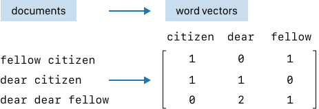
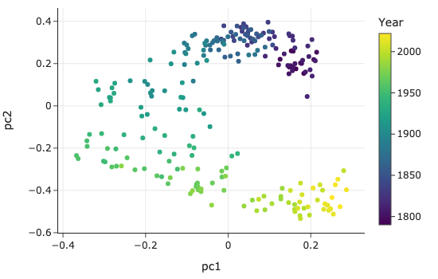

# 9. 文本数据处理 (Working with Text)

数据不仅仅是以数字的形式存在，还经常以文字的形式出现：如街道名称、博客文章、网络评论等。为了组织和分析包含在文本中的信息，我们通常需要执行以下几类任务：

## 1. 文本处理的核心任务

### 1.1 将文本转换为标准格式 (Canonicalizing Text)
这一过程也被称为**规范化**。目的是消除文本中的不一致性，使其统一。

*   **示例**：将所有字符转换为小写、统一拼写和缩写、移除标点符号或多余空格。

### 1.2 提取文本特征 (Extracting a Piece of Text)
从字符串中提取特定部分来创建一个新的特征。

*   **示例**：从一段包含日期的字符串中提取出具体的日期信息。

### 1.3 将文本转换为特征 (Transforming Text into Features)
将特定的单词或短语编码为 0-1 特征（布尔值或独热编码），以指示它们在字符串中是否存在。

### 1.4 分析文本 (Analyze Text)
为了能够同时比较整个文档（如文章、评论），我们可以将文档转换为单词计数的向量（Vector of Word Counts）。这通常被称为**词袋模型 (Bag of Words)**。

## 2. 工具与技术

本章将介绍处理文本数据的常用技术：

*   **字符串操作 (String Manipulation)**：对于简单的格式化或提取任务，Python 内置的字符串方法往往就足够了。
*   **正则表达式 (Regular Expressions)**：对于更通用和复杂的模式匹配，正则表达式是必不可少的强大工具。

我们将通过通过几个实际示例来演示这些文本操作，展示如何准备文本数据进行分析。

## 3. 示例与任务 (Examples of Text and Tasks)

为了更好地理解上述任务，我们将使用几个简化后的实际案例进行说明。

### 3.1 格式统一：人口统计与选举结果 (Convert to Standard Format)

**背景**：我们需要合并来自维基百科的选举数据和美国人口普查局的人口数据，以研究人口特征与选举结果的关系。

**问题**：两个表中的县名（County Names）格式不一致，无法直接进行 Join 操作。

*   **表 1 (Election Data)**: `De Witt County`, `Lac qui Parle County`, `Lewis and Clark County`, `St John the Baptist Parish`
*   **表 2 (Population Data)**: `DeWitt`, `Lac Qui Parle`, `Lewis & Clark`, `St. John the Baptist`

**任务**：清洗字符串，统一大小写、拼写、缩写和标点符号，即进行**规范化处理**，以便能够正确合并数据。

### 3.2 提取特征：Web 服务器日志 (Extract a Feature)

**背景**：计算机生成的日志文件通常具有特定的结构，但未必是标准的 CSV 或 JSON 格式。

**数据示例**：
```
169.237.46.168 - -
[26/Jan/2004:10:47:58 -0800]"GET /stat141/Winter04 HTTP/1.1" 301 328
"http://anson.ucdavis.edu/courses"
"Mozilla/4.0 (compatible; MSIE 6.0; Windows NT 5.0; .NET CLR 1.1.4322)"
```

**任务**：尽管格式不规则，但仍包含有价值的信息（如 IP 地址、时间戳、请求路径、浏览器类型等）。我们需要使用文本处理技术从这些非结构化文本中**提取**出结构化的特征。

### 3.3 转换为特征：餐厅违规描述 (Transform into Features)

**背景**：在之前的章节中，我们分析餐厅违规记录时，遇到了一系列自然语言描述。

**数据示例**：

*   `unclean or degraded floors walls or ceilings`
*   `inadequate and inaccessible handwashing facilities`
*   `unclean hands or improper use of gloves`

**任务**：我们希望基于这些文本创建分类特征（Categorical Features）。例如，创建一个特征来表示描述中是否包含 "glove" 或 "hair" 等关键词。这将用到**正则表达式**来更精确地匹配这些模式。

### 3.4 文本分析：国情咨文 (Text Analysis)

**背景**：我们也可能想要比较整个文档。例如，分析美国总统历年的国情咨文（State of the Union Address）。

**问题**：国情咨文的内容和用词随时间有何变化？不同党派的总统关注的话题有何不同？

**任务**：将整篇演讲稿转换为数值向量（如词频向量），从而利用统计学工具比较不同文档之间的相似性或差异性。

接下来，我们将首先介绍最基础的**字符串操作 (String Manipulation)**。

## 4. 字符串操作 (String Manipulation)

处理文本时，我们经常使用一些基本的字符串操作工具：

1.  **大小写转换**：将大写字符转换为小写，反之亦然。
2.  **替换与删除**：将子字符串替换为另一个，或直接删除。
3.  **分割**：在特定字符处将字符串拆分为片段。
4.  **切片**：在指定位置对字符串进行切片。

我们将展示如何通过组合这些基本操作来清理县名数据。

### 4.1 使用 Python 字符串方法进行标准化

回忆一下 3.1 节中的县名数据，我们需要解决以下不一致性：

*   **大小写**：`qui` vs `Qui`
*   **遗漏词**：人口普查表中缺少 `County` 和 `Parish`。
*   **缩写习惯**：`&` vs `and`。
*   **标点符号**：`St.` vs `St`。
*   **空格使用**：`DeWitt` vs `De Witt`。

**策略**：

1.  首先将所有字符转换为**小写**，避免处理大小写混合的复杂性。
2.  修复不一致的单词：替换 `&` 为 `and`，删除 `County` 和 `Parish`。
3.  处理标点和空格：移除 `.` 和空格。

这些操作可以通过 Python 的 `lower()` 和 `replace()` 方法链式调用来实现：

```python
def clean_county(county):
    return (county
            .lower()
            .replace('county', '')
            .replace('parish', '')
            .replace('&', 'and')
            .replace('.', '')
            .replace(' ', ''))
```

下表列出了一些常用的 Python 字符串方法：

| 方法 | 描述 |
| :--- | :--- |
| `str.lower()` | 返回字符串的小写副本 |
| `str.replace(a, b)` | 将所有的子串 `a` 替换为 `b` |
| `str.strip()` | 移除字符串首尾的空白字符 |
| `str.split(a)` | 在子串 `a` 处分割字符串，返回列表 |
| `str[x:y]` | 切片操作，返回从索引 `x`（包含）到 `y`（不包含）的子串 |

### 4.2 pandas 中的字符串方法

在 pandas 中，我们可以通过 `.str` 属性访问同样的字符串方法，该属性允许我们将操作应用到整个 Series 中的每个元素，而无需显式循环。

```python
# 清洗 Election 表中的 County 列
election['County'] = (election['County']
 .str.lower()
 .str.replace('parish', '')
 .str.replace('county', '')
 .str.replace('&', 'and')
 .str.replace('.', '', regex=False)
 .str.replace(' ', ''))
```

对两个表进行相同的清洗后，我们就得到了统一的县名表示（如 `stjohnthebaptist`），从而可以基于 `['County', 'State']` 列成功合并两个表。

> **注意**：我们同时使用 `County` 和 `State` 进行合并，因为不同州可能存在同名的县（例如加州和纽约州都有 King County）。

### 4.3 分割字符串以提取信息 (Splitting Strings)

让我们回到此前章节的 Web 日志示例：
`169.237.46.168 - - [26/Jan/2004:10:47:58 -0800] "GET ...`

如果想要提取日期 `26/Jan/2004`，我们可以利用 `split()` 方法逐步逼近目标：

1.  先按 `[` 分割，取第二部分（索引 1）。
2.  再按 `:` 分割，取第一部分（索引 0）。
3.  如果需要分离日、月、年，可以继续按 `/` 分割。

虽然可以这样做，但这需要多次调用 `split()`，代码较为繁琐。如果需要提取更复杂的字段（如时分秒、时区），使用下一节将介绍的**正则表达式 (Regular Expressions)** 会更加高效和优雅。
## 5. 正则表达式 (Regular Expressions)

正则表达式（Regular Expression，简称 Regex）是一种用于匹配字符串中字符组合的强大模式（Pattern）。它能以紧凑的方式描述复杂的文本结构，如电子邮件地址、电话号码或社会安全号码（SSN）。

Python 内置的 `re` 模块提供了处理正则表达式的函数。

### 5.1 字面量连接 (Concatenation of Literals)

最基本的匹配是逐个字符地匹配：

*   模式 `cat` 会匹配字符串 `cards scatter!` 中的 `cat` 部分。
*   匹配过程是从左到右，逐个字符进行比对。

### 5.2 字符类 (Character Classes)

通过方括号 `[]` 定义一组等价的字符，允许匹配其中任意**一个**。

*   `[0123456789]` 或 `[0-9]`：匹配任意一个数字。
*   `[a-z]`：匹配任意小写字母。
*   `[a-cX-Z27]`：匹配 `a, b, c, X, Y, Z, 2, 7` 中的任意一个。
*   `c[oa][td]`：可以匹配 `cat`, `cot`, `cad`, `cod`。

**特殊符号**：

*   `.` (点号)：通配符，匹配除换行符外的任意字符。
*   `[^0-9]` (脱字符在括号内)：否定字符类，匹配除数字外的任意字符。

### 5.3 简写与元字符 (Shorthands and Metacharacters)

一些常用的字符类有内置的简写：

| 简写 | 等价形式 | 含义 |
| :--- | :--- | :--- |
| `\d` | `[0-9]` | 任意数字 |
| `\D` | `[^0-9]` | 非数字 |
| `\w` | `[a-zA-Z0-9_]` | 字母数字下划线 (Word character) |
| `\W` | `[^a-zA-Z0-9_]` | 非单词字符 |
| `\s` | `[\t\n\f\r ]` | 空白字符 |
| `\S` | `[^\t\n\f\r ]` | 非空白字符 |
| `\b` | | 单词边界 (Word boundary) |

**示例 (SSN 匹配)**：
`\b\d\d\d-\d\d-\d\d\d\d\b`
这表示：单词边界 + 3个数字 + 横杠 + 2个数字 + 横杠 + 4个数字 + 单词边界。使用原始字符串 `r''` 来定义正则模式是一个好习惯，避免反斜杠转义问题。

### 5.4 量词 (Quantifiers)

量词用于指定前一个字符（或字符类）出现的次数。

| 量词 | 含义 | 简写 |
| :--- | :--- | :--- |
| `{m, n}` | 匹配 m 到 n 次 | |
| `{m}` | 匹配 m 次 | |
| `{m,}` | 匹配至少 m 次 | `+` (1次或更多) |
| `{0,}` | 匹配 0 次或更多 | `*` |
| `{0,1}` | 匹配 0 次或 1 次 | `?` |

**贪婪匹配 (Greedy)**：默认情况下，量词是贪婪的，会尽可能多地匹配字符。

### 5.5 分组与择一 (Grouping and Alternation)

*   **择一 (`|`)**：匹配多个选项中的一个。
    *   例如 `hand|nail|hair|glove` 可以匹配 "hand" 或 "glove" 等。
*   **分组 (`()`)**：使用圆括号将模式的一部分组合在一起，这不仅可以应用量词，还可以用于**提取**匹配的子串。

**示例：提取日志中的时间**
```python
import re
log_entry = '[26/Jan/2004:10:47:58 -0800]'
pattern = r"\[(\d{2})/([a-zA-Z]{3})/(\d{4}):([\d:\- ]*)\]"
re.findall(pattern, log_entry)
# 输出: [('26', 'Jan', '2004', '10:47:58 -0800')]
```

> **解析第四组 `([\d:\- ]*)`**：
> 这一部分用于匹配时间详情（如 `10:47:58 -0800`）。
>
> *   `[...]`：字符类，定义了允许出现的字符集合。
> *   `\d`：匹配数字。
> *   `:`：匹配冒号。
> *   `\-`：匹配连字符（需转义）。
> *   ` `：匹配空格（注意这里有一个空格）。
> *   `*`：量词，表示前面的字符类可以重复出现 0 次或多次。
> 因此，它能完整捕获包含时分秒和时区信息的整个字符串。

`re.findall` 返回一个元组列表，其中每个元组对应正则表达式中的捕获组。

### 5.6 Python `re` 模块常用方法

| 方法 | 描述 | 返回值 |
| :--- | :--- | :--- |
| `re.search(pat, str)` | 在字符串中搜索模式 | 匹配对象 (Match Object) 或 None |
| `re.match(pat, str)` | 仅从字符串**开头**匹配 | 匹配对象或 None |
| `re.findall(pat, str)` | 查找所有非重叠匹配项 | 字符串列表（或元组列表） |
| `re.sub(pat, repl, str)` | 替换匹配项 | 替换后的字符串 |
| `re.split(pat, str)` | 根据模式分割字符串 | 字符串列表 |

在 pandas 中，这些功能也可以通过 `.str.findall()`, `.str.contains()`, `.str.extract()` 等方法直接调用。

**建议 (Advice)**：

*   先在简单字符串上测试正则。
*   从宽泛的模式开始，逐步收紧条件。
*   使用在线 Regex 测试工具辅助调试。
*   对于大量文本处理，考虑使用 `re.compile()` 预编译模式以提高性能。

## 6. 文本分析 (Text Analysis)

到目前为止，我们已经学会了如何使用 Python 的字符串方法和正则表达式来清洗和处理短文本。本节将利用**文本挖掘 (Text Mining)** 技术来分析整个文档集合，将非结构化文本转化为定量表示，以揭示潜在的模式和洞察。

### 6.1 案例：美国总统国情咨文分析

我们将分析从 1790 年到 2022 年的所有美国总统国情咨文（State of the Union speeches）。
数据来源：[The American Presidency Project](https://www.presidency.ucsb.edu/)。

**步骤 1：加载与分割数据**

利用正则表达式 `\*\*\*`（在原文件中作为分隔符）来统计和分割演讲稿。

```python
from pathlib import Path
import re
import pandas as pd

text = Path('data/stateoftheunion1790-2022.txt').read_text()
records = text.split("***")
# 转换为 DataFrame
# (此处省略具体 extract_parts 函数实现，核心逻辑是解析每一段文本提取 Name, Date, Body)
df = read_speeches() 
```

### 6.2 文本清洗 (Text Cleaning)

在分析之前，我们需要处理文档中的一些常见问题：

1.  **大小写**：`Citizens` 和 `citizens` 应视为同一个词 -> 转换为小写。
2.  **非语音内容**：如 `[laughter]` 标记了观众的反应，但不属于演讲内容 -> 使用正则 `\[[^\]]+\]` 移除。

    > **Regex 解析 `\[[^\]]+\]`**：
    >
    > *   `\[`：匹配字面量左括号 `[`（需转义）。
    > *   `[^\]]`：否定字符类。`[^...]` 表示匹配**除了**括号内字符以外的任意字符。这里指匹配除右括号 `]` 以外的任何字符。
    > *   `+`：量词，表示前面的模式至少出现一次。
    > *   `\]`：匹配字面量右括号 `]`（需转义）。
    > *   **整体含义**：找到一对括号，并匹配其中间的所有内容（主要用于非贪婪地匹配括号内的注释，只要中间不包含右括号即可）。

3.  **非字母字符**：移除标点符号、数字等 -> 使用正则 `[^a-z\s]`，仅保留小写字母和空白。

```python
def clean_text(df):
    bracket_re = re.compile(r'\[[^\]]+\]')  # 匹配括号内容
    not_a_word_re = re.compile(r'[^a-z\s]') # 匹配非字母非空白
    cleaned = (df['text'].str.lower()
               .str.replace(bracket_re, '', regex=True)
               .str.replace(not_a_word_re, ' ', regex=True))
    return df.assign(text=cleaned)

df = clean_text(df)
```

### 6.3 文本向量化 (Text Vectorization)

为了进行定量比较，我们需要将文本转换为数值向量。

**预处理技术**：

*   **停用词 (Stop Words)**：移除 `is`, `and`, `the` 等高频但无实际意义的词。
*   **词干提取 (Stemming)**：将 `argue` 和 `arguing` 还原为词根 `argu`，以减少词汇表大小。

**TF-IDF 向量化**：
我们使用 **TF-IDF (Term Frequency-Inverse Document Frequency)** 将文档转换为向量。

*   **TF**：词频，衡量词在当前文档中出现的频率。
*   **IDF**：逆文档频率，衡量词的稀有程度（如果一个词在很少的文档中出现，它的权重会更高）。



```python
from nltk.stem.porter import PorterStemmer
from sklearn.feature_extraction.text import TfidfVectorizer
import nltk

# (假设已经下载了 stopwords 和 punkt 数据)
stemmer = PorterStemmer()
tfidf = TfidfVectorizer(tokenizer=stemming_tokenizer) # 自定义 tokenizer 包含 stemming 和停用词过滤
speech_vectors = tfidf.fit_transform(df['text'])
```

结果是一个矩阵，每一行代表一次演讲，每一列代表一个词汇，数值表示该词的 TF-IDF 权重。

### 6.4 可视化分析

利用 **主成分分析 (PCA)** 将高维的词向量降至 2 维进行可视化。



**结论**：

*   **时间演变**：可以看到明显的随时间变化的趋势。19 世纪的演讲与 21 世纪的演讲使用的词汇差异巨大。
*   **聚类现象**：同一时期的演讲聚集在一起，即便总统来自不同的党派。这说明语言风格主要受**时代背景**影响，而非仅仅是党派差异。

## 7. 总结 (Summary)

本章介绍了处理文本数据的核心技术，包括利用字符串操作和正则表达式来清洗数据，以及通过文本分析将非结构化文本转化为定量表示。文本数据蕴含着关于人类生活、工作和思维的丰富信息，但也因其多样性（如拼写错误）而难以被计算机直接利用。通过本章的技术，我们可以纠正错误、从日志中提取特征并比较文档。

### 7.1 正则表达式的局限性

虽然正则表达式非常强大，但我们**不推荐**在以下场景使用它：

*   **解析层次结构**：如 JSON 或 HTML。请使用专门的解析器（Parser）。
*   **搜索复杂属性**：如回文（palindromes）或平衡括号。
*   **验证复杂特征**：如验证电子邮件地址的有效性（标准非常复杂）。

### 7.2 性能考量

正则表达式在计算上可能非常昂贵。在使用时，需要权衡其简洁性与带来的性能开销，尤其是在生产环境代码中。

下一章我们将探讨其他类型的数据格式，包括二进制格式，以及高度结构化的文本格式（如 JSON 和 HTML），重点介绍如何将这些数据加载到 DataFrame 和其他 Python 数据结构中。

下一章：[数据交换](./10_数据交换.md)