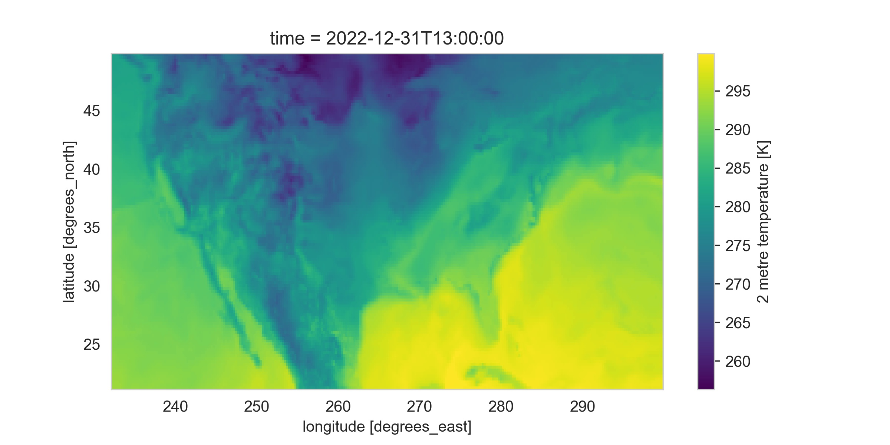
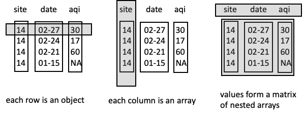

# 10. 数据交换 (Data Exchange)

我们在此前章节中专注于纯文本的分隔格式（如 CSV, TSV）和固定宽度格式（FWF）。但在实际的数据科学工作中，数据存储和交换的格式远不止这些。

本章将扩展视野，介绍其他几种流行的文件格式和数据获取方式。
虽然 CSV 等格式非常适合将数据组织成 DataFrame，但其他格式在**节省空间**或**表示复杂结构**方面可能更具优势。

## 1. 常见数据格式概览

### 1.1 二进制格式 (Binary Formats)
二进制格式并非纯文本，因此通常比纯文本数据源更节省空间，读写效率更高。

*   **NetCDF (Network Common Data Form)**：一种用于交换大量科学数据（如气象、地理数据）的流行二进制格式。

### 1.2 结构化纯文本格式
除了扁平的表格数据，我们还需要处理具有层级或嵌套结构的数据。

*   **JSON (JavaScript Object Notation)**：一种轻量级的数据交换格式，易于人阅读和编写，同时也易于机器解析和生成。
*   **XML (eXtensible Markup Language)**：一种标记语言，用于定义文档的编码规则。
*   **HTML (HyperText Markup Language)**：网页的标准标记语言。虽然主要用于展示，但往往包含可供抓取和分析的有价值数据。

## 2. 网络数据获取 (Acquiring Data Online)

过去，数据科学家可能需要物理移动磁盘来共享数据。现在，我们可以通过互联网自由地检索全球的数据集。为了实现**可复现 (Reproducible)** 的数据获取，我们需要了解一些网络技术：

*   **HTTP (Hypertext Transfer Protocol)**：Web 的主要通信协议。
*   **REST (Representational State Transfer)**：一种用于数据传输的软件架构风格，常用于 API 设计。

## 3. 提取工具

针对 XML 和 HTML 这种层级结构的数据，我们需要专门的工具来提取内容。

*   **XPath**：一种在 XML 文档中查找信息的语言，也常用于 HTML 解析。

本章将从 NetCDF 开始，接着介绍 JSON，然后概述用于数据交换的 Web 协议，最后以 XML、HTML 和 XPath 结束。掌握这些技术将帮助我们更好地利用 Web 作为数据源。

## 4. NetCDF 数据

**NetCDF (Network Common Data Form)** 是一种用于存储面向数组的科学数据的高效格式，特别适合气象学、海洋学等领域。

### 4.1 核心概念：多维网格 (Multidimensional Grid)

可以将 NetCDF 中的变量想象为一个多维立方体。

*   例如：记录全球降雨量。
*   **维度**：经度 (Longitude)、纬度 (Latitude)、时间 (Time)。
*   **网格单元**：立方体中的每个单元格存储特定地点在特定日期的降雨量。

相比于 CSV 等格式，NetCDF 不需要重复存储每个测量点的经纬度和时间信息，因此大大节省了空间。


### 4.2 主要优势

1.  **可扩展 (Scalable)**：高效访问大型数据集的子集。
2.  **可追加 (Appendable)**：无需重定义结构即可追加新数据。
3.  **可共享 (Sharable)**：跨平台、跨语言的通用格式。
4.  **自描述 (Self-describing)**：文件本身包含数据组织的描述（元数据）。

> **注意**：NetCDF 是**二进制格式**，无法直接用文本编辑器打开，需要专用工具（如 Python 的 `xarray` 或 `netCDF4` 库）读取。

### 4.3 文件组件

一个 NetCDF 文件通常包含三个基本部分：

1.  **维度 (Dimensions)**：定义轴的大小（如经度 1440 个点）。
2.  **变量 (Variables)**：实际的数据数组（如降雨量、温度）。变量具有形状（Shape）和类型。
3.  **属性/元数据 (Attributes/Metadata)**：
    *   **变量属性**：单位（如 `m`）、长描述。
    *   **全局属性**：数据来源、发布者、历史记录等，对**可复现性**至关重要。

### 4.4 Python 实战：使用 xarray 处理 NetCDF

我们以一个包含温度和降水量的气候数据集（`CDS_ERA5_22-12.nc`）为例。

**加载与查看数据**

```python
import xarray as xr
ds = xr.open_dataset('data/CDS_ERA5_22-12.nc')

# 查看维度
print(ds.dims)
# 输出: {'longitude': 1440, 'latitude': 721, 'time': 408}

# 查看坐标 (Coordinates)
print(ds.coords)
# 包含 longitude, latitude, time 的具体数值数组

# 查看数据变量
print(ds.data_vars)
# 输出: t2m (温度), tp (总降水), lsrr 等
```

**数据切片与可视化**

`xarray` 提供了类似于 pandas 的选择功能，但针对多维数组进行了优化。

1.  **时间序列图**：选择特定经纬度，绘制降水随时间变化的曲线。
    ```python
    (ds.sel(latitude=37.75, longitude=237.5).tp * 100).plot()
    ```

2.  **地理分布图**：选择特定时间点和地理范围，绘制温度分布的热力图。
    ```python
    # 选择 2022-12-31 13:00，并限定在美国范围
    ds_oneday_us = ds.sel(time='2022-12-31T13:00:00')\
                     .where((ds.longitude > 232) & (ds.longitude < 300) & 
                            (ds.latitude > 21) & (ds.latitude < 50), drop=True)
    
    # 绘制温度图
    ds_oneday_us.t2m.plot()
    ```
    

**生态系统**：除了 `xarray`，Python 还有 `netCDF4`、`gdal` 等库可以读取 NetCDF，可视化方面可以使用 `matplotlib`, `cartopy` 等。

## 5. JSON 数据 (JSON Data)

**JSON (JavaScript Object Notation)** 是一种轻量级的数据交换格式。它语法简单、灵活，非常契合 Python 的字典结构，既便于机器解析也便于人类阅读。

### 5.1 核心结构

JSON 由两种主要结构组成，可以互相嵌套：

1.  **对象 (Object)**：无序的键值对集合，类似于 Python 的 `dict`。
    *   格式：`{"name": value, ...}`
2.  **数组 (Array)**：有序的值集合，类似于 Python 的 `list`。
    *   格式：`[value1, value2, ...]`

**数据类型**：
*   字符串 (Double-quoted string)
*   数字 (Number)
*   布尔值 (`true`, `false`)
*   空值 (`null`)

示例：
```json
{
  "lender_id": "matt",
  "loan_count": 23,
  "status": [2, 1, 3],
  "sponsored": false,
  "sponsor_name": null,
  "lender_dem": {"sex": "m", "age": 77}
}
```

### 5.2 Python 处理 JSON

Python 内置的 `json` 库可以轻松处理 JSON 数据。

```python
import json
# 加载 JSON 文件为 Python 字典
data = json.load(open('data/ex.json'))
```

对于嵌套较深的半结构化数据，`pandas` 提供了 `json_normalize` 方法将其展平为表格：

```python
import pandas as pd
df = pd.json_normalize(data)
# 结果会将嵌套字段转换为点分列名，如 lender_dem.sex
```

### 5.3 JSON 组织 DataFrame 的三种常见方式

由于 JSON 的灵活性，即使是同一个表格数据，也可以用多种不同的 JSON 结构来表示。理解这些结构对于正确读取数据至关重要。



1.  **按行组织 (Row-oriented)**：
    *   结构：对象列表，每个对象代表一行。
    *   示例：`[{"site": "0014", "aqi": 30}, {"site": "0014", "aqi": 17}]`
    *   读取：`pd.DataFrame(data)`

2.  **按列组织 (Column-oriented)**：
    *   结构：包含列数组的对象。
    *   示例：`{"site": ["0014", "0014"], "aqi": [30, 17]}`
    *   读取：`pd.read_json(path)` 通常能直接处理这种格式。

3.  **矩阵式 (Matrix/Values-oriented)**：
    *   结构：将表头和数据分开存储。
    *   示例：`{"columns": ["site", "aqi"], "data": [["0014", 30], ["0014", 17]]}`
    *   读取：需要分别提取列名和数据，`pd.DataFrame(data['data'], columns=data['columns'])`

**总结**：JSON 是 Web 数据交换的标准。由于其结构的灵活性，在将其转换为 DataFrame 之前，通常需要先检查文件的组织方式。接下来我们将介绍如何通过 HTTP 协议自动从 Web 获取这些数据。

## 6. HTTP 协议

**HTTP (HyperText Transfer Protocol)** 是访问 Web 资源的基础设施。通过 HTTP，我们可以利用 Python 自动化地从互联网海量数据集中获取数据。

### 6.1 基本概念
HTTP 是一种简单的**请求-响应 (Request-Response)** 协议：客户端（如浏览器或 Python 脚本）发送格式化的文本请求，服务器返回格式化的文本响应。

**请求结构**：

1.  **起始行**：包含方法（如 `GET`）、URL 和协议版本。
2.  **头部 (Header)**：键值对，提供辅助信息（如 `User-Agent`）。
3.  **空行**。
4.  **主体 (Body)**：可选，用于 POST 请求等。

**响应结构**：

1.  **状态行**：包含状态码（如 `200 OK`）。
2.  **头部 (Header)**：提供响应的元数据（如 `Content-Type`, `Content-Length`）。
3.  **空行**。
4.  **主体 (Body)**：实际内容（如 HTML 代码、JSON 数据）。

### 6.2 状态码 (Status Codes)
服务器通过状态码告知请求结果：

*   **200s**：成功（如 `200 OK`）。
*   **300s**：重定向。
*   **400s**：客户端错误（如 `404 Not Found` 资源不存在, `403 Forbidden` 无权访问）。
*   **500s**：服务器错误（如 `500 Internal Server Error`）。

### 6.3 使用 Python `requests` 库
我们通常不需要手动编写原生 HTTP 报文，而是使用 `requests` 库。

```python
import requests

# 发送 GET 请求
url = 'https://en.wikipedia.org/wiki/1500_metres_world_record_progression'
response = requests.get(url)

# 检查状态码
print(response.status_code) # 输出: 200

# 查看响应头
print(response.headers['content-type']) # 输出: text/html; charset=UTF-8

# 获取响应内容（前600字符）
print(response.text[:600]) 
# 输出: <!DOCTYPE html>...
```

### 6.4 请求方法 (Request Methods)
最常用的两种方法：

*   **GET**：用于检索数据（参数包含在 URL 中）。
*   **POST**：用于提交数据给服务器处理（参数包含在 Body 中），常用于登录、提交表单或复杂 API 调用。

接下来，我们将介绍 REST 架构风格，这是一种利用 HTTP 协议进行数据交换的常见方式。

## 7. REST 架构 (REST Architecture)

**REST (REpresentational State Transfer)** 是一种广泛使用的 Web 服务架构风格。许多现代 Web 服务（如 Twitter, Instagram, Spotify, GitHub API 等）都遵循 REST 架构，允许开发者通过 HTTP 协议以标准化的方式访问数据。

### 7.1 核心特征

*   **资源导向**：每一个 URL 代表一种资源（Resource），如一首歌曲、一张图片或一个用户。
*   **无状态 (Stateless)**：服务器不会在请求之间保存客户端的状态。每个请求都必须包含处理该请求所需的所有信息（如认证令牌）。
    *   *优点*：可扩展性高，服务端和客户端解耦，代码修改互不影响。
*   **统一接口**：使用标准的 HTTP 方法（GET, POST, PUT, DELETE）对资源进行操作。

### 7.2 实战案例：使用 Spotify API 获取数据

通常，REST API 会提供详细的开发文档。在这个例子中，我们将模拟访问 Spotify API 的流程（基于 `requests` 库），主要包括 **认证** 和 **数据获取** 两个步骤。

> **注意**：在实际工程中，我们通常会直接使用 Spotify 的专用 Python 库 `spotipy`。但本节为了**展示 REST API 的通用交互原理**，特意不使用封装库，而是演示如何手动构建 HTTP 请求。掌握这种底层方法后，未来遇到没有现成 Python 库的小众 API 时，你也能应对自如。

#### 7.2.1 第一步：认证 (Authentication)
大多数商业 API 都需要注册并获取凭证（Client ID 和 Client Secret）。Spotify 使用 OAuth 2.0 协议，我们需要发送一个 POST 请求，将凭证交换为访问令牌 (Access Token)。

```python
import requests

# 1. 设置认证 URL 和凭证 (这里仅为示例，实际使用需替换)
AUTH_URL = 'https://accounts.spotify.com/api/token'
CLIENT_ID = 'your_client_id'
CLIENT_SECRET = 'your_client_secret'

# 2. 发送 POST 请求获取 Token
# 凭证通常放在 Body 中或以 Basic Auth 形式发送
auth_response = requests.post(AUTH_URL, {
    'grant_type': 'client_credentials',
    'client_id': CLIENT_ID,
    'client_secret': CLIENT_SECRET,
})

# 3. 解析响应 (JSON 格式)
if auth_response.status_code == 200:
    auth_data = auth_response.json()
    access_token = auth_data['access_token'] # 获取 Token
    token_type = auth_data['token_type']     # 通常是 'Bearer'
    print(f"获取 Token 成功: {access_token[:5]}...")
else:
    print(f"认证失败，状态码: {auth_response.status_code}")
```

#### 7.2.2 第二步：请求资源 (Requesting Resources)
获取 Token 后，我们需要在后续每个 GET 请求的 **Header** 中携带它。

假设我们要获取乐队 "The Clash" 的专辑信息：
1.  **构建 Header**：包含认证信息。
2.  **构建 URL**：根据 API 文档，通过 Artist ID 查找专辑。

```python
# 1. 构建 Header
headers = {"Authorization": f"{token_type} {access_token}"}

# 2. 发送 GET 请求获取专辑列表
artist_id = '3RGLhK1IP9jnYFH4BRFJBS' # The Clash 的 ID
BASE_URL = "https://api.spotify.com/v1/"
albums_url = f"{BASE_URL}artists/{artist_id}/albums"

res_albums = requests.get(
    albums_url,
    headers=headers,
    params={"include_groups": "album"} # 添加查询参数
)

# 3. 解析专辑数据
if res_albums.status_code == 200:
    albums_data = res_albums.json()
    # 打印前 3 张专辑的信息
    for album in albums_data['items'][:3]:
        print(f"ID: {album['id']} | Name: {album['name']} ({album['release_date']})")
```

#### 7.2.3 第三步：批量获取与数据处理
通常我们需要通过循环来获取更多细节。例如，遍历专辑 ID 获取每张专辑的所有单曲 (Tracks)，再获取每首单曲的音频特征 (Audio Features)。

```python
tracks_info = []

# 伪代码逻辑展示流程：
# for album in albums:
#     1. 获取该专辑的所有 Tracks (GET /albums/{id}/tracks)
#     for track in tracks:
#         2. 获取该 Track 的特征 (GET /audio-features/{id})
#         3. 整理数据 (track_name, album_name, danceability, loudness...)
#         tracks_info.append(data)

# 最后转换为 DataFrame 进行分析
# import pandas as pd
# df = pd.DataFrame(tracks_info)
```

通过这种方式，我们可以构建起一个包含 `danceability` (可舞性), `loudness` (响度), `energy` (能量) 等特征的数据集，并使用 `plotly` 或 `matplotlib` 进行可视化分析。

**总结**：REST API 提供了一种标准化的数据交互方式。虽然示例使用的是 JSON 格式，但部分 API 也可能返回 XML 格式。如果是网页而非 API，则返回的是 HTML。下一节我们将介绍如何处理 XML 和 HTML 数据。

## 8. XML, HTML 与 XPath

**XML (eXtensible Markup Language)** 是一种通用的数据标记结构，常用于定义文件格式（如 `.docx`, `.svg`）和网络数据传输。**HTML (HyperText Markup Language)** 则是 Web 的标准语言，其结构与 XML 高度相似（XHTML 更是严格遵循 XML 规则）。

对于数据科学家而言，掌握 XML 解析技术（特别是 **XPath**）是处理非结构化 Web 数据（网页抓取）和特定格式数据交换的关键。

### 8.1 XML 基础结构
XML 是纯文本格式，具有层级（树状）结构。基本单位是**元素 (Element)**，也称为**节点 (Node)**。

```xml
<catalog>                                <!-- 根节点 -->
    <plant>                              <!-- 子节点 -->
        <common>Bloodroot</common>       <!-- 包含文本内容的节点 -->
        <price curr="USD">$2.44</price>  <!-- 带有属性的节点 -->
        <availability date="0399"/>      <!-- 空节点简写 -->
    </plant>
</catalog>
```

### 8.2 XPath 查询语言
**XPath** 是一种在 XML/HTML 文档中查找信息的语言。它像文件路径一样遍历文档树。

**XPath 表达式三要素**：

1.  **轴 (Axis)**：方向 (如 `//` 表示在全文查找，`/` 表示仅在当前子节点查找，`..` 表示父节点)。
2.  **节点测试 (Node test)**：标签名 (如 `table`) 或 `text()` (文本内容)。
3.  **谓语 (Predicate)**：过滤条件 (如 `[1]` 表示第一个，`[@id="main"]` 表示特定属性)。

**常用表达式示例**：

| 表达式 | 描述 |
| :--- | :--- |
| `//common` | 查找文档中所有的 `<common>` 节点 |
| `/catalog/plant/common` | 从根节点严格按路径查找 |
| `//plant/price/text()` | 查找所有 price 节点的文本内容 (如 "$2.44") |
| `//plant[2]` | 查找第二个 plant 节点 |
| `//@date` | 查找名为 date 的属性值 |
| `//price[@curr="CAD"]` | 查找 curr 属性为 "CAD" 的 price 节点 |

### 8.3 Python 实战 I：抓取 HTML 表格 (lxml)
我们可以使用 `lxml` 库配合 XPath 从网页中提取数据。例如从 Wikipedia 获取 1500米跑记录：

```python
from lxml import html
import requests

# 1. 获取网页内容
url = 'https://en.wikipedia.org/wiki/1500_metres_world_record_progression'
page = requests.get(url)

# 2. 解析 HTML 树
tree = html.fromstring(page.content)

# 3. 使用 XPath 提取数据
# 路径解释：
# //table[3] : 查找文档中的第三个表格
# /tbody/tr  : 进入表格主体，遍历每一行
# /td[1]     : 选中第一列
# /b         : **关键点**：数据被包裹在 <b> (粗体) 标签中，所以要深入一层
# /text()    : 提取标签内的文本内容
times = tree.xpath('//table[3]/tbody/tr/td[1]/b/text()')

# 同理，名字在第三列，且被包裹在 <a> (链接) 标签中
names = tree.xpath('//table[3]/tbody/tr/td[3]/a/text()')

# 4. 转换为 DataFrame 进一步清洗
import pandas as pd
df = pd.DataFrame({'time': times, 'athlete': names})
```

### 8.4 Python 实战 II：解析 XML 数据 (处理命名空间)
许多机构（如欧洲央行 ECB）提供 XML 格式的数据 API。处理此类 XML 时，常遇到的挑战是**命名空间 (Namespaces)**。

```xml
<gesmes:Envelope xmlns:gesmes="...">
    <Cube>
        <Cube time="2023-02-24">
            <Cube currency="USD" rate="1.057"/>
        </Cube>
    </Cube>
</gesmes:Envelope>
```

当 XML 包含 `xmlns` 定义时，XPath 查询必须指定命名空间：

```python
from lxml import etree

# ... 获取 XML 响应 ...
xml_tree = etree.fromstring(response.content)

# 定义命名空间映射 (通常在 XML 头部的 xmlns 属性中找到 URL)
ns = {'x': 'http://www.ecb.int/vocabulary/2002-08-01/eurofxref'}

# 查询属性值 (注意 @time 前面的 / 路径需要带上前缀 x:)
dates = xml_tree.xpath('.//x:Cube/@time', namespaces=ns)
rates_USD = xml_tree.xpath('.//x:Cube[@currency="USD"]/@rate', namespaces=ns)
```

**总结**：结合 JSON, HTTP, REST 和 XML/HTML/XPath 技术，我们几乎可以访问和处理网络上任何形式的数据资源。这也为构建自动化数据管道和分析展示奠定了坚实基础。

## 9. 总结与网络数据礼仪

通过本章，我们学习了多种数据格式（NetCDF, JSON, XML）以及如何通过编程方式（HTTP/REST）获取它们。这种**代码化获取**的方式不仅是为了效率，更是为了保证数据科学工作的**可复现性 (Reproducibility)**。

### 9.1 最佳实践与网络礼仪 (Web Etiquette)
当我们通过代码自动获取网络数据时，请务必遵守以下原则：

1.  **检查权限**：在抓取数据前，查看网站的 `robots.txt` 或服务条款 (Terms of Service)，确认是否允许爬虫访问。
2.  **不要滥用资源**：控制请求频率，避免对服务器造成过大压力（DDoS）。如果数据量大，请尝试批量获取或在非高峰时段进行。
3.  **优先使用 API/下载**：如果网站提供了 CSV/JSON 下载链接或官方 API（如 Spotify 的 `spotipy`），请优先使用这些官方渠道，而不是去抓取 HTML 页面。
4.  **本地缓存**：在开发和测试阶段，将获取到的数据保存到本地文件。避免每次运行代码都重复向服务器发送请求。

### 9.2 下一步
掌握了从各种来源获取和交换数据的技能后，我们将在后续章节回归到**建模 (Modeling)** 这一核心主题，深入探讨如何利用这些数据挖掘价值。

下一章：[线性模型](./11_线性模型.md)


