# 11. 线性模型 (Linear Models)

在此前的章节中，我们已经覆盖了数据科学生命周期的前几个阶段：问题的构建、数据的获取与清洗，以及探索性数据分析 (EDA)。本章将把此前章节中介绍的**常数模型 (Constant Model)** 扩展为**线性模型 (Linear Model)**。

线性模型是生命周期最后阶段——**理解世界**的强力工具。

## 1. 线性模型的应用场景

掌握线性模型可以解锁多种数据分析能力：

1.  **预测 (Prediction)**：例如环境科学家根据廉价传感器的读数和天气条件，建立线性模型来预测空气质量（校准传感器）。
2.  **推断 (Inference)**：例如兽医通过线性模型推断驴的长度和胸围与其体重的关系系数 ($Weight \approx c_1 \times Length + c_2 \times Girth + b$)，从而在野外为生病的驴通过测量体型来计算药量。
3.  **描述与洞察 (Description & Insight)**：例如社会科学家通过线性模型探索通勤时间、收入不平等、K-12 教育质量与社会阶层向上流动性 (Upward Mobility) 之间的相关性，从而为公共政策提供依据。

## 2. 本章路线图

本章将从简单的线性模型开始，逐步深入到多变量和特征工程：

*   **简单线性模型 (Simple Linear Model)**：用一条直线总结两个特征之间的关系。我们将沿用此前章节的**损失最小化 (Loss Minimization)** 方法来拟合这条线。
*   **多元线性模型 (Multiple Linear Model)**：使用多个特征来模拟一个目标特征。
    *   为了拟合这种模型，我们将引入**线性代数 (Linear Algebra)**，并揭示在平方误差损失下拟合线性模型背后的几何原理。
*   **特征工程 (Feature Engineering)**：介绍如何处理分类特征（Categorical features）和对特征进行变换，以便将它们纳入模型构建中。

## 3. 简单线性模型 (Simple Linear Model)

与常数模型类似，我们的目标是用一个数学模型来近似特征中的信号。现在的不同之处在于，我们拥有额外的**第二个特征**所提供的信息。简而言之，我们希望利用第二个特征的信息来建立一个比常数模型更好的模型。

例如：

*   通过房子的大小来描述售价。
*   通过驴的长度来预测体重。

在这些例子中，我们有一个想要解释、描述或预测的**结果特征 (Outcome)**（如售价、体重），以及一个用来辅助解释的**解释特征 (Explanatory)**（如房子大小、长度）。

> **术语约定 (Terminology)**
>
> *   **结果 (Outcome)**：指我们试图建模的特征。其他领域可能称之为因变量 (Dependent Variable)、响应变量 (Response)、被解释变量 (Regressand)、标号 (Target) 等。
> *   **解释 (Explanatory)**：指用来解释结果的特征。其他领域可能称之为自变量 (Independent Variable)、协变量 (Covariate)、回归量 (Regressor)、特征 (Feature)、预测变量 (Predictor) 等。
> *   **注意**：尽管术语众多，但在数据科学中通常避免使用“独立变量-因变量”这种暗示因果关系的称呼，因为预测或解释并不一定意味着因果关系。

我们选择最简单的几何形状——**直线**作为模型。数学上，这意味着我们有一个截距 $\theta_0$ 和一个斜率 $\theta_1$，并利用解释特征 $x$ 来近似结果 $y$：

$$
y \approx \theta_0 + \theta_1 x
$$

随着 $x$ 的变化，对 $y$ 的估计值也会随之变化，但所有估计点都落在同一条直线上。通常估计并不完美，模型会有误差，因此我们使用 $\approx$ 符号表示“近似”。

### 3.1 拟合模型：最小化均方误差 (MSE)

为了找到能够最好地捕捉结果信号的直线，我们沿用此前章节中介绍的**平均平方损失最小化 (Minimizing Average Squared Loss)** 方法。具体步骤如下：

1.  **计算误差 (Errors)**：$e_i = y_i - (\theta_0 + \theta_1 x_i), ~i=1, \ldots, n$
2.  **平方误差 (Squared Errors)**：$[y_i - (\theta_0 + \theta_1 x_i)]^2$
3.  **计算平均损失 (Average Loss)**：

    $$
    \frac{1}{n} \sum_{i}[y_i - (\theta_0 + \theta_1 x_i)]^2
    $$

为了拟合模型，我们需要找到一组截距 $\hat{\theta}_0$ 和斜率 $\hat{\theta}_1$，使得平均损失最小。这个最小化的目标被称为**均方误差 (Mean Square Error, MSE)**。

### 3.2 几何理解

我们在第一步计算的误差是**垂直距离**。对于特定的 $x$，误差是数据点 $(x, y)$ 与直线上对应点 $(x, \theta_0 + \theta_1 x)$ 之间的垂直距离。

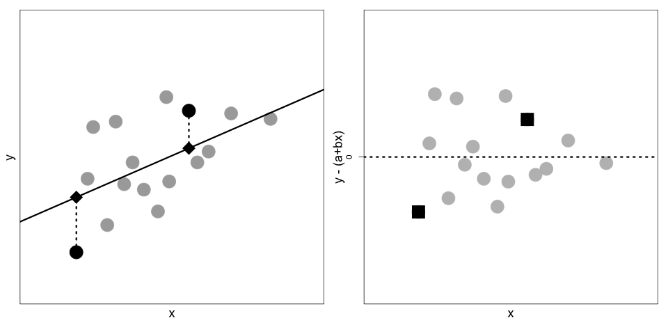
*(左图：散点图 $(x_i, y_i)$ 与拟合直线。方块代表真实数据点，菱形代表直线上的估计点。虚线表示误差。右图：误差 $y_i - \hat{y}_i$ 的散点图)*

### 3.3 最佳参数解

后续我们将推导使得 MSE 最小的 $\hat{\theta}_0$ 和 $\hat{\theta}_1$ 的具体公式：

$$
\begin{aligned}
\hat{\theta}_1 &= r(\mathbf{x}, \mathbf{y}) \frac{SD(\mathbf{y})}{SD(\mathbf{x})} \\
\hat{\theta}_0 &= \bar{y} - \hat{\theta}_1 \bar{x}
\end{aligned}
$$

其中：

*   $\bar{x}, \bar{y}$ 分别是 $x$ 和 $y$ 的均值。
*   $SD(\mathbf{x}), SD(\mathbf{y})$ 分别是标准差。
*   $r(\mathbf{x}, \mathbf{y})$ 是皮尔逊相关系数 (Correlation Coefficient)。

结合这两个公式，最优直线的方程可以写为：

$$
\hat{y} = \bar{y} + r(\mathbf{x}, \mathbf{y}) \frac{SD(\mathbf{y})}{SD(\mathbf{x})} (x - \bar{x})
$$

或者更直观的形式：

$$
\frac{\hat{y} - \bar{y}}{SD(\mathbf{y})} = r \times \frac{x - \bar{x}}{SD(\mathbf{x})}
$$

**解读**：对于给定的 $x$ 值，我们先看它距离均值有多少个标准差，然后预测 $y$ 也偏离其均值相应的标准差倍数，这个倍数就是相关系数 $r$。

### 3.4 相关系数 (Correlation Coefficient)

相关系数 $r$ 在线性模型中扮演核心角色，定义如下：

$$
r(\mathbf{x}, \mathbf{y}) = \frac{1}{n} \sum_i \frac{(x_i - \bar{x})}{SD(\mathbf{x})} \frac{(y_i - \bar{y})}{SD(\mathbf{y})}
$$

关于 $r$ 的几个关键点：

1.  **无量纲 (Unitless)**：$r$ 没有单位，因为分子分母的单位相互抵消。
2.  **范围 $[-1, +1]$**：只有当所有点完全落在一条直线上时，$r$ 才会等于 $+1$ 或 $-1$。
3.  **衡量线性强度**：$r$ 仅衡量**线性**关联的强度，而不代表是否存在关联。

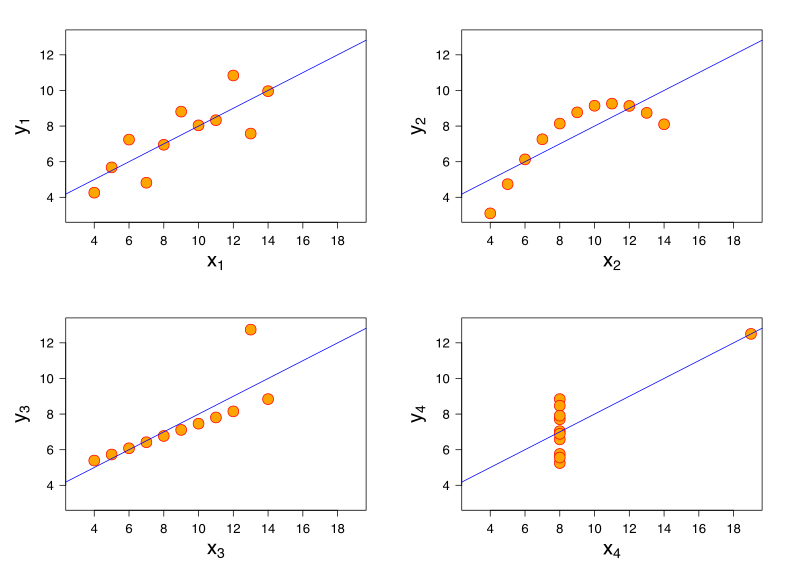
*(安斯库姆四重奏 Anscombe's Quartet：这四组数据具有相同的均值、方差和相关系数 (0.816)，但分布形态截然不同。只有左上角的图表现出带有随机误差的线性关系)*

我们并不期望数据点完全落在直线上，但我们期望：

1.  散点图大体上可以用直线描述。
2.  残差（误差）在直线周围大致对称分布，且没有明显的模式。

接下来，我们将通过具体的空气质量案例（EPA 监测站 vs 廉价传感器）来具体演示简单线性模型的应用。

### 3.5 案例分析：空气质量简单线性模型

回顾此前章节的数据，我们的目标是利用美国政府运营的高精度空气质量系统 (AQS) 传感器的测量值，来预测 PurpleAir (PA) 传感器的测量值。数据来自于相邻的仪器，它们记录了同一天空气中颗粒物的日均浓度（单位：微克/立方米，$PM_{2.5}$）。

本节我们将聚焦于佐治亚州 (Georgia) 某地点的空气质量测量数据。这是此前案例研究数据的一个子集，涵盖了 2019 年 8 月到 11 月中旬的日均值。

**数据加载与预览**

我们加载数据并筛选出佐治亚州的数据（ID 为 'GA1'）：

```python
import pandas as pd
import plotly.express as px

csv_file = 'data/Full24hrdataset.csv'
usecols = ['Date', 'ID', 'region', 'PM25FM', 'PM25cf1']

full = (pd.read_csv(csv_file, usecols=usecols, parse_dates=['Date'])
        .dropna())
full.columns = ['date', 'id', 'region', 'pm25aqs', 'pm25pa']

GA = full.loc[(full['id'] == 'GA1') , :]
GA.head()
```

|      | date       | id  | region    | pm25aqs | pm25pa |
| :--- | :--------- | :-- | :-------- | :------ | :----- |
| 5258 | 2019-08-02 | GA1 | Southeast | 8.65    | 16.19  |
| 5259 | 2019-08-03 | GA1 | Southeast | 7.70    | 13.59  |
| 5260 | 2019-08-04 | GA1 | Southeast | 6.30    | 10.30  |
| ...  | ...        | ... | ...       | ...     | ...    |

**可视化关系**

`pm25aqs` 是 AQS（解释特征）的测量值，`pm25pa` 是 PurpleAir（结果特征）的读数。我们绘制散点图并添加趋势线：

```python
px.scatter(GA, x="pm25aqs", y="pm25pa", trendline='ols',
           trendline_color_override="darkorange",
           labels={'pm25aqs':'AQS PM2.5', 'pm25pa':'PurpleAir PM2.5'},
           width=350, height=250)
```

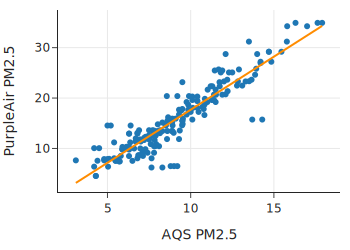

散点图显示了两种仪器测量值之间存在明显的**线性关系**。我们想要拟合的模型形式如下：

$$
\text{PurpleAir} \approx \theta_0 + \theta_1 \times \text{AQS}
$$

**计算最佳拟合线**

利用 Pandas 的内置方法，我们可以快速定义函数来计算最佳拟合线的斜率和截距（基于上一节推导的公式）：

```python
def theta_1(x, y):
    r = x.corr(y)
    return r * y.std() / x.std()

def theta_0(x, y):
    return y.mean() - theta_1(x, y) * x.mean()

t1 = theta_1(GA['pm25aqs'], GA['pm25pa'])
t0 = theta_0(GA['pm25aqs'], GA['pm25pa'])

print(f'Model: {t0:.2f} + {t1:.2f}AQ')
# 输出: Model: -3.36 + 2.10AQ
```

这个模型与散点图中 `trendline='ols'`（普通最小二乘法 OLS，即最小均方误差的别称）绘制的趋势线一致。

### 3.6 模型诊断：残差分析

为了评估拟合效果，我们需要检查**误差 (Errors)** ——又称**残差 (Residuals)**。
首先，我们计算预测值和残差：

```python
prediction = t0 + t1 * GA["pm25aqs"]
error = GA["pm25pa"] - prediction
fit = pd.DataFrame(dict(prediction=prediction, error=error))
```

**残差图 (Residual Plot)**

绘制残差关于预测值的散点图：

```python
fig = px.scatter(fit, y='error', x='prediction',
                 labels={"prediction": "Prediction", "error": "Error"},
                 width=350, height=250)
fig.add_hline(0, line_width=2, line_dash='dash', opacity=1)
fig.update_yaxes(range=[-12, 12])
```

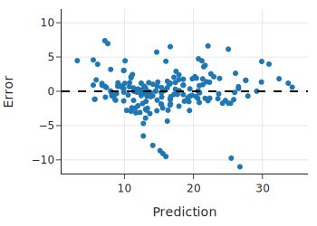

*   **零线基准**：误差为 0 意味着实际测量值正好落在拟合直线（也称最小二乘线或回归线）上。正值表示在上方，负值表示在下方。
*   **理想状态**：残差图应呈现围绕 0 线的无规律“云团”。如果有明显模式，说明模型未能完全捕捉信号。在此案例中，残差图没有明显的模式。

### 3.7 解读线性模型

**斜率 (Slope) 的含义**
简单线性模型的斜率约为 2.1。这意味着：AQS 监测值每增加 1 ppm，PurpleAir 的测量值平均增加 2.1 ppm。
> **注意**：这并不意味着 AQS 的变化**导致**了 PA 的变化。它们都反映了空气质量。这里的“预测”仅利用了它们之间的线性关联，而非因果关系。

**截距 (Intercept) 的含义**
截距约为 -3.36。理论上，当空气中没有颗粒物（AQS=0）时，两个仪器读数都应为 0。但模型预测此时 PA 为 -3.36 ppm，这是不合理的（颗粒物浓度不能为负）。
这凸显了**外推 (Extrapolation)** 的风险：我们只在 AQS [3, 18] ppm 的范围内观察数据，模型在这个范围内拟合良好。强行解释范围外的截距意义不大。正如统计学家 George Box 所言：“所有模型都是错的，但有些是有用的。”仅仅因为截距不为 0，并不妨碍该模型在预测 PurpleAir 读数时的效用。

### 3.8 评估拟合优度

除了看相关系数（本例高达 0.92），我们还可以通过残差图进行更深入的诊断。

**按时间绘制残差**

如果数据具有时间成分，我们应检查残差随时间是否有模式。

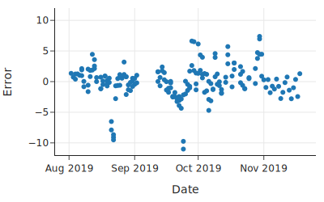

*   我们发现 8 月底和 9 月底有几天残差明显偏低（实际值远低于预测值）。
*   回到原始散点图，也能看到主点云下方有两个小的水平点群。
*   这提示我们应该去检查那几天的设备是否正常工作。

**模型精度的直观感受**

*   残差标准差 (SD of errors): 约 2.80 ppm
*   原始数据标准差 (SD of pm25pa): 约 6.95 ppm
*   结论：模型显著降低了不确定性。虽然 2.8 ppm 的误差在空气非常清洁时显得较大，但在我们更关心的污染情况下，这个误差是可以接受的。

### 3.9 简单线性模型的拟合原理

在本章前面我们提到，当最小化数据的平均损失（均方误差 MSE）时：

$$
\frac{1}{n} \sum_{i}[y_i - (\theta_0 + \theta_1 x_i)]^2
$$

最佳拟合线的截距和斜率为：

$$
\begin{aligned}
\hat{\theta}_0 &= \bar{y} - \hat{\theta}_1 \bar{x} \\
\hat{\theta}_1 &= r({\mathbf{x}},{\mathbf{y}}) \frac{SD({\mathbf{y}})}{SD({\mathbf{x}})}
\end{aligned}
$$

在本节中，我们将使用微积分来推导这些结果。

简单线性模型的均方误差是两个模型参数（截距和斜率）的函数。这意味着如果我们使用微积分来寻找最小化参数值，我们需要找到 MSE 关 $\theta_0$ 和 $\theta_1$ 的偏导数。

当然，除了微积分，我们还可以通过其他技术找到这些最小值：

*   **梯度下降 (Gradient descent)**：当损失函数比较复杂时，可以使用梯度下降等数值优化技术来寻找近似解（详见后续章节）。
*   **二次公式 (Quadratic formula)**：由于平均损失是 $\theta_0$ 和 $\theta_1$ 的二次函数，我们可以利用二次公式结合代数运算来求解。
*   **几何论证 (Geometric argument)**：在本章稍后部分，我们将利用最小二乘法的几何解释来拟合多元线性模型。这种方法与毕达哥拉斯定理（勾股定理）有关，具有直观的优势。

我们选择微积分来优化简单线性模型，因为它快速且直接。首先，我们对均方误差求关于每个参数的偏导数（我们可以忽略 MSE 中的 $1/n$，因为它不影响最小值的位置）：

$$
\begin{aligned}
\frac{\partial}{\partial \theta_0} \sum_{i}[y_i - (\theta_0 + \theta_1 x_i)]^2
  &=  \sum_{i} 2 (y_i - \theta_0 - \theta_1 x_i ) (-1)\\
 & \\ 
\frac{\partial}{\partial \theta_1} \sum_{i}[y_i - (\theta_0 + \theta_1 x_i)]^2
  &= \sum_{i} 2 (y_i - \theta_0 - \theta_1 x_i) (-x_i)  
\end{aligned}
$$

然后我们将偏导数设为 0，并将等式两边同乘以 $-1/2$ 进行简化，得到：

$$
\begin{aligned}
 0   &= \sum_{i} (y_i - \hat{\theta}_0 - \hat{\theta}_1 x_i) \\
 0   &= \sum_{i} (y_i - \hat{\theta}_0 - \hat{\theta}_1 x_i)x_i \\
\end{aligned}
$$

这些方程被称为**正规方程 (Normal Equations)**。
在第一个方程中，我们看到 $\hat{\theta}_0$ 可以表示为 $\hat{\theta}_1$ 的函数（利用 $\sum \theta_0 = n\theta_0$）：

$$
\hat{\theta}_0 = \bar{y} - \hat{\theta}_1 \bar{x}
$$

将此值代入第二个方程，我们可以解出 $\hat{\theta}_1$：

$$
\begin{aligned}
 0   &= \sum_{i} (y_i - \bar y + \hat{\theta}_1 \bar x - \hat{\theta}_1 x_i ) x_i \\
  &= \sum_{i} [(y_i - \bar y) - \hat{\theta}_1 ( x_i - \bar x)]x_i \\ 
\hat{\theta}_1  &= \frac{\sum_{i} (y_i - \bar y)x_i} {\sum_{i}( x_i - \bar x)x_i} \\
\end{aligned}
$$

经过一些代数变换（利用 $\sum(x_i - \bar{x}) = 0$ 的性质），我们可以将 $\hat{\theta}_1$ 表示为我们需要熟悉的形式：

$$
\hat{\theta}_1 = r({\mathbf{x}},{\mathbf{y}}) \frac{SD({\mathbf{y}})}{SD({\mathbf{x}})}
$$

正如本章前面所示，这种表示法意味着拟合线上的一点 $x$ 可以写成如下形式：

$$ 
\hat{\theta}_0 + \hat{\theta}_1 x 
= \bar{y} + r({\mathbf{x}},{\mathbf{y}}) SD({\mathbf{y}}) \frac{(x - \bar{x})}{SD({\mathbf{x}})} 
$$

我们已经推导出了上一节中使用的最小二乘线方程。在那里，我们使用 `pandas` 的内置方法计算 $SD(\mathbf{x})$, $SD(\mathbf{y})$ 和 $r(\mathbf{x}, \mathbf{y})$ 来计算直线方程。

然而，**在实践中，我们推荐使用 `scikit-learn` 提供的功能来进行模型拟合**，因为它提供了数值稳定的算法，这在拟合多个变量时尤为重要。

```python
from sklearn.linear_model import LinearRegression 

# 注意 x 需要是 DataFrame 或 2D 数组形式，这也是为了适应多元回归
y = GA['pm25pa']
x = GA[['pm25aqs']]

reg = LinearRegression().fit(x, y)

print(f"Model: PA estimate = {reg.intercept_:.2f} + {reg.coef_[0]:.2f}AQS")
# 输出: Model: PA estimate = -3.36 + 2.10AQS
```

可以看到结果与我们手动计算的一致。

至此，我们完成了简单线性模型及其拟合原理的介绍。接下来，我们将探讨更复杂的场景：**多重线性模型 (Multiple Linear Models)**。

## 4. 多重线性模型 (Multiple Linear Models)

到目前为止，我们只使用了一个输入变量来预测结果变量。现在我们将引入多重线性模型，即使用多个特征来进行预测（或描述、解释）。拥有多个解释变量可以改善模型对数据的拟合效果，并提高预测准确性。

我们从简单线性模型推广到包含第二个解释变量 $x_2$ 的模型。这个模型关于 $x_1$ 和 $x_2$ 都是线性的；意味着对于每一对 $x_1$ 和 $x_2$ 的值，我们可以通过线性组合来描述、解释或预测 $y$：

$$
y \approx \theta_0 + \theta_1 x_1 + \theta_2 x_2
$$

请注意，对于特定的 $x_2$ 值，比如 $x_2 = k$，我们可以将上述方程重写为：

$$
y \approx (\theta_0 + \theta_2 k) + \theta_1 x_1
$$

换句话说，当我们将 $x_2$ 保持在常数 $k$ 时，$y$ 和 $x_1$ 之间存在简单的线性关系，其斜率为 $\theta_1$，截距为 $\theta_0 + \theta_2 k$。对于不同的 $x_2$ 值，比如 $c$，我们再次得到 $y$ 和 $x_1$ 之间的简单线性关系。此时关于 $x_1$ 的斜率保持不变，唯一改变的是截距，现在变成了 $\theta_0 + \theta_2 c$。

在多重线性回归中，我们需要记住在模型中存在其他变量的情况下解释系数 $\theta_1$。保持模型中其他变量的值固定（在本例中只有 $x_2$），$x_1$ 每增加 1 个单位，平均对应 $y$ 变化 $\theta_1$。可视化这种多重线性关系的一种方法是创建 $y$ 关于 $x_1$ 的分面散点图，其中每个小图中 $x_2$ 的值大致相同。接下来，我们将通过制作空气质量测量的散点图来展示这一点，并提供拟合多重线性模型时应检查的其他可视化和统计数据示例。

### 4.1 加入天气因素：相对湿度

研究空气质量监测器的科学家一直在寻找包含天气因素的改进模型。他们检查的一个天气变量是相对湿度的日测量值。我们要考虑一个双变量线性模型，利用 AQS 传感器测量值和相对湿度来解释 PurpleAir 的测量值。该模型形式如下：

$$
\text{PurpleAir} \approx \theta_0 + \theta_1 \text{AQS} + \theta_2 \text{RH}
$$

其中 PurpleAir、AQS 和 RH 分别指代 PurpleAir 日均测量值、AQS 测量值和相对湿度。

**分面可视化**

第一步，我们制作一个分面图，在相对湿度固定的情况下比较两种空气质量测量值之间的关系。为此，我们将相对湿度转换为分类变量，使每个分面包含湿度相似的观测值：

```python
rh_cat = pd.cut(GA['rh'], bins=[43,50,55,60,78], 
                labels=['<50','50-55','55-60','>60'])
```

然后我们利用这个定性特征将数据细分为 2x2 的散点图面板：

```python
fig = px.scatter(GA, x='pm25aqs', y='pm25pa', 
                 facet_col=rh_cat, facet_col_wrap=2,
                 facet_row_spacing=0.15,
                 labels={'pm25aqs':'AQS PM2.5', 'pm25pa':'PurpleAir PM2.5'},
                 width=550, height=350)

fig.update_layout(margin=dict(t=30))
fig.show()
```

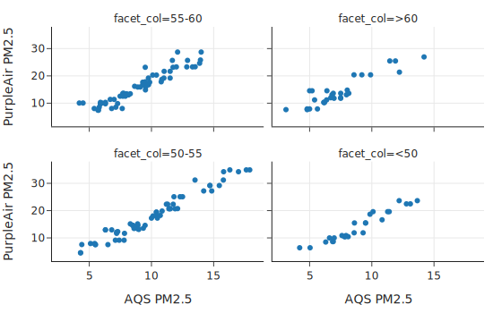

这四个图显示了两种空气质量测量源之间的线性关系。并且斜率看起来很相似，这意味着多重线性模型可能拟合得很好。但这很难从这些图中看出相对湿度是否对截距有很大影响。

**成对关系检查**

我们还想检查这三个特征之间的成对散点图。当两个解释特征高度相关时，模型中的系数可能会不稳定。虽然三个或更多特征之间的线性关系可能不会出现在成对图中，但检查一下仍然是一个好主意：

```python
fig = px.scatter_matrix(
    GA[['pm25pa', 'pm25aqs', 'rh']],
    labels={'pm25aqs':'AQS', 'pm25pa':'PurpleAir', 'rh':'Humidity'},
    width=550, height=400)

fig.update_traces(diagonal_visible=False)
fig.show()
```

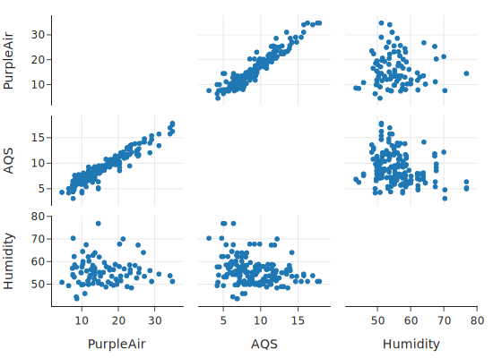

湿度和空气质量之间的关系看起来并不是特别强。我们应该检查的另一个成对指标是特征之间的相关性：

```python
print(GA[['pm25pa', 'pm25aqs', 'rh']].corr())
```
输出：
```text
         pm25pa   pm25aqs        rh
pm25pa   1.000000  0.947935 -0.059483
pm25aqs  0.947935  1.000000 -0.239841
rh      -0.059483 -0.239841  1.000000
```

一个小小的意外是，相对湿度与 AQS 空气质量测量值呈微弱的负相关。这表明湿度可能在模型中有所帮助。

### 4.2 拟合多重线性模型

在下一节中，我们将推导拟合方程。但现在，我们要使用 `LinearRegression` 的功能来拟合模型。与之前唯一的区别是我们为解释变量提供了两列（这就是为什么输入 X 是一个数据框）：

```python
from sklearn.linear_model import LinearRegression

y = GA['pm25pa']
X2 = GA[['pm25aqs', 'rh']]

model2 = LinearRegression().fit(X2, y)
```

拟合后的多重线性模型（包括系数单位）是：

```python
print(f"PA estimate = {model2.intercept_:.1f} ppm +", 
      f"{model2.coef_[0]:.2f} ppm/ppm x AQS + ",  
      f"{model2.coef_[1]:.2f} ppm/percent x RH")
# 输出: PA estimate = -15.8 ppm + 2.25 ppm/ppm x AQS +  0.21 ppm/percent x RH
```

模型中湿度的系数表示，相对湿度每增加一个百分点，空气质量预测值就会调整 0.21 ppm。注意 AQS 的系数与我们之前拟合的简单线性模型不同。这是因为该系数反映了来自相对湿度的额外信息。

### 4.3 评估拟合优度

最后，为了检查拟合质量，我们制作预测值与残差的图。这次，我们使用 `LinearRegression` 来为我们计算预测值：

```python
predicted_2var = model2.predict(X2)
error_2var = y - predicted_2var
fig = px.scatter(y = error_2var, x=predicted_2var,
                 labels={"y": "Error", "x": "Predicted PurpleAir measurement"},
                 width=350, height=250)

fig.update_yaxes(range=[-12, 12])
fig.add_hline(0, line_width=3, line_dash='dash', opacity=1)

fig.show()
```

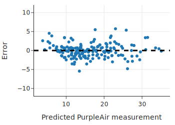

残差图似乎没有明显的模式，这表明模型拟合得相当好。还要注意，误差几乎都落在 -4 到 +4 ppm 之间，这比简单线性模型的范围要小。我们可以发现残差的标准差小了很多：

```python
print(error_2var.std())
# 输出: 1.8211427707294048
```

残差标准差从单变量模型中的 2.8 ppm 降低到了 1.8 ppm，这是一个相当大的缩减。

当有一个以上的解释变量时，相关系数无法捕捉线性关联模型的强度。相反，我们调整 MSE 来让我们了解模型的拟合程度。在下一节中，我们将描述如何拟合多重线性模型并使用 MSE 评估拟合。

### 4.4 拟合多重线性模型

上一节我们考虑了两个解释变量的情况。现在我们要将这种方法推广到 $p$ 个解释变量。用不同的字母来表示变量的方法很快就会不够用。相反，我们使用一种更形式化和通用的方法，将多个预测变量表示为一个矩阵，称为**设计矩阵 (Design Matrix)**，记为 $\textbf{X}$。

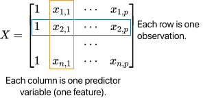

$\textbf{X}$ 的形状为 $n \times (p + 1)$。每一列代表一个特征，每一行代表一个观测值。即 $x_{i,j}$ 是第 $i$ 个观测值在第 $j$ 个特征上的测量值。通常第一列是全为 1 的列，对应于截距项 $\theta_0$。

> **注意**：设计矩阵定义为数学矩阵，而不是数据框。但在 Python 中，大多数建模库都将数值型数据框视为矩阵处理，因此通常不需要手动转换。

对于给定的观测值（例如 $\textbf{X}$ 中的第 2 行），我们将结果 $y_2$ 近似为线性组合：

$$
y_2 \approx  \theta_0 + \theta_1 x_{2,1} + \ldots + \theta_p x_{2,p}
$$

使用矩阵符号表示线性近似更为方便。我们把模型参数写成 $p+1$ 维列向量 ${\boldsymbol{\theta}}$：

$$
{\boldsymbol{\theta}} =  
\begin{bmatrix}
\theta_0 \\
\theta_1 \\
\vdots \\
\theta_p
\end{bmatrix}
$$

结合这些符号定义，我们可以使用矩阵乘法写出整个数据集的预测向量：

$$
{\textbf{X}} {\boldsymbol{\theta}}
$$

检查 $\textbf{X}$ 和 $\boldsymbol{\theta}$ 的维度，可以确认 ${\textbf{X}} {\boldsymbol{\theta}}$ 是一个 $n$ 维列向量。
因此，使用此线性预测的误差可以表示为向量：

$$ \mathbf{e} = \mathbf{y}  - {\textbf{X}} {\boldsymbol{\theta}}$$

其中结果变量也表示为列向量 $\mathbf{y}$。

**几何解释与最小二乘法**

我们的目标是找到使均方误差 (MSE) 最小的模型参数 $(\theta_0, \theta_1, \ldots, \theta_p)$：

$$
\frac{1}{n} \sum_i [y_i - (\theta_0 + \theta_1 x_{i,1} + \cdots + \theta_p x_{i,p})]^2 
= \frac{1}{n}  \lVert \mathbf{y} - {\textbf{X}} {\boldsymbol{\theta}} \rVert^2
$$

这里 $\lVert\mathbf{v}\rVert^2$ 表示向量 $\mathbf{v}$ 的欧几里得范数的平方（即元素平方和）。最小化 MSE 等同于寻找最短的误差向量。

我们可以像简单线性模型那样使用微积分求解，但**几何论证**更为直观。

1.  **向量空间**：模型预测向量和真实结果向量都可以看作向量空间中的向量。
2.  **生成空间 (Span)**：当我们改变参数 ${\boldsymbol{\theta}}$ 时，模型做出不同的预测，但任何预测都必须是 $\mathbf{X}$ 列向量的线性组合。也就是说，预测值必须位于 $\mathbf{X}$ 的**生成空间 (Span)** 中，记为 $\text{span}(\mathbf{X})$。
3.  **最佳预测**：虽然由于 $\mathbf{y}$ 通常不在 $\text{span}(\mathbf{X})$ 中，误差无法为零，但我们可以找到 $\text{span}(\mathbf{X})$ 中距离 $\mathbf{y}$ 最近的向量 $\mathbf{\hat{y}}$。
4.  **正交性**：几何上，当误差向量 $\mathbf{e} = \mathbf{y} - \mathbf{\hat{y}}$ **垂直 (Perpendicular/Orthogonal)** 于 $\text{span}(\mathbf{X})$ 时，误差向量的长度最小。即在可能的预测中，误差向量的长度最小。

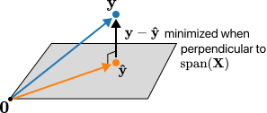

利用 $\mathbf{e}$ 必须垂直于 $\mathbf{\hat{y}}$ (以及整个 $\text{span}(\mathbf{X})$) 这一事实，我们可以推导 $\boldsymbol{\hat{\theta}}$ 的公式：

$$
\begin{aligned}
\textbf{X} \boldsymbol{\hat{\theta}} + \mathbf{e} &= \mathbf{y}  & (\text{定义}) \\
{\textbf{X}}^\top \textbf{X} \hat{\boldsymbol{\theta}} + {\textbf{X}}^\top \mathbf{e} &= {\textbf{X}}^\top \mathbf{y}
    & (\text{两边左乘 } {\textbf{X}}^\top) \\
{\textbf{X}}^\top \textbf{X} \hat{\boldsymbol{\theta}} &= {\textbf{X}}^\top \mathbf{y}
    & (\text{因为 } \mathbf{e} \perp \text{span}(\textbf{X}), \text{所以 } {\textbf{X}}^\top \mathbf{e} = 0) \\
\boldsymbol{\hat{\theta}} &= ({\textbf{X}}^\top \textbf{X})^{-1} {\textbf{X}}^\top \mathbf{y}
 & (\text{两边左乘 } ({\textbf{X}}^\top \textbf{X})^{-1})
\end{aligned}
$$

这就是著名的**正规方程 (Normal Equation)** 的解。

> **注意**：虽然我们可以根据公式编写函数来求解 $\boldsymbol{\hat{\theta}}$，但我们强烈建议使用 `scikit-learn` 或 `statsmodels` 等库中经过优化的方法。它们可以处理设计矩阵稀疏、高度共线或不可逆的情况。

**残差与 $R^2$**

这个解揭示了拟合系数和预测的一些有用性质：

*   残差 $\mathbf{e}$ 与预测值 $\hat{\mathbf{y}}$ 正交。
*   如果模型包含截距项，残差的平均值为 0。
*   残差的方差就是 MSE。

!!! note "为什么残差均值是 0 而方差是 MSE？"
    这些性质是最小二乘法的直接数学推论：
    
    1.  **残差均值为 0**：如果模型包含截距项，设计矩阵 $\mathbf{X}$ 中会有一列全为 1。由于残差向量 $\mathbf{e}$ 垂直于 $\mathbf{X}$ 的每一列（正交性），它也垂直于全 1 列，这意味着所有残差之和为 0 ($\sum e_i = 0$)，因此均值也为 0。这也符合直观逻辑：如果残差均值不为 0（例如预测普遍偏低），我们完全可以通过上下平移截距来进一步减小误差，直到均值为 0 为止。
    2.  **残差方差即 MSE**：方差的定义是 $\frac{1}{n}\sum(e_i - \bar{e})^2$。既然 $\bar{e}=0$，那么方差就变成了 $\frac{1}{n}\sum e_i^2$，这恰好就是 MSE 的定义。这说明在使用最小二乘法时，MSE 本质上衡量的是模型未能解释部分的波动程度。

这些性质解释了为什么我们要检查残差与预测值的散点图。如果残差图中显示出线性模式，说明还有信息没被模型捕捉。

除了检查误差的标准差，**多重 $R^2$ (Multiple $R^2$)** 也是衡量模型拟合度的一个指标，定义为：

$$ 
R^2 =  1 - \frac {\lVert \mathbf{y} - {\textbf{X}}{\boldsymbol{\hat{\theta}}} \rVert^2}
  {\lVert {\mathbf{y}} - \bar{y} \rVert^2}
$$

随着模型拟合得越来越好，$R^2$ 会越来越接近 1。但这并不总是好事，因为即使添加无意义的特征，只要它们扩展了 $\text{span}(\textbf{X})$，$R^2$ 也会增加。为了考虑模型的大小，我们通常会对其进行调整（Adjusted $R^2$），或者通过交叉验证来选择模型。

接下来，我们将考虑一个社会科学的例子，那里通常有许多变量可用于建模。

### 4.5 案例分析：机遇之地在哪里？

美国常被称为“机遇之地”，因为人们相信即使是资源匮乏的人也能在这里变得富有——经济学家称这种观念为“**经济流动性 (Economic Mobility)**”。经济学家 Raj Chetty 及其同事对美国的经济流动性进行了大规模的数据分析。他的基本问题是：美国是否是机遇之地？为了回答这个有些模糊的问题，Chetty 需要一种衡量经济流动性的方法。

Chetty 获得了 1980 年至 1982 年出生的所有美国人的 2011-2012 年联邦所得税记录，以及他们出生那年的父母纳税记录。通过查找将 30 岁的人列为家属的 1980-1982 年父母纳税记录，他们将两代人匹配起来。总共有大约 1000 万人的数据集。

为了衡量经济流动性，Chetty 将特定地理区域出生且父母收入在 1980-1982 年处于**第 25 百分位**的人群分为一组。然后，他找出了该组在 2011 年的平均收入百分位。Chetty 将其称为**平均绝对向上流动性 (Average Absolute Upward Mobility, AUM)**。

*   如果一个地区的 AUM 为 25，意味着出生在第 25 百分位的人通常停留在第 25 百分位——这就是阶层固化。
*   较高的 AUM 值意味着该地区有更多的向上流动性。在这些地区出生于第 25 收入百分位的人，通常最终会进入比他们父母更高的收入阶层。
*   作为参考，撰写本文时美国的平均 AUM 约为 41。

Chetty 计算了称为**通勤区 (Commuting Zones, CZs)** 的地区的 AUM，这些区域大致与县的规模相当。虽然原始数据的粒度是个体，但公开数据的粒度是 CZ 级别（出于隐私保护）。

> **注意**：即使是 CZ 级别的粒度，仍可能存在覆盖偏差（小 CZ 被排除以防识别个人）和测量偏差（极其富有的人可能不通过常规方式纳税）。此外，使用区域平均值而非个体测量值时，需警惕**生态谬误 (Ecological Regression)**——聚合层面发现的相关性往往比个体层面更高。

Chetty 的直觉是美国某些地方的经济流动性比其他地方高。他的分析证实了这一点：例如旧金山、华盛顿特区和西雅图的流动性高于夏洛特、密尔沃基和亚特兰大。Chetty 使用线性模型发现，种族隔离、收入不平等和当地学校系统等社会经济因素与经济流动性相关。

在我们的分析中，结果变量是通勤区的 AUM。我们将从一个特定特征开始调查：**通勤时间在 15 分钟或更短的人口比例**。

**单变量模型：通勤时间**

我们首先加载数据 `cz_df`，每一行代表一个通勤区：

```python
# 假设 cz_df 已经加载
# 包含列：aum (结果), travel_lt15 (通勤<15分钟比例), ...
print(cz_df.shape)
# (705, 9)
```

我们将 AUM 与短通勤时间比例 `travel_lt15` 绘制散点图：

```python
px.scatter(cz_df, x='travel_lt15', y='aum', width=350, height=250,
          labels={'travel_lt15':'Commute time under 15 min', 
                  'aum':'Upward mobility'})
```

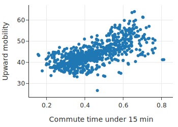

散点图显示出大致的线性关联，相关系数也很强 (0.68)。我们拟合一个简单线性模型：

```python
from sklearn.linear_model import LinearRegression

y = cz_df['aum']
X = cz_df[['travel_lt15']]

model_ct = LinearRegression().fit(X, y)
print(f"Intercept: {model_ct.intercept_:.1f}")
print(f"Slope: {model_ct.coef_[0]:.1f}")
# Intercept: 31.3
# Slope: 28.7
```
有趣的是，通勤区向上流动性的增加与拥有短通勤时间的人口比例增加有关。

**模型评估**

我们可以比较 AUM 测量的标准差与残差的标准差：

*   SD(errors): 4.14
*   SD(AUM): 5.61

误差的大小比常数模型（即直接用均值预测）减小了约 25%。

**双变量模型：引入单亲家庭比例**

Chetty 的原始分析中包含了许多高层特征。我们选取其中 7 个（如基尼系数、宗教信仰比例、单亲妈妈比例等）。
此时，我们发现 `single_mom`（单亲妈妈比例）与 AUM 的负相关性最强 (-0.77)。我们尝试构建一个包含 `travel_lt15` 和 `single_mom` 的双变量模型。

```python
X2 = cz_df[['travel_lt15', 'single_mom']]
y = cz_df['aum']

model_ct_sm = LinearRegression().fit(X2, y)
```
注意，新模型中通勤时间的系数与简单线性模型中的系数会有很大不同，因为这两个特征本身是高度相关的（相关系数 -0.42，虽然不算极高，但足以产生影响）。

**多变量模型：全特征**

最后，我们拟合一个包含所有 7 个特征的模型。
我们比较三种模型的 $R^2$：

*   1 变量模型（通勤时间）: 0.46
*   2 变量模型（通勤时间 + 单亲妈妈）: 0.74
*   7 变量模型（全特征）: 0.79

结论是：从单变量到双变量，模型的解释能力大幅提升。但从 2 个变量增加到 7 个变量，提升幅度很小。考虑到模型复杂性，双变量模型可能是一个性价比很高的选择。

到目前为止，我们的模型只使用了数值型预测变量。但类别型数据（Categorical Data）通常也很有用。此外，我们还可以对变量进行变换或组合。接下来我们将讨论如何将这些情况纳入线性模型。

## 5. 特征工程：数值型特征的变换

到目前为止，本章拟合的所有模型都使用了数据框中最初提供的数值特征。在本节中，我们将研究通过对数值特征进行变换而创建的变量。将变量变换以用于建模的过程称为**特征工程 (Feature Engineering)**。

我们在先前章节中介绍过特征工程，当时我们对特征进行变换使其分布更加对称。变换可以捕捉数据中的更多模式，从而产生更好、更准确的模型。

我们回到此前章节用作示例的数据集：**旧金山湾区的房屋销售价格**。我们将数据限制在 2006 年出售的房屋，当时销售价格相对稳定，因此不需要考虑价格趋势。

我们希望对销售价格进行建模。回想一下，此前章节的可视化显示，销售价格与房屋大小、地块大小、卧室数量和位置等几个特征相关。我们对销售价格和房屋大小都进行了对数变换以改善它们的关系，并且按卧室数量和城市绘制的销售价格箱线图也揭示了有趣的关系。在本节中，我们将在线性模型中包含变换后的数值特征。在下一节中，我们还将向模型中添加有序特征（卧室数量）和标称特征（城市）。

### 5.1 为什么要变换？

我们首先根据房屋大小对销售价格进行建模。相关矩阵告诉我们，哪个数值解释变量（原始的和变换后的）与销售价格的相关性最强：

```python
# sfh 是房屋销售数据
display_df(sfh.drop(columns=['city']).corr(), cols=9, rows=9)
```

|           | price | br   | lsqft | bsqft | log_price | log_bsqft | log_lsqft | ppsf  | log_ppsf |
| :-------- | :---- | :--- | :---- | :---- | :-------- | :-------- | :-------- | :---- | :------- |
| price     | 1.00  | 0.45 | 0.59  | 0.79  | 0.94      | 0.74      | 0.62      | 0.49  | 0.47     |
| br        | 0.45  | 1.00 | 0.29  | 0.67  | 0.47      | 0.71      | 0.38      | -0.18 | -0.21    |
| ...       | ...   | ...  | ...   | ...   | ...       | ...       | ...       | ...   | ...      |
| log_price | **0.94**| 0.47 | 0.55  | 0.76  | 1.00      | **0.78**    | 0.62      | 0.51  | 0.52     |
| log_bsqft | 0.74  | 0.71 | 0.44  | 0.96  | **0.78**    | 1.00      | 0.52      | -0.11 | -0.14    |

销售价格与房屋大小（`bsqft`，建筑平方英尺）的相关性最高。我们绘制销售价格与房屋大小的散点图以确认这种关联是线性的：

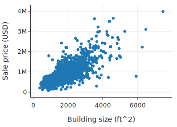

关系看起来大致是线性的，但非常大和昂贵的房子远离分布中心，可能会过度影响模型。正如此前章节所示，对数变换使价格和大小的分布更加对称（都使用以 10 为底的对数，以便于转换回原始单位）：

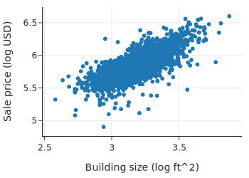

理想情况下，使用变换的模型在数据背景下应该是有意义的。如果我们拟合一个基于 $\log(\text{size})$ 的简单线性模型，那么当我们检查系数时，我们会从**百分比增长**的角度来思考。例如，$x$ 翻倍会使预测值增加 $\theta \log(2)$，因为 $\theta \log(2x) = \theta \log(2) + \theta \log(x)$。

### 5.2 线性模型的广义理解

让我们首先拟合一个用房屋对数变换后的大小来解释对数变换后价格的模型。但首先我们要注意，**这个模型仍然被认为是线性模型**。如果我们用 $y$ 表示销售价格，$x$ 表示房屋大小，那么模型是：

$$
\begin{aligned}
\log(y) ~&=~ \theta_0 + \theta_1\log(x) 
\end{aligned}
$$

（注意，我们在等式中忽略了近似符号，以使线性关系更清晰。）

这个方程看起来可能不是线性的，但如果我们把 $\log(y)$ 重命名为 $w$，把 $\log(x)$ 重命名为 $v$，那么我们可以把这种“双对数 (log-log)”关系表示为 $w$ 和 $v$ 的线性模型：

$$
w ~=~ \theta_0 + \theta_1 v
$$

其他可以表示为变换特征线性组合的模型示例包括：

$$
\begin{aligned}
\log(y) ~&=~ \theta_0 + \theta_1 x  \\
y ~&=~ \theta_0 + \theta_1 x + \theta_2 x^2 \\
y ~&=~ \theta_0 + \theta_1 x + \theta_2 z  + \theta_3 x z  
\end{aligned}
$$

同样，如果我们重命名变量（例如 $u = x^2$, $t = xz$），这些模型都可以看作是新特征的线性模型。

简而言之，我们可以认为包含非线性变换和/或特征组合的模型在其**衍生特征 (Derived Features)** 上是线性的。在实践中，我们在描述模型时不重命名变换后的特征；相反，我们使用原始特征的变换形式来书写模型，因为跟踪它们很重要，特别是在解释系数和检查残差图时。

我们通常这样称呼这些模型：

*   **双对数 (Log-Log)**：结果变量和解释变量都进行了对数变换。
*   **对数线性 (Log-Linear)**：结果变量进行了对数变换，但解释变量没有。
*   **多项式特征 (Polynomial Features)**：包括解释变量的幂次变换（如 $x$ 和 $x^2$）。
*   **交互项 (Interaction Term)**：当模型中包含两个解释特征的乘积时。

### 5.3 拟合双对数模型

让我们拟合一个价格对大小的双对数模型：

```python
X1_log = sfh[['log_bsqft']]    
y_log = sfh['log_price']

model1_log_log = LinearRegression().fit(X1_log, y_log)
```

这个模型的系数和预测值不能直接与使用线性特征拟合的模型进行比较，因为单位是对数美元和对数平方英尺，而不是美元和平方英尺。

接下来，我们检查残差图：

```python
prediction = model1_log_log.predict(X1_log)
error = y_log - prediction 

fig = px.scatter(x=prediction, y=error,
                 labels=dict(x='Predicted sale price (log USD)', y='Error'),
                 width=350, height=250)

fig.add_hline(0, line_width=2, line_dash='dash', opacity=1)
fig.show()
```

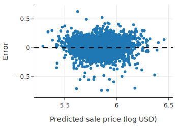

残差图看起来很合理，包含了成千上万个点，很难看出曲率。

为了查看其他变量是否有帮助，我们可以将拟合模型的残差与**未在模型中使用的变量**进行绘图。如果我们看到模式，那表明我们可能希望包含此额外特征或其变换。早些时候，我们发现价格分布与房屋所在的城市有关，所以让我们检查残差与城市之间的关系：

```python
sfh = sfh.assign(errors1_log=error)
px.box(sfh, x='city', y='errors1_log',
       category_orders={"city":["Piedmont","Lamorinda","Berkeley", "Richmond"]},
       labels=dict(errors1_log='Prediction error (log USD)', city=''), 
       width=450, height=250)
```

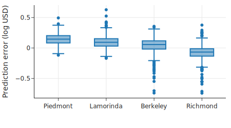

这张图向我们展示了误差的分布随城市发生偏移。

*   **Piedmont**：超过 75% 的已售房屋有正误差，意味着实际售价高于预测值。
*   **Richmond**：超过 75% 的售价低于预测值。

这些模式表明我们应该在模型中包含城市。从背景来看，位置影响售价是有道理的。在下一节中，我们将展示如何将**标称变量 (Nominal Variable)** 纳入线性模型。

## 6. 特征工程：类别型特征 (Categorical Features)

我们在最开始章节中拟合的第一个模型是常数模型。在那里，我们最小化平方损失来找到最佳拟合常数：

$$
\min_c \sum_i (y_i - c)^2
$$

我们可以以类似的方式考虑在模型中包含标称特征（Nominal Feature）。也就是说，我们要为数据中对应于每个类别的子组找到最佳拟合常数：

$$
\begin{aligned}
\min_{c_B} \sum_{i \in \textrm{Berkeley}} (y_i - c_B)^2
~~~&~~~  \min_{c_L} \sum_{i \in \textrm{Lamorinda}} (y_i - c_L)^2 \\
 \min_{c_P} \sum_{i \in \textrm{Piedmont}} (y_i - c_P)^2
~~~&~~~ \min_{c_R} \sum_{i \in \textrm{Richmond}} (y_i - c_R)^2 
\end{aligned}
$$

描述这个模型的另一种方式是使用**独热编码 (One-Hot Encoding)**。

独热编码获取一个类别特征，并创建多个只能取值 0 或 1 的数值特征。
为了对一个特征进行独热编码，我们为每个唯一的类别创建新特征。
在这种情况下，因为我们有四个城市——Berkeley, Lamorinda, Piedmont, 和 Richmond——我们在设计矩阵中创建四个新特征，称为 $X_{city}$。
$X_{city}$ 中的每一行包含一个 1，出现在对应城市的列中。该行的所有其他列包含 0。
下图展示了这个概念：

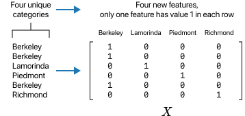

现在我们可以简洁地表示模型如下：

$$
\theta_B x_{i,B} ~+~ \theta_L x_{i,L} ~+~ \theta_P x_{i,P} ~+~ \theta_R x_{i,R}
$$

在这里，我们用 $B, L, P, R$ 而不是 $j$ 来索引设计矩阵的列，以便清楚地表明每一列代表一列 0 和 1。例如，如果第 $i$ 所房子位于 Piedmont，那么 $x_{i,P}$ 就为 1。

!!! note "注意"
    独热编码创建的特征只有 0-1 值。这些特征也被称为**虚拟变量 (Dummy Variable)** 或**指示变量 (Indicator Variable)**。
    “虚拟变量”一词在计量经济学中更常见，而“指示变量”在统计学中更常见。

我们的目标是最小化关于 $\boldsymbol{\theta}$ 的最小二乘损失：

$$
\begin{aligned}
\| \mathbf{y} - \textbf{X}\boldsymbol{\theta} \|^2 &amp;=
\sum_i (y_i - \theta_B x_{i,B} - \theta_L x_{i,L} - \theta_P x_{i,P} - \theta_R x_{i,R})^2 \\
&amp; = \sum_{i \in Berkeley} (y_i - \theta_B x_{i,B})^2 ~+~ \sum_{i \in Lamorinda} (y_i -\theta_L x_{i,L})^2 \\
~~~~~~~~&amp; ~+~ \sum_{i \in Piedmont} (y_i -\theta_P x_{i,P})^2 ~+~ \sum_{i \in Richmond} (y_i -\theta_R x_{i,R})^2
\end{aligned}
$$

其中 $\boldsymbol{\theta}$ 是列向量 $[\theta_B, \theta_L, \theta_P, \theta_R]$。请注意，这个最小化问题简化为四个最小化问题，每个城市一个。这就是我们在本节开头提到的想法。

我们可以使用 `OneHotEncoder` 来创建这个设计矩阵：

```python
from sklearn.preprocessing import OneHotEncoder

enc = OneHotEncoder(
    # categories 参数设置列的顺序
    categories=[["Berkeley", "Lamorinda", "Piedmont", "Richmond"]],
    sparse=False,
)

X_city = enc.fit_transform(sfh[['city']])

categories_city=["Berkeley","Lamorinda", "Piedmont", "Richmond"]
X_city_df = pd.DataFrame(X_city, columns=categories_city)

X_city_df
```

```text
      Berkeley  Lamorinda  Piedmont  Richmond
0          1.0        0.0       0.0       0.0
1          1.0        0.0       0.0       0.0
2          1.0        0.0       0.0       0.0
...        ...        ...       ...       ...
2664       0.0        0.0       0.0       1.0
2665       0.0        0.0       0.0       1.0
2666       0.0        0.0       0.0       1.0

2667 rows × 4 columns
```

让我们使用这些独热编码特征拟合一个模型：

```python
y_log = sfh['log_price']

# fit_intercept=False 因为我们的特征已经涵盖了截距项（所有城市）
model_city = LinearRegression(fit_intercept=False).fit(X_city_df, y_log)
print(f"R-square for city model: {model_city.score(X_city_df, y_log):.2f}\n")
```

```text
R-square for city model: 0.57
```

如果我们只知道房子所在的城市，该模型在估计售价方面做得相当好。以下是拟合的系数：

```python
model_city.coef_
```

```text
array([5.87, 6.03, 6.1 , 5.67])
```

正如从箱线图中所预料的那样，估计的销售价格（对数美元）取决于城市。但是，如果我们不仅知道城市，还知道房子的大小，应该能得到一个更好的模型。我们之前看到，用房屋大小解释销售价格的简单双对数模型拟合得相当好，因此我们期望城市特征（作为独热编码变量）应能进一步改进模型。

这样一个模型看起来是这样的：

$$
y_i ~\approx~ \theta_1x_i +  \theta_B x_{i,B} ~+~ \theta_L x_{i,L} 
~+~ \theta_P x_{i,P} ~+~ \theta_R x_{i,R}
$$

请注意，该模型描述了 $\log(\text{price})$（表示为 $y$）和 $\log(\text{size})$（表示为 $x$）之间的关系：它们是线性的，并且对于每个城市，$\log(\text{size})$ 的系数相同。但截距项取决于城市：

$$
\begin{aligned}
y_i ~&amp;\approx~ \theta_1x_i +  \theta_B  ~~&amp;\text{对于 Berkeley 的房子} \\
y_i ~&amp;\approx~ \theta_1x_i + \theta_L  ~~&amp;\text{对于 Lamorinda 的房子}\\
y_i ~&amp;\approx~ \theta_1x_i + \theta_P  ~~&amp;\text{对于 Piedmont 的房子}\\
y_i ~&amp;\approx~ \theta_1x_i + \theta_R  ~~&amp;\text{对于 Richmond 的房子}
\end{aligned}
$$

接下来我们制作一个分面散点图，每个城市一个，看看这种关系是否大致成立：

```python
fig = px.scatter(sfh, x='log_bsqft', y='log_price', 
                 facet_col='city', facet_col_wrap=2,
                 labels={'log_bsqft':'Building size (log ft^2)',
                        'log_price':'Sale price (log USD)'},
                 width=500, height=400)

fig.update_layout(margin=dict(t=30))
fig.show()
```

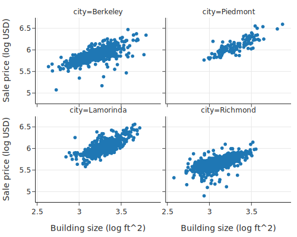

这种位移在散点图中很明显。我们将两个设计矩阵连接在一起，以拟合包含大小和城市的模型：

```python
X_size = sfh['log_bsqft'] 

X_city_size = pd.concat([X_size.reset_index(drop=True), X_city_df], axis=1)
X_city_size.head() # 查看前几行
```

现在让我们拟合一个包含定量特征（房屋大小）和定性特征（位置/城市）的模型：

```python
model_city_size = LinearRegression(fit_intercept=False).fit(X_city_size, y_log)
```

截距反映了哪些城市的房子更贵，即使考虑了房子的大小之后也是如此：

```python
model_city_size.coef_
```

```text
array([0.62, 3.89, 3.98, 4.03, 3.75])
```

```python
print(f"R-square for city and log(size):",
      f" {model_city_size.score(X_city_size, y_log):.2f}")
```

```text
R-square for city and log(size):  0.79
```

这个包含标称变量 `city` 和对数变换后的房屋大小的模型，比仅包含房屋大小的简单双对数模型以及仅为每个城市拟合常数的模型都要好。

请注意，我们从模型中删除了截距，以便每个子组都有自己的截距。
然而，一种常见的做法是从设计矩阵中删除一个独热编码特征并保留截距。例如，如果我们删除针对 Berkeley 房屋的特征并添加截距，那么模型就是：

$$
\theta_0 ~+~ \theta_1x_i ~+~ \theta_L x_{i,L} ~+~ \theta_P x_{i,P} ~+~ \theta_R x_{i,R}
$$

在这种表示中，虚拟变量系数的含义发生了变化。
例如，考虑 Berkeley 的房子和 Piedmont 的房子的方程：

$$
\begin{aligned}
\theta_0 &amp; ~+~ \theta_1x_i ~~&amp;\text{Berkeley 的房子} \\
\theta_0 &amp; ~+~ \theta_1x_i + \theta_P  ~~&amp;\text{Piedmont 的房子}
\end{aligned}
$$

在这种表示中，截距 $\theta_0$ 是针对 Berkeley 房屋的，而系数 $\theta_P$ 衡量的是 Piedmont 房屋与 Berkeley 房屋之间的典型差异。在这种表示中，我们可以更容易地将 $\theta_P$ 与 0 进行比较，看看这两个城市的平均价格是否基本相同。

如果我们包含截距以及所有的城市变量，那么设计矩阵的列是线性相关的，这意味着我们无法解出系数。在任何一种情况下我们的预测都是相同的，但最小化问题没有唯一解。

当我们包含两个类别变量的独热编码时，我们也更喜欢删除一个虚拟变量并包含截距项的模型表示。这种做法保持了系数解释的一致性。

### 6.1 使用 Statsmodels 处理类别变量

我们演示如何使用 `statsmodels` 库构建具有两组虚拟变量的模型。该库使用公式语言来描述要拟合的模型，因此我们不需要自己创建设计矩阵。我们要导入公式 API：

```python
import statsmodels.formula.api as smf
```

让我们首先重复拟合包含标称变量 `city` 和房屋大小的模型，以展示如何使用公式语言并比较结果：

```python
model_size_city = smf.ols(formula='log_price ~ log_bsqft + city',
                          data=sfh).fit()

print(model_size_city.params)
```

```text
Intercept            3.89
city[T.Lamorinda]    0.09
city[T.Piedmont]     0.14
city[T.Richmond]    -0.15
log_bsqft            0.62
dtype: float64
```

为 `formula` 参数提供的字符串描述了要拟合的模型。模型以 `log_price` 作为结果，并拟合 `log_bsqft` 和 `city` 的线性组合作为解释变量。请注意，我们不需要创建虚拟变量来拟合模型。方便的是，`smf.ols` 会自动为我们对城市特征进行独热编码。上述模型的拟合系数包括一个截距项，并删除了 Berkeley 指示变量（作为基准）。

如果我们想去掉截距，我们可以在公式中添加 `- 1`，这是一个表示从设计矩阵中删除全 1 列的惯例。在这个特定示例中，所有独热编码特征所张成的空间等同于由 1 向量和除一个之外的所有虚拟变量所张成的空间，因此拟合结果是相同的。然而，由于反映了设计矩阵的不同参数化，系数是不同的：

```python
smf.ols(formula='log_price ~ log_bsqft + city - 1', data=sfh).fit().params
```

```text
city[Berkeley]     3.89
city[Lamorinda]    3.98
city[Piedmont]     4.03
city[Richmond]     3.75
log_bsqft          0.62
dtype: float64
```

此外，我们可以在城市和大小变量之间添加交互项，以允许每个城市都有不同的大小系数。我们在公式通过添加 `log_bsqft:city` 项来指定这一点。这里我们不深入讨论细节。

### 6.2 处理有序变量

现在让我们拟合一个包含两个类别变量的模型：卧室数量 (`br`) 和城市。回想一下，我们通过将超过 6 的卧室数量重新赋值为 6，将其截断处理，这实际上将 6, 7, 8, ... 折叠成了一个 "6+" 的类别。我们可以通过按卧室数量绘制的价格（对数美元）箱线图看到这种关系：

```python
px.box(sfh, x="br", y="log_price", width=450, height=250,
      labels={'br':'Number of bedrooms','log_price':'Sale price (log USD)'})
```

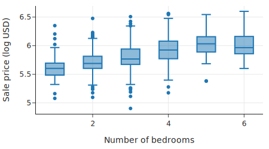

这种关系看起来不是线性的：每增加一间卧室，销售价格并不会增加相同的数量。鉴于卧室数量是离散的，我们可以将此特征视为类别特征，这允许每个卧室编码对成本有不同的贡献：

```python
model_size_city_br = smf.ols(formula='log_price ~ log_bsqft + city + C(br)',
                             data=sfh).fit()
```

我们在公式中使用了 `C(br)` 项来指示我们希望将卧室数量（虽然是数值型的）像类别变量一样处理。

让我们检查拟合的多元 $R^2$：

```python
model_size_city_br.rsquared.round(2)
```

```text
0.79
```

即使我们增加了五个独热编码特征，多元 $R^2$ 也没有增加。$R^2$ 针对模型中的参数数量进行了调整，以此衡量，它并不比之前只包含城市和大小的模型更好。

在本节中，我们介绍了定性特征的特征工程。我们看到独热编码技术如何让我们在线性模型中包含类别数据，并为模型参数提供自然的解释。

## 7. 总结

线性模型帮助我们描述特征之间的关系。我们讨论了简单线性模型，并将其扩展到多变量线性模型。在此过程中，我们应用了在建模中广泛有用的数学技术——微积分用于最小化简单线性模型的损失，矩阵几何用于多变量线性模型。

线性模型看起来可能很基础，但它们今天被用于各种各样的任务。而且它们足够灵活，允许我们包含类别特征以及变量的非线性变换，例如对数变换、多项式和比率。线性模型的优势在于对非技术人员来说具有广泛的可解释性，同时又足够复杂，可以捕捉数据中的许多常见模式。

我们可能会很诱惑地把所有可用变量都扔进模型里，以获得“最好的拟合”。但在拟合模型时，我们应该牢记最小二乘法的几何意义。回想一下，解释变量可以被视为 $n$ 维空间中的向量，如果这些向量高度相关，那么投影到这个空间上的结果将类似于投影到由更少向量组成的更小空间上的结果。这意味着：

*   添加更多变量可能不会对模型产生显著改进。
*   系数的解释可能会变得困难。
*   几个模型在预测/解释响应变量方面可能同样有效。

如果我们关心的是进行推断，即我们想要解释/理解模型，那么我们应该倾向于更简单的模型。另一方面，如果我们的主要关注点是模型的预测能力，那么我们往往不太关心系数的数量及其解释。但是，这种“黑盒”方法可能会导致模型过度依赖数据中的异常值，或者是模型在其他方面存在不足。因此，要小心这种方法，特别是当预测可能对人有害时。

在本章中，我们以描述性的方式使用了线性模型。我们介绍了一些通过检查残差模式、比较标准误差的大小和多元 $R^2$ 的变化来决定何时在模型中包含特征的概念。通常，我们会满足于更容易解释的更简单的模型。在下一章中，我们将探讨更形式化的工具来选择要包含在模型中的特征，以及如何评估模型的泛化能力。

下一章：[模型选择](12_模型选择.md)
