# 12. 模型选择

到目前为止，我们在拟合模型时，使用了一些策略来决定包含哪些特征：

*   通过残差图评估模型拟合度。
*   将统计模型与物理模型联系起来。
*   保持模型简单。
*   比较残差标准差和 MSE 在逐渐复杂的模型中的改进。

例如，当我们检查第 11 章中的向上流动性单变量模型时，我们在残差图中发现了曲率。添加第二个变量极大地改善了平均损失（MSE 和相关的多元 $R^2$），但残差中仍保留了一些曲率。然而，七个变量的模型在降低 MSE 方面相比两个变量的模型几乎没有改进，因此尽管两个变量的模型仍然显示出一些残差模式，我们还是选择了这个更简单的模型。

作为另一个例子，当我们将在后续章节对驴的体重进行建模时，我们将从物理模型中获得指导。我们将忽略驴的四肢，并利用圆桶和驴身体之间的相似性，开始拟合一个通过长度和周长（类似于圆桶的高度和周长）来解释体重的模型。然后，我们将继续通过添加与驴的身体状况和年龄相关的分类特征来调整该模型，合并类别并排除其他可能的特征以保持模型简单。

我们在构建这些模型时所做的决定是基于判断的，而在本章中，我们将通过更形式化的标准来增强这些判断。首先，我们提供一个例子来说明为什么在模型中包含太多特征通常不是一个好主意。这种现象称为**过拟合 (Overfitting)**，它通常会导致模型过于紧密地跟随数据并捕捉数据中的一些噪声。然后，当新的观测数据出现时，预测结果比来自更简单模型的预测结果更差。本章的其余部分提供了限制过拟合影响的技术，例如训练-测试分割 (train-test split)、交叉验证 (cross-validation) 和正则化 (regularization)。当模型中有大量潜在特征时，这些技术特别有用。我们还提供了一个合成示例，在这个示例中我们知道真正的模型，用来解释模型方差和偏差的概念，以及它们与过拟合和欠拟合的关系。

## 1. 过拟合 (Overfitting)

当我们有很多特征可以包含在模型中时，选择包含或排除哪些特征会很快变得复杂。在第 11 章的向上流动性示例中，我们选择了七个变量中的两个来拟合模型，但如果是两个变量的模型，我们可以检查和拟合 21 对特征。如果我们要考虑所有一个、两个、...、七个变量的模型，那么有一百多个模型可供选择。检查数百个残差图、决定多简单才算简单以及最终确定一个模型是很困难的。不幸的是，最小化 MSE 的概念也不完全有帮助。每当我们在模型中添加一个变量，MSE 通常都会变小。回想一下模型拟合的几何视角（第 11 章），向模型添加特征就是在特征空间中增加一个 $n$ 维向量，而结果向量与其在解释变量所张成的空间中的投影之间的误差会缩小。我们可能认为这是一件好事，因为我们的模型更贴近数据，但也存在过拟合的危险。

**过拟合 (Overfitting)** 发生在模型过于紧密地跟随数据并捕捉到结果中随机噪声的变异性时。当发生这种情况时，新的观测结果将难以被良好预测。通过一个例子可以澄清这个概念。

### 1.1 示例：能源消耗

在这个例子中，我们检查一个数据集，其中包含了明尼苏达州一处私人住宅的公用事业账单信息。我们有家庭每月的天然气使用量（立方英尺）和该月的平均温度（华氏度）。我们首先读取数据：

```python
heat_df = pd.read_csv("data/utilities.csv", usecols=["temp", "ccf"])
heat_df
```

```text
      temp  ccf
0     29    166
1     31    179
2     15    224
...   ...   ...
96    76    11
97    55    32
98    39    91

99 rows × 2 columns
```

让我们首先看一看作为温度函数的天然气消耗量的散点图：

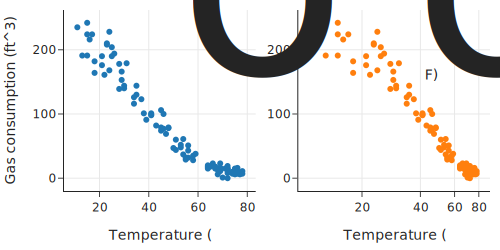

这种关系显示出曲率（左图），当我们试图用对数变换将其拉直时（右图），低温区域出现了不同的曲率。此外，还有两个异常点。当我们查阅文档时，我们发现这些点代表记录错误，因此我们将它们移除。

让我们看看二次曲线是否能捕捉天然气使用量和温度之间的关系。多项式仍然被认为是线性模型。它们对其多项式特征是线性的。例如，我们可以将二次模型表示为：

$$ y = \theta_0 + \theta_1 x + \theta_2 x^2 $$

这个模型在特征 $x$ 和 $x^2$ 上是线性的，用矩阵符号我们可以把这个模型写成 $\mathbf{y} = \mathbf{X}\boldsymbol{\theta}$，其中 $\mathbf{X}$ 是设计矩阵：

$$
\mathbf{X} = \begin{bmatrix}
1 & x_1 & x_1^2 \\
1 & x_2 & x_2^2 \\
\vdots & \vdots & \vdots \\
1 & x_n & x_n^2
\end{bmatrix}
$$

我们可以使用 scikit-learn 中的 `PolynomialFeatures` 工具创建设计矩阵的多项式特征：

```python
y = heat_df['ccf']
X = heat_df[['temp']]

from sklearn.preprocessing import PolynomialFeatures

poly = PolynomialFeatures(degree=2, include_bias=False)
poly_features = poly.fit_transform(X)
poly_features
```

```text
array([[  29.,  841.],
       [  31.,  961.],
       [  15.,  225.],
       ...,
       [  76., 5776.],
       [  55., 3025.],
       [  39., 1521.]])
```

我们将 `include_bias` 参数设置为 `False`，因为我们计划使用 scikit-learn 中的 `LinearRegression` 方法来拟合多项式，而该方法默认会在模型中包含常数项。我们用以下代码拟合多项式：

```python
from sklearn.linear_model import LinearRegression

model_deg2 = LinearRegression().fit(poly_features, y)
```

为了快速了解拟合质量，让我们把拟合的二次曲线叠加在散点图上，同时也看看残差：

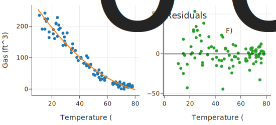

二次曲线很好地捕捉了数据中的曲线，但残差在 70°F 到 80°F 的温度范围内显示出轻微的上升趋势，这表明还有一些拟合不足。残差也有一些漏斗形状，在那里的较冷月份天然气消耗的变异性更大。我们可能会预料到这种行为，因为我们只有月平均温度。

为了进行比较，我们拟合几个更高阶多项式的模型，并统观察拟合的曲线：

```python
poly12 = PolynomialFeatures(degree=12, include_bias=False)
poly_features12 = poly12.fit_transform(X)

degrees = [1, 2, 3, 6, 8, 12]

mods = [LinearRegression().fit(poly_features12[:, :deg], y)
        for deg in degrees]
```

!!! warning "警告"
    我们在本节使用多项式特征来演示过拟合，但在实践中直接拟合 $x, x^2, \dots, x^{12}$ 多项式是不可取的。不幸的是，这些多项式特征往往高度相关。例如，能源数据的 $x$ 和 $x^2$ 之间的相关性是 0.98。高度相关的特征会导致不稳定的系数，其中 x 值的微小变化可能导致多项式系数的巨大变化。此外，当 x 值很大时，正规方程组的条件数很差（ill-conditioned），系数可能难以解释和比较。

    更好的做法是**使用彼此正交构建的多项式**。这些多项式填充了与原始多项式相同的空间，但它们彼此不相关，并给出更稳定的拟合。

让我们把所有的多项式拟合放在同一张图上，这样我们可以看到更高阶的多项式是如何弯曲得越来越奇怪的：

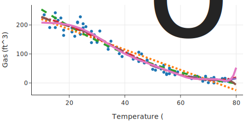

我们也可以在单独的分面中可视化不同的多项式拟合：

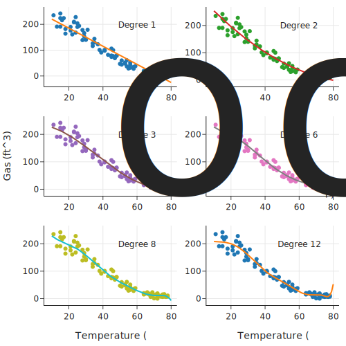

左上角分面中的 1 阶曲线（直线）错过了数据中的弯曲模式。2 阶曲线开始捕捉到它，3 阶曲线看起来是一个改进，但请注意图表右侧的向上弯曲。6 阶、8 阶和 12 阶的多项式跟随数据越来越紧密，因为它们变得越来越弯曲。这些多项式似乎拟合了数据中的虚假波动。总而言之，这六条曲线说明了欠拟合和过拟合。左上角的拟合直线欠拟合，完全错过了曲率。而右下角的 12 阶多项式绝对过拟合，带有我们认为在这种背景下没有意义的摆动模式。

一般来说，随着我们添加更多特征，模型变得更复杂，MSE 下降，但与此同时，拟合的模型变得越来越不稳定，对数据越来越敏感。当我们过拟合时，模型过于紧密地跟随数据，对新观测值的预测很差。评估拟合模型的一个简单技术是计算新数据上的 MSE，这些数据未用于构建模型。由于我们通常没有能力获取更多数据，我们留出一部分原始数据来评估拟合模型。这种技术是下一节的主题。

## 2. 训练集-测试集分割 (Train-Test Split)

虽然我们想利用所有数据来构建模型，但也想了解模型在新数据上的表现。我们通常没有条件收集额外的数据来评估模型，所以取而代之的是，我们留出一部分数据作为**测试集 (Test Set)**，用来充当新数据。剩余的数据称为**训练集 (Train Set)**，我们用这就部分数据来构建模型。然后，在选定模型之后，我们拿出测试集，看看在训练集上拟合的模型对测试集结果的预测效果如何。

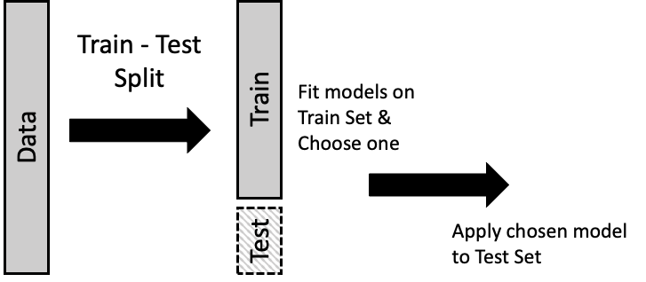

通常，测试集由 10% 到 25% 的数据组成。从图中可能看不清楚的是，分割成两部分通常是随机进行的，这样训练集和测试集就彼此相似。

我们可以用第 11 章介绍的概念来描述这个过程。设计矩阵 $\textbf{X}$ 和结果 $\mathbf{y}$ 分别被分成两部分；标记为 $\textbf{X}_T$ 的设计矩阵和对应的结果 $\mathbf{y}_T$ 构成训练集。我们使用这些数据最小化关于 $\boldsymbol{\theta}$ 的平均平方损失：

$$
\min_{\boldsymbol{\theta}} \lVert \mathbf{y}_T - {\textbf{X}_T}{\boldsymbol{{\theta}}} \rVert^2
$$

最小化训练误差的系数 $\boldsymbol{\hat{\theta}}_T$ 用于预测测试集，测试集标记为 $\textbf{X}_S$ 和 $\mathbf{y}_S$：

$$
\lVert \mathbf{y}_S - {\textbf{X}_S}{\boldsymbol{\hat{\theta}}_T} \rVert^2
$$

由于 $\textbf{X}_S$ 和 $\mathbf{y}_S$ 没有用于构建模型，它们给出了我们对新观测值可能预期的损失的合理估计。

我们用上一节的天然气消耗多项式模型来演示训练-测试分割。为此，我们执行以下步骤：

1.  将数据随机分成两部分：训练集和测试集。
2.  在训练集上拟合几个多项式模型并选择一个。
3.  计算所选多项式（使用在训练集上拟合的系数）在测试集上的 MSE。

对于第一步，我们使用 scikit-learn 中的 `train_test_split` 方法分割数据，并留出 22 个观测值用于模型评估：

```python
from sklearn.model_selection import train_test_split

test_size = 22

X_train, X_test, y_train, y_test = train_test_split(
    X, y, test_size=test_size, random_state=42)

print(f'Training set size: {len(X_train)}')
print(f'Test set size: {len(X_test)}')
```

```text
Training set size: 75
Test set size: 22
```

与上一节一样，我们拟合天然气消耗与温度的各种多项式模型。但这一次，我们只使用训练数据：

```python
import numpy as np

poly = PolynomialFeatures(degree=12, include_bias=False)
poly_train = poly.fit_transform(X_train)

degree = np.arange(1, 13)

mods = [LinearRegression().fit(poly_train[:, :j], y_train)
        for j in degree]
```

我们找出每个模型的 MSE：

```python
from sklearn.metrics import mean_squared_error

error_train = [
    mean_squared_error(y_train, mods[j].predict(poly_train[:, : (j + 1)]))
    for j in range(12)
]
```

为了可视化 MSE 的变化，我们将每个拟合多项式的 MSE 对其阶数作图：

```python
px.line(x=degree, y=error_train, markers=True,
        labels=dict(x='Degree of polynomial', y='Train set MSE'),
        width=350, height=250)
```

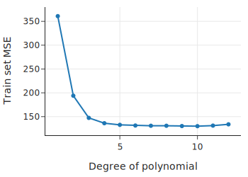

请注意，训练误差随着模型复杂度的增加而降低。
我们早些时候看到，高阶多项式表现出一种摆动行为，我们认为这并不反映数据中的潜在结构。考虑到这一点，我们可能会选择一个更简单但 MSE 显著降低的模型。那可能是 3 阶、4 阶或 5 阶。让我们选择 3 阶，因为这三个模型在 MSE 方面的差异很小，而且它是最简单的。

既然我们选择了模型，我们就使用测试集对其 MSE 提供独立的评估。我们为测试集准备设计矩阵，并使用在训练集上拟合的 3 阶多项式来预测测试集中每一行的结果。最后，我们计算测试集的 MSE：

```python
poly_test = poly.fit_transform(X_test)
y_hat = mods[2].predict(poly_test[:, :3])

mean_squared_error(y_test, y_hat)
```

```text
307.44460133992294
```

该模型的 MSE 比在训练数据上计算的 MSE 大不少。这证明了使用相同数据来拟合和评估模型的问题：MSE 不能充分反映新观测值的 MSE。为了进一步演示过拟合的问题，我们计算这些模型中每一个的测试误差：

```python
error_test = [
    mean_squared_error(y_test, mods[j].predict(poly_test[:, : (j + 1)]))
    for j in range(12)
]
```

在实践中，在确定模型之前我们不看测试集。在训练集上拟合模型和在测试集上评估模型之间交替，可能会导致过拟合。但为了演示目的，我们绘制所有已拟合多项式模型在测试集上的 MSE：

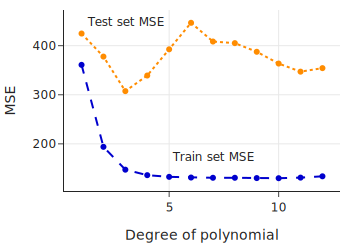

请注意，对于所有模型，不仅仅是我们选择的模型，测试集的 MSE 都大于训练集的 MSE。更重要的是，请注意测试集的 MSE 最初是如何随着模型从欠拟合变为更好地跟随数据曲率而降低的。然后，随着模型复杂度的增加，测试集的 MSE 也会增加。这些更复杂的模型对训练数据过拟合，导致预测测试集的误差很大。下图捕捉了该现象的理想化情况：

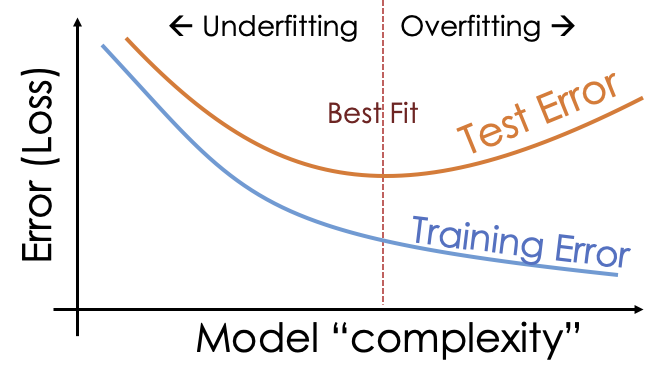

测试数据提供了对新观测值预测误差的评估。**至关重要的是只使用测试集一次，即在我们确定了模型之后**。否则，我们就会陷入使用相同数据来选择和评估模型的陷阱。在选择模型时，我们依靠简单性论点，因为我们意识到越来越复杂的模型倾向于过拟合。然而，我们可以扩展训练-测试方法来帮助选择模型。这是下一节的主题。

## 3. 交叉验证 (Cross-Validation)

我们可以使用训练-测试范式来帮助我们选择模型。其想法是进一步将训练集分成几个部分，我们在其中一部分上拟合模型，在另一部分上评估它。这种方法称为**交叉验证 (Cross-Validation)**。我们描述一种称为 **$k$ 折交叉验证 ($k$-fold Cross-Validation)** 的版本。

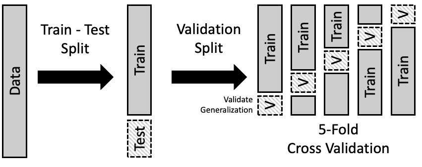

交叉验证可以帮助选择模型的总体形式。由此我们指的是多项式的阶数、模型中特征的数量，或正则化惩罚的截断值（将在下一节中介绍）。$k$ 折交叉验证背后的基本步骤如下：

1.  将数据随机分成两部分：训练集和测试集。
2.  将训练集分成大小大致相同的 $k$ 部分；每一部分称为一个**折 (fold)**。通常，我们随机划分数据。
3.  留出一折作为验证集：
    *   在剩余的训练数据（减去该特定折）上拟合所有模型。
    *   使用留出的那一折来评估所有这些模型。
4.  重复此过程共 $k$ 次，每次留出一折，使用其余的训练集拟合模型，并在留出的那一折上评估它们。
5.  综合每个模型在各折上的拟合误差，并选择误差最小的模型。

这些拟合模型在各折之间的系数不会完全相同。举个例子，当我们拟合一个 3 阶多项式时，我们对 $k$ 折的 MSE 取平均，得到 3 阶多项式的平均 MSE。然后我们比较 MSE，选择 MSE 最低的多项式阶数。三次多项式中 $x, x^2, x^3$ 项的实际系数在 $k$ 次拟合中的每一次都不是相同的。一旦选定了多项式阶数，我们将使用**所有训练数据**重新拟合模型，并在测试集上进行评估。（我们在之前的任何步骤中都没有使用测试集来选择模型。）

通常，我们使用 5 或 10 折。另一种流行的选择是在每一折中只放一个观测值。这种特殊情况称为**留一法交叉验证 (Leave-One-Out Cross-Validation, LOOCV)**。它的流行源于调整最小二乘拟合以少一个观测值时的简单性。

一般来说，$k$ 折交叉验证需要一些计算时间，因为我们通常必须为每一折从头开始重新拟合每个模型。scikit-learn 库提供了一个方便的 `sklearn.model_selection.KFold` 类来实现 $k$ 折交叉验证。

为了让你了解 k 折交叉验证是如何工作的，我们将在这个天然气消耗示例上演示该技术。但是，这一次我们将拟合一种不同类型的模型。在数据的原始散点图中，看起来这些点落在两条连接的线段上。在低温下，天然气消耗量与温度之间的关系看起来大致呈线性，斜率为负，约为 -4 立方英尺/度，而在较暖的月份，这种关系显得几乎平坦。所以，与其拟合多项式，我们不如拟合一条弯曲的线。

让我们从拟合一条在 65 度处弯曲的线开始。为此，我们创建一个特征，使温度高于 65°F 的点具有不同的斜率。模型是：

$$
y = \theta_0 + \theta_1x + \theta_2(x-65)^+
$$

这里，$(~)^+$ 代表“正部 (positive part)”，所以当 $x$ 小于 65 时它的计算结果为 0，当 $x$ 大于或等于 65 时它就是 $x-65$。我们创建这个新特征并将其添加到设计矩阵中：

```python
y = heat_df["ccf"]
X = heat_df[["temp"]]
X["temp65p"] = (X["temp"] - 65) * (X["temp"] >= 65)
```

然后我们用这两个特征拟合模型：

```python
bend_index = LinearRegression().fit(X, y)
```

让我们把这条拟合的“曲线”叠加在散点图上，看看它捕捉数据形状的效果如何：

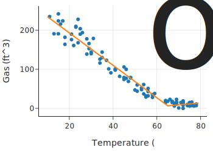

这个模型似乎比多项式更适合数据。但是许多弯折线模型是可能的。线可能在 55 度或 60 度弯曲等等。我们可以使用 $k$ 折交叉验证来选择线弯曲的温度值。让我们考虑在 $40, 41, 42, \dots, 68, 69$ 度弯曲的模型。对于每一个，我们需要创建额外的特征以使线在那里弯曲：

```python
bends = np.arange(40, 70, 1)

columns_to_keep = ['temp', 'ccf']
heat_df = heat_df[columns_to_keep].copy()

for i in bends:
    col = "temp" + i.astype("str") + "p"
    heat_df[col] = (heat_df["temp"] - i) * (heat_df["temp"] >= i)
    
heat_df
```

交叉验证的第一步是创建我们的训练集和测试集。像以前一样，我们随机选择 22 个观测值放入测试集。这留下了 75 个作为训练集：

```python
y = heat_df['ccf']
X = heat_df.drop(columns=['ccf'])

test_size = 22

X_train, X_test, y_train, y_test = train_test_split(
    X, y, test_size=test_size, random_state=0)
```

现在我们可以将训练集分成几折。我们使用 3 折，这样每一折有 25 个观测值。对于每一折，我们拟合 30 个模型，每种弯曲线对应一个。对于这一步，我们使用 scikit-learn 中的 `KFold` 方法划分数据：

```python
from sklearn.model_selection import KFold

kf = KFold(n_splits=3, shuffle=True, random_state=42)

validation_errors = np.zeros((3, 30))

def validate_bend_model(X, y, X_valid, y_valid, bend_index):
    # 选择 temp 列和对应的弯度列
    # bend_index 是 1 到 30，对应 temp40p 到 temp69p
    # X的第一列是 temp，后面是 temp40p...
    model = LinearRegression().fit(X.iloc[:, [0, bend_index]], y)
    predictions = model.predict(X_valid.iloc[:, [0, bend_index]])
    return mean_squared_error(y_valid, predictions)


for fold, (train_idx, valid_idx) in enumerate(kf.split(X_train)):
    cv_X_train, cv_X_valid = (X_train.iloc[train_idx, :],
                              X_train.iloc[valid_idx, :])
    cv_Y_train, cv_Y_valid = (y_train.iloc[train_idx],
                              y_train.iloc[valid_idx])

    error_bend = [
        validate_bend_model(
            cv_X_train, cv_Y_train, cv_X_valid, cv_Y_valid, bend_index
        )
        for bend_index in range(1, 31)
    ]

    validation_errors[fold][:] = error_bend
```

然后我们找出三折的平均验证误差，并将其对弯曲位置作图：

```python
totals = validation_errors.mean(axis=0)

fig = px.line(x=bends, y=totals, markers=True, width=350, height=250)
fig.update_layout(
    showlegend=False, xaxis_title="Location of bend", yaxis_title="MSE"
)
fig.show()
```

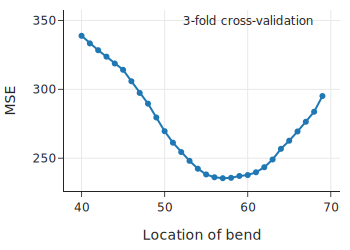

MSE 在 57 到 60 度之间看起相当平坦。最小值出现在 58 度，所以我们选择那个模型。为了在测试集上评估这个模型，我们首先在**整个训练集**上拟合 58 度处的弯线模型：

```python
bent_final = LinearRegression().fit(
    X_train.loc[:, ["temp", "temp58p"]], y_train
)
```

然后我们使用拟合的模型来预测测试集的天然气消耗：

```python
y_pred_test = bent_final.predict(X_test.loc[:, ["temp", "temp58p"]])

mean_squared_error(y_test, y_pred_test)
```

```text
71.40781435952441
```

让我们把弯线拟合叠加在散点图上，并检查残差以了解拟合质量：

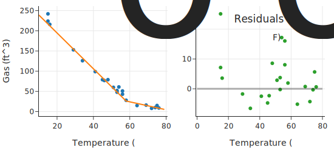

拟合曲线看起来很合理，残差比多项式拟合小得多。

!!! note "注意"
    在本节中，出于教学目的，我们使用 `KFold` 手动将训练数据分成三折，然后使用循环找到模型验证误差。在实践中，我们建议使用 `sklearn.model_selection.GridSearchCV` 与 `sklearn.pipeline.Pipeline` 对象，它可以自动将数据分为训练集和验证集，并找到在各折中具有最低平均验证误差的模型。

使用交叉验证来管理模型复杂度有几个关键限制：通常它要求复杂度离散变化；并且可能没有一种自然的方法来对模型进行排序。

## 4. 正则化 (Regularization)

我们刚刚看到交叉验证如何帮助找到一个平衡欠拟合和过拟合的模型维度。与其选择模型的维度，我们可以使用**所有**特征构建模型，但限制系数的大小。通过在 MSE 中添加一个针对系数大小的惩罚项 (penalty term)，我们可以防止过拟合。这个惩罚项称为**正则化项 (regularization term)**，即 $\lambda \sum_{j = 1}^{p} \theta_j^2$。我们通过最小化均方误差加上这个惩罚项的组合来拟合模型：

$$
\frac{1}{n} \sum_{i=1}^{n}(y_i - \mathbf{x}_i \boldsymbol{\theta})^2  ~+~ \lambda \sum_{j = 1}^{p} \theta_j^2
$$

当**正则化参数 (regularization parameter)** $\lambda$ 很大时，它会惩罚大的系数。（我们通常通过交叉验证来选择它。）

惩罚系数的平方称为 **$L_2$ 正则化**，或**岭回归 (Ridge Regression)**。另一种流行的正则化惩罚系数的绝对值：

$$
\frac{1}{n} \sum_{i=1}^{n}(y_i - \mathbf{x}_i \boldsymbol{\theta})^2  ~+~ \lambda \sum_{j = 1}^{p} |\theta_j|
$$

这种 **$L_1$ 正则化**线性模型也称为**套索回归 (Lasso Regression)**（Lasso 代表 Least Absolute Shrinkage and Selection Operator）。

为了理解正则化是如何工作的，让我们考虑极端的几种情况：当 $\lambda$ 非常大时，以及当它接近 0 时（$\lambda$ 永远不会是负数）。如果有很大的正则化参数，系数会受到严厉的惩罚，因此它们会收缩 (shrink)。另一方面，当 $\lambda$ 很小时，系数不受限制。实际上，当 $\lambda$ 为 0 时，我们又回到了普通最小二乘法 (OLS) 的世界。当我们考虑通过正则化控制系数大小时，会出现几个问题：

*   我们不想正则化截距项 (intercept term)。这样，大的惩罚项会拟合出一个常数模型。
*   当特征具有非常不同的尺度 (scales) 时，惩罚项对它们的影响会有所不同，大值的特征会比其他特征受到更多的惩罚。为了避免这种情况，我们在拟合模型之前将所有特征标准化 (standardize) 为均值为 0 且方差为 1。

让我们看一个有 35 个特征的例子。

## 5. 示例：市场分析 (Example: A Market Analysis)

一家制药公司的[市场研究项目](https://doi.org/10.1080/02664763.2014.994480)想要模拟消费者对购买一种唇疱疹保健产品的兴趣。他们从 1,023 名消费者那里收集数据。每个消费者都被要求在 10 分制下对 35 个因素进行评分，评分标准是这些因素在他们考虑购买唇疱疹治疗产品时是否重要。他们还对自己购买产品的兴趣进行了评分。

我们首先读取数据：

```python
ma_df = pd.read_csv('data/market-analysis.csv')
```

下表列出了 35 个因素，并提供了它们与结果（即购买产品的兴趣）的相关性。

|     | Corr | Description |     | Corr | Description |
| :--- | :--- | :--- | :--- | :--- | :--- |
| x1  | 0.70 | provides soothing relief | x19 | 0.54 | has a non-messy application |
| x2  | 0.58 | moisturizes cold sore blister | x20 | 0.70 | good for any stage of a cold |
| x3  | 0.69 | provides long-lasting relief | x21 | 0.49 | easy to apply/take |
| x4  | 0.70 | provides fast-acting relief | x22 | 0.52 | package keeps from contamination |
| x5  | 0.72 | shortens duration of a cold | x23 | 0.57 | easy to dispense a right amount |
| x6  | 0.68 | stops the virus from spreading | x24 | 0.63 | worth the price it costs |
| x7  | 0.67 | dries up cold sore | x25 | 0.57 | recommended most by pharamacists |
| x8  | 0.72 | heals fast | x26 | 0.54 | recommended by doctors |
| x9  | 0.72 | penetrates deep | x27 | 0.54 | FDA approved |
| x10 | 0.65 | relieves pain | x28 | 0.64 | a brand I trust |
| x11 | 0.61 | prevents cold | x29 | 0.60 | clinically proven |
| x12 | 0.73 | prevents from getting worse | x30 | 0.68 | a brand I would recommend |
| x13 | 0.57 | medicated | x31 | 0.74 | an effective treatment |
| x14 | 0.61 | prescription strength | x32 | 0.37 | portable |
| x15 | 0.63 | repairs damaged skin | x33 | 0.37 | discreet packaging |
| x16 | 0.67 | blocks virus from spreading | x34 | 0.55 | helps conceal cold sores |
| x17 | 0.42 | contains SPF | x35 | 0.63 | absorbs quickly |
| x18 | 0.57 | non-irritating | | | |

仅根据标签，这 35 个特征中的一些似乎测量了类似的可取性方面。我们可以通过计算解释变量之间的相关性来证实这一点：

```python
ma_df.corr()
```

我们会看到，例如最后一个特征“吸收快 (absorbs quickly)”，与前三个特征：“提供舒缓缓解”、“保湿”和“提供持久缓解”高度相关。

在开始拟合正则化模型之前，我们先建立设计矩阵和结果向量，并将数据分为训练集和测试集。我们将 200 个观测值放入测试集中：

```python
y = ma_df["y"]
X = ma_df.drop(columns=["y"])

X_train, X_test, y_train, y_test = train_test_split(
    X, y, test_size=200, random_state=42
)
```

如前所述，我们需要对特征进行标准化。我们标准化训练集，然后，当我们评估模型时，我们使用训练集的标准化参数来标准化测试集特征。`StandardScaler` 方法可以帮助我们完成这个过程：

```python
from sklearn.preprocessing import StandardScaler

scalerX = StandardScaler().fit(X_train) 
X_train_scaled = scalerX.transform(X_train)
X_test_scaled = scalerX.transform(X_test)
```

我们确认训练集中 35 个特征的均值都为 0，标准差 (SD) 都为 1：

```python
np.allclose(X_train_scaled.mean(axis=0), 0)
```

```text
True
```

```python
np.allclose(X_train_scaled.std(axis=0), 1)
```

```text
True
```

值得注意的是，测试集的情况并非如此，因为我们使用训练集的均值和标准差来标准化测试集特征：

```python
X_test_scaled.mean(axis=0)
```

```text
array([-0.17, -0.12, -0.15, ..., -0.12, -0.1 , -0.24])
```

要执行 Lasso 回归，我们使用 `scikit-learn` 中的 `Lasso` 方法。让我们看看这 35 个特征的系数如何随 $\lambda$ 变化。我们要为正则化参数设置一系列值，并为每个值拟合 Lasso（此参数在 `Lasso` 中称为 `alpha`）：

```python
from sklearn.linear_model import Lasso

coefs = []
mses = []
alphas = np.arange(0.01, 2, 0.01)

for a in alphas:
    model = Lasso(alpha=a)
    model.fit(X_train_scaled, y_train)
    coefs.append(model.coef_)
    mses.append(mean_squared_error(y_test, model.predict(X_test_scaled)))
```

对于每个特征，我们可以叠加其系数随 $\lambda$ 变化的折线图：

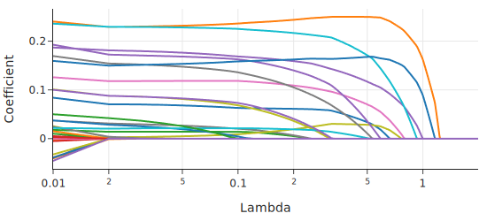

随着 $\lambda$ 增加，模型拟合受到更严厉的惩罚，许多系数收缩为 0。图的左侧显示了更大的模型复杂度，对应于较小的 $\lambda$。注意，当 $\lambda = 0.5$ 时，几乎所有的系数都为 0。例外的系数（从大到小）包括：`x12`, `x30`, `x31`, `x5`, `x7`, `x1`, `x9`, `x28`, `x20`。

我们还可以绘制 MSE 随 $\lambda$ 变化的函数图，看看它如何随着惩罚力度的增加而变化：

```python
fig = px.line(x=alphas, y=mses,
        labels={"x": "Lambda", "y": "MSE"},
        width=350, height=250)
fig.show()
```

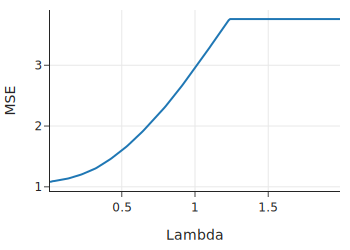

当 $\lambda$ 达到大约 1.25 时，惩罚太大，以至于 Lasso 回归只是将常数模型拟合到数据中，MSE 不再变化。我们再次面临模型选择问题，但这次是以决定 $\lambda$ 的形式出现。我们可以使用交叉验证来帮助我们。

我们使用 `LassoCV` 方法执行 5 折交叉验证来选择 $\lambda$：

```python
from sklearn.linear_model import LassoCV

lasso_cv_model = LassoCV(
    alphas=np.arange(0.01, 1, 0.01), cv=5, max_iter=100000
)
```

注意，我们指定了最大迭代次数，因为最小化过程使用数值优化（参见后面章节）来求解系数，我们对运行的迭代次数设置了上限，以达到最优参数的指定容差。我们准备好在训练集上拟合模型了：

```python
lasso_best = lasso_cv_model.fit(X_train_scaled, y_train)
```

交叉验证选择了以下正则化参数：

```python
lasso_best.alpha_
```

```text
0.04
```

接下来，让我们计算使用此交叉验证模型在测试集上进行预测的 MSE：

```python
y_test_pred = lasso_best.predict(X_test_scaled)
mean_squared_error(y_test, y_test_pred)
```

```text
1.0957444655340487
```

让我们看看有多少个系数不为 0：

```python
sum(np.abs(lasso_best.coef_) > 0)
```

```text
16
```

接下来我们演示岭回归 (Ridge Regression) 系数如何随惩罚变化。岭回归使用 $L_2$ 惩罚，但在其他方面，实现与 Lasso 回归类似。和以前一样，我们要尝试一系列 $\lambda$ 值，然后绘制系数图看看它们如何变化：

```python
from sklearn.linear_model import Ridge

coefsR = []
alphasR = np.arange(1, 1001, 25)

for a in alphasR:
    ridge = Ridge(alpha=a)
    ridge.fit(X_train_scaled, y_train)
    coefsR.append(ridge.coef_)
```

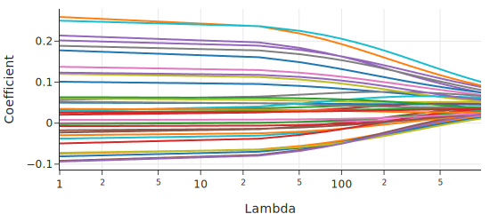

该图显示了与 Lasso 系数图相比非常不同的形状。系数并没有完全消失。这些图有一个重要的相似之处，即随着惩罚的增加，系数会收缩。在某种程度上，对于岭回归，我们在一点点地使用所有变量。对于较大的 $\lambda$，许多系数虽然不是 0，但也相当小。例如，我们可以计算当 $\lambda = 600$ 时大于 0.05 的系数数量：

```python
sum(abs(coefsR[24]) > 0.05)
```

```text
13
```

与 Lasso 类似，许多特征的系数很小。

同样，为了选择最好的 $\lambda$，我们可以求助于交叉验证并使用 `RidgeCV`。我们在此省略细节，因为方法与 `LassoCV` 相同。

使用 $L_1$ 或 $L_2$ 正则化可以让我们通过惩罚大系数来避免模型过拟合。$L_1$ 正则化的优点是能将系数归零；它通过丢弃系数为 0 的特征来执行**特征选择 (feature selection)**。这在处理具有许多特征的高维数据时特别有用。仅使用少数特征进行预测的模型比需要许多计算的模型运行得快得多。由于不需要的特征往往会增加模型方差而不减少偏差，通过使用 Lasso 回归选择要使用的特征子集，我们有时可以提高其他模型的准确性。

!!! note "注意"
    有时我们更喜欢一种类型的正则化，因为它更贴近我们要处理的领域。例如，如果我们知道我们试图模拟的现象是由许多小因素造成的，我们可能会更喜欢岭回归，因为它不会丢弃这些因素。另一方面，一些结果是由少数极具影响力的特征造成的。在这些情况下，我们更喜欢 Lasso 回归，因为它会丢弃不需要的特征。$L_2$ 和 $L_1$ 都可以作为在欠拟合和过拟合之间导航的有用调节器。

正则化、训练-测试拆分和交叉验证都有减少过拟合的目标。过拟合的问题来自于使用数据既拟合模型又估计模型在预测新观测值时的误差。在下一节中，我们将为这一想法提供进一步的直觉。

## 6. 模型偏差与方差 (Model Bias and Variance)

在本节中，我们提供另一种思考过拟合和欠拟合问题的方式。我们将进行一项模拟研究，从我们设计的一个模型中生成合成数据。这样，我们就知道了**真实模型**，当我们对数据拟合模型时，我们可以看到我们离真相有多近。

我们编造一个通用的数据模型如下：

$$ y = g(\mathbf{x}) + {\epsilon}$$

这个表达式很容易看出模型的两个组成部分：信号 $g(x)$ 和噪声 $\epsilon$。在我们的模型中，我们假设噪声没有趋势或模式；方差恒定；并且每个观测值的噪声相互独立。

作为例子，让我们取 $g(x) = \sin(x) + 0.3x$，噪声来自均值为 0 且标准差 (SD) = 0.2 的正态分布。我们可以使用以下函数从该模型生成数据：

```python
def g(x):
    return np.sin(x) + 0.3 * x

def gen_noise(n):
    return np.random.normal(scale=0.2, size=n)

def draw(n):
    points = np.random.choice(np.arange(0, 10, 0.05), size=n)
    return points, g(points) + gen_noise(n)
```

让我们从这个模型生成 50 个数据点 $(x_i, y_i)$, $i=1, \ldots, 50$：

```python
np.random.seed(42)

xs, ys = draw(50)
noise = ys - g(xs)
```

我们可以绘制我们的数据，既然我们知道真实的信号，我们也可以找到误差并绘制它们：

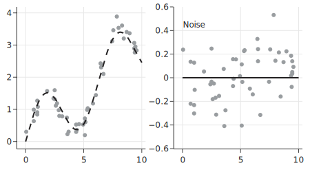

左边的图显示了虚线曲线 $g$。我们还可以看到 $(x, y)$ 对（点）在曲线周围形成了散点。右边的图显示了 50 个点的误差 $y - g(x)$。请注意，它们没有形成任何模式。

当我们对数据拟合模型时，我们要最小化均方误差。让我们通俗地写出这个最小化：

$$
\min_{f \in \cal{F}} \frac{1}{n} \sum_{i = 1}^{n} [y_i - f(\mathbf{x}_i)]^2 
$$

最小化是在函数集合 $\cal{F}$ 上进行的。我们在本章中已经看到，这个函数集合可能是 12 阶多项式，或者仅仅是弯曲的线。重要的一点是，真实模型 $g$ 不必是集合中的函数之一。

让我们取 $\cal{F}$ 为二次多项式的集合；换句话说，可以表示为 $\theta_0 + \theta_1 x + \theta_2 x^2$ 的函数。由于 $g(x) = \sin(x) + 0.3x$，它不属于我们要优化的函数集合。

让我们对我们的 50 个数据点拟合一个多项式：

```python
poly = PolynomialFeatures(degree=2, include_bias=False)
poly_features = poly.fit_transform(xs.reshape(-1, 1))

model_deg2 = LinearRegression().fit(poly_features, ys)
```

```python
print(f"Fitted Model: {model_deg2.intercept_:.2f}",
      f"+ {model_deg2.coef_[0]:.2f}x + {model_deg2.coef_[1]:.2f}x^2")
```

```text
Fitted Model: 0.98 + -0.19x + 0.05x^2
```

同样，我们知道真实模型不是二次的（因为是我们构建的）。让我们绘制数据和拟合曲线：

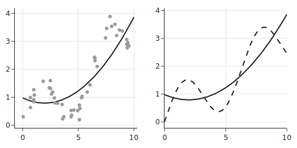

二次方程拟合数据效果不好，它也不能很好地代表底层曲线，因为我们选择的模型集（二阶多项式）无法捕捉 $g$ 中的曲率。

如果我们重复这个过程，从真实模型中再生成 50 个点，并对这些数据拟合一个二阶多项式，那么二次方程的拟合系数将会改变，因为它取决于新的数据集。我们可以重复这个过程多次，并对拟合曲线取平均值。这条平均曲线将类似于二阶多项式对我们真实模型中 50 个点的典型最佳拟合。为了演示这个概念，让我们生成 25 组 50 个数据点，并对每个数据集拟合一个二次方程：

```python
poly_features_x_full = poly.fit_transform(np.arange(0, 10, 0.05).reshape(-1, 1))

def fit(n):
    xs_new = np.random.choice(np.arange(0, 10, 0.05), size=n)
    ys_new = g(xs_new) + gen_noise(n)
    X_new = xs_new.reshape(-1, 1)
    mod_new = LinearRegression().fit(poly.fit_transform(X_new), ys_new)
    return mod_new.predict(poly_features_x_full).flatten()
```

```python
fits = [fit(50) for j in range(25)]
```

我们可以在图上显示所有 25 个拟合模型，以及真实函数 $g$ 和拟合曲线的平均值 $\bar{f}$。为了做到这一点，我们对 25 个拟合模型使用透明度来区分重叠的曲线：

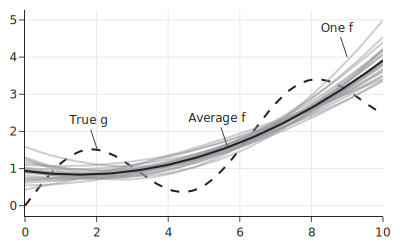

我们可以看到 25 个拟合的二次方程随数据变化。这个概念称为**模型方差 (model variation)**。25 个二次方程的平均值由实线黑色线表示。平均二次方程与真实曲线之间的差异称为**模型偏差 (model bias)**。

当信号 $g$ 不属于模型空间 $\cal{F}$ 时，我们就会有模型偏差。如果模型空间能很好地逼近 $g$，那么偏差就很小。例如，一个 10 阶多项式可以非常接近我们在例子中使用的 $g$。另一方面，我们在本章前面已经看到，高阶多项式可能会过拟合数据，并且为了接近数据而变化很大。模型空间越复杂，拟合模型的变异性就越大。使用太简单的模型导致欠拟合会导致高模型偏差（$g$ 和 $\bar{f}$ 之间的差异），而使用太复杂的模型导致过拟合会导致高模型方差（$\hat{f}$ 围绕 $\bar{f}$ 的波动）。这个概念称为**偏差-方差权衡 (bias–variance trade-off)**。模型选择旨在平衡这些相互竞争的拟合不足来源。

## 7. 总结 (Summary)

在本章中，我们看到当我们既用最小化均方误差来拟合模型又用它来评估模型时，会出现问题。训练-测试划分 (train-test split) 帮助我们绕过这个问题，我们用训练集拟合模型，并在留出的测试集上评估我们拟合的模型。

重要的是不要“过度使用”测试集，所以我们要把它分开，直到我们确定了一个模型。为了帮助我们确定模型，我们可能会使用交叉验证 (cross-validation)，它模仿了数据划分为测试集和训练集的过程。再次强调，重要的是只使用训练集进行交叉验证，并使原始测试集远离任何模型选择过程。

正则化 (Regularization) 采取了一种不同的方法，它通过惩罚均方误差来防止模型过于贴近数据。在正则化中，我们使用所有可用数据来拟合模型，但会收缩系数的大小。

偏差-方差权衡允许我们更精确地描述我们在本章中看到的建模现象：欠拟合与模型偏差有关；过拟合导致模型方差。在下图中，x 轴衡量模型复杂度，y 轴衡量模型失拟的这两个分量：模型偏差和模型方差。注意，随着被拟合模型的复杂度增加，模型偏差减小而模型方差增加。从测试误差的角度来看，我们已经看到这种误差先减小然后增加，因为模型方差超过了模型偏差的减小。为了选择一个有用的模型，我们必须在模型偏差和方差之间取得平衡。

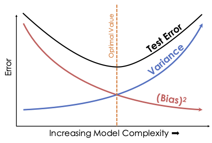

如果模型能够精确拟合总体过程，收集更多的观测值可以减少偏差。如果模型本质上无法模拟总体（如我们的合成示例），即使是无限的数据也无法消除模型偏差。就方差而言，收集更多数据也会减少方差。数据科学最近的一个趋势是选择一个低偏差和高内在方差的模型（如神经网络），但收集大量数据点，以便模型方差足够低以做出准确的预测。虽然在实践中有效，但为这些模型收集足够的数据往往需要大量的时间和金钱。

创建更多的特征，无论有用与否，通常都会增加模型方差。拥有许多参数的模型有许多可能的参数组合，因此比参数较少的模型具有更高的方差。另一方面，向模型添加有用的特征，例如当底层过程是二次时添加二次特征，可以减少偏差。但即使添加一个无用的特征也很少会增加偏差。

意识到偏差-方差权衡可以帮助你更好地拟合模型。使用训练-测试划分、交叉验证和正则化等技术可以改善这个问题。

建模的另一部分考虑拟合系数和曲线的变异。我们可能想要为系数提供置信区间，或者为未来的观测提供预测带。这些区间和带给出了拟合模型准确性的感觉。我们接下来讨论这个概念。
