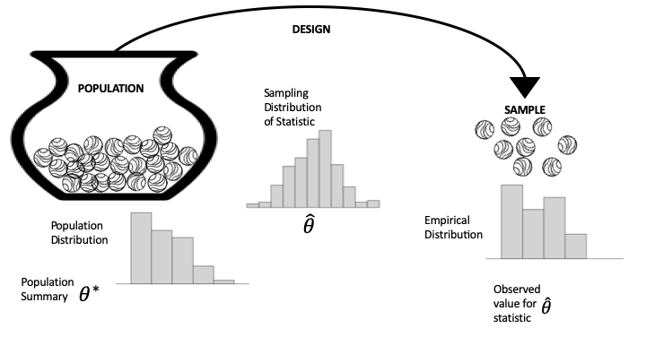
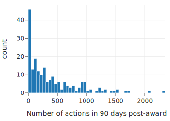
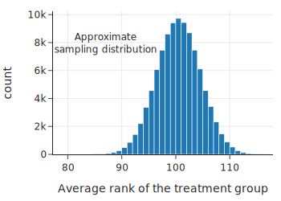
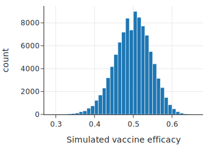
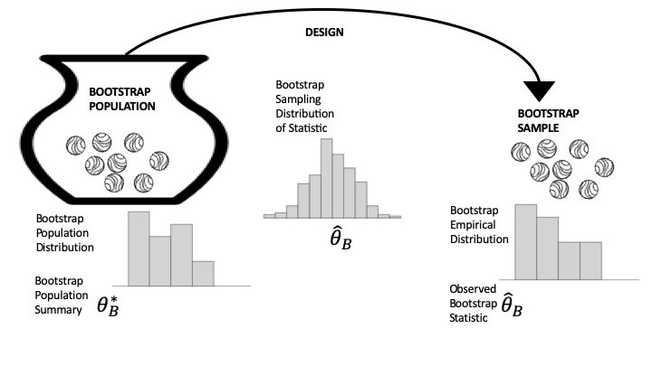
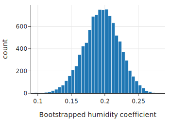
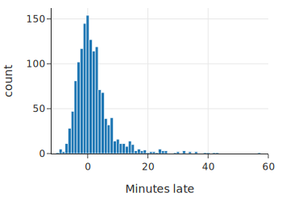
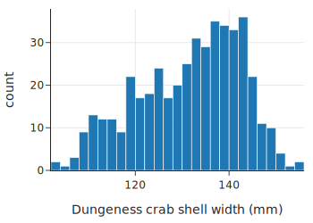
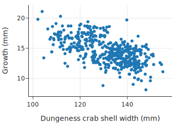
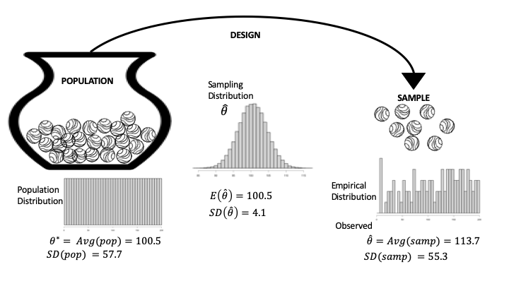

# 13. 推理与预测理论 (Theory for Inference and Prediction)

当您想要将您的发现从仅仅描述您收集的数据推广到更广泛的场景时，数据需要具有那个更广阔世界的代表性。例如，您可能希望根据传感器读数预测未来的空气质量；根据实验结果测试激励措施是否提高了贡献者的生产力；或者为等待公交车的时间构建区间估计。我们在前面的章节中都涉及了这些场景。在本章中，我们将形式化进行预测和推理的框架。

这个框架的核心是**分布 (distribution)** 的概念，无论是总体分布、经验分布（又称样本分布）还是概率分布。理解这些分布之间的联系是假设检验、置信区间、预测带和风险等基础理论的核心。

我们首先简要回顾瓮模型 (urn model)；然后我们介绍假设检验、置信区间和预测带的正式定义。我们在示例中使用模拟，包括作为特例的自助法 (bootstrap)。最后，我们以期望、方差和标准误差的正式定义来结束本章——这些是检验、推理和预测理论中的基本概念。

## 1. 分布：总体、经验、抽样 (Distributions: Population, Empirical, Sampling)

总体 (Population)、抽样 (Sampling) 和经验 (Empirical) 分布是指导我们就模型进行推理或对新观测进行预测的重要概念。图 13.1 提供了一个图表，可以帮助区分它们。该图表使用了第 2 章中的总体和访问框架 (access frame) 以及第 3 章中的瓮模型 (urn model) 的概念。左边是我们正在研究的总体，表示为瓮中的弹珠，每个单元 (unit) 对应一个弹珠。我们将情况简化为访问框架和总体相同；也就是说，我们可以访问总体中的每个单元。（这并非总是如此，由此产生的问题在第 2 章和第 3 章中涉及。）从瓮到样本的箭头代表设计 (design)，即从框架中选择样本的协议。该图将此选择过程显示为一个机会机制 (chance mechanism)，表示为从装满无法区分的弹珠的瓮中进行抽取。在图的右侧，弹珠的集合构成了我们的样本（我们获得的数据）。



我们通过仅考虑一个特征的测量来保持图表的简单性。图中瓮的下方是该特征的总体直方图 (Population Histogram)。总体直方图表示整个总体的数值分布。在最右边，经验直方图 (Empirical Histogram) 显示了我们实际样本的数值分布。请注意，这两个分布在形状上是相似的。当我们的抽样机制产生具有代表性的样本时，就会发生这种情况。

我们通常对样本测量的摘要感兴趣，例如均值、中位数、简单线性模型的斜率等。通常，此摘要统计量 (summary statistic) 是总体参数 (population parameter) 的估计值，例如总体均值或中位数。总体参数在图的左侧显示为 $\theta$；在右侧，从样本计算出的摘要统计量是 $\hat{\theta}$。

如果我们重新进行调查，产生我们样本的机会机制很可能会产生一组不同的数据。但是，如果协议设计得当，我们期望样本仍然类似于总体。换句话说，我们可以从样本计算出的摘要统计量推断出总体参数。图中中间的抽样分布 (sampling distribution) 是统计量的概率分布。它显示了统计量在不同样本中可能取的值及其机会。在第 3 章中，我们在几个例子中使用模拟来估计抽样分布。在本章中，我们将通过重访这些例子和前几章的其他例子来形式化这些分析。

关于这三个直方图的最后一点：如第 10 章所介绍的，矩形提供了任何箱 (bin) 中观测值的比例。在总体直方图的情况下，这是整个总体的比例；对于经验直方图，面积代表样本中的比例；对于抽样分布，面积代表数据生成机制产生落在此箱中的样本统计量的机会。

最后，我们通常不知道总体分布或参数，我们试图推断参数或预测总体中未见单元的值。在其他时候，可以使用样本来测试关于总体的猜想 (conjecture)。测试是下一节的主题。

## 2. 假设检验基础 (Basics of Hypothesis Testing)

根据我们的经验，假设检验是数据科学中较具挑战性的领域之一——既难学又难应用。这不一定是因为假设检验在技术上很深奥；相反，假设检验可能违反直觉，因为它利用了矛盾。顾名思义，我们通常以一个**假设 (hypothesis)** 开始假设检验：一个我们想要验证的关于世界的陈述。

在一个理想的世界里，我们会直接证明我们的假设是正确的。不幸的是，我们通常无法获知确定真相所需的所有信息。例如，我们可能会假设一种新疫苗是有效的，但现代医学尚未了解控制疫苗功效的所有生物学细节。取而代之的是，我们求助于概率、随机抽样和数据设计的工具。

假设检验令人困惑的一个原因是它很像“反证法”，即我们假设我们的假设的反面是正确的，并试图证明我们观察到的数据与该假设不一致。我们以这种方式处理问题是因为通常有些事情可能因为许多原因而成为真，但我们只需要一个单一的反例就能反驳一个假设。我们将这个“反面假设”称为**零假设 (null hypothesis)**，将我们原来的假设称为**备择假设 (alternative hypothesis)**。

让事情更令人困惑的是，概率工具并不直接证明或反驳事物。相反，它们告诉我们在某些假设下（如零假设的假设），我们观察到的事情发生的可能性有多大。这就是为什么设计好数据收集如此重要的原因。

回想一下强生 (J&J) 疫苗的随机临床试验（第 3 章），其中参加试验的 43,738 人被随机分成两组。治疗组接种了疫苗，对照组接种了假疫苗，称为安慰剂。这种随机分配创造了两个在除疫苗外各方面都相似的组。

在该试验中，治疗组有 117 人患病，对照组有 351 人患病。由于我们想提供令人信服的证据证明疫苗有效，我们从一个零假设开始，即它无效，这意味着治疗组中患病人数如此之少只是随机分配的偶然结果。然后我们可以使用概率来计算在治疗组中观察到如此少患病人数的机会。概率计算基于一个装有 43,738 个弹珠的瓮，其中 468 个标记为 1 表示患病者。然后我们发现，从瓮中进行 21,869 次有放回抽取中，最多抽到 117 个弹珠的概率几乎为零。我们将此作为拒绝零假设的证据，转而支持备择假设，即疫苗有效。因为 J&J 的实验设计得当，拒绝零假设导致我们得出疫苗有效的结论。换句话说，假设的真实性留给了我们，以及我们有多愿意通过承担潜在的错误来接受它。

在本节的其余部分，我们将回顾假设检验的四个基本步骤。然后我们提供两个例子，继续第 3 章中的两个例子，并深入探讨检验的形式。

假设检验有四个基本步骤：

*   **第 1 步：设置 (Set up)**。你有了数据，你想测试一个特定模型是否与数据合理一致。因此，你指定一个统计量 $\hat{\theta}$，例如样本平均值、样本中零的比例或拟合的回归系数，目的是将你的数据统计量与模型可能产生的统计量进行比较。
*   **第 2 步：模型 (Model)**。你以数据生成机制的形式详细说明你想要测试的模型，以及关于总体的任何特定假设。该模型通常包括指定 $\theta^*$，它可能是总体均值、零的比例或回归系数。该模型下统计量的抽样分布被称为**零分布 (null distribution)**，该模型本身被称为**零假设 (null hypothesis)**。
*   **第 3 步：计算 (Compute)**。根据第 2 步中的零模型，获得至少与你在第 1 步中实际获得的数据（及结果统计量）一样极端的数据的可能性有多大？在形式推理中，这个概率称为 **$p$ 值 ($p$-value)**。为了近似 $p$ 值，我们经常使用计算机利用模型中的假设生成大量重复的随机试验，并找出产生至少与我们观察值一样极端的统计量值的样本比例。其他时候，我们可以使用数学理论来找到 $p$ 值。
*   **第 4 步：解释 (Interpret)**。$p$ 值用作衡量惊讶程度的指标。如果你在第 2 步中详细说明的模型是可信的，那么获得你实际获得的数据（及摘要统计量）应该让你感到多么惊讶？中等大小的 $p$ 值意味着观察到的统计量几乎就是你期望从零模型生成的数据中得到的。极小的 $p$ 值通过引发对零模型的怀疑。换句话说，如果模型是正确的（或近似正确的），那么从模型生成的数据中获得如此极端的检验统计量将是非常不寻常的。在这种情况下，要么零模型是错误的，要么发生了非常不可能的结果。统计逻辑表明结论是该模式是真实的；它不仅仅是巧合。然后由你来解释为什么数据生成过程导致了如此不寻常的值。这时，仔细考虑范围是很重要的。

让我们通过几个例子来演示检验过程中的这些步骤。

### 2.1. 示例：比较维基百科贡献者生产力的秩检验 (Example: A Rank Test to Compare Productivity of Wikipedia Contributors)

回想一下第 2 章中的维基百科示例，从过去 30 天在英文维基百科上活跃且从未获得过奖励的前 1% 贡献者中随机选择了一组 200 名贡献者。这 200 名贡献者被随机分成两组，每组 100 人。一组（治疗组）的贡献者每人获得一个非正式奖励，而另一组没有人获得奖励。所有 200 名贡献者都被跟踪了 90 天，并记录了他们在维基百科上的活动。

有人推测非正式奖励对志愿工作有强化作用，该实验旨在正式研究这一推测。我们基于数据的排名进行假设检验。

首先，我们将数据读入数据框：

```python
wiki = pd.read_csv("data/Wikipedia.csv")
wiki.shape
```

```text
(200, 2)
```

```python
wiki.describe()[3:]
```

|     | experiment | postproductivity |
| :--- | :--- | :--- |
| min | 0.0 | 0.0 |
| 25% | 0.0 | 57.5 |
| 50% | 0.5 | 250.5 |
| 75% | 1.0 | 608.0 |
| max | 1.0 | 2344.0 |

该数据框有 200 行，每个贡献者一行。特征 `experiment` 为 0 或 1，分别取决于贡献者是在对照组还是治疗组；`postproductivity` 是贡献者在颁奖后 90 天内所做编辑的计数。四分位数（下、中和上）之间的差距表明生产力的分布是偏斜的。我们制作一个直方图来确认：

```python
fig = px.histogram(wiki, x='postproductivity', nbins=50,
             labels={'postproductivity':'Number of actions in 90 days post-award'},
             width=350, height=250)
fig.show()
```



事实上，授奖后生产力的直方图高度偏斜，在零附近有一个尖峰。偏斜性建议使用基于两个样本值排序的统计量。

为了计算我们的统计量，我们将所有生产力值（来自两组）从小到大排序。最小值的秩为 1，第二小的秩为 2，依此类推，直到最大值的秩为 200。我们使用这些秩来计算我们的统计量 $\hat{\theta}$，即治疗组的平均秩。我们选择这个统计量是因为它对高度偏斜的分布不敏感。例如，无论最大值是 700 还是 700,000，它仍然获得相同的秩，即 200。如果非正式奖励激励了贡献者，那么我们会期望治疗组的平均秩通常高于对照组。

零模型假设非正式奖励对生产力**没有**影响，并且在治疗组和对照组之间观察到的任何差异都是由于将贡献者分配给各组的偶然过程造成的。零假设是为要被拒绝的现状设立的；也就是说，我们希望在假设没有影响的情况下发现惊喜。

零假设可以用从一个装有 200 个弹珠的瓮中抽取 100 次来表示，弹珠标记为 1, 2, 3, …, 200。在这种情况下，平均秩将是 $(1 + 200)/2 = 100.5$。

我们使用 `scipy.stats` 中的 `rankdata` 方法对 200 个值进行排名，并计算治疗组的秩和：

```python
from scipy.stats import rankdata
ranks = rankdata(wiki['postproductivity'], 'average')
```

让我们确认 200 个值的平均秩是 100.5：

```python
np.average(ranks)
```

```text
100.5
```

并找到治疗组中 100 个生产力分数的平均秩：

```python
observed = np.average(ranks[100:])
observed
```

```text
113.68
```

治疗组的平均秩高于预期，但我们要弄清楚它是否是一个异常高的值。我们可以使用模拟来找到该统计量的抽样分布，看看 113 是一个常规值还是一个令人惊讶的值。

为了进行这个模拟，我们将瓮设置为数据中的 `ranks` 数组。打乱数组中的 200 个值并取前 100 个代表随机抽样的治疗组。我们编写一个函数来打乱秩数组并找到前 100 个的平均值。

```python
rng = np.random.default_rng(42)
def rank_avg(ranks, n):
    rng.shuffle(ranks)
    return np.average(ranks[n:])      
```

我们的模拟混合瓮中的弹珠，抽取 100 次，计算 100 次抽取的平均秩，并重复此过程 100,000 次。

```python
rank_avg_simulation = [rank_avg(ranks, 100) for _ in range(100_000)] 
```

这是模拟平均值的直方图：

```python
fig = px.histogram(x=rank_avg_simulation, nbins=50,
    labels=dict(x="Average rank of the treatment group"),
    width=350, height=250,
)
fig.add_annotation(
    x=87, y=8000, showarrow=False, text="Approximate<br>sampling distribution"
)
fig.show()
```



正如我们所料，平均秩的抽样分布以 100（实际上是 100.5）为中心，呈钟形。该分布的中心反映了治疗无效的假设。我们观察到的统计量完全在模拟平均秩的典型范围之外，我们使用这个模拟的抽样分布来找到观察到至少与我们一样大的统计量的大致 $p$ 值：

```python
np.mean(rank_avg_simulation > observed)
```

```text
0.00052
```

这是一个很大的惊喜。在零假设下，看到平均秩至少与我们的一样大的机会大约是万分之五。

这个检验引发了对零模型的怀疑。统计逻辑让我们得出结论：这种模式是真实的。我们如何解释这一点？实验设计得很好。200 名贡献者是从前 1% 中随机选出的，然后他们被随机分成两组。这些机会过程表明，我们可以依靠 200 人的样本来代表顶级贡献者，并且除了治疗（奖励）的应用外，治疗组和对照组在各方面都彼此相似。鉴于精心的设计，我们得出结论：非正式奖励对顶级贡献者的生产力有积极影响。

早些时候，我们实施了一个模拟来寻找我们观察到的统计量的 $p$ 值。在实践中，秩检验被广泛使用，并且在大多数统计软件中都可用：

```python
from scipy.stats import ranksums

ranksums(x=wiki.loc[wiki.experiment == 1, 'postproductivity'],
         y=wiki.loc[wiki.experiment == 0, 'postproductivity'])
```

```text
RanksumsResult(statistic=3.220386553232206, pvalue=0.0012801785007519996)
```

这里的 $p$ 值是我们计算的 $p$ 值的两倍，因为我们只考虑了大于观察值的值，而 `ranksums` 检验计算了分布两侧的 $p$ 值。在我们的例子中，我们只对生产力的提高感兴趣，因此使用单侧 $p$ 值，它是报告值的一半 (0.0006)，接近我们的模拟值。

这种使用秩而不是实际数据值的有点不寻常的检验统计量是在 1950 年代和 1960 年代开发的，那时还没有当今强大的笔记本电脑。秩统计量的数学性质已经发展得很完善，抽样分布表现良好（即使对于小数据集，它也是对称的，形状像钟形曲线）。秩检验在 A/B 测试中仍然很流行，因为样本往往高度偏斜，并且通常会进行许多许多次测试，其中 $p$ 值可以从正态分布中快速计算出来。

下一个例子回顾了第 3 章中的疫苗功效示例。在那里，我们在没有实际称之为假设检验的情况下遇到了假设检验。

### 2.2. 示例：疫苗功效的比例检验 (Example: A Test of Proportions for Vaccine Efficacy)

疫苗的批准受到比我们之前进行的比较治疗组和对照组疾病计数的简单测试更严格的要求。CDC 要求基于比较每组中患病个体的比例来提供更有力的成功证据。为了解释，我们将对照组和治疗组中患病人数的样本比例分别表示为 $\hat{p}_{C}$ 和 $\hat{p}_T$，并使用这些比例来计算疫苗功效：

$$ 
\hat{\theta} = \frac {\hat{p}_{C} - \hat{p}_T} {\hat{p}_C} = 1 - \frac {\hat{p}_T} {\hat{p}_C}
$$

J&J 试验中观察到的疫苗功效值为：

$$ 
1 - \frac{117/21869} {351/21869} = 1- \frac{117}{351} = 0.667
$$

如果治疗无效，功效将接近 0。CDC 设定了 50% 的疫苗功效标准，这意味着功效必须超过 50% 才能获批分发。在这种情况下，零模型假设疫苗功效为 50% ($\theta^* = 0.5$)，并且观察值与预期值的任何差异都是由于将人分配到各组的机会过程造成的。同样，我们将零假设设定为现状，即疫苗不够有效不足以获批，我们希望能发现惊喜并拒绝零假设。

通过一点代数运算，零模型 $0.5 = 1 - p_T / p_C$ 简化为 $p_T = 0.5 p_C$。即，零假设意味着接受治疗者中的患病比例至多是对照组的一半。注意，零假设中没有假设两个风险（$p_T$ 和 $p_C$）的实际值。也就是说，该模型并不假设治疗无效，而是假设其功效不大于 0.5。

我们在这种情况下的瓮模型与我们在第 3 章中设置的有点不同。瓮中仍然有 43,738 个弹珠，对应于实验中的登记者。但现在每个弹珠上有两个数字，为了简单起见，它们成对出现，例如 $(0, 1)$。左边的数字是如果该人接受治疗的反应，右边的数字对应于不接受治疗（对照）的反应。像往常一样，1 意味着他们生病，0 意味着他们保持健康。

零模型假设这对数组左侧的 1 的比例是右侧比例的一半。由于我们不知道这两个比例，我们可以使用数据来估计它们。瓮中有三种类型的弹珠 $(0,0)$, $(0,1)$, 和 $(1, 1)$。我们假设 $(1, 0)$，即在此人接受治疗时生病而在对照组时不生病的情况，是不可能的。我们观察到对照组有 351 人生病，治疗组有 117 人。假设治疗的疾病发生率是对照组的一半，我们可以尝试一种瓮的构成方案。例如，我们可以研究这样一种情况：治疗组中有 117 人没有生病，但如果他们在对照组中就会生病，所以加起来，如果他们没有接种疫苗，所有 585 人 ($351 + 117 + 117$) 都会感染病毒，如果他们接受治疗，其中一半人不会感染病毒。下表显示了这些计数。

| Label | Count |
| :--- | :--- |
| (0, 0) | 43,152 |
| (0, 1) | 293 |
| (1, 0) | 0 |
| (1, 1) | 293 |
| Total | 43,738 |

我们可以使用这些计数来对临床试验进行模拟并计算疫苗功效。如第 3 章所示，当有两种以上类型的弹珠时，多元超几何函数模拟从瓮中抽取。我们设置这个瓮和抽样过程：

```python
N = 43738
n_samp = 21869
N_groups = np.array([293, 293, (N - 586)])

from scipy.stats import multivariate_hypergeom

def vacc_eff(N_groups, n_samp):
    treat = multivariate_hypergeom.rvs(N_groups, n_samp)
    ill_t = treat[1]
    ill_c = N_groups[0] - treat[0] + N_groups[1] - treat[1]
    return (ill_c - ill_t) / ill_c
```

现在我们可以模拟临床试验 100,000 次，并计算每次试验的疫苗功效：

```python
np.random.seed(42)
sim_vacc_eff = np.array([vacc_eff(N_groups, n_samp) for _ in range(100_000)])
```

```python
flg = px.histogram(x=sim_vacc_eff, nbins=50,
            labels=dict(x='Simulated vaccine efficacy'),
            width=350, height=250)
flg.show()
```



抽样分布以 0.5 为中心，这符合我们的模型假设。我们看到 0.667 位于该分布的尾部很远的地方：

```python
np.mean(sim_vacc_eff > 0.667)
```

```text
1e-05
```

在 100,000 次模拟中，只有极少数的疫苗功效达到了观察到的 0.667。这是一个罕见事件，这就是为什么 CDC 批准强生疫苗分发的原因。


在这个假设检验的例子中，我们无法完全指定模型，我们不得不根据我们观察到的 $\hat{p}_C$ 和 $\hat{p}_T$ 值提供 $p_C$ 和 $p_T$ 的近似值。有时，零模型没有完全指定，我们必须依靠数据来设置模型。下一节将介绍一种称为自助法 (bootstrap) 的通用方法，利用数据来近似模型。

## 3. 自助法推理 (Bootstrapping for Inference)

在许多假设检验中，零假设的假设可以完全指定一个假想总体和数据设计（见图 13.1），我们利用这个规范来模拟统计量的抽样分布。例如，维基百科实验的秩检验引导我们抽样整数 1, ..., 200，这很容易模拟。遗憾的是，我们并不能总是完全指定总体和模型。为了解决这个问题，我们要用数据来替代总体。这种替代是自助法 (bootstrap) 概念的核心。图 13.2 更新了图 13.1 以反映这一思想；在这里，总体分布被经验分布所取代，形成了所谓的**自助总体 (bootstrap population)**。



*图 13.2 自助法生成数据过程的示意图*

自助法的基本原理如下：

*   你的样本看起来像总体，因为它是一个代表性样本，所以我们用样本代替总体，并称之为自助总体。
*   使用产生原始样本的相同数据生成过程来获得一个新样本，这被称为**自助样本 (bootstrap sample)**，以反映总体的变化。以与以前相同的方式计算自助样本上的统计量，并称之为**自助统计量 (bootstrap statistic)**。自助统计量的**自助抽样分布 (bootstrap sampling distribution)** 在形状和散布上应该与统计量的真实抽样分布相似。
*   使用自助总体多次模拟数据生成过程，以获得自助样本及其自助统计量。模拟的自助统计量的分布近似于自助统计量的自助抽样分布，而后者本身又近似于原始抽样分布。

仔细观察图 13.2 并将其与图 13.1 进行比较。本质上，自助模拟涉及两个近似：原始样本近似总体，模拟近似抽样分布。到目前为止，我们在示例中一直使用第二个近似；用样本近似总体是自助法背后的核心概念。请注意，在图 13.2 中，自助总体的分布（左侧）看起来像原始样本直方图；抽样分布（中间）仍然是基于与原始研究相同的数据生成过程的概率分布，但它现在使用自助总体；样本分布（右侧）是从自助总体中抽取的一个样本的直方图。

你可能想知道如何从自助总体中进行简单随机抽样，而不会每次都得到完全相同的样本。毕竟，如果你的样本中有 100 个单元，并且你将其用作自助总体，那么从自助总体中进行 100 次无放回抽取将取走所有单元，并且每次都给你相同的自助样本。解决这个问题有两种方法：

1.  从自助总体中进行抽样时，进行有放回抽取。本质上，如果原始总体非常大，那么有放回抽样和无放回抽样之间几乎没有区别。这是目前最常用的方法。
2.  “放大样本”使其与原始总体大小相同。也就是说，统计样本中每个唯一值的比例，并向自助总体中添加单元，使其与原始总体大小相同，同时保持比例不变。例如，如果样本大小为 30，且 1/3 的样本值为 0，那么 750 的自助总体应包含 250 个零。一旦有了这个自助总体，就使用原始数据生成过程来获取自助样本。

疫苗功效的例子使用了一个类似自助法的过程，称为**参数化自助法 (parameterized bootstrap)**。我们的零模型指定了 0-1 瓮，但我们不知道瓮中有多少个 0 和 1。我们使用样本来确定 0 和 1 的比例；也就是说，样本指定了多元超几何分布的参数。接下来，我们使用校准空气质量监测器的例子来展示如何使用自助法来检验假设。

!!! warning "警告"
    这是一个常见的误解，认为自助抽样分布的中心与真实抽样分布的中心相同。假如均值不是 0，那么自助总体的均值也不是 0。这就是为什么在假设检验中我们使用自助分布的散布 (spread) 而不是其中心。下一个例子展示了我们如何使用自助法来检验假设。

空气质量监测器校准的案例研究（见第 12 章）拟合了一个模型，以调整廉价监测器的测量值，使其更准确地反映真实的空气质量。该调整在模型中包含了一个与湿度相关的项。拟合系数约为 $0.2$，因此在高湿度的日子里，测量值的向上调整幅度大于低湿度的日子。然而，这个系数接近于 0，我们可能会怀疑是否真的需要在模型中包含湿度。换句话说，我们想检验线性模型中湿度系数为 0 的假设。遗憾的是，我们无法完全指定模型，因为它是基于从一组空气监测器（包括 PurpleAir 和 EPA 维护的监测器）在特定时间段内进行的测量。这就是自助法可以提供帮助的地方。

我们的模型假设所采取的空气质量测量值类似于测量值的总体。请注意，天气条件、一年中的时间和监测器的位置使这种说法有点含糊；我们要表达的是，测量值类似于在与原始测量条件相同的条件下采取的其他测量值。此外，由于我们可以想象空气质量测量值的供应实际上是无限的，我们将生成测量值的过程视为从瓮中进行有放回抽取。回想一下，在第 2 章中，我们将瓮模型化为从测量误差瓮中进行重复的有放回抽取。这种情况有点不同，因为只要我们还包括前面提到的其他因素（天气、季节、位置）。

我们的模型关注线性模型中的湿度系数：

$$ 
\text{PA} \approx \theta_0 + \theta_1 \text{AQ} + \theta_2 \text{RH} 
$$

这里，$\text{PA}$ 指的是 PurpleAir PM2.5 测量值，$\text{RH}$ 是相对湿度，$\text{AQ}$ 代表由更精确的 AQS 监测器进行的 PM2.5 测量。
零假设是 $\theta_2 = 0$；也就是说，零模型是更简单的模型：

$$ 
\text{PA} \approx \theta_0 + \theta_1 \text{AQ}
$$

为了估计 $\theta_2$，我们使用第 11 章（原文第 17 章对应这里的 13）中的线性模型拟合过程。

我们的自助总体由我们在第 11 章中使用的佐治亚州的测量值组成。现在我们从数据框（相当于我们的瓮）中进行有放回抽样。我们使用 `randint` 生成索引的随机样本来从数据框创建自助样本。然后我们拟合线性模型并获得湿度系数（我们的自助统计量）。

首先，我们需要加载数据（正如第 11 章中所做的那样）：

```python
# 加载数据
csv_file = 'data/Full24hrdataset.csv'
full = pd.read_csv(csv_file, usecols=['Date', 'ID', 'region', 'PM25FM', 'PM25cf1', 'RH'])
full.columns = ['date', 'id', 'region', 'pm25aqs', 'pm25pa', 'rh']
# 筛选佐治亚州数据
GA = full.loc[full['id'] == 'GA1', :].copy()
```

下面的 `boot_stat` 函数执行此模拟过程：

```python
from scipy.stats import randint
from sklearn.linear_model import LinearRegression

def boot_stat(X, y):
    n = len(X)
    # 生成 0 到 n-1 的随机整数，大小为 n
    # 注意：scipy.stats.randint(low, high) 是 [low, high-1] 上的均匀分布
    # 所以 high 应设为 n
    bootstrap_indexes = randint.rvs(low=0, high=n, size=n) 
    
    # 使用自助样本拟合模型
    # 我们根据随机索引对 X 和 y 进行切片
    model = LinearRegression().fit(X.iloc[bootstrap_indexes, :], y.iloc[bootstrap_indexes])
    
    # 返回湿度系数 (即第二个系数，索引为 1)
    # 注意：X 有两列：pm25aqs 和 rh。
    # coef_ 数组将包含 [theta1, theta2]
    return model.coef_[1]
```

我们设置设计矩阵和结果变量，并检查我们的 `boot_stat` 函数一次以对其进行测试：

```python
X = GA[['pm25aqs', 'rh']]
y = GA['pm25pa']

boot_stat(X, y)
```

```text
0.21572251745549495
```

当我们重复这个过程 10,000 次时，我们得到了自助统计量（拟合的湿度系数）的自助抽样分布的近似值：

```python
np.random.seed(42)
boot_theta_hat = np.array([boot_stat(X, y) for _ in range(10_000)])
```

我们对这个自助抽样分布的形状和散布感兴趣（我们知道中心将接近原始系数 $0.21$）：

```python
fig = px.histogram(x=boot_theta_hat, nbins=50,
             labels=dict(x='Bootstrapped humidity coefficient'),
             width=350, height=250)
fig.show()
```



按照设计，自助抽样分布的中心将接近 $\hat{\theta}$，因为自助总体由观测数据组成。因此，我们不是计算获得至少与观察到的统计量一样大的值的机会，而是找到获得至少像 0 一样小的值的机会。假设值 0 远离抽样分布。

10,000 个模拟回归系数中没有一个像假设系数（0）那样小。统计逻辑导致我们拒绝不需要根据湿度调整模型的零假设。

我们在这里执行的假设检验的形式看起来与早期的检验不同，因为统计量的抽样分布不是以零假设为中心的。这是因为我们使用自助法来创建抽样分布。实际上，我们正在使用系数的置信区间来检验假设。在下一节中，我们将更一般地介绍区间估计，包括基于自助法的区间估计，并且我们将连接假设检验和置信区间的概念。

## 4. 置信区间基础 (Basics of Confidence Intervals)

我们已经看到，建模会产生估计值，例如公交车晚点的典型时间、空气质量测量的湿度调整以及疫苗功效的估计。这些例子都是未知值的**点估计 (point estimates)**，这些未知值被称为**参数 (parameters)**：公交车晚点的中位数是 0.74 分钟；空气质量的湿度调整是每百分点湿度 0.21 PM2.5；疫苗功效中的 COVID 感染率之比是 0.67。然而，不同的样本会产生不同的估计值。仅仅提供点估计并不能让人感觉到估计的精确度。或者，**区间估计 (interval estimate)** 可以反映估计的准确性。这些区间通常采用以下两种形式之一：

1.  **自助置信区间 (Bootstrap Confidence Interval)**：根据自助抽样分布的百分位数创建。
2.  **正态置信区间 (Normal Confidence Interval)**：使用抽样分布的标准误差 (SE) 以及关于分布具有正态曲线形状的额外假设构建。

如果不做说明，我们通常构建 95% 的置信区间。这意味着该区间设计为涵盖 95% 的情况下的参数真值 $\theta^*$。

回顾一下，抽样分布（见图 13.1）是一个概率分布，反映了观察到 $\hat{\theta}$ 不同值的机会。置信区间是根据 $\hat{\theta}$ 的抽样分布的散布 (spread) 构建的，因此区间的端点是随机的，因为它们基于 $\hat{\theta}$。

### 4.1 自助置信区间

顾名思义，基于百分位数的自助置信区间是根据自助抽样分布的百分位数创建的。具体来说，我们计算 $\hat{\theta}_B$ 的抽样分布的分位数，其中 $\hat{\theta}_B$ 是自助统计量。
对于 95% 的区间，我们要确定 2.5 和 97.5 分位数，分别称为 $q_{2.5,B}$ 和 $q_{97.5,B}$，其中 95% 的时间自助统计量位于该区间内：

$$ 
q_{2.5,B} \leq \hat{\theta}_B~ \leq ~ q_{97.5,B}
$$

这种自助百分位置信区间被认为是一种快速简单的方法。还有许多替代方法可以调整偏差，考虑分布的形状，并且更适合小样本。

### 4.2 正态置信区间

百分位置信区间不依赖于抽样分布具有特定形状或分布中心为 $\theta^*$。相比之下，正态置信区间通常不需要自助法来计算，但它确实对 $\hat{\theta}$ 的抽样分布形状做出了额外的假设。

当抽样分布可以很好地由正态曲线近似时，我们使用正态置信区间。对于中心为 $\mu$ 和散布为 $\sigma$ 的正态概率分布，来自该分布的随机值位于区间 $\mu ~\pm ~ 1.96 \sigma$ 内的概率为 95%。由于抽样分布的中心通常是 $\theta^*$，因此对于随机生成的 $\hat{\theta}$，有 95% 的机会：

$$
|\hat{\theta} -\theta^*| \leq 1.96 \text{SE}(\hat{\theta})
$$

其中 $\text{SE}(\hat{\theta})$ 是 $\hat{\theta}$ 抽样分布的散布。我们使用这个不等式为 $\theta^*$ 制作 95% 置信区间：

$$ 
[ \hat{\theta} ~-~ 1.96 \text{SE}(\hat{\theta}),~~~  \hat{\theta} ~ +~ 1.96 \text{SE}(\hat{\theta})]
$$

其他大小的置信区间可以用 $\text{SE}(\hat{\theta})$ 的不同倍数形成，所有这些都基于正态曲线。例如，99% 置信区间是 $\pm 2.58 \text{SE}$，单侧 95% 上限置信区间是 $[ \hat{\theta} ~-~ 1.64 \text{SE}(\hat{\theta}),~~ \infty]$。

!!! note "注意"
    参数估计的标准差通常称为**标准误差 (Standard Error, SE)**，以区别于样本、总体或从瓮中一次抽取的标准差 (SD)。在本文中，我们不对它们进行区分。我们统称它们为 SD。

### 4.3 示例：空气质量模型中的湿度系数

接下来我们提供每种类型区间的示例。

在本章稍早的时候，我们检验了空气质量线性模型中湿度系数为 0 的假设。这些数据的拟合系数为 $0.21$。由于零模型没有完全指定数据生成机制，我们诉诸自助法。也就是说，我们将数据用作总体，从自助总体中进行 11,226 条记录的有放回抽样，并拟合模型以找到湿度的自助样本系数。我们的模拟重复此过程 10,000 次，以获得近似的自助抽样分布。

我们可以使用这个自助抽样分布的百分位数来为 $\theta^*$ 创建 99% 置信区间。为此，我们找到自助抽样分布的分位数 $q_{0.5}$ 和 $q_{99.5}$：

```python
# 计算自助分布的百分位数
# 99% 置信区间对应 0.5% 和 99.5% 分位数
q_005 = np.percentile(boot_theta_hat, 0.5, method='lower')
q_995 = np.percentile(boot_theta_hat, 99.5, method='lower')

print(f"Lower 0.5th percentile: {q_005:.3f}")
print(f"Upper 99.5th percentile: {q_995:.3f}")
```

```text
Lower 0.5th percentile: 0.138
Upper 99.5th percentile: 0.293
```
*(注：由于随机性，您的结果可能略有不同)*

或者，由于抽样分布的直方图看起来大致呈正态分布，我们可以基于正态分布创建 99% 置信区间。首先，我们找到 $\hat{\theta}$ 的标准误差，它仅仅是 $\hat{\theta}$ 抽样分布的标准差：

```python
standard_error = np.std(boot_theta_hat)
standard_error
```

```text
0.030
```

然后，$\theta^*$ 的 99% 置信区间是在观察到的 $\hat{\theta}$ 任意方向上的 $2.58$ 个 SE：

```python
# 获取原始观测数据的拟合系数
theta_hat = boot_stat(X, y)

print(f"Lower endpoint: {theta_hat - (2.58 * standard_error):.3f}")
print(f"Upper endpoint: {theta_hat + (2.58 * standard_error):.3f}")
```

```text
Lower endpoint: 0.137 
Upper endpoint: 0.294
```

这两个区间（自助百分位和正态）很接近，但显然不完全相同。考虑到自助抽样分布的轻微不对称性，我们可以预料到这一点。

还有其他版本的基于正态分布的置信区间，它们反映了使用数据的 SD 估计抽样分布的标准误差时的变异性。还有针对作为百分位数而非平均值的统计量的其他置信区间。（另请注意，对于排列检验，自助法往往不如正态近似准确。）

!!! note "注意"
    置信区间很容易被误解为参数 $\theta^*$ 在区间内的概率。然而，置信区间是根据抽样分布的一次实现创建的。抽样分布告诉我们一个不同的概率陈述：95% 的时间里，以这种方式构建的区间将包含 $\theta^*$。不幸的是，我们不知道这**一次**特定的时间是否是那 100 次中发生的 95 次之一。这就是为什么使用术语**置信度 (confidence)** 而不是**概率 (probability)** 或**机会 (chance)** 的原因，我们说我们有 95% 的信心参数在我们的区间内。

置信区间和假设检验通过以下方式相关联。如果，比如说，95% 置信区间包含假设值 $\theta^*$，那么检验的 $p$ 值小于 5%。也就是说，我们可以反转置信区间来创建假设检验。

我们在上一节中使用了这种技术，当时我们进行了空气质量模型中湿度系数为 0 的检验。在本节中，我们为系数创建了 99% 置信区间（基于自助百分位数），由于 0 不属于该区间，因此 $p$ 值小于 1%，统计逻辑将导致我们得出结论：系数不为 0。


另一种区间估计是预测区间 (prediction interval)。预测区间关注观测值的变化，而不是估计量的变化。我们接下来探讨这些。

## 5. 预测区间基础 (Basics of Prediction Intervals)

置信区间传达了估计量的准确性，但有时我们需要未来观测预测的准确性。例如，有人可能会说：我乘的公交车一半时间最多晚点四分之三分钟，但它可能会晚多久呢？又如，加利福尼亚州鱼类和野生动物管理局 (California Department of Fish and Wildlife) 将邓杰内斯蟹 (Dungeness crabs) 的最小捕捞尺寸设定为 146 毫米，一家休闲钓鱼公司可能会想知道他们的客户捕获的螃蟹可能比 146 毫米大多少。再举一个例子，兽医根据驴的长度和周长估计其体重为 169 公斤，并以此估计值来给药。为了驴的安全，兽医迫切想知道驴的真实体重与这个估计值可能有多大的差异。

这些例子的共同点是对未来观测值的预测以及量化该未来观测值与此预测可能相距多远的愿望。就像置信区间一样，我们计算统计量（估计量）并用它来进行预测，但现在我们感兴趣的是未来观测值与预测值的典型偏差。

在接下来的几节中，我们将通过基于分位数、标准差以及以协变量为条件的预测区间的例子进行讲解。在此过程中，我们提供有关观测值围绕预测值的典型变异的其他信息。

### 5.1 示例：预测公交车晚点时间 (Predicting Bus Lateness)

第 4 章（原文第 4 章）模型化了西雅图公交车到达特定站点的晚点情况。我们观察到分布高度偏斜，并选择用中位数（0.74 分钟）来估计典型的晚点时间。我们在这里重现该章节的样本直方图。

```python
times = pd.read_csv("data/seattle_bus_times_NC.csv")
fig = px.histogram(times, x="minutes_late", width=350, height=250)
fig.update_xaxes(range=[-12, 60], title_text="Minutes late")
fig.show()
```



预测问题解决了公交车可能晚点多久的问题。虽然中位数提供了信息，但它并没有提供关于分布偏斜的信息。也就是说，我们不知道公交车可能会晚多久。第 75 百分位数，甚至第 95 百分位数，将增加有用的考虑信息。我们在这里计算这些百分位数：

```python
print(f"median:          {times['minutes_late'].median():.2f} mins late")
print(f"75th percentile: {np.percentile(times['minutes_late'], 75.0, method='lower'):.2f} mins late")
print(f"95th percentile: {np.percentile(times['minutes_late'], 95.0, method='lower'):.2f} mins late")
```

```text
median:          0.74 mins late
75th percentile: 3.78 mins late
95th percentile: 13.02 mins late
```

从这些统计数据中，我们要知道虽然超过一半的时间公交车晚点甚至不到一分钟，但四分之一的时间它几乎晚点四分钟，并且有时公交车可能会晚点近 15 分钟。这三个值一起帮助我们制定计划。

### 5.2 示例：预测螃蟹大小 (Predicting Crab Size)

邓杰内斯蟹的捕捞受到严格监管，包括将休闲捕捞的螃蟹壳宽限制在 146 毫米以上。为了更好地了解邓杰内斯蟹壳大小的分布，加利福尼亚州鱼类和野生动物管理局与北加州和俄勒冈州南部的商业捕蟹人合作，捕获、测量并释放螃蟹。这是大约 450 只被捕获的螃蟹壳大小的直方图：

```python
def subset_and_rename(df):
    df = df[["presz", "inc"]]
    df.columns = ["shell", "inc"]
    return df

crabs = (
    pd.read_csv("data/crabs.data", delimiter=r"\s+")
    .pipe(subset_and_rename)
    .query("shell > 100 and inc > 8")
)
```

```python
fig = px.histogram(crabs, x="shell", width=350, height=250)
fig.show()
```



分布有些左偏，但平均值和标准差是分布的合理摘要统计量：

```python
crabs['shell'].describe()[:3]
```

```text
count    452.00
mean     131.53
std       11.07
Name: shell, dtype: float64
```

平均值 132 毫米是对螃蟹典型大小的一个很好的预测。然而，它缺乏关于个体螃蟹可能偏离平均值多远的信息。标准差可以填补这一空白。

除了个体观测值围绕分布中心的变异性外，我们还考虑到我们对平均壳大小的估计中的变异性。我们可以使用自助法来估计这种变异性，或者我们可以使用概率论（我们在下一节中这样做）来证明估计量的标准差是 $SD(pop)/\sqrt{n}$。
我们还将在下一节中展示，这两种变异来源如下结合：

$$
\sqrt{SD(pop)^2 + \frac {SD(pop)^2}{n}} ~=~ SD(pop) \sqrt{1 + \frac {1}{n}}
$$

我们将 $SD(sample)$ 代替 $SD(pop)$ 并将此公式应用于我们的螃蟹数据：

```python
np.std(crabs['shell']) * np.sqrt(1 + 1/len(crabs))
```

```text
11.073329460297957
```

我们看到，包含样本均值的 SE 基本上不会改变预测误差，因为样本太大了。我们要得出的结论是，螃蟹通常与 132 毫米的典型大小相差 11 到 22 毫米。这些信息有助于制定有关螃蟹捕捞的政策，以维持螃蟹种群的健康并设定休闲垂钓者的期望。

### 5.3 示例：预测螃蟹的增量生长 (Predicting the Incremental Growth of a Crab)

邓杰内斯蟹成熟后，它们通过脱壳并长出一个新的、更大的壳来继续生长；这个过程被称为**蜕皮 (molting)**。加利福尼亚州鱼类和野生动物管理局希望更好地了解螃蟹的生长情况，以便他们能够设定更好的捕捞限制来保护螃蟹种群。前一个例子中提到的研究中捕获的螃蟹即将蜕皮，除了它们的大小外，还记录了蜕皮前后壳大小的变化（增量）：

```python
crabs.corr(numeric_only=True)
```

| | shell | inc |
|---|---|---|
| **shell** | 1.0 | -0.6 |
| **inc** | -0.6 | 1.0 |

这两个测量值呈负相关，这意味着螃蟹越大，它们蜕皮时生长得越少。我们将生长增量从壳大小绘图，以确定这些变量之间的关系是否大致是线性的：

```python
fig = px.scatter(crabs, y='inc', x='shell', width=350, height=250,
          labels=dict(shell='Dungeness crab shell width (mm)',
                     inc='Growth (mm)'),)
fig.show()
```



这种关系看起来是线性的，我们可以拟合一个简单的线性模型，用蜕皮前的壳大小来解释生长增量。在这个例子中，我们使用 `statsmodels` 库，它提供带有 `get_prediction` 的预测区间。我们要先设置设计矩阵和响应变量，然后使用最小二乘法拟合模型：

```python
import statsmodels.api as sm

X = sm.add_constant(crabs[['shell']])
y = crabs['inc']

inc_model = sm.OLS(y, X).fit()

print(f"Increment estimate = {inc_model.params[0]:0.2f} + ", 
      f"{inc_model.params[1]:0.2f} x Shell Width")
```

```text
Increment estimate = 29.80 +  -0.12 x Shell Width
```

建模时，我们为给定的解释变量值创建预测区间。例如，如果一只新捕获的螃蟹宽 120 毫米，那么我们使用拟合的模型来预测其壳的生长。

与前面的例子一样，我们对单个观测值的预测的变异性包括我们对螃蟹生长估计的变异性以及螃蟹与螃蟹之间壳大小的变异。同样，我们可以使用自助法来估计这种变异，或者我们可以使用概率论来证明这两种变异来源如下结合：

$$
SD(\mathbf{e}) \sqrt{1 + \mathbf{x}_0 (\textbf{X}^\top \textbf{X})^{-1}\mathbf{x}_0^\top} 
$$

这里 $\textbf{X}$ 是由原始数据组成的设计矩阵，$\mathbf{e}$ 是回归残差的 $n \times 1$ 列向量，$\mathbf{x}_0$ 是新观测值的特征的 $1 \times (p + 1)$ 行向量（在本例中，这些是 $\left[1, 120\right]$）：

```python
new_data = dict(const=1, shell=120)
new_X = pd.DataFrame(new_data, index=[0])
new_X
```

我们使用 `statsmodels` 中的 `get_prediction` 方法来为 120 毫米壳的螃蟹找到 95% 的预测区间：

```python
pred = inc_model.get_prediction(new_X)
pred.summary_frame(alpha=0.05)
```

| | mean | mean_se | mean_ci_lower | mean_ci_upper | obs_ci_lower | obs_ci_upper |
|---|---|---|---|---|---|---|
| 0 | 15.86 | 0.12 | 15.63 | 16.08 | 12.48 | 19.24 |

这里我们既有 120 毫米壳螃蟹的平均生长增量的置信区间 [15.6, 16.1]，也有生长增量的预测区间 [12.5, 19.2]。预测区间要宽得多，因为它考虑了个体螃蟹的变异。这种变异可以从点围绕回归线的散布中看出，我们用残差的 SD 来近似这种散布。壳大小与生长增量之间的相关性意味着特定壳大小的生长增量预测的变异小于生长增量的整体 SD：

```python
print(f"Residual SD:    {np.std(inc_model.resid):0.2f}")
print(f"Crab growth SD: {np.std(crabs['inc']):0.2f}")
```

```text
Residual SD:    1.71
Crab growth SD: 2.14
```

`get_prediction` 提供的区间依赖于生长增量分布的正态近似。这就是为什么 95% 预测区间的端点大约是预测值的两倍残差 SD 的距离。在下一节中，我们将深入探讨标准差、估计量和预测的这些计算。我们还将讨论我们在计算它们时所做的一些假设。

## 6. 推理与预测的概率论 (Probability for Inference and Prediction)

假设检验、置信区间和预测区间依赖于从抽样分布和数据生成过程计算出的概率。这些概率框架还使我们能够为假设的调查、实验或其他机会过程运行模拟和自助法研究，以研究其随机行为。例如，我们在维基百科实验中的治疗无效的假设下，找到了秩均值的抽样分布。使用模拟，我们量化了与预期结果的典型偏差以及摘要统计量可能值的分布。图 13.1 中的三联图提供了一个图表来指导我们进行该过程；它帮助理清总体、概率和样本之间的差异，并展示了它们的联系。在本节中，我们将为这些概念引入更严格的数学严谨性。

我们正式介绍**期望值 (expected value)**、**标准差 (standard deviation)** 和**随机变量 (random variable)** 的概念，并将它们与我们在本章中用于检验假设以及制作置信区间和预测区间的概念联系起来。我们从维基百科实验的具体例子开始，然后进行推广。在此过程中，我们将这种形式主义与我们在整章中用作指南的三联图联系起来。

### 6.1 平均秩统计量理论的形式化 (Formalizing the Theory for Average Rank Statistics)

回想一下在维基百科实验中，我们将治疗组和对照组的颁奖后生产力值汇集在一起，并将其转换为秩，$1, 2, 3, \ldots, 200$，因此总体仅由从 1 到 200 的整数组成。图 13.3 是表示这种特定情况的图表。请注意，总体分布是平坦的，范围从 1 到 200（图 13.3 左侧）。此外，我们使用的总体摘要（称为**总体参数**）是平均秩：

$$
\theta^* ~=~ \text{Avg}(\text{pop}) ~=~  \frac{1}{200} \Sigma_{k=1}^{200} k ~=~ 100.5
$$

另一个相关的摘要是围绕 $\theta^*$ 的散布，定义为总体标准差：

$$ 
\text{SD}(\text{pop}) ~=~ \sqrt{\frac {1}{200} \Sigma_{k=1}^{200} (k - \theta^*)^2} ~=~  
\sqrt{\frac {1}{200} \Sigma_{k=1}^{200} (k - 100.5)^2}
~\approx~ 57.7 
$$

SD(pop) 代表秩与总体平均值的典型偏差。在这个例子中计算 SD(pop) 需要一些数学运算。



*图 13.3 维基百科实验数据生成过程图；这是我们知道总体的特殊情况*

观察到的样本由治疗组的整数秩组成；我们将这些值称为 $k_1, k_2, \ldots, k_{100}$。样本分布出现在图 13.3 的右侧（100 个整数中的每一个出现一次）。

与总体平均值平行的是样本平均值，这是我们感兴趣的统计量：

$$
\text{Avg}(\text{sample}) ~=~  \frac{1}{100} \Sigma_{i=1}^{100} k_i ~=~ \bar{k} ~=~113.7
$$

$\text{Avg}(\text{sample})$ 是 $\hat{\theta}$ 的观察值。同样，围绕 $\text{Avg}(\text{sample})$ 的散布，称为样本的标准差，代表样本中秩与样本平均值的典型偏差：

$$ 
\text{SD}(\text{sample}) ~=~ \sqrt{\frac {1}{100} \Sigma_{i=1}^{100} (k_i - \bar{k})^2} ~=~ 55.3
$$

请注意，在它们是平均值的情况下，样本统计量和总体参数的定义之间的平行性。两个 SD 之间的平行性也值得注意。

接下来我们转向数据生成过程：从瓮（值为 $1, 2,\ldots,200$）中无放回地抽取 100 个弹珠，以创建治疗组秩。我们用大写字母 $Z_1$ 表示从瓮中抽取第一个弹珠的动作以及我们得到的整数。这个 $Z_1$ 被称为**随机变量 (random variable)**。它具有由瓮模型确定的概率分布。也就是说，我们可以列出 $Z_1$ 可能取的所有值以及与每个值相关的概率：

$$
{\mathbb{P}}(Z_1 = k) ~=~ \frac{1}{200} ~~~~\text{ for } k=1, \ldots, 200
$$

在这个例子中，$Z_1$ 的概率分布由一个简单的公式确定，因为所有的整数被从瓮中抽出的可能性都是相等的。

我们通常通过其**期望值**和**标准差**来总结随机变量的分布。就像总体和样本一样，这两个量让我们感觉到作为结果应该期望什么，以及实际值可能与期望值有多远。

对于我们的例子，$Z_1$ 的期望值很简单：

$$
\begin{aligned}
\mathbb{E}[Z_1]
&= 1 \mathbb{P}(Z_1 = 1) + 2 \mathbb{P}(Z_1 = 2) +  \cdots + 200 \mathbb{P}(Z_1 = 200) \\
&= 1 \times \frac{1}{200} + 2 \times \frac{1}{200} + \cdots + 200 \times \frac{1}{200} \\
&= 100.5
\end{aligned}
$$

请注意，$\mathbb{E}[Z_1] = \theta^*$，即瓮的总体平均值。总体中的平均值与表示从包含总体的瓮中随机抽取一次的随机变量的期望值总是相同的。通过将总体平均值表示为总体中唯一值的加权平均值（权重为具有该值的单元的分数），这一点更容易看出。从总体瓮中随机抽取的随机变量的期望值使用完全相同的权重，因为它们与选择特定值的机会相匹配。

!!! note "注意"
    术语**期望值 (expected value)** 可能会有点令人困惑，因为它不必是随机变量的可能值。例如，$\mathbb{E}[Z_1] = 100.5$，但只有整数是 $Z_1$ 的可能值。

接下来，$Z_1$ 的方差定义如下：

$$
\begin{aligned}
\mathbb{V}(Z_1) &= \mathbb{E}[Z_1 - \mathbb{E}(Z_1)]^2 \\
&= [1 - \mathbb{E}(Z_1)]^2 \mathbb{P}(Z_1 = 1) + \cdots + [200 - \mathbb{E}(Z_1)]^2  \mathbb{P}(Z_1 = 200) \\
&= (1 - 100.5)^2 \times \frac{1}{200} + \cdots + (200 - 100.5)^2  \times \frac{1}{200} \\
&= 3333.25
\end{aligned}
$$

此外：

$$
\text{SD}(Z_1) = \sqrt{\mathbb{V}(Z_1)} = 57.7
$$

我们再次指出，$Z_1$ 的标准差与 $\text{SD}$(pop) 匹配。

为了描述图 13.3 中的整个数据生成过程，我们还定义了 $Z_2 , Z_3, \ldots, Z_{100}$ 作为从瓮中剩余 99 次抽取的结果。根据对称性，这些随机变量应该都具有相同的概率分布。也就是说，对于任何 $k = 1, \ldots, 200$：

$$
\mathbb{P}(Z_1 = k) ~=~ \mathbb{P}(Z_2 = k) ~=~ \cdots ~=~ \mathbb{P}(Z_{100} = k) ~=~ \frac{1}{200}
$$

这意味着每个 $Z_i$ 都有相同的期望值 100.5 和标准差 57.7。但是，这些随机变量不是独立的。例如，如果你知道 $Z_1 = 17$，那么就不可能有 $Z_2 = 17$。

为了完成图 13.3 的中间部分，也就是涉及 $\hat{\theta}$ 的抽样分布，我们将平均秩统计量表示为：

$$
\hat{\theta} = \frac{1}{100} \Sigma_{i=1}^{100} Z_i
$$

我们可以使用 $Z_1$ 的期望值和 SD 以及我们对数据生成过程的了解来找到 $\hat{\theta}$ 的期望值和 SD。我们首先找到 $\hat{\theta}$ 的期望值：

$$
\begin{aligned}
\mathbb{E}(\hat{\theta}) ~&=~ \mathbb{E}\left[\frac{1}{100} \Sigma_{i=1}^{100} Z_i\right]\\
~&=~ \frac{1}{100} \Sigma_{i=1}^{100} \mathbb{E}[Z_i] \\
~&=~  100.5 \\
~&=~ \theta^*
\end{aligned}
$$

换句话说，从总体中随机抽取的平均值的期望值等于总体平均值。这里我们提供了用总体方差表示的均值方差以及 SD 的公式：

$$
\begin{aligned}
\mathbb{V}(\hat{\theta}) ~&=~ \mathbb{V}\left[\frac{1}{100} \Sigma_{i=1}^{100} Z_i\right]\\
 ~&=~ \frac{200-100}{100-1} \times \frac{\mathbb{V}(Z_i)}{100} \\
 ~&=~ 16.75 \\
 ~&~\\
 \text{SD}(\hat{\theta}) ~&=~ \sqrt{\frac{100}{199}} \frac{\text{SD}(Z_1)}{10} \\
 ~&=~ 4.1 
\end{aligned}
$$

这些计算依赖于随机变量及其和的期望值和方差的几个属性。接下来，我们提供随机变量和与平均值的属性，这些属性可用于推导我们刚刚介绍的公式。

### 6.2 随机变量的一般属性 (General Properties of Random Variables)

通常，**随机变量**代表偶然事件的数值结果。在本书中，我们使用大写字母如 $X$ 或 $Y$ 或 $Z$ 来表示随机变量。$X$ 的概率分布是对随机变量取的所有值 $x$ 的 $\mathbb{P}(X = x) = p_x$ 的规范。

那么，$X$ 的期望值定义为：

$$
\mathbb{E}[X] = \sum_{x} x p_x
$$

$X$ 的方差定义为：

$$
\begin{aligned}
\mathbb{V}(X) ~&=~ \mathbb{E}[(X - \mathbb{E}[X])^2] \\
 ~&=~ \sum_{x} [x - \mathbb{E}(X)]^2  p_x
\end{aligned}
$$

$\text{SD}(X)$ 是 $\mathbb{V}(X)$ 的平方根。

!!! note "注意"
    虽然随机变量可以表示离散量（例如从总体中随机抽取的家庭中的孩子数量）或连续量（例如空气监测器测量的空气质量），但在本书中我们只涉及具有离散结果的随机变量。由于大多数测量都是在一定精度程度上进行的，这种简化并没有过多地限制我们。

当我们对随机变量进行缩放和移位更改时，简单的公式提供了期望值、方差和标准差，例如对于常数 $a$ 和 $b$ 的 $a + bX$：

$$
\begin{aligned}
\mathbb{E}(a + bX) ~&=~ a + b\mathbb{E}(X)  \\
\mathbb{V}(a + bX) ~&=~ b^2\mathbb{V}(X) \\
SD(a + bX) ~&=~ |b|SD(X) \\
\end{aligned}
$$

为了让你相信这些公式是有意义的，想想如果你给每个值加上一个常数 $a$ 或按 $b$ 缩放每个值，分布会如何变化。给每个值加上 $a$ 只会移动分布，这反过来会移动期望值，但不会改变围绕期望值的偏差的大小。另一方面，将值缩放（比如说）2 会使分布展开，基本上会将期望值和与期望值的偏差都加倍。

我们也对两个或多个随机变量之和的属性感兴趣。让我们考虑两个随机变量 $X$ 和 $Y$。那么：

$$
\mathbb{E}(a + bX + cY) ~=~ a + b\mathbb{E}(X) + c\mathbb{E}(Y)
$$

但是为了找到 $a + bX + cY$ 的方差，我们需要知道 $X$ 和 $Y$ 是如何一起变化的，这被称为 $X$ 和 $Y$ 的**联合分布 (joint distribution)**。$X$ 和 $Y$ 的联合分布将概率分配给它们结果的组合：

$$ 
\mathbb{P}(X =x, Y=y) ~=~ p_{x,y} 
$$

$X$ 和 $Y$ 如何一起变化的摘要，称为**协方差 (covariance)**，定义为：

$$
\begin{aligned}
Cov(X, Y) ~&=~ \mathbb{E}[(X - \mathbb{E}[X])(Y - \mathbb{E}[Y])] \\
 ~&=~ \mathbb{E}[(XY) - \mathbb{E}(X)\mathbb{E}(Y)] \\
 ~&=~ \Sigma{x,y}[(xy) - \mathbb{E}(X)\mathbb{E}(Y)]p_{x,y} 
 \end{aligned}
$$

协方差进入 $\mathbf(a + bX + cY)$ 的计算，如下所示：

$$
\mathbb{V}(a + bX + cY) ~=~ b^2\mathbb{V}(X) + 2bcCov(X,Y) + c^2\mathbb{V}(Y)
$$

在 $X$ 和 $Y$ 独立的特殊情况下，它们的联合分布简化为 $p_{x,y} = p_x p_y$。在这种情况下，$Cov(X,Y) = 0$，所以：

$$
\mathbb{V}(a + bX + cY) ~=~ b^2\mathbb{V}(X) + c^2\mathbb{V}(Y)
$$

这些属性可用于证明，对于期望值为 $\mu$ 且标准差为 $\sigma$ 的独立随机变量 $X_1, X_2, \ldots X_n$，平均值 $\bar{X}$ 具有以下期望值、方差和标准差：

$$
\begin{aligned}
\mathbb{E}(\bar{X}) ~&=~ \mu\\
\mathbb{V}(\bar{X}) ~&=~ \sigma^2 /n\\
SD(\bar{X}) ~&=~ \sigma/\sqrt{n}
\end{aligned}
$$

这种情况出现在瓮模型中，其中 $X_1, \ldots,X_n$ 是有放回随机抽取的结果。在这种情况下，$\mu$ 代表瓮的平均值，$\sigma$ 代表标准差。

然而，当我们从瓮中进行无放回随机抽取时，$X_i$ 不是独立的。在这种情况下，$\bar{X}$ 具有以下期望值和方差：

$$
\begin{aligned}
\mathbb{E}(\bar{X}) ~&=~ \mu\\
\mathbb{V}(\bar{X}) ~&=~ \frac{N-n}{N-1} \times \frac{\sigma^2}{n}\\
\end{aligned}
$$

请注意，虽然期望值与无放回抽取时相同，但方差和 SD 更小。这些量通过 $(N-n)/(N-1)$ 进行了调整，这被称为**有限总体校正因子 (finite population correction factor)**。我们之前在维基百科示例中使用此公式计算了 $SD(\hat{\theta})$。

回到图 13.3，我们看到图中中心部分的 $\bar{X}$ 的抽样分布的期望与总体平均值匹配；SD 像 $1/\sqrt{n}$ 一样减小，但实际上甚至更快，因为我们是在无放回地抽取；并且分布形状像正态曲线。我们在之前的模拟研究中看到了这些属性。

既然我们已经概述了随机变量及其和的一般属性，我们将这些想法联系到检验、置信区间和预测区间。

### 6.3 检验和区间背后的概率 (Probability Behind Testing and Intervals)

正如本章开头提到的，概率是进行假设检验、为估计量提供置信区间以及为未来观察提供预测区间的基础。

我们现在拥有了解释这些概念的技术机制，而我们在本章中仔细定义了这些概念，没有使用正式的技术细节。这一次，我们用随机变量及其分布的形式来展示结果。

回想一下，假设检验依赖于为统计量 $\hat{\theta}$ 提供概率分布的零模型。我们执行的检验本质上是在计算（有时是近似）以下概率。给定零分布的假设：

$$
\mathbb{P}(\hat{\theta} \geq \text{observed statistic}) 
$$

通常，为了使这些计算更容易和标准化，随机变量被归一化：

$$ 
\mathbb{P}\left( \frac{\hat{\theta} - {\theta}^*}{SD(\hat{\theta})} \geq \frac{\text{observed stat}- \theta^*}{SD(\hat{\theta})}\right)
$$

当 $SD(\hat{\theta})$ 未知时，我们通过模拟对其进行近似，当我们有用 $SD(pop)$ 表示 $SD(\hat{\theta})$ 的公式时，我们用 $SD(samp)$ 代替 $SD(pop)$。这种归一化很流行，因为它简化了零分布。例如，如果 $\hat{\theta}$ 具有近似正态分布，那么归一化版本将具有中心为 0 和 SD 为 1 的标准正态分布。当进行大量假设检验时，例如 A/B 测试，这些近似非常有用，因为不需要为每个统计量进行模拟，我们可以直接使用正态曲线概率。

置信区间背后的概率陈述与检验中使用的概率计算非常相似。特别是，为了创建 95% 置信区间，其中估计量的抽样分布大致呈正态分布，我们进行标准化并使用概率：

$$
\begin{aligned}
\mathbb{P}\left( \frac{|\hat{\theta} - \theta^*|}{SD(\hat{\theta})} \leq 1.96 \right) &~=~ \mathbb{P}\left(\hat{\theta} - 1.96SD(\hat{\theta}) \leq \theta^* \leq \hat{\theta} + 1.96SD(\hat{\theta}) \right) \\
&~\approx~ 0.95
\end{aligned}
$$

请注意，在前面的概率陈述中 $\hat{\theta}$ 是一个随机变量，而 $\theta^*$ 被认为是一个固定的未知参数值。通过用观察到的统计量代替 $\hat\theta$ 来创建置信区间，并称之为 95% 置信区间：

$$
\left[\text{observed stat} - 1.96SD(\hat{\theta}),~ \text{observed stat} + 1.96SD(\hat{\theta}) \right]
$$

一旦用观察到的统计量代替了随机变量，那么我们说我们有 95% 的信心我们创建的区间包含真实值 $\theta^*$。换句话说，在我们以这种方式计算区间的 100 个案例中，我们期望其中 95 个覆盖我们要估计的总体参数。

接下来，我们考虑预测区间。基本概念是提供一个区间，表示未来观测围绕估计量的预期变化。在简单的情况下，统计量是 $\bar{X}$，我们有一个假设的新观测值 $X_0$，它具有与 $X_i$ 相同的期望值（比如说 $\mu$）和标准差（比如说 $\sigma$），那么我们找到平方损失的预期变化：

$$
\begin{aligned}
\mathbb{E}[(X_0 - \bar{X})^2] ~&=~ \mathbb{E}\{[(X_0 - \mu) - (\bar{X} - \mu)]^2\} \\
 ~&=~  \mathbb{V}(X_0) + \mathbb{V}(\bar{X}) \\
 ~&=~  \sigma^2 + \sigma^2/n \\
 ~&=~ \sigma\sqrt{1 + 1/n}
\end{aligned}
$$

请注意，变异有两个部分：一部分是由于 $X_0$ 的变异，另一部分是由于用 $\bar{X}$ 近似 $\mathbb{E}(X_0)$。

在更复杂的模型的情况下，预测中的变异也分解为两个部分：数据围绕模型的固有变异加上由于模型估计而导致的抽样分布中的变异。假设模型大致正确，我们可以将其表示如下：

$$
\mathbf{Y} ~=~ \textbf{X}\boldsymbol{\theta}^{*} + \boldsymbol{\epsilon}
$$

其中 $\boldsymbol{\theta}^*$ 是一个 $(p+1) \times 1$ 列向量，$\textbf{X}$ 是一个 $n \times (p+1)$ 设计矩阵，$\boldsymbol{\epsilon}$ 由 $n$ 个相互独立的随机变量组成，每个变量的期望值为 0，方差为 $\sigma^2$。在这个方程中，$\mathbf{Y}$ 是随机变量的向量，其中每个变量的期望值由设计矩阵确定，方差为 $\sigma^2$。也就是说，围绕直线的变异是恒定的，因为它不随 $\mathbf{x}$ 变化。

当我们在回归中创建预测区间时，它们被赋予一个名为 $\mathbf{x}_0$ 的 $1 \times (p+1)$ 协变量行向量。那么预测是 $\mathbf{x}_0\boldsymbol{\hat{\theta}}$，其中 $\boldsymbol{\hat{\theta}}$ 是基于原始 $\mathbf{y}$ 和设计矩阵 $\textbf{X}$ 的估计参数向量。此预测中的预期平方误差为：

$$
\begin{aligned}
\mathbb{E}[(Y_0 - \mathbf{x_0} \boldsymbol{\hat{\theta}})^2] ~&=~ 
\mathbb{E}\{[(Y_0 - \mathbf{x_0\boldsymbol{\theta}^{*} }) - (\mathbf{x_0}\boldsymbol{\hat{\theta}}  - \mathbf{x_0}\boldsymbol{\theta}^{*})]^2\} \\
 ~&=~  \mathbb{V}(\epsilon_0) + \mathbb{V}(\mathbf{x_0}\boldsymbol{\hat{\theta}}) \\
 ~&=~  \sigma^2 [1 + \mathbf{x}_0 (\textbf{X}^\top \textbf{X})^{-1} \mathbf{x}_0^\top] \\
\end{aligned}
$$

我们用最小二乘拟合的残差方差来近似 $\epsilon$ 的方差。

我们使用正态曲线创建的预测区间依赖于额外的假设，即误差的分布近似正态。这比我们对置信区间所做的假设更强。对于置信区间，$X_i$ 的概率分布不需要看起来像正态分布，$\bar{X}$ 也可以有近似正态分布。同样，线性模型中 $\boldsymbol{\epsilon}$ 的概率分布不需要看起来像正态分布，估计量 $\hat{\theta}$ 也可以有近似正态分布。

在制作这些预测区间时，我们还假设线性模型大致正确。在第 12 章中，我们考虑了拟合模型与产生数据的模型不匹配的情况。我们现在拥有推导该章介绍的模型偏差-方差权衡的技术机制。它与预测区间的推导非常相似，只有一些小的变化。

### 6.4 模型选择背后的概率 (Probability Behind Model Selection)

在第 12 章中，如果你还记得我们用均方误差（MSE）介绍了模型的欠拟合和过拟合。
我们描述了一个通用的设置，其中数据可以表示如下：

$$ 
y = g(\mathbf{x}) + {\epsilon}
$$

$\epsilon$ 被假定为表现得像随机误差，没有趋势或模式，具有恒定的方差，并且彼此独立。模型中的**信号**是函数 $g()$。数据是 $(\mathbf{x}_i, y_i)$ 对，我们通过最小化 MSE 来拟合模型：

$$
\min_{f \in \cal{F}} \frac{1}{n} \sum_{i = 1}^{n} (y_i - f(\mathbf{x}_i)^2
$$

这里 $\cal{F}$ 是我们要在其上最小化的模型集合。这个集合可能是所有次数为 $m$ 或更低的多项式，在点 $k$ 处弯曲的折线，等等。注意 $g$ 不必在我们用来拟合模型的函数集合中。

我们在模型选择中的目标是找到一个能很好地预测新观测值的模型。对于新观测值，我们希望预期损失很小：

$$
\mathbb{E}[ y_0 - f(\mathbf{x}_0)]^2 
$$

这个期望是关于可能的 $(\mathbf{x}_0, y_0)$ 分布的，被称为**风险 (risk)**。由于我们不知道 $(\mathbf{x}_0 , y_0)$ 的总体分布，我们无法计算风险，但我们可以通过我们收集的数据上的平均损失来近似它：

$$
\begin{aligned}
\mathbb{E}[ y_0 - f(\mathbf{x}_0)]^2 & \approx 
 \frac{1}{n} \sum_{i = 1}^{n} (y_i - f(\mathbf{x}_i))^2 \\
\end{aligned}
$$

这个近似被称为**经验风险 (empirical risk)**。但希望你认出它是均方误差 (MSE)。

我们通过最小化所有可能模型 $\cal{F} = \{ f \}$ 上的经验风险（或 MSE）来拟合模型，

$$
\min_{f \in \cal{F}} \frac{1}{n} \sum_{i = 1}^{n}  (y_i - f(\mathbf{x}_i))^2 
$$

拟合的模型称为 $\hat{f}$，这是线性模型 $\textbf{X}\hat{\boldsymbol{\theta}}$ 的一种稍微更通用的表示。这项技术恰当地被称为**经验风险最小化 (empirical risk minimization)**。

在第 12 章中，我们看到当我们使用经验风险既来拟合模型又来评估新观测值的风险时会出现问题。理想情况下，我们想要估计风险（预期损失）：

$$
\begin{aligned}
\mathbb{E}[ (y_0 - \hat{f}(\mathbf{x}_0))^2 ]
\end{aligned}
$$

其中期望值是针对新观测值 $(\mathbf{x}_0, y_0)$ 和 $\hat{f}$（这涉及原始数据 $(\textbf{x}_i, {y}_i)$，$i = 1, \ldots, n$）的。

为了理解这个问题，我们将此风险分解为三部分，分别代表模型偏差、模型方差和来自 $\epsilon$ 的不可约误差：

$$
\begin{aligned}
\mathbb{E} & [ y_0 -  \hat{f}(x_0)]^2 \\
 & = \mathbb{E} [ g(x_0) + \epsilon_0 -  \hat{f}(x_0)]^2  &\textrm{definition of } y_0\\
 & = \mathbb{E} [ g(x_0) + \epsilon_0 - \mathbb{E}[\hat{f}(x_0)] + \mathbb{E}[\hat{f}(x_0)] -  \hat{f}(x_0)]^2 &\textrm{adding } \pm \mathbb{E}[\hat{f}(x_0)] \\
 & = \mathbb{E} [ g(x_0) - \mathbb{E}[\hat{f}(x_0)] -  (\hat{f}(x_0) - \mathbb{E}[\hat{f}(x_0)]) + \epsilon_0]^2  &\text{rearranging terms}\\
 & = [ g(x_0) - \mathbb{E}[\hat{f}(x_0)]]^2 + \mathbb{E}[\hat{f}(x_0) - \mathbb{E}[\hat{f}(x_0)]]^2 + \sigma^2 &\text{expanding the square} \\
 & =  ~~~\text{model bias}^2 ~~~+~~~ \text{model variance} ~~+~~ \text{error}
\end{aligned}
$$

为了推导标记为“expanding the square”的等式，我们需要正式证明展开中的交叉乘积项都为 0。这需要一些代数运算，我们不在这里展示。但主要的想法是，项 $\epsilon_0$ 和 $(\hat{f}(x_0) - \mathbb{E}[\hat{f}(x_0])$ 是独立的，并且两者的期望值都为 0。最后方程中的其余三项——模型偏差、模型方差和不可约误差——描述如下：

*   **模型偏差 (Model bias)**：最后方程中三项的第一项是模型偏差（的平方）。当信号 $g$ 不属于模型空间时，我们就有模型偏差。如果模型空间可以很好地近似 $g$，那么偏差就很小。请注意，此项未出现在我们的预测区间中，因为我们假设没有（或极小的）模型偏差。
*   **模型方差 (Model variance)**：第二项代表了拟合模型中来自数据的变异性。我们在前面的例子中看到，高次多项式可能会过拟合，因此从一组数据到下一组数据会有很大差异。模型空间越复杂，拟合模型的变异性就越大。
*   **不可约误差 (Irreducible error)**：最后，最后一项是误差 $\epsilon_0$ 的变异性，这被称为“不可约误差”。无论我们是用简单模型欠拟合（高偏差）还是用复杂模型过拟合（高方差），这个误差都会存在。

这种预期损失的表示显示了拟合模型的偏差-方差分解。模型选择旨在平衡这两个相互竞争的误差源。第 12 章中介绍的训练-测试分割、交叉验证和正则化是用于模拟新观测值的预期损失或惩罚模型过拟合的技术。

虽然我们在本章涵盖了很多理论，但我们试图将其与瓮模型以及三种分布（总体、样本和抽样）的基础联系起来。在进行假设检验以及制作置信区间或预测区间时，请记住我们在章末总结的一些注意事项。

## 7. 小结 (Summary)

在这一整章中，我们将推理和预测背后的理论发展建立在瓮模型（Urn Model）的基础上。瓮在估计量上诱导了一个概率分布，例如样本均值和最小二乘回归系数。我们在本章结束时，会对这些统计过程提出一些注意事项。

我们看到了估计量的标准差（SD）的分母中如何包含样本大小的平方根因子。当样本很大时，SD 可能会非常小，从而导致拒绝假设或产生非常窄的置信区间。当发生这种情况时，最好考虑以下几点：

*   **你检测到的差异是一个重要的差异吗？** 也就是说，$p$ 值可能很小，表明结果令人惊讶，但观察到的实际效应可能并不重要。**统计显著性并不意味着实际显著性**。

请记住，这些计算**不包含偏差**，例如无响应偏差和测量偏差。偏差很可能比抽样分布中由于偶然变异引起的任何差异都要大。

*   有时，我们要处理的样本并不是来自偶然机制，但进行假设检验仍然是有用的。在这种情况下，零模型将检验样本（和估计量）是否看起来像是随机的。当这个检验被拒绝时，我们确认某种非随机因素导致了观察到的数据。这是一个有用的结论：我们预期的和我们要观察到的之间的差异不能由偶然性来解释。

*   在其他时候，样本由**完整的总体**组成。当发生这种情况时，我们可能不需要制作置信区间或假设检验，因为我们已经观察到了总体中的所有值。也就是说，不需要推理。然而，我们可以对假设检验赋予不同的解释：我们可以假设观察到的两个特征之间的任何关系是随机分布的，彼此没有关系。

我们还看到了当我们在对总体没有足够信息时如何使用**自助法 (Bootstrap)**。自助法是一种强大的技术，但它也有局限性：

1.  确保原始样本足够大且是随机的，以便样本类似于总体。
2.  多次重复自助法过程。通常 10,000 次复制是一个合理的数字。

当出现以下情况时，自助法往往会遇到困难：

*   估计量受异常值影响。
*   参数基于分布的极值。
*   统计量的抽样分布远非钟形。

或者，我们依赖于抽样分布形状近似正态。有时，抽样分布看起来大致是正态的，但尾部更厚。在这些情况下，$t$ 分布族可能比正态分布更合适。

模型通常只是底层现实的近似，而 $\theta^*$ 恰好等于 0 的陈述的精度与这种模型的概念不符。推理取决于我们模型的正确性。我们可以部分检查模型假设，但任何模型都伴随着一定程度的怀疑。事实上，经常发生的情况是，数据暗示了不止一个可能的模型，而这些模型甚至可能是相互矛盾的。

最后，有时假设检验或置信区间的数量可能非常大，我们需要谨慎行事以避免虚假结果。这个问题被称为 **$p$-hacking**（p值篡改/数据疏浚），也是第 10 章中描述的科学可重复性危机的另一个例子。$p$-hacking 基于这样一种观念：如果我们检验（比如说）100 个假设，所有这些假设都是真的（即零假设成立），那么我们仍预期会得到一些令人惊讶的结果并拒绝其中几个假设。这种现象在当我们有一个包含大量特征的模型进行多元线性回归时可能会发生，并且已经通过开发技术来限制这些虚假发现的危险。

接下来，我们将通过一个[案例研究](14_案例研究.md)来回顾建模过程。
