# 14. 案例研究：如何给驴称重 (Case Study: How to Weigh a Donkey)

驴在肯尼亚农村扮演着重要角色。人们需要它们来运输农作物、水和人，以及耕地。当驴生病时，兽医需要弄清楚驴有多重，以便开出正确剂量的药物。但是肯尼亚农村的许多兽医没有秤，所以他们需要猜测驴的体重。药量太少可能导致感染复发；药量太多可能导致有害的过量用药。肯尼亚有超过 180 万头驴，因此拥有一种简单、准确的方法来估计驴的体重非常重要。

在本案例研究中，我们跟随 Kate Milner 和 Jonathan Rougier 的工作，创建一个肯尼亚农村兽医可以用来准确估计驴体重的模型。像往常一样，我们将通过数据科学生命周期的步骤，但这次我们的工作偏离了本书迄今为止涵盖的基础知识。你可以把这个案例研究看作是一个机会，反思处理数据的许多核心原则，并理解如何扩展这些原则以解决具体情况。我们直接评估测量误差的来源，设计一个反映对过量用药担忧的特殊损失函数，在构建模型时时刻牢记适用性，并使用相对于驴体型大小的特殊标准来评估模型预测。

我们从数据的范围开始。

## 1. 驴研究的问题与范围 (Donkey Study Question and Scope)

我们最初的研究问题是：当兽医在没有秤的农村时，如何准确估计驴的体重？让我们想想那些更容易获得的信息。他们可以携带卷尺，测量驴的其他尺寸，比如身高。他们可以观察动物的性别，评估其总体状况，询问驴的年龄。所以，我们可以将问题细化为：**如何根据容易获得的测量数据准确预测驴的体重？**

为了解决这个更精确的问题，驴庇护所（The Donkey Sanctuary）在肯尼亚农村的 17 个流动驱虫点开展了一项研究。

就范围（第 2 章）而言，**目标总体**是肯尼亚农村的驴种群。**访问框架**是被带到驱虫点的所有驴的集合。**样本**由 2010 年 7 月 23 日至 8 月 11 日期间带到这些地点的所有驴组成，但有一些注意事项：如果一个地点的驴太多无法全部测量，科学家们会选择一部分驴进行测量；而且，任何怀孕或明显患病的驴都被排除在研究之外。

为了避免意外地给同一头驴称重两次，每头驴在称重后都会做标记。为了量化测量误差并评估称重过程的可重复性，31 头驴在工作人员不知道的情况下被重新称重和测量了两次。

考虑到这个抽样过程，该数据的潜在偏差来源包括：

*   **覆盖偏差 (Coverage bias)**：这 17 个地点位于肯尼亚东部 Yatta 区和裂谷 Naivasha 区周边的地区。
*   **选择偏差 (Selection bias)**：只有被带到庇护所的驴才被纳入研究，而且当一个地点的驴太多时，选择了非随机样本。
*   **测量偏差 (Measurement bias)**：除了测量误差外，秤本身可能存在偏差。理想情况下，秤应在现场使用前后进行校准（第 12 章）。

尽管存在这些潜在的偏差来源，访问框架对于接触肯尼亚农村地区那些有主人照看健康的驴来说似乎是合理的。

我们的下一步是清理数据。

## 2. 数据整理与转换 (Wrangling and Transforming)

我们首先查看数据文件的内容。为此，我们打开文件并检查前几行（第 8 章）：

```python
from pathlib import Path

# Create a Path pointing to our data file
insp_path = Path('data/donkeys.csv')

with insp_path.open() as f:
    # Display first five lines of file
    for _ in range(5):
        print(f.readline(), end='')
```

```text
BCS,Age,Sex,Length,Girth,Height,Weight,WeightAlt
3,<2,stallion,78,90,90,77,NA
2.5,<2,stallion,91,97,94,100,NA
1.5,<2,stallion,74,93,95,74,NA
3,<2,female,87,109,96,116,NA
```

由于文件采用 CSV 格式，我们可以轻松将其读取到 dataframe 中：

```python
donkeys = pd.read_csv("data/donkeys.csv")
donkeys.head()
```

<div class="output_subarea output_html rendered_html output_result">
<div>
<style scoped>
    .dataframe tbody tr th:only-of-type {
        vertical-align: middle;
    }

    .dataframe tbody tr th {
        vertical-align: top;
    }

    .dataframe thead th {
        text-align: right;
    }
</style>
<table border="1" class="dataframe">
  <thead>
    <tr style="text-align: right;">
      <th></th>
      <th>BCS</th>
      <th>Age</th>
      <th>Sex</th>
      <th>Length</th>
      <th>Girth</th>
      <th>Height</th>
      <th>Weight</th>
      <th>WeightAlt</th>
    </tr>
  </thead>
  <tbody>
    <tr>
      <th>0</th>
      <td>3.0</td>
      <td>&lt;2</td>
      <td>stallion</td>
      <td>78</td>
      <td>90</td>
      <td>90</td>
      <td>77</td>
      <td>NaN</td>
    </tr>
    <tr>
      <th>1</th>
      <td>2.5</td>
      <td>&lt;2</td>
      <td>stallion</td>
      <td>91</td>
      <td>97</td>
      <td>94</td>
      <td>100</td>
      <td>NaN</td>
    </tr>
    <tr>
      <th>2</th>
      <td>1.5</td>
      <td>&lt;2</td>
      <td>stallion</td>
      <td>74</td>
      <td>93</td>
      <td>95</td>
      <td>74</td>
      <td>NaN</td>
    </tr>
    <tr>
      <th>...</th>
      <td>...</td>
      <td>...</td>
      <td>...</td>
      <td>...</td>
      <td>...</td>
      <td>...</td>
      <td>...</td>
      <td>...</td>
    </tr>
    <tr>
      <th>541</th>
      <td>2.5</td>
      <td>10-15</td>
      <td>stallion</td>
      <td>103</td>
      <td>118</td>
      <td>103</td>
      <td>174</td>
      <td>NaN</td>
    </tr>
    <tr>
      <th>542</th>
      <td>3.0</td>
      <td>2-5</td>
      <td>stallion</td>
      <td>91</td>
      <td>112</td>
      <td>100</td>
      <td>139</td>
      <td>NaN</td>
    </tr>
    <tr>
      <th>543</th>
      <td>3.0</td>
      <td>5-10</td>
      <td>stallion</td>
      <td>104</td>
      <td>124</td>
      <td>110</td>
      <td>189</td>
      <td>NaN</td>
    </tr>
  </tbody>
</table>
<p>544 rows × 8 columns</p>
</div>
</div>

超过 500 头驴参与了调查，每头驴测量了八个特征。根据文档，粒度是一头驴（第 9 章）。表 14.1 提供了这八个特征的描述。

**表 14.1 驴研究代码本 (Donkey study codebook)**

| 特征 (Feature) | 数据类型 (Data type) | 特征类型 (Feature type) | 描述 (Description) |
| :--- | :--- | :--- | :--- |
| BCS | float64 | Ordinal | 身体状况评分：从 1（消瘦）到 3（健康）再到 5（肥胖），以 0.5 为增量。 |
| Age | string | Ordinal | 年龄（岁），分为 <2, 2–5, 5–10, 10–15, 15–20, 和 >20 岁 |
| Sex | string | Nominal | 性别类别：stallion（种马）, gelding（阉驴）, female（母驴） |
| Length | int64 | Numeric | 体长 (cm)，从前腿肘部到骨盆后部 |
| Girth | int64 | Numeric | 身体周长 (cm)，在前腿后方测量 |
| Height | int64 | Numeric | 身高 (cm)，直到颈部与背部连接点 |
| Weight | int64 | Numeric | 体重 (kg) |
| WeightAlt | float64 | Numeric | 对部分驴进行的第二次体重测量 |

图 14.1 是驴的风格化表示，作为一个带有颈部和腿部的圆柱体。身高是从地面测量到肩膀上方的颈部基部；周长是围绕身体，就在腿后方；长度是从前肘到骨盆后部。

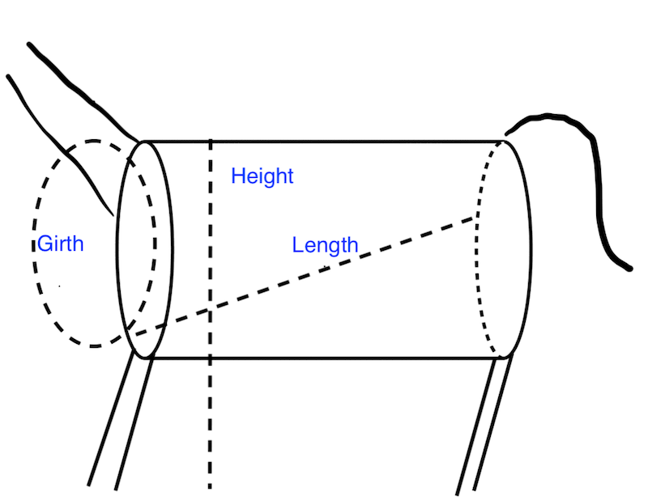
*图 14.1 驴的周长、长度和高度示意图，特征化为圆柱体上的测量*

我们的下一步是对数据进行一些质量检查。上一节中，我们根据范围列出了一些潜在的质量问题。接下来，我们检查测量的质量及其分布。

让我们从比较对部分驴进行的两次体重测量开始，以检查秤的一致性。我们为这 31 头被称重两次的驴的两次测量之间的差异绘制直方图：

```python
donkeys = donkeys.assign(difference=donkeys["WeightAlt"] - donkeys["Weight"])

fig = px.histogram(donkeys, x="difference", nbins=15,
    labels=dict(
        difference="Differences of two weighings (kg)<br>on the same donkey"
    ),
    width=350, height=250,
)
fig.show()
```

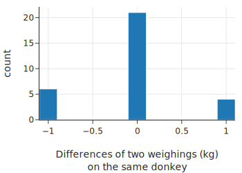

测量值都在 1 kg 以内，绝大多数完全相同（精确到最接近的千克）。这让我们对测量的准确性充满信心。

接下来，我们在身体状况评分中寻找异常值：

```python
donkeys['BCS'].value_counts()
```

```text
BCS
3.0    307
2.5    135
3.5     55
      ... 
1.5      5
4.5      1
1.0      1
Name: count, Length: 8, dtype: int64
```

从输出中，我们看到只有一头消瘦（BCS = 1）和一头肥胖（BCS = 4.5）的驴。让我们看看这两头驴的完整记录：

```python
donkeys[(donkeys['BCS'] == 1.0) | (donkeys['BCS'] == 4.5)]
```

<div class="output_subarea output_html rendered_html output_result">
<div>
<table border="1" class="dataframe">
  <thead>
    <tr style="text-align: right;">
      <th></th>
      <th>BCS</th>
      <th>Age</th>
      <th>Sex</th>
      <th>Length</th>
      <th>Girth</th>
      <th>Height</th>
      <th>Weight</th>
      <th>WeightAlt</th>
    </tr>
  </thead>
  <tbody>
    <tr>
      <th>291</th>
      <td>4.5</td>
      <td>10-15</td>
      <td>female</td>
      <td>107</td>
      <td>130</td>
      <td>106</td>
      <td>227</td>
      <td>NaN</td>
    </tr>
    <tr>
      <th>445</th>
      <td>1.0</td>
      <td>&gt;20</td>
      <td>female</td>
      <td>97</td>
      <td>109</td>
      <td>102</td>
      <td>115</td>
      <td>NaN</td>
    </tr>
  </tbody>
</table>
</div>
</div>

由于这些 BCS 值是极端的，我们在分析中要谨慎包含这两头驴。由于我们在每个极端类别中只有一头驴，我们的模型可能无法很好地扩展到 BCS 为 1 或 4.5 的驴。所以我们从 dataframe 中**删除这两条记录**，并注意我们的分析可能无法扩展到消瘦或肥胖的驴。一般来说，我们在删除 dataframe 中的记录时要谨慎。稍后，如果评分为 1.5 的五头驴在分析中显得异常，我们也可能决定删除它们，但现在，我们将它们保留在 dataframe 中。我们需要充分的理由来排除它们，记录我们的行为，并保持排除的观察数量较少，以免因为删除了任何与模型不一致的记录而使模型过拟合。

接下来我们移除这两个异常值：

```python
def remove_bcs_outliers(donkeys):
    return donkeys[(donkeys['BCS'] >= 1.5) & (donkeys['BCS'] <= 4)] 

donkeys = (pd.read_csv('data/donkeys.csv')
           .pipe(remove_bcs_outliers))
```

现在，我们检查体重的分布值，看看是否存在质量问题：

```python
fig = px.histogram(donkeys, x='Weight', nbins=40, width=350, height=250,
            labels={'Weight':'Weight (kg)'})
fig.show()
```

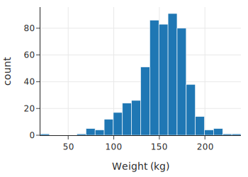

似乎有一头体重不到 30 公斤的非常轻的驴。接下来，我们检查体重和身高之间的关系，以评估用于分析的数据质量：

```python
fig = px.scatter(donkeys, x='Height', y='Weight', width=350, height=250,
          labels={'Weight':'Weight (kg)', 'Height':'Height (cm)'})
fig.show()
```

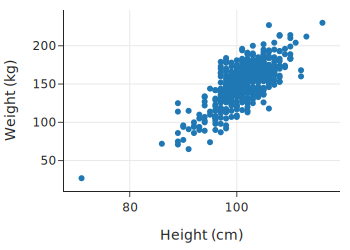

这头小驴远离主要的驴群，会对我们的模型产生过度影响。因此，我们将其排除。同样，我们要记住，如果有那一两头重驴在未来的模型拟合中显得过度影响，我们也可能想要排除它们：

```python
def remove_weight_outliers(donkeys):
    return donkeys[(donkeys['Weight'] >= 40)]

donkeys = (pd.read_csv('data/donkeys.csv')
           .pipe(remove_bcs_outliers)
           .pipe(remove_weight_outliers))

donkeys.shape
```

```text
(541, 8)
```

总之，基于我们的清理和质量检查，我们从 dataframe 中移除了三个异常观察值。现在我们几乎准备好开始我们的探索性分析了。在我们继续之前，我们将部分数据留作**测试集 (test set)**。

我们在第 12 章讨论了为什么将测试集与训练集分开很重要。最佳实践是在分析的早期分离出测试集，在我们详细探索数据之前，因为在 EDA 中，我们开始决定拟合什么样的模型以及在模型中使用哪些变量。重要的是我们的测试集不参与这些决策，以便它能模拟我们的模型在处理全新数据时的表现。

我们将数据按 80/20 分割，其中我们使用 80% 的数据进行探索和构建模型。然后我们使用预留的 20% 来评估模型。我们使用简单随机抽样将 dataframe 分割为测试集和训练集。首先，我们将 dataframe 的索引随机打乱：

```python
np.random.seed(42)
n = len(donkeys)
indices = np.arange(n)
np.random.shuffle(indices)
n_train = int(np.round((0.8 * n)))
```

接下来，我们将 dataframe 的前 80% 分配给训练集，剩余的 20% 分配给测试集：

```python
train_set = donkeys.iloc[indices[:n_train]]
test_set = donkeys.iloc[indices[n_train:]]
```

现在我们准备好探索训练数据，寻找有助于我们建模的有用关系和分布。

## 3. 探索性数据分析 (Exploring)

让我们查看 dataframe 中的特征，寻找有助于我们进行转换和建模的形状和关系（第 10 章）。首先，我们要查看年龄、性别和身体状况等分类特征与体重的关系：

```python
f1 = px.box(train_set, x="Age", y="Weight", 
            category_orders = {"Age":['<2', '2-5', '5-10', 
                                      '10-15', '15-20', '>20']})
f2 = px.box(train_set, x="Sex", y="Weight")

# 我們编写了 left_right 函数作为 plotly make_subplots 的简写
fig = left_right(f1, f2, column_widths=[0.7, 0.3])

fig.update_xaxes(title='Age (yr)', row=1, col=1)
fig.update_xaxes(title='Sex', row=1, col=2)
fig.update_yaxes(title='Weight (kg)', row=1, col=1)
fig.show()
```

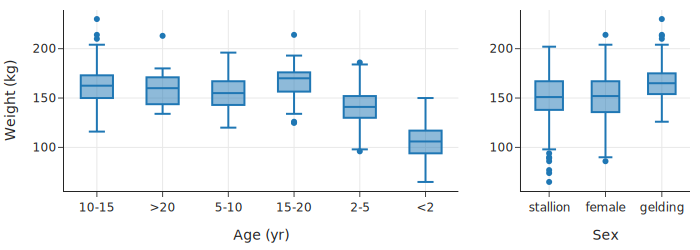

```python
fig = px.box(train_set, x="BCS", y="Weight", points="all",
             labels={'Weight':'Weight (kg)', 'BCS':'Body condition score'},
             width=550, height=250)
fig.show()
```

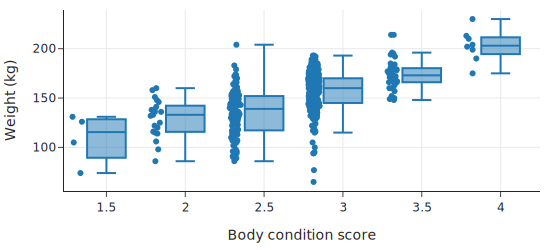

注意，我们绘制了身体状况评分的点和箱形图，因为我们要记得之前看到的只有少数观察值的得分为 1.5，所以我们不想过多解读数据点很少的箱形图（第 11 章）。看来中位体重随着身体状况评分的增加而增加，但不是以简单的线性方式。另一方面，三个性别类别的体重分布大致相同。至于年龄，一旦驴子达到 5 岁，体重分布似乎就不会发生太大变化。但是 2 岁以下的驴子和 2 到 5 岁的驴子通常体重较轻。

接下来，让我们检查定量变量。我们在散点图矩阵中绘制所有定量变量对：

```python
train_numeric = train_set[['Weight', 'Length', 'Girth', 'Height']]
fig = px.scatter_matrix(train_numeric, width=600, height=600)
fig.show()
```

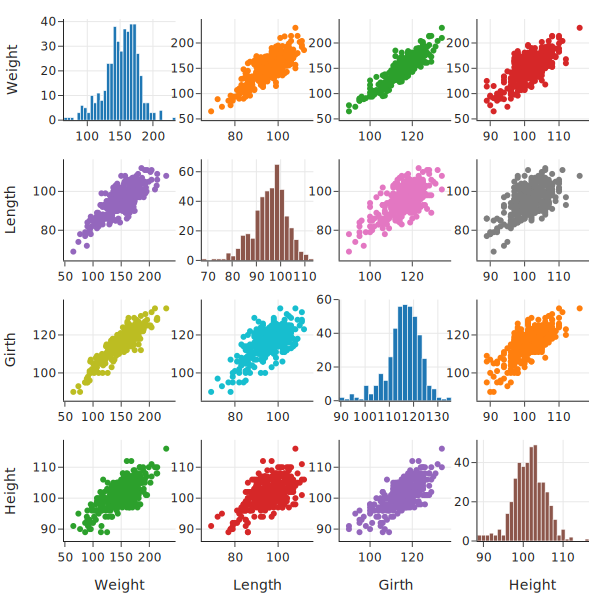

驴子的身高、体长和周长似乎都与体重以及彼此线性相关。这并不奇怪；给定驴子的一个尺寸，我们应该能够很好地猜测其他尺寸。周长与体重的相关性最高，这一点通过相关系数矩阵得到了证实：

```python
train_numeric.corr()
```

<div class="output_subarea output_html rendered_html output_result">
<div>
<table border="1" class="dataframe">
  <thead>
    <tr style="text-align: right;">
      <th></th>
      <th>Weight</th>
      <th>Length</th>
      <th>Girth</th>
      <th>Height</th>
    </tr>
  </thead>
  <tbody>
    <tr>
      <th>Weight</th>
      <td>1.00</td>
      <td>0.78</td>
      <td>0.90</td>
      <td>0.71</td>
    </tr>
    <tr>
      <th>Length</th>
      <td>0.78</td>
      <td>1.00</td>
      <td>0.66</td>
      <td>0.58</td>
    </tr>
    <tr>
      <th>Girth</th>
      <td>0.90</td>
      <td>0.66</td>
      <td>1.00</td>
      <td>0.70</td>
    </tr>
    <tr>
      <th>Height</th>
      <td>0.71</td>
      <td>0.58</td>
      <td>0.70</td>
      <td>1.00</td>
    </tr>
  </tbody>
</table>
</div>
</div>

我们的探索揭示了数据的几个方面，这些方面可能与建模有关。我们发现驴子的周长、体长和身高都与体重以及彼此呈线性关联，并且**周长与体重具有最强的线性关系**。我们还观察到，身体状况评分与体重呈正相关；驴子的性别似乎与体重无关；对于 5 岁以上的驴子，年龄也与体重无关。在下一节中，我们将使用这些发现来构建我们的模型。

## 14.4 驴的体重建模

我们希望建立一个简单的模型来预测驴的体重。该模型应该便于兽医在野外仅使用手持计算器就能实施。模型还应该易于解释。

我们还希望模型取决于兽医的情况——例如，他们是在开抗生素还是麻醉剂。为了简洁起见，我们只考虑开麻醉剂的情况。我们的第一步是选择一个反映这种情况的损失函数。

### 14.4.1 麻醉剂处方的损失函数

麻醉剂过量比剂量不足要糟糕得多。兽医很容易看出驴的麻醉剂量是否过少（它会抱怨），兽医可以再给驴一点。另一方面，过多的麻醉剂会产生严重后果，甚至可能致命。正因为如此，我们需要一个非对称的损失函数：与低估相比，它对高估体重的损失更大。这与我们在本书中迄今为止使用的其他损失函数形成对比，后者都是对称的。

考虑到这一点，我们创建了一个损失函数 `anes_loss(x)`：

```python
def anes_loss(x):
    w = (x >= 0) + 3 * (x < 0)
    return np.square(x) * w
```

相对误差为 $100(y - \hat{y})/\hat{y}$，其中 $y$ 是真实值，$\hat{y}$ 是预测值。我们可以用图表来展示损失函数的非对称性：

```python
xs = np.linspace(-40, 40, 500)
loss = anes_loss(xs)

fig = px.line(x=xs, y=loss, title='Modified quadratic loss',
              width=350, height=250)

fig.update_layout(
    xaxis_title='Relative error (%)',
    yaxis_title='Loss',
    margin=dict(t=30)
)
fig.show()
```

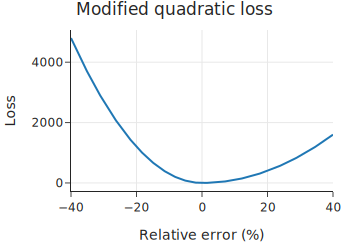

请注意，x 轴上的 -10 值反映了 10% 的高估（预测值大于真实值，导致 $y - \hat{y}$ 为负）。

接下来，让我们使用这个损失函数拟合一个简单的线性模型。

### 14.4.2 拟合简单线性模型

我们看到，在训练集的驴中，**周长**（Girth）与体重的相关性最高。所以我们要拟合一个形式如下的模型：

$$ \theta_0 + \theta_1 \text{Girth} $$

为了找到数据的最佳拟合 $\theta_0$ 和 $\theta_1$，我们首先创建一个包含周长和截距项的设计矩阵。我们还创建观测到的驴体重的 $y$ 向量：

```python
X = train_set.assign(intr=1)[['intr', 'Girth']]
y = train_set['Weight']
X.head()
```

现在我们想找到使数据上的平均麻醉损失最小化的 $\theta_0$ 和 $\theta_1$。为了做到这一点，我们可以使用微积分，但在这里我们将使用 `scipy` 包中的 `minimize` 方法，它执行数值优化：

```python
from scipy.optimize import minimize

def training_loss(X, y):
    def loss(theta):
        predicted = X @ theta
        return np.mean(anes_loss(100 * (y - predicted) / predicted))
    return loss

results = minimize(training_loss(X, y), np.ones(2))
theta_hat = results['x']

print('After fitting:')
print(f'θ₀ = {theta_hat[0]:>7.2f}')
print(f'θ₁ = {theta_hat[1]:>7.2f}')
```

让我们看看这个简单模型的效果如何。我们可以使用该模型来预测训练集上的驴体重，然后找到预测中的误差。随后的残差图显示了模型误差占预测值的百分比。预测误差相对于驴的大小较小更为重要，因为对于 100 公斤的驴来说，10 公斤的误差比 200 公斤的驴要糟糕得多。因此，我们找到每个预测的相对误差：

```python
predicted = X @ theta_hat
resids = 100 * (y - predicted) / predicted

resid = pd.DataFrame({'Predicted weight (kg)': predicted, 'Percent error': resids})
fig = px.scatter(resid, x='Predicted weight (kg)', y='Percent error',
           width=350, height=250)
fig.show()
```

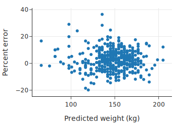

对于最简单的模型，一些预测会有 20% 到 30% 的偏差。让我们看看稍微复杂一点的模型是否能改进预测。

### 14.4.3 拟合多元线性模型

让我们考虑包含其他数值变量的其他模型。我们有三个测量驴周长、长度和高度的数值变量，共有七种组合这些变量的方法：

```python
import itertools

numeric_vars = ['Girth', 'Length', 'Height']

models = [list(subset)
          for n in [1, 2, 3]
          for subset in itertools.combinations(numeric_vars, n)]
# models
```

对于这些变量组合中的每一个，我们都可以用我们特殊的损失函数拟合一个模型。然后我们可以看看每个模型在训练集上的表现如何：

```python
def training_error(model):
    X = train_set.assign(intr=1)[['intr', *model]]
    theta_hat = minimize(training_loss(X, y), np.ones(X.shape[1]))['x']
    predicted = X @ theta_hat
    return np.mean(anes_loss(100 * (y - predicted)/ predicted))

model_risks = [
    training_error(model)
    for model in models
]

error_df = pd.DataFrame({'model': [str(m) for m in models], 'mean_training_error': model_risks})
error_df
```

如前所述，驴的周长是体重的最佳单一预测因子。然而，周长和长度的组合具有比单独周长小得多的平均损失，而且这个特定的双变量模型几乎与包含所有三个变量的模型一样好。由于我们想要一个简单的模型，我们选择双变量模型而不是三变量模型。

接下来，我们使用特征工程将分类变量纳入模型，这可以改进我们的模型。

### 14.4.4 将定性特征引入模型

在我们的探索性分析中，我们发现驴的身体状况（BCS）和年龄的体重箱线图可能包含预测体重的有用信息。由于这些是分类特征，我们可以通过独热编码（One-hot encoding）将它们转换为 0-1 变量。

独热编码允许我们为每个类别组合调整模型中的截距项。我们目前的模型包括数值变量周长和长度：

$$ \theta_0 + \theta_1 \text{Girth} + \theta_2 \text{Length} $$

如果我们清理年龄特征以包含三个类别——`Age<2`、`Age2-5` 和 `Age>5`——年龄的独热编码会创建三个 0-1 特征。在模型中包含独热编码特征会得出：

$$
\begin{aligned}
    \theta_0
    & + \theta_1  \text{Girth }
      + \theta_2  \text{Length } \\
    & + \theta_3  \text{Age<2 }
      + \theta_4  \text{Age2-5 }
\end{aligned}
$$

在这个模型中，对于小于 2 岁的驴，`Age<2` 为 1，否则为 0。类似地，对于 2 到 5 岁的驴，`Age2-5` 为 1，否则为 0。

我们可以将此模型视为拟合三个除了常数大小外完全相同的线性模型。

现在让我们对所有三个分类变量（身体状况、年龄和性别）应用独热编码：

```python
X_one_hot = (
    train_set.assign(intr=1)
    [['intr', 'Length', 'Girth', 'BCS', 'Age', 'Sex']]
    .pipe(pd.get_dummies, columns=['BCS', 'Age', 'Sex'])
    .drop(columns=['BCS_3.0', 'Age_5-10', 'Sex_female'])
)
X_one_hot.head()
```

我们为每个分类特征删除了一个虚拟变量。由于 `BCS`、`Age` 和 `Sex` 分别有六个、六个和三个类别，我们在设计矩阵中添加了 12 个虚拟变量，总共 15 列，包括截距项、周长和长度。

让我们看看哪些分类变量（如果有）改进了我们的双变量模型。为此，我们可以拟合包含所有三个分类特征的虚拟变量以及周长和长度的模型：

```python
results = minimize(training_loss(X_one_hot, y), np.ones(X_one_hot.shape[1]))

theta_hat = results['x']

y_pred = X_one_hot @ theta_hat
tr_error = (np.mean(anes_loss(100 * (y - y_pred)/ y_pred)))

print(f'Training error: {tr_error:.2f}')
```

根据平均损失，这个模型比仅有 `Girth` 和 `Length` 的先前模型表现更好。但让我们尝试在保持准确性的同时使这个模型更简单。为此，我们查看每个虚拟变量的系数，看看它们离 0 有多近，以及彼此之间有多近。换句话说，如果不将系数包含在模型中，我们想看看截距可能会发生多大变化。系数图将使这种比较变得容易：

```python
bcs_vars = ['BCS_1.5', 'BCS_2.0', 'BCS_2.5', 'BCS_3.5', 'BCS_4.0']
age_vars = ['Age_<2', 'Age_2-5', 'Age_10-15', 'Age_15-20', 'Age_>20']
sex_vars = ['Sex_gelding', 'Sex_stallion']

thetas = (pd.DataFrame({'var': X_one_hot.columns, 'theta_hat': theta_hat})
          .set_index('var'))

# 绘制系数图
import plotly.subplots as sp
import plotly.graph_objects as go

f1 = px.scatter(thetas.loc[bcs_vars].reset_index(), x='var', y='theta_hat')
f2 = px.scatter(thetas.loc[sex_vars].reset_index(), x='var', y='theta_hat')
f3 = px.scatter(thetas.loc[age_vars].reset_index(), x='var', y='theta_hat')

fig = sp.make_subplots(rows=1, cols=3, shared_yaxes=True, column_widths=[0.35, 0.2, 0.45])

for trace in f1.data:
    fig.add_trace(trace, row=1, col=1)
for trace in f2.data:
    fig.add_trace(trace, row=1, col=2)
for trace in f3.data:
    fig.add_trace(trace, row=1, col=3)

fig.update_layout(width=550, height=250, title='Coefficients')
fig.show()
```

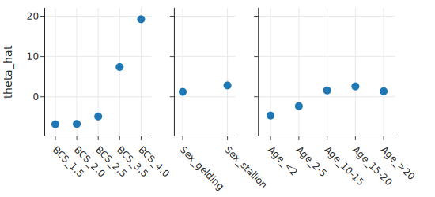

系数证实了我们在箱线图中看到的情况。驴性别的系数接近于零，这意味着知道性别并不会真正改变体重预测。我们还看到，合并 5 岁以上驴的年龄类别可以简化模型而不会损失太多。最后，由于身体状况评分为 1.5 的驴很少，且其系数接近 BCS 为 2 的系数，我们倾向于合并这两个类别。

鉴于这些发现，我们更新设计矩阵：

```python
def combine_bcs(X):
    # 检查列是否存在，防止重复合并或列不存在错误
    if 'BCS_2.0' in X.columns and 'BCS_1.5' in X.columns:
        new_bcs_2 = X['BCS_2.0'] + X['BCS_1.5']
        return X.assign(**{'BCS_2.0': new_bcs_2}).drop(columns=['BCS_1.5'])
    return X

def combine_age_and_sex(X):
    cols_to_drop = ['Age_10-15', 'Age_15-20', 'Age_>20', 'Sex_gelding', 'Sex_stallion']
    # 只删除存在的列
    existing_cols = [c for c in cols_to_drop if c in X.columns]
    return X.drop(columns=existing_cols)

X_one_hot_simple = (
    X_one_hot.pipe(combine_bcs)
    .pipe(combine_age_and_sex)
)
```

然后我们拟合更简单的模型：

```python
results = minimize(training_loss(X_one_hot_simple, y),
                   np.ones(X_one_hot_simple.shape[1]))
theta_hat = results['x']
y_pred = X_one_hot_simple @ theta_hat
tr_error = (np.mean(anes_loss(100 * (y - y_pred)/ y_pred)))
print(f'Training error: {tr_error:.2f}')
```

平均误差与更复杂的模型足够接近，我们可以确定这个更简单的模型。让我们显示系数并总结模型：

```python
pd.DataFrame({'var': X_one_hot_simple.columns, 'theta_hat': theta_hat})
```

我们的模型大致为：

$$ \text{Weight} \approx -175 + \text{Length} + 2\text{Girth} $$

在这个初步近似之后，我们使用分类特征进行一些调整：

*   BCS 2 或更低？减去 6.5 公斤。
*   BCS 2.5？减去 5.1 公斤。
*   BCS 3.5？加上 7.4 公斤。
*   BCS 4？加上 20 公斤。
*   年龄小于 2 岁？减去 6.5 公斤。
*   年龄在 2 到 5 岁之间？减去 3.5 公斤。

这个模型似乎很容易实施，因为在根据驴的长度和周长进行初步估计后，我们根据几个是/否问题的答案加上或减去几个数字。让我们看看模型在预测测试集中的驴体重方面表现如何。

### 14.4.5 模型评估

请记住，在探索和建模剩余的 80% 之前，我们将 20% 的数据放在一边。只要我们不对测试集进行训练，我们现在就可以将从训练集中学到的知识应用于测试集。也就是说，我们利用我们拟合的模型来预测测试集中驴的体重。

为此，我们需要准备测试集。我们的模型使用驴的周长和长度，以及驴年龄和身体状况评分的虚拟变量。我们将训练集上的所有转换应用于测试集：

```python
y_test = test_set['Weight']

X_test = (
    test_set.assign(intr=1)
    [['intr', 'Length', 'Girth', 'BCS', 'Age', 'Sex']]
    .pipe(pd.get_dummies, columns=['BCS', 'Age', 'Sex'])
    .drop(columns=['BCS_3.0', 'Age_5-10', 'Sex_female'])
    .pipe(combine_bcs)
    .pipe(combine_age_and_sex)
)
```

我们整合了对设计矩阵的所有操作，以创建我们在训练集建模中确定的最终版本。现在我们要使用我们在训练集上拟合的 $\theta$ 来预测测试集中那些驴的体重：

```python
y_pred_test = X_test @ theta_hat
test_set_error = 100 * (y_test - y_pred_test) / y_pred_test
```

然后我们可以绘制相对预测误差：

```python
fig = px.scatter(x=y_pred_test, y=test_set_error,
                 title='Test set predictions',
                 width=350, height=250)
fig.update_traces(marker=dict(size=4))
fig.add_hline(y=10, line_width=3, line_color='green')
fig.add_hline(y=-10, line_width=3, line_color='green')

fig.update_layout(
    xaxis_title='Predicted weight (kg)',
    yaxis_title='Relative error (%)',
    margin=dict(t=30)
)
fig.show()
```

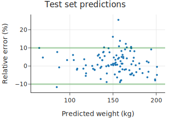

请记住，正相对误差意味着低估体重，这并不像高估体重那样危急。从这个残差图中，我们看到几乎所有测试集的体重都在预测的 10% 以内，只有一个超过 10% 的误差是高估了。考虑到我们的损失函数对高估的惩罚更多，这也是有道理的。

另一种显示实际值和预测值以及标记 10% 误差线的散点图提供了不同的视角：

```python
fig = px.scatter(y=y_test, x=y_pred_test, 
                 title="Test set predictions with 10% error lines",
                 width=350, height=350)
fig.update_traces(marker=dict(size=4))

# 添加辅助线
fig.add_trace(go.Scatter(x=[60, 200], y=[60, 200], name='0% error',
                         mode='lines', marker=dict(color='green')))
fig.add_trace(go.Scatter(x=[60, 200], y=[66, 220], name='10% error',
                         mode='lines', marker=dict(color='red')))
fig.add_trace(go.Scatter(x=[60, 200], y=[54, 180], name='-10% error',
                         mode='lines', marker=dict(color='red')))

fig.update_layout(showlegend=False, 
                  xaxis_title="Predicted weight (kg)",
                  yaxis_title="Actual weight (kg)",
                  margin=dict(t=30))
fig.show()
```

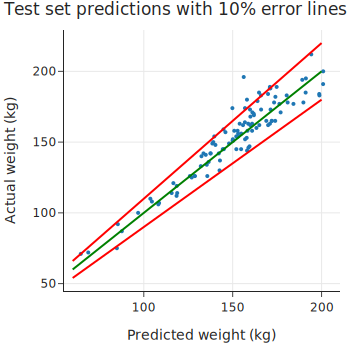

10% 的线在较大体重处离预测线更远。

我们实现了我们的目标！我们有一个模型，它使用易于获得的测量值，简单到可以在说明书上解释，并且做出的预测在实际驴体重的 10% 以内。接下来，我们总结这个案例研究并反思我们的模型。

## 14.5 总结

在这个案例研究中，我们展示了建模的不同目的：描述、推断和预测。对于描述，我们寻求一个简单、易懂的模型。我们根据从分析的探索阶段得出的发现，手工构建了这个模型。我们在模型中包含特征、合并类别或转换特征所采取的每一个行动，都相当于我们在调查数据时做出的决定。

在对诸如驴的体重等自然现象进行建模时，理想情况下我们会利用物理和统计模型。在这种情况下，物理模型是将驴表示为一个圆柱体。好奇的读者可能已经指出，我们可以直接使用这种表示法，根据驴的长度和周长（因为周长是 $2\pi r$）来估计其（圆柱体）重量：

$$ \text{weight} \propto \text{girth}^2 \times \text{length} $$

这个物理模型表明，对数变换后的重量与周长和长度近似呈线性关系：

$$ \log(\text{weight}) \propto 2\log(\text{girth}) + \log(\text{length}) $$

鉴于这个物理模型，你可能会想，为什么我们在拟合模型时没有使用对数或平方变换。我们留给你去更详细地研究这样的模型。但一般来说，如果测量值的范围很小，那么对数函数大致是线性的。为了保持我们的模型简单，考虑到我们在周长和体重之间看到的高相关性所显示的统计模型的强度，我们选择不进行这些变换。

在这个建模练习中，我们做了大量的*数据挖掘*（data dredging）。我们检查了由数值特征的线性组合构建的所有可能模型，并检查了虚拟变量的系数以决定是否合并类别。当我们使用像这样的迭代方法创建模型时，**留出数据来评估模型是极其重要的**。在新数据上评估模型使我们确信我们选择的模型效果良好。我们留出的数据没有进入构建模型时的任何决策过程，因此它让我们很好地了解模型在进行预测时的效果。

我们应该牢记前面描述的数据范围及其潜在偏差。我们的模型在测试集上表现良好，但测试集和训练集来自同一个数据收集过程。只要新数据的范围保持不变，我们期望我们的模型在实践中也能表现良好。

最后，这个案例研究表明，拟合模型往往是在简单与复杂之间，以及物理模型与统计模型之间的一种平衡。物理模型可以是建模的一个很好的起点，而统计模型可以为物理模型提供信息。作为数据科学家，我们需要在分析的每一步做出判断。建模既是一门艺术，也是一门科学。

本案例研究及其前面的几章主要集中在拟合线性模型上。接下来，我们将考虑一种不同类型的建模，用于当我们要解释或预测的响应变量是定性（Categorical）的而不是定量（Quantitative）的情况（即分类问题）。

下一章：[分类建模](15_分类.md)