# 15. 分类 (Classification)

本章继续我们在数据科学生命周期第四阶段的探索：拟合和评估模型以理解世界。到目前为止，我们已经描述了如何使用绝对误差拟合常数模型，以及使用平方误差拟合简单和多元线性模型。我们还拟合了具有非对称损失函数的线性模型（如第 14 章的案例研究）和具有正则化损失的模型。在所有这些情况下，我们的目标都是预测或解释**数值结果**的行为——公交车等待时间、空气中的烟雾颗粒和驴的重量都是数值变量。

在本章中，我们将扩展我们的建模视野。我们不再预测数值结果，而是建立模型来预测**名义结果** (nominal outcomes)。这类模型使银行能够预测信用卡交易是否具有欺诈性，医生能够将肿瘤分类为良性或恶性，以及电子邮件服务能够识别垃圾邮件并将其与您的常规电子邮件分开。这种类型的建模称为**分类** (Classification)，在数据科学中广泛应用。

正如线性回归一样，我们制定模型，选择损失函数，通过最小化数据的平均损失来拟合模型，并评估拟合的模型。但与线性回归不同，我们的模型不是线性的；损失函数不是平方误差；我们的评估比较的是不同种类的分类错误。尽管有这些差异，模型拟合的整体结构在这一设置中延续了下来。回归和分类共同构成了**监督学习** (Supervised Learning) 的主要方法，即基于观察到的结果和协变量拟合模型的一般任务。

我们首先介绍一个将在本章中一直使用的例子。

## 15.1 示例：风灾树木 (Example: Wind-Damaged Trees)

1999 年，一场风速超过 90 英里/小时的巨大风暴摧毁了边界水域独木舟区荒原（BWCAW）数百万棵树木，该地区拥有美国东部最大的一片原始森林。为了了解树木对风害的敏感性，研究员罗伊·劳伦斯·里奇（Roy Lawrence Rich）对 BWCAW 进行了地面调查。在这项研究之后的几年里，其他研究人员利用这个数据集来模拟**风折**（windthrow），即强风中树木被连根拔起的情况。

研究的总体是 BWCAW 中的树木。访问框架是**样带**（transects）：穿过自然景观的直线。这些特定的样带始于湖边，并在与地势梯度垂直的方向上延伸 250-400 米。沿着这些样带，测量员每隔 25 米停下来，检查一个 5x5 米的样地。在每个样地，计数树木，将其分类为被吹倒或站立，在离地面 6 英尺处测量直径，并记录其种类。

像这样的抽样方案在自然资源研究中很常见。在 BWCAW，该地区 80% 以上的土地都在距离湖泊 500 米以内，因此访问框架几乎覆盖了总体。这项研究在 2000 年和 2001 年的夏天进行，在 1999 年的风暴和数据收集之间没有发生其他自然灾害。

共收集了 3,600 多棵树的测量数据，但在本例中，我们只检查**黑云杉**（black spruce）。这部分数据有 650 多条。我们读取这些数据：

```python
trees = pd.read_csv('data/black_spruce.csv')
trees.head()
```

每一行对应一棵树，并具有以下属性：

*   `diameter`：树的直径（厘米），在离地面 6 英尺处测量。
*   `storm`：风暴的严重程度（包含该树的 25 米宽区域内倒下的树木的比例）。
*   `status`：树木是“倒下”（fallen）还是“站立”（standing）。

在转向建模之前，让我们先进行一些探索性分析。首先，我们计算一些简单的汇总统计数据：

```python
trees.describe().iloc[3:]
```

根据四分位数，树木直径的分布似乎是右偏的。让我们用直方图比较站立和倒下树木的直径分布：

```python
fig = px.histogram(trees, x='diameter', color='status', barmode='overlay',
                   nbins=30, width=550, height=300,
                   title='Distribution of Tree Diameter by Status')
fig.show()
```

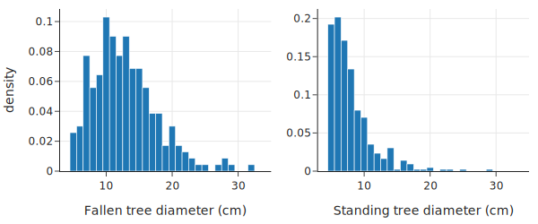

在风暴中倒下的树木直径分布中心在 12 厘米，呈右偏分布。相比之下，站立的树木直径几乎都在 10 厘米以下，众数约为 6 厘米（研究只包括直径至少为 5 厘米的树木）。

另一个需要调查的特征是风暴的强度。我们将风暴强度对树木直径作图，使用符号和标记颜色来区分站立的树木和倒下的树木。由于直径本质上是测量到最接近的厘米，许多树木具有相同的直径，因此我们通过向直径值添加一点噪声来**抖动**（jitter）这些值，以帮助减少重叠（参见第 11 章）。我们还调整标记颜色的不透明度，以揭示图中较密集的区域：

```python
def jitter(data, amt=0.2):
    return data + amt * (np.random.rand(len(data)) - 0.5)

fig = px.scatter(
    trees, x=jitter(trees["diameter"], amt=0.5), y="storm",
    color="status", symbol="status",
    log_x=True, width=650, height=300,
)

fig.update_traces(marker=dict(opacity=0.6, size=5))

fig.update_layout(
    xaxis_title="Tree diameter (cm)",
    yaxis_title="Local strength of storm",
    legend_title="Tree status",
)

fig.show()
```

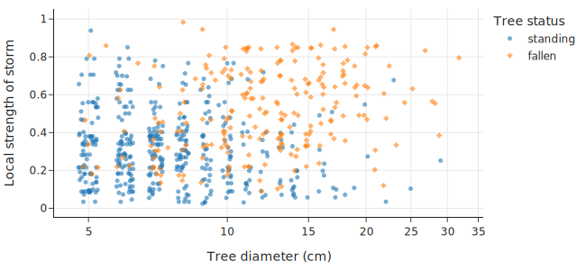

从这张图中，看起来树木直径和风暴强度都与风折有关：即树木是被连根拔起还是保持站立。请注意，风折（不仅是我们要预测的特征）是一个**名义变量**（nominal variable）。在下一节中，我们将考虑这对预测问题有什么影响。

## 15.2 建模与分类 (Modeling and Classification)

我们想要创建一个模型来解释树木对风折的敏感性。换句话说，我们需要为与其相关的两级名义特征建立一个模型：倒下（fallen）或站立（standing）。当响应变量是名义变量时，这种建模任务称为**分类** (classification)。在这种情况下，只有两个级别，所以这个任务更具体地称为**二元分类** (binary classification)。

### 15.2.1 常数模型

让我们从最简单的模型开始：一个总是预测某一类别的常数模型。我们使用 $C$ 来表示常数模型的预测。对于我们的风折数据集，这个模型将对每个输入都做出相同的预测（即要么全部预测 $C = \text{standing}$，要么全部预测 $C = \text{fallen}$）。

在分类中，我们希望跟踪模型预测正确类别的频率。目前，我们简单地这样做：使用正确预测的计数。这有时被称为**0-1 误差** (zero-one error)，因为损失函数取两个可能值之一：做出错误预测时为 1，做出正确预测时为 0。对于给定的观测结果 $y_i$ 和预测 $C$，我们可以将此损失函数表示如下：

$$
\begin{aligned} 
{\ell}(C, y) = 
\begin{cases} 0 &  & \text{当 } C \text{ 匹配 } y \text{ 时} \\ 
       1 &  & \text{当 } C \text{ 与 } y \text{ 不匹配时}
\end{cases}
\end{aligned} 
$$

当我们收集了数据 $\mathbf{y} = [y_1 , \ldots, y_n]$ 时，平均损失为：

$$
\begin{aligned}
L(C, \mathbf{y}) &= \frac{1}{n} \sum_{i=1}^n {\ell}(C, y) \\
  &= \frac{\# \text{ 错误匹配}}{n} \\
  &= 1 - \frac{\# \text{ 正确匹配}}{n}
\end{aligned}
$$

为了最小化平均损失（即最小化错误率），我们需要最大化正确匹配的数量。对于常数模型（见第 4 章），这意味着我们应该总是预测数据中出现频率最高的类别（即众数）。例如，如果“站立”的树比“倒下”的多，常数模型就会预测所有树都是“站立”的（即 0）。当 $C$ 设置为**最普遍的类别**时，模型使损失最小化。

在黑云杉的情况下，我们有以下比例的站立和倒下的树木：

```python
trees['status'].value_counts() / len(trees)
```

因此，我们的预测是树木站立，我们数据集的平均损失是 $0.35$。

也就是说，这个预测并不是特别有帮助或有见地。例如，在我们对树木数据集的 EDA 中，我们看到树的大小与树是站立还是倒下相关。理想情况下，我们可以将这些信息纳入模型，但常数模型不允许我们这样做。让我们建立一些直觉，了解如何在模型中纳入预测变量。

### 15.2.2 检查大小与风折之间的关系

我们想仔细看看树的大小与风折之间的关系。为了方便起见，我们将名义风折特征转换为 0-1 数值特征，其中 1 代表倒下的树，0 代表站立的树：

```python
trees['status_0_1'] = (trees['status'] == 'fallen').astype(int)
trees.head()
```

这种表示在很多方面都很有用。例如，`status_0_1` 的平均值是数据集中倒下树木的比例：

```python
pr_fallen = np.mean(trees['status_0_1'])
print(f"Proportion of fallen black spruce: {pr_fallen:0.2f}")
```

拥有这个 0-1 特征也让我们能够绘制显示树木直径与风折之间关系的图表。这类似于我们线性回归的过程，我们在那里制作结果变量与解释变量的散点图。

在这里，我们将树的状态对直径作图，但我们在状态中添加少量随机噪声，以帮助我们看到每个直径处 0 和 1 值的密度。如前所述，我们也对直径值进行抖动，并调整标记的不透明度以减少重叠。我们还在倒下树木的比例处添加一条水平线：

```python
fig = px.scatter(x=jitter(trees['diameter'], amt=0.5), 
                 y=jitter(trees['status_0_1']), 
                 log_x=True, width=450, height=250)

fig.update_traces(marker=dict(opacity=0.5, size=5))
fig.add_hline(y=pr_fallen, line_width=3, line_dash="dash", line_color="black")
fig.update_layout(xaxis_title="Tree diameter (cm)",
                  yaxis_title="0 = standing,     1 = fallen")
fig.show()
```

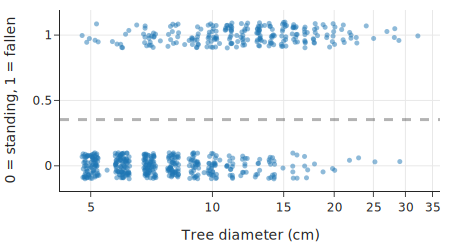

这个散点图显示，较小的树木比较大的树木更有可能站立。请注意，树木的平均状态（0.35）本质上是对响应变量拟合了一个常数模型。如果我们考虑将树木直径作为解释特征，我们应该能够改进模型。

一个起点可能是计算不同直径下倒下树木的比例。下面的代码块将树木直径分成区间，并计算每个箱中倒下树木的比例：

```python
splits = [4, 5, 6, 7, 8, 9, 10, 12, 14, 17, 20, 25, 32]
tree_bins = (
    trees["status_0_1"]
    .groupby(pd.cut(trees["diameter"], splits))
    .agg(["mean", "count"])
    .rename(columns={"mean": "proportion"})
    .assign(diameter=lambda df: [i.right for i in df.index])
)
tree_bins
```

我们可以将这些比例对树木直径作图：

```python
fig = px.scatter(tree_bins, x='diameter', y='proportion', size='count',
                 log_x=True, 
                 labels={'diameter':"Tree diameter (cm)",
                         'proportion':"Proportion down"},
                 width=450, height=250)

fig.update_layout(yaxis_range=[0, 1])
fig.show()
```

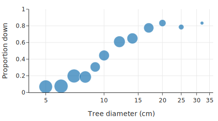

标记的大小反映了直径箱中的树木数量。我们可以使用这些比例来改进我们的模型。例如，对于直径为 6 厘米的树，我们将其分类为站立，而对于 20 厘米的树，我们的分类将是倒下。二元分类的一个自然起点是**模拟观察到的比例**，然后使用这些比例进行分类。接下来，我们为这些比例开发一个模型。

## 15.3 建模比例（和概率） (Modeling Proportions and Probabilities)

回想一下，当我们建模时，我们需要选择三样东西：一个模型，一个损失函数，以及一种在训练集上最小化平均损失的方法。在上一节中，我们选择了常数模型、0-1 损失和证明来拟合模型。然而，常数模型没有包含预测变量。在本节中，我们通过引入一种称为**逻辑模型** (logistic model) 的新模型来解决这个问题。

为了激发这些模型的灵感，请注意树木直径和倒下树木比例之间的关系并不呈线性。为了演示，让我们对这些数据拟合一个简单的线性模型，看看它有哪些不受欢迎的特征。

利用第 15 章的技术，我们将树的状态对直径拟合一个线性模型：

```python
from sklearn.linear_model import LinearRegression
X = trees[['diameter']]
y = trees['status_0_1']

lin_reg = LinearRegression().fit(X, y)
```

然后我们将这条拟合线添加到我们的比例散点图中：

```python
X_plt = pd.DataFrame(
    {"diameter": np.linspace(X["diameter"].min(), X["diameter"].max(), 10)}
)

import plotly.graph_objects as go

# 重新绘制基础图
fig = px.scatter(tree_bins, x='diameter', y='proportion', size='count',
                 log_x=True, 
                 labels={'diameter':"Tree diameter (cm)",
                         'proportion':"Proportion down"},
                 width=450, height=250)
fig.update_layout(yaxis_range=[0, 1])

# 添加线性回归预测线
fig.add_trace(
    go.Scatter(x=X_plt['diameter'], y=lin_reg.predict(X_plt), mode="lines", name="Linear Regression")
)

fig.update_layout(showlegend=False)
fig.show()
```

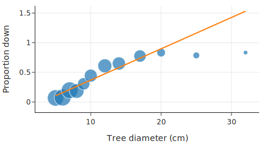

很明显，该模型根本不能很好地拟合比例。有几个问题：

*   对于大树，模型给出的比例大于 1。
*   模型没有捕捉到比例中的曲率。
*   极端点（例如直径为 30 厘米的树）将拟合线拉向右侧，远离了主体数据。

为了解决这些问题，我们引入**逻辑模型** (logistic model)。

### 15.3.1 逻辑模型 (A Logistic Model)

逻辑模型是用于分类的最广泛使用的基本模型之一，也是线性模型的简单扩展。**逻辑函数** (logistic function)，通常称为 **Sigmoid 函数**，定义为：

$$
\textbf{logistic}(t) = \frac{1}{1+\exp(-t)}
$$

!!! warning "警告"
    Sigmoid 函数通常用 $\sigma(t)$ 表示。遗憾的是，希腊字母 $\sigma$ 在数据科学和统计学中被广泛用于表示很多东西，如标准差、逻辑函数和排列。当你看到 $\sigma$ 时，你必须小心，并使用上下文来理解它的含义。

我们可以绘制逻辑函数来揭示其 S 形（sigmoid-shape），并确认它输出 0 到 1 之间的数字。该函数随 $t$ 单调增加，$t$ 的大值接近 1：

```python
def logistic(t):
    return 1. / (1. + np.exp(-t))
```

由于逻辑函数映射到 0 到 1 之间的区间，因此它通常用于建模比例和概率。同样，我们可以将逻辑函数写成直线 $\theta_0 + \theta_1 x$ 的函数：

$$
\sigma\left(\theta_0 + \theta_1 x\right) = \frac{1}{1+\exp(-\theta_0 - \theta_1 x)}
$$

为了帮助你建立对该函数形状的直觉，下图显示了当我们改变 $\theta_0$ 和 $\theta_1$ 时的逻辑函数：

```python
from plotly.subplots import make_subplots
fig = make_subplots(rows=1, cols=3)

from itertools import cycle
styles = cycle(['dashdot', None, 'dot'])

t = np.linspace(-10, 10, 100)

row = col = 1
for theta1 in [1, 5, -1]:
    for theta0 in [2, 0, -2]:
        fig.add_trace(go.Scatter(name=f"{theta0} + {theta1}x", 
                                 x=t, y=logistic(theta0 + theta1*t),
                                 mode="lines", line=dict(dash=next(styles))),
                      row=row, col=col)
    col += 1
        
fig.update_layout(width=800, height=250)        
fig.show()
```

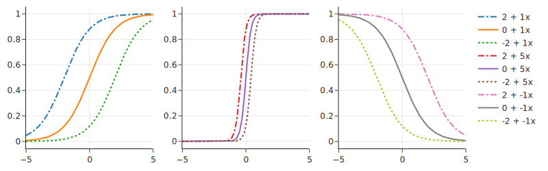

我们可以看到，改变 $\theta_1$ 的大小会改变曲线的锐度；离 0 越远，曲线越陡峭。反转 $\theta_1$ 的符号将使曲线关于垂直线 $x=0$ 反射。改变 $\theta_0$ 会使曲线左右移动。

逻辑函数可以看作是一种转换：它将线性函数转换为非线性平滑曲线，并且输出始终在 0 和 1 之间。事实上，逻辑函数的输出具有更深层的概率解释，我们将在下面描述。

### 15.3.2 对数几率 (Log Odds)

回想一下，对于概率 $p$，**几率** (odds) 是比率 $p/(1-p)$。例如，当我们抛掷一枚公平的硬币时，获得正面的几率为 1；对于一枚正面朝上的可能性是反面两倍的硬币（$p=2/3$），获得正面的几率为 2。逻辑模型也被称为**对数几率** (log odds) 模型，因为逻辑函数与对数几率的线性函数相吻合。

我们可以在以下方程中看到这一点。为了证明这一点，我们将 sigmoid 函数的分子和分母乘以 $\exp(t)$：

$$
\begin{aligned}
\sigma(t) & = \frac{1}{1+\exp(-t)} = \frac{\exp(t)}{1+\exp(t)} \\ 
\\
(1-\sigma(t)) & = 1 - \frac{\exp(t)}{1+\exp(t)} = \frac{1}{1+\exp(t)}
\end{aligned}
$$

然后我们取几率的对数并简化：

$$
\begin{aligned}
\log \left( \frac{\sigma(t)}{1-\sigma(t)} \right) & = \log(\exp{(t)}) = t\\
\end{aligned}
$$

因此，对于 $\sigma(\theta_0 + \theta_1x)$，我们发现对数几率是 $x$ 的线性函数：

$$
\begin{aligned}
\log \left( \frac{\sigma(\theta_0 + \theta_1x)}{1-\sigma(\theta_0 + \theta_1x)} \right) & = \log(\exp{(\theta_0 + \theta_1x)}) = \theta_0 + \theta_1x\\
\end{aligned}
$$

这种用对数几率表示逻辑函数的方式给出了系数 $\theta_1$ 的有用解释。假设解释变量增加 1。那么几率变化如下：

$$
\begin{aligned}
\text{ odds } =& ~ \exp\left( \theta_0 + \theta_1(x+1) \right)\\
 =& ~ \exp(\theta_1) \times \exp{(\theta_0 + \theta_1x)}
\end{aligned}
$$

我们看到几率增加或减少了 $\exp(\theta_1)$ 倍。

!!! note "注意"
    在这里，$\log$ 函数是自然对数。由于自然对数是数据科学中的默认设置，我们通常不会费心将其写为 $\ln$。

接下来，让我们在比例图上添加一条逻辑曲线，看看它与数据的拟合程度如何。

### 15.3.3 使用逻辑曲线 (Using a Logistic Curve)

在下图中，我们在倒下树木比例图的顶部添加了一条逻辑曲线：

```python
from sklearn.linear_model import LogisticRegression

# 对直径取对数，因为原始数据呈现对数关系趋势
trees = trees.assign(log_diam=np.log(trees['diameter']))
X = trees[['log_diam']]
y = trees['status_0_1']

lr_model = LogisticRegression().fit(X, y)

X_plt = pd.DataFrame(
    {"log_diam": np.linspace(X["log_diam"].min(), X["log_diam"].max(), 50)}
)
# 获取预测概率
p_hats = lr_model.predict_proba(X_plt)
X_orig = np.exp(X_plt)

fig = px.scatter(
    tree_bins, x="diameter", y="proportion", size="count", log_x=True,
    labels={"diameter": "Tree diameter (cm)", "proportion": "Proportion down"},
    width=450, height=250,
)

fig.add_trace(go.Scatter(
    x=X_orig["log_diam"], y=p_hats[:, 1], line=dict(color="orange", width=3),
    name="Logistic Regression"
))

fig.update_layout(showlegend=False)
fig.show()
```

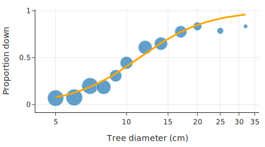

我们可以看到曲线相当好地遵循了比例。事实上，我们是通过将该特定逻辑函数拟合到数据来选择它的。拟合的逻辑回归是：

```python
[t0] = lr_model.intercept_
[[t1]] = lr_model.coef_
print(f'σ({t0:.1f} + {t1:.1f}x)')
```

输出： `σ(-7.4 + 3.0x)`

既然我们已经看到逻辑曲线可以很好地模拟概率，我们就转向将逻辑曲线拟合到数据的过程。在下一节中，我们将进入建模的第二步：选择合适的损失函数。

## 15.4 逻辑模型的损失函数 (A Loss Function for the Logistic Model)

逻辑模型给出了预测结果属于类别 1 的概率（或经验比例），因此我们将损失函数写为 $\ell(p, y)$。这里，$p$ 是模型预测的概率（取值在 0 和 1 之间），而 $y$ 是实际的类别标签。由于我们的结果特征是二元分类，响应变量取两个值之一。因此，任何损失函数都简化为：

$$
\begin{aligned} 
{\ell}(p, y) = 
 \begin{cases}
    \ell(p, 0) & \text{当 } y \text{ 为 0 时} \\    
    \ell(p, 1) & \text{当 } y \text{ 为 1 时}
    \end{cases}
\end{aligned} 
$$

再次强调，使用 0 和 1 来表示类别具有优势，因为我们可以方便地将损失写为：

$$
\ell(p, y) =  ~ y \ell(p, 1) + (1-y) \ell(p, 0)
$$

我们鼓励您通过考虑 $y=1$ 和 $y=0$ 两种情况来确认这种等价性。

逻辑模型与**对数损失** (log loss) 搭配得很好：

$$
\begin{aligned} 
{\ell}(p, y) = & 
 \begin{cases}
    -\log(p) & \text{当 } y \text{ 为 1 时} \\    
    -\log(1-p) & \text{当 } y \text{ 为 0 时}
    \end{cases}
    \\
    = & -y \log(p) -(1-y) \log(1-p)   
\end{aligned} 
$$

请注意，对数损失在 0 和 1 处未定义，因为当 $p$ 趋于 0 时 $-\log(p)$ 趋于 $\infty$，同样当 $p$ 趋于 1 时 $-\log(1-p)$ 趋于 $\infty$。在最小化时我们需要小心避免端点。我们可以在下面两种形式的损失函数图中看到这一点：

```python
# p 从 0.001 到 0.999，避免 0 和 1
p = np.linspace(0.001, 0.999, 75)

fig = go.Figure()

fig.add_trace(
    go.Scatter(x=p, y=-1 * np.log(p), name="y = 1", line=dict(width=4))
)
fig.add_trace(
    go.Scatter(
        x=p, y=-1 * np.log(1 - p), name="y = 0", line=dict(width=4, dash="dot")
    )
)

fig.update_layout(width=450, height=250, xaxis_range=[0, 1],
                  title="Log Loss Function",
                  xaxis_title="Predicted Probability p",
                  yaxis_title="Loss")
fig.show()
```

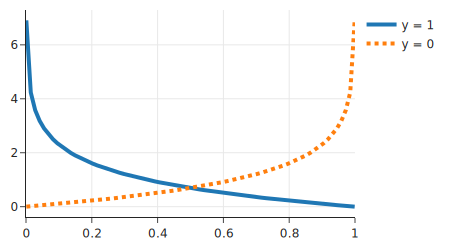

当 $y$ 为 1（实线）时，对于接近 1 的 $p$，损失很小；而当 $y$ 为 0（虚线）时，对于接近 0 的 $p$，损失很小。

如果我们的目标是使用对数损失对数据拟合一个常数，那么平均损失为：

$$
\begin{aligned}
L(p, \textbf{y}) = & \frac{1}{n} \sum_i  [- y_i  \log(p)  - (1 - y_i) \log (1 -p)] \\
 = & -\frac{n_1}{n} \log(p)  - \frac{n_0}{n} \log (1 -p)
\end{aligned}
$$

这里 $n_0$ 和 $n_1$ 分别是 $y_i$ 为 0 和 1 的数量。我们可以对 $p$ 求导以找到极小值点：

$$
\frac {\partial L(p, \textbf{y})} {\partial p} =  -\frac{n_1}{np}  + \frac{n_0}{n(1-p)}
$$

然后我们将导数设为 0 并求解最小化值 $\hat{p}$：

$$
\begin{aligned}
0 &= -\frac{n_1}{n{\hat{p}}}  + \frac{n_0}{n(1-{\hat{p}})} \\
0 &= - \hat{p}(1-\hat{p}) \frac{n_1}{\hat{p}}  + \hat{p}(1-\hat{p}) \frac{n_0}{(1-{\hat{p}})}\\ 
{n_1} (1-\hat{p})  & = {n_0} \hat{p}\\
\hat{p}  & = \frac{n_1}{n}
\end{aligned}
$$

（最后的方程是因为注意到 $n_0 + n_1 = n$。）

为了拟合基于逻辑函数的更复杂的模型，我们可以用 $\sigma(\theta_0 + \theta_1x)$ 代替 $p$。逻辑模型的损失变为：

$$
\begin{aligned}
{\ell}(\sigma(\theta_0 + \theta_1x), y) & =  ~ y \ell(\sigma(\theta_0 + \theta_1x), y) + 
(1-y)\ell(\sigma(\theta_0 + \theta_1x), 1-y)   \\
 & = y \log(\sigma(\theta_0 + \theta_1x)) + 
(1-y)\log(\sigma(\theta_0 + \theta_1x))
\end{aligned}
$$

对数据求平均损失，我们得到：

$$
\begin{aligned}
L(\theta_0, \theta_1,\textbf{x}, \textbf{y}) =  \frac{1}{n} \sum_i  & - y_i 
 \log(\sigma(\theta_0 + \theta_1x_i)) \\
 & - (1 - y_i) \log (1 - \sigma(\theta_0 + \theta_1x_i))
\end{aligned}
$$

与平方误差不同，该损失函数没有闭式解。相反，我们使用迭代方法如梯度下降（见第 20 章）来最小化平均损失。这也是我们不对逻辑模型使用平方误差损失的原因之一——平均平方误差是非凸的，这使得它难以优化。凸性的概念将在第 20 章中更详细地介绍。

!!! note "注意"
    对数损失也被称为**逻辑损失** (logistic loss) 和**交叉熵损失** (cross-entropy loss)。
    它的另一个名字是**负对数似然** (negative log likelihood)。这个名字指的是使用概率分布产生数据的可能性来拟合模型的技术。我们在这里不深入探讨这些替代方法的背景。

拟合逻辑模型（使用对数损失）称为**逻辑回归** (Logistic Regression)。逻辑回归是**广义线性模型**的一个例子，即具有非线性变换的线性模型。

我们可以使用 `scikit-learn` 拟合逻辑模型。包的设计者使其 API 非常类似于通过最小二乘法拟合线性模型（见第 15 章）。首先，我们导入逻辑回归模块：

```python
from sklearn.linear_model import LogisticRegression
```

然后我们设置回归问题，结果变量 `y` 是树的状态，协变量 `X` 是直径（我们已经对其进行了对数变换）：

```python
# 确保之前已经进行了对数变换
# trees['log_diam'] = np.log(trees['diameter']) 
X = trees[['log_diam']]
y = trees['status_0_1']
```

然后我们拟合逻辑回归并检查截距和直径的系数：

```python
lr_model = LogisticRegression()
lr_model.fit(X, y)

[intercept] = lr_model.intercept_
[[coef]] = lr_model.coef_
print(f'Intercept:           {intercept:.1f}')
print(f'Diameter coefficient: {coef:.1f}')
```

输出： `Intercept: -7.4 Diameter coefficient: 3.0`

当进行预测时，`predict` 函数返回预测的（最可能的）类别，而 `predict_proba` 返回预测概率。对于直径为 6 的树，我们预计预测为 0（意味着 `standing`），且概率很高。让我们检查一下：

```python
diameter6 = pd.DataFrame({'log_diam': [np.log(6)]})
[pred_prob] = lr_model.predict_proba(diameter6)
print(f'Predicted probabilities: {pred_prob}')
```

输出： `Predicted probabilities: [0.87 0.13]`

因此，模型预测直径为 6 的树有 0.87 的概率属于 `standing` 类，有 0.13 的概率属于 `fallen` 类。

既然我们已经拟合了一个具有一个特征的模型，我们可能想看看包含另一个特征（如风暴强度）是否可以改进模型。为此，我们可以通过向 `X` 添加一个特征并再次拟合模型来拟合多元逻辑回归。

请注意，逻辑回归拟合模型以预测概率——模型预测直径为 6 的树有 0.87 的概率属于 `standing` 类，有 0.13 的概率属于 `fallen` 类。由于概率可以是 0 到 1 之间的任何数字，我们需要将概率转换回类别以执行分类。我们在下一节中解决这个分类问题。

## 15.5 从概率到分类 (From Probabilities to Classification)

我们在本章开头提出了一个二元分类问题，我们希望在其中对名义响应变量进行建模。到目前为止，我们已经使用了逻辑回归来建模比例或概率，现在我们准备回到最初的问题：我们使用预测概率对记录进行分类。对于我们的例子，这意味着对于特定直径的树，我们使用逻辑回归的拟合系数来估计其倒下的机会。如果机会很高，我们将树分类为倒下；否则，我们将分类为站立。但是我们需要选择一个阈值来制定这个**决策规则** (decision rule)。

`sklearn` 逻辑回归模型的 `predict` 函数实现了基本的决策规则：如果预测概率 $p > 0.5$，则预测 `1`。否则，预测 0。我们将此决策规则作为虚线叠加在模型预测之上：

```python
X_plt = pd.DataFrame(
    {"log_diam": np.linspace(X["log_diam"].min(), X["log_diam"].max(), 50)}
)
p_hats = lr_model.predict_proba(X_plt)
X_orig = np.exp(X_plt)

fig = px.scatter(
    tree_bins, x="diameter", y="proportion", size="count", log_x=True,
    labels={"diameter": "Tree diameter (cm)", "proportion": "Proportion down"},
    width=550, height=250,
)

fig.add_trace(go.Scatter(
    x=X_orig["log_diam"], y=p_hats[:, 1], line=dict(color="orange", width=3),
    mode="lines", name="Model predictions",
))

fig.add_trace(go.Scatter(
    x=X_orig["log_diam"], y=np.repeat(0.5, len(X_orig)),
    line=dict(color="black", width=3, dash="dashdot"),
    name="Decision rule",
))

fig.show()
```

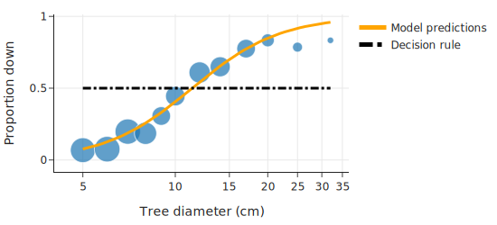

在本节中，我们考虑更一般的决策规则。对于某个 $\tau$ 的选择，如果模型的预测概率 $p > \tau$，则预测 1，否则预测 0。默认情况下，`sklearn` 设置 $\tau = 0.5$。让我们探索当 $\tau$ 设置为其他值时会发生什么。

选择合适的 $\tau$ 值取决于我们的目标。假设我们想要最大化准确率 (accuracy)。分类器的**准确率**是正确预测的分数。我们可以计算不同阈值下的准确率，即不同的 $\tau$ 值：

```python
def threshold_predict(model, X, threshold):
    return np.where(model.predict_proba(X)[:, 1] > threshold, 1.0, 0.0)

def accuracy(threshold, X, y):
    return np.mean(threshold_predict(lr_model, X, threshold) == y)

thresholds = np.linspace(0, 1, 200)
accs = [accuracy(t, X, y) for t in thresholds]
```

为了理解准确率如何随 $\tau$ 变化，我们制作一个图：

```python
fig = px.line(x=thresholds, y=accs, width=450, height=250)
fig.add_trace(
    go.Scatter(
        x=[0.5, 0.5],
        y=[0.3, 0.8],
        mode="lines",
        name="𝛕 = 0.5",
        showlegend=True,
    )
)
fig.update_xaxes(title="Threshold")
fig.update_yaxes(title="Accuracy")
fig.show()
```

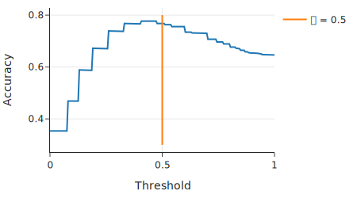

请注意，具有最高准确率的阈值并不完全在 0.5。在实践中，我们应该使用交叉验证来选择阈值（见第 16 章）。

使准确率最大化的阈值可能是 0.5 以外的值，原因有很多，但常见的原因是**类别不平衡** (class imbalance)，即一个类别比另一个类别更频繁。类别不平衡会导致模型将记录分类为属于更常见的类别。在极端情况下（如欺诈检测），当只有极小部分数据包含特定类别时，我们的模型可以通过简单地总是预测频繁类别来获得高准确率，而无需学习什么能成为稀有类别的良好分类器。有一些技术可以管理类别不平衡，例如：

*   对数据进行重采样以减少或消除类别不平衡
*   调整损失函数以对较小的类别施加更大的惩罚

在我们的例子中，类别不平衡并不是那么极端，所以我们继续不进行这些调整。

类别不平衡问题解释了为什么仅凭准确率往往不是我们要判断模型的方式。相反，我们要区分正确和错误分类的类型。我们接下来描述这些。

### 15.5.1 混淆矩阵 (The Confusion Matrix)

可视化二元分类错误的一种方便方法是查看混淆矩阵 (confusion matrix)。混淆矩阵将模型的预测与实际结果进行比较。在这种情况下有两种类型的错误：

*   **假阳性** (False-positives)：实际类别为 0 (false) 但模型预测为 1 (true)
*   **假阴性** (False-negatives)：实际类别为 1 (true) 但模型预测为 0 (false)

理想情况下，我们希望最小化这两种错误，但我们经常需要管理这两个来源之间的平衡。

!!! note "注意"
    术语**阳性** (positive) 和**阴性** (negative) 来自疾病检测，其中检测表明存在疾病称为阳性结果。这一点可能有点令人困惑，因为患病似乎根本不是什么积极的事情。$y=1$ 表示“阳性”情况。为了搞清楚，最好确认您对 $y=1$ 在数据上下文中代表什么的理解。

`scikit-learn` 有一个函数来计算和绘制混淆矩阵：

```python
from sklearn.metrics import confusion_matrix
mat = confusion_matrix(y, lr_model.predict(X))
print(mat)
```

输出：
```text
[[377  49]
 [104 129]]
```

```python
import plotly.figure_factory as ff

# 注意：plotly.figure_factory 的 create_annotated_heatmap 用于热力图
# 我们需要翻转矩阵或者是标签顺序以匹配通常的混淆矩阵布局
# 通常是 [[TN, FP], [FN, TP]]

fig = ff.create_annotated_heatmap(
    z=mat,
    x=["False", "True"],
    y=["False", "True"],
    showscale=False,
    colorscale=px.colors.sequential.gray_r,
)
fig.update_layout(font=dict(size=16), width=300, height=250)

# 添加标签
annotations = [
    dict(x=0, y=0, text="True negative", yshift=30, showarrow=False, font=dict(color="white", size=14)),
    dict(x=1, y=0, text="False positive", yshift=30, showarrow=False, font=dict(color="black", size=14)),
    dict(x=0, y=1, text="False negative", yshift=30, showarrow=False, font=dict(color="black", size=14)),
    dict(x=1, y=1, text="True positive", yshift=30, showarrow=False, font=dict(color="black", size=14))
]

fig.layout.annotations = fig.layout.annotations + tuple(annotations)

fig.update_xaxes(title="Predicted")
fig.update_yaxes(title="Actual", autorange="reversed")
fig.show()
```

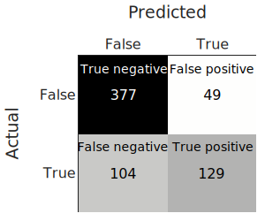

理想情况下，我们希望看到对角线方块（真阴性和真阳性）中的所有计数。这意味着我们已经正确地分类了一切。但这很少见，我们需要评估错误的大小。为此，比较比率比计数更容易。接下来，我们描述不同的比率，以及我们要何时优先考虑其中一个。

### 15.5.2 精确率与召回率 (Precision Versus Recall)

在某些设置中，错过阳性病例的代价可能更高。例如，如果我们正在构建一个分类器来识别肿瘤，我们要确保不错过任何恶性肿瘤。相反，我们要不太担心将良性肿瘤归类为恶性，因为病理学家仍然需要仔细观察以验证恶性分类。在这种情况下，我们希望在实际为阳性的记录中具有较高的真阳性率。该比率称为**灵敏度** (sensitivity) 或**召回率** (recall)：

$$
\text{Recall} = \frac{\text{True Positives}}{\text{True Positives} + \text{False Negatives}} = \frac{\text{True Positives}}{\text{Actually True}}
$$

高召回率冒着在假记录上预测为真的风险（假阳性）。

另一方面，当将电子邮件分类为垃圾邮件（阳性）或普通邮件（阴性）时，如果重要的电子邮件被扔进垃圾邮件文件夹，我们可能会很恼火。在这种设置中，我们希望具有高**精确率** (precision)，即模型对阳性预测的准确性：

$$
\text{Precision} = \frac{\text{True Positives}}{\text{True Positives} + \text{False Positives}} = \frac{\text{True Positives}}{\text{Predicted True}}
$$

高精确率模型通常更有可能预测真实观察结果为阴性（较高的假阴性率）。

常见的分析比较不同阈值下的精确率和召回率：

```python
from sklearn import metrics
precision, recall, threshold = (
    metrics.precision_recall_curve(y, lr_model.predict_proba(X)[:, 1]))

tpr_df = pd.DataFrame({"threshold":threshold, 
                       "precision":precision[:-1], "recall": recall[:-1], })
```

为了查看精确率和召回率的关系，我们将它们都对阈值 $\tau$ 作图：

```python
fig = go.Figure()
              
fig.add_trace(go.Scatter(x=tpr_df["threshold"], y=tpr_df["precision"], name="Precision"))

fig.add_trace(go.Scatter(x=tpr_df["threshold"], y=tpr_df["recall"], name="Recall",
                         line=dict(dash='dash')))

fig.update_layout(width=550, height=250, 
                  xaxis_title="Threshold", yaxis_title="Proportion")
fig.show()
```

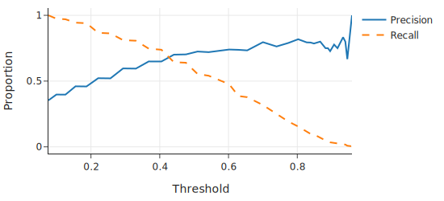

另一个用于评估分类器性能的常用图是**精确率-召回率曲线** (precision-recall curve)，简称 PR 曲线。它绘制每个阈值的精确率-召回率对：

```python
fig = px.line(tpr_df, x="recall", y="precision",
             labels={"recall":"Recall","precision":"Precision"})
fig.update_layout(width=450, height=250, yaxis_range=[0, 1])
fig.show()
```

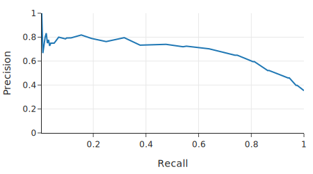

请注意，曲线的右端反映了样本中的不平衡。精确率与样本中倒下树木的分数 0.35 相匹配。绘制不同模型的多个 PR 曲线对于比较模型特别有用。

使用精确率和召回率使我们可以更好地控制什么样的错误很重要。
作为一个例子，假设我们要确保至少 75% 的倒下树木被归类为倒下。我们可以找到发生这种情况的阈值：

```python
fall75_ind = np.argmin(recall >= 0.75) - 1

fall75_threshold = threshold[fall75_ind]
fall75_precision = precision[fall75_ind]
fall75_recall = recall[fall75_ind]

print(f'Threshold: {fall75_threshold:.2f}')
print(f'Precision: {fall75_precision:.2f}')
print(f'Recall:    {fall75_recall:.2f}')
```

输出：
```text
Threshold: 0.33
Precision: 0.59
Recall:    0.81
```

我们发现，我们归类为倒下的树木中有约 41% (1 – precision) 实际上是站立的。此外，我们发现低于此阈值的树木比例为：

```python
print("Proportion of samples below threshold:", 
      f"{np.mean(lr_model.predict_proba(X)[:,1] < fall75_threshold):0.2f}")
```

输出：`Proportion of samples below threshold: 0.52`

因此，我们将 52% 的样本分类为站立（阴性）。**特异性** (Specificity)（也称为**真阴性率**）衡量分类器标记为阴性的属于阴性类别的数据比例：

$$
\text{Specificity} = \frac{\text{True Negatives}}{\text{True Negatives} + \text{False Positives}} = \frac{\text{True Negatives}}{\text{Predicted False}}
$$

我们阈值的特异性是：

```python
act_neg = (y == 0)
true_neg = (lr_model.predict_proba(X)[:,1] < fall75_threshold) & act_neg

print(f"Specificity: {np.sum(true_neg) / np.sum(act_neg):0.2f}")
```

输出：`Specificity: 0.70`

换句话说，分类为站立的树木中有 70% 实际上是站立的。

正如我们所看到的，有几种方法可以使用 2x2 混淆矩阵。理想情况下，我们希望准确率、精确率和召回率都很高。这发生在大多数预测都沿着表格的对角线时，所以我们的预测几乎都是正确的——真阴性和真阳性。不幸的是，在大多数情况下，我们的模型会有一定程度的错误。在我们的例子中，相同直径的树木包括倒下和站立的混合，所以我们不能根据直径完美地分类树木。在实践中，当数据科学家选择阈值时，他们需要考虑其背景以决定是否优先考虑精确率、召回率或特异性。

## 15.6 总结 (Summary)

在本章中，我们拟合了带有一个解释变量的简单逻辑回归，但我们可以通过向设计矩阵添加更多特征，轻松地在模型中包含其他变量。例如，如果某些预测变量是分类的，我们可以将它们作为独热编码特征包含在内。这些想法直接延续自第 15 章。正则化技术（第 16 章）同样适用于逻辑回归。我们将在第 21 章的案例研究中整合所有这些建模技术——包括使用训练-测试拆分来评估模型，以及使用交叉验证来选择阈值——该案例将开发一个模型来分类假新闻。

逻辑回归是机器学习的基石，因为它自然地扩展到更复杂的模型。例如，逻辑回归是神经网络的基本组件之一。当响应变量有两个以上的类别时，逻辑回归可以扩展为多项逻辑回归 (multinomial logistic regression)。逻辑回归用于建模计数的另一个扩展称为泊松回归 (Poisson regression)。这些不同形式的回归与最大似然 (maximum likelihood) 有关，其中响应的底层模型分别是二项式、多项式或泊松分布，目标是在相应分布的参数上优化数据的似然性。这一类模型也被称为广义线性模型 (generalized linear models)。在所有这些场景中，最小化损失的封闭形式解都不存在，因此平均损失的优化依赖于数值方法，我们将在下一章中介绍这些方法。


