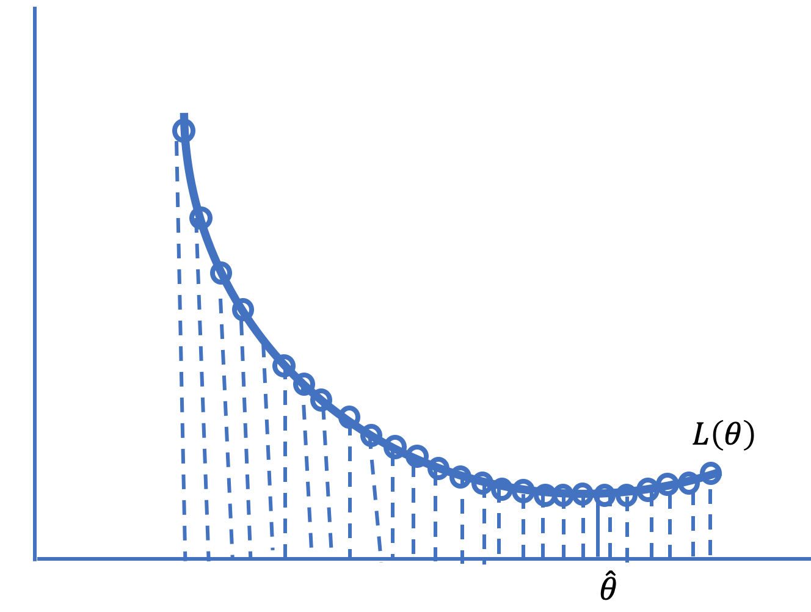
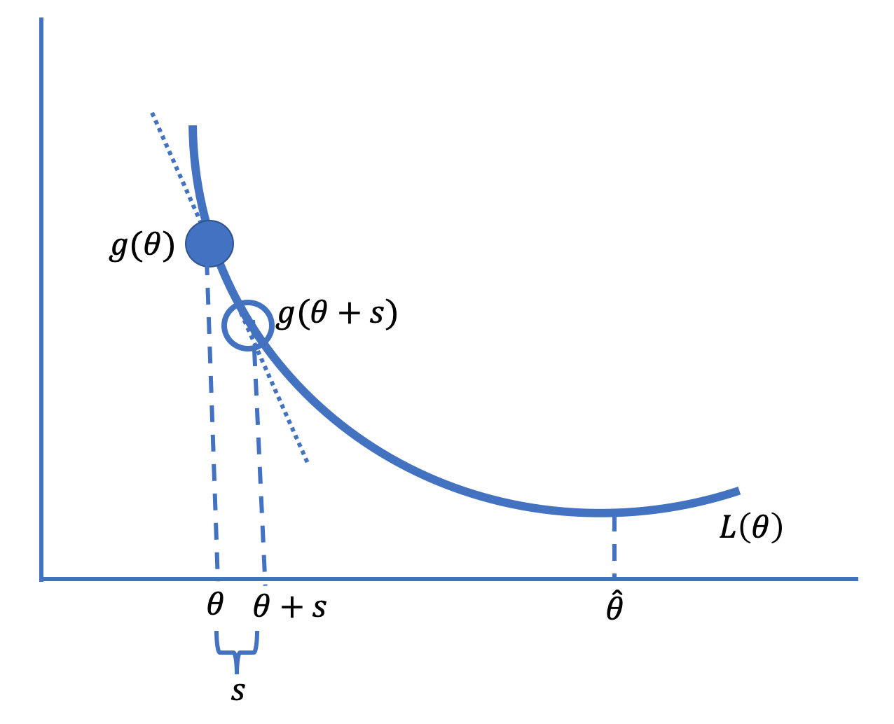
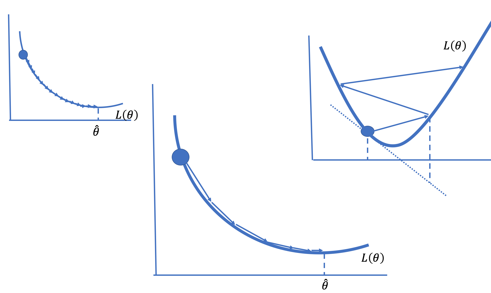
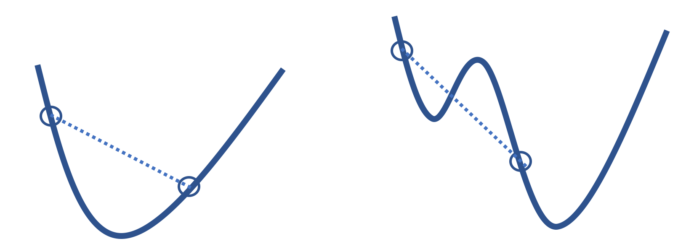
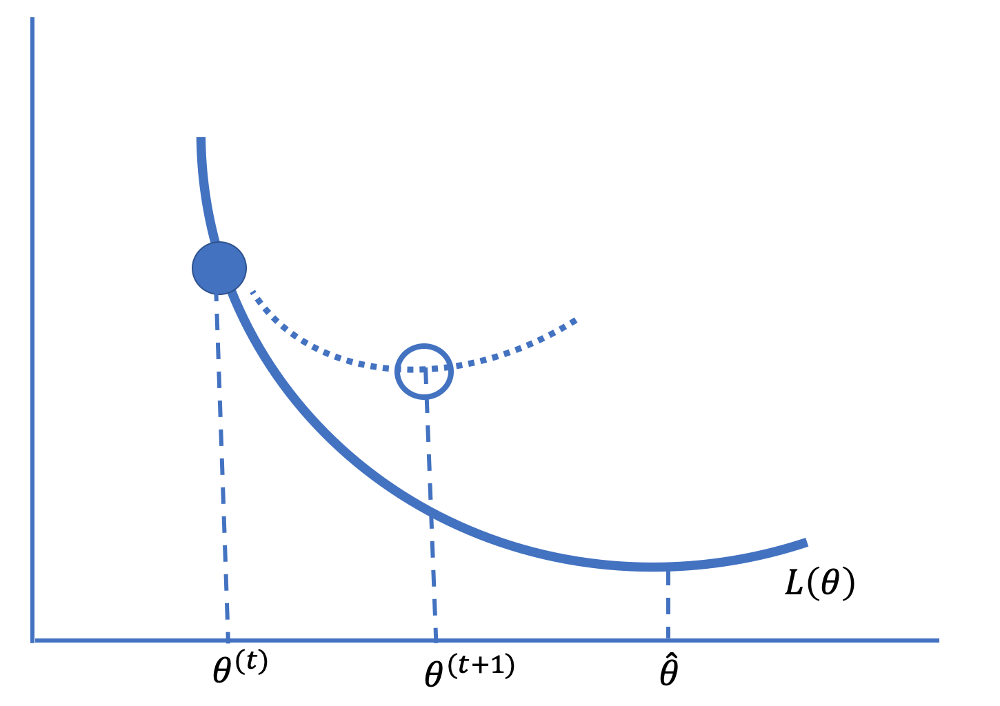

# 16. 数值优化 (Numerical Optimization)

到目前为止，我们的建模过程应该让人感到熟悉：我们定义一个模型，选择一个损失函数，通过最小化训练数据的平均损失来拟合模型。我们已经见过几种最小化损失的技术。例如，在第 15 章中，我们使用了微积分和几何论证来找到使用平方损失拟合线性模型的简单表达式。

但是经验损失最小化并不总是那么简单。Lasso 回归在平均平方损失中加入了 $L_1$ 惩罚，不再有闭式解；逻辑回归使用交叉熵损失来拟合非线性模型。在这些情况下，我们使用**数值优化** (numerical optimization) 来拟合模型，即我们系统地选择参数值来评估平均损失，以寻找使损失最小的值。

当我们在第 4 章介绍损失函数时，我们执行了一个简单的数值优化来找到平均损失的极小值点。我们创建了一个 $\theta$ 值的网格，并在网格的所有点上评估了平均损失（见图 20.1）。我们将具有最小平均损失的网格点作为最佳拟合。不幸的是，这种网格搜索很快变得不切实际，原因如下：

1.  **对于具有许多特征的复杂模型，网格变得笨重。** 仅有 4 个特征且每个特征有 100 个值的网格，我们就必须评估 $100^4 = 100,000,000$ (1亿) 个网格点的平均损失。
2.  **必须预先指定要搜索的参数值范围以创建网格。** 当我们对范围没有很好的认识时，我们需要从宽网格开始，并可能在更窄的范围内重复网格搜索。
3.  **如果观测值数量很大，在网格点上评估平均损失可能会很慢。**



*图 16.1：在点网格上搜索可能计算缓慢或不精确*

在本章中，我们将介绍利用损失函数的形状和平滑度来寻找最小化参数值的数值优化技术。我们首先介绍**梯度下降** (gradient descent) 技术背后的基本思想，然后给出一个例子并描述使梯度下降起作用的损失函数的属性，最后我们将提供梯度下降的一些扩展。

## 16.1 梯度下降基础 (Gradient Descent Basics)

梯度下降（Gradient Descent）基于这样一个概念：对于许多损失函数，函数在参数的小邻域内大致是线性的。图 16.2 给出了基本思想的示意图。



*图 16.2：梯度下降技术以小增量向最小化参数值移动*

在图中，我们在最小化值 $\hat{\theta}$ 左侧的某点 $\theta$ 处绘制了损失曲线 $L$ 的切线。请注意，切线的斜率是负的。从 $\theta$ 向右迈出一小步到 $\theta+s$（其中 $s$ 是一个小量），给出了切线上的一点，该点接近 $\theta+s$ 处的损失，并且该损失小于 $L(\theta)$。也就是说，由于斜率 $b$ 是负的，并且切线近似于 $\theta$ 邻域内的损失函数，我们有：

$$
L(\theta + s) \approx  L(\theta) + b \times s < L(\theta)
$$

因此，在这点 $\theta$ 向右迈出一小步会减少损失。另一方面，在图 16.2 中 $\hat{\theta}$ 的另一侧，斜率是正的，向左迈出一小步会减少损失。

当我们根据每一步切线斜率是正还是负指示的方向重复迈出小步时，这会导致平均损失值越来越小，最终将我们带到最小化值 $\hat{\theta}$（或非常接近它）。这就是梯度下降背后的基本思想。

更形式化地说，为了最小化一般参数向量 $\boldsymbol{\theta}$ 的一般向量，梯度（一阶偏导数）决定了迈步的方向和大小。如果我们将梯度 $\nabla_\theta L(\boldsymbol{\theta})$ 简单地写为 $g(\boldsymbol{\theta})$，那么梯度下降表示增量或步长为 $-\alpha g(\boldsymbol{\theta})$，其中 $\alpha$ 是某个小的正数。那么新位置的平均损失为：

$$
\begin{aligned}
L(\boldsymbol{\theta} - \alpha g(\boldsymbol{\theta})) & \approx L(\boldsymbol{\theta}) - \alpha g(\boldsymbol{\theta})^T g(\boldsymbol{\theta}) \\
 & < L(\boldsymbol{\theta})
\end{aligned}
$$

注意 $g(\boldsymbol{\theta})$ 是一个 $p \times 1$ 向量，且 $g(\boldsymbol{\theta})^T g(\boldsymbol{\theta})$ 是正的。

梯度下降算法的步骤如下：

1.  选择一个起始值，称为 $\boldsymbol{\theta}^{(0)}$（常见的选择是 $\boldsymbol{\theta}^{(0)} = 0$）。
2.  计算 $\boldsymbol{\theta}^{(t+1)} = \boldsymbol{\theta}^{(t)} - \alpha g(\boldsymbol{\theta}^{(t)})$。
3.  重复步骤 2，直到 $\boldsymbol{\theta}^{(t+1)}$ 在迭代之间不再变化（或变化很小）。

量 $\alpha$ 称为**学习率** (learning rate)。设置 $\alpha$ 可能很棘手。它需要足够小以免越过最小值，但也需要足够大以便在相当少的步骤内到达最小值（见图 20.3）。有许多设置 $\alpha$ 的策略。例如，随着时间的推移减小 $\alpha$ 可能会很有用。当 $\alpha$ 在迭代之间发生变化时，我们使用符号 $\alpha^{(t)}$ 来表示学习率在搜索过程中发生变化。



*图 16.3：较小的学习率需要许多步骤才能收敛（左），较大的学习率可能会发散（右）；选择合适的学习率可以快速收敛到最小化值（中）*

梯度下降算法简单而强大，因为我们可以将其用于多种类型的模型和多种类型的损失函数。它是拟合许多模型的首选计算工具，包括大型数据集上的线性回归和逻辑回归。接下来，我们演示该算法在公交车延误数据（来自第 4 章）上拟合常数的情况。

## 16.2 最小化 Huber 损失 (Minimizing Huber Loss)

**Huber 损失** (Huber loss) 结合了绝对损失和平方损失，得到一个既可微（像平方损失）又对异常值不太敏感（像绝对损失）的函数：

$$
L(\theta, \textbf{y}) = \frac{1}{n} \sum_{i=1}^n \begin{cases}
    \frac{1}{2}(y_i - \theta)^2 &  | y_i - \theta | \le \gamma \\
     \gamma (|y_i - \theta| - \frac{1}{2} \gamma ) & \text{其他情况}
\end{cases}
$$

由于 Huber 损失是可微的，我们可以使用梯度下降。我们首先找到平均 Huber 损失的梯度：

$$
\nabla_{\theta} L(\theta, \textbf{y}) = \frac{1}{n} \sum_{i=1}^n \begin{cases}
    -(y_i - \theta) &  | y_i - \theta | \le \gamma \\
    - \gamma \cdot \text{sign} (y_i - \theta) & \text{其他情况}
\end{cases}
$$

我们创建函数 `huber_loss` 和 `grad_huber_loss` 来计算平均损失及其梯度。我们编写这些函数使其具有使我们能够指定参数、我们要对其进行平均的观测数据以及损失函数的转换点的签名：

```python
def huber_loss(theta, dataset, gamma=1):
    d = np.abs(theta - dataset)
    return np.mean(
        np.where(d <= gamma,
                 (theta - dataset)**2 / 2.0,
                 gamma * (d - gamma / 2.0))
    )

def grad_huber_loss(theta, dataset, gamma=1):
    d = np.abs(theta - dataset)
    return np.mean(
        np.where(d <= gamma,
                 -(dataset - theta),
                 -gamma * np.sign(dataset - theta))
    )
```

接下来，我们编写梯度下降的简单实现。我们函数的签名包括损失函数、其梯度以及要平均的数据。我们还提供学习率。

```python
def minimize(loss_fn, grad_loss_fn, dataset, alpha=0.2, progress=False):
    '''
    使用梯度下降来最小化 loss_fn。一旦 theta_hat在迭代之间
    的变化小于 0.001，就返回最小化值 theta_hat。
    '''
    theta = 0
    while True:
        if progress:
            print(f'theta: {theta:.2f} | loss: {loss_fn(theta, dataset):.3f}')
        gradient = grad_loss_fn(theta, dataset)
        new_theta = theta - alpha * gradient
        
        if abs(new_theta - theta) < 0.001:
            return new_theta
        
        theta = new_theta
```

回想一下，公交车延误数据集包含超过 1,000 个测量值，测量的是向北行驶的 C 线公交车到达西雅图第 3 大道和派克街站点的晚点分钟数：

```python
delays = pd.read_csv('data/seattle_bus_times_NC.csv')
```

在第 4 章中，我们对这些数据拟合了一个常数模型，分别用于绝对损失和平方损失。我们发现绝对损失产生了中位数，而平方损失产生了数据的平均值：

```python
print(f"Mean:   {np.mean(delays['minutes_late']):.3f}")
print(f"Median: {np.median(delays['minutes_late']):.3f}")
```
输出：
```text
Mean:   1.920
Median: 0.742
```

现在我们使用梯度下降算法来找到 Huber 损失的最小化常数模型：

```python
%%time
theta_hat = minimize(huber_loss, grad_huber_loss, delays['minutes_late'])
print(f'Minimizing theta: {theta_hat:.3f}')
print()
```

输出：
```text
Minimizing theta: 0.701

CPU times: user 93 ms, sys: 4.24 ms, total: 97.3 ms
Wall time: 140 ms
```

Huber 损失的优化常数接近于最小化绝对损失的值。这源于 Huber 损失函数的形状。它在尾部是线性的，因此不像平方损失那样受异常值影响，这一点与绝对损失类似。

!!! warning "警告"
    我们编写 `minimize` 函数是为了演示算法背后的思想。在实践中，您会希望使用经过充分测试、数值上可靠的优化算法实现。例如，`scipy` 包有一个 `minimize` 方法，我们可以用它来找到平均损失的极小值点，这是我们甚至不需要计算梯度。这个算法可能比我们可能编写的任何算法都要快得多。事实上，我们在第 14 章（原文第 18 章）创建我们自己的非对称修正二次损失的特殊情况时使用了它，当时我们希望损失在最小值一侧的误差比另一侧更大。

更一般地，当 $\theta^{(t)}$ 在迭代之间变化不大时，我们通常会停止算法。在我们的函数中，当 $\theta^{(t+1)} - \theta^{(t)}$ 小于 0.001 时我们停止。在大量步骤（如 1,000 步）后停止搜索也很常见。如果算法在 1,000 次迭代后仍未达到最小化值，则该算法可能因为学习率过大而发散，或者最小值可能存在于 $\pm \infty$ 的极限处。

当我们无法轻易地解析求解最小化值或最小化计算昂贵时，梯度下降为我们提供了一种最小化平均损失的通用方法。该算法依赖于平均损失函数的两个重要属性：它在 $\boldsymbol{\theta}$ 上既是**凸** (convex) 的又是**可微** (differentiable) 的。

## 16.3 凸损失函数与可微损失函数 (Convex and Differentiable Loss Functions)

顾名思义，梯度下降算法要求被最小化的函数是可微的。梯度 $\nabla_\theta L( \boldsymbol{\theta} )$ 允许我们在 $\boldsymbol{\theta}$ 的小邻域内对平均损失进行线性近似。这种近似给出了步进的方向（和大小），只要我们不越过最小值 $\boldsymbol{\hat{\theta}}$，我们注定最终会到达它。当然，前提是损失函数也是凸的。

寻找最小值的逐步搜索也依赖于损失函数的凸性。下图（图 16.4）左侧的函数是凸的，而右侧的函数则不是。右侧的函数有一个局部最小值，根据算法的起始位置，它可能会收敛到这个局部最小值而完全错过真正的最小值。凸性这一属性避免了这个问题。**凸函数** (convex function) 避免了局部最小值的问题。因此，只要步长合适，梯度下降可以找到任何凸可微函数的全局最优 $\theta$。



<center>图 16.4：对于非凸函数（右），梯度下降可能会定位到局部最小值而不是全局最小值，这在凸函数（左）中是不可能的。</center>

形式上，如果对于任意两个输入值 $\boldsymbol{\theta}_a$ 和 $\boldsymbol{\theta}_b$，以及 0 到 1 之间的任意 $q$，函数 $f$ 满足以下条件，则称其为凸函数：

$$ qf(\boldsymbol{\theta}_a) + (1-q)f( \boldsymbol{\theta}_b) \geq f(q \boldsymbol{\theta}_a + (1-q) \boldsymbol{\theta}_b) $$

该不等式意味着连接函数上任意两点的线段必须位于函数本身的上方或重合。启发式地讲，这意味着每当我们在梯度为负时向右迈出一小步，或者在梯度为正时向左迈出一小步，我们都会朝着函数的最小值方向前进。

凸性的形式化定义为我们确定函数是否为凸函数提供了精确的方法。我们可以利用这个定义将平均损失 $L( \boldsymbol{\theta} )$ 的凸性与损失函数 ${\cal l}( \boldsymbol{\theta} )$ 联系起来。在本章目前为止，我们通过不提及数据来简化了 $L( \boldsymbol{\theta} )$ 的表示。回顾一下：

$$
\begin{aligned}
L(\boldsymbol{\theta}, \textbf{X}, \mathbf{y}) &= \frac{1}{n} \sum_{i=1}^{n} {\cal l}(\boldsymbol{\theta}, \mathbf{x}_i, y_i)
\end{aligned}
$$

其中 $\textbf{X}$ 是一个 $n \times p$ 的设计矩阵，$\mathbf{x}_i$ 是设计矩阵的第 $i$ 行，对应于数据集中的第 $i$ 个观测值。这意味着梯度可以表示为：

$$
\begin{aligned}
\nabla_{\theta} L(\boldsymbol{\theta}, \textbf{X}, \mathbf{y}) &= \frac{1}{n} \sum_{i=1}^{n} \nabla_{\theta} {\cal l}(\boldsymbol{\theta}, \mathbf{x}_i, y_i)
\end{aligned}
$$

如果 ${\cal l}(\boldsymbol{\theta}, \mathbf{x}_i, y_i)$ 是关于 $\boldsymbol{\theta}$ 的凸函数，那么平均损失也是凸的。对于导数也是如此：${\cal l}(\boldsymbol{\theta}, \mathbf{x}_i, y_i)$ 的导数在数据上取平均，即为评估 $L(\boldsymbol{\theta}, \textbf{X}, \mathbf{y})$ 的导数。我们将在练习中证明凸性属性。

现在，对于大量数据，计算 $\theta^{(t)}$ 可能在计算上很昂贵，因为它涉及对所有 $(\textbf{x}_i, y_i)$ 的梯度 $\nabla_{\theta} {\cal l}$ 求平均。接下来我们将考虑梯度下降的变体，它们在计算上可能更快，因为它们不需要对所有数据进行平均。

## 16.4 梯度下降的变体 (Variants of Gradient Descent)

梯度下降的两个变体，**随机梯度下降** (Stochastic Gradient Descent) 和**小批量梯度下降** (Mini-Batch Gradient Descent)，在计算平均损失的梯度时使用数据的子集，这对于大型数据集的优化问题非常有用。第三种替代方案，**牛顿法** (Newton's method)，假设损失函数是二阶可微的，并使用损失函数的二次近似，而不是梯度下降中使用的线性近似。

回顾一下，梯度下降根据梯度进行步进。在第 $t$ 步，我们从 $\boldsymbol{\theta}^{(t)}$ 移动到：

$$
{\boldsymbol \theta}^{(t+1)} = \boldsymbol{\theta}^{(t)} - \alpha \cdot \nabla_{\theta} L(\boldsymbol{\theta}^{(t)}, \textbf{X}, \textbf{y})
$$

并且由于 $\nabla_{\theta} L(\boldsymbol{\theta}, \textbf{X}, \textbf{y})$ 可以表示为损失函数 ${\cal l}$ 的平均梯度，我们有：

$$
\begin{aligned}
\nabla_{\theta} L(\boldsymbol{\theta}, \textbf{X}, \mathbf{y}) &= \frac{1}{n} \sum_{i=1}^{n} \nabla_{\theta} {\cal l}(\boldsymbol{\theta}, \textbf{x}_i, y_i)
\end{aligned}
$$

将平均损失的梯度表示为数据中每个点的损失梯度的平均值，这说明了为什么该算法也被称为**批量梯度下降** (Batch Gradient Descent)。批量梯度下降的两个变体使用较少量的数据，而不是完整的“批量”。第一个，随机梯度下降，在算法的每一步中仅使用一个观测值。

### 16.4.1 随机梯度下降 (Stochastic Gradient Descent)

虽然批量梯度下降通常可以在相对较少的迭代中找到最佳 $\boldsymbol{\theta}$，但如果数据集包含许多观测值，则每次迭代的计算时间可能会很长。为了解决这个困难，随机梯度下降通过单个随机选择的数据点来近似整体梯度。由于这个观测值是随机选择的，我们期望使用随机选择的观测值的梯度平均而言会朝着正确的方向移动，并最终收敛到最小化参数。

简而言之，为了进行随机梯度下降，我们用单个数据点的梯度代替平均梯度。因此，更新公式仅为：

$$
{\boldsymbol{\theta}}^{(t+1)} = {\boldsymbol{\theta}}^{(t)} - \alpha \cdot \nabla_{\theta} {\cal l}({\boldsymbol{\theta}}^{(t)}, \textbf{x}_i, y_i)
$$

在这个公式中，第 $i$ 个观测值 $(\textbf{x}_i, y_i)$ 是从数据中随机选择的。随机选择点对于随机梯度下降的成功至关重要。如果不随机选择点，该算法产生的结果可能会比批量梯度下降差得多。

我们最常通过随机打乱所有数据点并在打乱的顺序中使用每个点来运行随机梯度下降，直到我们完成对数据的一次完整遍历。如果算法尚未收敛，那么我们重新打乱这些点并再次遍历数据。随机梯度下降的每次**迭代** (iteration) 查看一个数据点；对数据的每次完整遍历称为一个 **Epoch**。

由于随机下降一次只检查一个数据点，有时它会采取远离极小值点 $\hat{\boldsymbol{\theta}}$ 的步骤，但平均而言，这些步骤是朝着正确方向的。而且由于该算法计算更新的速度比批量梯度下降快得多，因此在批量梯度下降完成单个更新时，它可能已经在朝向最优 $\boldsymbol{\hat{\theta}}$ 方面取得了重大进展。

### 16.4.2 小批量梯度下降 (Mini-Batch Gradient Descent)

顾名思义，**小批量梯度下降** (Mini-Batch Gradient Descent) 通过增加每次迭代随机选择的观测值数量，在批量梯度下降和随机梯度下降之间取得平衡。在小批量梯度下降中，我们平均几个数据点而不是单个点或所有点的损失函数梯度。我们让 $\mathcal{B}$ 代表从数据集中随机采样的数据点的小批量，并将算法的下一步定义为：

$$
{\boldsymbol{\theta}}^{(t+1)} = {\boldsymbol{\theta}}^{(t)} - \alpha \cdot \frac{1}{{|\mathcal{B}|}} \sum_{{i\in\mathcal{B}}} \nabla_{\theta} {\cal l}(\boldsymbol{\theta}, \textbf{x}_i, y_i)
$$

与随机梯度下降一样，我们通过随机打乱数据来执行小批量梯度下降。然后我们将数据分成连续的小批量并按顺序迭代这些批次。在每个 epoch 之后，我们重新打乱我们的数据并选择新的小批量。

虽然我们区分了随机梯度下降和小批量梯度下降，但“随机梯度下降”有时被用作涵盖任何大小的小批量的选择的总称。

另一种常见的优化技术是牛顿法。

### 16.4.3 牛顿法 (Newton's Method)

牛顿法使用二阶导数来优化损失。基本思想是在 $\boldsymbol{\theta}$ 的小邻域内用二次曲线而不是线性近似来近似平均损失 $L( \boldsymbol{\theta})$。对于小步长 $\mathbf{s}$，近似如下：

$$
\begin{aligned}
L(\boldsymbol{\theta} + \mathbf{s}) \approx L(\boldsymbol{\theta}) + g( \boldsymbol{\theta})^T \mathbf{s}
 + \frac{1}{2} \mathbf{s}^T H(\boldsymbol{\theta})\mathbf{s} 
\end{aligned}
$$

其中 $g(\boldsymbol{\theta}) = \nabla_{\theta} L(\boldsymbol{\theta})$ 是梯度，$H(\boldsymbol{\theta}) = \nabla_{\theta}^2 L(\boldsymbol{\theta})$ 是 $L(\boldsymbol{\theta})$ 的 Hessian 矩阵 (海森矩阵)。更具体地说，$H$ 是 $\boldsymbol{\theta}$ 的 $p \times p$ 二阶偏导数矩阵，其 $i, j$ 元素为：

$$
\begin{aligned}
H_{i, j} =  \frac {\partial^2 \cal{l}}  {\partial \theta_i \partial \theta_j}
\end{aligned}
$$

$L(\boldsymbol{\theta} + \mathbf{s})$ 的这个二次近似在 $\mathbf{s} = - [H^{-1} (\boldsymbol{\theta})]g(\boldsymbol{\theta})$ 处取得最小值。（凸性意味着 $H$ 是可逆的对称方阵。）然后算法中的一步从 $\boldsymbol{\theta}^{(t)}$ 移动到：

$$
\boldsymbol{\theta}^{(t+1)} = \boldsymbol{\theta}^{(t)} - H^{-1} (\boldsymbol{\theta}^{(t)}) g(\boldsymbol{\theta}^{(t)})
$$

图 16.5 给出了牛顿优化法背后的思想。



<center>图 16.5：牛顿法使用曲线的局部二次近似来朝着凸二阶可微函数的极小值点迈进</center>

如果近似准确且步长很小，这种技术会收敛得很快。否则，牛顿法可能会发散，这通常发生在函数在某个维度上几乎平坦时。当函数相对平坦时，导数接近于零，其逆可能会非常大。大步长可能会移动到近似不准确的 $\boldsymbol{\theta}$ 处。（与梯度下降不同，这里没有保持步长较小的学习率。）

## 16.5 总结 (Summary)

在本章中，我们介绍了几种数值优化技术，这些技术利用损失函数的形状和平滑度来搜索最小化参数值。我们首先介绍了梯度下降，它依赖于损失函数的可微性。梯度下降，也称为批量梯度下降，迭代地改进模型参数，直到模型达到最小损失。由于批量梯度下降在大型数据集上通常在计算上难以处理，我们通常改用随机梯度下降来拟合模型。

小批量梯度下降在某些计算机中的图形处理单元 (GPU) 芯片上运行时最为理想。由于此类硬件上的计算可以并行执行，使用小批量可以提高梯度的准确性，而不会增加计算时间。根据 GPU 的内存大小，小批量大小通常设置在 10 到 100 个观测值之间。

或者，如果损失函数是二阶可微的，那么牛顿法可以收敛得非常快，即使计算迭代中的一步成本更高。一种流行的混合方法首先使用（某种形式的）梯度下降，然后将算法切换到牛顿法。这种方法既可以避免发散，又可以比单独使用梯度下降更快。通常，牛顿法使用的二阶近似在最优值附近更为准确，并且收敛迅速。

最后，另一种选择是自适应地设置步长。此外，如果不同特征的尺度不同或频率不同，为它们设置不同的学习率可能很重要。例如，常见词和稀有词的词频可能会有很大差异。

第 15 章介绍的逻辑回归模型是使用类似本章所述的数值优化方法进行拟合的。我们将以最后一个案例研究结束，该案例使用逻辑回归来拟合一个具有数千个特征的复杂模型。
