# 17. 案例研究：假新闻检测 (Case Study: Detecting Fake News)

假新闻——为了欺骗他人而制造的虚假信息——是一个重要的问题，因为它会伤害人们。例如，图 17.1 中的社交媒体帖子自信地宣称洗手液对冠状病毒无效。虽然实际上是不正确的，但它还是在社交媒体上传播开来：转发近 10 万次，可能有数百万人看到。


<center>图 17.1：2020 年 3 月 Twitter 上的一篇热门帖子错误地声称消毒剂不能杀死冠状病毒</center>

我们可能会想，如果不阅读这些故事，我们是否可以自动检测假新闻。在本案例研究中，我们将经历数据科学生命周期的各个步骤。我们首先完善我们的研究问题，并获取新闻文章和标签的数据集。然后我们将整理和转换数据。接下来，我们探索数据以了解其内容，并设计用于建模的特征。最后，我们使用逻辑回归构建模型来预测新闻文章是真是假，并评估其性能。

我们包含这个案例研究是因为它让我们重申数据科学中的几个重要思想。首先，自然语言数据经常出现，即使是基本技术也能实现有用的分析。其次，模型选择是数据分析的重要组成部分，在本案例研究中，我们应用了我们学到的关于交叉验证、偏差-方差权衡和正则化的知识。最后，即使在测试集上表现良好的模型，当我们尝试在实践中使用它们时，也可能存在固有的局限性，我们很快就会看到。

让我们从完善我们的研究问题并了解我们数据的范围开始。

## 17.1 问题与范围 (Question and Scope)

我们最初的研究问题是：我们可以自动检测假新闻吗？为了完善这个问题，我们考虑构建假新闻检测模型可能使用的信息类型。如果我们有人工分类的新闻故事，其中人们已经阅读了每个故事并确定其是否为假新闻，那么我们的问题就变成了：我们能否构建一个基于内容准确预测新闻故事真伪的模型？

为了解决这个问题，我们可以使用 Shu 等人描述的 FakeNewsNet 数据存储库。该存储库包含来自新闻和社交媒体网站的内容，以及用户参与度指标等元数据。为了简单起见，我们仅查看数据集中的政治新闻文章。该数据子集仅包括由 Politifact（一个声誉良好的无党派组织）进行事实核查的文章。数据集中的每篇文章都有一个基于 Politifact 评估的“真实”或“虚假”标签，我们将其用作基本事实 (ground truth)。

Politifact 使用非随机抽样方法来选择要进行事实核查的文章。根据其网站，Politifact 的记者每天都会选择“最有新闻价值和最重要”的主张。Politifact 始于 2007 年，该存储库于 2020 年发布，因此大多数文章发表于 2007 年至 2020 年之间。

总结这些信息，我们确定目标总体包括 2007 年至 2020 年期间在线发布的所有政治新闻故事（我们还需要列出故事的来源）。访问框架由 Politifact 对当天最有新闻价值的主张的认定决定。因此，这些数据的主要偏差来源包括：

*   **覆盖偏差 (Coverage bias)**：新闻媒体仅限于 Politifact 监控的那些，可能会遗漏晦涩或短命的网站。
*   **选择偏差 (Selection bias)**：数据仅限于 Politifact 决定足够有趣以进行事实核查的文章，这意味着文章可能会偏向于那些既广泛分享又有争议的文章。
*   **测量偏差 (Measurement bias)**：故事是否应被标记为“虚假”或“真实”由一个组织 (Politifact) 决定，并反映了该组织在其事实核查方法中具有的偏差（无意或其他）。
*   **漂移 (Drift)**：由于我们只有 2007 年至 2020 年之间发表的文章，内容可能会发生漂移。话题会在快速发展的新闻趋势中被普及和造假。

在我们开始将数据整理成我们可以分析的形式时，我们将牢记数据的这些局限性。

## 17.2 获取和整理数据 (Obtaining and Wrangling the Data)

我们通过 FakeNewsNet 的 GitHub 页面将数据导入 Python。阅读存储库描述和代码，我们发现该存储库实际上并不存储新闻文章本身。相反，运行存储库代码会直接从在线网页抓取新闻文章（使用我们在第 14 章中介绍的技术）。这带来了一个挑战：如果一篇文章不再在线，它很可能会从我们的数据集中丢失。注意到这一点，我们继续下载数据。

!!! note "注意"
    FakeNewsNet 代码突出了可重复研究中的一个挑战——在线数据集随时间变化，但存储和共享这些数据的副本可能很困难（甚至是非法的）。例如，FakeNewsNet 数据集的其他部分使用 Twitter 帖子，但如果数据集创建者在其存储库中存储帖子的副本，他们将违反 Twitter 的服务条款。处理从网络收集的数据时，我们建议记录收集数据的日期并仔细阅读数据源的服务条款。

运行脚本下载 Politifact 数据大约需要一个小时。之后，我们将数据文件放入 `data/politifact` 文件夹中。Politifact 标记为虚假和真实的文章分别位于 `data/politifact/fake` 和 `data/politifact/real` 中。让我们看一篇标记为“真实”的文章：

```bash
!ls -l data/politifact/real | head -n 5
```
输出：
```text
total 0
drwxr-xr-x  2 sam  staff  64 Jul 14  2022 politifact100
drwxr-xr-x  3 sam  staff  96 Jul 14  2022 politifact1013
drwxr-xr-x  3 sam  staff  96 Jul 14  2022 politifact1014
drwxr-xr-x  2 sam  staff  64 Jul 14  2022 politifact10185
```

```bash
!ls -lh data/politifact/real/politifact1013/
```
输出：
```text
total 16
-rw-r--r--  1 sam  staff   5.7K Jul 14  2022 news content.json
```

每篇文章的数据都存储在名为 `news content.json` 的 JSON 文件中。让我们将一篇文章的 JSON 加载到 Python 字典中（参见第 14 章）：

```python
import json
from pathlib import Path

article_path = Path('data/politifact/real/politifact1013/news content.json')
article_json = json.loads(article_path.read_text())
```

在这里，我们将 `article_json` 中的键和值显示为表格：

```python
pd.DataFrame(article_json.items(), columns=['key', 'value']).set_index('key')
```

| key | value |
| :--- | :--- |
| url | http://www.senate.gov/legislative/LIS/roll_cal... |
| text | Roll Call Vote 111th Congress - 1st Session\n\... |
| images | [http://statse.webtrendslive.com/dcs222dj3ow9j... |
| top_img | http://www.senate.gov/resources/images/us_sen.ico |
| keywords | [] |
| authors | [] |
| canonical_link | |
| title | U.S. Senate: U.S. Senate Roll Call Votes 111th... |
| meta_data | {'viewport': 'width=device-width, initial-scal... |
| movies | [] |
| publish_date | None |
| source | http://www.senate.gov |
| summary | |

JSON 文件中有很多字段，但对于本分析，我们只关注几个主要与文章内容相关的字段：文章的标题、文本内容、URL 和发布日期。我们创建一个数据框，其中每一行代表一篇文章（新闻故事的粒度）。为此，我们将每个可用的 JSON 文件加载为 Python 字典，然后提取感兴趣的字段以存储名为 `df_raw` 的 pandas DataFrame：

```python
from pathlib import Path

def df_row(content_json):
    return {
        'url': content_json['url'],
        'text': content_json['text'],
        'title': content_json['title'],
        'publish_date': content_json['publish_date'],
    }

def load_json(folder, label):
    filepath = folder / 'news content.json'
    data = df_row(json.loads(filepath.read_text())) if filepath.exists() else {}
    return {
        **data,
        'label': label,
    }

fakes = Path('data/politifact/fake')
reals = Path('data/politifact/real')

df_raw = pd.DataFrame([load_json(path, 'fake') for path in fakes.iterdir()] +
                      [load_json(path, 'real') for path in reals.iterdir()])
df_raw.head(2)
```

| | url | text | title | publish_date | label |
|---:|:---|:---|:---|:---|:---|
| 0 | dailybuzzlive.com/cannibals-arrested-florida/ | Police in Vernal Heights, Florida, arrested 3-... | Cannibals Arrested in Florida Claim Eating Hum... | 1.62e+09 | fake |
| 1 | https://web.archive.org/web/20171228192703/htt... | WASHINGTON — Rod Jay Rosenstein, Deputy Attorn... | BREAKING: Trump fires Deputy Attorney General ... | 1.45e+09 | fake |

探索此数据框揭示了我们在开始分析之前需要解决的一些问题。例如：

1.  有些文章无法下载。发生这种情况时，`url` 列包含 NaN。
2.  有些文章没有文本（例如只有视频内容的网页）。我们从数据框中删除这些文章。
3.  发布日期是 Unix 时间戳（自 1970 年 1 月 1 日以来的秒数），因此我们需要将它们转换为 `pandas.Timestamp` 对象。
4.  我们对网页的基本 URL 感兴趣。但是，与 `url` 列相比，JSON 文件中的 `source` 字段缺少许多值。因此，我们必须使用 `url` 列中的完整 URL 提取基本 URL。例如，从 `dailybuzzlive.com/cannibals-arrested-florida/` 我们得到 `dailybuzzlive.com`。
5.  有些文章是从存档网站 (web.archive.org) 下载的。发生这种情况时，我们要通过删除 `web.archive.org` 前缀从原始 URL 中提取实际的基本 URL。
6.  我们要将标题和文本列连接成一个包含文章所有文本内容的 `content` 列。

我们可以使用 pandas 函数和正则表达式的组合来解决这些数据问题：

```python
import re

# [1], [2]
def drop_nans(df):
    return df[~(df['url'].isna() |
                (df['text'].str.strip() == '') | 
                (df['title'].str.strip() == ''))]

# [3]
def parse_timestamps(df):
    timestamp = pd.to_datetime(df['publish_date'], unit='s', errors='coerce')
    return df.assign(timestamp=timestamp)

# [4], [5]
archive_prefix_re = re.compile(r'https://web.archive.org/web/\d+/')
site_prefix_re = re.compile(r'(https?://)?(www\.)?')
port_re = re.compile(r':\d+')

def url_basename(url):
    if archive_prefix_re.match(url):
        url = archive_prefix_re.sub('', url)
    site = site_prefix_re.sub('', url).split('/')[0]
    return port_re.sub('', site)

# [6]
def combine_content(df):
    return df.assign(content=df['title'] + ' ' + df['text'])

def subset_df(df):
    return df[['timestamp', 'baseurl', 'content', 'label']]

df = (df_raw
 .pipe(drop_nans)
 .reset_index(drop=True)
 .assign(baseurl=lambda df: df['url'].apply(url_basename))
 .pipe(parse_timestamps)
 .pipe(combine_content)
 .pipe(subset_df)
)
```

经过数据整理，我们最终得到了名为 `df` 的数据框：

```python
df.head(2)
```

| | timestamp | baseurl | content | label |
|---:|:---|:---|:---|:---|
| 0 | 2021-04-05 16:39:51 | dailybuzzlive.com | Cannibals Arrested in Florida Claim Eating Hum... | fake |
| 1 | 2016-01-01 23:17:43 | houstonchronicle-tv.com | BREAKING: Trump fires Deputy Attorney General ... | fake |

现在我们已经加载并清理了数据，可以继续进行探索性数据分析。

## 17.3 探索数据 (Exploring the Data)

我们正在探索的新闻文章数据集只是更大的 FakeNewsNet 数据集的一部分。因此，原始论文并没有提供关于我们数据子集的详细信息。所以，为了更好地理解数据，我们必须自己探索它。

在开始探索性数据分析之前，我们应用标准做法，将数据分为训练集和测试集。我们仅使用训练集进行 EDA：

```python
from sklearn.model_selection import train_test_split

df['label'] = (df['label'] == 'fake').astype(int)

X_train, X_test, y_train, y_test = train_test_split(
    df[['timestamp', 'baseurl', 'content']], df['label'],
    test_size=0.25, random_state=42,
)
X_train.head(2)
```

| | timestamp | baseurl | content |
|---:|:---|:---|:---|
| 164 | 2019-01-04 19:25:46 | worldnewsdailyreport.com | Chinese lunar rover finds no evidence of Ameri... |
| 28 | 2016-01-12 21:02:28 | occupydemocrats.com | Virginia Republican Wants Schools To Check Chi... |

让我们统计一下训练集中真实和虚假文章的数量：

```python
y_train.value_counts()
```
输出：
```text
label
0    320
1    264
Name: count, dtype: int64
```

我们的训练集有 584 篇文章，标记为真实的文章比标记为虚假的文章多大约 60 篇。接下来，我们检查这三个字段中的缺失值：

```python
X_train.info()
```
输出：
```text
<class 'pandas.core.frame.DataFrame'>
Index: 584 entries, 164 to 102
Data columns (total 3 columns):
 #   Column     Non-Null Count  Dtype         
---  ------     --------------  -----         
 0   timestamp  306 non-null    datetime64[ns]
 1   baseurl    584 non-null    object        
 2   content    584 non-null    object        
dtypes: datetime64[ns](1), object(2)
memory usage: 18.2+ KB
```

近一半的时间戳为空。如果我们在分析中使用此特征，将会限制数据集。让我们仔细看看 `baseurl`，它代表发布原始文章的网站。

### 17.3.1 探索出版商 (Exploring the Publishers)

为了理解 `baseurl` 列，我们首先统计每个网站的文章数量：

```python
X_train['baseurl'].value_counts()
```
输出：
```text
baseurl
whitehouse.gov               21
abcnews.go.com               20
nytimes.com                  17
                             ..
occupydemocrats.com           1
legis.state.ak.us             1
dailynewsforamericans.com     1
Name: count, Length: 337, dtype: int64
```

我们的训练集有 584 行，我们发现有 337 个独特的发布网站。这意味着数据集包含许多只有几篇文章的出版物。每个网站发布的文章数量直方图证实了这一点：

```python
fig=px.histogram(X_train['baseurl'].value_counts(), width=450, height=250,
            labels={"value":"Number of articles published at a URL"})

fig.update_layout(showlegend=False)
```

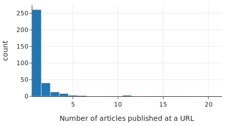

该直方图显示，绝大多数（337 个中的 261 个）网站在训练集中只有一篇文章，只有少数网站在训练集中有超过五篇文章。尽管如此，找出发布最多假新闻或真新闻的网站还是很有参考价值的。首先，我们找出发布假新闻最多的网站：

```python
top_fake_publishers = (
    X_train.assign(label=y_train)
    .query("label == 1")
    ["baseurl"]
    .value_counts()
    .iloc[:10]
    .sort_values()
)

fig = px.bar(
    top_fake_publishers,
    orientation="h", width=550, height=250,
    labels={"value": "Number of articles published at a URL", 
            "index": "Base URL"},
)
fig.update_layout(showlegend=False)
```

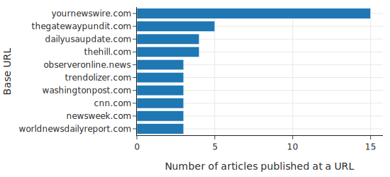

接下来，我们列出发布真实新闻最多的网站：

```python
top_real_publishers = (
    X_train.assign(label=y_train)
    .query("label == 0")
    ["baseurl"]
    .value_counts()
    .iloc[:10]
    .sort_values()
)

fig = px.bar(
    top_real_publishers,
    orientation="h", width=550, height=250,
    labels={"value": "Number of articles published at a URL",
            "index": "Base URL"},
)
fig.update_layout(showlegend=False)
```

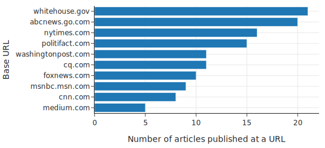

只有 `cnn.com` 同时出现在两个列表中。即使不知道这些网站的文章总数，我们也会预计 `yournewswire.com` 的文章更有可能被标记为虚假，而 `whitehouse.gov` 的文章更有可能被标记为真实。话虽如此，我们并不期望使用发布网站来预测文章的真实性会非常有效；数据集中大多数网站的文章实在太少了。

接下来，让我们探索 `timestamp` 列，它记录了新闻文章的发布日期。

### 17.3.2 探索发布日期 (Exploring Publication Date)

在直方图上绘制时间戳显示，大多数文章是在 2000 年之后发表的，尽管似乎至少有一篇文章是在 1940 年之前发表的：

```python
fig = px.histogram(
    X_train["timestamp"],
    labels={"value": "Publication year"}, width=550, height=250,
)
fig.update_layout(showlegend=False)
```
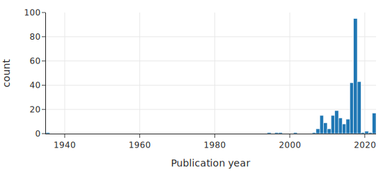

当我们仔细查看 2000 年之前发表的新文章时，发现时间戳与文章的实际发布日期不符。这些日期问题很可能与网络爬虫从网页收集不准确的信息有关。我们可以放大直方图 2000 年之后的区域：

```python
fig = px.histogram(
    X_train.loc[X_train["timestamp"] > "2000", "timestamp"],
    labels={"value": "Publication year"}, width=550, height=250, 
)
fig.update_layout(showlegend=False)
```
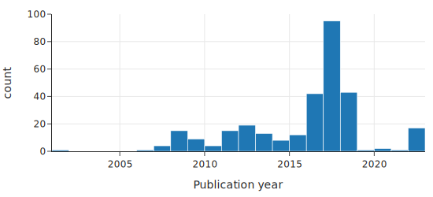

不出所料，大多数文章是在 2007 年（Politifact 成立的那一年）和 2020 年（FakeNewsNet 仓库发布的那一年）之间发表的。但我们还发现，时间戳集中在 2016 年到 2018 年——充满争议的 2016 年美国总统大选年及其随后的两年。这一见解进一步警示我们，不要将我们的分析结果推广到非选举年。

我们的主要目标是使用文本内容进行分类。接下来我们探索一些词频。

### 17.3.3 探索文章中的词 (Exploring Words in Articles)

我们想看看文章中使用的词语与文章被标记为虚假之间是否存在关系。一种简单的方法是查看单个词，如 `military`（军事），然后统计提到“military”的文章中有多少被标记为虚假。为了使 `military` 有用，提及它的文章中虚假文章的比例应该远高于或远低于 45%（数据集中虚假文章的比例：264/584）。

我们可以利用我们的政治话题领域知识来挑选几个候选词进行探索。然后我们定义一个函数为每个词创建一个新特征，如果该词出现在文章中，则特征为 `True`，如果不出现则为 `False`：

```python
def make_word_features(df, words):
    features = { word: df['content'].str.contains(word) for word in words }
    return pd.DataFrame(features)
```

这就像是对单词存在的独热编码（参见第 14 章）。我们可以使用此函数进一步整理数据，并创建一个包含我们每个选定单词特征的新数据框：

```python
df_words = make_word_features(X_train, word_features)
df_words["label"] = df["label"]
df_words.shape
```
输出：
```text
(584, 16)
```

```python
df_words.head(4)
```

| | trump | clinton | state | vote | ... | swamp | cnn | the | label |
|---:|:---|:---|:---|:---|:---|:---|:---|:---|:---|
| 164 | False | False | True | False | ... | False | False | True | 1 |
| 28 | False | False | False | False | ... | False | False | True | 1 |
| 708 | False | False | True | True | ... | False | False | True | 0 |
| 193 | False | False | False | False | ... | False | False | True | 1 |

现在我们可以计算这些被标记为虚假的文章的比例。我们在下图中可视化这些计算结果。在左图中，我们用虚线标记了整个训练集中虚假文章的比例，这有助于我们了解每个词特征的信息量——信息量大的词，其点会远离这条线：

```python
fake_props = (make_word_features(X_train, word_features)
 .assign(label=(y_train == 1))
 .melt(id_vars=['label'], var_name='word', value_name='appeared')
 .query('appeared == True')
 .groupby('word')
 ['label']
 .agg(['mean', 'count'])
 .rename(columns={'mean': 'prop_fake'})
 .sort_values('prop_fake', ascending=False)
 .reset_index()
 .melt(id_vars='word')
)

g = sns.catplot(data=fake_props, x='value', y='word', col='variable',
                s=5, jitter=False, sharex=False, height=3)

[[prop_ax, _]] = g.axes
prop_ax.axvline(0.45, linestyle='--')
prop_ax.set(xlim=(-0.05, 1.05))

titles = ['Proportion of articles marked fake', 'Number of articles with word']

for ax, title in zip(g.axes.flat, titles):
    # Set a different title for each axes
    ax.set(title=title)
    ax.set(xlabel=None)
    ax.set(ylabel=None)
    ax.yaxis.grid(True)
```
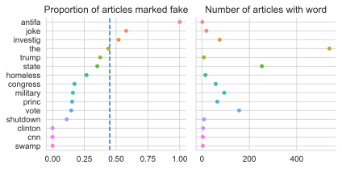

该图揭示了一些有趣的建模考虑因素。例如，注意单词 `antifa` 具有很高的预测性——所有提到单词 `antifa` 的文章都被标记为虚假。然而，`antifa` 只出现在少数几篇文章中。另一方面，单词 `the` 几乎出现在每一篇文章中，但对于区分真假文章没有信息量，因为包含 `the` 的文章中虚假文章的比例与整体虚假文章的比例相匹配。我们最好使用像 `vote` 这样的词，它既具有预测性又出现在许多新闻文章中。

这项探索性分析让我们了解了新闻文章发表的时间范围、数据中涵盖的各种发布网站，以及用于预测的候选词。接下来，我们拟合模型来预测文章是真是假。

## 17.4 建模 (Modeling)

现在我们已经获取、清洗并探索了数据，让我们拟合模型来预测文章是真是假。在本节中，我们使用逻辑回归，因为这是一个二元分类问题。我们拟合三个不同复杂度的模型。首先，我们拟合一个仅使用文档中单个手动选择的词作为解释特征的模型。然后，我们拟合一个使用多个手动选择的词的模型。最后，我们拟合一个使用训练集中所有词的模型，并使用 tf-idf 变换（在第 13 章中介绍）进行向量化。让我们从简单的单词模型开始。

### 17.4.1 单词模型 (A Single-Word Model)

我们的 EDA 表明，单词 `vote` 与文章被标记为真实还是虚假有关。为了测试这一点，我们拟合一个逻辑回归模型，使用单个二元特征：如果单词 `vote` 出现在文章中则为 1，否则为 0。我们首先定义一个将文章内容转换为小写的函数：

```python
def lowercase(df):
    return df.assign(content=df['content'].str.lower())
```

对于我们的第一个分类器，我们只使用单词 `vote`：

```python
one_word = ['vote']
```

我们可以将 `lowercase` 函数和 EDA 中的 `make_word_features` 函数链接到一个 scikit-learn 管道中。这提供了一种方便的方法来一次性转换和拟合数据：

```python
from sklearn.pipeline import make_pipeline
from sklearn.linear_model import LogisticRegressionCV
from sklearn.preprocessing import FunctionTransformer

model1 = make_pipeline(
    FunctionTransformer(lowercase),
    FunctionTransformer(make_word_features, kw_args={'words': one_word}),
    LogisticRegressionCV(Cs=10, solver='saga', n_jobs=4, max_iter=10000),
)
```

使用时，上述管道将文章内容中的字符转换为小写，创建一个包含每个感兴趣单词的二元特征的数据框，并未逻辑回归模型拟合数据，同时使用正则化。此外，`LogisticRegressionCV` 函数使用交叉验证（默认为 5 折）来选择最佳的正则化参数。（有关正则化和交叉验证的更多信息，请参阅第 16 章。）

让我们使用管道来拟合训练数据：

```python
%%time

model1.fit(X_train, y_train)
print(f'{model1.score(X_train, y_train):.1%} accuracy on training set.')
```
输出：
```text
64.9% accuracy on training set.
CPU times: user 110 ms, sys: 42.7 ms, total: 152 ms
Wall time: 144 ms
```
总体而言，单词分类器仅正确分类了 65% 的文章。我们绘制分类器在训练集上的混淆矩阵，看看它犯了什么样的错误：

```python
from sklearn.metrics import ConfusionMatrixDisplay

ConfusionMatrixDisplay.from_estimator(
    model1, X_train, y_train, cmap=plt.cm.Blues, colorbar=False
)
plt.grid(False);
```
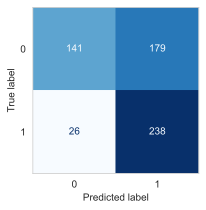

我们的模型经常将真实文章 (0) 误分类为虚假文章 (1)。由于这个模型很简单，我们可以看看这两种情况的概率：单词 `vote` 在文章中或不在文章中：

```python
vote_present = pd.DataFrame({'vote': [1]})
vote_absent = pd.DataFrame({'vote': [0]})

log_reg = model1.named_steps['logisticregressioncv']
print(f'"vote" present: {log_reg.predict_proba(vote_present)}')
print(f'"vote" absent: {log_reg.predict_proba(vote_absent)}')
```
输出：
```text
"vote" present: [[0.72 0.28]]
"vote" absent: [[0.48 0.52]]
```

当一篇文章包含单词 `vote` 时，模型给出的文章为真实的概率很高，而当 `vote` 缺失时，概率略微倾向于文章为虚假。我们鼓励读者使用逻辑回归模型的定义和拟合系数自行验证这一点：

```python
print(f'Intercept: {log_reg.intercept_[0]:.2f}')
[[coef]] = log_reg.coef_
print(f'"vote" Coefficient: {coef:.2f}')
```
输出：
```text
Intercept: 0.08
"vote" Coefficient: -1.00
```

正如我们在第 19 章中看到的，系数表示赔率随解释变量变化而变化的大小。对于像文章中单词存在或不存在这样的 0-1 变量，这具有特别直观的含义。对于一篇包含 `vote` 的文章，其为虚假的赔率减少了 $e^{\text{coef}}$ 倍，即：

```python
np.exp(coef) 
```
输出：
```text
0.36836305405149367
```

!!! note "注意"
    请记住，在这个建模场景中，标签 0 对应于真实文章，标签 1 对应于虚假文章。这可能看起来有点反直觉——我们说“真阳性”是指模型正确预测虚假文章为虚假。在二元分类中，我们通常说“阳性”结果是指存在某种异常情况的结果。例如，检测出某种疾病呈阳性的人会预期患有该疾病。

让我们通过引入更多单词特征使我们的模型更加复杂一些。

### 17.4.2 多词模型 (Multiple-Word Model)

我们创建一个使用我们在训练集 EDA 中检查过的所有单词的模型，除了 `the`。让我们使用这 15 个特征拟合一个模型：

```python
model2 = make_pipeline(
    FunctionTransformer(lowercase),
    FunctionTransformer(make_word_features, kw_args={'words': word_features}),
    LogisticRegressionCV(Cs=10, solver='saga', n_jobs=4, max_iter=10000),
)
```

```python
%%time

model2.fit(X_train, y_train)
print(f'{model2.score(X_train, y_train):.1%} accuracy on training set.')
```
输出：
```text
74.8% accuracy on training set.
CPU times: user 1.54 s, sys: 59.1 ms, total: 1.6 s
Wall time: 637 ms
```

该模型的准确率比单词模型高约 10 个百分点。从单词模型到 15 词模型仅获得 10 个百分点的提升似乎有点令人惊讶。混淆矩阵有助于弄清所犯错误的类型：

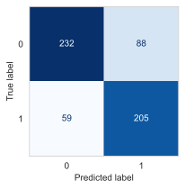

我们可以看到，该分类器在准确分类真实文章方面做得更好。然而，在分类虚假文章时，它比简单的单词模型犯了更多错误——59 篇虚假文章被分类为真实。在这种情况下，我们可能更担心将真实文章误分类为虚假。所以我们希望有高精度——正确预测为虚假文章的数量与预测为虚假文章的总数之比：

```python
model1_precision = 238 / (238 + 179)
model2_precision = 205 / (205 + 88)

[round(num, 2) for num in [model1_precision, model2_precision]]
```
输出：
```text
[0.57, 0.7]
```

我们较大的模型的精度有所提高，但仍有约 30% 被标记为虚假的文章实际上是真实的。让我们看看模型的系数：

```python
log_reg2 = model2.named_steps['logisticregressioncv']
coefs = (pd.DataFrame({'word': word_features, 'coef': log_reg2.coef_[0]})
         .sort_values('coef')
        )
fig = px.scatter(coefs, x='coef', y='word',
                 labels={'coef': 'Model coefficient','word':'Word'},
                 width=350, height=250)
fig.add_vline(x=0, line_width=2, line_dash="dash", opacity=1)
fig
```
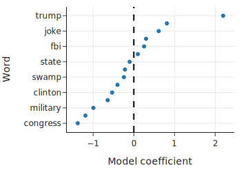

我们可以通过查看符号来快速解释系数。`trump` 和 `investig` 上的大正值表明，模型预测包含这些单词的新文章更有可能为虚假。对于像 `congress` 和 `vote` 这样的词，情况恰恰相反，它们具有负权重。我们可以使用这些系数来比较文章包含或不包含特定单词时的对数赔率。

虽然这个较大的模型比较简单的单词模型表现更好，但我们必须利用我们对新闻的了解手动挑选单词特征。如果我们错过了具有高度预测性的单词怎么办？为了解决这个问题，我们可以使用 tf-idf 变换结合文章中的所有单词。

### 17.4.3 使用 tf-idf 变换进行预测 (Predicting with the tf-idf Transform)

对于第三个也是最后一个模型，我们使用第 13 章中的词频-逆文档频率 (tf-idf) 变换对训练集中所有文章的整个文本进行向量化。回想一下，通过这种变换，一篇文章被转换成一个向量，其中包含 564 篇文章中出现的每个单词的一个元素。该向量由单词在文章中出现的次数的归一化计数组成，并按单词的稀有度进行归一化。tf-idf 将更多权重放在仅出现在少数文档中的单词上。这意味着我们的分类器使用训练集新闻文章中的所有单词进行预测。正如我们在介绍 tf-idf 时所做的那样，首先我们删除停用词，然后对单词进行分词，之后使用 scikit-learn 中的 `TfidfVectorizer`：

```python
tfidf = TfidfVectorizer(tokenizer=stemming_tokenizer, token_pattern=None)
from sklearn.compose import make_column_transformer

model3 = make_pipeline(
    FunctionTransformer(lowercase),
    make_column_transformer((tfidf, 'content')),
    LogisticRegressionCV(Cs=10,
                         solver='saga',
                         n_jobs=8,
                         max_iter=1000),
    verbose=True,
)
```

```python
%%time

model3.fit(X_train, y_train)
print(f'{model3.score(X_train, y_train):.1%} accuracy on training set.')
```
输出：
```text
[Pipeline]  (step 1 of 3) Processing functiontransformer, total=   0.0s
[Pipeline] . (step 2 of 3) Processing columntransformer, total=  14.5s
[Pipeline]  (step 3 of 3) Processing logisticregressioncv, total=   6.3s
100.0% accuracy on training set.
CPU times: user 50.2 s, sys: 508 ms, total: 50.7 s
Wall time: 34.2 s
```

我们发现该模型在训练集上达到了 100% 的准确率。我们可以查看 tf-idf 转换器以更好地理解模型。让我们首先找出分类器使用了多少个唯一 token：

```python
tfidf = model3.named_steps.columntransformer.named_transformers_.tfidfvectorizer
n_unique_tokens = len(tfidf.vocabulary_.keys())
print(f'{n_unique_tokens} tokens appeared across {len(X_train)} examples.')
```
输出：
```text
23800 tokens appeared across 584 examples.
```

这意味着我们的分类器有 23,812 个特征，与之前的模型相比有了大幅增加，之前的模型只有 15 个特征。由于我们无法显示那么多模型权重，我们显示 10 个最负和 10 个最正权重的特征：

```python
log_reg = model3.named_steps.logisticregressioncv
coefs = (pd.DataFrame(tfidf.vocabulary_.keys(),
                      columns=['word'],
                      index=tfidf.vocabulary_.values())
         .sort_index()
         .assign(coef=log_reg.coef_[0])
         .sort_values('coef')
        )
fig1 = px.scatter(coefs[:10][::-1], x='coef', y='word')
fig2 = px.scatter(coefs[-10:], x='coef', y='word')
fig = left_right(fig1, fig2, horizontal_spacing=0.15)
fig.update_xaxes(title='Model coefficient')
fig.update_yaxes(title='Word', row=1, col=1)
```
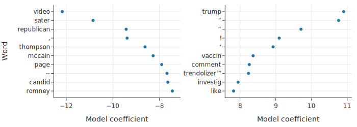

这些系数显示了关于该模型的一些奇怪之处。我们看到几个有影响力的特征对应于原始文本中的标点符号。目前尚不清楚我们是否应该在模型中清除标点符号。一方面，标点符号似乎不像单词那样传达那么多含义。另一方面，似乎有理由认为，例如，文章中的大量感叹号可以帮助模型判断文章是真还是假。在这种情况下，我们决定保留标点符号，但好奇的读者可以在去掉标点符号后重复此分析，看看结果模型会受到怎样的影响。

最后，我们显示所有三个模型的测试集误差：

```python
pd.DataFrame({
    'test set error': [model1.score(X_test, y_test),
                       model2.score(X_test, y_test),
                       model3.score(X_test, y_test)]
}, index=['model1', 'model2', 'model3'])
```

| | test set error |
|---:|:---|
| model1 | 0.61 |
| model2 | 0.70 |
| model3 | 0.88 |

正如我们所预料的那样，随着我们引入更多特征，模型变得更加准确。使用 tf-idf 的模型表现比使用手动选择的二元单词特征的模型好得多，但它没有达到在训练集上获得的 100% 准确率。这说明了建模中的一个常见权衡：如果有足够的数据，更复杂的模型通常可以胜过更简单的模型，尤其是在像本案例研究这样的情况下，更简单的模型具有太多的模型偏差，无法表现良好。然而，复杂的模型更难解释。例如，我们的 tf-idf 模型有超过 20,000 个特征，这使得基本上不可能解释我们的模型是如何做出决策的。此外，tf-idf 模型进行预测所需的时间要长得多——与模型 2 相比慢了 100 多倍。在决定在实践中使用哪种模型时，需要考虑所有这些因素。

此外，我们需要注意我们的模型的用途。在这种情况下，我们的模型使用新闻文章的内容进行预测，使其高度依赖于训练集中出现的单词。然而，我们的模型在未来使用未出现在训练集中的单词的新闻文章上的表现可能不会那么好。例如，我们的模型使用 2016 年美国大选候选人的名字进行预测，但它们不会知道包含 2020 年或 2024 年候选人的名字。为了长期使用我们的模型，我们需要解决这种漂移问题。

尽管如此，令人惊讶的是逻辑回归模型在使用相对少量的特征工程 (tf-idf) 下就能表现良好。我们已经解决了我们最初的研究问题：我们的 tf-idf 模型在检测数据集中的假新闻方面似乎是有效的，并且它有可能推广到训练数据所涵盖的同一时期发布的其他新闻。

## 17.5 总结 (Summary)

我们很快就要结束本章，也就是本书的结尾。我们以讨论数据科学生命周期开始了本书。让我们再次看一下生命周期（图 17.2），以领会你所学到的一切。

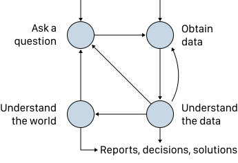
<center>图 17.2：数据科学生命周期的四个高级步骤，我们在整本书中都深入探讨了其中的每一个步骤</center>

本案例研究逐步完成了数据科学生命周期的每个阶段：

许多数据分析始于一个研究问题。我们在本章中介绍的案例研究始于询问我们是否可以创建模型来自动检测假新闻。

我们通过使用在线找到的代码将网页抓取为 JSON 文件来获取数据。由于数据描述相对较少，我们需要清洗数据以理解它。这包括创建新特征来指示文章中是否存在某些单词。

我们的初步探索确定了可能对预测有用的单词。在拟合简单模型并探索其精度和准确率之后，我们使用 tf-idf 进一步转换文章，将每篇新闻文章转换为归一化的单词向量。

我们将向量化的文本用作逻辑回归模型中的特征，并使用正则化和交叉验证拟合了最终模型。最后，我们在测试集上找出了拟合模型的准确率和精度。

当我们像这样写出生命周期的步骤时，这些步骤似乎顺畅地相互衔接。但现实是混乱的——正如生命周期图所示，实际的数据分析会在步骤之间反复跳转。例如，在我们的案例研究结束时，我们发现了一些数据清洗问题，这可能会促使我们重新审视生命周期的早期阶段。虽然我们的模型相当准确，但大部分训练数据来自 2016-2018 年期间，因此如果我们想在这一时间范围之外发表的文章上使用该模型，我们必须仔细评估模型的性能。

本质上，在数据分析的每个阶段都牢记整个生命周期是很重要的。作为一名数据科学家，你将被要求证明你的决定是正确的，这意味着你需要深入了解你的研究问题和数据。为了培养这种理解，本书中的原则和技术为你提供了一套基础技能。当你继续你的数据科学之旅时，我们建议你通过以下方式继续扩展你的技能：

1.  **重温本书中的案例研究**。从复制我们的分析开始，然后深入研究你对数据有的问题。
2.  **进行独立的数据分析**。提出一个你感兴趣的研究问题，从网上找到相关数据，并分析数据以查看数据是否符合你的预期。这样做将让你获得整个数据科学生命周期的第一手经验。
3.  **深入研究一个主题**。我们在附录的补充材料中提供了许多深入的资源。选择你最感兴趣的资源并了解更多信息。

世界需要像你这样能够使用数据得出结论的人，因此我们真诚地希望你能利用这些技能帮助他人制定有效的策略、更好的产品和明智的决策。