# 卷积神经网络CNN

## CNN的原理

### 从DNN到CNN

#### 卷积层与汇聚

- 深度神经网络DNN中，相邻层的所有神经元之间都有连接，这叫全连接；
- DNN的全连接层对应CNN的卷积层，汇聚是与激活函数类似的附件；
- 单个卷积层的结构是：卷积层-激活函数-(汇聚)，其中汇聚可以省略。

#### CNN：专攻多维数据

在深度神经网络 DNN 课程的最后一章，使用 DNN 进行了手写数字的识别。但是，图像至少就有二维，向全连接层输入时，需要多维数据拉平为 1 维数据，这样一来，图像的形状就被忽视了，很多特征是隐藏在空间属性里的。

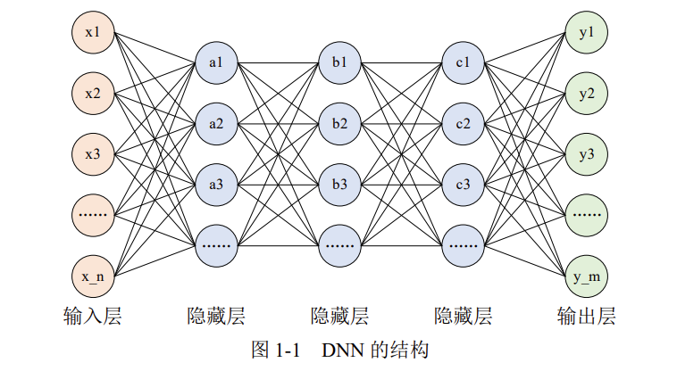

而卷积层可以保持输入数据的维数不变，当输入数据是二维图像时，卷积层会以多维数据的形式接收输入数据，并同样以多维数据的形式输出至下一层，如下图所示。

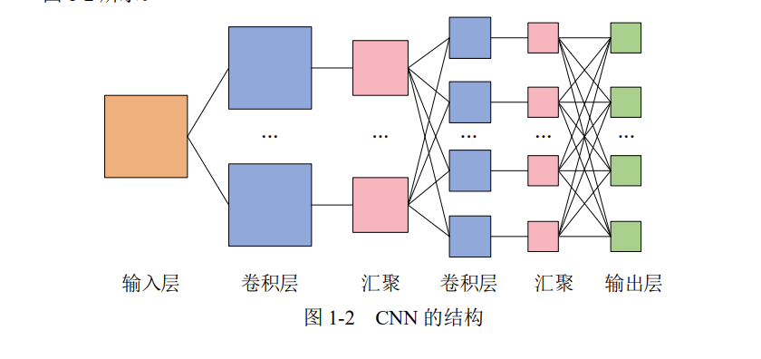

### 卷积层

CNN 中的卷积层与 DNN 中的全连接层是平级关系，全连接层中的权重与偏置即 $y = w_1x_1 + w_2x_2 + w_3x_3 + b$中的$w$和$b$，卷积层中的权重与偏置变得稍微复杂。

#### 内部参数：权重(卷积核)

当输入数据进入卷积层后，输入数据会与卷积核进行卷积运算。

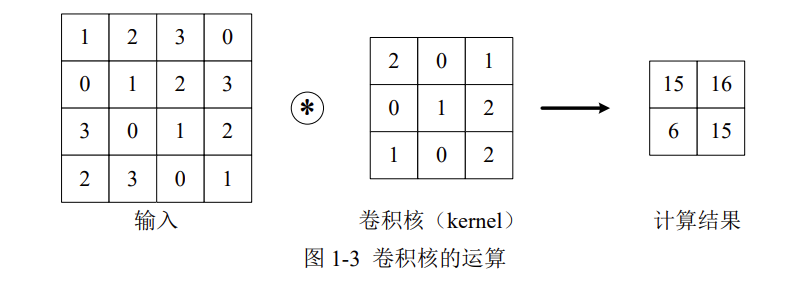

上图中，输入大小是(4,4)，卷积核大小是(3,3)，输出大小是(2,2)。卷积运算的原理是逐元素乘积后再相加。

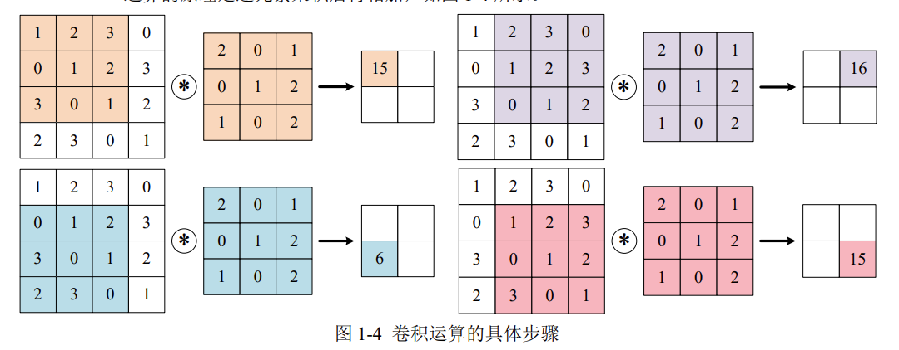

#### 内部参数：偏置

在卷积运算的过程中也存在偏置，如下图所示。

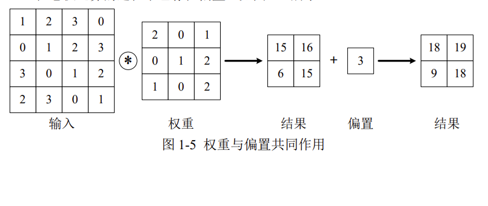

#### 外部参数：填充

为了防止经过多个卷积核后图像越卷越小，可以在进行卷积层的处理之前，向输入数据的周围填入固定的数据（比如0），这称为填充（padding）。

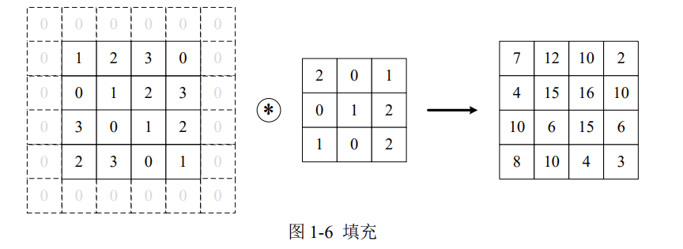

例如，上图中对于输入数据应用了幅度为1的填充，填充值为0。

#### 外部参数：步幅

使用卷积核的位置间隔被称为步幅（stride），之前的例子中步幅都是1，如果将步幅设为2，此时使用卷积核的窗口的间隔变为了2。

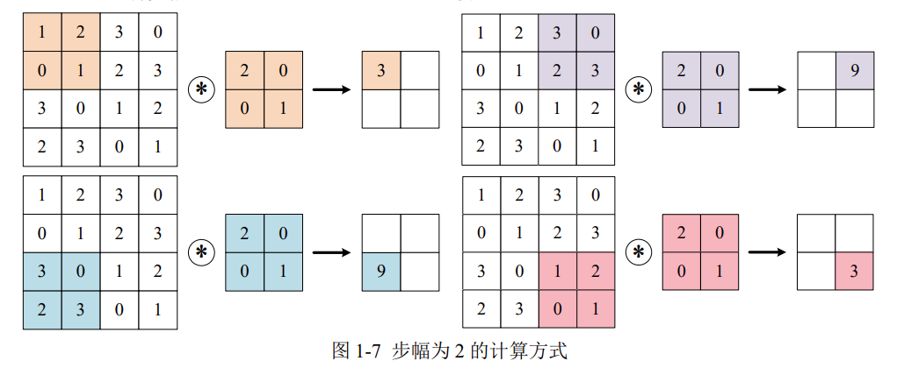

综上，增大填充后，输出尺寸会变大；而增大步幅后，输出尺寸会变小。

#### 输入与输出尺寸的关系

假设输入尺寸为$(H, W)$，卷积核的尺寸为$(FH, FW)$，填充为 $P$，步幅为 $S$。则输出尺寸$(OH, OW)$的计算公式为

$$
\begin{cases}
OH = \frac{H + 2P - FH}{S} + 1 \\[10pt]
OW = \frac{W + 2P - FW}{S} + 1
\end{cases}
$$

### 多通道

在上一小节讲的卷积层，仅仅针对二维的输入与输出数据（一般是灰度图像），可称之为单通道。但是，彩色图像除了高、长两个维度之外，还有第三个维度：通道（channel）。例如，以 RGB 三原色为基础的彩色图像，其通道方向就有红、黄、蓝三部分，可视为 3 个单通道二维图像的混合叠加。

一般的，当输入数据是二维时，权重被称为卷积核（Kernel）；当输入数据是三维或更高时，权重被称为滤波器（Filter）。

#### 多通道输入

对三位数据的卷积操作如下图所示，输入数据与滤波器的通道数必须要设为相同的值，可以发现，这种情况下的输出结果降级为二维。

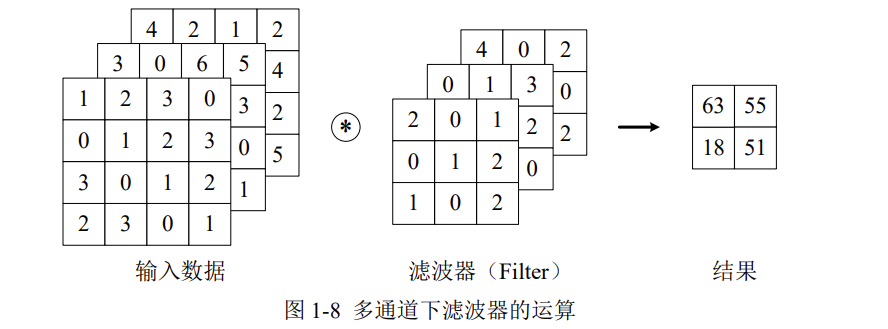

将数据和滤波器看作长方体，如下图所示：

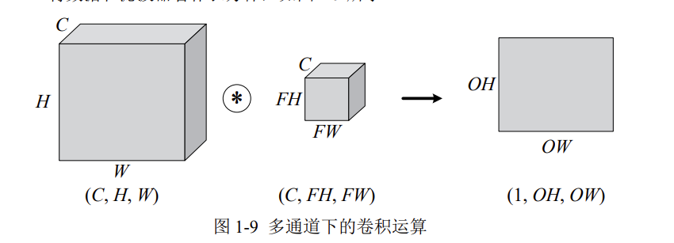

C、H、W是固定的顺序，通道数要写在高与宽的前面。

#### 多通道输出

上文，仅通过一个卷积层，三维就被降成了二维。大多数时候我们想让三维的特征多经过几个卷积层，因此就需要多通道输出。

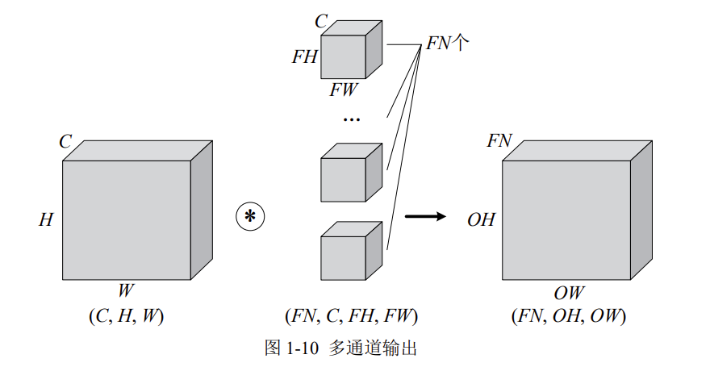

当然，卷积运算中存在偏置，如果进一步追加偏置的加法运算处理，则结果如下图所示，每个通道都有一个单独的偏置。

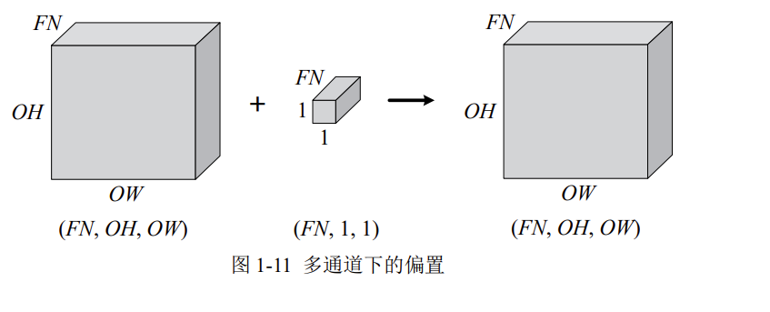

### 汇聚

汇聚（Pooling）仅仅是从一定范围内提取一个特征值，所以不存在要学习的内部参数。一般有平均汇聚与最大值汇聚。

#### 平均汇聚

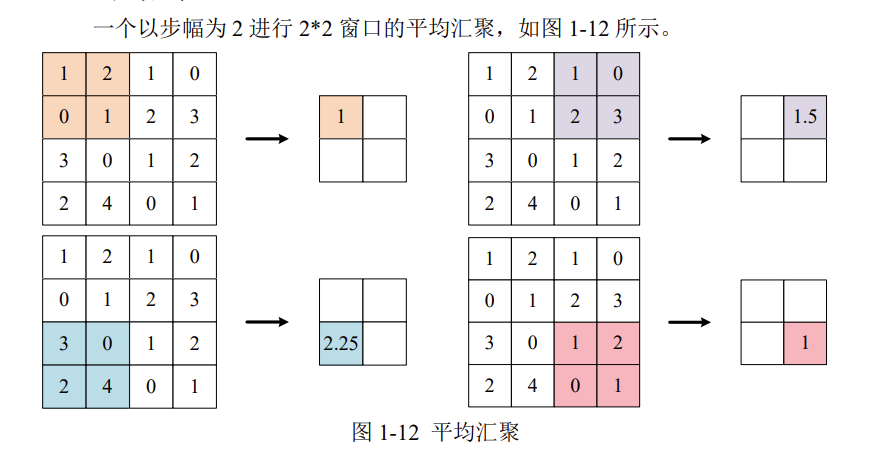

#### 最大值汇聚

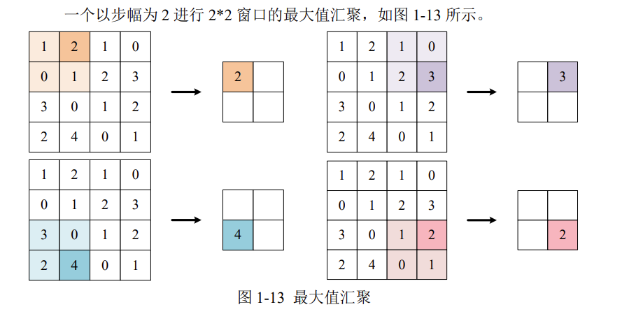

汇聚对图像的高H和宽W进行特征提取，不改变通道数C。

### 尺寸变换总结

#### 卷积层

现在假设卷积层的填充为P，步幅为S，由

- 输入数据的尺寸是：(C,H,W)
- 滤波器的尺寸是：(FN,C,FH,FW)
- 输出数据的尺寸是：(FN,OH,OW)

可得：

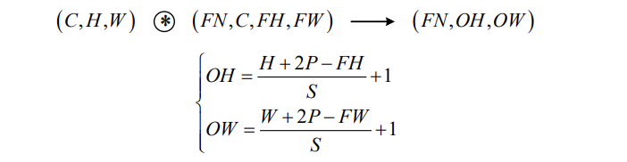

#### 汇聚

现在假设汇聚的步幅为S，由

- 输入数据的尺寸是：(C,H,W)
- 输出数据的尺寸是：(C,OH,OW)

可得：
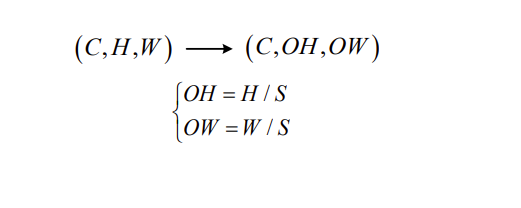

注意这里公式感觉有点问题，图片中的公式是在以下特殊条件下才成立：

- 池化窗口大小 = 步幅（即 FH = FW = S）
- 没有填充（P = 0）
- 输入尺寸能被步幅整除

## LeNet-5

### 网格结构

LeNet-5 虽诞生于 1998 年，但基于它的手写数字识别系统则非常成功。

该网络共 7 层，输入图像尺寸为 28×28，输出则是 10 个神经元，分别表示某手写数字是 0 至 9 的概率。

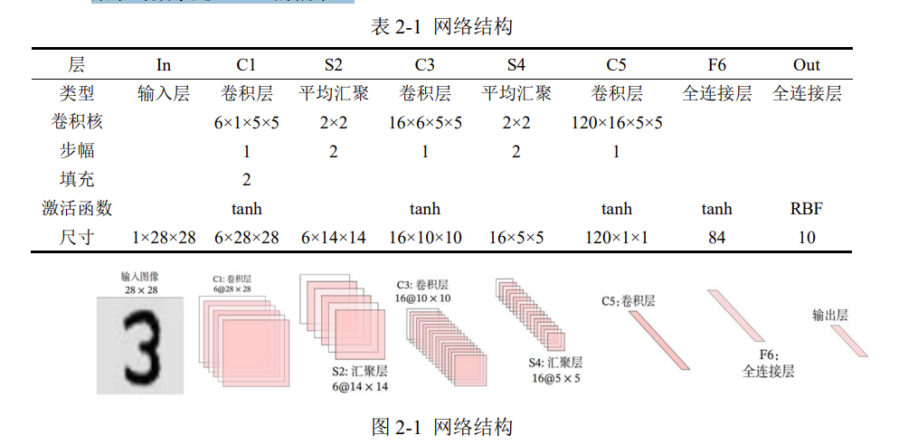

注：输出层由 10 个径向基函数 RBF 组成，用于归一化最终的结果，目前 RBF 已被 Softmax 取代。

根据网络结构，在 PyTorch 的 nn.Sequential 中编写为：

```python
self.net = nn.Sequential(
    nn.Conv2d(1, 6, kernel_size=5, padding=2), nn.Tanh(), # C1：卷积层
    nn.AvgPool2d(kernel_size=2, stride=2), # S2：平均汇聚
    nn.Conv2d(6, 16, kernel_size=5), nn.Tanh(), # C3：卷积层
    nn.AvgPool2d(kernel_size=2, stride=2), # S4：平均汇聚
    nn.Conv2d(16, 120, kernel_size=5), nn.Tanh(), # C5：卷积层
    nn.Flatten(), # 把图像铺平成一维
    nn.Linear(120, 84), nn.Tanh(), # F5：全连接层
    nn.Linear(84, 10) # F6：全连接层
)

```

其中，`nn.Conv2d()`需要四个参数，分别为

- in_channel：此层输入图像的通道数；
- out_channel：此层输出图像的通道数；
- kernel_size：卷积核尺寸；
- padding：填充；
- stride：步幅。

```python
import torch
import torch.nn as nn
from torch.utils.data import DataLoader
from torchvision import transforms
from torchvision import datasets
import matplotlib.pyplot as plt
%matplotlib inline
```

```python
# 展示高清图
from matplotlib_inline import backend_inline
backend_inline.set_matplotlib_formats('svg')
```

```python
# 制作数据集
# 数据集转换参数
transform = transforms.Compose([
    transforms.ToTensor(),
    transforms.Normalize(0.1307, 0.3081)
])
# 下载训练集与测试集
train_Data = datasets.MNIST(
    root = '/kaggle/working/dataset/mnist/', # 下载路径
    train = True, # 是 train 集
    download = True, # 如果该路径没有该数据集，就下载
    transform = transform # 数据集转换参数
)
test_Data = datasets.MNIST(
    root = '/kaggle/working/dataset/mnist/', # 下载路径
    train = False, # 是 test 集
    download = True, # 如果该路径没有该数据集，就下载
    transform = transform # 数据集转换参数
)

```

    100%|██████████| 9.91M/9.91M [00:00<00:00, 41.1MB/s]
    100%|██████████| 28.9k/28.9k [00:00<00:00, 1.15MB/s]
    100%|██████████| 1.65M/1.65M [00:00<00:00, 9.86MB/s]
    100%|██████████| 4.54k/4.54k [00:00<00:00, 14.0MB/s]

```python
# 批次加载器
train_loader = DataLoader(train_Data, shuffle=True, batch_size=256)
test_loader = DataLoader(test_Data, shuffle=False, batch_size=256)

```

### 搭建神经网络

```python
class CNN(nn.Module):
    def __init__(self):
        super(CNN,self).__init__()
        self.net = nn.Sequential(
            nn.Conv2d(1, 6, kernel_size=5, padding=2), nn.Tanh(),
            nn.AvgPool2d(kernel_size=2, stride=2),
            nn.Conv2d(6, 16, kernel_size=5), nn.Tanh(),
            nn.AvgPool2d(kernel_size=2, stride=2),
            nn.Conv2d(16, 120, kernel_size=5), nn.Tanh(),
            nn.Flatten(),
            nn.Linear(120, 84), nn.Tanh(),
            nn.Linear(84, 10)
        )
    def forward(self, x):
        y = self.net(x)
        return y
```

```python
# 查看网络结构
X = torch.rand(size= (1, 1, 28, 28))
for layer in CNN().net:
    X = layer(X)
    print( layer.__class__.__name__, 'output shape: \t', X.shape )

```

    Conv2d output shape: 	 torch.Size([1, 6, 28, 28])
    Tanh output shape: 	 torch.Size([1, 6, 28, 28])
    AvgPool2d output shape: 	 torch.Size([1, 6, 14, 14])
    Conv2d output shape: 	 torch.Size([1, 16, 10, 10])
    Tanh output shape: 	 torch.Size([1, 16, 10, 10])
    AvgPool2d output shape: 	 torch.Size([1, 16, 5, 5])
    Conv2d output shape: 	 torch.Size([1, 120, 1, 1])
    Tanh output shape: 	 torch.Size([1, 120, 1, 1])
    Flatten output shape: 	 torch.Size([1, 120])
    Linear output shape: 	 torch.Size([1, 84])
    Tanh output shape: 	 torch.Size([1, 84])
    Linear output shape: 	 torch.Size([1, 10])

```python
# 创建子类的实例，并搬到 GPU 上
model = CNN().to('cuda:0')

```

```python
# 损失函数的选择
loss_fn = nn.CrossEntropyLoss() # 自带 softmax 激活函数
```

```python
# 优化算法的选择
learning_rate = 0.9 # 设置学习率
optimizer = torch.optim.SGD(
    model.parameters(),
    lr = learning_rate,
)

```

```python
# 训练网络
epochs = 5
losses = [] # 记录损失函数变化的列表
for epoch in range(epochs):
    for (x, y) in train_loader: # 获取小批次的 x 与 y
        x, y = x.to('cuda:0'), y.to('cuda:0')
        Pred = model(x) # 一次前向传播（小批量）
        loss = loss_fn(Pred, y) # 计算损失函数
        losses.append(loss.item()) # 记录损失函数的变化
        optimizer.zero_grad() # 清理上一轮滞留的梯度
        loss.backward() # 一次反向传播
        optimizer.step() # 优化内部参数
Fig = plt.figure()
plt.plot(range(len(losses)), losses)
plt.show()

```

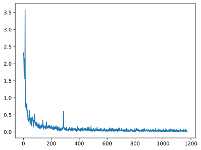

```python
# 测试网络
correct = 0
total = 0
with torch.no_grad(): # 该局部关闭梯度计算功能
    for (x, y) in test_loader: # 获取小批次的 x 与 y
        x, y = x.to('cuda:0'), y.to('cuda:0')
        Pred = model(x) # 一次前向传播（小批量）
        _, predicted = torch.max(Pred.data, dim=1)
        correct += torch.sum( (predicted == y) )
        total += y.size(0)
print(f'测试集精准度: {100*correct/total} %')
```

    测试集精准度: 98.5199966430664 %

## AlexNet

### 网格结构

AlexNet 是第一个现代深度卷积网络模型，其首次使用了很多现代网络的技术方法，作为 2012 年 ImageNet 图像分类竞赛冠军，输入为 3×224×224 的图像，输出为 1000 个类别的条件概率。

考虑到如果使用 ImageNet 训练集会导致训练时间过长，这里使用稍低一档的 1×28×28 的 MNIST 数据集，并手动将其分辨率从 1×28×28 提到 1×224×224，同时输出从 1000 个类别降到 10 个，修改后的网络结构见表 3-1。

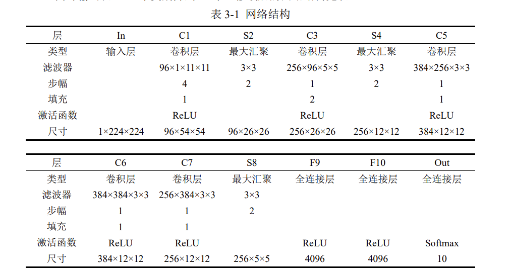

根据网络结构，在 PyTorch 的 nn.Sequential 中编写为

```python
self.net = nn.Sequential(
    nn.Conv2d(1, 96, kernel_size=11, stride=4, padding=1), nn.ReLU(),
    nn.MaxPool2d(kernel_size=3, stride=2),
    nn.Conv2d(96, 256, kernel_size=5, padding=2), nn.ReLU(),
    nn.MaxPool2d(kernel_size=3, stride=2),
    nn.Conv2d(256, 384, kernel_size=3, padding=1), nn.ReLU(),
    nn.Conv2d(384, 384, kernel_size=3, padding=1), nn.ReLU(),
    nn.Conv2d(384, 256, kernel_size=3, padding=1), nn.ReLU(),
    nn.MaxPool2d(kernel_size=3, stride=2),
    nn.Flatten(),
    nn.Linear(6400, 4096), nn.ReLU(),
    nn.Dropout(p=0.5), # Dropout——随机丢弃权重
    nn.Linear(4096, 4096), nn.ReLU(),
    nn.Dropout(p=0.5), # 按概率 p 随机丢弃突触
    nn.Linear(4096, 10)
)

```

```python
# 制作数据集
# 数据集转换参数
transform = transforms.Compose([
    transforms.ToTensor(),
    transforms.Resize(224),
    transforms.Normalize(0.1307, 0.3081)
])
# 下载训练集与测试集
train_Data = datasets.FashionMNIST(
    root = '/kaggle/working/dataset/mnist/',
    train = True,
    download = True,
    transform = transform
)
test_Data = datasets.FashionMNIST(
    root = '/kaggle/working/dataset/mnist/',
    train = False,
    download = True,
    transform = transform
)
```

```python
# 批次加载器
train_loader = DataLoader(train_Data, shuffle=True, batch_size=128)
test_loader = DataLoader(test_Data, shuffle=False, batch_size=128)

```

```python
class CNN(nn.Module):
    def __init__(self):
        super(CNN,self).__init__()
        self.net = nn.Sequential(
            nn.Conv2d(1, 96, kernel_size=11, stride=4, padding=1),
            nn.ReLU(),
            nn.MaxPool2d(kernel_size=3, stride=2),
            nn.Conv2d(96, 256, kernel_size=5, padding=2),
            nn.ReLU(),
            nn.MaxPool2d(kernel_size=3, stride=2),
            nn.Conv2d(256, 384, kernel_size=3, padding=1),
            nn.ReLU(),
            nn.Conv2d(384, 384, kernel_size=3, padding=1),
            nn.ReLU(),
            nn.Conv2d(384, 256, kernel_size=3, padding=1),
            nn.ReLU(),
            nn.MaxPool2d(kernel_size=3, stride=2),
            nn.Flatten(),
            nn.Linear(6400, 4096), nn.ReLU(),
            nn.Dropout(p=0.5),
            nn.Linear(4096, 4096), nn.ReLU(),
            nn.Dropout(p=0.5),
            nn.Linear(4096, 10)
        )
    def forward(self, x):
        y = self.net(x)
        return y
```

```python
# 查看网络结构
X = torch.rand(size= (1, 1, 224, 224))
for layer in CNN().net:
    X = layer(X)
    print( layer.__class__.__name__, 'output shape: \t', X.shape )

```

    Conv2d output shape: 	 torch.Size([1, 96, 54, 54])
    ReLU output shape: 	 torch.Size([1, 96, 54, 54])
    MaxPool2d output shape: 	 torch.Size([1, 96, 26, 26])
    Conv2d output shape: 	 torch.Size([1, 256, 26, 26])
    ReLU output shape: 	 torch.Size([1, 256, 26, 26])
    MaxPool2d output shape: 	 torch.Size([1, 256, 12, 12])
    Conv2d output shape: 	 torch.Size([1, 384, 12, 12])
    ReLU output shape: 	 torch.Size([1, 384, 12, 12])
    Conv2d output shape: 	 torch.Size([1, 384, 12, 12])
    ReLU output shape: 	 torch.Size([1, 384, 12, 12])
    Conv2d output shape: 	 torch.Size([1, 256, 12, 12])
    ReLU output shape: 	 torch.Size([1, 256, 12, 12])
    MaxPool2d output shape: 	 torch.Size([1, 256, 5, 5])
    Flatten output shape: 	 torch.Size([1, 6400])
    Linear output shape: 	 torch.Size([1, 4096])
    ReLU output shape: 	 torch.Size([1, 4096])
    Dropout output shape: 	 torch.Size([1, 4096])
    Linear output shape: 	 torch.Size([1, 4096])
    ReLU output shape: 	 torch.Size([1, 4096])
    Dropout output shape: 	 torch.Size([1, 4096])
    Linear output shape: 	 torch.Size([1, 10])

```python
# 创建子类的实例，并搬到 GPU 上
model = CNN().to('cuda:0')

```

```python
# 损失函数的选择
loss_fn = nn.CrossEntropyLoss() # 自带 softmax 激活函数
```

```python
# 优化算法的选择
learning_rate = 0.1 # 设置学习率
optimizer = torch.optim.SGD(
    model.parameters(),
    lr = learning_rate,
)

```

```python
# 训练网络
epochs = 10
losses = [] # 记录损失函数变化的列表
for epoch in range(epochs):
    for (x, y) in train_loader: # 获取小批次的 x 与 y
        x, y = x.to('cuda:0'), y.to('cuda:0')
        Pred = model(x) # 一次前向传播（小批量）
        loss = loss_fn(Pred, y) # 计算损失函数
        losses.append(loss.item()) # 记录损失函数的变化
        optimizer.zero_grad() # 清理上一轮滞留的梯度
        loss.backward() # 一次反向传播
        optimizer.step() # 优化内部参数
Fig = plt.figure()
plt.plot(range(len(losses)), losses)
plt.show()
```

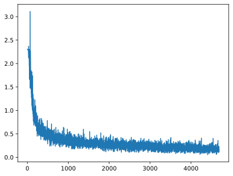

```python
# 测试网络
correct = 0
total = 0
with torch.no_grad(): # 该局部关闭梯度计算功能
    for (x, y) in test_loader: # 获取小批次的 x 与 y
        x, y = x.to('cuda:0'), y.to('cuda:0')
        Pred = model(x) # 一次前向传播（小批量）
        _, predicted = torch.max(Pred.data, dim=1)
        correct += torch.sum( (predicted == y) )
        total += y.size(0)
print(f'测试集精准度: {100*correct/total} %')

```

    测试集精准度: 91.22000122070312 %

## GoogLeNet

### 网格结构

2014 年，获得 ImageNet 图像分类竞赛的冠军是 GoogLeNet，其解决了一个重要问题：滤波器超参数选择困难，如何能够自动找到最佳的情况。

其在网络中引入了一个小网络——Inception 块，**由 4 条并行路径组成**，4 条路径互不干扰。这样一来，**超参数最好的分支的那条分支**，其权重会在训练过程中不断增加，这就类似于帮我们挑选最佳的超参数，如示例所示。

```python
# 一个 Inception 块
class Inception(nn.Module):
    def __init__(self, in_channels):
        super(Inception, self).__init__()
        self.branch1 = nn.Conv2d(in_channels, 16, kernel_size=1)
        self.branch2 = nn.Sequential(
            nn.Conv2d(in_channels, 16, kernel_size=1),
            nn.Conv2d(16, 24, kernel_size=3, padding=1),
            nn.Conv2d(24, 24, kernel_size=3, padding=1)
        )
        self.branch3 = nn.Sequential(
            nn.Conv2d(in_channels, 16, kernel_size=1),
            nn.Conv2d(16, 24, kernel_size=5, padding=2)
        )
        self.branch4 = nn.Conv2d(in_channels, 24, kernel_size=1)
    def forward(self, x):
        branch1 = self.branch1(x)
        branch2 = self.branch2(x)
        branch3 = self.branch3(x)
        branch4 = self.branch4(x)
        outputs = [branch1, branch2, branch3, branch4]
        return torch.cat(outputs, 1)
```

此外，分支 2 和分支 3 上增加了额外 1×1 的滤波器，这是为了减少通道数，降低模型复杂度。
GoogLeNet 之所以叫 GoogLeNet，是为了向 LeNet 致敬，其网络结构为

```python
class CNN(nn.Module):
    def __init__(self):
        super(CNN, self).__init__()
        self.net = nn.Sequential(
            nn.Conv2d(1, 10, kernel_size=5), nn.ReLU(),
            nn.MaxPool2d(kernel_size=2, stride=2),
            Inception(in_channels=10),
            nn.Conv2d(88, 20, kernel_size=5), nn.ReLU(),
            nn.MaxPool2d(kernel_size=2, stride=2),
            Inception(in_channels=20),
            nn.Flatten(),
            nn.Linear(1408, 10)
        )

    def forward(self, x):
        y = self.net(x)
        return y

```

```python
# 制作数据集
# 数据集转换参数
transform = transforms.Compose([
    transforms.ToTensor(),
    transforms.Normalize(0.1307, 0.3081)
])
# 下载训练集与测试集
train_Data = datasets.FashionMNIST(
    root = '/kaggle/working/dataset/mnist/',
    train = True,
    download = True,
    transform = transform
)
test_Data = datasets.FashionMNIST(
    root = '/kaggle/working/dataset/mnist/',
    train = False,
    download = True,
    transform = transform
)
```

```python
# 批次加载器
train_loader = DataLoader(train_Data, shuffle=True, batch_size=128)
test_loader = DataLoader(test_Data, shuffle=False, batch_size=128)

```

```python
# 一个 Inception 块
class Inception(nn.Module):
    def __init__(self, in_channels):
        super(Inception, self).__init__()
        self.branch1 = nn.Conv2d(in_channels, 16, kernel_size=1)
        self.branch2 = nn.Sequential(
            nn.Conv2d(in_channels, 16, kernel_size=1),
            nn.Conv2d(16, 24, kernel_size=3, padding=1),
            nn.Conv2d(24, 24, kernel_size=3, padding=1)
        )
        self.branch3 = nn.Sequential(
            nn.Conv2d(in_channels, 16, kernel_size=1),
            nn.Conv2d(16, 24, kernel_size=5, padding=2)
        )
        self.branch4 = nn.Conv2d(in_channels, 24, kernel_size=1)
    def forward(self, x):
        branch1 = self.branch1(x)
        branch2 = self.branch2(x)
        branch3 = self.branch3(x)
        branch4 = self.branch4(x)
        outputs = [branch1, branch2, branch3, branch4]
        return torch.cat(outputs, 1)

```

```python
class CNN(nn.Module):
    def __init__(self):
        super(CNN, self).__init__()
        self.net = nn.Sequential(
            nn.Conv2d(1, 10, kernel_size=5), nn.ReLU(),
            nn.MaxPool2d(kernel_size=2, stride=2),
            Inception(in_channels=10),
            nn.Conv2d(88, 20, kernel_size=5), nn.ReLU(),
            nn.MaxPool2d(kernel_size=2, stride=2),
            Inception(in_channels=20),
            nn.Flatten(),
            nn.Linear(1408, 10)
        )

    def forward(self, x):
        y = self.net(x)
        return y

```

```python
 # 查看网络结构
X = torch.rand(size= (1, 1, 28, 28))
for layer in CNN().net:
    X = layer(X)
    print( layer.__class__.__name__, 'output shape: \t', X.shape )
```

    Conv2d output shape: 	 torch.Size([1, 10, 24, 24])
    ReLU output shape: 	 torch.Size([1, 10, 24, 24])
    MaxPool2d output shape: 	 torch.Size([1, 10, 12, 12])
    Inception output shape: 	 torch.Size([1, 88, 12, 12])
    Conv2d output shape: 	 torch.Size([1, 20, 8, 8])
    ReLU output shape: 	 torch.Size([1, 20, 8, 8])
    MaxPool2d output shape: 	 torch.Size([1, 20, 4, 4])
    Inception output shape: 	 torch.Size([1, 88, 4, 4])
    Flatten output shape: 	 torch.Size([1, 1408])
    Linear output shape: 	 torch.Size([1, 10])

```python
# 创建子类的实例，并搬到 GPU 上
model = CNN().to('cuda:0')
```

```python
# 损失函数的选择
loss_fn = nn.CrossEntropyLoss()
```

```python
# 优化算法的选择
learning_rate = 0.1 # 设置学习率
optimizer = torch.optim.SGD(
    model.parameters(),
    lr = learning_rate,
)
```

```python
# 训练网络
epochs = 10
losses = [] # 记录损失函数变化的列表
for epoch in range(epochs):
    for (x, y) in train_loader: # 获取小批次的 x 与 y
        x, y = x.to('cuda:0'), y.to('cuda:0')
        Pred = model(x) # 一次前向传播（小批量）
        loss = loss_fn(Pred, y) # 计算损失函数
        losses.append(loss.item()) # 记录损失函数的变化
        optimizer.zero_grad() # 清理上一轮滞留的梯度
        loss.backward() # 一次反向传播
        optimizer.step() # 优化内部参数
Fig = plt.figure()
plt.plot(range(len(losses)), losses)
plt.show()

```

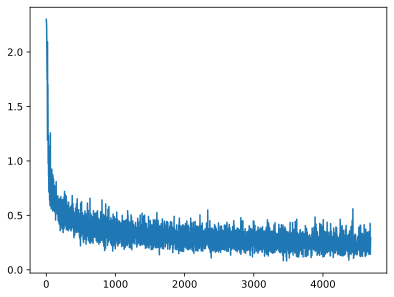

```python
# 测试网络
correct = 0
total = 0
with torch.no_grad(): # 该局部关闭梯度计算功能
    for (x, y) in test_loader: # 获取小批次的 x 与 y
        x, y = x.to('cuda:0'), y.to('cuda:0')
        Pred = model(x) # 一次前向传播（小批量）
        _, predicted = torch.max(Pred.data, dim=1)
        correct += torch.sum( (predicted == y) )
        total += y.size(0)
print(f'测试集精准度: {100*correct/total} %')
```

    测试集精准度: 89.58999633789062 %

## ResNet

### 网格结构

残差网络（Residual Network，ResNet）荣获 2015 年的 ImageNet 图像分类竞赛冠军，其可以缓解深度神经网络中增加深度带来的“梯度消失”问题。

在反向传播计算梯度时，梯度是不断相乘的，假如训练到后期，各层的梯度均小于 1，则其相乘起来就会不断趋于 0。因此，深度学习的隐藏层并非越多越好，隐藏层越深，梯度越趋于 0，此之谓“梯度消失”。

而残差块将某模块的输入 x 引到输出 y 处，使原本的梯度$dy/dx$变成了$(dy + dx) / dx$，也即$(dy / dx + 1)，$这样一来梯度就不会消失了。

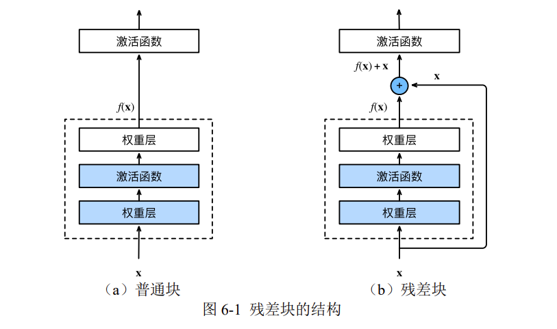

```python
# 制作数据集
# 数据集转换参数
transform = transforms.Compose([
    transforms.ToTensor(),
    transforms.Normalize(0.1307, 0.3081)
])
# 下载训练集与测试集
train_Data = datasets.FashionMNIST(
    root = '/kaggle/working/dataset/mnist/',
    train = True,
    download = True,
    transform = transform
)
test_Data = datasets.FashionMNIST(
    root = '/kaggle/working/dataset/mnist/',
    train = False,
    download = True,
    transform = transform
)
```

```python
# 批次加载器
train_loader = DataLoader(train_Data, shuffle=True, batch_size=128)
test_loader = DataLoader(test_Data, shuffle=False, batch_size=128)

```

```python
# 残差块
class ResidualBlock(nn.Module):
    def __init__(self, channels):
        super(ResidualBlock, self).__init__()
        self.net = nn.Sequential(
            nn.Conv2d(channels, channels, kernel_size=3, padding=1),
            nn.ReLU(),
            nn.Conv2d(channels, channels, kernel_size=3, padding=1),
        )
    def forward(self, x):
        y = self.net(x)
        return nn.functional.relu(x+y)

```

```python
class CNN(nn.Module):
    def __init__(self):
        super(CNN, self).__init__()
        self.net = nn.Sequential(
            nn.Conv2d(1, 16, kernel_size=5), nn.ReLU(),
            nn.MaxPool2d(2), ResidualBlock(16),
            nn.Conv2d(16, 32, kernel_size=5), nn.ReLU(),
            nn.MaxPool2d(2), ResidualBlock(32),
            nn.Flatten(),
            nn.Linear(512, 10)
    )
    def forward(self, x):
        y = self.net(x)
        return y
```

```python
# 查看网络结构
X = torch.rand(size= (1, 1, 28, 28))
for layer in CNN().net:
    X = layer(X)
    print( layer.__class__.__name__, 'output shape: \t', X.shape )
```

    Conv2d output shape: 	 torch.Size([1, 16, 24, 24])
    ReLU output shape: 	 torch.Size([1, 16, 24, 24])
    MaxPool2d output shape: 	 torch.Size([1, 16, 12, 12])
    ResidualBlock output shape: 	 torch.Size([1, 16, 12, 12])
    Conv2d output shape: 	 torch.Size([1, 32, 8, 8])
    ReLU output shape: 	 torch.Size([1, 32, 8, 8])
    MaxPool2d output shape: 	 torch.Size([1, 32, 4, 4])
    ResidualBlock output shape: 	 torch.Size([1, 32, 4, 4])
    Flatten output shape: 	 torch.Size([1, 512])
    Linear output shape: 	 torch.Size([1, 10])

```python
# 创建子类的实例，并搬到 GPU 上
model = CNN().to('cuda:0')

```

```python
# 损失函数的选择
loss_fn = nn.CrossEntropyLoss()

```

```python
# 优化算法的选择
learning_rate = 0.1 # 设置学习率
optimizer = torch.optim.SGD(
    model.parameters(),
    lr = learning_rate,
)

```

```python
# 训练网络
epochs = 10
losses = [] # 记录损失函数变化的列表
for epoch in range(epochs):
    for (x, y) in train_loader: # 获取小批次的 x 与 y
        x, y = x.to('cuda:0'), y.to('cuda:0')
        Pred = model(x) # 一次前向传播（小批量）
        loss = loss_fn(Pred, y) # 计算损失函数
        losses.append(loss.item()) # 记录损失函数的变化
        optimizer.zero_grad() # 清理上一轮滞留的梯度
        loss.backward() # 一次反向传播
        optimizer.step() # 优化内部参数
Fig = plt.figure()
plt.plot(range(len(losses)), losses)
plt.show()

```

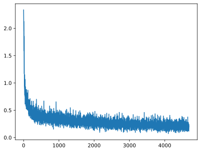

```python
# 测试网络
correct = 0
total = 0
with torch.no_grad(): # 该局部关闭梯度计算功能
    for (x, y) in test_loader: # 获取小批次的 x 与 y
        x, y = x.to('cuda:0'), y.to('cuda:0')
        Pred = model(x) # 一次前向传播（小批量）
        _, predicted = torch.max(Pred.data, dim=1)
        correct += torch.sum( (predicted == y) )
        total += y.size(0)
print(f'测试集精准度: {100*correct/total} %')

```

    测试集精准度: 90.04000091552734 %
