# 深度神经网络DNN

笔者这里采用了Kaggle提供的Tesla T4 GPU进行实验，不知道怎么的P100好像有些问题。

## 张量

### 数组与张量

PyTorch 作为当前首屈一指的深度学习库，其将 NumPy 数组的语法尽数吸收，作为自己处理张量的基本语法，且运算速度从使用 CPU 的数组进步到使用 GPU 的张量。

NumPy 和 PyTorch 的基础语法几乎一致，具体表现为：

- np 对应 torch；
- 数组 array 对应张量 tensor；
- NumPy 的 n 维数组对应着 PyTorch 的 n 阶张量。

数组与张量之间可以相互转换：

- 数组 arr 转为张量 ts：ts = torch.tensor(arr)；
- 张量 ts 转为数组 arr：arr = np.array(ts)。

### 从数组到张量

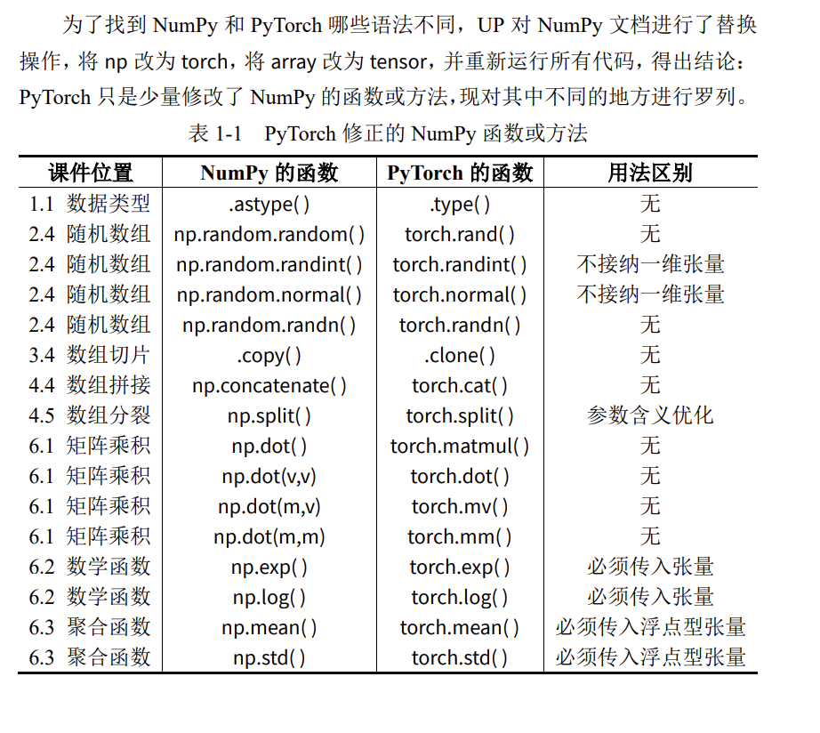

### 用GPU存储张量

默认的张量使用CPU存储，可将其搬至GPU上，如示例所示。

```python
import torch

# 当前安装的 PyTorch 库的版本
print(torch.__version__)
# 检查 CUDA 是否可用，即你的系统有 NVIDIA 的 GPU
print(torch.cuda.is_available())
```

    2.10.0+cu128
    True

```python
import torch
```

```python
# 默认的张量存储在 CPU 上
ts1 = torch.randn(3,4)
ts1
```

    tensor([[ 1.0451,  0.7278,  0.1172, -1.0837],
            [-0.7429,  0.2020,  1.0175, -0.1040],
            [-0.0934,  0.2989,  0.2251,  0.7403]])

```python
# 移动到 GPU 上
ts2 = ts1.to('cuda:0') # 第一块 GPU 是 cuda:0
ts2
```

    tensor([[ 1.0451,  0.7278,  0.1172, -1.0837],
            [-0.7429,  0.2020,  1.0175, -0.1040],
            [-0.0934,  0.2989,  0.2251,  0.7403]], device='cuda:0')

```python
import torch
import torch.nn as nn

class DNN(nn.Module):
    def __init__(self):
        ''' 搭建神经网络各层 '''
        super(DNN,self).__init__()
        self.net = nn.Sequential( # 按顺序搭建各层
        nn.Linear(3, 5), nn.ReLU(), # 第 1 层：全连接层
        nn.Linear(5, 5), nn.ReLU(), # 第 2 层：全连接层
        nn.Linear(5, 5), nn.ReLU(), # 第 3 层：全连接层
        nn.Linear(5, 3) # 第 4 层：全连接层
        )

    def forward(self, x):
        ''' 前向传播 '''
        y = self.net(x) # x 即输入数据
        return y # y 即输出数据
```

```python
model = DNN().to('cuda:0') # 创建子类的实例，并搬到 GPU 上
model # 查看该实例的各层
```

    DNN(
      (net): Sequential(
        (0): Linear(in_features=3, out_features=5, bias=True)
        (1): ReLU()
        (2): Linear(in_features=5, out_features=5, bias=True)
        (3): ReLU()
        (4): Linear(in_features=5, out_features=5, bias=True)
        (5): ReLU()
        (6): Linear(in_features=5, out_features=3, bias=True)
      )
    )

## DNN的原理

神经网络通过学习大量样本的输入与输出特征之间的关系，以拟合出输入与输出之间的方程，学习完成后，只给它输入特征，它便会给出输出特征。神经网络可以分为这么几步：划分数据集、训练网络、测试网络、使用网络。

### 划分数据集

数据集里每个样本必须包含输入与输出，将数据集按照一定的比例划分为训练集与测试集，分别用于训练网络与测试网络。

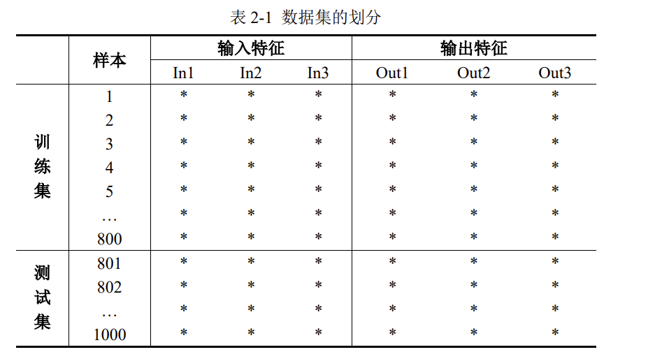

考虑到数据集的输入特征与输出特征都是3列，因此神经网络的输入层与输出层也必须都是3个神经元，隐藏层可以自行加以设计。

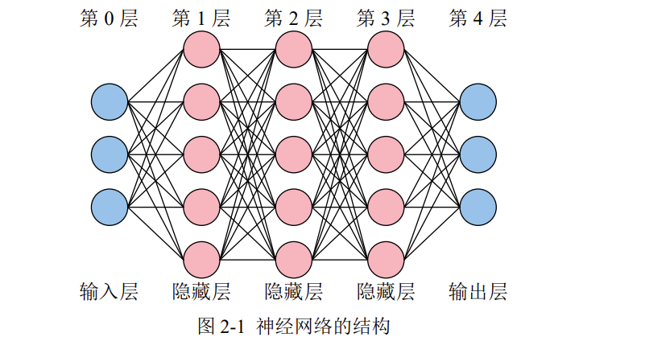

考虑到Python列表、Numpy数组以及Pytorch张量都是从索引0开始，再加上输入层没有内部参数(权重w与偏置b)，所以习惯将输入层称为第0层。

### 训练网络

神经网络的训练过程，就是经过很多次前向传播与反向传播的轮回，最终不断调整其内部参数(权重w与偏置b)，以拟合任意复杂函数的过程。内部参数一开始是随机的(如Xavier初始值、He初始值)，最终会不断优化到最佳。

还有一些训练网络前就要设计好的外部参数：网络的层数、每个隐藏层的节点数、每个节点的激活函数类型、学习率、轮回次数、每个轮回的样本数等等。

业界习惯把内部参数称为参数，外部参数称为超参数。

#### 前向传播

将单个样本的3个输入特征送入神经网络的输入层后，神经网络会逐层计算到输出层，最终得到神经网络预测的3个输出特征。计算过程中所使用的参数就是内部参数，所有的隐藏层与输出层的神经元都有内部参数，以第1层的第1个神经元为例。

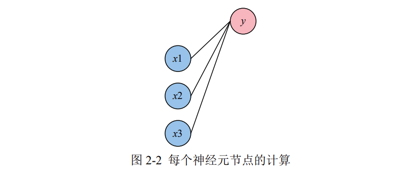

该神经元节点的计算过程为$$y = w_1x_1 + w_2x_2 + w_3x_3 + b$$。你可以理解为，每一根线就是一个权重$w$，每一个神经元节点也都有它自己的偏置$b$。

当然，每个神经元节点在计算完后，由于这个方程是线性的，因此**必须在外面套一个非线性的函数**：$$y = \delta(w_1x_1 + w_2x_2 + w_3x_3 + b)$$，$\delta$被称为激活函数。如果你不套非线性函数，那么即使10层网络，也可以用1层就拟合出相同的方程。

#### 反向传播

经过前向传播，网络会根据当前的内部参数计算出输出特征的预测值。但是这个预测值与真实值之间肯定存在差距，因此需要一个损失函数来计算这个差距。例如，求预测值与真实值之间差的绝对值，就是一个典型的损失函数。

损失函数计算好后，逐层退回求梯度，逐层退回求梯度，这个过程很复杂，原理不必掌握，大致意思就是，看每一个内部参数是变大还是变小，才会使得损失函数变小。这样就达到了优化内部参数的目的。

在这个过程中，有一个外部参数叫学习率。学习率越大，内部参数的优化越快，但过大的学习率可能会使损失函数越过最低点，并在谷底反复横跳。因此，在网络的训练开始之前，选择一个合适的学习率很重要。

#### batch_size

前向传播与反向传播一次时，有三种情况：

- 批量梯度下降（Batch Gradient Descent，BGD），把所有样本一次性输入进网络，这种方式计算量开销很大，速度也很慢。
- 随机梯度下降（Stochastic Gradient Descent，SGD），每次只把一个样本输入进网络，每计算一个样本就更新参数。这种方式虽然速度比较快，但是收敛性能差，可能会在最优点附近震荡，两次参数的更新也有可能抵消。
- 小批量梯度下降（Mini-Batch Gradient Decent，MBGD）是为了中和上面二者而生，这种办法把样本划分为若干个批，按批来更新参数。

所以，batch_size 即一批中的样本数，也是一次喂进网络的样本数。此外，由于 Batch Normalization 层（用于将每次产生的小批量样本进行标准化）的存在，batch_size 一般设置为 2 的幂次方，并且不能为 1。

注：PyTorch 实现时只支持批量与小批量，不支持单个样本的输入方式。PyTorch 里的 torch.optim.SGD 只表示梯度下降。

#### epochs

1 个 epoch 就是指全部样本进行 1 次前向传播与反向传播。

假设有 10240 个训练样本，batch_size 是 1024，epochs 是 5。那么：

- 全部样本将进行 5 次前向传播与反向传播；
- 1 个 epoch，将发生 10 次（10240/1024）前向传播与反向传播；
- 一共发生 50 次（10 \* 5）前向传播和反向传播。

### 测试网络

为了防止训练的网络过拟合，因此需要拿出少量的样本进行测试。过拟合的意思是：网络优化好的内部参数只能对训练样本有效，换成其它就寄。以线性回归为例，过拟合如图 2-3（b）所示。

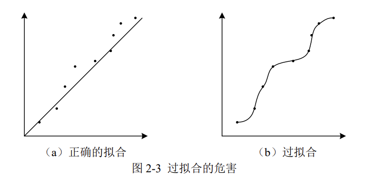

当网络训练好后，拿出测试集的输入，进行 1 次前向传播后，将预测的输出与测试集的真实输出进行对比，查看准确率。

### 使用网络

真正使用网络进行预测时，样本只知输入，不知输出。直接将样本的输入进行 1 次前向传播，即可得到预测的输出。

## DNN的实现

`torch.nn` 提供了搭建网络所需的所有组件，nn 即 Neural Network 神经网络。因此，可以单独给 `torch.nn` 一个别名，即 `import torch.nn as nn`。

```python
import torch
import torch.nn as nn
import matplotlib.pyplot as plt
%matplotlib inline
```

```python
# 展示高清图
from matplotlib_inline import backend_inline
backend_inline.set_matplotlib_formats('svg')

```

### 制作数据集

在训练之前，要准备好训练集的样本。

这里生成10000个样本，设定3个输入特征与3个输出特征，其中：

- 每个输入特征相互独立，均服从均匀分布
- 当(X1+X2+X3)< 1 时，Y1 为 1，否则 Y1 为 0；
- 当 1<(X1+X2+X3)<2 时，Y2 为 1，否则 Y2 为 0；
- 当(X1+X2+X3)>2 时，Y3 为 1，否则 Y3 为 0；
- `.float()`将布尔型张量转化为浮点型张量。

```python
# 生成数据集
X1 = torch.rand(10000,1) # 输入特征 1
X2 = torch.rand(10000,1) # 输入特征 2
X3 = torch.rand(10000,1) # 输入特征 3
Y1 = ( (X1+X2+X3)<1 ).float() # 输出特征 1
Y2 = ( (1<(X1+X2+X3)) & ((X1+X2+X3)<2) ).float() # 输出特征 2
Y3 = ( (X1+X2+X3)>2 ).float() # 输出特征 3
Data = torch.cat([X1,X2,X3,Y1,Y2,Y3],axis=1) # 整合数据集
Data = Data.to('cuda:0') # 把数据集搬到 GPU 上
Data.shape
```

    torch.Size([10000, 6])

事实上，数据的3个输出特征组合起来就是一个One-hot编码(独热编码)

```python
# 划分训练集与测试集
train_size = int(len(Data) * 0.7) # 训练集的样本数量
test_size = len(Data) - train_size # 测试集的样本数量
Data = Data[torch.randperm( Data.size(0)) , : ] # 打乱样本的顺序
train_Data = Data[ : train_size , : ] # 训练集样本
test_Data = Data[ train_size : , : ] # 测试集样本
train_Data.shape, test_Data.shape
```

    (torch.Size([7000, 6]), torch.Size([3000, 6]))

上述代码属于通用型代码，便于我们手动分割训练集与测试集。

### 搭建神经网络

搭建神经网络时，以 `nn.Module` 作为父类，我们自己的神经网络可直接继承父类的方法与属性，`nn.Module` 中包含网络各个层的定义。

在定义的神经网络子类中，通常包含`__init__`特殊方法与 `forward` 方法。`__init__`特殊方法用于构造自己的神经网络结构，`forward` 方法用于将输入数据进行前向传播。`由于张量可以自动计算梯度，所以不需要出现反向传播方法`。

```python
class DNN(nn.Module):
    def __init__(self):
        ''' 搭建神经网络各层 '''
        super(DNN,self).__init__()
        self.net = nn.Sequential( # 按顺序搭建各层
            nn.Linear(3, 5), nn.ReLU(), # 第 1 层：全连接层
            nn.Linear(5, 5), nn.ReLU(), # 第 2 层：全连接层
            nn.Linear(5, 5), nn.ReLU(), # 第 3 层：全连接层
            nn.Linear(5, 3) # 第 4 层：全连接层
        )
    def forward(self, x):
        ''' 前向传播 '''
        y = self.net(x) # x 即输入数据
        return y # y 即输出数据
```

```python
model = DNN().to('cuda:0') # 创建子类的实例，并搬到 GPU 上
model # 查看该实例的各层
```

    DNN(
      (net): Sequential(
        (0): Linear(in_features=3, out_features=5, bias=True)
        (1): ReLU()
        (2): Linear(in_features=5, out_features=5, bias=True)
        (3): ReLU()
        (4): Linear(in_features=5, out_features=5, bias=True)
        (5): ReLU()
        (6): Linear(in_features=5, out_features=3, bias=True)
      )
    )

在上面的 nn.Sequential()函数中，每一个隐藏层后都使用了 RuLU 激活函数，各层的神经元节点个数分别是：3、5、5、5、3。

注意，输入层有 3 个神经元、输出层有 3 个神经元，这不是巧合，是有意而为之。**输入层的神经元数量必须与每个样本的输入特征数量一致**，**输出层的神经元数量必须与每个样本的输出特征数量一致**。

### 网络的内部参数

神经网络的内部参数是权重与偏置，内部参数在神经网络训练之前会被赋予随机数，随着训练的进行，内部参数会逐渐迭代至最佳值，现在对参数进行查看。

```python
# 查看内部参数（非必要）
for name, param in model.named_parameters():
    print(f"参数:{name}\n 形状:{param.shape}\n 数值:{param}\n")
```

    参数:net.0.weight
     形状:torch.Size([5, 3])
     数值:Parameter containing:
    tensor([[-0.2611,  0.3221,  0.5267],
            [ 0.4815,  0.5316, -0.2288],
            [ 0.3940,  0.3262,  0.5340],
            [ 0.4362,  0.3146, -0.0128],
            [-0.2616,  0.2307,  0.0140]], device='cuda:0', requires_grad=True)

    参数:net.0.bias
     形状:torch.Size([5])
     数值:Parameter containing:
    tensor([ 0.4873, -0.0941,  0.2224, -0.1461, -0.3688], device='cuda:0',
           requires_grad=True)

    参数:net.2.weight
     形状:torch.Size([5, 5])
     数值:Parameter containing:
    tensor([[ 0.1760,  0.3451,  0.4089,  0.2046, -0.0021],
            [ 0.1289,  0.3193, -0.2934, -0.1889, -0.2203],
            [-0.1448,  0.1248, -0.4412, -0.3934, -0.0560],
            [-0.0581,  0.3300, -0.2969,  0.0691, -0.2471],
            [-0.0303,  0.2536,  0.3209,  0.1776,  0.2158]], device='cuda:0',
           requires_grad=True)

    参数:net.2.bias
     形状:torch.Size([5])
     数值:Parameter containing:
    tensor([-0.2812, -0.3989,  0.0987, -0.1376,  0.0982], device='cuda:0',
           requires_grad=True)

    参数:net.4.weight
     形状:torch.Size([5, 5])
     数值:Parameter containing:
    tensor([[-0.1021,  0.1256, -0.1864, -0.0622,  0.0230],
            [-0.0080,  0.4230, -0.2554,  0.3929, -0.2004],
            [ 0.2471, -0.1112, -0.0682,  0.3251,  0.4370],
            [-0.1407, -0.3381,  0.2441,  0.2999,  0.0136],
            [ 0.3401,  0.0705, -0.3672, -0.3706, -0.4131]], device='cuda:0',
           requires_grad=True)

    参数:net.4.bias
     形状:torch.Size([5])
     数值:Parameter containing:
    tensor([ 0.3935,  0.4288,  0.1717,  0.1297, -0.3212], device='cuda:0',
           requires_grad=True)

    参数:net.6.weight
     形状:torch.Size([3, 5])
     数值:Parameter containing:
    tensor([[ 0.4253,  0.2496, -0.0093, -0.1885,  0.0128],
            [-0.3943,  0.3615, -0.2175,  0.3319,  0.0581],
            [-0.1418, -0.3830, -0.1784, -0.1961,  0.0771]], device='cuda:0',
           requires_grad=True)

    参数:net.6.bias
     形状:torch.Size([3])
     数值:Parameter containing:
    tensor([ 0.1857, -0.0293, -0.4400], device='cuda:0', requires_grad=True)

代码一共给了我们8个参数，其中参数与形状的结果如下表所示，考虑到其数值初始状态是随机的，此处不进行讨论。

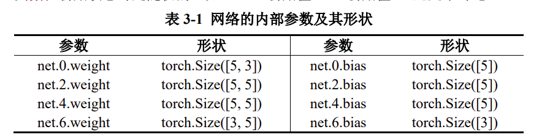

可见，具有权重与偏置的地方只有 net.0、net.2、net.4、net.6，结合此前的输出结果，可知这几个地方其实就是所有的隐藏层与输出层，奇数为激活函数层，这符合理论。
首先，net.0.weight 的权重形状为`[5, 3]`，5 表示它自己的节点数是 5，3 表示与之连接的前一层的节点数为 3。

- 其次，由于进行了 `model =DNN().to('cuda:0')`操作，因此所有的内部参数都自带 device='cuda:0'。
- 最后，注意到 `requires_grad=True`，说明所有需要进行反向传播的内部参数（即权重与偏置）都打开了张量自带的梯度计算功能。

### 网络的外部参数

外部参数即超参数，这是调参师们关注的重点。搭建网络时的超参数有：网络的层数、各隐藏层节点数、各节点激活函数、内部参数的初始值等。训练网络的超参数有：如损失函数、学习率、优化算法、batch_size、epochs 等。

#### 激活函数

PyTorch 1.12.0 版本进入 https://pytorch.org/docs/1.12/nn.html 搜索 Non-linear Activations，即可查看 torch 内置的所有非线性激活函数（以及各种类型的层）。

#### 损失函数

进入 https://pytorch.org/docs/1.12/nn.html 搜索 Loss Functions，即可查看 torch内置的所有损失函数。

```python
# 损失函数的选择
loss_fn = nn.MSELoss()
```

#### 学习率与优化算法

进入 https://pytorch.org/docs/1.12/optim.html，可查看 torch 的所有优化算法。

```python
# 优化算法的选择
learning_rate = 0.01 # 设置学习率
optimizer = torch.optim.SGD(model.parameters(), lr=learning_rate)
```

注：PyTorch 实现时只支持 BGD 或 MBGD，不支持单个样本的输入方式。这里的 torch.optim.SGD 只表示梯度下降，具体的批量与小批量见前文内容。

### 训练网络

```python
# 损失函数的选择
loss_fn = nn.MSELoss()

# 优化算法的选择
learning_rate = 0.01 # 设置学习率
optimizer = torch.optim.SGD(model.parameters(), lr=learning_rate)
```

```python
# 训练网络
epochs = 1000
losses = [] # 记录损失函数变化的列表
# 给训练集划分输入与输出
X = train_Data[ : , :3 ] # 前 3 列为输入特征
Y = train_Data[ : , -3: ] # 后 3 列为输出特征
for epoch in range(epochs):
    Pred = model(X) # 一次前向传播（批量）
    loss = loss_fn(Pred, Y) # 计算损失函数
    losses.append(loss.item()) # 记录损失函数的变化
    optimizer.zero_grad() # 清理上一轮滞留的梯度
    loss.backward() # 一次反向传播
    optimizer.step() # 优化内部参数

Fig = plt.figure()
plt.plot(range(epochs), losses)
plt.ylabel('loss'), plt.xlabel('epoch')
plt.show()

```

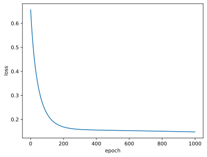

`losses.append(loss.item())`中，`.append()`是指在列表 losses 后再附加 1 个元素，而`.item()`方法**可将 PyTorch 张量退化为普通元素**。

### 测试网络

测试时，只需让测试集进行 1 次前向传播即可，这个过程不需要计算梯度，因此可以在该局部关闭梯度，该操作使用 `with torch.no_grad():`命令。

考虑到输出特征是独热编码，而预测的数据一般都是接近 0 或 1 的小数，为了能让预测数据与真实数据之间进行比较，因此要对预测数据进行规整。例如，使用 `Pred[:,torch.argmax(Pred, axis=1)] = 1` 命令将每行最大的数置 1，接着再使用`Pred[Pred!=1] = 0` 将不是 1 的数字置 0，这就使预测数据与真实数据的格式相同。

```python
# 测试网络
# 给测试集划分输入与输出
X = test_Data[:, :3] # 前 3 列为输入特征
Y = test_Data[:, -3:] # 后 3 列为输出特征
with torch.no_grad(): # 该局部关闭梯度计算功能
    Pred = model(X) # 一次前向传播（批量）
    Pred[:,torch.argmax(Pred, axis=1)] = 1
    Pred[Pred!=1] = 0
    correct = torch.sum( (Pred == Y).all(1) ) # 预测正确的样本
    total = Y.size(0) # 全部的样本数量
    print(f'测试集精准度: {100*correct/total} %')
```

    测试集精准度: 66.73332977294922 %

在计算 correct 时需要动点脑筋。

首先，(Pred == Y)计算预测的输出与真实的输出的各个元素是否相等，返回一个 3000 行、3 列的布尔型张量。

其次，(Pred == Y).all(1)检验该布尔型张量每一行的 3 个数据是否都是 True，对于全是 True 的样本行，结果就是 True，否则是 False。all(1)中的 1 表示按“行”扫描，最终返回一个形状为 3000 的一阶张量。

最后，torch.sum( (Pred == Y).all(1) )的意思就是看这 3000 个向量相加，True 会被当作 1，False 会被当作 0，这样相加刚好就是预测正确的样本数。

### 保存与导入网络

现在我们要考虑一件大事，那就是有时候训练一个大网络需要几天，那么必须要把整个网络连同里面的优化好的内部参数给保存下来。

现以本章前面的代码为例，当网络训练好后，将网络以文件的形式保存下来，并通过文件导入给另一个新网络，让新网络去跑测试集，看看测试集的准确率是否也是 67%。

#### 保存网络

通过“torch.save(模型名, '文件名.pth')”命令，可将该模型完整的保存至Jupyter 的工作路径下。

```python
# 保存网络
torch.save(model, 'model.pth')
```

#### 导入网络

通过“新网络 = torch.load('文件名.pth ')”命令，可将该模型完整的导入给新网络。

笔者这里是2.6.0版本，似乎需要指定`weights_only=False`才能正常导入网络。

```python
# 把模型赋给新网络
new_model = torch.load('model.pth', weights_only=False)
```

现在，new_model 就与 model 完全一致，可以直接去跑测试集。

#### 用新模型进行测试

```python
# 测试网络
# 给测试集划分输入与输出
X = test_Data[:, :3] # 前 3 列为输入特征
Y = test_Data[:, -3:] # 后 3 列为输出特征
with torch.no_grad(): # 该局部关闭梯度计算功能
    Pred = new_model(X) # 用新模型进行一次前向传播
    Pred[:,torch.argmax(Pred, axis=1)] = 1
    Pred[Pred!=1] = 0
    correct = torch.sum( (Pred == Y).all(1) ) # 预测正确的样本
    total = Y.size(0) # 全部的样本数量
    print(f'测试集精准度: {100*correct/total} %')

```

    测试集精准度: 66.73332977294922 %

## 批量梯度下降

本小结将完整、快速地再展示一边批量梯度下降（BGD）的全过程。

```python
import numpy as np
import pandas as pd
import torch
import torch.nn as nn
import matplotlib.pyplot as plt
%matplotlib inline
```

```python
# 展示高清图
from matplotlib_inline import backend_inline
backend_inline.set_matplotlib_formats('svg')

```

### 制作数据集

这一次数据集从 Excel 中导入，需要 Pandas 库中的 `pd.read_csv()`函数。

```python
# 准备数据集
df = pd.read_csv('/kaggle/input/datasets/frechen026/csv-data/Data.csv', index_col=0) # 导入数据
arr = df.values # Pandas 对象退化为 NumPy 数组
arr = arr.astype(np.float32) # 转为 float32 类型数组
ts = torch.tensor(arr) # 数组转为张量
ts = ts.to('cuda') # 把训练集搬到 cuda 上
ts.shape
```

    torch.Size([759, 9])

在第 4 行，将 arr 数组转为了 `np.float32` 类型这一步必不可少，没有的话计算过程会出现一些数据类型不兼容的情况。

```python
# 划分训练集与测试集
train_size = int(len(ts) * 0.7) # 训练集的样本数量
test_size = len(ts) - train_size # 测试集的样本数量
ts = ts[ torch.randperm( ts.size(0) ) , : ] # 打乱样本的顺序
train_Data = ts[ : train_size , : ] # 训练集样本
test_Data = ts[ train_size : , : ] # 测试集样本
train_Data.shape, test_Data.shape

# 0.7 表示训练集占整个数据集样本量的 70%，可以手动调整。
```

    (torch.Size([531, 9]), torch.Size([228, 9]))

### 搭建神经网络

注意到前面的数据集，输入有 8 个特征，输出有 1 个特征，那么神经网络的输入层必须有 8 个神经元，输出层必须有 1 个神经元。

隐藏层的层数、各隐藏层的节点数属于外部参数（超参数），可以自行设置。

```python
class DNN(nn.Module):
    def __init__(self):
        ''' 搭建神经网络各层 '''
        super(DNN,self).__init__()
        self.net = nn.Sequential( # 按顺序搭建各层
            nn.Linear(8, 32), nn.Sigmoid(), # 第 1 层：全连接层
            nn.Linear(32, 8), nn.Sigmoid(), # 第 2 层：全连接层
            nn.Linear(8, 4), nn.Sigmoid(), # 第 3 层：全连接层
            nn.Linear(4, 1), nn.Sigmoid() # 第 4 层：全连接层
        )
    def forward(self, x):
        ''' 前向传播 '''
        y = self.net(x) # x 即输入数据
        return y # y 即输出数据
```

```python
model = DNN().to('cuda:0') # 创建子类的实例，并搬到 GPU 上
model # 查看该实例的各层
```

    DNN(
      (net): Sequential(
        (0): Linear(in_features=8, out_features=32, bias=True)
        (1): Sigmoid()
        (2): Linear(in_features=32, out_features=8, bias=True)
        (3): Sigmoid()
        (4): Linear(in_features=8, out_features=4, bias=True)
        (5): Sigmoid()
        (6): Linear(in_features=4, out_features=1, bias=True)
        (7): Sigmoid()
      )
    )

### 训练网络

```python
# 损失函数的选择
loss_fn = nn.BCELoss(reduction='mean')
```

```python
# 优化算法的选择
learning_rate = 0.005 # 设置学习率
optimizer = torch.optim.Adam(model.parameters(), lr=learning_rate)
```

```python
# 训练网络
epochs = 5000
losses = [] # 记录损失函数变化的列表
# 给训练集划分输入与输出
X = train_Data[ : , : -1 ] # 前 8 列为输入特征
Y = train_Data[ : , -1 ].reshape((-1,1)) # 后 1 列为输出特征
# 此处的.reshape((-1,1))将一阶张量升级为二阶张量
for epoch in range(epochs):
    Pred = model(X) # 一次前向传播（批量）
    loss = loss_fn(Pred, Y) # 计算损失函数
    losses.append(loss.item()) # 记录损失函数的变化
    optimizer.zero_grad() # 清理上一轮滞留的梯度
    loss.backward() # 一次反向传播
    optimizer.step() # 优化内部参数

Fig = plt.figure()
plt.plot(range(epochs), losses)
plt.ylabel('loss')
plt.xlabel('epoch')
plt.show()

```

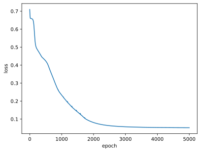

### 测试网络

注意，真实的输出特征都是 0 或 1，因此这里需要对网络预测的输出 Pred 进行处理，Pred 大于 0.5 的部分全部置 1，小于 0.5 的部分全部置 0。

```python
# 测试网络
# 给测试集划分输入与输出
X = test_Data[ : , : -1 ] # 前 8 列为输入特征
Y = test_Data[ : , -1 ].reshape((-1,1)) # 后 1 列为输出特征
with torch.no_grad(): # 该局部关闭梯度计算功能
    Pred = model(X) # 一次前向传播（批量）
    Pred[Pred>=0.5] = 1
    Pred[Pred<0.5] = 0
    correct = torch.sum( (Pred == Y).all(1) ) # 预测正确的样本
    total = Y.size(0) # 全部的样本数量
    print(f'测试集精准度: {100*correct/total} %')

```

    测试集精准度: 73.24561309814453 %

## 小批量梯度下降

本章将继续使用第四章中的 Excel 与神经网络结构，但使用小批量训练。在使用小批量梯度下降时，必须使用 3 个 PyTorch 内置的实用工具（utils）：

- DataSet 用于封装数据集；
- DataLoader 用于加载数据不同的批次；
- random_split 用于划分训练集与测试集。

```python
import numpy as np
import pandas as pd
import torch
import torch.nn as nn
from torch.utils.data import Dataset
from torch.utils.data import DataLoader
from torch.utils.data import random_split
import matplotlib.pyplot as plt
%matplotlib inline

```

```python
# 展示高清图
from matplotlib_inline import backend_inline
backend_inline.set_matplotlib_formats('svg')
```

### 制作数据集

在封装我们的数据集时，必须继承实用工具（utils）中的 DataSet 的类，这个过程需要重写`__init__`、`__getitem__`、`__len__`三个方法，分别是为了加载数据集、获取数据索引、获取数据总量。

```python
# 制作数据集
class MyData(Dataset): # 继承 Dataset 类
    def __init__(self, filepath):
        df = pd.read_csv(filepath, index_col=0) # 导入数据
        arr = df.values # 对象退化为数组
        arr = arr.astype(np.float32) # 转为 float32 类型数组
        ts = torch.tensor(arr) # 数组转为张量
        ts = ts.to('cuda') # 把训练集搬到 cuda 上
        self.X = ts[ : , : -1 ] # 前 8 列为输入特征
        self.Y = ts[ : , -1 ].reshape((-1,1)) # 后 1 列为输出特征
        self.len = ts.shape[0] # 样本的总数
    def __getitem__(self, index):
        return self.X[index], self.Y[index]
    def __len__(self):
        return self.len

```

小批次训练时，**输入特征与输出特征的划分必须**写在上面的的子类里面。

```python
# 划分训练集与测试集
Data = MyData('/kaggle/input/datasets/frechen026/csv-data/Data.csv')
train_size = int(len(Data) * 0.7) # 训练集的样本数量
test_size = len(Data) - train_size # 测试集的样本数量
train_Data, test_Data = random_split(Data, [train_size, test_size])
```

我们利用实用工具（utils）里的 random_split 轻松实现了训练集与测试集数据的划分。

```python
# 批次加载器
train_loader = DataLoader(dataset=train_Data, shuffle=True, batch_size=128)
test_loader = DataLoader(dataset=test_Data, shuffle=False, batch_size=64)

```

实用工具（utils）里的 DataLoader 可以在接下来的训练中进行小批次的载入数据，shuffle 用于在每一个 epoch 内先洗牌再分批。

### 搭建神经网络

```python
class DNN(nn.Module):
    def __init__(self):
        ''' 搭建神经网络各层 '''
        super(DNN,self).__init__()
        self.net = nn.Sequential( # 按顺序搭建各层
            nn.Linear(8, 32), nn.Sigmoid(), # 第 1 层：全连接层
            nn.Linear(32, 8), nn.Sigmoid(), # 第 2 层：全连接层
            nn.Linear(8, 4), nn.Sigmoid(), # 第 3 层：全连接层
            nn.Linear(4, 1), nn.Sigmoid() # 第 4 层：全连接层
        )
    def forward(self, x):
        ''' 前向传播 '''
        y = self.net(x) # x 即输入数据
        return y # y 即输出数据
```

```python
model = DNN().to('cuda:0') # 创建子类的实例，并搬到 GPU 上
model # 查看该实例的各层
```

    DNN(
      (net): Sequential(
        (0): Linear(in_features=8, out_features=32, bias=True)
        (1): Sigmoid()
        (2): Linear(in_features=32, out_features=8, bias=True)
        (3): Sigmoid()
        (4): Linear(in_features=8, out_features=4, bias=True)
        (5): Sigmoid()
        (6): Linear(in_features=4, out_features=1, bias=True)
        (7): Sigmoid()
      )
    )

### 训练网络

```python
# 损失函数的选择
loss_fn = nn.BCELoss(reduction='mean')
```

```python
# 优化算法的选择
learning_rate = 0.005 # 设置学习率
optimizer = torch.optim.Adam(model.parameters(), lr=learning_rate)
```

```python
# 训练网络
epochs = 500
losses = [] # 记录损失函数变化的列表
for epoch in range(epochs):
    for (x, y) in train_loader: # 获取小批次的 x 与 y
        Pred = model(x) # 一次前向传播（小批量）
        loss = loss_fn(Pred, y) # 计算损失函数
        losses.append(loss.item()) # 记录损失函数的变化
        optimizer.zero_grad() # 清理上一轮滞留的梯度
        loss.backward() # 一次反向传播
        optimizer.step() # 优化内部参数
Fig = plt.figure()
plt.plot(range(len(losses)), losses)
plt.show()

```

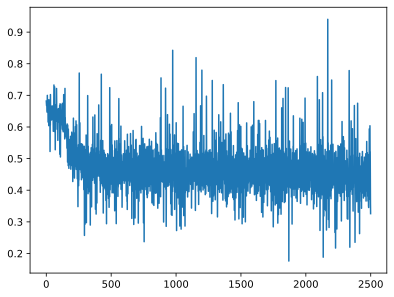

### 测试网络

```python
# 测试网络
correct = 0
total = 0
with torch.no_grad(): # 该局部关闭梯度计算功能
    for (x, y) in test_loader: # 获取小批次的 x 与 y
        Pred = model(x) # 一次前向传播（小批量）
        Pred[Pred>=0.5] = 1
        Pred[Pred<0.5] = 0
        correct += torch.sum( (Pred == y).all(1) )
        total += y.size(0)
print(f'测试集精准度: {100*correct/total} %')

```

    测试集精准度: 75.877197265625 %

## 手写数字识别

手写数字识别数据集（MNIST）是机器学习领域的标准数据集，它被称为机器学习领域的“Hello World”，只因任何 AI 算法都可以用此标准数据集进行检验。

MNIST 内的每一个样本都是一副二维的灰度图像，如图 6-1 所示。

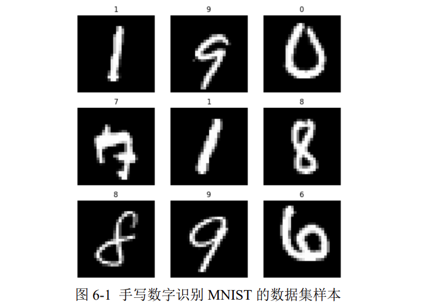

在 MNIST 中，模型的输入是一副图像，模型的输出就是一个与图像中对应的数字（0 至 9 之间的一个整数，不是独热编码）。

我们不用手动将输出转换为独热编码，PyTorch 会在整个过程中自动将数据集的输出转换为独热编码.只有在最后测试网络时，我们对比测试集的预测输出与真实输出时，才需要注意一下。

某一个具体的样本如图 6-2 所示，每个图像都是形状为28\*28的二维数组。

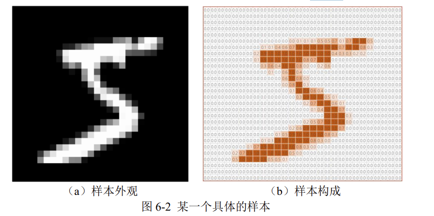

在这种多分类问题中，神经网络的输出层需要一个 softmax 激活函数，它可以把输出层的数据归一化到 0-1 上，且加起来为 1，这样就模拟出了概率的意思。

### 制作数据集

这一章我们需要在 torchvision 库中分别下载训练集与测试集，因此需要从torchvision 库中导入 datasets 以下载数据集，下载前需要借助 torchvision 库中的 transforms 进行图像转换，将数据集变为张量，并调整数据集的统计分布。

由于不需要手动构建数据集，因此不导入 utils 中的 Dataset；又由于训练集与测试集是分开下载的，因此不导入 utils 中的 random_split。

```python
import torch
import torch.nn as nn
from torch.utils.data import DataLoader
from torchvision import transforms
from torchvision import datasets
import matplotlib.pyplot as plt
%matplotlib inline

```

```python
# 展示高清图
from matplotlib_inline import backend_inline
backend_inline.set_matplotlib_formats('svg')

```

在下载数据集之前，要设定转换参数：transform，该参数里解决两个问题：

- ToTensor：将图像数据转为张量，且调整三个维度的顺序为 `C*W*H`；C表示通道数，二维灰度图像的通道数为 1，三维 RGB 彩图的通道数为 3。
- Normalize：将神经网络的输入数据转化为标准正态分布，训练更好；根据统计计算，MNIST 训练集所有像素的均值是 0.1307、标准差是 0.3081。

```python
# 制作数据集
# 数据集转换参数
transform = transforms.Compose([
    transforms.ToTensor(),
    transforms.Normalize(0.1307, 0.3081)
])
# 下载训练集与测试集
train_Data = datasets.MNIST(
    root = '/kaggle/working/dataset/mnist', # 下载路径
    train = True, # 是 train 集
    download = True, # 如果该路径没有该数据集，就下载
    transform = transform # 数据集转换参数
)
test_Data = datasets.MNIST(
    root = '/kaggle/working/dataset/mnist', # 下载路径
    train = False, # 是 test 集
    download = True, # 如果该路径没有该数据集，就下载
    transform = transform # 数据集转换参数
)

```

    100%|██████████| 9.91M/9.91M [00:00<00:00, 38.4MB/s]
    100%|██████████| 28.9k/28.9k [00:00<00:00, 1.12MB/s]
    100%|██████████| 1.65M/1.65M [00:00<00:00, 9.80MB/s]
    100%|██████████| 4.54k/4.54k [00:00<00:00, 10.1MB/s]

```python
# 批次加载器
train_loader = DataLoader(train_Data, shuffle=True, batch_size=64)
test_loader = DataLoader(test_Data, shuffle=False, batch_size=64)
```

### 搭建神经网络

每个样本的输入都是形状为 28 _ 28 的二维数组，那么对于 DNN 来说，输入层的神经元节点就要有 28 _ 28 = 784个；输出层使用独热编码，需要 10 个节点。

```python
class DNN(nn.Module):
    def __init__(self):
        ''' 搭建神经网络各层 '''
        super(DNN,self).__init__()
        self.net = nn.Sequential( # 按顺序搭建各层
            nn.Flatten(), # 把图像铺平成一维
            nn.Linear(784, 512), nn.ReLU(), # 第 1 层：全连接层
            nn.Linear(512, 256), nn.ReLU(), # 第 2 层：全连接层
            nn.Linear(256, 128), nn.ReLU(), # 第 3 层：全连接层
            nn.Linear(128, 64), nn.ReLU(), # 第 4 层：全连接层
            nn.Linear(64, 10) # 第 5 层：全连接层
        )
    def forward(self, x):
        ''' 前向传播 '''
        y = self.net(x) # x 即输入数据
        return y # y 即输出数据
```

```python
model = DNN().to('cuda:0') # 创建子类的实例，并搬到 GPU 上
model # 查看该实例的各层
```

    DNN(
      (net): Sequential(
        (0): Flatten(start_dim=1, end_dim=-1)
        (1): Linear(in_features=784, out_features=512, bias=True)
        (2): ReLU()
        (3): Linear(in_features=512, out_features=256, bias=True)
        (4): ReLU()
        (5): Linear(in_features=256, out_features=128, bias=True)
        (6): ReLU()
        (7): Linear(in_features=128, out_features=64, bias=True)
        (8): ReLU()
        (9): Linear(in_features=64, out_features=10, bias=True)
      )
    )

### 训练网络

```python
# 损失函数的选择
loss_fn = nn.CrossEntropyLoss() # 自带 softmax 激活函数
```

```python
# 优化算法的选择
learning_rate = 0.01 # 设置学习率
optimizer = torch.optim.SGD(
    model.parameters(),
    lr = learning_rate,
    momentum = 0.5
)
```

给优化器了一个新参数 momentum（动量），它使梯度下降算法有了力与惯性，该方法给人的感觉就像是小球在地面上滚动一样。

```python
# 训练网络
epochs = 5
losses = [] # 记录损失函数变化的列表
for epoch in range(epochs):
    for (x, y) in train_loader: # 获取小批次的 x 与 y
        x, y = x.to('cuda:0'), y.to('cuda:0')
        Pred = model(x) # 一次前向传播（小批量）
        loss = loss_fn(Pred, y) # 计算损失函数
        losses.append(loss.item()) # 记录损失函数的变化
        optimizer.zero_grad() # 清理上一轮滞留的梯度
        loss.backward() # 一次反向传播
        optimizer.step() # 优化内部参数
Fig = plt.figure()
plt.plot(range(len(losses)), losses)
plt.show()

```

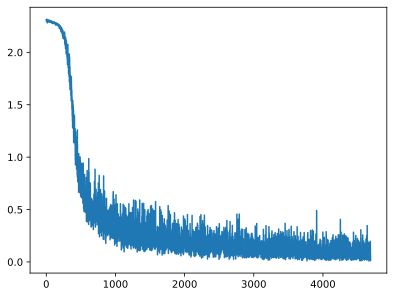

注意，由于数据集内部进不去，只能在循环的过程中取出一部分样本，就立即将之搬到 GPU 上。

### 测试网络

```python
# 测试网络
correct = 0
total = 0
with torch.no_grad(): # 该局部关闭梯度计算功能
    for (x, y) in test_loader: # 获取小批次的 x 与 y
        x, y = x.to('cuda:0'), y.to('cuda:0')
        Pred = model(x) # 一次前向传播（小批量）
        _, predicted = torch.max(Pred.data, dim=1)
        correct += torch.sum( (predicted == y) )
        total += y.size(0)
print(f'测试集精准度: {100*correct/total} %')

```

    测试集精准度: 97.06999969482422 %

a, b = torch.max(Pred.data, dim=1)的意思是，找出 Pred 每一行里的最大值，数值赋给 a，所处位置赋给 b。因此上述代码里的 predicted 就相当于把独热编码转换回了普通的阿拉伯数字，这样一来可以直接与 y 进行比较。

由于此处 predicted 与 y 是一阶张量，因此 correct 行的结尾不能加.all(1)
