# Matplotlib绘图库

## 绘图基础

- Matplotlib 库太大，画图通常仅仅使用其中的核心模块 matplotlib.pyplot，并给其一个别名 plt，即 `import matplotlib.pyplot as plt`。
- 为了使图形在展示时能很好的嵌入到 Jupyter 的 Out[ ] 中，需要使用`%matplotlib inline`。

`%matplotlib inline` 的作用，这个"魔法命令"告诉 Jupyter：
- 使用 inline 后端（inline backend）
- 图形会自动嵌入在 notebook 中显示
- 不需要显式调用 plt.show()

### 绘制图像

展示一个很简单的图形绘制示例。


```python
import matplotlib.pyplot as plt 
%matplotlib inline
```


```python
# 绘制图像 
Fig1 = plt.figure() # 创建新图窗 
x = [ 1, 2, 3, 4, 5 ] # 数据的 x 值 
y = [ 1, 8, 27, 64, 125 ] # 数据的 y 值 
plt.plot(x,y) # plot 函数：先描点，再连线
```


    [<matplotlib.lines.Line2D at 0x7e276d31ae40>]


    
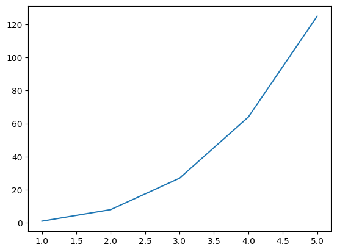
    


这里绘制虽然很完美，但遗憾的是图形太浑浊，虽然瑕不掩疵，但无法入眼。

因此，需要在 Jupyter 中展示高清的 svg 矢量图。


```python
# 展示高清图 
from matplotlib_inline import backend_inline 
backend_inline.set_matplotlib_formats('svg') 
```


```python
# 绘制图像 
Fig2 = plt.figure() # 创建新图窗 
x = [ 1, 2, 3, 4, 5 ] # 数据的 x 值 
y = [ 1, 8, 27, 64, 125 ] # 数据的 y 值 
plt.plot(x,y) # 使用 plot 函数绘制线型图
```


    [<matplotlib.lines.Line2D at 0x7e2766079be0>]


    
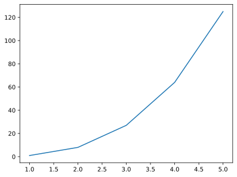
    


### 保存图像

保存图形用.savefig( )方法，其需要一个 r 字符串：r'绝对路径\图形名.后缀'。 
- 绝对路径：如果要保存到桌面，绝对路径即：C:\Users\用户名\Desktop； 
- 后缀：可保存图形的格式很多，包括：eps、jpg、pdf、png、ps、svg 等。为了保存清晰的图，推荐保存至 svg 矢量格式。

例如：`Fig2.savefig(r'C:\Users\zjj\Desktop\我的图.svg')`

### 两种画图方式

Matplotlib 中有两种画图方式：Matlab 方式和面向对象方式。 

这两种方式都可以完成同一个目的，也可以相互转化。


```python
import matplotlib.pyplot as plt 
%matplotlib inline 

# 展示高清图 
from matplotlib_inline import backend_inline 
backend_inline.set_matplotlib_formats('svg')

# 准备数据 
x = [ 1, 2, 3, 4, 5 ] # 数据的 x 值 
y = [ 1, 8, 27, 64, 125 ] # 数据的 y 值
```


```python
# Matlab 方式 
Fig1 = plt.figure() 
 
plt.plot(x,y)
```


    [<matplotlib.lines.Line2D at 0x7e2763e3a840>]


    

    


```python
# 面向对象方式 
Fig2 = plt.figure()   # 创建 Figure 对象
ax2 = plt.axes()      # 创建 Axes 对象
ax2.plot(x,y)         # 明确指定在哪个 axes 上绘图
```


    [<matplotlib.lines.Line2D at 0x7e2763ce36b0>]


    

    


注意：

- Matlab方式通过plt.plot()隐式操作当前图形，代码简洁适合快速绘图；面向对象方式通过ax.plot()显式操作Axes对象，结构清晰适合复杂图表和精确控制。
- 在面向对象方式中，Fig2 的作用是创建一个图形对象（Figure 对象），它是 matplotlib 中最高级别的容器。


### 图窗与坐标轴


- 图形窗口（figure）在 Matlab 中会单独弹出，该窗口中可容纳元素，也可以是空的窗口。在 Jupyter 中，由于我们将图形嵌入到了 Out [ ]中，所以不会看到有 figure 弹出。虽然看不到窗口，但在画图之前，**仍然要手动 Fig1 = plt.figure()创建图窗**，毕竟保存图形的.savefig( )方法是需要图形名，且后面几章会更加强调。 
- 坐标轴（axes）是一个矩形，其下方是 x 轴的数值与刻度，左侧是 y 轴的数值与刻度。因此，将 1.4 示例中的蓝色曲线删除，剩余部分全是 axes。 


## 多图形的绘制

在 Jupyter 的某个代码块中使用`Fig1=plt.figure()`创建图窗后，其范围仅仅在此代码块中，跳出此代码块外的其他画图命令将与Fig1无关。

因此，画一幅图，请在一个代码块中完成，不得分块。

### 绘制多线条

在同一个图窗内绘制多线条，按两种画图方式分开来演示。


```python
import matplotlib.pyplot as plt 
%matplotlib inline 

```


```python
# 展示高清图 
from matplotlib_inline import backend_inline 
backend_inline.set_matplotlib_formats('svg') 

```


```python
# 准备数据 
x = [ 1, 2, 3, 4, 5 ] # 数据的 x 值 
y1 = [ 1, 2, 3, 4, 5 ] # 数据的 y1 值 
y2 = [ 0, 0, 0, 0, 0 ] # 数据的 y2 值 
y3 = [ -1, -2, -3, -4, -5 ] # 数据的 y3 值
```


```python
# Matlab 方式 
Fig1 = plt.figure() 

plt.plot(x,y1) 
plt.plot(x,y2) 
plt.plot(x,y3)
```


    [<matplotlib.lines.Line2D at 0x7b32e98bfe60>]


    
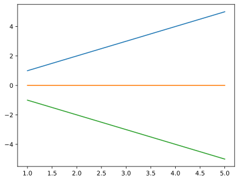
    


```python
# 面向对象方式 
Fig2 = plt.figure() 
ax2 = plt.axes() 
ax2.plot(x,y1) 
ax2.plot(x,y2) 
ax2.plot(x,y3) 
```


    [<matplotlib.lines.Line2D at 0x7b32e9954200>]


    

    


### 绘制多子图

绘制多个子图时，两种方法可能区别较大。


```python
import matplotlib.pyplot as plt
%matplotlib inline
```


```python
# 展示高清图
from matplotlib_inline import backend_inline
backend_inline.set_matplotlib_formats('svg')
```


```python
# Matlab 方式 
Fig1 = plt.figure() 
plt.subplot(3,1,1), plt.plot(x,y1) 
plt.subplot(3,1,2), plt.plot(x,y2) 
plt.subplot(3,1,3), plt.plot(x,y3)
```


    (<Axes: >, [<matplotlib.lines.Line2D at 0x7b32e9899370>])


    
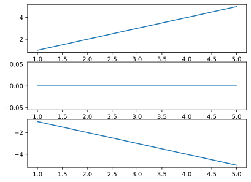
    


在 plt.subplot(3,1,1) 中，三个参数的含义如下：
- 第一个参数 3：行数（nrows）
    - 表示将整个画布垂直划分为 3 行
- 第二个参数 1：列数（ncols）
    - 表示将画布水平划分为 1 列
- 第三个参数 1：索引（index）
    - 表示选择第 1 个子图区域进行绘制
- 子图编号从左上角开始，逐行逐列编号，从 1 开始计数


```python
# 面向对象方式 
Fig2, ax2 = plt.subplots(3) 
ax2[0].plot(x,y1) 
ax2[1].plot(x,y2) 
ax2[2].plot(x,y3)
```


    [<matplotlib.lines.Line2D at 0x7b32e95838c0>]


    

    


在上述示例中，注意到用 Fig2, ax2 = plt.subplots(3)一行代码替代了之前的两行代码 Fig2 = plt.figure()与 ax2 = plt.axes()。 

因此，之后可以直接使用 Fig2, ax2 = plt.subplots()简化面向对象方式的代码。

## 图表类型

### 图表类型

plt 提供 5 类基本图表，分别是二维图、网格图、统计图、轮廓图、三维图。详见https://matplotlib.org/stable/plot_types/index，以下罗列深度学习中可能用的。

#### 二维图

二维图，只需要两个向量即可绘图，其中线型图可以替代其他所有二维图。

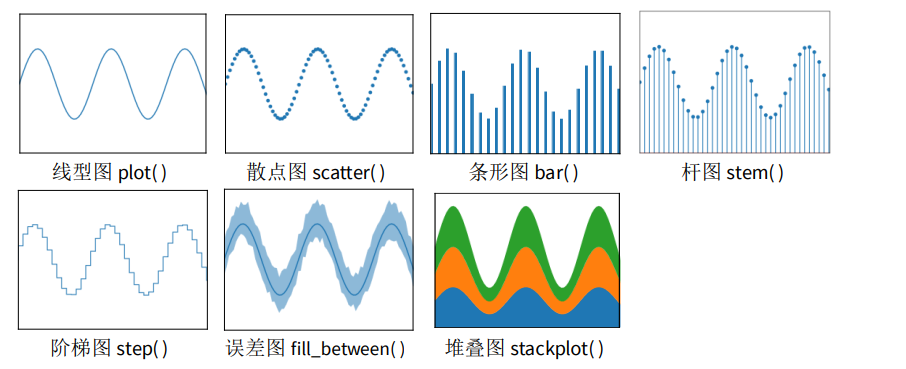

#### 网格图

网格图，只需要一个矩阵即可绘图，以下网格图都有一定的实用价值。 

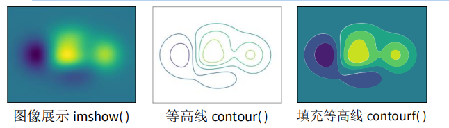

#### 统计图

统计图，一般做数据分析时使用。

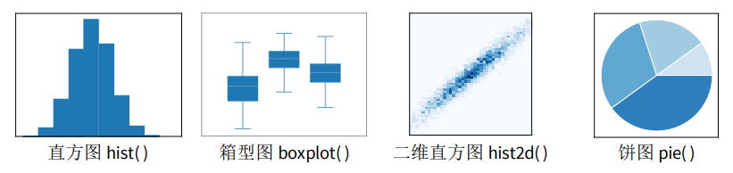

以上图形只会挑选其中最关键、使用最频繁的函数进行讲解。其它情况可百度或者去官网查看使用方法。 

除了上述链接中的这五类基本图表外，还有更多作者提前画好的花哨的靓图，详见 https://matplotlib.org/stable/gallery/index.html。 

最后，作者还温馨地向小白的我们提供了从 0 开始到大神的完整教程，详见：https://matplotlib.org/stable/tutorials/index.html。

### 二维图

二维图，仅仅演示plot线型图函数，只因其可以替代其他所有二维图。

#### 设置颜色

plot()函数含 color 参数，可以设置线条的颜色，如示例所示，颜色可以使用十六进制。


```python
# 展示高清图 
from matplotlib_inline import backend_inline 
backend_inline.set_matplotlib_formats('svg') 

```


```python
# 准备数据 
x = [ 1, 2, 3, 4, 5 ] # 数据的 x 值 
y1 = [ 0, 1, 2, 3, 4 ] # 数据的 y1 值 
y2 = [ 1, 2, 3, 4, 5 ] # 数据的 y2 值 
y3 = [ 2, 3, 4, 5, 6 ] # 数据的 y3 值 
y4 = [ 3, 4, 5, 6, 7 ] # 数据的 y4 值 
y5 = [ 4, 5, 6, 7, 8 ] # 数据的 y5 值 

```


```python
# Matlab 方式 
Fig1 = plt.figure() 
plt.plot(x, y1, color='#7CB5EC') 
plt.plot(x, y2, color='#F7A35C') 
plt.plot(x, y3, color='#A2A2D0') 
plt.plot(x, y4, color='#F6675D') 
plt.plot(x, y5, color='#47ADC7') 
```


    [<matplotlib.lines.Line2D at 0x7b32e965e2a0>]


    
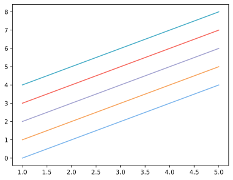
    


```python
# 面向对象方式 
Fig2, ax2 = plt.subplots() 
ax2.plot(x, y1, color='#7CB5EC') 
ax2.plot(x, y2, color='#F7A35C') 
ax2.plot(x, y3, color='#A2A2D0') 
ax2.plot(x, y4, color='#F6675D') 
ax2.plot(x, y5, color='#47ADC7')
```


    [<matplotlib.lines.Line2D at 0x7b32e9510740>]


    

    


#### 设置风格

plot()函数含 linestyle 参数，可以设置线条的风格，如示例所示。

在设置线条风格时，'-'表示实线，'--'表示虚线，'-.'表示点虚线，':'表示点线，''表示隐藏该线条。 


```python
# Matlab 方式 
Fig1 = plt.figure() 
plt.plot(x, y1, linestyle='-') 
plt.plot(x, y2, linestyle='--') 
plt.plot(x, y3, linestyle='-.') 
plt.plot(x, y4, linestyle=':') 
plt.plot(x, y5, linestyle=' ') 
```


    [<matplotlib.lines.Line2D at 0x7b32e9383020>]


    
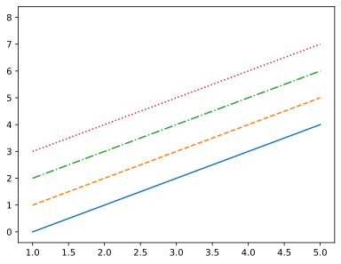
    


```python
# 面向对象方式 
Fig2, ax2 = plt.subplots() 
ax2.plot(x, y1, linestyle='-') 
ax2.plot(x, y2, linestyle='--') 
ax2.plot(x, y3, linestyle='-.') 
ax2.plot(x, y4, linestyle=':') 
ax2.plot(x, y5, linestyle=' ')
```


    [<matplotlib.lines.Line2D at 0x7b32e9421580>]


    

    


#### 设置粗细

plot()函数含linewidth参数，可以设置线条的粗细。

在设置线条粗细时，数字表示磅数，一般以0.5至3为宜。


```python
# Matlab 方式 
Fig1 = plt.figure() 
plt.plot(x, y1, linewidth=0.5) 
plt.plot(x, y2, linewidth=1) 
plt.plot(x, y3, linewidth=1.5) 
plt.plot(x, y4, linewidth=2) 
```


    [<matplotlib.lines.Line2D at 0x7b32e931b500>]


    
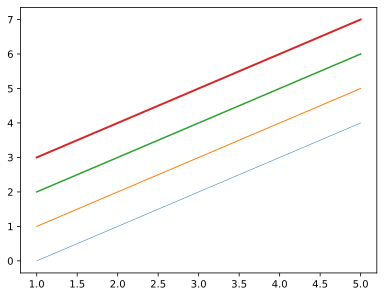
    


```python
# 面向对象方式 
Fig2, ax2 = plt.subplots() 
ax2.plot(x, y1, linewidth=0.5) 
ax2.plot(x, y2, linewidth=1) 
ax2.plot(x, y3, linewidth=1.5) 
ax2.plot(x, y4, linewidth=2) 

```


    [<matplotlib.lines.Line2D at 0x7b32e91aa7b0>]


    

    


#### 设置标记

plot()函数含marker函数，可以设置线条的标记。

标记的尺寸可以由markersize参数调整，其值以3至9为宜。


```python
# Matlab 方式 
Fig1 = plt.figure() 
plt.plot(x, y1, marker='.') 
plt.plot(x, y2, marker='o') 
plt.plot(x, y3, marker='^') 
plt.plot(x, y4, marker='s') 
plt.plot(x, y5, marker='D', markersize=5) 
```


    [<matplotlib.lines.Line2D at 0x7b32e8eed9d0>]


    
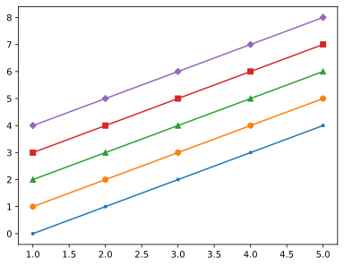
    


```python
# 面向对象方式 
Fig2, ax2 = plt.subplots() 
ax2.plot(x, y1, marker='.') 
ax2.plot(x, y2, marker='o') 
ax2.plot(x, y3, marker='^') 
ax2.plot(x, y4, marker='s') 
ax2.plot(x, y5, marker='D') 

```


    [<matplotlib.lines.Line2D at 0x7b32e8d88080>]


    
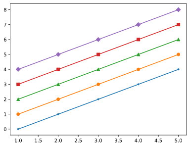
    


#### 综合应用

现在综合上述所有的线条属性，绘制图形。


```python
# Matlab 方式 
Fig1 = plt.figure() 
plt.plot(x, y1, color='#7CB5EC', linestyle='-', linewidth=2, marker='o', markersize=6) 
plt.plot(x, y2, color='#F7A35C', linestyle='--', linewidth=2, marker='^', markersize=6) 
plt.plot(x, y3, color='#A2A2D0', linestyle='-.', linewidth=2, marker='s', markersize=6) 
plt.plot(x, y4, color='#F6675D', linestyle=':', linewidth=2, marker='D', markersize=6) 
plt.plot(x, y5, color='#47ADC7', linestyle=' ', linewidth=2, marker='o', markersize=6)
```


    [<matplotlib.lines.Line2D at 0x7b32e8dfe1b0>]


    
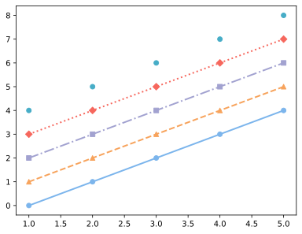
    


```python
# 面向对象方式 
Fig2, ax2 = plt.subplots() 
ax2.plot(x, y1, color='#7CB5EC', linestyle='-', linewidth=2, marker='o', markersize=6) 
ax2.plot(x, y2, color='#F7A35C', linestyle='--', linewidth=2, marker='^', markersize=6) 
ax2.plot(x, y3, color='#A2A2D0', linestyle='-.', linewidth=2, marker='s', markersize=6) 
ax2.plot(x, y4, color='#F6675D', linestyle=':', linewidth=2, marker='D', markersize=6) 
ax2.plot(x, y5, color='#47ADC7', linestyle=' ', linewidth=2, marker='o', markersize=6) 
```


    [<matplotlib.lines.Line2D at 0x7b32e8c99250>]


    

    


请留意 y5 的线条，此时为散点，这种方式画散点图比 plt.scatter( )效率更高。

### 网格图

网格图，仅演示imshow函数，只因另外两个在深度学习中几乎使用不到。


```python
import matplotlib.pyplot as plt 
%matplotlib inline

# 展示高清图 
from matplotlib_inline import backend_inline 
backend_inline.set_matplotlib_formats('svg') 
```


```python
# 准备数据 
import numpy as np 
x = np.linspace(0,10,1000) 
I = np.sin(x) * np.cos(x).reshape(-1,1) 

```


```python
# Matlab 方式 
Fig1 = plt.figure() 
plt.imshow(I) 
```


    <matplotlib.image.AxesImage at 0x7b32e9422120>


    
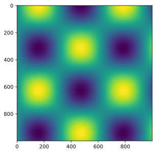
    


```python
# 面向对象方式 
Fig2, ax2 = plt.subplots() 
ax2.imshow(I)
```


    <matplotlib.image.AxesImage at 0x7b32e8cb2cf0>


    

    


在所有的网格图中，还可以配置颜色条。


```python
# Matlab 方式 
Fig1 = plt.figure() 
plt.imshow(I) 
plt.colorbar()
```


    <matplotlib.colorbar.Colorbar at 0x7b32e7c73710>


    
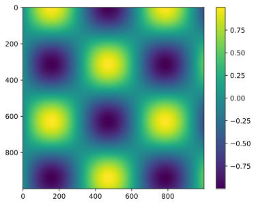
    


```python
# 面向对象方式 
Fig2, ax2 = plt.subplots() 
im = ax2.imshow(I)
Fig2.colorbar(im, ax=ax2)
```


    

    


问题1：面向对象方法是否缺少colorbar功能？
- 不是的，面向对象方法并不缺少这个功能！
- 在matplotlib的面向对象方式中，完全可以使用 fig.colorbar() 方法添加颜色条，关键是要入 imshow() 返回的对象。

问题2：网格图的作用
1. 创建坐标网格
可以使用 meshgrid 函数从一维的x和y坐标向量生成二维的坐标矩阵，形成矩形网格
2. 在网格上评估函数
- 用于计算二元函数在每个网格点的值，非常适合：
- 绘制等高线图（contour plots）
- 绘制三维表面图（3D surface plots）
- 绘制热力图（heatmaps）

### 统计图

统计图，仅演示 hist 函数，只因其它函数主要出现在数据分析领域。 

为避免将直方图 hist 与条形图 bar 弄混，现说明：条形图 bar 可用 plot 替代；hist 则是统计学的函数，是为了看清某分布的均值与标准差。


```python
import matplotlib.pyplot as plt 
%matplotlib inline

# 展示高清图 
from matplotlib_inline import backend_inline 
backend_inline.set_matplotlib_formats('svg') 
```


```python
# 创建 10000 个标准正态分布的样本 
import numpy as np 
data = np.random.randn( 10000 ) 
```


```python
# Matlab 方式 
Fig1 = plt.figure() 
plt.hist( data ) 
```


    (array([  34.,  192.,  815., 1998., 2834., 2547., 1191.,  327.,   57.,
               5.]),
     array([-3.52443952, -2.7707963 , -2.01715308, -1.26350986, -0.50986665,
             0.24377657,  0.99741979,  1.75106301,  2.50470622,  3.25834944,
             4.01199266]),
     <BarContainer object of 10 artists>)


    
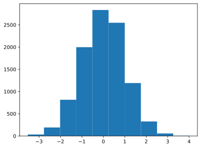
    


```python
# 面向对象方式 
Fig2, ax2 = plt.subplots() 
ax2.hist( data ) 
```


    (array([  34.,  192.,  815., 1998., 2834., 2547., 1191.,  327.,   57.,
               5.]),
     array([-3.52443952, -2.7707963 , -2.01715308, -1.26350986, -0.50986665,
             0.24377657,  0.99741979,  1.75106301,  2.50470622,  3.25834944,
             4.01199266]),
     <BarContainer object of 10 artists>)


    

    


在上述示例中，对该直方图求积分，其结果是个体的总数，即 10000。 

#### 区间个数

bins参数即区间划分的数量，默认为10，现将其改为30。


```python
# Matlab 方式 
Fig1 = plt.figure() 
plt.hist( data, bins = 30 ) 
```


    (array([ 13.,  10.,  11.,  33.,  60.,  99., 166., 263., 386., 507., 671.,
            820., 914., 946., 974., 998., 834., 715., 527., 388., 276., 163.,
            110.,  54.,  38.,  11.,   8.,   2.,   2.,   1.]),
     array([-3.52443952, -3.27322511, -3.02201071, -2.7707963 , -2.51958189,
            -2.26836749, -2.01715308, -1.76593868, -1.51472427, -1.26350986,
            -1.01229546, -0.76108105, -0.50986665, -0.25865224, -0.00743783,
             0.24377657,  0.49499098,  0.74620538,  0.99741979,  1.24863419,
             1.4998486 ,  1.75106301,  2.00227741,  2.25349182,  2.50470622,
             2.75592063,  3.00713504,  3.25834944,  3.50956385,  3.76077825,
             4.01199266]),
     <BarContainer object of 30 artists>)


    
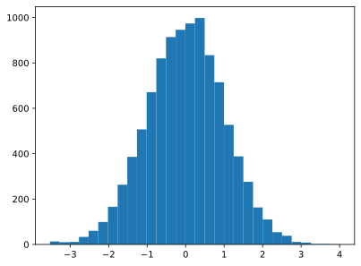
    


```python
# 面向对象方式 
Fig2, ax2 = plt.subplots() 
ax2.hist( data, bins = 30 ) 
```


    (array([ 13.,  10.,  11.,  33.,  60.,  99., 166., 263., 386., 507., 671.,
            820., 914., 946., 974., 998., 834., 715., 527., 388., 276., 163.,
            110.,  54.,  38.,  11.,   8.,   2.,   2.,   1.]),
     array([-3.52443952, -3.27322511, -3.02201071, -2.7707963 , -2.51958189,
            -2.26836749, -2.01715308, -1.76593868, -1.51472427, -1.26350986,
            -1.01229546, -0.76108105, -0.50986665, -0.25865224, -0.00743783,
             0.24377657,  0.49499098,  0.74620538,  0.99741979,  1.24863419,
             1.4998486 ,  1.75106301,  2.00227741,  2.25349182,  2.50470622,
             2.75592063,  3.00713504,  3.25834944,  3.50956385,  3.76077825,
             4.01199266]),
     <BarContainer object of 30 artists>)


    

    


#### 透明度

Alpha 参数表示透明度，默认为 1，现将其改为为 0.5。


```python
# Matlab 方式 
Fig1 = plt.figure() 
plt.hist( data, alpha=0.5 ) 

```


    (array([  34.,  192.,  815., 1998., 2834., 2547., 1191.,  327.,   57.,
               5.]),
     array([-3.52443952, -2.7707963 , -2.01715308, -1.26350986, -0.50986665,
             0.24377657,  0.99741979,  1.75106301,  2.50470622,  3.25834944,
             4.01199266]),
     <BarContainer object of 10 artists>)


    
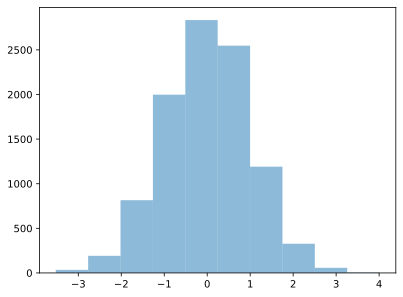
    


```python
# 面向对象方式 
Fig2, ax2 = plt.subplots() 
ax2.hist( data, alpha=0.5 ) 
```


    (array([  34.,  192.,  815., 1998., 2834., 2547., 1191.,  327.,   57.,
               5.]),
     array([-3.52443952, -2.7707963 , -2.01715308, -1.26350986, -0.50986665,
             0.24377657,  0.99741979,  1.75106301,  2.50470622,  3.25834944,
             4.01199266]),
     <BarContainer object of 10 artists>)


    

    


#### 图表类型

histtype表示类型，默认为bar，现在将其改为stepfilled，图形浑然一体。


```python
# Matlab 方式 
Fig1 = plt.figure() 
plt.hist( data, histtype='stepfilled') 

```


    (array([  34.,  192.,  815., 1998., 2834., 2547., 1191.,  327.,   57.,
               5.]),
     array([-3.52443952, -2.7707963 , -2.01715308, -1.26350986, -0.50986665,
             0.24377657,  0.99741979,  1.75106301,  2.50470622,  3.25834944,
             4.01199266]),
     [<matplotlib.patches.Polygon at 0x7b32e6413b90>])


    

    


#### 直方图颜色

color 表示直方图的颜色，这里进行更改。 


```python
# Matlab 方式 
Fig1 = plt.figure() 
plt.hist( data, color='#A2A2D0' )
```


    (array([  34.,  192.,  815., 1998., 2834., 2547., 1191.,  327.,   57.,
               5.]),
     array([-3.52443952, -2.7707963 , -2.01715308, -1.26350986, -0.50986665,
             0.24377657,  0.99741979,  1.75106301,  2.50470622,  3.25834944,
             4.01199266]),
     <BarContainer object of 10 artists>)


    
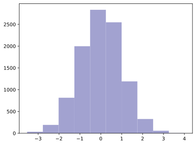
    


#### 边缘颜色

edgecolor表示直方图边缘的颜色，这里改为白色。改为白色的好处是，中间的“分割线”更明显，绘图效果更佳。


```python
# Matlab 方式 
Fig1 = plt.figure() 
plt.hist( data, color='#A2A2D0', edgecolor='#FFFFFF' )
```


    (array([  34.,  192.,  815., 1998., 2834., 2547., 1191.,  327.,   57.,
               5.]),
     array([-3.52443952, -2.7707963 , -2.01715308, -1.26350986, -0.50986665,
             0.24377657,  0.99741979,  1.75106301,  2.50470622,  3.25834944,
             4.01199266]),
     <BarContainer object of 10 artists>)


    

    


#### 综合应用


```python
# 创建三个正态分布的样本 
import numpy as np 
x1 = np.random.normal( 3, 1, 1000 ) 
x2 = np.random.normal( 6, 1, 1000 ) 
x3 = np.random.normal( 9, 1, 1000 ) 

```


```python
# Matlab 方式 
Fig1 = plt.figure() 
plt.hist( x1, bins=30, alpha=0.5, color='#7CB5EC', edgecolor='#FFFFFF' ) 
plt.hist( x2, bins=30, alpha=0.5, color='#A2A2D0', edgecolor='#FFFFFF' ) 
plt.hist( x3, bins=30, alpha=0.5, color='#47ADC7', edgecolor='#FFFFFF' )
```


    (array([ 3.,  1.,  1.,  6., 10., 16., 19., 15., 28., 40., 45., 62., 60.,
            64., 77., 72., 73., 84., 58., 61., 54., 30., 35., 22., 25., 16.,
            12.,  3.,  3.,  5.]),
     array([ 6.01183817,  6.20259406,  6.39334995,  6.58410584,  6.77486173,
             6.96561762,  7.15637351,  7.3471294 ,  7.5378853 ,  7.72864119,
             7.91939708,  8.11015297,  8.30090886,  8.49166475,  8.68242064,
             8.87317653,  9.06393242,  9.25468831,  9.4454442 ,  9.63620009,
             9.82695598, 10.01771187, 10.20846776, 10.39922365, 10.58997954,
            10.78073543, 10.97149132, 11.16224721, 11.3530031 , 11.54375899,
            11.73451488]),
     <BarContainer object of 30 artists>)


    
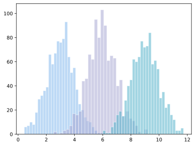
    


```python
# 面向对象方式 
Fig2, ax2 = plt.subplots() 
ax2.hist( x1, bins=30, alpha=0.5, histtype='stepfilled', color='#7CB5EC' ) 
ax2.hist( x2, bins=30, alpha=0.5, histtype='stepfilled', color='#A2A2D0' ) 
ax2.hist( x3, bins=30, alpha=0.5, histtype='stepfilled', color='#47ADC7' ) 
```


    (array([ 3.,  1.,  1.,  6., 10., 16., 19., 15., 28., 40., 45., 62., 60.,
            64., 77., 72., 73., 84., 58., 61., 54., 30., 35., 22., 25., 16.,
            12.,  3.,  3.,  5.]),
     array([ 6.01183817,  6.20259406,  6.39334995,  6.58410584,  6.77486173,
             6.96561762,  7.15637351,  7.3471294 ,  7.5378853 ,  7.72864119,
             7.91939708,  8.11015297,  8.30090886,  8.49166475,  8.68242064,
             8.87317653,  9.06393242,  9.25468831,  9.4454442 ,  9.63620009,
             9.82695598, 10.01771187, 10.20846776, 10.39922365, 10.58997954,
            10.78073543, 10.97149132, 11.16224721, 11.3530031 , 11.54375899,
            11.73451488]),
     [<matplotlib.patches.Polygon at 0x7b32e59c0230>])


    

    


## 图窗属性

### 坐标轴上下限

尽管Matplotlib会自动调整图窗为最佳的坐标轴上下限，但很多时候仍然需要手动设置，才能适应当时的情况。


```python
import matplotlib.pyplot as plt 
%matplotlib inline
```


```python
# 展示高清图 
from matplotlib_inline import backend_inline 
backend_inline.set_matplotlib_formats('svg') 

```


```python
# 准备数据 
x = [ 1, 2, 3, 4, 5 ] # 数据的 x 值 
y = [ 1, 8, 27, 64, 125 ] # 数据的 y 值 
```

现在设置其坐标轴上下限，有两种方法：lim法与axis法。

#### lim法

使用lim法时，Matlab方法与面向对象方法**首次出现区别**。


```python
# Matlab 方式（lim 法） 
Fig1 = plt.figure() 
plt.plot(x,y) 
plt.xlim(1,5) 
plt.ylim(1,125) 
```


    (1.0, 125.0)


    
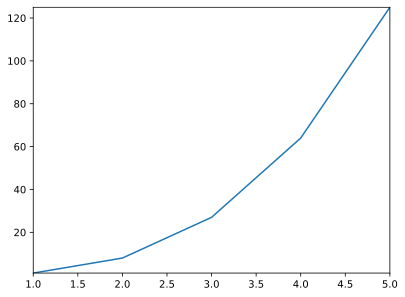
    


```python
# 面向对象方式（lim 法） 
Fig2, ax2 = plt.subplots() 
ax2.plot(x,y) 
ax2.set_xlim(1,5) 
ax2.set_ylim(1,125) 
```


    (1.0, 125.0)


    

    


#### axis法


```python
# Matlab 方式（axis 法） 
Fig5 = plt.figure() 
plt.plot(x,y) 
plt.axis([1, 5, 1, 125])
```


    (np.float64(1.0), np.float64(5.0), np.float64(1.0), np.float64(125.0))


    

    


```python
# 面向对象方式（axis 法） 
Fig6, ax6 = plt.subplots() 
ax6.plot(x,y) 
ax6.axis([1, 5, 1, 125])
```


    (np.float64(1.0), np.float64(5.0), np.float64(1.0), np.float64(125.0))


    

    


### 标题与轴名称

在这里，Matlab方式与面向对象方法将**最后一次出现区别**。


```python
# Matlab 方式 
Fig1 = plt.figure() 
plt.plot(x,y) 
plt.title('This is the title.') 
plt.xlabel('This is the xlabel') 
plt.ylabel('This is the ylabel')
```


    Text(0, 0.5, 'This is the ylabel')


    
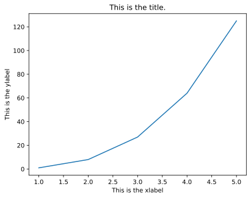
    


```python
# 面向对象方式 
Fig2, ax2 = plt.subplots() 
ax2.plot(x,y) 
ax2.set_title('This is the title.') 
ax2.set_xlabel('This is the xlabel') 
ax2.set_ylabel('This is the ylabel') 
```


    Text(0, 0.5, 'This is the ylabel')


    

    


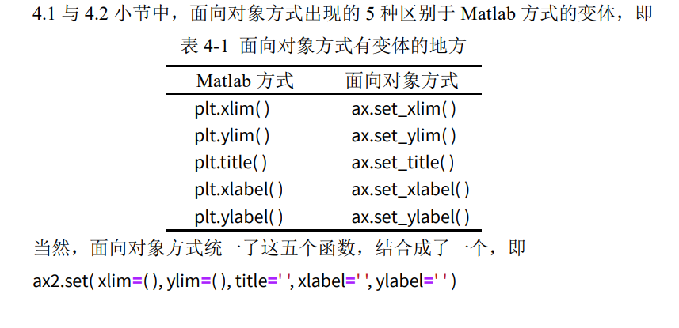


```python
# 面向对象方式 
Fig2, ax2 = plt.subplots() 
ax2.plot(x,y) 
ax2.set( xlim=(1, 5) , ylim=(1, 125), title='This is the title', xlabel='This is the xlabel', ylabel='This is the ylabel' ) 
```


    [(1.0, 5.0),
     (1.0, 125.0),
     Text(0.5, 1.0, 'This is the title'),
     Text(0.5, 0, 'This is the xlabel'),
     Text(0, 0.5, 'This is the ylabel')]


    
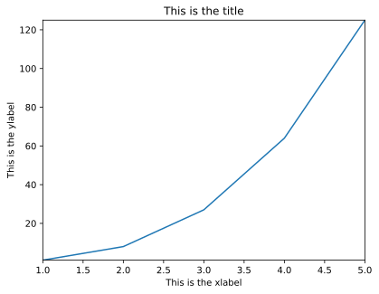
    


### 图例

一般图例会出现在二维图与统计图中，网格图则用的是颜色条。


```python
import matplotlib.pyplot as plt 
%matplotlib inline 

# 展示高清图 
from matplotlib_inline import backend_inline 
backend_inline.set_matplotlib_formats('svg') 

# 准备数据 
x = [ 1, 2, 3, 4, 5 ] # 数据的 x 值 
y1 = [ 1, 2, 3, 4, 5 ] # 数据的 y1 值 
y2 = [ 0, 0, 0, 0, 0 ] # 数据的 y2 值 
y3 = [ -1, -2, -3, -4, -5 ] # 数据的 y3 值
```


```python
# Matlab 方式 
Fig1 = plt.figure() 
plt.plot(x, y1, label='y=x') 
plt.plot(x, y2, label='y=0') 
plt.plot(x, y3, label='y=-x') 
plt.legend() 
```


    <matplotlib.legend.Legend at 0x78910447bb90>


    
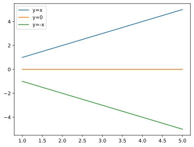
    


```python
# 面向对象方式 
Fig2, ax2 = plt.subplots() 
ax2.plot(x ,y1, label='y=x') 
ax2.plot(x ,y2, label='y=0') 
ax2.plot(x ,y3, label='y=-x') 
ax2.legend()
```


    <matplotlib.legend.Legend at 0x789103cf9970>


    

    


如果你不想展示某些线条的图例，只需去除该函数中的label关键字即可。

### 网格

给图形加上网格，美观又好看，多是一件美事啊。


```python
# Matlab 方式 
Fig1 = plt.figure() 
plt.plot(x, y1) 
plt.plot(x, y2) 
plt.plot(x, y3) 
plt.grid() 
```


    

    


```python
# 面向对象方式 
Fig2, ax2 = plt.subplots() 
ax2.plot(x, y1) 
ax2.plot(x, y2) 
ax2.plot(x, y3) 
ax2.grid() 

```


    

    


当然，grid()函数还有 color 与 linestyle 两个参数，这与 plot 里用法一致。 


```python
# Matlab 方式 
Fig1 = plt.figure() 
plt.plot(x, y1) 
plt.plot(x, y2) 
plt.plot(x, y3) 
plt.grid(color='#000000',linestyle='--') 

```


    
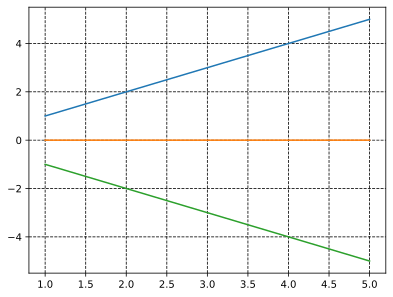
    

