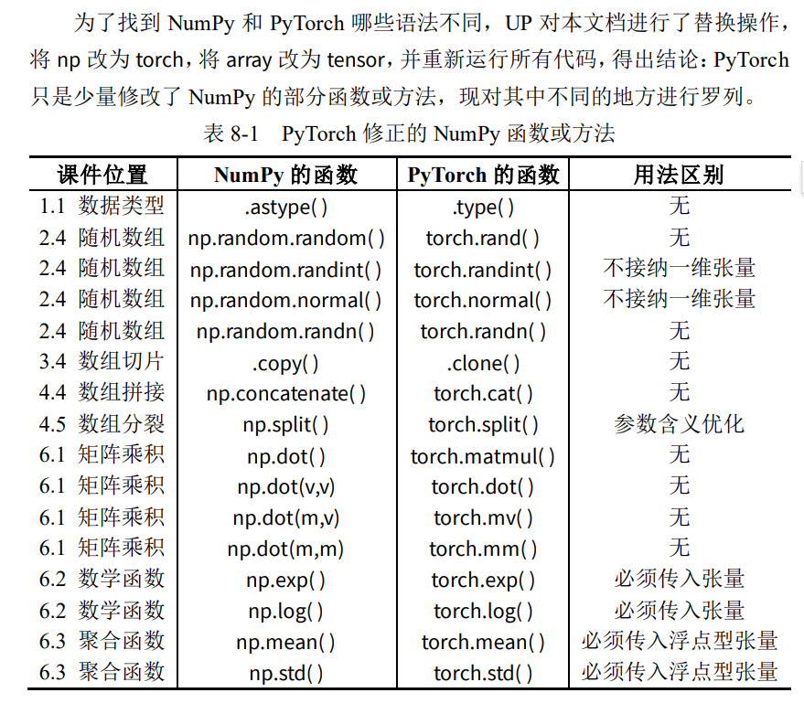

# Numpy

## 数组基础

### 数组类型

```python
import numpy as np
```

**（1）整数型数组与浮点型数组**

为克服列表的缺点，一个 NumPy 数组只容纳一种数据类型，以节约内存。

为方便起见，可将 NumPy 数组简单分为**整数型数组**与**浮点型数组**。

```python
# 整数型数组
arr1 = np.array( [1, 2, 3] )
print(arr1)
```

    [1 2 3]

```python
# 创建浮点型数组
arr2 = np.array( [1.0, 2, 3] ) # 内含浮点数，则为浮点型数组
print(arr2)
```

    [1. 2. 3.]

**（2）同化定理**

- 一个人的力量是无法改变全体的，在实际操作中要注意：
- 往整数型数组里插入浮点数，该浮点数会自动被截断为整数；
- 往浮点型数组里插入整数，该整数会自动升级为浮点数；

```python
# 整数型数组
arr1 = np.array( [1, 2, 3] )
arr1[0] = 100.9 # 插入浮点数，被截断，数组仍为整数型
print(arr1)
```

    [100   2   3]

```python
# 浮点型数组
arr2 = np.array( [1.0, 2, 3] )
arr2[1] = 10 # 插入整数型，被升级，数组仍为浮点型
print(arr2)
```

    [ 1. 10.  3.]

**（3）共同改变定理**

同化定理告诉我们，整数型数组和浮点型数组之间的界限十分严格，那么如何将这两种数据类型的数组进行相互转化呢？既然某一个人容易被集体所同化，那只要全体共同改变，自然就可以成功。

整数型数组和浮点型数组相互转换，规范的方法是使用 `.astype()` 方法。

```python
# 整数型数组
arr1 = np.array( [1, 2, 3] )
print(arr1)
```

    [1 2 3]

```python
# 整数型数组 ——> 浮点型数组
arr2 = arr1.astype(float)
print(arr2)
```

    [1. 2. 3.]

```python
# 浮点型数组 ——> 整数型数组
arr3 = arr2.astype(int)
print(arr3)
```

    [1 2 3]

除了上述方法，只要满足共同改变定理，整数型数组和浮点型数组仍然可以互相转换。最常见的是整数型数组在运算过程中升级为浮点型数组，示例如下。

不经意间的转化。整数型数组很好升级，但浮点型数组在运算过程中一般不会降级。

```python
# 整数型数组
arr = np.array( [1, 2, 3] )
print(arr)
```

    [1 2 3]

```python
# 整数型数组与浮点数做运算
print( arr + 0.0 )
print( arr * 1.0 )
```

    [1. 2. 3.]
    [1. 2. 3.]

```python
# 整数型数组遇到除法（即便是除以整数）
print( arr / 1 )
```

    [1. 2. 3.]

```python
# 验证了一下弹幕说的整除，确实无变化，仍然是整数
print( arr // 1 )
```

    [1 2 3]

```python
# 整数型数组与浮点型数组做运算
int_arr = np.array( [1, 2, 3] )
float_arr = np.array( [1.0, 2, 3] )
print( int_arr + float_arr )
```

    [2. 4. 6.]

### 数组维度

区分数组维数是看有几层中括号

现在以同一个序列进行举例

- 当数组有 1 层中括号，如`[1 2 3]`，则其为一维数组，其形状是 3 或 (3,) ；
- 当数组有 2 层中括号，如`[[1 2 3]]`，则其为二维数组，其形状是 (1,3) ；
- 当数组有 3 层中括号，如`[[[1 2 3]]]`，则其为三维数组，其形状是 (1,1,3) ；

可以看到形状是从最外层逐渐向内层研究的。

```python
arr1 = np.ones(3) # 传入形状 3
print(arr1) # 造出一维数组
```

    [1. 1. 1.]

```python
arr2 = np.ones((1,3)) # 传入形状(1,3)
print(arr2) # 造出二维数组
```

    [[1. 1. 1.]]

```python
arr3 = np.ones((1,1,3)) # 传入形状(1,1,3)
print(arr3) # 造出三维数组
```

    [[[1. 1. 1.]]]

```python
print( arr1.shape )
print( arr2.shape )
print( arr3.shape )
```

    (3,)
    (1, 3)
    (1, 1, 3)

大家可以随时留意一下数组的维度（通过中括号的数量），后面有些函数（比如数组的拼接函数）**需要两个数组是同维度的**。

**不同维度数组之间的转换**

一维数组转二维数组，还是二维数组转一维数组，均要使用的是数组的重塑方法 `.reshape()`，该方法需要传入重塑后的形状（shape）参数。

这个方法神奇的是，给定了其他维度的数值，剩下一个维度可以填-1，让它自己去计算。比如把一个 5 行 6 列的矩阵重塑为 3 行 10 列的矩阵，当列的参数 10 告诉它，行的参数直接可以用 -1 来替代，它会自己去用 30 除以 10 来计算。

```python
# 创建一维数组
arr1 = np.arange(10)
print(arr1)
```

    [0 1 2 3 4 5 6 7 8 9]

```python
# 升级为二维数组
arr2 = arr1.reshape( (1,-1) )
print(arr2)
```

    [[0 1 2 3 4 5 6 7 8 9]]

```python
# 接着，演示将二维数组降级为一维数组。

# 创建二维数组
arr2 = np.arange(10).reshape(2,5)
print(arr2)
```

    [[0 1 2 3 4]
     [5 6 7 8 9]]

```python
# 降级为一维数组
arr1 = arr2.reshape( -1 )
print(arr1)
```

    [0 1 2 3 4 5 6 7 8 9]

现规定，本讲义中，**将一维数组称为向量，二维数组称为矩阵**。

## 数组的创建

### 创建指定数组

当明确知道数组每一个元素的具体数值时，可以使用 `np.array()` 函数，将 Python 列表转化为 NumPy 数组。

```python
# 创建一维数组——向量
arr1 = np.array( [1,2,3] )
print(arr1)

```

    [1 2 3]

```python
# 创建二维数组——行矩阵
arr2 = np.array( [ [1,2,3] ] )
print(arr2)

```

    [[1 2 3]]

```python
# 创建二维数组——列矩阵
arr3 = np.array( [ [1],[2],[3] ] )
print(arr3)
```

    [[1]
     [2]
     [3]]

```python
# 创建二维数组——矩阵
arr4 = np.array( [ [1,2,3],[4,5,6] ] )
print(arr4)
```

    [[1 2 3]
     [4 5 6]]

### 创建递增矩阵

递增数组使用 `np.arange()` 函数进行创建（arange 全称是 array_range）。

```python
# 递增数组
arr1 = np.arange(10) # 从 0 开始，到 10 之前结束
print(arr1)
```

    [0 1 2 3 4 5 6 7 8 9]

```python
# 递增数组
arr2 = np.arange(10,20) # 从 10 开始，到 20 之前结束
print(arr2)
```

    [10 11 12 13 14 15 16 17 18 19]

```python
# 递增数组
arr3 = np.arange(1,21,2) # 从 1 开始，到 21 之前结束，步长为 2
print(arr3)
```

    [ 1  3  5  7  9 11 13 15 17 19]

### 创建同值数组

需要创建同值数组时，使用 `np.zeros()` 函数以及 `np.ones()` 函数。

```python
# 全 0 数组
arr1 = np.zeros( 3 ) # 形状为 3 的向量
print(arr1)
```

    [0. 0. 0.]

```python
# 全 1 数组
arr2 = np.ones( (1,3) ) # 形状为(1,3)的矩阵
print(arr2)
```

    [[1. 1. 1.]]

```python
# 全 3.14 数组
arr3 = 3.14 * np.ones( (2,3) ) # 形状为(2,3)的矩阵
print(arr3)
```

    [[3.14 3.14 3.14]
     [3.14 3.14 3.14]]

示例中隐藏了一个细节——两个函数输出的并不是整数型的数组，这可能是为了**避免插进去的浮点数被截断**，所以将其**设定为浮点型数组**。

### 创建随机数组

有时需要创建随机数组，那么可以使用 `np.random` 系列函数。

```python
# 0-1 均匀分布的浮点型随机数组
arr1 = np.random.random( 5 ) # 形状为 5 的向量
print( arr1 )
```

    [0.17593128 0.60237827 0.56871741 0.40539453 0.07398691]

```python
# 创建60-100范围内均匀分布的3行3列随机数组

print((100-60) * np.random.random( (3,3) ) + 60)
```

    [[70.12378428 74.65833113 77.79110921]
     [63.32638725 78.70237273 98.82988596]
     [78.42306248 73.99888889 97.39609976]]

```python
# 创建60-100范围内均匀分布的3行3列随机数组

print(40 * np.random.random( (3,3) ) + 60)
```

    [[66.53729126 90.07350472 76.49816862]
     [71.12735087 67.4131509  99.96389701]
     [77.59699272 80.88787569 95.05363915]]

```python
# 整数型随机数组，randint函数需要额外输入范围参数，本例中范围是 10-100。
arr2 = np.random.randint( 10,100,(1,15) ) # 形状为(1,15)的矩阵
print( arr2 )
```

    [[35 23 48 90 61 89 61 97 32 13 42 38 79 82 42]]

```python
# 服从正态分布的随机数组
arr3 = np.random.normal( 0,1,(2,3) ) # 形状为(2,3)的二维矩阵
print( arr3 )
```

    [[ 0.17390151  0.36271589 -0.44114682]
     [ 1.37977189 -0.035863   -0.4298722 ]]

```python
# 服从正态分布的随机数组，该函数需要额外输入正态参数
# 本例中均值为 0、标准差为 1，这种情况可直接使用 np.random.randn( )函数，只需要传入形状参数即可。
arr3 = np.random.normal( 0,1,(2,3) ) # 形状为(2,3)的二维矩阵
print( arr3 )
```

    [[-0.63295435  1.43790517 -1.78283098]
     [ 0.19547158 -0.41980791 -0.74568034]]

## 数组的索引

前面我们规定，将一维数组称为向量，将二维数组称为矩阵。

### 访问数组元素

与 Python 列表一致，访问 NumPy 数组元素时使用中括号，索引由 0 开始。

#### 访问向量

```python
# 创建向量
arr1 = np.arange( 1,10 )
print( arr1 )
```

    [1 2 3 4 5 6 7 8 9]

```python
# 访问元素
print( arr1[3] ) # 正着访问
print( arr1[-1] ) # 倒着访问
```

    4
    9

```python
# 修改数组元素
arr1[3] = 100;
print(arr1)
```

    [  1   2   3 100   5   6   7   8   9]

#### 访问矩阵

```python
# 创建矩阵
arr2 = np.array( [ [1,2,3],[4,5,6] ] )
print(arr2)
```

    [[1 2 3]
     [4 5 6]]

```python
# 访问元素
print( arr2[0,2] )
print( arr2[1,-2] )
```

    3
    5

```python
# 修改元素，浮点数 100.9 插入到整数型数组时被截断了。
arr2[1,1] = 100.9
print( arr2 )
```

    [[  1   2   3]
     [  4 100   6]]

### 花式索引

花式索引（Fancy indexing）又名“花哨的索引”，UP 认为不应该用“花哨”来形容，这里的 Fancy 应取“华丽的、巧妙的、奢华的、时髦的”之义。

上一小节访问单个元素时，向量用 arr1[x]，矩阵用 arr2[x,y]。逗号在矩阵里用于区分行与列，这一小节，逗号新增一个功能，且不会与矩阵里的逗号混淆。普通索引用一层中括号，花式索引用两层中括号。

#### 向量的花式索引

```python
# 创建向量
arr1 = np.arange(0,90,10)
print(arr1)
```

    [ 0 10 20 30 40 50 60 70 80]

```python
# 花式索引
# 含义：我想同时取 arr1 中索引为 0 和 2 的元素。
# 结果：[0, 20]。
# 对比：如果是普通索引 arr1[0] 只能得到 0。
print( arr1[ [0,2] ] )
```

    [ 0 20]

#### 矩阵的花式索引

```python
# 创建矩阵
arr2 = np.arange(1,17).reshape(4,4)
print(arr2)
```

    [[ 1  2  3  4]
     [ 5  6  7  8]
     [ 9 10 11 12]
     [13 14 15 16]]

```python
# 花式索引
# 含义：这里传入了两个列表。第一个列表 [0, 1] 代表行索引，第二个列表 [0, 1] 代表列索引。
# 配对规则：NumPy 会将它们配对使用。
# 取第 0 行，第 0 列的元素 -> 1
# 取第 1 行，第 1 列的元素 -> 6
# 结果：[1, 6]
# 注意：这不是取左上角的 2x2 子矩阵（那是切片 arr2[0:2, 0:2] 做的事），而是取具体的两个坐标点 (0,0) 和 (1,1)。
print( arr2[ [0,1] , [0,1] ] )
print( arr2[ [0,1,2] , [2,1,0] ] )
```

    [1 6]
    [3 6 9]

```python
# 修改数组元素
arr2[ [0,1,2,3] , [3,2,1,0] ] = 100
print(arr2)
```

    [[  1   2   3 100]
     [  5   6 100   8]
     [  9 100  11  12]
     [100  14  15  16]]

根据以上实例，花式索引输出的仍然是一个向量。

### 访问数组切片

#### 向量的切片

向量与列表切片的操作完全一致，因此本页内容在Python基础中均有涉及。

```python
import numpy as np
arr1 = np.arange(10)

print( arr1 )
print( arr1[ 1 : 4 ] ) # 从索引[1]开始，切到索引[4]之前
print( arr1[ 1 : ] ) # 从索引[1]开始，切到结尾
print( arr1[ : 4 ] ) # 从数组开头开始，切到索引[4]之前
```

    [0 1 2 3 4 5 6 7 8 9]
    [1 2 3]
    [1 2 3 4 5 6 7 8 9]
    [0 1 2 3]

```python
print( arr1 )
print( arr1[ 2 : -2 ] ) # 切除开头 2 个和结尾 2 个
print( arr1[ 2 : ] ) # 切除开头 2 个
print( arr1[ : -2 ] ) # 切除结尾 2 个
```

    [0 1 2 3 4 5 6 7 8 9]
    [2 3 4 5 6 7]
    [2 3 4 5 6 7 8 9]
    [0 1 2 3 4 5 6 7]

```python
print( arr1 )
print( arr1[ : : 2 ] ) # 每 2 个元素采样一次
print( arr1[ : : 3 ] ) # 每 3 个元素采样一次
print( arr1[ 1 : -1 : 2 ] ) # 切除一头一尾后，每 2 个元素采样一次
```

    [0 1 2 3 4 5 6 7 8 9]
    [0 2 4 6 8]
    [0 3 6 9]
    [1 3 5 7]

#### 矩阵的切片

```python
arr2 = np.arange(1,21).reshape(4,5)
print( arr2 )
```

    [[ 1  2  3  4  5]
     [ 6  7  8  9 10]
     [11 12 13 14 15]
     [16 17 18 19 20]]

```python
print( arr2[ 1:3 , 1:-1 ] ) # 矩阵切片初体验
```

    [[ 7  8  9]
     [12 13 14]]

```python
print( arr2[ ::3 , ::2 ] ) # 跳跃采样
```

    [[ 1  3  5]
     [16 18 20]]

#### 提取矩阵的行

```python
import numpy as np
arr3 = np.arange(1,21).reshape(4,5)
print( arr3 )
```

    [[ 1  2  3  4  5]
     [ 6  7  8  9 10]
     [11 12 13 14 15]
     [16 17 18 19 20]]

```python
print( arr3[ 2 , : ] ) # 提取第 2 行
```

    [11 12 13 14 15]

```python
print( arr3[ 1:3 , : ] ) # 提取 1 至 2 行
```

    [[ 6  7  8  9 10]
     [11 12 13 14 15]]

```python
# 考虑代码的简洁，当提取矩阵的某几行时可简写，但是提取列的时候不可以进行简写

print( arr3[ 2 , : ] ) # 规范的提取行
print( arr3[2] ) # 简便的提取行
```

    [11 12 13 14 15]
    [11 12 13 14 15]

#### 提取矩阵的列

基于矩阵的切片功能，我们可以提取其部分列。

```python
arr4 = np.arange(1,21).reshape(4,5)
print( arr4 )
```

    [[ 1  2  3  4  5]
     [ 6  7  8  9 10]
     [11 12 13 14 15]
     [16 17 18 19 20]]

```python
print( arr4[ : , 2 ] ) # 提取第 2 列（注意，输出的是向量）
```

    [ 3  8 13 18]

```python
print( arr4[ : , 1:3 ] ) # 提取 1 至 2 列
```

    [[ 2  3]
     [ 7  8]
     [12 13]
     [17 18]]

值得注意的是，提取某一个单独的列时，出来的结果是一个向量。其实这么做只是为了省空间，我们知道，列矩阵必须用两层中括号来存储，而形状为 1000 的向量，自然比形状为(1000,1)的列矩阵更省空间（节约了 1000 对括号）。

有点离谱

如果你真的想要提取一个列矩阵出来，示例可以如下：

```python
arr5 = np.arange(1,16).reshape(3,5)
print( arr5 )
```

    [[ 1  2  3  4  5]
     [ 6  7  8  9 10]
     [11 12 13 14 15]]

```python
cut = arr5[ : , 2 ] # 提取第 2 列为向量
print( cut )
```

    [ 3  8 13]

```python
cut = cut.reshape( (-1,1) ) # 升级为列矩阵
print(cut)

```

    [[ 3]
     [ 8]
     [13]]

### 数组切片仅是视图

#### 数组切片仅是视图

与 Python 列表和 Matlab 不同，NumPy 数组的切片仅仅是原数组的一个视图。换言之，NumPy 切片并不会创建新的变量，示例如下。

```python
arr = np.arange(10) # 创建原数组 arr
print(arr)

```

    [0 1 2 3 4 5 6 7 8 9]

```python
cut = arr[ : 3 ] # 创建 arr 的切片 cut
print(cut)
```

    [0 1 2]

```python
cut[0] = 100 # 对切片的数值进行修改
print(cut)
```

    [100   1   2]

```python
print(arr) # 原数组也被修改
```

    [100   1   2   3   4   5   6   7   8   9]

习惯 Matlab 的用户可能无法理解，但其实这正是 NumPy 的精妙之处。试想一下，一个几百万条数据的数组，每次切片时都创建一个新变量，势必造成大量的内存浪费。因此，NumPy 的切片被设计为原数组的视图是极好的。

深度学习中为节省内存，将多次使用 arr[:] = <表达式> 来替代 arr = <表达式>。

#### 备份切片为新变量

如果真的需要为切片创建新变量（这种情况很稀少），使用 .copy( ) 方法。

```python
arr = np.arange(10) # 创建一个 0 到 10 的向量 arr
print(arr)
```

    [0 1 2 3 4 5 6 7 8 9]

```python
copy = arr[ : 3 ] .copy() # 创建 arr 的拷贝切片
print(copy)
```

    [0 1 2]

```python
copy [0] = 100 # 对拷贝切片的数值进行修改
print(copy)
```

    [100   1   2]

```python
print(arr) # 原数组不为所动

```

    [0 1 2 3 4 5 6 7 8 9]

### 数组赋值仅是绑定

#### 数组赋值仅是绑定

与 NumPy 数组的切片一样，NumPy 数组完整的赋值给另一个数组，也只是绑定。换言之，NumPy 数组之间的赋值并不会创建新的变量，示例如下。

```python
arr1 = np.arange(10) # 创建一个 0 到 10 的数组变量 arr
print(arr1)

```

    [0 1 2 3 4 5 6 7 8 9]

```python
arr2 = arr1 # 把数组 1 赋值给另一个数组 2
print(arr2)
```

    [0 1 2 3 4 5 6 7 8 9]

```python
arr2[0] = 100 # 修改数组 2
print(arr2)
```

    [100   1   2   3   4   5   6   7   8   9]

```python
print(arr1) # 原数组也被修改
```

    [100   1   2   3   4   5   6   7   8   9]

此特性的出现仍然是为了节约空间，破局的方法仍然与前面相同。

#### 复制数组为新变量

如果真的需要赋给一个新数组，使用 .copy( ) 方法。

```python
arr1 = np.arange(10) # 创建一个 0 到 10 的数组变量 arr
print(arr1)
arr2 = arr1.copy() # 把数组 1 的拷贝赋值给另一个数组 2
print(arr2)
arr2[0] = 100 # 修改数组 2
print(arr2)

```

    [0 1 2 3 4 5 6 7 8 9]
    [0 1 2 3 4 5 6 7 8 9]
    [100   1   2   3   4   5   6   7   8   9]

```python
print(arr1) # 查看数组 1

```

    [0 1 2 3 4 5 6 7 8 9]

## 数组的变形

### 数组的转置

数组的转置方法为 .T，**其只对矩阵有效**，因此遇到向量要先将其转化为矩阵。

#### 向量的转置

```python
arr1 = np.arange(1,4) # 创建向量
print(arr1)
```

    [1 2 3]

```python
arr2 = arr1.reshape( (1,-1) ) # 升级为矩阵
print(arr2)

# 可以看到这里与我先前的认知产生了冲突，矩阵一定是二维的，两个中括号
# 而向量可以看到是一维的
```

    [[1 2 3]]

```python
arr3 = arr2.T # 行矩阵的转置
print(arr3)
```

    [[1]
     [2]
     [3]]

#### 矩阵的转置

行矩阵的转置刚刚已经演示过了，列矩阵的转置如下面示例所示。

```python
arr1 = np.arange(3).reshape(3,1) # 创建列矩阵
print(arr1)
```

    [[0]
     [1]
     [2]]

```python
arr2 = arr1.T # 列矩阵的转置
print(arr2) # 结果为行矩阵
```

    [[0 1 2]]

普通矩阵的转置如示例所示。

```python
arr1 = np.arange(4).reshape(2,2) # 创建矩阵
print(arr1)
```

    [[0 1]
     [2 3]]

```python
arr2 = arr1.T # 矩阵的转置
print(arr2)
```

    [[0 2]
     [1 3]]

### 数组的翻转

数组的翻转方法有两个，一个是上下翻转的 np.flipud( ) ，表示 up-down；一个是左右翻转的 np.fliplr( )，表示 left-right。其中，向量只能使用 np.flipud( )，在数学中，~~向量并不是横着排的，而是竖着排的~~。

注意：
- np.flipud()（flip up-down）确实容易让人误解为“垂直方向”。
- 本质：flipud 实际上是 沿着 Axis 0 翻转。
- 在 2D 矩阵中：Axis 0 是“行索引”，翻转行索引 = 上下翻转。
- 在 1D 数组中：Axis 0 是唯一的轴。翻转它 = 反转数组顺序

#### 向量的翻转

```python
# 创建向量
arr1 = np.arange(10)
print( arr1 )
```

    [0 1 2 3 4 5 6 7 8 9]

```python
# 翻转向量
arr_ud = np.flipud(arr1)
print( arr_ud )
```

    [9 8 7 6 5 4 3 2 1 0]

#### 矩阵的翻转

```python
# 创建矩阵
arr2 = np.arange(1,21).reshape(4,5)
print( arr2 )
```

    [[ 1  2  3  4  5]
     [ 6  7  8  9 10]
     [11 12 13 14 15]
     [16 17 18 19 20]]

```python
# 左右翻转
arr_lr = np.fliplr(arr2)
print( arr_lr )
```

    [[ 5  4  3  2  1]
     [10  9  8  7  6]
     [15 14 13 12 11]
     [20 19 18 17 16]]

```python
# 上下翻转
arr_ud = np.flipud(arr2)
print( arr_ud )

```

    [[16 17 18 19 20]
     [11 12 13 14 15]
     [ 6  7  8  9 10]
     [ 1  2  3  4  5]]

### 数组的重塑

想要重塑数组的形状，需要用到 .reshape( ) 方法。

前面说过，给定了其他维度的数值，剩下一个维度可以填-1，让它自己去计算。比如把一个 5 行 6 列的矩阵重塑为 3 行 10 列的矩阵，当列的参数 10 告诉它，行的参数直接可以用-1 来替代，它会自己去用 30 除以 10 来计算。

#### 向量的变形

```python
arr1 = np.arange(1,10) # 创建向量
print(arr1)
```

    [1 2 3 4 5 6 7 8 9]

```python
arr2 = arr1.reshape(3,3) # 变形为矩阵
print(arr2)
```

    [[1 2 3]
     [4 5 6]
     [7 8 9]]

#### 矩阵的变形

```python
arr1 = np.array( [ [1,2,3],[4,5,6] ] ) # 创建矩阵
print(arr1)
```

    [[1 2 3]
     [4 5 6]]

```python
arr2 = arr1.reshape(6) # 变形为向量
print(arr2)
```

    [1 2 3 4 5 6]

```python
arr3 = arr1.reshape(1,6) # 变形为矩阵
print(arr3)
```

    [[1 2 3 4 5 6]]

### 数组的拼接

#### 向量的拼接

两个向量拼接，将得到一个新的加长版向量。

```python
import numpy as np
```

```python
# 创建向量 1
arr1 = np.array( [1,2,3] )
print(arr1)

```

    [1 2 3]

```python
# 创建向量 2
arr2 = np.array( [4,5,6] )
print(arr2)
```

    [4 5 6]

```python
# 拼接
arr3 = np.concatenate( [arr1,arr2] )
print(arr3)
```

    [1 2 3 4 5 6]

#### 矩阵的拼接

两个矩阵可以按不同的维度进行拼接，但拼接时必须注意维度的吻合。

```python
# 创建数组 1
arr1 = np.array( [[1,2,3],[ 4,5,6]] )
print(arr1)

```

    [[1 2 3]
     [4 5 6]]

```python
# 创建数组 2
arr2 = np.array( [[7,8,9],[10,11,12]] )
print(arr2)
```

    [[ 7  8  9]
     [10 11 12]]

```python
# 按第二个维度（列）拼接
arr4 = np.concatenate( [arr1,arr2] ,axis=1 )
print(arr4)
```

    [[ 1  2  3  7  8  9]
     [ 4  5  6 10 11 12]]

```python
# 按第一个维度（行）拼接
arr3 = np.concatenate( [arr1,arr2] ) # 默认参数 axis=0
print(arr3)

```

    [[ 1  2  3]
     [ 4  5  6]
     [ 7  8  9]
     [10 11 12]]

### 数组的分裂

#### 向量的分裂

向量分裂，将得到若干个更短的向量。

```python
# 创建向量
arr = np.arange(10,100,10)
print(arr)
```

    [10 20 30 40 50 60 70 80 90]

```python
# 分裂数组
arr1,arr2,arr3 = np.split( arr , [2,8] )
print(arr1)
print(arr2)
print(arr3)
```

    [10 20]
    [30 40 50 60 70 80]
    [90]

np.split( )函数中，给出的第二个参数`[2,8]`表示在索引`[2]`和索引`[8]`的位置截断。

#### 矩阵的分裂

矩阵的分裂同样可以按不同的维度进行，分裂出来的均为矩阵。

```python
# 创建矩阵
arr = np.arange(1,9).reshape(2,4)
print(arr)

```

    [[1 2 3 4]
     [5 6 7 8]]

```python
# 按第二个维度（列）分裂
arr1,arr2,arr3 = np.split( arr , [1,3] , axis=1 )
print( arr1 , '\n\n' , arr2 , '\n\n' , arr3 )
```

    [[1]
     [5]]

     [[2 3]
     [6 7]]

     [[4]
     [8]]

```python
# 按第一个维度（行）分裂
arr1,arr2 = np.split(arr,[1]) # 默认参数 axis=0
print(arr1 , '\n\n' , arr2) # 注意输出的是矩阵
```

    [[1 2 3 4]]

     [[5 6 7 8]]

## 数组的运算

### 数组与系数之间的运算

NumPy的运算符和Python基础的运算符作用相同。这里仅仅以矩阵为例，向量与系数的操作与之相同。

```python
# 创建矩阵
arr = np.arange(1,9).reshape(2,4)
print( arr )
```

```python
print( arr + 10 ) # 加法，每一项加上对应元素。
```

    [[11 12 13 14]
     [15 16 17 18]]

```python
print( arr - 10 ) # 减法

```

    [[-9 -8 -7 -6]
     [-5 -4 -3 -2]]

```python
print( arr * 10 ) # 乘法
```

    [[10 20 30 40]
     [50 60 70 80]]

```python
print( arr / 10 ) # 除法

```

    [[0.1 0.2 0.3 0.4]
     [0.5 0.6 0.7 0.8]]

```python
print( arr ** 2) # 平方

```

    [[ 1  4  9 16]
     [25 36 49 64]]

```python
print( arr // 6) # 取整

```

    [[0 0 0 0]
     [0 1 1 1]]

```python
print( arr % 6) # 取余
```

    [[1 2 3 4]
     [5 0 1 2]]

#### 数组与数组之间的运算

同维度数组间的运算即对应元素之间的运算，这里仅以矩阵为例，向量与向量的操作与之相同。

```python
# 创建矩阵
arr1 = np.arange(-1,-9,-1).reshape(2,4)
arr2 = -arr1
print (arr1, "\n\n", arr2)
```

    [[-1 -2 -3 -4]
     [-5 -6 -7 -8]]

     [[1 2 3 4]
     [5 6 7 8]]

```python
print( arr1 + arr2 ) # 加法
```

    [[0 0 0 0]
     [0 0 0 0]]

```python
print( arr1 - arr2 ) # 减法，每项对应相减
```

    [[ -2  -4  -6  -8]
     [-10 -12 -14 -16]]

```python
print( arr1 * arr2 ) # 乘法，每项对应相乘，与我之前所学的矩阵乘法差别似乎挺大
```

    [[ -1  -4  -9 -16]
     [-25 -36 -49 -64]]

```python
print( arr1 / arr2 ) # 除法，每项对应相除
```

    [[-1. -1. -1. -1.]
     [-1. -1. -1. -1.]]

```python
print( arr1 ** arr2) # 幂方，每项对应进行幂方
```

    [[      -1        4      -27      256]
     [   -3125    46656  -823543 16777216]]

上述乘法是遵循对应元素相乘的，你可以称之为“逐元素乘积”。

那么如何实现线性代数中的“矩阵级乘法”呢？后面会介绍到相关函数。

### 广播

上文是同形状数组之间的逐元素运算，本节讲解不同形状的数组之间的运算。本课件仅讨论二维数组之内的情况，不同形状的数组之间的运算有以下规则：

- 如果是向量与矩阵之间做运算，向量自动升级为行矩阵；
- 如果某矩阵是行矩阵或列矩阵，则其被广播，以适配另一个矩阵的形状。

#### 向量被广播

当一个形状为(x,y)的矩阵与一个向量做运算时，要求该向量的形状必须为 y，运算时向量会**自动升级成形状为(1,y)的行矩阵**，该形状为(1,y)的行矩阵再**自动被广播为形状为(x,y)的矩阵**，这样就与另一个矩阵的形状适配了。

如何理解？
当你在 NumPy 中写 矩阵 \* 向量 时，底层逻辑确实是：

- 复制扩充：NumPy 会在内存中（虚拟地）把这个向量沿着缺失的维度“复制”多份，直到它的形状和矩阵一样。
- 对应相乘：然后两个形状相同的数组进行“对应位置元素相乘”。

```python
# 向量
arr1 = np.array([-100,0,100])
print(arr1)

```

    [-100    0  100]

```python
# 矩阵
arr2 = np.random.random( (10,3) ) # 生成10行3列符合均匀分布的在0-1之间的随机数
print(arr2)
```

    [[0.5424101  0.14755969 0.47123895]
     [0.82583782 0.55121481 0.43939141]
     [0.4983497  0.40566339 0.52970638]
     [0.08229524 0.00968612 0.73838025]
     [0.69708932 0.73879245 0.95158036]
     [0.56185074 0.56189898 0.38051903]
     [0.3856772  0.10558253 0.84706093]
     [0.89688485 0.7225091  0.90903447]
     [0.07965262 0.35894269 0.10446375]
     [0.94437005 0.84989319 0.44591064]]

```python
# 广播
print(arr1*arr2)
```

    [[-54.24101008   0.          47.12389536]
     [-82.5837816    0.          43.93914112]
     [-49.83496989   0.          52.97063829]
     [ -8.22952442   0.          73.83802537]
     [-69.70893182   0.          95.1580363 ]
     [-56.18507448   0.          38.05190302]
     [-38.56772024   0.          84.70609337]
     [-89.68848454   0.          90.90344683]
     [ -7.96526175   0.          10.44637509]
     [-94.43700487   0.          44.59106385]]

```python
# 广播
print(arr1+arr2)
```

    [[-9.94575899e+01  1.47559693e-01  1.00471239e+02]
     [-9.91741622e+01  5.51214813e-01  1.00439391e+02]
     [-9.95016503e+01  4.05663386e-01  1.00529706e+02]
     [-9.99177048e+01  9.68612058e-03  1.00738380e+02]
     [-9.93029107e+01  7.38792445e-01  1.00951580e+02]
     [-9.94381493e+01  5.61898982e-01  1.00380519e+02]
     [-9.96143228e+01  1.05582526e-01  1.00847061e+02]
     [-9.91031152e+01  7.22509098e-01  1.00909034e+02]
     [-9.99203474e+01  3.58942688e-01  1.00104464e+02]
     [-9.90556300e+01  8.49893194e-01  1.00445911e+02]]

#### 列矩阵被广播

当一个形状为(x,y)的矩阵与一个列矩阵做运算时，要求该列矩阵的形状必须为(x,1)，该形状为(x,1)的列矩阵再自动被广播为形状为(x,y)的矩阵，这样就与另一个矩阵的形状适配了。

```python
# 列矩阵
arr1 = np.arange(3).reshape(3,1)
print(arr1)
```

    [[0]
     [1]
     [2]]

```python
# 矩阵
arr2 = np.ones( (3,5) )
print(arr2)
```

    [[1. 1. 1. 1. 1.]
     [1. 1. 1. 1. 1.]
     [1. 1. 1. 1. 1.]]

```python
# 广播
print(arr1*arr2)
```

    [[0. 0. 0. 0. 0.]
     [1. 1. 1. 1. 1.]
     [2. 2. 2. 2. 2.]]

#### 行矩阵与列矩阵同时被广播

当一个形状为(1,y)的行矩阵与一个形状为(x,1) 的列矩阵做运算时，这俩矩阵**都**会被自动广播为**形状为(x,y)的矩阵**，这样就互相适配了。

```python
# 向量
arr1 = np.arange(3)
print(arr1)
```

    [0 1 2]

```python
# 列矩阵
arr2 = np.arange(3).reshape(3,1)
print(arr2)
```

    [[0]
     [1]
     [2]]

```python
# 广播
print(arr1*arr2)
```

    [[0 0 0]
     [0 1 2]
     [0 2 4]]

## 数组的函数

### 矩阵乘积

上一章中的乘法都是“逐元素相乘”，这里介绍线性代数中的矩阵乘积，本节只需要使用 np.dot( ) 函数。

当矩阵乘积中混有向量时，根据需求，其可充当行矩阵，也可充当列矩阵，但**混有向量时输出结果必为向量**。

#### 向量与向量的乘积

设两个向量的形状按前后顺序分别是 5 以及 5 。从矩阵乘法的角度，有(1,5)\*(5,1) = (1,1)，因此输出的应该是形状为 1 的向量。

```python
# 创建向量
arr1 = np.arange(5)
arr2 = np.arange(5)
print(arr1)
print(arr2)

```

    [0 1 2 3 4]
    [0 1 2 3 4]

```python
# 矩阵乘积
print( np.dot(arr1,arr2) )
```

    30

#### 向量与矩阵的乘积

设向量的形状是 5，矩阵的形状是 (5,3) 。从矩阵乘法的角度，有(1,5)\*(5,3) = (1,3)，因此输出的应该是形状为 3 的向量。

```python
# 创建数组
arr1 = np.arange(5)
arr2 = np.arange(15).reshape(5,3)
print(arr1, "\n")
print(arr2)

```

    [0 1 2 3 4]

    [[ 0  1  2]
     [ 3  4  5]
     [ 6  7  8]
     [ 9 10 11]
     [12 13 14]]

```python
# 矩阵乘积
print( np.dot(arr1,arr2) )
```

    [ 90 100 110]

```python
# 矩阵乘积
arr3 = np.arange(15).reshape(3, 5)

print(arr1, "\n\n", arr3)
```

    [0 1 2 3 4]

     [[ 0  1  2  3  4]
     [ 5  6  7  8  9]
     [10 11 12 13 14]]

```python
# 矩阵乘积
print( np.dot(arr3,arr1) )
```

    [ 30  80 130]

可以看到，向量既可以作为行矩阵也可以作为列矩阵参与运算，但维度一定要行列匹配，同时最后向量和矩阵的乘积必定为向量。也就是下面要看的矩阵和向量的乘积，看来我还挺会发散的。

#### 矩阵与向量的乘积

设矩阵的形状是 (3,5) ，向量的形状是 5。从矩阵乘法的角度，有(3,5)\*(5,1) = (3,1)，因此输出的应该是形状为 3 的向量。

```python
# 创建数组
arr1 = np.arange(15).reshape(3,5)
arr2 = np.arange(5)
print(arr1)
print(arr2)
```

    [[ 0  1  2  3  4]
     [ 5  6  7  8  9]
     [10 11 12 13 14]]
    [0 1 2 3 4]

```python
# 矩阵乘积
print( np.dot(arr1,arr2) )

```

    [ 30  80 130]

#### 矩阵与矩阵的乘积

设两个矩阵的形状按前后顺序分别为(5, 2)以及(2, 8)。从矩阵乘法的角度，有(5,2)\*(2,8)=(5,8)，因此输出的应该是形状为(5,8)的矩阵。

```python
# 创建数组 1
arr1 = np.arange(10).reshape(5,2)
print(arr1)
```

    [[0 1]
     [2 3]
     [4 5]
     [6 7]
     [8 9]]

```python
# 创建数组 2
arr2 = np.arange(16).reshape(2,8)
print(arr2)
```

    [[ 0  1  2  3  4  5  6  7]
     [ 8  9 10 11 12 13 14 15]]

```python
# 矩阵乘积
print( np.dot(arr1,arr2) )

```

    [[  8   9  10  11  12  13  14  15]
     [ 24  29  34  39  44  49  54  59]
     [ 40  49  58  67  76  85  94 103]
     [ 56  69  82  95 108 121 134 147]
     [ 72  89 106 123 140 157 174 191]]

### 数学函数

Numpy设计了很多数学函数，这里距离其中最重要、最常见的几个。

```python
# 绝对值函数
arr_v = np.array([-10, 0, 10])
abs_v = np.abs(arr_v)

print('原数组是: ', arr_v)
print('绝对值是: ', abs_v)
```

    原数组是:  [-10   0  10]
    绝对值是:  [10  0 10]

```python
# 三角函数
theta = np.arange(3) * np.pi / 2
sin_v = np.sin(theta)
cos_v = np.cos(theta)
tan_v = np.tan(theta)
print( '原数组是：' , theta )
print( '正弦值是：' , sin_v )
print( '余弦值是：' , cos_v )
print( '正切值是：' , tan_v )
```

    原数组是： [0.         1.57079633 3.14159265]
    正弦值是： [0.0000000e+00 1.0000000e+00 1.2246468e-16]
    余弦值是： [ 1.000000e+00  6.123234e-17 -1.000000e+00]
    正切值是： [ 0.00000000e+00  1.63312394e+16 -1.22464680e-16]

```python
# 指数函数
x = np.arange(1,4)
print( 'x =' , x )
print( 'e^x =' , np.exp(x) )
print( '2^x =' , 2**x )
print( '10^x = ' , 10**x )

```

    x = [1 2 3]
    e^x = [ 2.71828183  7.3890561  20.08553692]
    2^x = [2 4 8]
    10^x =  [  10  100 1000]

```python
# 对数函数，甚至还用到了换底公式
x = np.array( [1,10,100,1000] )
print( 'x =' , x )
print( 'ln(x) =' , np.log(x) )
print( 'log2(x) =' , np.log(x) / np.log(2) )
print( 'log10(x) =' , np.log(x) / np.log(10) )
```

    x = [   1   10  100 1000]
    ln(x) = [0.         2.30258509 4.60517019 6.90775528]
    log2(x) = [0.         3.32192809 6.64385619 9.96578428]
    log10(x) = [0. 1. 2. 3.]

### 聚合函数

聚合很有用，这里用矩阵进行演示，向量与之一致，但没有 axis 参数。以下在注释中介绍了6个最重要的聚合函数，其用法完全一致，但仅仅演示其中3个。

```python
# 最大值函数 np.max( )与最小值函数 np.min( )
arr = np.random.random((2,3))
print( arr )
print( '按维度一求最大值：' , np.max(arr,axis=0) )
print( '按维度二求最大值：' , np.max(arr,axis=1) )
print( '整体求最大值：' , np.max(arr) )

# 之前axis=0情况不都是按照行合并或者裂变吗？怎么这里为0时算的是每一列的最大值？
# 核心定义：Axis 是“刀口”的方向
# axis=N 永远表示：沿着第 N 维的方向进行操作。
```

    [[0.1896318  0.28361532 0.20871848]
     [0.17066469 0.70321325 0.20348921]]
    按维度一求最大值： [0.1896318  0.70321325 0.20871848]
    按维度二求最大值： [0.28361532 0.70321325]
    整体求最大值： 0.7032132487882445

```python
# 求和函数 np.sum( )与求积函数 np.prod( )
arr = np.arange(10).reshape(2,5)
print( arr )
print( '按维度一求和：' , np.sum(arr,axis=0) )
print( '按维度二求和：' , np.sum(arr,axis=1) )
print( '整体求和：' , np.sum(arr) )
```

    [[0 1 2 3 4]
     [5 6 7 8 9]]
    按维度一求和： [ 5  7  9 11 13]
    按维度二求和： [10 35]
    整体求和： 45

```python
# 均值函数 np.mean( )与标准差函数 np.std( )
arr = np.arange(10).reshape(2,5)
print( arr )
print( '按维度一求平均：' , np.mean(arr,axis=0) )
print( '按维度二求平均：' , np.mean(arr,axis=1) )
print( '整体求平均：' , np.mean(arr) )
```

    [[0 1 2 3 4]
     [5 6 7 8 9]]
    按维度一求平均： [2.5 3.5 4.5 5.5 6.5]
    按维度二求平均： [2. 7.]
    整体求平均： 4.5

- 当 axis=0 时，最终结果与每一行的元素个数一致；
- 当 axis=1 时，最终结果与每一列的元素个数一致。

考虑到大型数组难免有缺失值，以上聚合函数碰到缺失值时会报错，因此出现了聚合函数的安全版本，即计算时忽略缺失值：np.nansum( )、np.nanprod( ) 、np.nanmean( )、np.nanstd( )、np.nanmax( )、np.nanmin( )。

## 布尔型数组

除了整数型数组和浮点型数组，还有一种有用的数组类型——布尔型数组。

### 创建布尔型数组

由于Numpy的主要数据类型是整数型数组或浮点型数组，因此布尔型数组的产生离不开大小比较。

#### 数组与系数比较

```python
import numpy as np
```

```python
# 创建数组
arr = np.arange(1,7).reshape(2,3)
print(arr)
```

    [[1 2 3]
     [4 5 6]]

```python
# 数组与数字作比较
print( arr >= 4 )
```

    [[False False False]
     [ True  True  True]]

#### 同维数组比较

```python
import numpy as np
```

```python
# 创建同维数组
arr1 = np.arange(1,6)
arr2 = np.flipud(arr1)
print(arr1)
print(arr2)
```

    [1 2 3 4 5]
    [5 4 3 2 1]

```python
# 同维度数组作比较
print( arr1 > arr2)
```

    [False False False  True  True]

#### 同时比较多个条件

Python基础里，同时检查多个条件使用的与、或、非是and、or、not

但Numpy中使用的是`&`、`|`、`~`

```python
import numpy as np
```

```python
# 创建数组
arr = np.arange(1,10)
print(arr)
```

    [1 2 3 4 5 6 7 8 9]

```python
# 多个条件
print( (arr < 4) | (arr > 6) )
```

    [ True  True  True False False False  True  True  True]

### 布尔型数组中True的数量

有三个关于True数量的有用函数，分别是np.sum()、np.any()、np.all()

#### np.sum()函数

统计布尔型数组里True的个数

```python
# 创建一个形状为 10000 的标准正态分布数组
arr = np.random.normal( 0,1,10000 )
```

```python
# 统计该分布中绝对值小于 1 的元素个数
num = np.sum( np.abs(arr) < 1 )
print( num )
```

    6849

#### np.any()函数

只要布尔型数组里含有一个及其以上的True，就返回True

```python
# 创建同维数组
arr1 = np.arange(1,10)
arr2 = np.flipud(arr1)
print(arr1)
print(arr2)
```

    [1 2 3 4 5 6 7 8 9]
    [9 8 7 6 5 4 3 2 1]

```python
# 统计这两个数组里是否有共同元素，从结果来看，arr1 与 arr2 里含有共同元素，那就是 5。
print( np.any( arr1 == arr2 ) )
```

    True

```python
### np.all()函数

当布尔型数组里全是 True 时，才返回 True
```

```python
# 模拟英语六级的成绩，创建 100000 个样本
arr = np.random.normal( 500,70,100000 )
```

```python
# 判断是否所有考生的分数都高于 250
print( np.all( arr > 250 ) )

```

    False

### 布尔型数组作为掩码

若一个普通数组和一个布尔型数组的维度相同，可以将布尔型数组作为普通数组的掩码，这样可以对普通数组中的元素作筛选。

#### 筛选出数组中大于、等于或小于某个数字的元素

```python
# 创建数组
arr = np.arange(1,13).reshape(3,4)
print(arr)
```

    [[ 1  2  3  4]
     [ 5  6  7  8]
     [ 9 10 11 12]]

```python
# 数组与数字作比较
print( arr > 4 )
```

    [[False False False False]
     [ True  True  True  True]
     [ True  True  True  True]]

```python
# 筛选出 arr > 4 的元素
print( arr[ arr > 4 ] )
```

    [ 5  6  7  8  9 10 11 12]

注意，这个矩阵进行掩码操作后，退化为了向量。

#### 筛选出数组逐元素比较的结果

```python
# 创建同维数组
arr1 = np.arange(1,10)
arr2 = np.flipud(arr1)
print(arr1)
print(arr2)
```

    [1 2 3 4 5 6 7 8 9]
    [9 8 7 6 5 4 3 2 1]

```python
# 同维度数组作比较
print( arr1 > arr2)
```

    [False False False False False  True  True  True  True]

```python
# 筛选出 arr1 > arr2 位置上的元素
print( arr1[ arr1 > arr2 ] )
print( arr2[ arr1 > arr2 ] )
```

    [6 7 8 9]
    [4 3 2 1]

### 满足条件的元素所在位置

假设一个很长的数组，我们想知道满足某个条件的元素们所在的索引位置，此时使用np.where()函数。

```python
# 模拟英语六级成绩的随机数组，取 10000 个样本
arr = np.random.normal( 500,70,1000 )
```

```python
# 找出六级成绩超过 650 的元素所在位置
print( np.where( arr > 650 ) )
```

    (array([ 94, 271, 278, 363, 488, 502, 567, 570, 602, 709, 721, 954]),)

```python
# 找出六级成绩最高分的元素所在位置
print( np.where( arr == np.max(arr) ) )
```

    (array([567]),)

np.where( )函数的输出看起来比较怪异，它是输出了一个元组。元组第一个元素是“满足条件的元素所在位置”；第二个元素是数组类型，可忽略掉。

不过我这里的输出似乎没有dtype，第二个位置是空的。

## 从数组到张量

### 数组与张量

- 本次课属于《Python 深度学习》系列视频，PyTorch 作为当前首屈一指的深度学习库，其将 NumPy 的语法尽数吸收，作为自己处理数组的基本语法，且运算速度从使用 CPU 的数组进步到使用 GPU 的张量。
- NumPy 和 PyTorch 的基础语法几乎一致，具体表现为：
    1. np 对应 torch；
    2. 数组 array 对应张量 tensor；
    3. NumPy 的 n 维数组对应着 PyTorch 的 n 阶张量。
- 数组与张量之间可以相互转换：
    - 数组 arr 转为张量 ts：ts = torch.tensor(arr)；
    - 张量 ts 转为数组 arr：arr = np.array(ts)。

### 语法不同点


