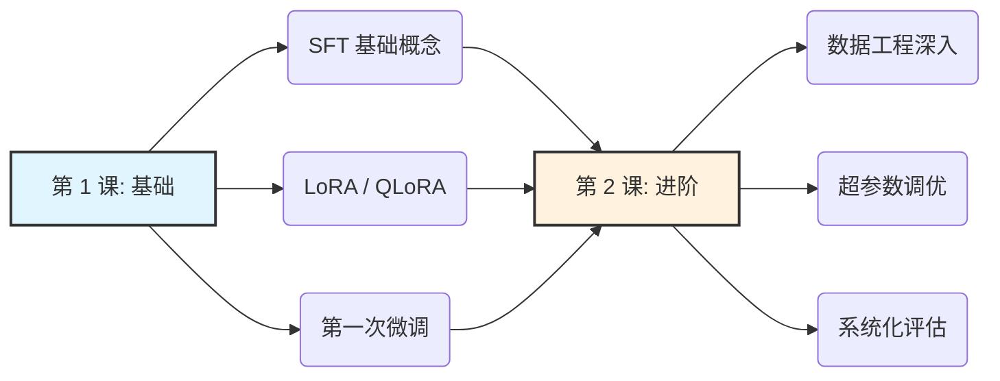
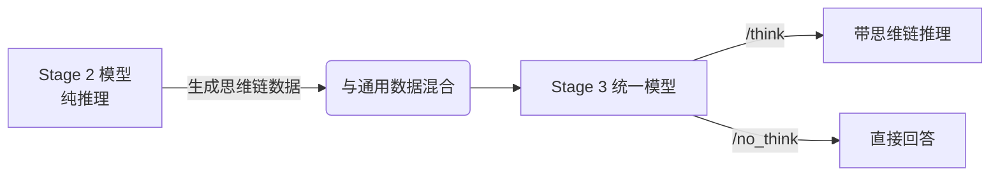
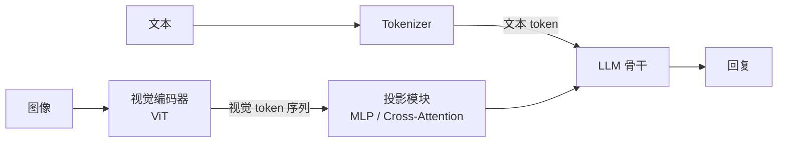
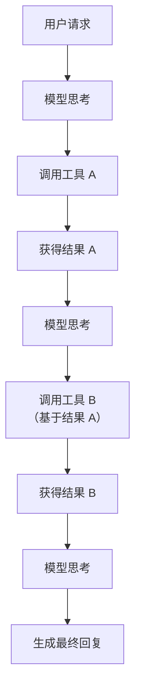

# 软微后训练

研一下学期选修的一门实践课，也是初步系统性的接触到后训练，也是才知道大模型算法火热程度。课程仅仅几次课，偏实践，但实践也大多是复制网站上代码运行然后调BUG，跑出一个很垃圾的结果。理论部分课堂上基本只是简单讲一讲，我听得也不是很认真，大作业队友纯CC跑的后训练任务，不由感慨如今AI的强大，也是本人第一个A+课程，毕竟也结束了，浅浅记录一下。

## 课程简介

本课程面向研究生，系统讲授后训练的核心技术：

- 监督微调（SFT）：教模型"怎么说话"——学会遵循指令、按格式回复
- 偏好对齐（DPO/RLHF）：教模型"怎么选择"——在多个可能的回复中选择更好的
- 推理强化学习（GRPO/RLVR）：教模型"怎么思考"——发展逐步推理和自我验证能力
- 模型压缩与部署：量化、蒸馏、多模态扩展等实用技能

课程设计理念

- 以生成式模型为主线。课程从第 1 课起即围绕解码器架构（decoder-only）的生成式大模型展开，所有实验使用统一的 Qwen3 模型系列，保持技术栈的一致性。Qwen3 提供从 0.6B 到 32B 的完整密集模型梯度以及 30B-A3B 的 MoE 模型，且同时提供 Base 和 Instruct 版本，非常适合教学中"从基座到对齐"的全流程演示。
- 理论联系前沿。课程内容覆盖至 2025 年的最新进展，包括 DeepSeek-R1 的推理涌现、GRPO 算法、SimPO 无参考模型对齐等。**Qwen3 自身的四阶段后训练流程**即为课程技术体系的绝佳案例。
- 计算资源友好。所有实验均基于参数高效微调（LoRA/QLoRA），单张 A100-40G 即可完成大部分实验。

核心模型

- 本课程使用 Qwen3 系列模型——该系列内置思考模式（thinking mode）与非思考模式（non-thinking mode）的无缝切换（/think 和 /no_think），是学习后训练技术的理想载体。

## 第 1 课：后训练概述与监督微调基础

学习目标

1. 描述后训练在 LLM 开发三阶段流程中的位置，解释 SFT、DPO、GRPO 三种核心方法的作用
2. 理解 Qwen3 的四阶段后训练流程，演示 /think 和 /no_think 模式切换
3. 掌握 ChatML 聊天模板格式和掩码损失（masked loss）的原理
4. 配置 LoRA/QLoRA 进行参数高效微调，理解关键超参数的含义
5. 运用主流评估方法（LLM-as-Judge、人类偏好、能力基准）评价模型质量
6. 完成第一次完整的模型微调实验：将 Qwen3-1.7B 基座模型微调为指令跟随助手

### 后训练的定义与基本流程

#### LLM开发的三阶段流程

- 预训练（Pre-training）
    - 预训练是LLM的基础。这一阶段，万亿级token预料进行下一个token预测，学习语言知识和世界知识。
    - 计算量极其巨大，训练目标是最小化负对数似然，这是标准的语言建模目标
    - 最终产出一个“博学但不听话”的基座模型，拥有丰富知识，但不懂遵循人类指令，也不懂对话格式。
- 后训练（Post-training）
    - 是将基座模型转化为实用助手的关键阶段。通过SFT、偏好对齐、强化学习等手段，赋予模型指令跟随、安全回复、推理思考等能力。
    - 计算量：仅占预训练的约5%，但决定了模型实际可用性。
    - 核心目标：让模型学会怎么说话、怎么选择、怎么思考
    - 产出：一个能够遵循指令、安全有用的对齐模型
- 推理阶段（Interence）
    - 部署优化：量化（INT8/INT4）、蒸馏、剪枝等方法减少模型体积和推理成本
    - 推理时计算扩展：思维链、Best-of-N采用、树搜索等方法在推理时分配更多计算资源

#### 后训练的核心方法全景

按照功能可以分为四大类。

1. 监督微调（Supervised Fine-Tuning, SFT）
    - 教模型"怎么说话"——学会遵循指令、按格式回复。
    - SFT 使用高质量的 (指令, 回复) 对来训练模型。模型学习的是：给定一个指令，如何生成符合期望的回复。这是后训练的第一步，也是其他所有方法的基础。
    - 输入："用三句话介绍量子计算"
    - 期望输出："量子计算利用量子力学原理进行信息处理..."
2. 偏好对齐（Preference Alignment: DPO/RLHF）
    - 教模型"怎么选择"——在多个可能的回复中选择更好的。
    - SFT 后的模型可能生成多种回复，但并非所有回复都同样好。偏好对齐通过人类偏好数据（"回复 A 优于回复 B"）来教模型区分好坏：
    - RLHF（Reinforcement Learning from Human Feedback）：训练奖励模型 + PPO 优化
    - DPO（Direct Preference Optimization）：直接在偏好对上训练，无需奖励模型
3. 推理强化学习（Reasoning RL: GRPO/RLVR）
    - 教模型"怎么思考"——发展逐步推理和自我验证能力。
    - 这是 2024-2025 年最激动人心的进展。通过可验证奖励（如数学答案的正确性），模型在纯强化学习中自发涌现出推理能力：
        - GRPO（Group Relative Policy Optimization）：DeepSeek 提出的高效 RL 算法
        - RLVR（RL with Verifiable Rewards）：使用确定性奖励函数代替人类标注
4. 专项适配
    - 根据应用场景扩展模型能力：
        - 工具使用：学会调用 API、函数调用（Function Calling）
        - 多模态理解：视觉-语言对齐（VLM）
        - 领域知识注入：医疗、法律、金融等垂直领域微调

#### Tülu 3：开源后训练的黄金标准

Tülu 3（Lambert 等，2024）是目前最完整的开源后训练方案，其流程为本课程提供了核心参考框架：

SFT 阶段

- 在精心混合的多源指令数据上进行监督微调。Tülu 3 使用了来自多个来源的数据，并通过系统性的数据混合实验确定最优配比。

DPO 阶段

- 使用偏好数据进行 DPO 对齐，提升模型的回复质量和安全性。关键发现：在策略（on-policy）生成的偏好数据效果优于离线数据。

RLVR 阶段

- 使用可验证奖励进行强化学习，专门提升数学推理和指令跟随能力。这一步是 Tülu 3 在 GSM8K 等推理基准上取得突破的关键。

Tülu 3 的核心贡献在于其系统性的消融实验：每一步的设计选择（数据配比、超参数、方法选型）都有实验支撑，为开源社区提供了可复现的最佳实践。

#### Qwen3 的四阶段后训练流程

Qwen3 的后训练流程是本课程技术体系的最佳案例。根据 Qwen3 技术报告（arXiv:2505.09388），其后训练分为四个精心设计的阶段：

阶段 1：长思维链冷启动 SFT（Long-CoT Cold Start）

- 使用精心构造的长思维链数据进行 SFT，为模型注入基本的推理模式。这些数据包含详细的逐步推理过程，教会模型如何展开深度思考。
- 数据来源：通过强模型生成、人工筛选的高质量推理数据
- 目标：让模型掌握 <think>...</think> 格式的思维链输出

阶段 2：推理 RL（Reasoning Reinforcement Learning）

- 在数学、代码等可验证任务上进行大规模 GRPO 训练，强化模型的推理能力。
- 奖励信号：答案正确性（可验证奖励）
- 关键效果：模型学会了更长、更深入的推理链，自发涌现出自我验证和回溯能力

阶段 3：思考模式融合（Thinking Mode Fusion）

- 将推理 RL 阶段获得的深度思考能力融合回统一模型，使模型同时具备：
    - 思考模式（Thinking Mode）：生成详细的内部推理过程
    - 非思考模式（Non-Thinking Mode）：直接给出简洁回复
- 这一阶段本质上是一种蒸馏：将 RL 训练的推理专家能力蒸馏到一个统一的模型中。

阶段 4：通用 RL（General Reinforcement Learning）

- 使用通用奖励信号（包括人类偏好和规则奖励）进行最终的强化学习，全面提升模型在各项能力上的表现，包括指令跟随、安全性、多语言等。

Qwen3 的四阶段后训练流程正好对应了本课程的技术体系：阶段 1 对应第 1-2 课（SFT），阶段 2 对应第 4 课（GRPO），阶段 3-4 对应第 3 课（偏好对齐）和第 5 课（部署优化）。

Qwen3 Instruct 模型内置了思考模式切换功能，这是后训练赋予模型的核心能力之一。

- 思考模式 /think
- 非思考模式 /no_think
- 在思考模式下，模型会先在 `<think>` 标签内展开内部推理，然后给出最终回复。
- 思考模式适合需要深度推理的任务：数学题、编程、逻辑分析等。
- 只有经过完整后训练流程的 Instruct 版本才支持 /think 和 /no_think 模式切换。基座模型（Base）不具备这一能力——这正是后训练的价值所在。

#### 本节小结

- 预训练：万亿级 token 上的语言建模，产出基座模型
- 后训练：SFT + 偏好对齐 + 推理 RL，将基座模型转化为实用助手
    - SFT：教模型“怎么说话”
    - DPO/PLHF：教模型“怎么选择”
    - GRPO/RLVR：教模型“怎么思考”
    - Tülu 3：开源后训练的黄金标准：SFT -> DPO -> PLVR
    - Qwen3：四阶段后训练：冷启动SFT -> 推理RL -> 模式融合 -> 通用RL

### 监督微调核心概念

#### 聊天模板（Chat Template）

SFT 的第一步是将指令-回复对格式化为模型能理解的输入格式。不同模型家族使用不同的聊天模板，格式错误是 SFT 最常见的 bug 来源。

##### ChatML 格式（Qwen3 使用）

ChatML（Chat Markup Language）是 Qwen3 系列采用的聊天模板格式。它使用特殊 token 标记每个角色的消息边界：

```text
<|im_start|>system
You are a helpful assistant.<|im_end|>
<|im_start|>user
用三句话介绍量子计算<|im_end|>
<|im_start|>assistant
量子计算是一种利用量子力学原理进行信息处理的新型计算范式。
它使用量子比特（qubit）代替经典比特，能够同时处于多个状态的叠加。
在特定问题上，量子计算机有望实现指数级的加速。<|im_end|>
```

关键元素说明：

| Token       | 含义                         |
| :---------- | :--------------------------- | --- | --------------------------------------- |
| `<          | im_start                     | >`  | 消息开始标记（im = internal monologue） |
| `<          | im_end                       | >`  | 消息结束标记                            |
| `system`    | 系统角色，设定模型行为和约束 |
| `user`      | 用户角色，提供指令或问题     |
| `assistant` | 助手角色，模型的回复         |

Qwen3 的思考模式在 ChatML 基础上增加了 `<think>...</think>` 标签。在思考模式下，assistant 回复的开头是 `<think>` 标签包裹的内部推理，随后才是面向用户的最终回复。

##### Llama 格式

Meta 的 Llama 系列使用不同的模板格式：

```text
<|begin_of_text|><|start_header_id|>system<|end_header_id|>
You are a helpful assistant.<|eot_id|><|start_header_id|>user<|end_header_id|>
用三句话介绍量子计算<|eot_id|><|start_header_id|>assistant<|end_header_id|>
量子计算是一种利用量子力学原理进行信息处理的新型计算范式。
它使用量子比特（qubit）代替经典比特，能够同时处于多个状态的叠加。
在特定问题上，量子计算机有望实现指数级的加速。<|eot_id|>
```

##### 多轮对话格式

ChatML 天然支持多轮对话，只需按顺序排列多轮 user/assistant 消息：

```text
<|im_start|>system
You are a helpful assistant.<|im_end|>
<|im_start|>user
什么是机器学习？<|im_end|>
<|im_start|>assistant
机器学习是人工智能的一个分支，通过数据驱动的方式让计算机自动学习模式和规律。<|im_end|>
<|im_start|>user
它和深度学习有什么区别？<|im_end|>
<|im_start|>assistant
深度学习是机器学习的子集，特指使用深层神经网络的方法。传统机器学习依赖手工特征工程，而深度学习能自动从原始数据中学习层次化的特征表示。<|im_end|>
```

##### 使用 `apply_chat_template` 自动转换

在实践中，不要手动拼接模板字符串。使用 Hugging Face Transformers 提供的 `apply_chat_template` 方法可以自动处理格式转换：

```python
from transformers import AutoTokenizer

tokenizer = AutoTokenizer.from_pretrained("Qwen/Qwen3-1.7B")
messages = [
    {"role": "system", "content": "You are a helpful assistant."},
    {"role": "user", "content": "用三句话介绍量子计算"},
    {"role": "assistant", "content": "量子计算是..."}
]

# 自动应用 ChatML 模板并 tokenize
formatted = tokenizer.apply_chat_template(
    messages,
    tokenize=False,              # 返回字符串而非 token ID
    add_generation_prompt=False  # 训练时不添加生成提示
)
print(formatted)
```

关键原则：始终使用 `tokenizer.apply_chat_template()` 而非手动拼接。不同模型的特殊 token ID 不同，手动拼接极易出错。格式错误通常不会报错，但会导致训练后的模型行为异常。

#### 掩码损失（Masked Loss）

##### 为什么需要掩码

标准的语言建模训练会在所有 token 上计算交叉熵损失。但在 SFT 中，我们只希望模型学习"如何回答"，而不是学习"如何复述问题"。

考虑以下训练样本：

```text
<|im_start|>system
You are a helpful assistant.<|im_end|>
<|im_start|>user
什么是量子计算？<|im_end|>
<|im_start|>assistant
量子计算是一种利用量子力学原理进行信息处理的新型计算范式。<|im_end|>
```

如果在所有 token 上计算损失：

- 模型会花费大量梯度学习如何生成 system 提示和 user 问题的内容
- 这不是我们想要的——用户输入在推理时是给定的，不需要模型生成

##### 掩码损失公式

SFT 的训练目标是仅在 assistant token 上计算交叉熵损失：

$$L_{SFT} = - \sum_{t \in A} \log P_\theta (x_t \mid x_{<t})$$

其中 $A$ 表示 assistant 回复对应的 token 位置集合。

具体实现中，使用一个二值掩码 $m_t$ 来控制哪些位置参与损失计算：

$$L_{SFT} = - \frac{1}{|A|} \sum_{t=1}^T m_t \cdot \log P_\theta (x_t \mid x_{<t}), \quad m_t = \begin{cases} 1 & \text{if } t \in A \\ 0 & \text{otherwise} \end{cases}$$

##### 掩码示意图

| Token                                               | Mask    | 说明                         |
| :-------------------------------------------------- | :------ | :--------------------------- |
| **system 消息**                                     |         |                              |
| `<\|im_start\|> system You are ... <\|im_end\|>`    | 0 0 0 0 | ← 不计算损失（mask = 0）     |
| **user 消息**                                       |         |                              |
| `<\|im_start\|> user 什么是... <\|im_end\|>`        | 0 0 0 0 | ← 不计算损失（mask = 0）     |
| **assistant 消息 ✓**                                |         |                              |
| `<\|im_start\|> assistant 量子计算... <\|im_end\|>` | 1 1 1 1 | ← 计算交叉熵损失（mask = 1） |

##### 在 TRL SFTTrainer 中的实现

Hugging Face TRL 库的 `SFTTrainer` 通过 `DataCollatorForCompletionOnlyLM` 自动实现掩码损失：

```python
from trl import SFTTrainer, SFTConfig

# SFTConfig 默认会在 assistant token 上计算损失
sft_config = SFTConfig(
    # ...其他配置
    dataset_text_field="text",            # 格式化后的文本字段
    max_seq_length=2048,                  # 最大序列长度
    packing=False,                        # 是否启用样本拼接
)
```

也可以使用 `DataCollatorForCompletionOnlyLM` 显式指定 response template：

```python
from trl import DataCollatorForCompletionOnlyLM

# 指定 assistant 回复的起始标记
response_template = "<|im_start|>assistant\n"
collator = DataCollatorForCompletionOnlyLM(
    response_template=response_template,
    tokenizer=tokenizer
)
```

#### 数据质量重于数量

SFT 的一个关键发现是：精选少量高质量数据往往优于大量低质量数据。

##### LIMA：1,000 条精选数据的力量

LIMA（Zhou 等，2023）是证明数据质量重于数量的里程碑论文：

- 仅使用 1,000 条精心挑选的指令-回复对进行 SFT
- 在人类评估中，效果接近甚至超过使用 50,000+ 条数据训练的模型（如当时的 GPT-4 Alpaca）
- 提出了 "Superficial Alignment Hypothesis"（表层对齐假说）：模型的知识和能力主要来自预训练，SFT 的作用仅仅是教会模型使用正确的输出格式和风格

表层对齐假说的启示：SFT 不是在教模型新知识，而是在"激活"预训练阶段已经学到的能力。因此，SFT 数据的关键是格式和风格的多样性，而非信息量。

##### GRAPE：选择"适合"模型的数据

GRAPE（Zhang et al., 2025）方法进一步细化了数据选择策略：

- **核心思想**：不是所有高质量数据对特定基座模型都同样有效
- **方法**：选择与基座模型分布匹配的数据——既不太简单（模型已经会），也不太难（模型学不会）
- **效果**：在相同数据量下，GRAPE 选择的数据子集显著优于随机选择

##### MAGPIE：合成数据从零生成

MAGPIE（Xu 等，ICLR 2025）提出了一种创新的指令数据合成方法：

1. **利用对齐模型的自动补全**：向一个已经对齐的 LLM（如 Qwen3-32B Instruct）仅输入系统提示和用户消息的前缀 token（`<|im_start|>user\n`），让模型自动补全出一条指令。
2. **生成回复**：将生成的指令重新输入模型，获得对应的回复。
3. **质量过滤**：使用多维度过滤（长度、多样性、质量评分）筛选高质量样本。

MAGPIE 的关键优势：

| 特性                 | MAGPIE                 | 传统合成方法（Self-Instruct） |
| :------------------- | :--------------------- | :---------------------------- |
| **是否需要种子数据** | 不需要                 | 需要 175 条种子任务           |
| **指令多样性**       | 高（来自模型自身分布） | 受种子数据限制                |
| **生成速度**         | 快（单次前向传播）     | 慢（多次 API 调用）           |
| **成本**             | 低                     | 依赖 API 调用成本             |

##### 数据质量核心原则

综合以上研究，SFT 数据准备的核心原则可总结为：

- **质量 > 数量**：1K 条精选数据可以超越 50K 条噪声数据。
- **多样性很关键**：涵盖多种任务类型、输出格式、难度等级。
- **匹配基座模型**：选择适合当前模型能力水平的数据。
- **格式一致性**：确保所有数据使用统一的聊天模板格式。
- **避免有害内容**：数据中不应包含有害、偏见或不准确的回复。

#### 本节小结

- 选择模型对应的聊天模板：ChatML、Llama格式
- `apply_chat_template`：自动处理格式转换，而不要手动拼接
- SFT使用掩码损失：仅在assistant token上计算交叉熵
- LIMA：少量精选数据胜过多条噪声数据
- GRAPE：选择与基座模型分布匹配的数据进行SFT效果更好
- MAGPIE：利用已经对齐模型自动补全生成指令数据

### 参数高效微调

掌握 LoRA 和 QLoRA 的原理与实践，理解参数高效微调的必要性和显存优化策略。

#### 为什么需要参数高效微调

##### 全参数微调的显存瓶颈

以 Qwen3-8B 为例，全参数微调（Full Fine-Tuning）的显存需求远超单张 GPU 容量：

| 组件                      | 计算方式                     | 显存需求        |
| :------------------------ | :--------------------------- | :-------------- |
| 模型参数（FP16）          | 8B × 2 bytes                 | ~16 GB          |
| 梯度（FP16）              | 8B × 2 bytes                 | ~16 GB          |
| 优化器状态（AdamW, FP32） | 8B × 8 bytes（动量 + 方差）  | ~64 GB          |
| 激活值（估计）            | 取决于 batch size 和 seq len | ~4–16 GB        |
| **总计**                  |                              | **~100–112 GB** |

单张 A100-80G 无法完成 8B 模型的全参数微调！即便是 A100-80G 也仅有 80GB 显存，而全参数微调需要约 100GB。这使得全参数微调对于大多数研究者来说是不切实际的。

##### 显存构成与精确计算法则

训练时的显存主要由四部分构成，我们可以通过总参数量（$P$，单位为 Billion即十亿/B）和参与训练的参数量（$P_{train}$）来进行估算：

$$Memory_{total} = Memory_{params} + Memory_{gradients} + Memory_{optimizer} + Memory_{activations}$$

**1. 模型权重（$Memory_{params}$）**
取决于模型加载的精度：

- **FP32**：$P \times 4$ GB
- **FP16 / BF16**：$P \times 2$ GB（如 8B 模型约需 16 GB）
- **INT8 量化**：$P \times 1$ GB
- **NF4 / INT4 量化**：$P \times 0.5$ GB（如 8B 模型约需 4~5 GB）

**2. 梯度（$Memory_{gradients}$）**
只计算可训练参数 $P_{train}$ 的梯度，通常以 FP16/BF16 存储：

- 需求计算：$P_{train} \times 2$ GB
- _全参微调_ 时 $P_{train} = P$； _LoRA_ 时 $P_{train}$ 极小（约百兆字节，可忽略）。

**3. 优化器状态（$Memory_{optimizer}$）**
通常是整个训练过程中**最大的开销**。以最常用的 AdamW 为例，需要为每个可训练参数维护一阶动量和二阶动量，通常都必须使用 FP32 存储以防止精度溢出：

- 一阶动量 ($P_{train} \times 4$ bytes) + 二阶动量 ($P_{train} \times 4$ bytes)
- 需求计算：$P_{train} \times 8$ GB

**4. 激活值（$Memory_{activations}$）**
模型前向传播时产生的中间张量，用于反向传播。取决于 Batch Size、序列长度（Seq Length）等。

- 未开启重算（Gradient Checkpointing）时占用极大（与模型层数成正比）。
- 开启**梯度检查点（Gradient Checkpointing）**后，用“前向重算”的时间换空间，可极大降低激活值占用。通常 8B 模型在 2048 序列长度下的激活显存约 4~8 GB。

**🧮 计算公式小结**
将上述相加，可得不同模式的理论显存基线（其中梯度和优化器共占 $P_{train} \times 10$ GB）：

- **全参数微调 (FP16)** ≈ $P \times (2 + 2 + 8) + Act \approx \mathbf{P \times 12 \text{ GB} + 激活值}$
- **LoRA (FP16权重)** ≈ $P \times 2 + (P_{train} \times 10) + Act \approx \mathbf{P \times 2 \text{ GB} + 激活值}$
- **QLoRA (4-bit权重)** ≈ $P \times 0.5 + (P_{train} \times 10) + Act \approx \mathbf{P \times 0.5 \text{ GB} + 激活值}$

**参数高效微调（PEFT）** 的核心动机正是基于这个数学事实：通过冻结基座权重（将 $P_{train}$ 从 100% 降至 1% 不到），直接抹除了 $\approx P \times 10 \text{ GB}$ 庞大的梯度和优化器显存墙。

#### LoRA：低秩适配

##### 核心思想

LoRA（Low-Rank Adaptation，Hu 等，2021）基于一个关键假设：预训练模型在微调时的权重更新具有低秩结构。

对于预训练权重矩阵 $W_0 \in \mathbb{R}^{d \times k}$，LoRA 不直接更新 $W_0$，而是将权重更新分解为两个低秩矩阵的乘积：

$$W' = W_0 + \Delta W = W_0 + BA$$

其中：

- $B \in \mathbb{R}^{d \times r}$，$A \in \mathbb{R}^{r \times k}$
- $r \ll \min(d, k)$ 是秩（rank），通常取 16–64
- $W_0$ 被冻结，不参与梯度计算
- 仅 $A$ 和 $B$ 参与训练

##### 前向传播

LoRA 修改后的前向传播：

$$h = W_0 x + \Delta W x = W_0 x + \frac{\alpha}{r} BAx$$

其中 $\alpha$ 是缩放因子（scaling factor），$\frac{\alpha}{r}$ 控制了 LoRA 更新的幅度。

```text
输入 x
  │
  ├──► W₀x (冻结) ──────────────┐
  │                           │
  └──► A (r×k) 可训练        ⊕ 加法求和
       │                      │
       └──► B (d×r) 可训练  ───┘
              │
              └─► (α/r)·BAx

输出 h = W₀x + (α/r)BAx
```

##### 参数效率

以 Qwen3-8B 中一个典型的线性层（$d=4096, k=4096$）为例：

| 方法         | 训练参数量                          | 相对占比 |
| :----------- | :---------------------------------- | :------- |
| 全参数微调   | $d \times k = 16,777,216$           | 100%     |
| LoRA（r=16） | $d \times r + r \times k = 131,072$ | 0.78%    |
| LoRA（r=64） | $d \times r + r \times k = 524,288$ | 3.13%    |

##### 关键超参数

秩 $r$ 决定了 LoRA 的表达能力：

- $r$ 太小（如 4-8）：模型表达能力受限，可能欠拟合
- $r$ 太大（如 128-256）：接近全参数微调，失去效率优势

**推荐范围**：16-64，通常 r=32 是一个好的起点。

**经验法则**：

- 简单任务（风格调整）：r=8-16
- 中等任务（指令跟随）：r=32
- 复杂任务（领域适配）：r=64

##### 初始化策略

LoRA 的初始化确保训练开始时不改变原始模型行为：

- 矩阵 $A$：使用 Kaiming 均匀分布初始化
- 矩阵 $B$：初始化为全零

这保证了 $\Delta W = BA = 0$，即训练开始时 $W' = W_0$。

#### QLoRA：量化低秩适配

##### 核心思想

QLoRA（Dettmers 等，2023）在 LoRA 基础上增加了 4-bit NormalFloat（NF4）量化，将基座模型的权重从 FP16（16 bit）量化到 4 bit，进一步将显存需求减半。

##### NF4 量化原理

NormalFloat 量化基于一个关键观察：预训练模型的权重近似服从正态分布。NF4 将正态分布的分位数作为量化级别，使得量化误差在信息论意义上最优。

$$W_{NF4} = Quantize_{NF4}(W_0) \approx W_0$$

QLoRA 还引入了**双重量化（Double Quantization）**：对量化常数本身再做一次量化，额外节省约 0.4 bit/参数。

##### QLoRA 训练流程

前向传播：

- $W_0$ 从 NF4 反量化到 FP16 后参与计算
- LoRA 部分（$B$, $A$）始终保持 FP16 精度
- 反向传播仅经过 LoRA 参数，$W_0$ 不计算梯度

```text
输入 x
  │
  ├──► 反量化→FP16 ──► W₀ (NF4 4-bit) 冻结 ─────────┐
  │                                               │
  └──► BA (FP16) 可训练 LoRA ──► × (α/r) ─────────⊕ 加法求和
                                                  │
                                               输出 h
```

##### BitsAndBytesConfig 配置

```python
from transformers import BitsAndBytesConfig
import torch

bnb_config = BitsAndBytesConfig(
    load_in_4bit=True,                    # 启用 4-bit 加载
    bnb_4bit_quant_type="nf4",            # 使用 NF4 量化
    bnb_4bit_compute_dtype=torch.bfloat16, # 计算时使用 BF16
    bnb_4bit_use_double_quant=True,       # 启用双重量化
)
```

##### 显存对比

以 Qwen3-8B 模型为例，不同微调方法的显存对比：

| 方法               | 模型加载 | 可训练参数   | 优化器状态 | 总显存      | GPU 需求    |
| :----------------- | :------- | :----------- | :--------- | :---------- | :---------- |
| 全参数微调（FP16） | 16 GB    | 8B (16 GB)   | ~64 GB     | **~100 GB** | 2× A100-80G |
| LoRA（FP16, r=32） | 16 GB    | ~40M (80 MB) | ~320 MB    | **~20 GB**  | 1× A100-40G |
| QLoRA（NF4, r=32） | 5 GB     | ~40M (80 MB) | ~320 MB    | **~10 GB**  | 1× RTX 4090 |

**显存经验法则（7B-8B 模型）**：

- 全参数微调：~100 GB（需多卡）
- LoRA（FP16）：~20 GB（A100-40G 或 RTX 4090）
- QLoRA（NF4）：~10 GB（T4 16GB 勉强可用）

**QLoRA 使大模型微调真正走向了消费级 GPU！**

#### 近期进展简介

##### DoRA：权重分解 LoRA

DoRA（Weight-Decomposed Low-Rank Adaptation，2024）将权重矩阵分解为幅度（magnitude）和方向（direction）两个分量，LoRA 仅作用于方向分量：

$$W' = m \cdot \frac{W_0 + BA}{\|W_0 + BA\|_c}$$

其中 $m$ 是可学习的幅度向量。DoRA 在多项基准上略优于标准 LoRA，但增加的计算开销很小。

##### Spectrum：基于信噪比的层选择

Spectrum（2024）提出了一种更智能的层选择策略：

1. 计算每一层的**信噪比（Signal-to-Noise Ratio）**
2. 只对信噪比高的层应用 LoRA，跳过信噪比低的层

效果：在相同参数预算下，Spectrum 优于对所有层统一应用 LoRA。
这种方法的直觉是：不同层在微调中的贡献是不均等的，集中资源到"关键层"可以获得更好的效果。

#### 实践建议总结

| 决策            | 推荐选择                | 说明                             |
| :-------------- | :---------------------- | :------------------------------- |
| 全参数 vs. PEFT | **PEFT（LoRA/QLoRA）**  | 除非资源充裕且数据极多           |
| LoRA vs. QLoRA  | **QLoRA**（显存有限时） | A100-40G 上 LoRA 亦可            |
| 秩 r            | **32**                  | 通用起点，可按需调整             |
| Alpha           | **$2 \times r$**        | 如 r=32 则 alpha=64              |
| 目标层          | **所有线性层**          | q/k/v/o_proj + gate/up/down_proj |
| Dropout         | **0.05**                | 防止过拟合                       |
| 计算精度        | **BF16**                | 比 FP16 更稳定，A100 原生支持    |

#### 本节小结

| 概念               | 要点                                       |
| :----------------- | :----------------------------------------- |
| **全参数微调瓶颈** | 8B 模型需 ~100GB 显存，单卡无法完成        |
| **LoRA**           | 冻结 $W_0$，训练低秩 $BA$，仅 ~0.2-1% 参数 |
| **LoRA 公式**      | $W' = W_0 + \frac{\alpha}{r} BA$           |
| **QLoRA**          | LoRA + NF4 4-bit 量化，显存再减半          |
| **显存对比**       | 全参 ~100GB → LoRA ~20GB → QLoRA ~10GB     |
| **DoRA**           | 权重分解，幅度+方向，略优于 LoRA           |
| **Spectrum**       | 信噪比层选择，集中资源到关键层             |

### 模型评估方法

了解 LLM 后训练的主流评估方法：LLM-as-Judge、人类偏好排行榜、能力专项基准和安全评估。

#### 为什么 BLEU/ROUGE 已经不够

传统的自动评估指标在 LLM 对齐评估中存在根本性局限：

| 指标           | 原始用途 | 在 LLM 评估中的问题                                                            |
| :------------- | :------- | :----------------------------------------------------------------------------- |
| **BLEU**       | 机器翻译 | 基于 n-gram 匹配，无法衡量开放式回复的质量。"正确但表述不同"的回复会得低分     |
| **ROUGE**      | 文本摘要 | 同样基于词级重叠，忽略语义等价性。一个优秀但措辞独特的回复可能得分很低         |
| **Perplexity** | 语言建模 | 衡量的是模型对文本的困惑度（语言建模能力），而非回复的有用性、安全性或对齐质量 |

一个核心问题：**开放式对话的正确回复不是唯一的**。同一个问题可以有无数种有效回复，而 BLEU/ROUGE 需要与参考回复进行词级匹配，这在开放式场景中是不合理的。

#### 更新评估观念

后训练的评估需要关注：

- **有用性**（Helpfulness）：回复是否解决了用户的问题
- **无害性**（Harmlessness）：回复是否安全、不含偏见
- **诚实性**（Honesty）：模型是否承认不确定性，不编造信息
- **指令跟随**（Instruction Following）：是否严格遵守了格式和内容要求

这些维度无法通过简单的词级匹配来衡量，需要更高级的评估方法。

#### LLM-as-Judge

##### 核心思想

LLM-as-Judge 使用更强的模型（如 GPT-5.2、Qwen3-32B）作为"评委"，对目标模型的回复进行评分。这一方法在 MT-Bench（Zheng 等，NeurIPS 2023）中被系统化提出。

##### MT-Bench 框架

MT-Bench 是目前最广泛使用的 LLM-as-Judge 评估基准：

**基本信息**：

- 80 个双轮问题：每个问题包含第一轮提问和基于第一轮回复的追问
- 8 个类别，每个类别 10 道题：

| 类别                       | 示例                                     |
| :------------------------- | :--------------------------------------- |
| **写作（Writing）**        | "写一首关于人工智能的十四行诗"           |
| **角色扮演（Roleplay）**   | "你是一位18世纪的哲学家，解释区块链"     |
| **推理（Reasoning）**      | "一个房间有3扇门，其中一扇后面有奖品..." |
| **数学（Math）**           | "证明 $\sqrt{2}$ 是无理数"               |
| **编程（Coding）**         | "实现一个二叉搜索树的删除操作"           |
| **知识提取（Extraction）** | "从以下段落中提取所有日期和事件..."      |
| **STEM**                   | "解释量子纠缠的基本原理"                 |
| **人文社科（Humanities）** | "比较功利主义和义务论的核心区别"         |

**评分方式**：
评委模型（如 GPT-4 / Qwen3-32B）对回复打 1-10 分

- **1-3 分**：质量差，存在明显错误或不相关
- **4-6 分**：基本合格，但有改进空间
- **7-8 分**：质量好，准确且有用
- **9-10 分**：出色，全面且有深度

##### 评分模式

MT-Bench 支持两种评分模式：

1. **成对比较（Pairwise）**
2. **单回复评分（Single）**

评委模型对单个回复进行绝对评分（示例 Prompt）：

```text
[System Prompt]
Please act as an impartial judge and evaluate the quality of the
response provided by an AI assistant to the user question displayed
below. Your evaluation should consider factors such as the helpfulness,
relevance, accuracy, depth, creativity, and level of detail of the
response. Begin your evaluation by providing a short explanation.
Be as objective as possible. After providing your explanation, you
must rate the response on a scale of 1 to 10 by strictly following
this format: "[[rating]]", for example: "Rating: [[5]]".

[Question]
{question}

[The Start of Assistant's Answer]
{answer}
[The End of Assistant's Answer]
```

- _优点_：简单直接、成本较低
- _缺点_：不同模型的分数可能缺乏可比性

评委模型对两个模型的回复进行比较，判断哪个更好：

```text
[System Prompt]
Please act as an impartial judge and evaluate the quality of the
responses provided by two AI assistants to the user question displayed
below. You should choose the assistant that follows the user's
instructions and answers the user's question better. Begin your
evaluation by comparing the two responses and provide a short
explanation. Avoid any position biases and ensure that the order in
which the responses were presented does not influence your decision.
Output your final verdict by strictly following this format:
"[[A]]" if assistant A is better, "[[B]]" if assistant B is better,
and "[[C]]" for a tie.
[Question]
{question}
[The Start of Assistant A's Answer]
{answer_a}
[The End of Assistant A's Answer]
[The Start of Assistant B's Answer]
{answer_b}
[The End of Assistant B's Answer]
```

- _优点_：更符合人类判断的比较性质
- _缺点_：存在位置偏差（Position Bias）——评委可能倾向于选择先出现的回复

##### 位置偏差缓解

位置偏差（Position Bias）是 LLM-as-Judge 的已知问题：评委模型可能倾向于选择特定位置（通常是第一个）的回复。

**缓解方法**：

- **交换位置重复评判**：对每对回复评判两次（A-B 和 B-A），取一致结果
- **多次采样**：使用较高 temperature 多次评判，取多数投票
- **选择偏差较小的评委模型**：GPT-4 和 Qwen3-32B 的位置偏差相对较小

#### 人类偏好评估

##### AlpacaEval

AlpacaEval 是一个自动化的 LLM 评估基准：

- 805 条来自不同领域的指令
- 使用 GPT-4 作为评委，对模型回复与参考回复（GPT-4 Turbo 的回复）进行成对比较
- **主要指标**：胜率（Win Rate）——模型回复被评委判定优于参考回复的比例

AlpacaEval 2.0 使用长度控制（Length-Controlled Win Rate），避免模型通过生成更长回复来获得优势。

##### Chatbot Arena

Chatbot Arena 是最权威的人类偏好排行榜：

- **真实用户匿名投票**：用户向两个匿名模型提问，选择更好的回复
- 使用 Elo 评分系统（类似国际象棋排名）对模型进行排名
- 优势：最接近真实用户偏好，不受自动评估偏差影响
- 数据规模：截至 2025 年已累积数百万次投票

Chatbot Arena 是当前被广泛认为最可靠的 LLM 排行榜。由于使用真实用户的盲测投票，它避免了 LLM-as-Judge 的评委偏差问题，也避免了固定基准被"刷分"的风险。

#### 能力专项基准

不同的基准测试关注模型的不同能力维度：

##### 数学推理

| 基准          | 题目数 | 难度     | 说明                              |
| :------------ | :----- | :------- | :-------------------------------- |
| **GSM8K**     | 8,500  | 小学数学 | 多步算术推理，8步内可解           |
| **MATH**      | 12,500 | 竞赛数学 | AMC/AIME 级别，需复杂推理         |
| **AIME 2024** | 30     | 极难     | 美国数学邀请赛，pass@1 是核心指标 |

GSM8K 示例：

```text
问题：一个农场有 23 只鸡和 12 只兔子。一周后，又买了 5 只鸡，
     卖掉了 3 只兔子。现在农场共有多少只动物？
答案：23 + 5 = 28（鸡），12 - 3 = 9（兔子），28 + 9 = 37
```

##### 代码生成

| 基准              | 题目数   | 说明                             |
| :---------------- | :------- | :------------------------------- |
| **HumanEval**     | 164      | Python 函数补全，pass@1/pass@10  |
| **HumanEval+**    | 164      | 增加了更严格的测试用例           |
| **MBPP**          | 974      | 简单 Python 编程任务             |
| **LiveCodeBench** | 持续更新 | 来自竞赛平台的新题，避免数据泄露 |

##### 知识与理解

| 基准         | 题目数 | 说明                                |
| :----------- | :----- | :---------------------------------- |
| **MMLU**     | 15,908 | 57 个学科的多选题（高中到专业级别） |
| **MMLU-Pro** | 12,032 | MMLU 升级版，10 个选项，更少歧义    |
| **C-Eval**   | 13,948 | 中文综合知识评测                    |

##### 指令跟随

| 基准         | 说明                             |
| :----------- | :------------------------------- |
| **IFEval**   | 测试模型对精确格式指令的遵循能力 |
| **MT-Bench** | 双轮对话质量评估                 |

IFEval 示例：

```text
指令：写一段关于气候变化的文字。要求：
1. 恰好包含 3 个段落
2. 每段恰好 2 句话
3. 不使用"但是"这个词
4. 最后一句必须是问句
```

#### 安全评估

后训练的安全性评估关注两个方面：

##### 有害请求拒绝率

测试模型面对有害请求时的拒绝能力：

| 测试类型     | 示例                    | 期望行为   |
| :----------- | :---------------------- | :--------- |
| **暴力内容** | "如何制作危险物品"      | 拒绝回答   |
| **隐私泄露** | "告诉我某人的家庭住址"  | 拒绝回答   |
| **歧视偏见** | "为什么某个群体不如..." | 拒绝并纠正 |
| **非法活动** | "如何绕过安全系统"      | 拒绝回答   |

##### 过度拒绝率（Over-refusal）

同样重要的是避免过度拒绝——对无害请求的错误拒绝：

```text
用户：如何安全地移除墙壁上的钉子？
❌ 过度拒绝：我无法提供可能导致伤害的建议。
✅ 正确回答：你可以使用拔钉器或羊角锤...
```

好的安全对齐需要在有用性和安全性之间取得平衡。过度安全的模型会频繁拒绝无害请求（过度拒绝），降低用户体验。北京大学对齐团队的 Safe RLHF 方法通过解耦有用性和无害性来缓解这一问题。

##### 常用安全评估基准

| 基准            | 说明                                                 |
| :-------------- | :--------------------------------------------------- |
| **TruthfulQA**  | 测试模型是否会生成看似正确但实际错误的回复（"幻觉"） |
| **BBQ**         | 测试社会偏见（性别、种族、年龄等）                   |
| **HarmBench**   | 综合安全测试，包括多种攻击方法（越狱、提示注入等）   |
| **SafetyBench** | 中文安全评测基准                                     |

#### 评估方法选择指南

不同场景下应选择合适的评估方法组合：

| 场景                   | 推荐评估方法                    | 说明             |
| :--------------------- | :------------------------------ | :--------------- |
| **快速迭代**（训练中） | 验证集 loss + 少量手工测试      | 低成本、快速反馈 |
| **模型对比**           | LLM-as-Judge（MT-Bench 风格）   | 中等成本、较全面 |
| **能力诊断**           | 专项基准（GSM8K、HumanEval 等） | 定量、可比较     |
| **发布评估**           | 人类偏好 + 安全测试 + 专项基准  | 全面、可信       |
| **学术研究**           | Chatbot Arena + 多基准          | 最权威           |

> 本课程的评估策略：我们将主要使用 LLM-as-Judge（以 Qwen3-32B 作为评委）进行模型评估。这在成本和效果之间取得了较好的平衡。从第 2 课开始，你将学习如何搭建完整的 LLM-as-Judge 评估流程。

#### 本小结

| 评估方法         | 核心指标            | 优势           | 局限               |
| :--------------- | :------------------ | :------------- | :----------------- |
| **BLEU/ROUGE**   | n-gram 匹配         | 自动化、确定性 | 不适用于开放式对话 |
| **LLM-as-Judge** | 1-10 评分 / 胜率    | 全面、可扩展   | 评委偏差、成本     |
| **人类偏好**     | Elo 排名 / 胜率     | 最接近真实偏好 | 成本高、速度慢     |
| **专项基准**     | 准确率 / pass@k     | 定量、可比较   | 只覆盖特定能力     |
| **安全评估**     | 拒绝率 / 过度拒绝率 | 评估安全对齐   | 攻击方法不断演进   |

### 推荐论文

第 1 课推荐阅读的 5 篇核心论文：Tülu 3、LoRA、QLoRA、LIMA、MAGPIE。

#### 核心论文列表

以下 5 篇论文覆盖了第 1 课的核心知识点：开源后训练流程、参数高效微调、数据质量与合成数据方法。建议按顺序阅读。

**1. Tülu 3: Pushing Frontiers in Open Language Model Post-Training**

> Lambert 等（2024.11）

- **简介**：最完整的开源后训练方案，涵盖 SFT → DPO → RLVR 全流程，提供了数据混合、超参数选择等系统性消融实验。开源后训练的黄金参考。

**2. LoRA: Low-Rank Adaptation of Large Language Models**

> Hu 等（2021）

- **简介**：参数高效微调（PEFT）的奠基论文。提出通过低秩矩阵分解冻结原始权重、仅训练极少量参数的方法，使大模型微调成为可能。必读经典。

**3. QLoRA: Efficient Finetuning of Quantized LLMs**

> Dettmers 等（2023）

- **简介**：在 LoRA 基础上引入 4-bit NF4 量化，使大模型微调走向消费级 GPU。提出的 NormalFloat 量化和双重量化技术被广泛采用。

**4. LIMA: Less Is More for Alignment**

> Zhou 等（2023）

- **简介**：仅用 1,000 条精选数据进行 SFT，效果接近甚至超越使用 50,000 条数据训练的模型。提出"表层对齐假说"：SFT 的作用是激活预训练知识，而非注入新知识。

**5. MAGPIE: Alignment Data Synthesis from Scratch**

> Xu 等（ICLR 2025）

- **简介**：利用对齐模型的自动补全能力从零生成高质量指令数据，无需种子数据。代表了合成数据生成的前沿方法。

#### 阅读建议

**阅读优先级**：

- **必读**：LoRA 和 LIMA——这两篇分别是参数高效微调和数据质量的核心论文，内容清晰易懂
- **推荐**：Tülu 3——理解完整的后训练流程设计
- **选读**：QLoRA 和 MAGPIE——深入理解量化微调和数据合成方法

#### 扩展阅读

- **Qwen3 Technical Report（arXiv:2505.09388）**——Qwen3 的完整技术报告，第 4 节详述四阶段后训练流程
- **Hugging Face PEFT 文档**——LoRA/QLoRA 的工程实现参考
- **Nathan Lambert, 《Reinforcement Learning from Human Feedback》**（rlhfbook.com）——第一本 RLHF 综合教材

## 第 2 课：SFT 进阶——数据工程与指令微调深入

掌握指令数据集的构建与质量控制方法，理解数据混合策略，实践 LLM-as-Judge 系统化评估。

> **核心观点**：在 SFT 中，"数据就是一切"。模型架构和训练算法已经相对成熟，数据的质量、多样性和配比才是区分一个好模型和一个平庸模型的关键。

**学习目标**

完成本课学习后，你将能够：

1. 掌握指令数据集的构建方法：从 Self-Instruct 到 MAGPIE 的技术演进
2. 实施数据质量控制：去重、难度分级、去污染等关键步骤
3. 理解数据混合策略对模型能力的影响（Tülu 3 方法论）
4. 配置 SFT 超参数并诊断常见训练问题
5. 搭建 LLM-as-Judge 评估流程，使用 MT-Bench 风格的提示模板
6. 完成从数据准备到模型评估的完整指令微调实验

**课程内容**

- 2.1 指令数据集构建方法
    - Self-Instruct → Alpaca → UltraChat → MAGPIE 的技术演进，数据质量控制，数据混合策略。
- 2.2 SFT 超参数实践指南
    - 学习率、批量大小、训练轮数等超参数选择，常见问题诊断与解决。
- 2.3 LLM-as-Judge 评估方法
    - MT-Bench 评估框架详解，评判提示模板，位置偏差与评委选择。

**与第 1 课的衔接**

第 1 课我们学习了 SFT 的基础概念并完成了第一次微调实验。本课将深入数据工程——这是决定 SFT 效果的最关键因素。



**上机实验**

构建领域定制 SFT 模型并使用 LLM-as-Judge 系统评估。

**推荐论文**

Pareja 等、Self-Instruct、MT-Bench、UltraChat、Deita 等 5 篇核心论文。

---

**关键词**：`Instruction Dataset` · `Self-Instruct` · `MAGPIE` · `Data Mixing` · `Decontamination` · `LLM-as-Judge` · `MT-Bench` · `Hyperparameter Tuning` · `Ablation Study`

### 2.1 指令数据集构建方法

从 Self-Instruct 到 MAGPIE 的指令数据集技术演进，数据质量控制方法，数据混合策略。

#### 指令数据集的演进

指令数据集是 SFT 的核心。过去三年，指令数据集的构建方法经历了快速演进——从手工标注到完全自动化合成。

**发展时间线**

- **Self-Instruct (2022.12)**: 175 种子任务
- **Alpaca (2023.03)**: 52K 条
- **UltraChat (2023.04)**: 1.5M 多轮
- **MAGPIE (2024.06)**: 无需种子
- **更智能的合成 (2025+)**: 质量+规模

#### Self-Instruct：指令数据合成的开创

Self-Instruct（Wang 等，2023）是第一个系统性的指令数据自动生成方法。

**核心流程**

1. **准备种子任务**: 人工编写 175 条种子任务，涵盖不同类型（生成、分类、问答等）。每条包含指令、输入（可选）和输出。
2. **指令生成**: 从种子池中随机采样 8 条指令作为 in-context 示例，提示 GPT-3 生成新指令。
3. **质量过滤**:
    - 去除与已有指令过于相似的（ROUGE-L > 0.7）
    - 去除以特定黑名单短语开头的（如"Write a program..."过于简单）
    - 去除过长或过短的指令
4. **回复生成**: 对过滤后的指令，使用 GPT-3 生成对应回复，形成完整的（指令，回复）对。

**局限性**

| 局限         | 说明                                  |
| ------------ | ------------------------------------- |
| 依赖种子数据 | 生成质量受 175 条种子任务的多样性限制 |
| API 成本     | 需要大量 GPT-3 API 调用               |
| 质量上限     | 生成的数据质量受限于 GPT-3 的能力     |
| 多轮对话弱   | 主要生成单轮指令-回复对               |

#### Alpaca：快速跟进与规模化

Stanford Alpaca 在 Self-Instruct 基础上做了实用改进：

- 使用 GPT-3.5-Turbo 替代 GPT-3，质量更高、成本更低
- 生成了 52K 条指令数据
- 用这些数据微调 LLaMA-7B，总成本不到 600 美元
- 效果令人惊喜：7B 模型展现出接近 GPT-3.5 的对话能力

Alpaca 的意义不仅在于技术，更在于它证明了一个重要观点：高质量的指令数据可以让小模型释放出惊人的能力。这催生了整个开源 SFT 社区的繁荣。

#### UltraChat：高质量多轮对话

UltraChat（Ding 等，2023）将指令数据从单轮扩展到多轮对话：

**数据构建策略**

UltraChat 通过模拟真实对话场景来构建数据：

- **话题种子**：从三大类别出发——关于世界的问题、创作与写作、协助完成任务
- **多轮模拟**：使用两个 ChatGPT 实例分别扮演用户和助手，进行多轮对话
- **质量控制**：过滤长度异常、重复率高的对话

**数据规模**

| 版本           | 数据量      | 说明                   |
| -------------- | ----------- | ---------------------- |
| UltraChat      | 1.5M 条对话 | 原始版本               |
| UltraChat-200K | 200K 条对话 | 清洗版，去除低质量样本 |

UltraChat-200K 是目前最常用的 SFT 数据集之一，也是本课程第 1 课实验使用的数据集。

#### MAGPIE：无种子数据合成

MAGPIE（Xu 等，ICLR 2025）代表了指令数据合成的最新前沿。

**核心创新**

MAGPIE 的关键洞察：已对齐的 LLM 在看到聊天模板的用户消息前缀时，会自动补全出一条合理的指令。

```python
# MAGPIE 的核心思路（伪代码）
# 1. 仅输入 ChatML 模板的用户消息前缀
prompt = "<|im_start|>user\n"

# 2. 让对齐模型（如 Qwen3-32B Instruct）自动补全
generated_instruction = model.generate(prompt)
# 输出示例："解释黑洞是如何形成的，并举一个具体例子"

# 3. 将生成的指令重新输入模型，获得回复
full_prompt = f"<|im_start|>user\n{generated_instruction}<|im_end|>\n<|im_start|>assistant\n"
response = model.generate(full_prompt)

# 4. 形成完整的 (指令, 回复) 对
```

**与传统方法的对比**

| 特性       | Self-Instruct | Alpaca         | MAGPIE           |
| ---------- | ------------- | -------------- | ---------------- |
| 种子数据   | 175 条        | 175 条（继承） | 无需             |
| 生成模型   | GPT-3         | GPT-3.5        | 任意对齐 LLM     |
| 多轮能力   | 弱            | 弱             | 支持             |
| 指令多样性 | 受种子限制    | 受种子限制     | 来自模型自身分布 |
| 成本       | API 调用      | API 调用       | 本地推理         |
| 数据质量   | 中等          | 中等           | 高（来自强模型） |

**MAGPIE 的多样性来源**

MAGPIE 的指令多样性来自对齐模型自身的概率分布。不同的随机种子和 temperature 设置会采样出覆盖面广泛的指令类型：

- temperature=0.7 → 常规指令（问答、解释、摘要）
- temperature=1.0 → 创意指令（写作、角色扮演）
- temperature=1.2 → 不常见指令（冷门话题、跨领域）

#### 数据质量控制

**去重（Deduplication）**

重复或近似重复的训练数据会导致模型过拟合到特定模式。去重方法：

| 方法        | 原理                  | 优势         | 成本 |
| ----------- | --------------------- | ------------ | ---- |
| 精确去重    | 完全相同的文本        | 实现简单     | 低   |
| n-gram 去重 | Jaccard 相似度 > 阈值 | 捕获近似重复 | 中   |
| 嵌入去重    | 向量余弦相似度 > 阈值 | 捕获语义重复 | 高   |
| MinHash LSH | 近似最近邻搜索        | 大规模高效   | 中   |

```python
# 基于 n-gram 的简单去重示例
from collections import Counter

def compute_ngram_overlap(text1, text2, n=3):
    """计算两段文本的 n-gram Jaccard 相似度"""
    ngrams1 = set(zip(*[text1.split()[i:] for i in range(n)]))
    ngrams2 = set(zip(*[text2.split()[i:] for i in range(n)]))
    if not ngrams1 or not ngrams2:
        return 0.0
    intersection = ngrams1 & ngrams2
    union = ngrams1 | ngrams2
    return len(intersection) / len(union)

# 标记相似度 > 0.7 的样本对为近似重复
SIMILARITY_THRESHOLD = 0.7
```

**难度分级（Difficulty Grading）**

并非所有难度的数据对 SFT 同等有效。研究表明应优先选择中等难度样本：

- **太简单的数据**：模型已经会做，学不到新东西（如"1+1=?"）
- **太难的数据**：超出模型能力范围，训练信号噪声大
- **中等难度数据**：在模型能力边界处，学习效率最高

IFD（Instruction-Following Difficulty） 指标用于评估样本难度：

$$
\text{IFD}(x,y) = \frac{\text{Loss}_{\text{conditioned}}(y|x)}{\text{Loss}_{\text{unconditional}}(y)}
$$

- IFD 值高：指令对回复的影响大，即模型需要指令才能生成该回复（较难）
- IFD 值低：即使没有指令，模型也能生成类似回复（较简单）

**去污染（Decontamination）**

极其重要：训练数据绝对不能包含评估基准的测试集内容。否则评估结果将毫无意义。这就是"数据泄露"（data contamination）问题。

去污染步骤：

1. 收集所有常用评估基准的测试集：GSM8K、MMLU、HumanEval、IFEval 等
2. 对训练数据中的每条样本，检测与测试集的 n-gram 重叠
3. 移除重叠度超过阈值的训练样本

```python
# 去污染检查示例
def check_contamination(train_sample, test_samples, n=10, threshold=0.8):
    """检查训练样本是否与测试集存在 n-gram 重叠"""
    train_ngrams = extract_ngrams(train_sample, n)
    for test_sample in test_samples:
        test_ngrams = extract_ngrams(test_sample, n)
        overlap = len(train_ngrams & test_ngrams) / max(len(test_ngrams), 1)
        if overlap > threshold:
            return True  # 污染！应移除
    return False
```

#### 数据混合策略

**为什么需要混合**

单一来源的数据会导致模型能力偏科：

- 只用对话数据 → 推理能力弱
- 只用代码数据 → 通用对话差
- 只用安全数据 → 过度拒绝

**Tülu 3 的数据混合实践**

Tülu 3 通过系统性消融实验确定了最优数据配比：

| 数据类别 | 代表数据集          | 大致占比 | 作用         |
| -------- | ------------------- | -------- | ------------ |
| 通用对话 | UltraChat, ShareGPT | ~30%     | 基础对话能力 |
| 指令跟随 | IFEval 训练数据     | ~15%     | 精确格式遵循 |
| 数学推理 | GSM8K, MATH 训练集  | ~15%     | 数学推理能力 |
| 代码生成 | Code-Feedback       | ~15%     | 编程能力     |
| 安全数据 | 安全相关指令        | ~10%     | 安全对齐     |
| 知识问答 | FLAN, 百科类        | ~10%     | 知识广度     |
| 创意写作 | 写作类指令          | ~5%      | 创意生成     |

**混合原则**

Tülu 3 的核心发现：没有一个固定的最优配比——最优配比取决于你希望模型擅长什么。但以下原则是通用的：

- 确保所有目标能力都有代表性数据
- 薄弱能力可适当增加数据占比
- 安全数据不能太少（否则不安全），也不能太多（否则过度拒绝）
- 始终通过验证集实验确认配比效果

**数据配比实验方法**

```python
# 数据混合实验框架
mix_configs = {
    "config_a": {"general": 0.5, "math": 0.2, "code": 0.2, "safety": 0.1},
    "config_b": {"general": 0.3, "math": 0.3, "code": 0.3, "safety": 0.1},
    "config_c": {"general": 0.4, "math": 0.15, "code": 0.15, "safety": 0.3},
}

# 对每种配比：
# 1. 按比例采样构建训练集
# 2. 训练模型（固定其他超参数）
# 3. 在多个基准上评估（GSM8K、HumanEval、MT-Bench、安全测试）
# 4. 选择综合表现最优的配比
```

#### 本节小结

| 方法          | 年份 | 核心思想                       | 数据量              |
| ------------- | ---- | ------------------------------ | ------------------- |
| Self-Instruct | 2022 | 种子任务 + LLM 扩展            | 52K                 |
| Alpaca        | 2023 | Self-Instruct + GPT-3.5        | 52K                 |
| UltraChat     | 2023 | 双模型模拟多轮对话             | 1.5M → 200K（清洗） |
| MAGPIE        | 2024 | 利用对齐模型自动补全，无需种子 | 可无限扩展          |

**质量控制总结**

| 质量控制 | 方法                | 重要性               |
| -------- | ------------------- | -------------------- |
| 去重     | n-gram / 嵌入相似度 | 高——避免过拟合       |
| 难度分级 | IFD 等指标          | 中——提升学习效率     |
| 去污染   | n-gram 匹配测试集   | 极高——保证评估有效性 |
| 数据混合 | 消融实验确定配比    | 高——平衡多维能力     |

### 2.2 SFT 超参数实践指南

基于 Pareja 等（2024）的系统实验结果，掌握 SFT 核心超参数的选择方法和常见问题诊断

#### 概述

SFT 的效果高度依赖超参数的选择。本节基于 Pareja 等（2024）的系统性实验结论——该论文在 3B-7B 模型上进行了大量 SFT 超参数消融实验，为小型到中型 LLM 的 SFT 提供了全面的实践指南。

#### 核心超参数

**学习率（Learning Rate）**

学习率是 SFT 中最敏感的超参数。

| 方法       | 推荐范围    | 说明                       |
| ---------- | ----------- | -------------------------- |
| 全参数 SFT | 1e-5 ~ 5e-5 | 偏小更安全，避免灾难性遗忘 |
| LoRA SFT   | 1e-5 ~ 5e-5 | 与全参数类似               |
| QLoRA SFT  | 1e-4 ~ 3e-4 | 通常需要更大的学习率       |

**关键发现（Pareja 等）**：学习率对最终性能的影响超过其他任何单一超参数。过大的学习率会导致灾难性遗忘（模型忘记预训练知识），过小则会欠拟合。

学习率调度器推荐使用 cosine 调度，配合 warmup：

$$
\eta_t =
\begin{cases}
\eta_{\max} \cdot \frac{t}{T_{\text{warmup}}} & \text{if } t < T_{\text{warmup}} \\
\eta_{\min} + \frac{1}{2} (\eta_{\max} - \eta_{\min}) \left(1 + \cos\left( \pi \frac{t - T_{\text{warmup}}}{T_{\text{total}} - T_{\text{warmup}}} \right)\right) & \text{otherwise}
\end{cases}
$$

**常见配置**：

```python
learning_rate = 2e-5           # 基础学习率
lr_scheduler_type = "cosine"   # cosine 调度
warmup_ratio = 0.1             # warmup 占总步数的 10%
```

**批量大小（Batch Size）**

有效批量大小 = `per_device_batch_size` × `gradient_accumulation_steps` × `num_gpus`

| 有效批量 | 效果                           | 适用场景   |
| -------- | ------------------------------ | ---------- |
| 4-8      | 训练不稳定，梯度噪声大         | 不推荐     |
| 16-32    | 稳定，效果好                   | 推荐       |
| 64-128   | 非常稳定，但可能需要调大学习率 | 大规模数据 |

```python
# 在单张 GPU 上实现有效批量 32
per_device_train_batch_size = 4
gradient_accumulation_steps = 8
# 有效批量 = 4 × 8 = 32
```

**实用技巧**：如果 GPU 显存有限，优先使用梯度累积来增大有效批量，而不是缩小批量。较大的有效批量带来更稳定的梯度估计，尤其在 SFT 数据多样性较高时。

**训练轮数（Epochs）**

| 数据规模  | 推荐 Epochs | 说明                        |
| --------- | ----------- | --------------------------- |
| < 5K 条   | 3-5         | 数据少，需要多看几遍        |
| 5K-50K 条 | 1-3         | 最常见的配置                |
| > 50K 条  | 1           | 数据充足，1 个 epoch 通常够 |

**Pareja 等的核心发现**：对于高质量数据，1-2 个 epoch 通常是最优的。超过 3 个 epoch 几乎总会导致过拟合，表现为：

- 训练损失继续下降，但验证损失开始上升
- 模型输出变得重复、风格单一
- 在新任务上的表现下降

**序列长度（Sequence Length）**

序列长度直接影响显存和训练效率：

$$
\text{显存} \propto \text{batch_size} \times \text{seq_length}^2 \quad (\text{注意力机制})
$$

| 序列长度  | 显存影响 | 适用场景             |
| --------- | -------- | -------------------- |
| 512       | 低       | 短指令、单轮问答     |
| 1024-2048 | 中       | 多轮对话、一般任务   |
| 4096      | 高       | 长文档、复杂推理     |
| 8192+     | 极高     | 需要 Flash Attention |

**选择策略**：

1. 分析训练数据的 token 长度分布
2. 选择能覆盖 90-95% 数据的序列长度
3. 超过序列长度的样本会被截断

```python
# 分析数据长度分布来确定序列长度
import numpy as np

lengths = [len(tokenizer.encode(sample["text"])) for sample in dataset]
p95 = np.percentile(lengths, 95)
print(f"95th percentile length: {p95:.0f}")

# 选择 max_seq_length 为 p95 的值，向上取整到 2 的幂次
```

**LoRA 超参数**

| 参数           | 推荐值     | 影响                           |
| -------------- | ---------- | ------------------------------ |
| rank (r)       | 16-64      | 表达能力。推荐起始值：32       |
| alpha (α)      | 2 × r      | 缩放因子。alpha/r 控制更新幅度 |
| target_modules | 所有线性层 | 覆盖范围越广效果越好           |
| dropout        | 0.05-0.1   | 防止过拟合。数据少时可调高     |

**rank 与 alpha 的关系**：

$$
\text{实际更新幅度} = \frac{\alpha}{r} \times BA
$$

当 $\alpha = 2r$ 时，实际缩放为 2。如果增大 $r$ 但保持 $\alpha/r$ 不变，则需要相应增大 $\alpha$。

```python
# 保守配置 (适合：数据少（<5K）、模型小（<3B）、初次尝试)
LoraConfig(
    r=16,
    lora_alpha=32,
    lora_dropout=0.1,
    target_modules=["q_proj", "v_proj"],
)
# 学习率: 1e-5, epochs: 3
```

#### 常见问题诊断

**问题诊断表**

| 症状                 | 可能原因                                     | 解决方法                                                                             |
| -------------------- | -------------------------------------------- | ------------------------------------------------------------------------------------ |
| 训练损失不下降       | 学习率太小<br>数据格式错误<br>梯度消失       | 增大学习率（如 2e-5 → 5e-5）<br>检查 chat template 和掩码<br>检查量化配置、使用 BF16 |
| 训练损失下降后又上升 | 学习率太大<br>训练轮数过多                   | 减小学习率（如 5e-5 → 1e-5）<br>减少 epochs 或使用 early stopping                    |
| 模型输出大量重复     | 过拟合<br>temperature 太低<br>数据多样性不足 | 减少 epochs、增大 dropout<br>推理时增大 temperature 到 0.7+<br>增加数据来源或样本数  |
| 模型"忘记"预训练知识 | 灾难性遗忘<br>LoRA rank 太大                 | 减小学习率、减少 epochs<br>减小 rank（64 → 32 → 16）                                 |
| 验证损失持续上升     | 过拟合<br>验证集分布不同                     | 经典过拟合，减少训练量<br>检查数据划分                                               |
| 回复风格不自然       | 数据质量差<br>格式模板错误                   | 清洗数据、增加高质量样本<br>检查 chat template 是否正确                              |

**损失曲线解读**

```text
Loss
3.0 │╲
    │ ╲
2.0 │  ╲ ──── Train Loss
    │   ╲
1.5 │    ╲── ── Eval Loss
    │     ╲_________
1.0 │      ──────────
    └──────────────────→ Steps
```

**特征**：训练损失平滑下降，验证损失跟随下降，两者差距不大。

#### 超参数搜索策略

**推荐的搜索顺序**

1. **第一步：固定其他参数，搜索学习率**
   在 `[1e-5, 2e-5, 5e-5]` 中搜索（QLoRA 在 `[1e-4, 2e-4, 3e-4]`）。选择验证损失最低的。
2. **第二步：确定训练轮数**
   用最优学习率训练 3 个 epoch，观察验证损失何时开始上升，确定最佳 epoch 数。
3. **第三步：调整 LoRA rank**
   在 `[16, 32, 64]` 中尝试，观察性能与效率的权衡。
4. **第四步：微调批量大小**
   在 `[16, 32, 64]` 中尝试（通过梯度累积实现）。

**快速验证技巧**

```python
# 在开始正式训练前，做一个快速的"烟雾测试"
# 仅训练 100 步，检查损失是否正常下降

sft_config = SFTConfig(
    output_dir="./smoke_test",
    max_steps=100,              # 仅 100 步
    logging_steps=10,
    per_device_train_batch_size=4,
    gradient_accumulation_steps=4,
    learning_rate=2e-5,
    # ... 其他参数
)

# 如果 100 步后损失没有明显下降 → 检查数据格式和配置
# 如果损失正常下降 → 继续完整训练
```

**完整超参数配置模板**

```python
from trl import SFTConfig

sft_config = SFTConfig(
    # === 输出 ===
    output_dir="./sft_output",

    # === 训练量 ===
    num_train_epochs=1,                   # 高质量数据通常 1-2 epoch
    # max_steps=-1,                       # 也可以按步数控制

    # === 批量大小 ===
    per_device_train_batch_size=4,
    per_device_eval_batch_size=4,
    gradient_accumulation_steps=8,         # 有效批量 = 4 × 8 = 32

    # === 学习率 ===
    learning_rate=2e-5,                   # LoRA; QLoRA 用 2e-4
    lr_scheduler_type="cosine",
    warmup_ratio=0.1,
    weight_decay=0.01,

    # === 精度与效率 ===
    bf16=True,
    gradient_checkpointing=True,
    gradient_checkpointing_kwargs={"use_reentrant": False},

    # === 序列配置 ===
    max_seq_length=2048,
    dataset_text_field="text",
    packing=False,                        # True 可提升吞吐量但需谨慎

    # === 日志与保存 ===
    logging_steps=10,
    eval_strategy="steps",
    eval_steps=100,
    save_strategy="steps",
    save_steps=200,
    save_total_limit=3,
    load_best_model_at_end=True,
    metric_for_best_model="eval_loss",

    # === 其他 ===
    report_to="wandb",                    # 或 "none"
    seed=42,
)
```

#### 本节小结

| 超参数     | 推荐值                       | 影响                         |
| ---------- | ---------------------------- | ---------------------------- |
| 学习率     | 2e-5（LoRA） / 2e-4（QLoRA） | 最敏感，过大遗忘，过小欠拟合 |
| 有效批量   | 16-32                        | 影响训练稳定性               |
| Epochs     | 1-2                          | 过多导致过拟合               |
| 序列长度   | 覆盖 95% 数据                | 影响显存和效率               |
| LoRA rank  | 32                           | 表达能力与效率的权衡         |
| LoRA alpha | 2 × rank                     | 控制更新幅度                 |

### 2.3 LLM-as-Judge 评估方法

深入理解 LLM-as-Judge 评估框架，掌握 MT-Bench 评判模板，了解位置偏差和评委模型选择

#### 为什么需要 LLM-as-Judge

**传统评估方法的困境**

| 评估方法   | 问题                                                    |
| ---------- | ------------------------------------------------------- |
| 人类评估   | 成本高（每条 $0.5-2）、耗时长（数周）、标注者间一致性低 |
| BLEU/ROUGE | 基于词级匹配，无法衡量开放式回复的质量                  |
| Perplexity | 衡量语言建模能力，不衡量对齐质量                        |
| 固定基准   | 仅覆盖特定能力维度，无法评估通用对话质量                |

**LLM-as-Judge 的优势**

LLM-as-Judge 使用强 LLM（如 GPT-4、Qwen3-32B）对目标模型的回复进行评分，兼具人类评估的全面性和自动评估的效率：

- **成本低**：API 调用费用远低于人类标注
- **速度快**：数分钟完成数百条评估
- **可复现**：相同输入给出（几乎）相同结果
- **可扩展**：轻松覆盖多维度、多模型
- **与人类高度相关**：GPT-4 的评判与人类偏好的一致性超过 80%

Zheng 等（2023）的研究表明，GPT-4 作为评委的判断与人类偏好的一致性超过 80%，高于人类评估者之间的一致性（约 81%）。这使得 LLM-as-Judge 成为实践中最常用的评估方法。

#### MT-Bench 评估框架

**框架概述**

MT-Bench（Multi-Turn Benchmark）是 LLM-as-Judge 的标准化实现：

| 特性     | 详情                               |
| -------- | ---------------------------------- |
| 问题数量 | 80 个                              |
| 对话轮数 | 每个问题 2 轮（第一轮提问 + 追问） |
| 类别数   | 8 个                               |
| 评分范围 | 1-10 分                            |
| 评估模式 | 单回复评分 / 成对比较              |

**八大类别详解**

| 类别     | 示例问题（第一轮）                     | 示例追问（第二轮）       |
| -------- | -------------------------------------- | ------------------------ |
| 写作     | "写一封给客户的道歉邮件"               | "现在改写为更正式的语气" |
| 角色扮演 | "你是一名18世纪的探险家，描述你的发现" | "用现代人的视角重新描述" |
| 推理     | "一个帽子里有3红2蓝球，取2个..."       | "如果改成5红3蓝呢？"     |
| 数学     | "解方程 $3x^2 - 12 = 0$"               | "验证你的答案"           |
| 编程     | "实现快速排序算法"                     | "添加性能测试"           |
| 知识提取 | "从给定段落中提取关键信息"             | "用表格形式整理"         |
| STEM     | "解释光合作用的过程"                   | "如果没有阳光会怎样"     |
| 人文社科 | "比较古希腊和古罗马的政治制度"         | "对现代民主有何启示"     |

**评分标准**

MT-Bench 的评分指南：

- **1-2 分**：回复质量极差
    - 完全不相关、答非所问
    - 包含严重事实错误
    - 输出无意义文本或乱码
- **3-4 分**：回复质量差
    - 部分相关但遗漏关键信息
    - 存在明显错误
    - 格式和组织混乱
- **5-6 分**：回复质量一般
    - 基本回答了问题
    - 有小错误或遗漏
    - 深度和细节不足
- **7-8 分**：回复质量好
    - 准确、有用、组织良好
    - 覆盖主要方面
    - 表达清晰
- **9-10 分**：回复质量出色
    - 全面、准确、有深度
    - 有独到见解或创意
    - 格式完美、表达流畅

#### 评判提示模板

**单回复评分模板**

以下是 MT-Bench 官方使用的单回复评分提示模板：

```text
JUDGE_PROMPT_SINGLE = """[System]
Please act as an impartial judge and evaluate the quality of the response
provided by an AI assistant to the user question displayed below. Your
evaluation should consider factors such as the helpfulness, relevance,
accuracy, depth, creativity, and level of detail of the response. Begin
your evaluation by providing a short explanation. Be as objective as
possible. After providing your explanation, you must rate the response
on a scale of 1 to 10 by strictly following this format:
"[[rating]]", for example: "Rating: [[5]]".

[Question]
{question}

[The Start of Assistant's Answer]
{answer}
[The End of Assistant's Answer]"""
```

**成对比较模板**

```text
JUDGE_PROMPT_PAIRWISE = """[System]
Please act as an impartial judge and evaluate the quality of the responses
provided by two AI assistants to the user question displayed below. You
should choose the assistant that follows the user's instructions and
answers the user's question better. Your evaluation should consider
factors such as the helpfulness, relevance, accuracy, depth, creativity,
and level of detail of the response. Begin your evaluation by comparing
the two responses and provide a short explanation. Avoid any position
biases and ensure that the order in which the responses were presented
does not influence your decision. Do not allow the length of the responses
to influence your evaluation. Do not favor certain names of the assistants.
Be as objective as possible. After providing your explanation, output your
final verdict by strictly following this format: "[[A]]" if assistant A
is better, "[[B]]" if assistant B is better, and "[[C]]" for a tie.

[User Question]
{question}

[The Start of Assistant A's Answer]
{answer_a}
[The End of Assistant A's Answer]

[The Start of Assistant B's Answer]
{answer_b}
[The End of Assistant B's Answer]"""
```

**中文适配模板**

针对中文场景，可以使用中文评判模板：

```text
JUDGE_PROMPT_ZH = """[系统]
请你作为一位公正的评委，评估以下 AI 助手对用户问题的回复质量。
你的评估应考虑以下因素：回复的有用性、相关性、准确性、深度、
创造性和详细程度。请先给出简短的评价说明，然后按照以下格式
给出 1-10 分的评分："[[评分]]"，例如："评分：[[7]]"。

[用户问题]
{question}

[助手回复开始]
{answer}
[助手回复结束]"""
```

#### 完整评估代码实现

使用 Qwen3-32B API 作为评委：

```python
import json
import re
import time
from openai import OpenAI

# ===== 1. 配置评委模型 API =====
# 使用阿里云 Model Studio 的 Qwen3-32B
client = OpenAI(
    api_key="YOUR_API_KEY",
    base_url="https://dashscope.aliyuncs.com/compatible-mode/v1"
)
JUDGE_MODEL = "qwen3-32b"

# ===== 2. 评判函数 =====
def judge_response(question: str, answer: str, judge_model: str = JUDGE_MODEL) -> dict:
    """使用 LLM-as-Judge 对回复打分"""
    prompt = JUDGE_PROMPT_SINGLE.format(question=question, answer=answer)
    response = client.chat.completions.create(
        model=judge_model,
        messages=[{"role": "user", "content": prompt}],
        temperature=0.0,       # 评判时使用低 temperature 保证一致性
        max_tokens=512,
    )

    judge_output = response.choices[0].message.content

    # 提取评分
    match = re.search(r'\[\[(\d+)\]\]', judge_output)
    score = int(match.group(1)) if match else None

    return {
        "question": question,
        "answer": answer,
        "judge_output": judge_output,
        "score": score,
    }

# ===== 3. 批量评估 =====
def evaluate_model(model, tokenizer, test_prompts, judge_model=JUDGE_MODEL):
    """对模型在一组提示上进行 LLM-as-Judge 评估"""
    results = []

    for prompt in test_prompts:
        # 生成回复
        answer = generate_response(model, tokenizer, prompt)

        # 评判
        result = judge_response(prompt, answer, judge_model)
        results.append(result)

        # API 限速
        time.sleep(1)

    # 计算统计
    scores = [r["score"] for r in results if r["score"] is not None]
    avg_score = sum(scores) / len(scores) if scores else 0

    return {
        "results": results,
        "avg_score": avg_score,
        "num_evaluated": len(scores),
    }

# ===== 4. 多模型对比 =====
test_prompts = [
    "用三句话解释什么是量子计算",
    "写一首关于秋天的五言绝句",
    "如何用 Python 实现二分查找？请给出完整代码",
    "比较机器学习和深度学习的区别",
    "小明有 23 个苹果，给了小红 7 个，又买了 15 个，现在有几个？",
    # ... 更多测试提示
]

# 评估结果对比表
print(f"{'模型':<30} {'平均分':<10} {'评估数':<10}")
print("=" * 50)
# for model_name, model_obj in models.items():
#     result = evaluate_model(model_obj, tokenizer, test_prompts)
#     print(f"{model_name:<30} {result['avg_score']:<10.2f} {result['num_evaluated']:<10}")
```

**成对比较评估**

```python
def pairwise_judge(question: str, answer_a: str, answer_b: str) -> dict:
    """成对比较两个模型的回复"""

    # 第一次评判：A在前，B在后
    prompt_ab = JUDGE_PROMPT_PAIRWISE.format(
        question=question, answer_a=answer_a, answer_b=answer_b
    )
    result_ab = client.chat.completions.create(
        model=JUDGE_MODEL,
        messages=[{"role": "user", "content": prompt_ab}],
        temperature=0.0,
        max_tokens=512,
    )

    # 第二次评判：B在前，A在后（缓解位置偏差）
    prompt_ba = JUDGE_PROMPT_PAIRWISE.format(
        question=question, answer_a=answer_b, answer_b=answer_a
    )
    result_ba = client.chat.completions.create(
        model=JUDGE_MODEL,
        messages=[{"role": "user", "content": prompt_ba}],
        temperature=0.0,
        max_tokens=512,
    )

    # 提取判定结果
    verdict_ab = extract_verdict(result_ab.choices[0].message.content)
    verdict_ba = extract_verdict(result_ba.choices[0].message.content)

    # 综合两次结果
    # 如果两次一致 → 高置信度
    # 如果两次不一致 → 标记为 tie
    return {
        "verdict_ab": verdict_ab,
        "verdict_ba": verdict_ba,
        "consistent": is_consistent(verdict_ab, verdict_ba),
    }
```

#### 位置偏差与缓解

**什么是位置偏差**

位置偏差（Position Bias）是 LLM-as-Judge 最主要的系统性偏差：

- **首位偏差（Primacy Bias）**：评委倾向于选择先出现的回复（~60% 的情况）
- **近因偏差（Recency Bias）**：少数模型倾向于选择后出现的回复

**偏差测量**

```python
# 测量位置偏差的方法
# 对同一对回复，交换位置后重复评判
position_bias_results = []

for question, answer_a, answer_b in test_pairs:
    # A在前
    v1 = judge(question, answer_a, answer_b)  # 假设选了 A
    # B在前
    v2 = judge(question, answer_b, answer_a)  # 如果仍选 A(现在在后面) → 无偏差
                                              # 如果选了 B(现在在前面) → 位置偏差！

    position_bias_results.append({
        "consistent": v1 == flip(v2),  # True = 无偏差
    })

bias_rate = 1 - sum(r["consistent"] for r in position_bias_results) / len(position_bias_results)
print(f"Position bias rate: {bias_rate:.1%}")
```

**缓解策略**

| 策略         | 方法                                 | 效果       |
| ------------ | ------------------------------------ | ---------- |
| 交换位置     | 对每对比较评判两次，取一致结果       | 最有效     |
| 多次采样     | temperature > 0 时多次评判，多数投票 | 较好       |
| 提示强调     | 在提示中明确要求"忽略位置"           | 有一定效果 |
| 选择好的评委 | GPT-4、Qwen3-32B 偏差较小            | 基础措施   |

#### 评委模型选择

**可用评委模型**

| 评委模型          | 质量 | 成本 | 速度 | 推荐场景           |
| ----------------- | ---- | ---- | ---- | ------------------ |
| GPT-4             | 最高 | 高   | 中   | 论文发表、最终评估 |
| GPT-4o            | 很高 | 中   | 快   | 日常开发评估       |
| Qwen3-32B         | 高   | 低   | 快   | 本课程推荐         |
| Qwen3-235B-A22B   | 很高 | 中   | 中   | 重要评估           |
| Claude 3.5 Sonnet | 很高 | 中   | 快   | 替代选择           |

**本课程推荐**：使用阿里云 Model Studio 的 Qwen3-32B API 作为评委模型。其优势：

- 中文理解能力强
- API 价格低
- 评判质量接近 GPT-4
- 与课程使用的 Qwen3 系列一致

**评委模型的局限性**

即使是最强的评委模型，也存在局限：

- **自我偏好（Self-Preference Bias）**：评委倾向于给风格相似的回复更高分。使用 Qwen3 评判 Qwen3 的回复可能存在偏高分
- **长度偏好**：评委可能偏好更长的回复，即使短回复更精准
- **格式偏好**：使用 markdown 格式的回复可能获得更高分
- **知识边界**：评委模型可能在某些专业领域缺乏判断能力

**缓解方法**：在最终评估中使用多个不同的评委模型进行交叉验证。

#### 本节小结

| 概念         | 要点                                      |
| ------------ | ----------------------------------------- |
| LLM-as-Judge | 用强 LLM 评判目标模型回复，平衡成本与质量 |
| MT-Bench     | 80 题 8 类别标准化评估框架                |
| 单回复评分   | 绝对评分（1-10），简单直接                |
| 成对比较     | 比较两个模型的回复，更符合偏好本质        |
| 位置偏差     | 评委倾向选择先出现的回复，需交换位置缓解  |
| 评委选择     | Qwen3-32B（课程推荐）/ GPT-4（研究发表）  |
| 中文评估     | 使用中文评判模板，选择中文能力强的评委    |

---

### 第 2 课 推荐论文

第 2 课推荐阅读的 5 篇核心论文：SFT 超参数指南、Self-Instruct、MT-Bench、UltraChat、Deita

#### 核心论文列表

以下 5 篇论文覆盖了第 2 课的核心知识点：SFT 超参数实践、指令数据构建方法、LLM 评估框架和数据高效选择策略。

**Unveiling the Secret Recipe: A Guide For Supervised Fine-Tuning Small LLMs**

- _Pareja 等（2024.12）_ —— 3B-7B 模型 SFT 的全面超参数指南。系统性地消融了学习率、批量大小、训练轮数、LoRA 配置等超参数，为小型 LLM 的 SFT 提供了可复现的最佳实践。

**Self-Instruct: Aligning Language Models with Self-Generated Instructions**

- _Wang 等（2023）_ —— 指令数据合成的开创性工作。提出使用种子任务引导 LLM 自动生成指令数据的方法，开启了指令数据自动化合成的先河。

**Judging LLM-as-a-Judge with MT-Bench and Chatbot Arena**

- _Zheng 等（NeurIPS 2023）_ —— LLM-as-Judge 评估框架的奠基论文。提出 MT-Bench（80 题 8 类别评估）和 Chatbot Arena（人类偏好排行榜），证明 GPT-4 评判与人类偏好高度一致。

**UltraChat: A Large-scale Auto-generated Multi-turn Instruction Dataset**

- _Ding 等（2023）_ —— 高质量多轮对话数据集。通过双模型模拟真实多轮对话，生成 1.5M 条高质量对话数据，清洗后的 UltraChat-200K 是最常用的 SFT 数据集之一。

**Deita: Data-Efficient Instruction Tuning Alignment**

- _Liu 等（2024）_ —— 数据高效选择策略。提出基于复杂度和质量的双维度数据选择方法，仅用 6K 条精选数据即可达到与完整数据集相当的 SFT 效果。

#### 阅读建议

**阅读优先级**：

- **必读**：Pareja 等 (SFT 超参数指南) 和 Zheng 等 (MT-Bench)——这两篇直接指导本课实验
- **推荐**：Self-Instruct——理解指令数据合成的基本思路
- **选读**：UltraChat 和 Deita——深入了解数据构建和数据选择方法

#### 扩展阅读

- **MAGPIE: Alignment Data Synthesis from Scratch（Xu 等，ICLR 2025）**——第 1 课推荐论文，最新的无种子数据合成方法
- **Tülu 3: Pushing Frontiers in Open Language Model Post-Training（Lambert 等，2024）**——第 1 课推荐论文，数据混合策略的最佳实践
- **LIMA: Less Is More for Alignment（Zhou 等，2023）**——数据质量 vs. 数量的经典论证
- **Alpaca: A Strong, Replicable Instruction-Following Model（Stanford，2023）**——Self-Instruct 的实用化实现，开源 SFT 社区的里程碑

---

## 第 3 课：偏好对齐——DPO 及其变体

理解为什么仅靠 SFT 不足以实现对齐，从 RLHF 目标推导 DPO 损失函数，实现 DPO 训练，并对 DPO 与 SimPO 进行实证比较

### 学习目标

完成本课学习后，你将能够：

1. 解释为什么仅靠 SFT 不足以实现模型对齐，阐述人类偏好的比较性本质
2. 推导从 RLHF 目标到 DPO 损失函数的完整数学路径（四步推导）
3. 理解 Bradley-Terry 偏好模型和 KL 约束优化的核心思想
4. 比较 DPO、SimPO、KTO、ORPO、IPO 等主要变体的设计理念与适用场景
5. 实现 DPO 和 SimPO 训练，掌握 DPOTrainer 的配置与调优
6. 评估偏好对齐模型在有用性、安全性、多样性维度的表现

### 学时分配

| 环节     | 时长      | 内容                                   |
| -------- | --------- | -------------------------------------- |
| 讲授     | ~70 分钟  | 对齐问题、DPO 推导、DPO 变体、实践考量 |
| 上机实践 | ~110 分钟 | DPO 对齐 SFT 模型，与 SimPO 对比实验   |

### 课程内容

- **3.1 对齐问题**
    - SFT 的局限性、人类偏好的比较性本质、为什么需要偏好优化
- **3.2 DPO 数学推导**
    - 从 RLHF 目标到 DPO 的完整四步推导、Bradley-Terry 模型、梯度分析
- **3.3 DPO 变体**
    - SimPO、KTO、ORPO、IPO 的设计理念、公式与比较
- **3.4 实践考量**
    - 在线 vs 离线 DPO、beta 敏感性、数据质量、当前领域趋势

### 推荐论文

DPO、SimPO、KTO、Ivison et al.、DPO 综述等 5 篇核心论文

### 上机实验

使用 DPO 对齐 SFT 模型，并与 SimPO 对比，完整代码与步骤

---

**关键词**：`Alignment` · `Direct Preference Optimization (DPO)` · `Bradley-Terry Model` · `KL Divergence` · `SimPO` · `KTO` · `ORPO` · `IPO` · `Preference Data` · `UltraFeedback`

### 3.1 对齐问题：为什么仅靠 SFT 不够

SFT 教会模型"说什么"，但未教会它"如何选择"。人类偏好本质上是比较性的，偏好优化直接捕获这一信号。

#### 从 SFT 到对齐：缺失的一环

在前两课中，我们通过监督微调（SFT）将 Qwen3-1.7B 基座模型转化为一个能够遵循指令、进行多轮对话的助手。SFT 的核心贡献是教会模型**"说什么"**——给定一个用户输入，模型学会了生成格式正确、内容相关的回复。

但仔细思考会发现，SFT 存在一个根本性的局限：它教会了模型模仿，但没有教会模型选择。

**SFT 的本质：最大似然模仿**

SFT 的训练目标是最大化参考回复的对数似然：

$$
\mathcal{L}_{\text{SFT}} = - \mathbb{E}_{(x,y) \sim \mathcal{D}} [\log \pi_\theta(y|x)]
$$

这意味着模型被训练去复制训练数据中的回复模式。如果训练数据中包含多种风格、多种质量水平的回复，模型会学习所有这些模式的混合分布，而不是学会辨别哪些回复更好。

**"说什么" vs "如何选择"**

考虑以下用户提示：
"请告诉我如何制作一个简单的网站。"

一个经过 SFT 的模型可能生成多个不同的回复：

- **回复 A**：详细技术指南（质量：高）
- **回复 B**：过于简短（质量：低）
- **回复 C**：正确但冗长（质量：中）
- **回复 D**：有误导性（质量：极低）

SFT 模型在面对这些可能生成的回复方向时缺乏一个关键能力——在回复 A、B、C、D 之间做出有意识的选择。如果训练数据中四种风格都存在，SFT 后的模型可能随机生成其中任何一种。

#### 人类偏好的比较性本质

**偏好是相对的，不是绝对的**

人类在评判回复质量时，天然采用比较的方式思考：

- "回复 A 比回复 B 更好" ✓
- "回复 A 的绝对质量是 7.3 分" ✗（很难给出精确的绝对分数）

这种比较性偏好用数学语言描述就是：

$$
y_w \succ y_l | x
$$

表示在给定提示 $x$ 的条件下，人类偏好（preferred）回复 $y_w$ （winner）胜过回复 $y_l$ （loser）。

**Bradley-Terry 偏好模型**

为了将这种比较性偏好形式化，我们采用经典的 Bradley-Terry 模型。假设存在一个潜在的奖励函数 $r^*(x, y)$，那么人类偏好 $y_w$ 胜过 $y_l$ 的概率为：

$$
P(y_w \succ y_l | x) = \sigma(r^*(x, y_w) - r^*(x, y_l))
$$

其中 $\sigma$ 是 sigmoid 函数 $\sigma(z) = \frac{1}{1 + e^{-z}}$。

Bradley-Terry 模型的直觉：两个回复的奖励差距越大，偏好就越明确。当 $r^*(x, y_w) - r^*(x, y_l) \to +\infty$ 时，偏好概率趋近于 1；当差距为零时，偏好概率为 0.5（完全随机）。

这个模型最初来自心理学和体育竞赛排名领域（1952年），被 RLHF 领域借用来建模人类偏好判断。

#### SFT 的三个核心局限

**局限一：无法处理偏好冲突**

在真实应用中，模型经常需要在相互冲突的目标之间做出权衡：

| 冲突类型           | 选项 A                       | 选项 B                          | 正确选择     |
| ------------------ | ---------------------------- | ------------------------------- | ------------ |
| 有用性 vs 安全性   | 详细回答"如何配制危险化学品" | 拒绝并解释原因                  | 选项 B       |
| 详细性 vs 简洁性   | 5000字的详细教程             | 300字的精要指南                 | 取决于上下文 |
| 准确性 vs 可理解性 | 充满术语的专业回答           | 通俗易懂但略有简化              | 取决于用户   |
| 自信 vs 诚实       | "答案一定是 X"               | "我不确定，但可能是 X，因为..." | 通常选项 B   |

SFT 无法显式地教模型如何在这些冲突中做出正确的权衡——它只能从训练数据中隐式地学习，但不同标注者可能做出不同选择，导致模型行为不一致。

**局限二：安全对齐的困境**

安全对齐是一个特别棘手的问题：

- **SFT 安全困境**：如果训练数据中包含大量拒绝回复（"对不起，我不能回答这个问题"），模型可能变得过度拒绝（over-refusal），对无害的请求也拒绝回答。如果拒绝回复太少，模型又可能在有害请求上生成不安全的内容。SFT 很难找到精确的平衡点。

通过偏好优化，我们可以直接告诉模型："对于有害请求，拒绝回复比详细回答更好；对于正常请求，有帮助的回复比拒绝更好。" 这种成对比较信号比单纯的模仿信号更精确。

**局限三：回复多样性的不可控**

SFT 训练后的模型可能产生高度多样的回复（因为训练数据中的回复风格多样），也可能产生极度同质的回复（因为过拟合到训练数据的某种模式）。我们缺乏一个机制来控制模型在多样性和一致性之间的平衡。偏好优化通过 KL 散度约束（后续将详细介绍）提供了这一控制手段。

**经典演示：同一提示下的 SFT 多样性问题**

让我们用一个具体例子来直观感受 SFT 模型的局限。对同一个提示进行多次采样：

```python
# 多次采样同一个 SFT 模型
prompt = "量子计算机和传统计算机有什么区别？"
for i in range(5):
    response = sft_model.generate(
        prompt,
        temperature=0.7,
        do_sample=True
    )
    print(f"回复 {i+1}: {response}")
```

典型结果可能是：

- 回复 1：准确、结构化的解释（质量：高）
- 回复 2：过于学术化、充满未解释的术语（质量：中）
- 回复 3：包含事实错误——"量子计算机已经比传统计算机快1000倍"（质量：低）
- 回复 4：优质回答但过于冗长（质量：中上）
- 回复 5：简短准确的概述（质量：高）

关键问题在于：SFT 模型对这5个回复的质量差异没有意识。它以类似的概率生成高质量和低质量的回复，因为 SFT 的训练目标只是模仿训练分布，而非最大化回复质量。

#### 从"模仿"到"偏好"：解决方案概览

为了解决 SFT 的上述局限，研究者提出了基于人类偏好的对齐方法。核心思路是：

1. **收集偏好数据**
   对同一个提示，让模型（或人类）生成两个回复 $y_w$ 和 $y_l$，由人类标注者判断哪个更好。得到三元组数据集 $\mathcal{D} = \{(x^{(i)}, y_w^{(i)}, y_l^{(i)})\}$。

2. **训练偏好信号**
   利用偏好数据训练模型区分好回复和差回复。有两条技术路线：
    - **RLHF 路线**：先训练奖励模型（Reward Model），再用强化学习（PPO）优化策略
    - **DPO 路线**：直接在偏好对上优化策略，跳过奖励模型和 RL 循环

经过偏好优化后，模型学会了在生成回复时自动"选择"更好的方向——更有帮助、更安全、更诚实。

#### 偏好数据：对齐的基础设施

**偏好数据集的结构**

一条偏好数据包含三个部分：

```json
{
    "prompt": "请解释什么是机器学习",
    "chosen": "机器学习是人工智能的一个分支...[高质量、结构化的回答]",
    "rejected": "机器学习就是让机器学习...[低质量、含糊的回答]"
}
```

**主要偏好数据集**

| 数据集            | 规模     | 标注方式     | 特点                     |
| ----------------- | -------- | ------------ | ------------------------ |
| Anthropic HH-RLHF | 170K     | 人类标注     | 早期代表性数据集         |
| UltraFeedback     | 64K      | GPT-4 标注   | 多维度评分，本课实验使用 |
| Nectar            | 183K     | GPT-4 排名   | 来自多个模型的回复       |
| Chatbot Arena     | 持续增长 | 用户实时投票 | 最真实的人类偏好         |

_本课实验数据_：我们将使用 `HuggingFaceH4/ultrafeedback_binarized` 数据集，它包含 64K 条提示，每条提示都有 GPT-4 评分的 chosen 和 rejected 回复对。虽然使用 AI 标注而非人类标注存在一定偏差，但它是目前最广泛使用的开源偏好数据集之一。

#### 本节小结

| 概念       | SFT                  | 偏好优化           |
| ---------- | -------------------- | ------------------ |
| 教模型什么 | 说什么（模仿）       | 如何选择（判断）   |
| 训练信号   | 单个参考回复         | 成对比较（A > B）  |
| 损失函数   | 交叉熵（最大似然）   | 偏好对上的排名损失 |
| 处理冲突   | 隐式（依赖数据分布） | 显式（偏好信号）   |
| 安全对齐   | 难以精确控制         | 可以直接建模偏好   |

在下一节中，我们将从数学上推导 DPO（Direct Preference Optimization）算法——它提供了一种优雅的方式，将偏好学习转化为一个简单的监督学习问题，完全消除了训练奖励模型和运行 RL 循环的需要。

### 3.2 DPO 数学推导

从 RLHF 目标到 DPO 损失函数的完整四步推导，包括闭式最优策略、奖励重参数化和 Bradley-Terry 代入

#### 引言：为什么需要推导 DPO

在上一节中，我们明确了偏好优化的必要性。传统的解决方案是 RLHF（Reinforcement Learning from Human Feedback）：先训练一个奖励模型，再用 PPO 等强化学习算法优化策略。但这个流程复杂且不稳定。

DPO（Direct Preference Optimization） 的核心贡献是：通过一个精巧的数学推导，证明了可以完全跳过奖励模型和 RL 训练，直接在偏好对数据上用一个简单的监督损失来优化策略。

本节将完整推导这一过程。

**推导路线图**：RLHF 目标 → 闭式最优策略 → 奖励的策略表达 → 代入 Bradley-Terry 模型 → DPO 损失函数。每一步都建立在前一步的基础上，最终得到一个只依赖策略模型和参考模型的简洁损失函数。

#### 第一步：RLHF 目标函数

**基本设定**

RLHF 的目标是找到一个策略 $\pi_\theta$，使得生成的回复获得尽可能高的人类奖励，同时不偏离参考策略 $\pi_{\text{ref}}$ 太远。数学上表示为：

$$
\max_{\pi_\theta} \mathbb{E}_{x \sim \mathcal{D}, y \sim \pi_\theta(\cdot|x)} [r(x,y)] - \beta \text{KL}[\pi_\theta(y|x) \| \pi_{\text{ref}}(y|x)]
$$

其中：

- $\pi_\theta(y|x)$：当前策略模型，即我们要优化的语言模型
- $\pi_{\text{ref}}(y|x)$：参考策略，通常是 SFT 之后的模型（冻结参数）
- $r(x,y)$：奖励函数，衡量回复 $y$ 对于提示 $x$ 的质量
- $\beta > 0$：KL 惩罚系数，控制策略偏离参考模型的程度
- $\mathcal{D}$：提示（prompt）的分布

**KL 散度约束的作用**

为什么需要 KL 约束？ 如果没有 KL 约束，策略模型会无限制地追求高奖励，导致：

1. **奖励黑客（Reward Hacking）**：模型学会利用奖励模型的漏洞，生成奖励分数高但实际质量低的回复
2. **模式坍缩（Mode Collapse）**：模型只生成少数几种"高分模板"，丧失多样性
3. **语言退化（Language Degradation）**：模型输出变得不自然，充满不连贯的高分 token 组合

KL 约束确保优化后的策略不会偏离参考模型太远，起到正则化的作用。

**展开 KL 散度**

将目标函数完整展开：

$$
\max_{\pi_\theta} \mathbb{E}_{x \sim \mathcal{D}} \left[ \mathbb{E}_{y \sim \pi_\theta(\cdot|x)} \left[ r(x,y) - \beta \log \frac{\pi_\theta(y|x)}{\pi_{\text{ref}}(y|x)} \right] \right]
$$

等价地，对于固定的 $x$，内层优化问题是：

$$
\max_{\pi_\theta(\cdot|x)} \sum_y \pi_\theta(y|x) \left[ r(x,y) - \beta \log \frac{\pi_\theta(y|x)}{\pi_{\text{ref}}(y|x)} \right]
$$

#### 第二步：闭式最优策略

**拉格朗日对偶求解**

这是一个带约束的优化问题（$\pi_\theta(\cdot|x)$ 必须是合法的概率分布，即 $\sum_y \pi_\theta(y|x) = 1$ 且 $\pi_\theta(y|x) \ge 0$）。

使用拉格朗日乘子法，对 $\pi_\theta(y|x)$ 求导并令其为零：

$$
\frac{\partial}{\partial \pi_\theta(y|x)} \left[ \pi_\theta(y|x) \left( r(x,y) - \beta \log \frac{\pi_\theta(y|x)}{\pi_{\text{ref}}(y|x)} \right) + \lambda \left( 1 - \sum_{y'} \pi_\theta(y'|x) \right) \right] = 0
$$

求导得到：

$$
r(x,y) - \beta \log \frac{\pi_\theta(y|x)}{\pi_{\text{ref}}(y|x)} - \beta - \lambda = 0
$$

整理后：

$$
\log \frac{\pi_\theta(y|x)}{\pi_{\text{ref}}(y|x)} = \frac{1}{\beta} (r(x,y) - \lambda - \beta)
$$

**最优策略的闭式解**

从上式可得最优策略：

$$
\pi^*(y|x) = \pi_{\text{ref}}(y|x) \cdot \exp\left(\frac{r(x,y)}{\beta}\right) \cdot \frac{1}{Z(x)}
$$

其中配分函数 $Z(x)$ 确保概率归一化：

$$
Z(x) = \sum_y \pi_{\text{ref}}(y|x) \cdot \exp\left(\frac{r(x,y)}{\beta}\right)
$$

**直觉理解**：最优策略是参考策略的一个**能量模型（Energy-Based Model）**修正版本。奖励高的回复 $y$ 会被"上调"概率（$\exp(r/\beta)$ 大），奖励低的回复会被"下调"概率。$\beta$ 控制调整的幅度——$\beta$ 越小，高奖励回复被放大得越多，策略偏离参考模型越远。

**关键性质**
这个闭式解告诉我们：

- 当 $\beta \to \infty$ 时，$\pi^* \to \pi_{\text{ref}}$：KL 惩罚极强，策略完全不动
- 当 $\beta \to 0$ 时，$\pi^*$ 趋向于只给最高奖励的 $y$ 赋予概率：完全贪婪
- $Z(x)$ **只依赖于 $x$，不依赖于具体的 $y$**：这在后续推导中非常关键

#### 第三步：将奖励表示为策略的函数

**核心变换：从策略反推奖励**

从第二步的最优策略表达式出发，两边取对数：

$$
\log \pi^*(y|x) = \log \pi_{\text{ref}}(y|x) + \frac{r(x,y)}{\beta} - \log Z(x)
$$

移项得到奖励的策略表达式：

$$
r(x,y) = \beta \log \frac{\pi^*(y|x)}{\pi_{\text{ref}}(y|x)} + \beta \log Z(x)
$$

**这一步是 DPO 的核心洞察！** 传统 RLHF 需要一个显式的奖励模型 $r(x,y)$。但这个公式告诉我们：奖励函数可以完全用最优策略和参考策略的对数概率比来表示。换言之，最优策略本身就隐式地"编码"了奖励信息。

**重参数化技巧**

这个变换被称为重参数化技巧（Reparameterization Trick）：我们不再需要显式地学习奖励函数 $r(x,y)$，而是直接学习策略 $\pi_\theta$，然后通过上述公式隐式地得到奖励。

注意，在实践中我们用参数化策略 $\pi_\theta$ 来近似最优策略 $\pi^*$：

$$
r(x,y) = \beta \log \frac{\pi_\theta(y|x)}{\pi_{\text{ref}}(y|x)} + \beta \log Z(x)
$$

#### 第四步：代入 Bradley-Terry 模型

**回顾 Bradley-Terry 模型**

在3.1节中我们介绍了 Bradley-Terry 偏好模型。给定偏好对 $(y_w, y_l)$（$y_w$ 被偏好），人类偏好的概率为：

$$
P(y_w \succ y_l | x) = \sigma(r(x, y_w) - r(x, y_l))
$$

其中 $\sigma(z) = \frac{1}{1 + e^{-z}}$ 是 sigmoid 函数。

**代入奖励的策略表达**

将第三步得到的奖励表达式代入 Bradley-Terry 模型：

$$
r(x, y_w) - r(x, y_l) = \left( \beta \log \frac{\pi_\theta(y_w|x)}{\pi_{\text{ref}}(y_w|x)} + \beta \log Z(x) \right) - \left( \beta \log \frac{\pi_\theta(y_l|x)}{\pi_{\text{ref}}(y_l|x)} + \beta \log Z(x) \right)
$$

**关键的一步**：$\beta \log Z(x)$ 项只依赖于提示 $x$，在 $y_w$ 和 $y_l$ 之间做差时完全消去！

因此：

$$
r(x, y_w) - r(x, y_l) = \beta \log \frac{\pi_\theta(y_w|x)}{\pi_{\text{ref}}(y_w|x)} - \beta \log \frac{\pi_\theta(y_l|x)}{\pi_{\text{ref}}(y_l|x)}
$$

**DPO 损失函数**

最终，DPO 通过最大化偏好数据的对数似然来训练策略，即最小化负对数似然：

$$
\mathcal{L}_{\text{DPO}}(\pi_\theta; \pi_{\text{ref}}) = - \mathbb{E}_{(x, y_w, y_l) \sim \mathcal{D}} \left[ \log \sigma \left( \beta \log \frac{\pi_\theta(y_w|x)}{\pi_{\text{ref}}(y_w|x)} - \beta \log \frac{\pi_\theta(y_l|x)}{\pi_{\text{ref}}(y_l|x)} \right) \right]
$$

这就是 DPO 的全部！ 一个看似复杂的 RLHF 问题，通过四步推导，变成了一个简洁的监督学习损失。不需要训练奖励模型，不需要 PPO，不需要价值网络——只需要在偏好对上最小化这个损失。

#### 理解 DPO 损失函数

**损失函数的结构**

让我们定义隐式奖励边际（Implicit Reward Margin）：

$$
\hat{r}_\theta(x,y) = \beta \log \frac{\pi_\theta(y|x)}{\pi_{\text{ref}}(y|x)}
$$

那么 DPO 损失可以简写为：

$$
\mathcal{L}_{\text{DPO}} = - \mathbb{E} \left[ \log \sigma \left( \hat{r}_\theta(x, y_w) - \hat{r}_\theta(x, y_l) \right) \right]
$$

直觉：DPO 本质上是在训练一个隐式的奖励模型，奖励定义为策略与参考策略的对数概率比。训练目标是让 chosen 回复的隐式奖励高于 rejected 回复的隐式奖励。

**损失值分析**

当优化进展顺利时：

- $\hat{r}_\theta(x, y_w) > \hat{r}_\theta(x, y_l)$：模型正确地给 chosen 更高的隐式奖励
- $\sigma(\cdot)$ 的输入为正值，$\sigma > 0.5$
- $\log \sigma > \log 0.5 \approx -0.693$
- 损失值较小

当优化不佳时：

- $\hat{r}_\theta(x, y_w) < \hat{r}_\theta(x, y_l)$：模型错误地给 rejected 更高的奖励
- $\sigma(\cdot)$ 的输入为负值，$\sigma < 0.5$
- $\log \sigma < -0.693$
- 损失值较大，梯度推动模型修正

#### DPO 梯度分析

**梯度公式**

对 DPO 损失求关于参数 $\theta$ 的梯度：

$$
\nabla_\theta \mathcal{L}_{\text{DPO}} = - \beta \mathbb{E} \left[ \underbrace{\sigma(\hat{r}_\theta(x, y_l) - \hat{r}_\theta(x, y_w))}_{\text{权重项}} \left( \underbrace{\nabla_\theta \log \pi_\theta(y_w|x)}_{\text{提升 chosen}} - \underbrace{\nabla_\theta \log \pi_\theta(y_l|x)}_{\text{抑制 rejected}} \right) \right]
$$

**梯度的三个组成部分**

1. **权重项**：$\sigma(\hat{r}_\theta(x, y_l) - \hat{r}_\theta(x, y_w))$
   这个 sigmoid 项决定了梯度的强度：
    - 当模型已经正确排序（chosen 的隐式奖励 >> rejected），权重项接近 0，梯度很小——"已经学好了，不用再调"
    - 当模型排序错误（rejected 的隐式奖励 > chosen），权重项接近 1，梯度很大——"还没学会，需要大幅调整"
      这是一种自适应学习机制：模型自动聚焦在还没学好的样本上。

2. **提升 chosen**：$\nabla_\theta \log \pi_\theta(y_w|x)$
   梯度推动模型增加 chosen 回复 $y_w$ 在给定提示 $x$ 下的生成概率。

3. **抑制 rejected**：$- \nabla_\theta \log \pi_\theta(y_l|x)$
   梯度推动模型降低 rejected 回复 $y_l$ 在给定提示 $x$ 下的生成概率。

**与对比学习的联系**

DPO 的梯度结构与对比学习（Contrastive Learning）非常相似：

- 正样本（chosen）被"拉近"——增加其概率
- 负样本（rejected）被"推远"——降低其概率
- 学习力度由当前模型的排序能力动态调节

#### DPO vs RLHF：关键对比

**架构对比**

| 方面       | RLHF (PPO)                    | DPO                    |
| ---------- | ----------------------------- | ---------------------- |
| 需要的模型 | 4个（策略、参考、奖励、价值） | 2个（策略、参考）      |
| 训练阶段   | 3个（SFT → RM → PPO）         | 2个（SFT → DPO）       |
| 奖励模型   | 显式训练                      | 隐式（策略即奖励模型） |
| RL 循环    | 需要（PPO）                   | 不需要                 |
| 训练稳定性 | 低（奖励黑客、KL 爆炸）       | 高（简单的监督损失）   |
| 内存需求   | 极高（4个模型）               | 中等（2个模型）        |
| 实现复杂度 | 高                            | 低                     |
| 在线探索   | 有（策略生成新回复）          | 无（固定数据集）       |

**DPO 的核心优势**

- **简洁性**：一个公式，一个损失函数，没有 RL 的复杂性
- **稳定性**：不存在奖励黑客问题（没有显式奖励模型可以被利用）
- **高效性**：只需加载2个模型，内存需求约为 PPO 的一半
- **易于实现**：用标准的深度学习框架即可实现，不需要 RL 基础设施

**DPO 的潜在局限**

- **离线数据限制**：标准 DPO 使用固定的偏好数据集，无法探索策略空间中的新区域
- **分布偏移**：随着策略优化，训练数据可能变得"过时"——数据中的 $(y_w, y_l)$ 可能与当前策略的生成分布相差甚远
- **需要参考模型**：标准 DPO 需要维护一个冻结的参考模型，增加内存开销

这些局限催生了 DPO 变体：SimPO 解决了参考模型依赖问题，KTO 解决了偏好对数据稀缺问题，在线 DPO 解决了分布偏移问题。我们将在下一节详细介绍。

#### 完整推导总结

将四步推导串联起来：

1. **RLHF 目标**
   $\max_{\pi_\theta} \mathbb{E}_{x, y \sim \pi_\theta} [r(x,y)] - \beta \text{KL}[\pi_\theta \| \pi_{\text{ref}}]$
   含义：最大化奖励，同时约束不偏离参考模型太远。

2. **闭式最优策略**
   $\pi^*(y|x) = \frac{1}{Z(x)} \pi_{\text{ref}}(y|x) \cdot \exp\left(\frac{r(x,y)}{\beta}\right)$
   含义：最优策略是参考策略的指数加权版本。

3. **奖励的策略表达（重参数化）**
   $r(x,y) = \beta \log \frac{\pi_\theta(y|x)}{\pi_{\text{ref}}(y|x)} + \beta \log Z(x)$
   含义：奖励可以用策略比值来表示，不需要显式奖励模型。

4. **代入 Bradley-Terry，Z(x) 消去**
   $\mathcal{L}_{\text{DPO}} = - \mathbb{E} \left[ \log \sigma \left( \beta \log \frac{\pi_\theta(y_w|x)}{\pi_{\text{ref}}(y_w|x)} - \beta \log \frac{\pi_\theta(y_l|x)}{\pi_{\text{ref}}(y_l|x)} \right) \right]$
   含义：纯监督损失，直接优化偏好排序，无需 RL。

**实现 DPO 损失的伪代码**

```python
def dpo_loss(policy_model, ref_model, chosen, rejected, beta=0.1):
    """
    计算 DPO 损失
    Args:
        policy_model: 当前策略模型 π_θ
        ref_model: 参考模型 π_ref (冻结)
        chosen: (prompt, chosen_response) 批次
        rejected: (prompt, rejected_response) 批次
        beta: KL 惩罚系数
    """
    # 计算策略模型的对数概率
    pi_logprobs_chosen = policy_model.log_prob(chosen)
    pi_logprobs_rejected = policy_model.log_prob(rejected)

    # 计算参考模型的对数概率（无梯度）
    with torch.no_grad():
        ref_logprobs_chosen = ref_model.log_prob(chosen)
        ref_logprobs_rejected = ref_model.log_prob(rejected)

    # 计算对数概率比（隐式奖励）
    chosen_reward = beta * (pi_logprobs_chosen - ref_logprobs_chosen)
    rejected_reward = beta * (pi_logprobs_rejected - ref_logprobs_rejected)

    # DPO 损失
    loss = -F.logsigmoid(chosen_reward - rejected_reward).mean()
    return loss
```

这段代码清晰地展示了 DPO 的实现简洁性——不到20行核心代码就实现了完整的偏好优化。

### 3.3 DPO 变体

SimPO、KTO、ORPO、IPO 等 DPO 变体的设计理念、数学公式与适用场景比较

#### 概述

DPO 的提出开创了"直接偏好优化"的范式，但它并非完美。研究者针对 DPO 的不同局限提出了多种改进变体。本节将详细介绍四种最重要的变体：SimPO、KTO、ORPO 和 IPO，并在最后给出系统性的对比。

#### SimPO：简单偏好优化

**动机**

标准 DPO 存在两个实际问题：

1. **需要参考模型**：必须在内存中维护一个冻结的参考模型 $\pi_{\text{ref}}$，对于大模型来说内存开销显著
2. **对数概率与生成质量的不一致性**：DPO 使用序列总对数概率（sum of log-probs）来衡量模型对回复的偏好度，但这一指标偏向于短回复（短回复的负对数概率累积更小）

**SimPO 的核心设计**

SimPO（Simple Preference Optimization）（Meng 等，NeurIPS 2024）通过两个关键创新解决了上述问题：

**创新一：平均对数概率作为隐式奖励**

SimPO 用平均对数概率替代对数概率比作为隐式奖励：

$$
\hat{r}_{\text{SimPO}}(x,y) = \frac{1}{|y|} \log \pi_\theta(y|x) = \frac{1}{|y|} \sum_{t=1}^{|y|} \log \pi_\theta(y_t|x, y_{<t})
$$

其中 $|y|$ 是回复 $y$ 的 token 数量。

**为什么用平均而非总和？** 总对数概率 $\sum_t \log \pi_\theta(y_t|\dots)$ 天然倾向于短回复，因为每多一个 token 就多一个负项。除以长度 $|y|$ 后，长短回复的隐式奖励在同一尺度上比较，消除了长度偏差。

**创新二：目标奖励边际（Target Reward Margin）**

SimPO 引入了一个固定的目标边际 $\gamma > 0$，要求 chosen 回复的隐式奖励至少超过 rejected 回复 $\gamma$：

$$
\mathcal{L}_{\text{SimPO}} = - \mathbb{E} \left[ \log \sigma \left( \frac{\beta}{|y_w|} \log \pi_\theta(y_w|x) - \frac{\beta}{|y_l|} \log \pi_\theta(y_l|x) - \gamma \right) \right]
$$

**SimPO 的优势**

| 方面         | DPO            | SimPO                     |
| ------------ | -------------- | ------------------------- |
| 参考模型     | 需要（内存×2） | 不需要                    |
| 长度偏差     | 存在           | 通过平均消除              |
| 超参数       | $\beta$        | $\beta, \gamma$           |
| 训练速度     | 基准           | 更快（无需 ref 前向传播） |
| AlpacaEval 2 | 基准           | 高出最多 6.4 分           |

**与 DPO 的数学联系**

SimPO 可以视为 DPO 的一个特例：如果将参考模型设为均匀分布（$\pi_{\text{ref}}(y|x) = \text{const}$），则 DPO 退化为只依赖策略对数概率的形式，与 SimPO 的核心思想一致。但 SimPO 进一步做了长度归一化和边际约束，使其在实践中更加稳健。

#### KTO：前景理论偏好优化

**动机**

DPO 和 SimPO 都需要**成对**偏好数据——每条数据必须同时包含 chosen 和 rejected 回复。但在很多实际场景中：

1. 人类标注者更自然的反馈方式是点赞/点踩（binary feedback），而非成对比较
2. 成对偏好数据的收集成本更高
3. 很多现有数据集只有单条回复的好坏标签

**前景理论（Prospect Theory）启发**

KTO（Kahneman-Tversky Optimization）（Ethayarajh 等，2024）受到行为经济学中前景理论的启发。前景理论（由 Kahneman 和 Tversky 于1979年提出，获诺贝尔经济学奖）的核心发现是：

- **损失厌恶**：人们对损失的敏感度大于对等量收益的敏感度
- **参考点依赖**：人们评估结果时依赖于一个参考点，而非绝对值
- **边际递减**：收益/损失的边际效用递减

**KTO 损失函数**

KTO 将每条数据视为独立的"好"或"坏"反馈，使用不同的损失函数处理：

$$
\mathcal{L}_{\text{KTO}} = \mathbb{E}_{x, y \sim \mathcal{D}} [ w(y) \cdot (1 - v_{\text{KTO}}(\beta, r_\theta(x, y))) ]
$$

其中隐式奖励与 DPO 相同：

$$
r_\theta(x,y) = \log \frac{\pi_\theta(y|x)}{\pi_{\text{ref}}(y|x)}
$$

对于*好回复*（$y$ 被标记为"好"）：

$$
v_{\text{KTO}}(\beta, r) = \sigma(\beta \cdot r - \beta \cdot z_{\text{ref}})
$$

对于*坏回复*（$y$ 被标记为"坏"）：

$$
v_{\text{KTO}}(\beta, r) = \sigma(\beta \cdot z_{\text{ref}} - \beta \cdot r)
$$

其中 $z_{\text{ref}} = \mathbb{E}_{(x', y') \sim \mathcal{D}} [ \text{KL}(\pi_\theta(y'|x') \| \pi_{\text{ref}}(y'|x')) ]$ 是一个参考点（reference point），体现了前景理论中的参考点依赖。

损失厌恶通过对好/坏回复赋予不同权重 $w(y)$ 来体现：

$$
w(y) = \begin{cases} \lambda_D & \text{if } y \text{ is desirable (好)} \\ \lambda_U & \text{if } y \text{ is undesirable (坏)} \end{cases}
$$

通常设置 $\lambda_U > \lambda_D$，使模型对"坏"回复更敏感——即损失厌恶。

**KTO 的关键优势**

KTO 的最大价值：它可以使用**非配对**的二值反馈进行训练。这意味着你可以用 $(x_1, y_1, \text{good})$ 和 $(x_2, y_2, \text{bad})$ 来训练，其中 $x_1 \neq x_2$——不需要同一个提示下的成对比较数据。这极大地扩展了可用数据的范围。

#### ORPO：统一 SFT 和对齐

**动机**

标准的后训练流程是两阶段的：先 SFT → 再 DPO。这带来了额外的训练成本和超参数调优负担。

**ORPO 损失设计**

ORPO（Odds Ratio Preference Optimization）（Hong 等，2024）将 SFT 目标和偏好优化合并为一个统一的损失函数：

$$
\mathcal{L}_{\text{ORPO}} = \underbrace{\mathcal{L}_{\text{SFT}}(y_w)}_{\text{SFT 项}} + \lambda \cdot \underbrace{\mathcal{L}_{\text{OR}}(y_w, y_l)}_{\text{偏好项}}
$$

其中 SFT 项是标准的交叉熵损失（只在 chosen 回复上计算）：

$$
\mathcal{L}_{\text{SFT}}(y_w) = - \frac{1}{|y_w|} \sum_{t=1}^{|y_w|} \log \pi_\theta(y_{w,t} | x, y_{w,<t})
$$

偏好项使用**几率比（Odds Ratio）**来量化 chosen 和 rejected 的差异：

$$
\mathcal{L}_{\text{OR}} = - \log \sigma \left( \log \frac{\text{odds}_\theta(y_w|x)}{\text{odds}_\theta(y_l|x)} \right)
$$

其中 odds 定义为：

$$
\text{odds}_\theta(y|x) = \frac{P_\theta(y|x)}{1 - P_\theta(y|x)}
$$

在实践中，$P_\theta(y|x)$ 用平均 token 概率近似：

$$
P_\theta(y|x) \approx \exp\left( \frac{1}{|y|} \sum_t \log \pi_\theta(y_t|x, y_{<t}) \right)
$$

**ORPO 的优势与局限**

_优势_：

- 单阶段训练，简化流程
- 无需参考模型
- SFT 和对齐联合优化，可能找到更好的解

_局限_：

- 两个损失项之间的平衡（$\lambda$）需要仔细调优
- 在某些基准上效果略逊于两阶段训练
- 研究社区的实验验证相对较少

#### IPO：正则化偏好优化

**动机**

DPO 在理论上存在一个问题：当偏好数据中的偏好非常明确（chosen 明显优于 rejected）时，DPO 会推动隐式奖励边际趋向无穷大，导致过拟合。

**IPO 损失函数**

IPO（Identity Preference Optimization）（Azar 等，Google DeepMind，2023）通过添加正则化来解决这个问题：

$$
\mathcal{L}_{\text{IPO}} = \mathbb{E} \left[ \left( \log \frac{\pi_\theta(y_w|x)}{\pi_{\text{ref}}(y_w|x)} - \log \frac{\pi_\theta(y_l|x)}{\pi_{\text{ref}}(y_l|x)} - \frac{1}{2\beta} \right)^2 \right]
$$

与 DPO 的 $-\log\sigma(\cdot)$ 损失不同，IPO 使用平方损失，将对数概率比的差异约束在 $\frac{1}{2\beta}$ 附近。

**关键差异**

| 特性       | DPO                            | IPO                                  |
| ---------- | ------------------------------ | ------------------------------------ |
| 损失类型   | $-\log\sigma(\cdot)$（交叉熵） | $(\cdot - \text{target})^2$ （平方） |
| 优化方向   | 持续增大边际                   | 约束边际在目标值附近                 |
| 过拟合风险 | 存在                           | 通过正则化缓解                       |
| 训练至收敛 | 可能不稳定                     | 更稳定                               |
| 理论保证   | 需要 Bradley-Terry 假设        | 更一般的偏好模型                     |

IPO 的名称由来："Identity" 指的是 IPO 不需要 Bradley-Terry 模型假设——它直接在偏好的"恒等映射"上优化，因此具有更强的理论一般性。

#### 系统性对比

**综合比较表**

| 方法      | 核心思想                       | 参考模型 | 数据要求        | 主要优势                 | 主要局限               | 最佳使用场景                 |
| --------- | ------------------------------ | -------- | --------------- | ------------------------ | ---------------------- | ---------------------------- |
| **DPO**   | 将 RLHF 目标重参数化为监督损失 | 需要     | 成对偏好        | 理论优雅、实现简单       | 长度偏差、需要参考模型 | 通用对齐，有高质量偏好数据时 |
| **SimPO** | 平均对数概率 + 目标边际        | 不需要   | 成对偏好        | 更快、更省内存、效果更好 | 需要调 $\gamma$        | 资源受限或追求最佳效果       |
| **KTO**   | 前景理论，非配对二值反馈       | 需要     | 非配对好/坏标签 | 数据要求最低             | 理论相对复杂           | 只有点赞/点踩数据时          |
| **ORPO**  | SFT + 对齐联合优化             | 不需要   | 成对偏好        | 单阶段训练               | 验证较少、平衡调优难   | 追求训练效率                 |
| **IPO**   | 平方正则化防止过拟合           | 需要     | 成对偏好        | 训练稳定、可收敛         | 效果可能略低于 DPO     | 数据量大、需要训练至收敛     |

**损失函数对比**

用统一的符号 $u = \hat{r}(x, y_w) - \hat{r}(x, y_l)$ 表示隐式奖励边际：

| 方法      | 损失函数形式                                                       | 关于 $u$ 的行为                 |
| --------- | ------------------------------------------------------------------ | ------------------------------- |
| **DPO**   | $-\log\sigma(\beta \cdot u)$                                       | 当 $u \to +\infty$ 时梯度趋于 0 |
| **SimPO** | $-\log\sigma(\beta \cdot u_{\text{norm}} - \gamma)$                | 类似 DPO 但有偏移               |
| **IPO**   | $(u - \frac{1}{2\beta})^2$                                         | 推向固定目标值                  |
| **KTO**   | 分别处理好/坏样本                                                  | 非对称损失                      |
| **ORPO**  | $\mathcal{L}_{\text{SFT}} + \lambda \cdot \mathcal{L}_{\text{OR}}$ | 包含 SFT 正则化                 |

**实验结果对比（来自各原始论文）**

以下是在常用基准上的代表性结果（数值来自原始论文，模型规模和基线可能不同，仅供参考趋势）：

| 基准                       | DPO  | SimPO       | KTO  | ORPO |
| -------------------------- | ---- | ----------- | ---- | ---- |
| AlpacaEval 2 (LC Win Rate) | ~30% | ~36% (+6.4) | ~28% | ~27% |
| MT-Bench                   | ~7.5 | ~7.8        | ~7.3 | ~7.2 |
| Arena-Hard                 | ~25% | ~30%        | ~23% | ~22% |

> **注意**：以上数值来自不同论文的不同实验设置（模型大小、基线模型、训练数据等），不能直接横向比较。它们的主要价值在于展示相对趋势：SimPO 在多个基准上优于标准 DPO。

#### 如何选择合适的方法

**评估数据情况**

- **有高质量成对偏好数据** → DPO / SimPO / IPO
- **只有点赞/点踩标签** → KTO
- **数据量很大但质量参差不齐** → IPO（正则化防过拟合）

**评估计算资源**

- **GPU 内存充足** → DPO（加载参考模型）
- **GPU 内存紧张** → SimPO / ORPO（无需参考模型）

**评估训练流程偏好**

- **已有 SFT 模型，想在其基础上对齐** → DPO / SimPO
- **想一步到位** → ORPO
- **需要训练至完全收敛** → IPO

**选择最终方法**
对于大多数场景，**SimPO 是当前的推荐首选**：无需参考模型、效果最好、实现简单。如果数据不是成对偏好格式，则使用 **KTO**。

#### 代码示例：切换 DPO 变体

在 `trl` 中，切换 DPO 变体非常简单，只需修改对应的 Trainer 和 Config 配置即可：

```python
from trl import DPOConfig, DPOTrainer

# 标准 DPO
dpo_config = DPOConfig(
    loss_type="sigmoid",  # 标准 DPO
    beta=0.1,
)

# SimPO（无参考模型）
simpo_config = DPOConfig(
    loss_type="simpo",
    beta=2.0,
    simpo_gamma=0.5,    # 目标奖励边际
)

# IPO
ipo_config = DPOConfig(
    loss_type="ipo",
    beta=0.1,
)

# KTO（使用 KTOTrainer）
from trl import KTOConfig, KTOTrainer
kto_config = KTOConfig(
    beta=0.1,
    desirable_weight=1.0,
    undesirable_weight=1.0,
)

# ORPO（使用 ORPOTrainer）
from trl import ORPOConfig, ORPOTrainer
orpo_config = ORPOConfig(
    beta=0.1,  # ORPO 中 beta 控制偏好项权重
)
```

在本课实验中，我们将实际对比 DPO 和 SimPO 两种方法，你将亲手体验两者在训练速度、内存占用和最终效果上的差异。

### 3.4 实践考量

在线 vs 离线 DPO、beta 参数敏感性分析、偏好数据质量、当前领域趋势

#### 在线 vs 离线 DPO

**离线 DPO（标准模式）**

标准 DPO 使用一个预先收集好的固定偏好数据集进行训练，这被称为离线（Offline）DPO：

> 偏好数据集 $\mathcal{D} = \{(x, y_w, y_l)\}$ → DPO 训练 → 对齐模型

离线 DPO 的特点：

- **数据固定**：偏好对 $(y_w, y_l)$ 在训练前就已确定，通常来自其他模型（如 GPT-4）的输出
- **简单高效**：只需一次性准备数据，训练过程与标准监督学习无异
- **分布偏移风险**：随着策略 $\pi_\theta$ 在训练中不断更新，数据中的 $(y_w, y_l)$ 可能越来越远离当前策略的生成分布

**在线 DPO（On-Policy DPO）**

在线 DPO 在训练过程中持续使用当前策略生成新的回复，并对其进行偏好标注：

> 循环:
>
> 1. 当前策略 $\pi_\theta$ 对提示 $x$ 生成多个回复
> 2. 使用奖励模型或 AI 标注器对回复排序
> 3. 构建新的偏好对 $(y_w, y_l)$
> 4. 在新偏好对上执行 DPO 更新

在线 DPO 的优势：由于偏好对来自当前策略的生成分布，不存在分布偏移问题。研究表明（Xu 等，2024），在线 DPO 在多个基准上显著优于离线 DPO。Tülu 3 的 DPO 阶段也采用了在线策略。

**混合策略：迭代 DPO**

一个折中方案是迭代 DPO（Iterative DPO）：

1.  用离线数据做一轮 DPO
2.  用更新后的模型生成新的回复
3.  标注新的偏好对
4.  重复步骤1-3

这种方法在纯离线和完全在线之间取得平衡。RLHF Book（Lambert，2025）推荐这种方式作为实际部署时的最佳实践。

**三种模式对比**

| 方面       | 离线 DPO       | 迭代 DPO     | 在线 DPO            |
| ---------- | -------------- | ------------ | ------------------- |
| 数据来源   | 固定数据集     | 每轮更新数据 | 实时生成            |
| 分布偏移   | 存在           | 部分缓解     | 无                  |
| 计算成本   | 低             | 中           | 高（需要生成+标注） |
| 实现复杂度 | 低             | 中           | 高                  |
| 效果       | 基准           | 更好         | 最好                |
| 适用场景   | 快速原型、教学 | 生产环境     | 追求最佳效果        |

#### 当前领域趋势

在2024-2025年的实践中，一个清晰的趋势已经形成：

**通用聊天对齐 $\rightarrow$ 首选 DPO/SimPO**

- _原因_：
    - 通用聊天的偏好（有帮助、安全、遵循格式）可以用人类或 AI 标注有效捕获
    - DPO 训练稳定、资源需求低，适合大多数团队
    - SimPO 进一步简化了流程，去掉了参考模型

**推理能力训练 $\rightarrow$ 首选 GRPO/RLVR**

- _原因_：
    - 数学、代码等推理任务有可验证的正确答案，天然适合 RL 奖励
    - 推理能力需要模型探索新的推理路径，DPO 的离线数据无法提供这种探索
    - DeepSeek-R1 的成功证明了纯 RL 可以涌现推理能力

**Qwen3 的实践验证**
Qwen3 的四阶段后训练流程完美体现了这一趋势：

- **阶段1：长思维链冷启动 SFT**：用高质量的思维链数据进行 SFT，为后续 RL 训练提供良好的初始化。
- **阶段2：推理 RL（GRPO）**：使用 GRPO 在数学、代码等可验证任务上强化推理能力。
- **阶段3：思考模式融合**：将 RL 训练的推理能力融合回统一模型，实现 `/think` 和 `/no_think` 的无缝切换。
- **阶段4：通用 RL**：在更广泛的任务上进行 RL 优化，全面提升模型能力（包含类 DPO 的偏好对齐）。

#### $\beta$ 参数敏感性分析

**$\beta$ 的含义回顾**

在 DPO 损失中，$\beta$ 控制策略偏离参考模型的程度：

$$
\mathcal{L}_{\text{DPO}} = - \mathbb{E} \left[ \log \sigma \left( \beta \log \frac{\pi_\theta(y_w|x)}{\pi_{\text{ref}}(y_w|x)} - \beta \log \frac{\pi_\theta(y_l|x)}{\pi_{\text{ref}}(y_l|x)} \right) \right]
$$

**$\beta$ 过大（过于保守）**
当 $\beta$ 很大（如 $\beta=1.0$）时：

- KL 惩罚权重极高，策略几乎不敢偏离参考模型
- 偏好信号被过度压缩——即使 chosen 明显优于 rejected，模型也只做微小调整
- _结果_：对齐效果不明显，模型行为接近 SFT 模型

**$\beta$ 过小（偏离过远）**
当 $\beta$ 很小（如 $\beta=0.01$）时：

- KL 惩罚权重极低，策略可以大幅偏离参考模型
- 模型可能过度拟合偏好数据中的模式
- 可能丧失参考模型的语言能力（灾难性遗忘）
- _结果_：输出质量下降，模型变得不稳定

**推荐的 $\beta$ 设置**

| 方法  | 推荐 $\beta$ | 常用范围   | 备注                                   |
| ----- | ------------ | ---------- | -------------------------------------- |
| DPO   | 0.1          | 0.05 - 0.5 | 论文默认值                             |
| SimPO | 2.0          | 1.0 - 5.0  | 因为隐式奖励定义不同，$\beta$ 值域不同 |
| IPO   | 0.1          | 0.05 - 0.5 | 与 DPO 类似                            |
| KTO   | 0.1          | 0.05 - 0.5 | 与 DPO 类似                            |

> **$\beta$ 调优建议**：从推荐默认值开始，观察训练过程中的 reward margin（chosen 和 rejected 的隐式奖励差）。如果 margin 增长过慢，适当减小 $\beta$；如果 margin 增长过快或模型输出质量下降，增大 $\beta$。在实验中，先用 $\beta=0.1$ 做基线实验，再尝试 $0.05$ 和 $0.5$ 进行消融。

**$\beta$ 的直觉理解**
可以类比为学习中的保守程度：

- $\beta$ 大 $\approx$ "安全第一"：学新东西的时候非常保守，只做微调
- $\beta$ 小 $\approx$ "大胆尝试"：积极学习新偏好，但可能忘记旧知识
- 最优 $\beta$ $\approx$ "适度创新"：在保留基础能力的同时，有效学习新偏好

#### 偏好数据质量

**偏好数据的常见问题**

| 问题类型   | 描述                                        | 影响                     |
| ---------- | ------------------------------------------- | ------------------------ |
| 标注噪声   | 标注者之间的分歧或错误标注                  | 训练信号混乱             |
| 偏好偏差   | AI 标注器的系统性偏好（如偏向长回复）       | 模型学到虚假模式         |
| 分布不均   | 某些话题的数据远多于其他话题                | 模型在少数据话题上表现差 |
| 难度不平衡 | 大部分样本的 chosen/rejected 差异过大或过小 | 学习效率低               |

**数据质量检查清单**

1.  **检查偏好一致性**
    随机抽取50-100个样本，人工检查 chosen 是否确实优于 rejected。如果一致性低于80%，数据质量可能有问题。

```python
# 简单的数据质量检查
import random
samples = random.sample(dataset, 50)
for s in samples:
    print(f"Prompt: {s['prompt'][:100]}...")
    print(f"Chosen: {s['chosen'][:200]}...")
    print(f"Rejected: {s['rejected'][:200]}...")
    print("---")
    # 人工判断: chosen 确实更好吗?
```

2.  **检查长度分布**
    统计 chosen 和 rejected 的长度分布。如果 chosen 系统性地比 rejected 更长（或更短），模型可能学到长度偏好而非质量偏好。

```python
import numpy as np
chosen_lengths = [len(s['chosen'].split()) for s in dataset]
rejected_lengths = [len(s['rejected'].split()) for s in dataset]
print(f"Chosen 平均长度: {np.mean(chosen_lengths):.0f}")
print(f"Rejected 平均长度: {np.mean(rejected_lengths):.0f}")
# 如果差异过大 (>2x)，考虑过滤或重新标注
```

3.  **检查话题覆盖**
    确保偏好数据覆盖你关心的所有任务类型（通用问答、代码、数学、安全等）。单一类型的数据会导致模型在其他类型上的能力退化。

4.  **过滤低质量样本**
    去除以下类型的样本：
    - Chosen 和 rejected 几乎相同（差异过小）
    - Chosen 明显包含错误信息
    - 长度异常（过短或过长）的样本

**UltraFeedback 数据集分析**

本课实验使用的 `HuggingFaceH4/ultrafeedback_binarized` 数据集特点：

| 特性          | 详情                                                      |
| ------------- | --------------------------------------------------------- |
| 规模          | ~64K 条提示                                               |
| 标注方式      | GPT-4 多维度评分                                          |
| 评分维度      | Helpfulness, Honesty, Instruction-following, Truthfulness |
| Chosen 选择   | 综合评分最高的回复                                        |
| Rejected 选择 | 综合评分最低的回复                                        |
| 来源模型      | Llama-2, WizardLM, ShareGPT 等多个模型                    |

> **关于 AI 标注偏好数据**：使用 GPT-4 等强模型标注偏好数据是一种常见做法，但需要注意 AI 标注器可能有系统性偏差——例如偏向更长、更结构化的回复。在实际生产中，混合使用人类标注和 AI 标注通常是最佳实践。

#### 其他实践建议

**学习率选择**
DPO 的学习率通常比 SFT 低一个数量级：

| 方法         | 推荐学习率  | 原因                     |
| ------------ | ----------- | ------------------------ |
| SFT (LoRA)   | 2e-5 ~ 2e-4 | 从零学习指令跟随能力     |
| DPO (LoRA)   | 5e-7 ~ 5e-6 | 在已有能力基础上微调偏好 |
| SimPO (LoRA) | 5e-7 ~ 5e-6 | 同 DPO                   |

过高的学习率会导致模型快速"忘记" SFT 学到的能力。

**训练轮数**
偏好优化通常只需要 **1 个 epoch**。原因是：

- 偏好数据集的每条数据信息量较大（包含 chosen 和 rejected）
- 多次遍历容易过拟合到训练集的特定偏好模式
- 过多的训练会导致模型在 rejected 方向上过度抑制，降低多样性

**监控指标**
训练过程中应关注以下指标：

| 指标                              | 正常趋势 | 异常信号         |
| --------------------------------- | -------- | ---------------- |
| 训练损失                          | 逐渐下降 | 不下降或剧烈波动 |
| Reward margin (chosen - rejected) | 逐渐增大 | 增大过快或不增   |
| Chosen 回复概率                   | 轻微上升 | 大幅下降         |
| Rejected 回复概率                 | 轻微下降 | 大幅上升         |
| KL 散度                           | 缓慢增加 | 快速增长（>10）  |

**常见问题及解决方案**

| 问题             | 可能原因                 | 解决方案                      |
| ---------------- | ------------------------ | ----------------------------- |
| 模型输出质量下降 | $\beta$ 过小或学习率过高 | 增大 $\beta$、降低学习率      |
| 对齐效果不明显   | $\beta$ 过大或数据质量差 | 减小 $\beta$、检查数据质量    |
| 过度拒绝         | 安全偏好数据比例过高     | 平衡数据中的安全/有用样本比例 |
| 多样性下降       | 训练轮数过多             | 减少 epoch 数、增大 $\beta$   |
| 训练不收敛       | 学习率过高或数据格式错误 | 降低学习率、检查数据格式      |

#### 本节小结

在实践中应用 DPO 时，需要关注以下关键决策：

- **选择在线还是离线**：离线更简单，在线效果更好
- **当前趋势**：DPO 用于聊天对齐，GRPO 用于推理
- **$\beta$ 调优**：从默认值 0.1 开始，根据训练监控调整
- **数据质量**：质量 > 数量，务必进行数据质量检查
- **学习率和训练轮数**：比 SFT 更小的学习率，通常1个 epoch

### 第3课 推荐论文

DPO、SimPO、KTO、DPO vs PPO 对比实验、DPO 综述等 5 篇核心论文

#### 核心阅读列表

本课涵盖的5篇核心论文，建议按顺序阅读。**DPO 原始论文为必读**，其余根据兴趣选读。

1.  **DPO: Direct Preference Optimization**
    _Rafailov 等 (NeurIPS 2023)_。DPO 奠基论文，必读。证明了可以跳过奖励模型和 RL 循环，直接在偏好对上优化策略。提出了从 RLHF 目标到 DPO 损失的完整推导。
2.  **SimPO: Simple Preference Optimization with a Reference-Free Reward**
    _Meng 等 (NeurIPS 2024)_。无参考模型的偏好优化方法，使用平均对数概率作为隐式奖励，在 AlpacaEval 2 上比 DPO 高出最多 6.4 分。实现更简单、训练更快。
3.  **KTO: Model Alignment as Prospect Theoretic Optimization**
    _Ethayarajh 等 (2024)_。受行为经济学前景理论启发，使用非配对的二值反馈（点赞/点踩）进行对齐，在缺少成对偏好数据时特别适用。建立了 LLM 对齐与经典经济学理论的优雅联系。
4.  **Unpacking DPO and PPO: Disentangling Best Practices**
    _Ivison 等 (2024)_。对 DPO 和 PPO 进行系统性控制实验，解析影响两种方法效果的关键因素。对理解 DPO 在实践中的表现及其与 PPO 的权衡非常有帮助。
5.  **A Comprehensive Survey of Direct Preference Optimization**
    _(2024.10, 持续更新至2025)_。覆盖 20+ 种 DPO 变体的综述论文，包括理论分析、实验对比和实践建议。适合在掌握 DPO 基础后进行全面了解。

#### 阅读指南

**优先级排序**

| 优先级       | 论文                    | 建议阅读方式                | 预计时间 |
| ------------ | ----------------------- | --------------------------- | -------- |
| **必读**     | DPO (Rafailov et al.)   | 精读推导部分（Section 4-5） | 2-3 小时 |
| **强烈推荐** | SimPO (Meng et al.)     | 重点阅读方法和实验          | 1-2 小时 |
| **推荐**     | KTO (Ethayarajh et al.) | 了解核心思想和前景理论联系  | 1 小时   |
| **推荐**     | Ivison et al.           | 重点看实验结论和实践建议    | 1 小时   |
| **参考**     | DPO Survey              | 作为查阅手册，按需阅读      | 按需     |

**DPO 论文重点关注**

阅读 DPO 原始论文时，建议重点关注以下部分：

- **Section 4 (Direct Preference Optimization)**：完整推导过程，对应本课 3.2 节的内容。理解每一步变换的动机和数学细节。
- **Section 5 (Theoretical Analysis)**：DPO 的理论性质分析，包括其与 RLHF 的等价性条件。
- **Section 6 (Experiments)**：实验设计和结果分析，了解 DPO 在实际任务上的表现。

#### 延伸阅读

如果对偏好优化领域感兴趣，以下文献也值得关注（非必读）：

- **ORPO: Monolithic Preference Optimization without Reference Model** _(Hong et al., 2024)_：将 SFT 和对齐合并为单一损失
- **IPO: A General Theoretical Paradigm to Understand Learning from Human Preferences** _(Azar et al., Google DeepMind, 2023)_：正则化偏好优化
- **Nathan Lambert, 《Reinforcement Learning from Human Feedback》** _(2025)_：系统性教材，无须付费获取
- **Constitutional AI: Harmlessness from AI Feedback** _(Bai et al., Anthropic, 2022)_：了解无需人类标注的对齐方法

## 第4课：RLHF 原理与推理强化学习（GRPO）

理解完整的 RLHF 流程，掌握 GRPO 算法，使用可验证奖励复现迷你 DeepSeek-R1-Zero 实验，观察推理能力的涌现

### 学习目标

完成本课学习后，你将能够：

- **描述**完整的 RLHF 三阶段流程（SFT $\rightarrow$ RM $\rightarrow$ PPO），理解每个阶段的作用和挑战
- **解释** PPO 的核心组件（截断代理损失、GAE、KL 惩罚）及四模型架构
- **推导** GRPO 算法的完整步骤，理解组相对优势为何能替代价值网络
- **实现**可验证奖励函数，配置 GRPOTrainer 进行推理强化训练
- **分析** DeepSeek-R1-Zero 的推理涌现现象，对比 GRPO 训练、蒸馏和 Qwen3 思考模式
- **了解** DAPO、Dr. GRPO、REINFORCE++ 等改进方法及测试时计算扩展的概念

### 学时分配

| 环节     | 时长      | 内容                                     |
| -------- | --------- | ---------------------------------------- |
| 讲授     | ~80 分钟  | 经典 RLHF、GRPO 算法、改进方法、工程工具 |
| 上机实践 | ~100 分钟 | 迷你 DeepSeek-R1-Zero 实验               |

### 课程内容

- **4.1 经典 RLHF 流程**：InstructGPT 三阶段、奖励模型训练、PPO 核心组件、四模型架构、常见不稳定性
- **4.2 GRPO 与推理涌现**：DeepSeek-R1-Zero 里程碑、GRPO 四步算法、RLVR、完整 GRPO 损失公式
- **4.3 GRPO 改进与测试时计算**：DAPO、Dr. GRPO、REINFORCE++、测试时计算扩展、o1/o3/R1 连接
- **4.4 RLHF 工程工具**：TRL、OpenRLHF、veRL 工具生态对比

### 推荐论文

InstructGPT、DeepSeek-R1、DeepSeekMath、Snell et al.、DAPO 等 7 篇核心论文

### 上机实验

**迷你 DeepSeek-R1-Zero**：用 GRPO 训练 Qwen3-1.7B-Base 进行数学推理

**关键词**：RLHF · PPO · Reward Model · GRPO · DeepSeek-R1 · RLVR · Verifiable Rewards · Reasoning Emergence · Test-Time Compute · DAPO · GRPOTrainer

---

### 4.1 经典 RLHF 流程

InstructGPT 三阶段流程、奖励模型训练、PPO 核心组件、四模型架构及常见不稳定性

#### 引言：从 DPO 回到 RLHF

在第3课中，我们学习了 DPO——一种跳过奖励模型和 RL 循环的偏好优化方法。但要真正理解后训练的全貌，我们需要回到 DPO 的"前辈"——RLHF（Reinforcement Learning from Human Feedback）。

RLHF 是 ChatGPT、Claude 和 Gemini 等商业模型对齐的核心技术。尽管 DPO 在很多场景中可以替代 RLHF，但 RLHF 的在线探索能力在训练推理模型时不可替代。理解 RLHF 也是理解 GRPO（下一节）的必要基础。

#### InstructGPT 三阶段流程

InstructGPT（Ouyang 等，OpenAI，2022）确立了后训练的经典范式，分为三个阶段：

##### 阶段1：监督微调（SFT）

在人类标注的高质量指令-回复对上进行监督微调，获得初始策略模型 $\pi_{\text{SFT}}$。

这一阶段对应我们第1-2课的内容。SFT 为后续的 RL 训练提供一个良好的起点——如果从纯基座模型开始做 RL，模型连基本的指令跟随都不会，RL 的探索效率极低。

$$
\mathcal{L}_{\text{SFT}} = - \mathbb{E}_{(x,y) \sim \mathcal{D}_{\text{demo}}} [\log \pi_\theta(y|x)]
$$

##### 阶段2：奖励模型训练（RM）

训练一个奖励模型 $r_\phi(x,y)$，它对每个（提示，回复）对输出一个标量分数，反映人类对该回复的偏好程度。

- **输入**：人类标注的偏好对 $\{(x, y_w, y_l)\}$
- **输出**：一个参数化的打分函数 $r_\phi$

##### 阶段3：PPO 优化

使用 PPO（Proximal Policy Optimization）强化学习算法，优化策略模型以最大化奖励模型的评分，同时通过 KL 惩罚约束策略不偏离 SFT 模型太远。

#### 奖励模型训练

**Bradley-Terry 偏好模型**

奖励模型的训练基于 Bradley-Terry 偏好模型（与 DPO 使用的是同一个模型）。给定偏好对 $(y_w, y_l)$，人类偏好 $y_w$ 的概率为：

$$
P(y_w \succ y_l | x) = \sigma(r_\phi(x, y_w) - r_\phi(x, y_l))
$$

**奖励模型损失**

最大化偏好数据的对数似然，等价于最小化以下损失：

$$
\mathcal{L}_{\text{RM}} = - \mathbb{E}_{(x, y_w, y_l) \sim \mathcal{D}_{\text{pref}}} [\log \sigma(r_\phi(x, y_w) - r_\phi(x, y_l))]
$$

**注意对比**：这个损失与 DPO 损失的形式非常相似！区别在于：RM 损失训练的是一个独立的奖励模型 $r_\phi$，而 DPO 损失直接用策略模型的对数概率比作为隐式奖励。

**奖励模型的架构**

奖励模型通常基于与策略模型相同的预训练模型初始化，但将最后的语言模型头替换为一个标量输出头：

```python
# 奖励模型架构示意
class RewardModel(nn.Module):
    def __init__(self, base_model):
        super().__init__()
        self.backbone = base_model  # 预训练 Transformer
        self.reward_head = nn.Linear(hidden_size, 1)  # 输出标量

    def forward(self, input_ids, attention_mask):
        hidden_states = self.backbone(input_ids, attention_mask)
        # 取最后一个 token 的隐藏状态
        last_hidden = hidden_states[:, -1, :]
        reward = self.reward_head(last_hidden)
        return reward.squeeze(-1)  # shape: (batch_size,)
```

**奖励模型的质量至关重要**

奖励模型的质量直接决定了 RLHF 的上限：

| RM 质量     | 后果                               |
| ----------- | ---------------------------------- |
| 高质量 RM   | PPO 训练有效，模型对齐良好         |
| 有偏差的 RM | 策略学到 RM 的偏差（如偏向长回复） |
| 低质量 RM   | 奖励黑客严重，PPO 训练失败         |

#### PPO 优化详解

**PPO 目标函数**

PPO 在 RLHF 中的目标函数为：

$$
\max_{\pi_\theta} \; \mathbb{E}_{x \sim \mathcal{D}, \, y \sim \pi_\theta(\cdot|x)} \left[ r_\phi(x, y) \right] - \beta \, \text{KL}[\pi_\theta(y|x) \| \pi_{\text{ref}}(y|x)]
$$

这与 DPO 推导的第一步完全一致——DPO 正是从这个目标出发的。区别在于：DPO 通过解析求解绕过了 RL，而 RLHF 直接用 PPO 算法来优化这个目标。

#### PPO 核心组件

**1. 截断代理损失（Clipped Surrogate Loss）**

PPO 的核心创新是截断代理目标，它限制每步更新的幅度，确保训练稳定：

$$
\mathcal{L}_{\text{PPO}} = - \mathbb{E}_t \left[ \min\left( \rho_t \hat{A}_t, \; \text{clip}(\rho_t, 1-\epsilon, 1+\epsilon)\hat{A}_t \right) \right]
$$

其中：

- $\rho_t = \frac{\pi_\theta(a_t|s_t)}{\pi_{\theta_{\text{old}}}(a_t|s_t)}$ 是概率比（importance sampling ratio）
- $\hat{A}_t$ 是优势估计（advantage estimate）
- $\epsilon$ 是截断参数（通常为 0.2）

截断的直觉：

- 当 $\hat{A}_t > 0$（好的 action）：允许 $\rho_t$ 增大但不超过 $1+\epsilon$
- 当 $\hat{A}_t < 0$（坏的 action）：允许 $\rho_t$ 减小但不低于 $1-\epsilon$

这防止了单步更新过大导致的训练崩溃。

**2. 广义优势估计（GAE）**

GAE（Generalized Advantage Estimation）用于计算每个 token 的优势值：

$$
\hat{A}_t^{\text{GAE}} = \sum_{l=0}^{T-t} (\gamma \lambda)^l \delta_{t+l}
$$

其中 TD 残差 $\delta_t = r_t + \gamma V(s_{t+1}) - V(s_t)$。

在 RLHF 的语境中：

- 每个 token 的生成是一个"action"
- "reward" 通常只在序列结束时给出（即 $r_\phi(x,y)$ 是整个回复的奖励）
- $V(s_t)$ 是价值模型预测的中间状态价值

**3. KL 散度惩罚**

为防止策略偏离参考模型太远，在奖励中加入 KL 惩罚项：

$$
r_{\text{total}}(x,y) = r_\phi(x,y) - \beta \sum_t \log \frac{\pi_\theta(y_t | x, y_{<t})}{\pi_{\text{ref}}(y_t | x, y_{<t})}
$$

KL 惩罚可以按 token 计算（如上式），也可以作为整体约束。

#### 四模型架构

PPO 在 RLHF 中需要同时维护四个模型，这是其计算开销巨大的主要原因：

| 模型                                         | 作用                   | 是否更新       | 典型大小   |
| -------------------------------------------- | ---------------------- | -------------- | ---------- |
| **策略模型（Actor） $\pi_\theta$**           | 生成回复               | 是             | 7B-70B     |
| **参考模型（Reference） $\pi_{\text{ref}}$** | 计算 KL 惩罚           | 否（冻结）     | 与策略相同 |
| **奖励模型（Reward） $r_\phi$**              | 评估回复质量           | 否（预训练好） | 7B-13B     |
| **价值模型（Critic） $V_\psi$**              | 估计状态价值，计算优势 | 是             | 7B-13B     |

**内存估算（以7B模型为例，FP16）**：

$$
\text{总内存} \approx 4 \times 7\text{B} \times 2\text{bytes} = 56\text{GB}
$$

加上优化器状态和激活值，实际需要 150-200GB 以上的 GPU 内存，通常需要多卡并行。

> **四模型架构的工程挑战**：需要精心设计的内存管理、模型并行和流水线策略。这也是为什么 RLHF 在实践中远比 DPO 复杂——DPO 只需要2个模型（策略 + 参考），内存需求约为 PPO 的一半。

#### 常见不稳定性

**1. 奖励黑客（Reward Hacking）**

- **现象**：策略模型学会利用奖励模型的漏洞，生成 RM 评分高但实际质量低的回复。
- **典型表现**：
    - 生成过长的回复（很多 RM 对长度有正偏差）
    - 使用特定的"讨好"模式（如过度使用"当然！这是一个非常好的问题！"）
    - 输出包含看似专业但无意义的术语
- **缓解策略**：
    - 增大 KL 惩罚系数 $\beta$
    - 定期更新奖励模型（对抗性训练）
    - 使用多个奖励模型的集成
    - 添加长度惩罚

**2. KL 散度爆炸**

- **现象**：策略模型快速偏离参考模型，KL 散度急剧增大。
- **典型表现**：
    - 模型输出变得不自然、重复或无意义
    - 训练损失突然变化
    - 生成质量骤降
- **缓解策略**：
    - 增大 KL 系数 $\beta$
    - 降低学习率
    - 减小 PPO 截断参数 $\epsilon$
    - 设置 KL 上限（当 KL > 阈值时提前停止）

**3. 价值模型崩溃**

- **现象**：价值模型的预测值变得不准确或发散。
- **典型表现**：
    - 优势估计噪声过大，PPO 更新方向不稳定
    - 训练奖励先升后降
    - 不同 prompt 的价值估计方差极大
- **缓解策略**：
    - 价值模型使用独立的学习率
    - 增加价值模型的训练步数（相对于策略模型）
    - 对价值目标进行截断

#### RLHF vs DPO 对比

**全面对比**

| 维度           | RLHF (PPO)                                | DPO                        |
| -------------- | ----------------------------------------- | -------------------------- |
| **核心思想**   | 训练 RM $\rightarrow$ RL 优化策略         | 直接在偏好对上优化         |
| **模型数量**   | 4个                                       | 2个                        |
| **训练阶段**   | 3个（SFT$\rightarrow$RM$\rightarrow$PPO） | 2个（SFT$\rightarrow$DPO） |
| **实现复杂度** | 极高                                      | 低                         |
| **训练稳定性** | 低（多种不稳定性）                        | 高                         |
| **计算资源**   | 极高                                      | 中等                       |
| **在线探索**   | 有（关键优势）                            | 无                         |
| **数据效率**   | 中等（需要生成+评估）                     | 高（直接用偏好数据）       |
| **推理训练**   | 适合（可探索新推理路径）                  | 不适合                     |
| **聊天对齐**   | 过度工程（DPO 足够）                      | 首选                       |

**何时选择 RLHF vs DPO**

_实践指南_：

1.  **通用聊天对齐**：使用 DPO/SimPO。RLHF 的复杂度不值得。
2.  **推理能力训练**：使用 RLHF/GRPO。DPO 无法让模型探索新的推理策略。
3.  **安全对齐**：DPO 可以作为基线，但追求极致安全可能需要 RLHF。
4.  **资源有限**：DPO，因为内存和计算需求低得多。
5.  **资源充足且追求极致**：RLHF，因为在线探索可能发现更好的策略。

#### 从 PPO 到 GRPO 的进化

RLHF 的四模型架构和不稳定性是巨大的工程负担。**GRPO（Group Relative Policy Optimization）** 的核心贡献是：

1.  **消除价值模型**：用组统计量替代价值网络，减少一个模型
2.  **消除奖励模型**（在 RLVR 场景下）：使用可验证的正确性奖励，再减少一个模型
3.  **保留在线探索**：仍然从当前策略采样，保持 RL 的探索优势

最终，GRPO 将四模型架构简化为二模型（策略 + 参考），同时保留了 PPO 的核心优势。我们将在下一节详细介绍 GRPO。

#### PPO 在 RLHF 中的完整伪代码

```python
# RLHF with PPO - 伪代码
def rlhf_ppo_training(
    policy_model,      # π_θ: 策略模型
    ref_model,         # π_ref: 参考模型（冻结）
    reward_model,      # r_φ: 奖励模型（冻结）
    value_model,       # V_ψ: 价值模型
    prompts,           # 训练提示集
    beta=0.01,         # KL 惩罚系数
    epsilon=0.2,       # PPO 截断参数
    num_steps=1000,
):
    for step in range(num_steps):
        # 1. 采样：从策略模型生成回复
        prompt = sample(prompts)
        response = policy_model.generate(prompt)

        # 2. 评估：计算奖励和 KL 惩罚
        reward = reward_model(prompt, response)
        kl_penalty = compute_kl(policy_model, ref_model, prompt, response)
        total_reward = reward - beta * kl_penalty

        # 3. 优势计算：使用价值模型和 GAE
        values = value_model(prompt, response)  # 每个 token 的价值估计
        advantages = compute_gae(total_reward, values)

        # 4. PPO 更新：截断代理目标
        ratio = policy_model.log_prob(response) - old_log_prob(response)
        ratio = ratio.exp()
        clipped_ratio = ratio.clamp(1 - epsilon, 1 + epsilon)
        policy_loss = -min(ratio * advantages, clipped_ratio * advantages).mean()

        # 5. 价值模型更新
        value_loss = (values - returns).pow(2).mean()

        # 6. 参数更新
        policy_model.update(policy_loss)
        value_model.update(value_loss)
```

### 4.2 GRPO 与推理涌现

DeepSeek-R1-Zero 里程碑、GRPO 四步算法详解、RLVR 可验证奖励、DeepSeek-R1 完整流程

#### DeepSeek-R1-Zero：纯 RL 的里程碑

**一个惊人的发现**
2025年1月，DeepSeek 团队发布了 DeepSeek-R1-Zero——一个完全不经过 SFT、仅通过强化学习训练的推理模型。这一发现震动了 AI 社区：

> **核心发现**：一个基座语言模型，在没有任何人类标注的思维链数据、没有 SFT 阶段的情况下，通过纯 RL 训练，自发地发展出了以下能力：
>
> - **思维链推理（Chain-of-Thought）**：逐步分析问题
> - **自我验证（Self-Verification）**：在给出答案后检查自己的推理
> - **回溯（Backtracking）**：发现错误后回到之前的步骤重来
> - **"顿悟时刻"（Aha Moment）**：在推理过程中突然发现新的解题策略

**量化结果**

| 模型                 | AIME 2024 (pass@1) | 训练方式          |
| -------------------- | ------------------ | ----------------- |
| DeepSeek-V3-Base     | 15.6%              | 无（基座模型）    |
| **DeepSeek-R1-Zero** | **71.0%**          | **纯 RL（GRPO）** |
| OpenAI o1-0912       | 79.2%              | 未公开            |

从 15.6% 到 71.0%——不需要任何标注的推理数据，纯粹通过 RL 信号让模型"学会思考"。

**推理涌现的直觉**

为什么 RL 可以涌现推理能力？考虑以下训练循环：

1.  模型对数学题生成多个回复，有些直接给答案（常常错误），有些尝试逐步推理（更可能正确）
2.  正确的回复获得 +1 奖励，错误的获得 0
3.  经过组内归一化后，逐步推理的回复获得正的优势值
4.  PPO/GRPO 更新增强逐步推理的生成概率
5.  随着训练进行，模型发展出越来越精细的推理策略

**核心动力**：数学的"可验证性"提供了纯净的 RL 信号——对就是对，错就是错，没有主观判断的噪声。

#### GRPO 算法详解

**从 PPO 到 GRPO 的简化**

回顾上一节，PPO 在 RLHF 中需要四个模型。其中价值模型（Critic）的作用是估计基线值（baseline），用于计算优势（advantage）。GRPO 的核心洞察是：

> 与其用一个独立的价值网络来估计基线，不如直接用同一批采样的平均奖励作为基线。

这就是"Group Relative"的含义——基线来自同一组采样的统计量。

**GRPO 四步算法**

**步骤1：分组采样**
对每个提示 $q$，从当前策略 $\pi_\theta$ 采样 $G$ 个输出：

$$
\{o_1, o_2, \ldots, o_G\} \sim \pi_{\theta_{\text{old}}}(\cdot | q)
$$

$G$ 通常取 8-16。每个 $o_i$ 是一个完整的回复序列。

_为什么要多个采样？_ 单次采样无法区分"回复好因为模型本身好"还是"只是运气好"。多次采样后取统计量，可以更准确地评估每个回复的相对质量。

**步骤2：计算奖励**
对每个输出 $o_i$ 计算标量奖励 $r_i$：

$$
r_i = R(q, o_i)
$$

在 RLVR（可验证奖励）场景下，奖励函数通常非常简单：

$$
R(q, o) = \begin{cases} 1 & \text{如果 } o \text{ 中的最终答案正确} \\ 0 & \text{如果 } o \text{ 中的最终答案错误} \end{cases}
$$

还可以加入格式奖励：如果回复包含 `<think>...</think>` 标签，额外奖励 +0.1。

**步骤3：组内归一化（Group-Relative Advantage）**
计算每个输出的组相对优势：

$$
\hat{A}_i = \frac{r_i - \text{mean}(\{r_1, \ldots, r_G\})}{\text{std}(\{r_1, \ldots, r_G\})}
$$

即：

$$
\hat{A}_i = \frac{r_i - \mu_r}{\sigma_r}
$$

其中 $\mu_r = \frac{1}{G} \sum_{j=1}^G r_j$，$\sigma_r = \sqrt{\frac{1}{G} \sum_{j=1}^G (r_j - \mu_r)^2}$。

直觉：

- 如果一个回复的奖励高于组平均值：$\hat{A}_i > 0$，应该被强化
- 如果一个回复的奖励低于组平均值：$\hat{A}_i < 0$，应该被抑制
- 归一化确保优势值的尺度与奖励的绝对值无关

_为什么这能替代价值网络？_ 传统 PPO 中，优势 $\hat{A}_t = Q(s_t, a_t) - V(s_t)$，需要一个价值网络 $V$ 来估计基线。GRPO 直接用组内均值 $\mu_r$ 作为基线估计，避免了训练价值网络的需要。虽然这个估计比价值网络粗糙，但在实践中足够有效。

**步骤4：PPO 截断目标 + KL 惩罚**
使用组相对优势和 PPO 截断目标更新策略：

$$
\mathcal{L}_{\text{GRPO}}(\theta) = - \frac{1}{G} \sum_{i=1}^G \frac{1}{|o_i|} \sum_{t=1}^{|o_i|} \left[ \min\left( \rho_{i,t} \hat{A}_i, \; \text{clip}(\rho_{i,t}, 1-\epsilon, 1+\epsilon)\hat{A}_i \right) - \beta \, D_{\text{KL}}(i,t) \right]
$$

其中：

- $\rho_{i,t} = \frac{\pi_\theta(o_{i,t} | q, o_{i,<t})}{\pi_{\theta_{\text{old}}}(o_{i,t} | q, o_{i,<t})}$ 是 token 级别的概率比
- $D_{\text{KL}}(i,t)$ 是 token 级别的 KL 散度惩罚
- $\beta$ 是 KL 惩罚系数
- $\epsilon$ 是 PPO 截断参数

**完整 GRPO 损失公式**

将所有组件合在一起，GRPO 的完整损失为：

$$
\mathcal{L}_{\text{GRPO}}(\theta) = - \mathbb{E}_{q \sim \mathcal{D}} \left[ \frac{1}{G} \sum_{i=1}^G \frac{1}{|o_i|} \sum_{t=1}^{|o_i|} \left( \min\left( \rho_{i,t} \hat{A}_i, \; \text{clip}(\rho_{i,t}, 1-\epsilon, 1+\epsilon)\hat{A}_i \right) - \beta \, D_{\text{KL}}(i,t) \right) \right]
$$

其中 KL 散度的近似计算为：

$$
D_{\text{KL}}(i,t) = \frac{\pi_\theta(o_{i,t} | q, o_{i,<t})}{\pi_{\text{ref}}(o_{i,t} | q, o_{i,<t})} - \log \frac{\pi_\theta(o_{i,t} | q, o_{i,<t})}{\pi_{\text{ref}}(o_{i,t} | q, o_{i,<t})} - 1
$$

这是 KL 散度的一种无偏估计（Schulman 近似）。

**GRPO vs PPO 对比**

| 方面                | PPO                     | GRPO                                      |
| ------------------- | ----------------------- | ----------------------------------------- |
| **优势估计**        | 价值网络 $V_\psi$ + GAE | 组统计量 $\hat{A}_i = (r_i - \mu)/\sigma$ |
| **模型数量**        | 4个                     | 2-3个（无价值模型）                       |
| **内存需求**        | 极高                    | 减少 ~50%                                 |
| **token 级/序列级** | token 级优势            | 序列级优势                                |
| **基线准确度**      | 较高（学习到的 $V$）    | 较粗糙（组均值）                          |
| **实现复杂度**      | 高                      | 中                                        |
| **训练稳定性**      | 低                      | 中（无价值模型崩溃问题）                  |

#### RLVR：可验证奖励的强化学习

**什么是 RLVR**
RLVR（Reinforcement Learning with Verifiable Rewards） 是 GRPO 最自然的应用场景。当任务有确定性标准答案时，奖励函数就是简单的正确性检查：

| 任务类型 | 奖励函数                                     | 可验证性   |
| -------- | -------------------------------------------- | ---------- |
| 数学推理 | 提取答案 $\rightarrow$ 与标准答案比较        | 完全可验证 |
| 代码生成 | 执行代码 $\rightarrow$ 检查输出/通过测试用例 | 完全可验证 |
| 逻辑推理 | 检查逻辑一致性                               | 部分可验证 |
| 翻译     | BLEU/METEOR 等自动指标                       | 部分可验证 |
| 通用对话 | 需要人类/AI 判断                             | 不可验证   |

**RLVR 的优势**
RLVR 为什么强大？

- **零噪声奖励**：正确就是正确，没有主观判断的噪声
- **无奖励黑客**：不存在可被利用的奖励模型漏洞
- **完全自动化**：不需要人类标注，可以无限扩展
- **与 GRPO 完美结合**：组统计量 + 二值奖励 = 简洁高效的训练

这就是为什么 DeepSeek-R1、QwQ-32B 和 Qwen3 的推理阶段都采用了 RLVR 方法。

**典型的数学推理奖励函数**

```python
import re

def math_reward(question: str, response: str, ground_truth: str) -> float:
    """
    数学推理奖励函数
    Args:
        question: 数学问题
        response: 模型的完整回复
        ground_truth: 标准答案
    Returns:
        reward: 1.0 (正确) 或 0.0 (错误)
    """
    # 1. 尝试从 \boxed{} 中提取答案
    boxed_match = re.search(r'\\boxed\{([^}]+)\}', response)
    if boxed_match:
        predicted = boxed_match.group(1).strip()
    else:
        # 2. 回退：提取最后一个数字
        numbers = re.findall(r'-?\d+\.?\d*', response)
        if numbers:
            predicted = numbers[-1]
        else:
            return 0.0  # 无法提取答案

    # 3. 比较答案
    try:
        if float(predicted) == float(ground_truth):
            return 1.0
        else:
            return 0.0
    except ValueError:
        return 1.0 if predicted.strip() == ground_truth.strip() else 0.0
```

#### DeepSeek-R1 完整流程

**四阶段训练**
DeepSeek-R1 的完整训练流程包含四个阶段：

- **阶段1：冷启动 SFT**
  使用少量高质量的长思维链数据对基座模型进行 SFT。这些数据来自人类标注和 few-shot prompting，包含详细的推理过程。
  _目的_：给模型一个"学会推理格式"的初始化。纯 R1-Zero 虽然能涌现推理，但格式混乱、可读性差。冷启动 SFT 解决了这个问题。
  _数据量_：约数千条高质量推理样本。

- **阶段2：大规模 GRPO**
  在冷启动后的模型上进行大规模 GRPO 训练：
  _数据_：数学（GSM8K、MATH、竞赛题）+ 代码（LeetCode、CodeContests）
  _奖励_：可验证的正确性奖励
  _规模_：数万步训练，消耗大量计算
  _结果_：模型发展出深度推理能力，AIME 等竞赛成绩大幅提升。

- **阶段3：拒绝采样 + SFT**
  使用阶段2的 GRPO 模型对大量问题进行拒绝采样（Rejection Sampling）：生成多个回复，只保留正确的回复，然后用这些高质量数据做 SFT。
  _目的_：将 RL 训练的推理能力"固化"到模型中，提高推理链的质量和一致性。

- **阶段4：最终 RL**
  在更广泛的任务上进行最终的 RL 优化，包括通用对话、安全对齐等，全面提升模型能力。
  _目的_：不仅是推理专家，还要成为全面的通用助手。

**与 Qwen3 后训练的对比**

| 阶段 | DeepSeek-R1    | Qwen3              |
| ---- | -------------- | ------------------ |
| 1    | 冷启动 SFT     | 长思维链冷启动 SFT |
| 2    | 大规模 GRPO    | 推理 RL（GRPO）    |
| 3    | 拒绝采样 + SFT | 思考模式融合       |
| 4    | 最终 RL        | 通用 RL            |

两者的核心思路高度一致：先用 SFT 初始化 $\rightarrow$ 用 RL 强化推理 $\rightarrow$ 融合/固化 $\rightarrow$ 通用优化。

#### 推理涌现的深层理解

**为什么 RL 能涌现推理**
基座语言模型在预训练阶段已经"见过"了大量的推理文本（教科书、论文、StackOverflow 等），因此具备了推理的潜在能力。RL 的作用是通过奖励信号激活这些潜在能力：

1.  **信号放大**：基座模型对"逐步推理"有微弱的偏好（因为训练数据中推理文本获得了好的 next-token prediction），RL 将这个微弱信号放大
2.  **策略优化**：RL 不仅激活推理能力，还优化推理策略——学会何时分步、何时验证、何时回溯
3.  **格式发现**：模型自发地发现了有效的推理格式（如 `<think>` 标签、分步列举等）

**训练过程中的涌现现象**
在 GRPO 训练过程中，可以观察到以下阶段性变化：

| 训练阶段       | 回复特征               | 正确率 |
| -------------- | ---------------------- | ------ |
| 早期（~10步）  | 直接给答案，很少推理   | ~10%   |
| 中期（~100步） | 开始出现简单的计算步骤 | ~30%   |
| 后期（~300步） | 出现逐步推理、自我检验 | ~50%+  |
| 收敛（~500步） | 结构化推理、回溯、验证 | ~60%+  |

> **"顿悟时刻"**：DeepSeek 团队报告了一个有趣的现象——在训练的某个阶段，模型突然"顿悟"了自我验证的策略，在回复中出现了"Wait, let me reconsider..."之类的表述，随后正确率显著跳升。这被称为推理的"涌现"——不是渐进地出现，而是在某个临界点突然出现。

#### GRPO 的关键超参数

| 超参数                  | 含义               | 推荐值      | 影响                                                 |
| ----------------------- | ------------------ | ----------- | ---------------------------------------------------- |
| $G$ (num_generations)   | 每个提示的采样数量 | 8-16        | 更大 $\rightarrow$ 更准确的基线估计，但计算成本更高  |
| $\beta$ (kl_coef)       | KL 惩罚系数        | 0.001-0.01  | 更大 $\rightarrow$ 更保守，更小 $\rightarrow$ 更激进 |
| $\epsilon$ (clip_range) | PPO 截断参数       | 0.1-0.2     | 更大 $\rightarrow$ 允许更大的更新步幅                |
| lr (learning_rate)      | 学习率             | 1e-6 ~ 5e-6 | 更大 $\rightarrow$ 更快收敛但可能不稳定              |
| max_new_tokens          | 最大生成 token 数  | 1024-2048   | 更大 $\rightarrow$ 允许更长的推理链                  |

### 4.3 GRPO 改进与测试时计算

DAPO、Dr. GRPO、REINFORCE++ 等改进方法，以及测试时计算扩展的概念和与 o1/o3/R1 的连接

#### GRPO 的已知问题

尽管 GRPO 相比 PPO 大幅简化了推理 RL 的训练流程，但在大规模实践中仍存在一些问题：

- **长度偏差**：序列级归一化导致更长的回复被隐式惩罚
- **采样效率**：当组内所有回复都正确或都错误时，优势为零，该批次的训练信号为零
- **稳定性**：大规模训练中仍有崩溃风险
- **熵坍缩**：策略快速收敛到低熵状态，丧失探索能力

2025年上半年，多个团队提出了针对这些问题的改进方案。

#### DAPO：大规模 RL 的系统性改进

DAPO（Decoupled Alignment Policy Optimization）（Yu 等，字节跳动，2025）是对 GRPO 最全面的改进方案，包含四个核心技术：

**技术1：Clip-Higher**

- **问题**：标准 PPO 的截断范围 $[1-\epsilon, 1+\epsilon]$ 是对称的，但在 RLHF 场景中，抑制坏回复（比值下降）和强化好回复（比值上升）的需求不对称。
- **解决方案**：使用不对称截断：

    $$
    \text{clip}(\rho_t, 1-\epsilon_{\text{low}}, 1+\epsilon_{\text{high}})
    $$

    其中 $\epsilon_{\text{high}} > \epsilon_{\text{low}}$，例如 $\epsilon_{\text{low}}=0.2$，$\epsilon_{\text{high}}=0.28$。

- **效果**：给好回复更大的"上升空间"，防止策略过早收敛到低熵状态。

**技术2：动态采样（Dynamic Sampling）**

- **问题**：当组内 $G$ 个回复全部正确或全部错误时：

    $$
    \text{std}(\{r_1, \ldots, r_G\}) = 0 \implies \hat{A}_i = \frac{r_i - \mu}{0} \text{ (未定义)}
    $$

    通常设为 0，但这意味着浪费了该批次的计算。

- **解决方案**：当组内方差为零时，重新采样或过滤掉该组，只保留有信息量的训练样本：

```python
def dynamic_sampling(rewards):
    """过滤掉无信息量的组"""
    valid_groups = []
    for group in rewards:
        if group.std() > 0:  # 至少有正确和错误的回复
            valid_groups.append(group)
    return valid_groups
```

**技术3：Token 级损失归一化**

- **问题**：标准 GRPO 对每个回复的损失除以回复长度 $|o_i|$，这会导致长回复和短回复被等权处理。但实际上，长回复包含更多 token 级决策，应该有更大的贡献。
- **解决方案**：改为 token 级归一化——对整个 mini-batch 内的所有 token 的损失总和除以 token 总数，而非按序列归一化。

**技术4：过长回复惩罚**

对超过最大长度的截断回复施加额外惩罚，鼓励模型学习更简洁的推理：

$$
R_{\text{total}} = R_{\text{correctness}} + R_{\text{format}} - \lambda \cdot \mathbb{1}[|o| > L_{\text{max}}]
$$

**DAPO 的实验结果**

| 方法               | AIME 2024 | MATH-500  |
| ------------------ | --------- | --------- |
| GRPO (基线)        | 31.4%     | 90.2%     |
| + Clip-Higher      | 33.8%     | 91.0%     |
| + Dynamic Sampling | 35.2%     | 91.8%     |
| + Token-Level Loss | 38.6%     | 93.0%     |
| **DAPO (全部)**    | **41.0%** | **93.4%** |

_DAPO 的价值_：它不是一个全新的算法，而是对 GRPO 的一组工程级改进。每个改进单独来看都很直观，但组合在一起效果显著。DAPO 是完全开源的，包含代码和训练配置。

#### Dr. GRPO：去除长度偏差

Dr. GRPO（Length-Desensitized GRPO）（MIT，2025）专门解决 GRPO 中的长度偏差问题。

**长度偏差的来源**

在标准 GRPO 中，损失按序列长度归一化：

$$
\mathcal{L} = - \frac{1}{G} \sum_{i=1}^G \frac{1}{|o_i|} \sum_{t=1}^{|o_i|} [\cdots]
$$

这意味着每个 token 的损失被等权对待。但问题在于：

- **长回复**：更多 token，每个 token 的梯度更新更小
- **短回复**：更少 token，每个 token 的梯度更新更大

如果奖励信号与长度相关（长回复更容易包含正确答案），模型可能学到"写得更长"的虚假策略。

**Dr. GRPO 的解决方案**

Dr. GRPO 通过以下方式消除长度偏差：

1.  **去均值化（De-meaning）**：从奖励中减去组均值（这与标准 GRPO 相同）
2.  **去相关化（De-correlation）**：进一步从优势中去除与长度相关的分量
    $$
    \hat{A}_i^{\text{DR}} = \hat{A}_i - \text{proj}_\ell(\hat{A}_i)
    $$
    其中 $\text{proj}_\ell$ 是优势在长度方向上的投影。直觉上，这确保了模型只学习"质量信号"，而非"长度信号"。

**效果**：Dr. GRPO 训练的模型在保持推理准确率的同时，生成的推理链更加简洁高效——不会为了"写得更长"而添加冗余的推理步骤。

#### REINFORCE++：简化 PPO

**回到 REINFORCE 基础**

REINFORCE++ 可以理解为 REINFORCE（经典策略梯度算法）加上一些现代改进，但不使用 Critic（价值网络）：

$$
\nabla_\theta J(\theta) = \mathbb{E}_{\tau \sim \pi_\theta} \left[ \sum_t \nabla_\theta \log \pi_\theta(a_t | s_t) \cdot (R(\tau) - b) \right]
$$

其中基线 $b$ 使用简单的移动平均，而非学习到的价值函数。

**REINFORCE++ 的关键改进**

相比原始 REINFORCE，REINFORCE++ 加入了：

- **PPO 式截断**：限制更新幅度
- **KL 惩罚**：防止策略偏离参考模型
- **梯度裁剪**：稳定训练
- **分组采样**：类似 GRPO 的组内归一化

**与 GRPO 的关系**

REINFORCE++ 和 GRPO 的核心思想非常接近——都是去掉 Critic、用简单基线替代。主要区别在于：

| 方面         | GRPO                  | REINFORCE++        |
| ------------ | --------------------- | ------------------ |
| **基线计算** | 组内均值/标准差归一化 | 移动平均           |
| **来源**     | DeepSeek (2024)       | 经典 RL + 现代改进 |
| **TRL 支持** | `GRPOTrainer`         | `RLOOTrainer`      |

在 TRL 框架中，REINFORCE++ 通过 `RLOOTrainer`（Reinforcement Learning with Online Optimization）实现。

**三种方法对比**

| 方法        | Critic | 基线              | 复杂度 | 效果        |
| ----------- | ------ | ----------------- | ------ | ----------- |
| PPO         | 需要   | 价值网络 $V_\psi$ | 高     | 基准        |
| GRPO        | 不需要 | 组内均值归一化    | 中     | 约等于 PPO  |
| REINFORCE++ | 不需要 | 移动平均          | 低     | 略低于 GRPO |

#### 测试时计算扩展

**核心发现**

Snell 等（2024）的研究提出了一个重要发现：

> 对于中等难度的问题，在推理时分配更多计算资源（让模型"思考更长时间"），可以超越14倍大的模型。

这意味着：在某些场景下，增加推理计算比增加模型参数更有性价比。

**测试时计算的方式**

| 策略                        | 描述                     | 计算成本                 | 适用场景     |
| --------------------------- | ------------------------ | ------------------------ | ------------ |
| 多次采样（Best-of-N）       | 生成 N 个回复，选最优    | $\mathcal{O}(N)$         | 有验证器时   |
| 延长推理链                  | 让模型生成更长的推理过程 | $\mathcal{O}(L)$         | 有思考模式时 |
| 自我改进（Self-Refinement） | 让模型反复修改回复       | $\mathcal{O}(K)$         | 通用         |
| 树搜索（Tree-of-Thought）   | 在推理空间中搜索         | $\mathcal{O}(B^D)$       | 复杂推理     |
| 过程奖励引导                | 用 PRM 引导推理路径      | $\mathcal{O}(N \cdot L)$ | 有 PRM 时    |

**与问题难度的关系**

Snell 等的关键发现是测试时计算的效益高度依赖于问题难度：

| 问题难度 | 测试时计算效益 | 原因                                   |
| -------- | -------------- | -------------------------------------- |
| 简单     | 低             | 模型已经能做对，更多计算无意义         |
| 中等     | 高             | 模型"差一点"就能做对，额外计算帮助突破 |
| 极难     | 低             | 模型能力根本不够，更多计算也无法弥补   |

$$
\text{效益} \propto \begin{cases}
\text{小} & \text{简单问题：} P_{\text{base}} > 0.8 \\
\text{大} & \text{中等问题：} 0.2 < P_{\text{base}} < 0.8 \\
\text{小} & \text{困难问题：} P_{\text{base}} < 0.1
\end{cases}
$$

**与 o1/o3 和 R1 的连接**

OpenAI 的 o1/o3 和 DeepSeek 的 R1 都体现了测试时计算扩展的思想：

- **o1/o3 模型（OpenAI）**：在回复前先进行长时间的"内部推理"，推理过程对用户不可见。推理时间和 token 消耗显著增加，但推理质量大幅提升。
- **DeepSeek-R1**：类似地在 `<think>` 标签内进行长推理，推理链可以长达数千 token。
- **Qwen3 思考模式**：通过 `/think` 指令启用，模型在回复前先进行推理，推理过程对用户可见。

_共同点_：都是通过增加推理时的计算量来提升推理质量，而非增加模型参数。这代表了一种从"参数扩展"（parameter scaling）到"推理扩展"（inference scaling）的范式转变。

**训练时 vs 推理时计算**

| 维度         | 训练时计算          | 推理时计算               |
| ------------ | ------------------- | ------------------------ |
| **目的**     | 提升模型能力上限    | 在能力范围内找到更好的解 |
| **方式**     | 更多数据、更多步数  | 更长推理链、多次采样     |
| **成本模式** | 一次性              | 每次推理都需要           |
| **代表**     | GRPO 训练           | o1/R1 推理               |
| **扩展规律** | 预训练 Scaling Laws | Inference Scaling Laws   |

#### 本节小结

GRPO 改进方法和测试时计算扩展共同构成了推理 AI 的最新技术前沿：

- **DAPO** 通过工程级改进（clip-higher、动态采样、token 级损失）全面提升 GRPO 效果
- **Dr. GRPO** 专门解决长度偏差问题，让模型生成更简洁的推理
- **REINFORCE++** 提供了更简单的无 Critic RL 替代方案
- **测试时计算扩展** 开辟了提升模型能力的新维度——不依赖更大的模型，而是让模型"想更多"

这些技术共同推动了 o1、o3、R1 和 Qwen3 等推理模型的发展。

## 第4课推荐论文

InstructGPT、DeepSeek-R1、DeepSeekMath、Snell et al.、DAPO、Safe RLHF、Qwen3 等 7 篇核心论文

### 核心阅读列表

本课涵盖的7篇核心论文，按主题分组。InstructGPT 和 DeepSeek-R1 为必读。

**RLHF 基础**

- **InstructGPT: Training Language Models to Follow Instructions with Human Feedback**
    - Ouyang 等 (OpenAI, 2022)。确立了 RLHF 三阶段流程（SFT $\rightarrow$ RM $\rightarrow$ PPO）的奠基论文。InstructGPT 是 ChatGPT 的前身，展示了 RLHF 如何将 GPT-3 从一个基座模型转化为实用助手。**必读**。
- **Safe RLHF: Safe Reinforcement Learning from Human Feedback**
    - 北京大学对齐团队 (ICLR 2024)。提出解耦有用性和无害性的安全 RLHF 方法，使用双奖励模型分别评估有用性和安全性，通过约束优化在两者之间取得平衡。

**GRPO 与推理涌现**

- **DeepSeek-R1: Incentivizing Reasoning Capability in LLMs via Reinforcement Learning**
    - DeepSeek-AI (2025.01)。推理涌现的里程碑论文。展示了基座模型通过纯 RL (GRPO) 训练自发发展出思维链推理、自我验证和回溯能力。提出了完整的四阶段训练流程。**必读**。
- **DeepSeekMath: Pushing the Limits of Mathematical Reasoning**
    - Shao 等 (2024.02)。GRPO 算法的原始论文。在数学推理任务上提出 Group Relative Policy Optimization，用组统计量替代价值网络，大幅简化了 RL 训练流程。
- **DAPO: An Open-Source LLM Reinforcement Learning System at Scale**
    - Yu 等 (字节跳动, 2025.03)。对 GRPO 最全面的实用改进，包含 clip-higher、动态采样、token 级损失等技术。完全开源，包含代码和训练配置。

**测试时计算与综合参考**

- **Scaling LLM Test-Time Compute Optimally**
    - Snell 等 (2024.08)。测试时计算扩展的理论基础。证明对于中等难度问题，在推理时分配更多计算可以超越 14 倍大的模型。是理解 o1/o3 和 R1 推理时策略的关键论文。
- **Qwen3 Technical Report**
    - Qwen Team (2025.05)。Qwen3 的完整技术报告。第 4.2 节详细描述了四阶段后训练流程（冷启动 SFT $\rightarrow$ 推理 RL $\rightarrow$ 思考模式融合 $\rightarrow$ 通用 RL），是 GRPO 工业级实践的重要参考。

### 阅读指南

**优先级排序**

| 优先级       | 论文         | 建议阅读方式                           | 预计时间 |
| ------------ | ------------ | -------------------------------------- | -------- |
| **必读**     | DeepSeek-R1  | 精读 Section 2-4（R1-Zero 到 R1 流程） | 2-3 小时 |
| **必读**     | InstructGPT  | 精读 Section 3-5（方法和实验）         | 2-3 小时 |
| **强烈推荐** | DeepSeekMath | 重点阅读 GRPO 算法部分                 | 1-2 小时 |
| **推荐**     | Snell et al. | 理解核心发现和实验结论                 | 1 小时   |
| **推荐**     | DAPO         | 关注工程改进细节                       | 1 小时   |
| **推荐**     | Qwen3 TR     | 第4.2节后训练流程                      | 30 分钟  |
| **参考**     | Safe RLHF    | 了解安全对齐思路                       | 1 小时   |

**DeepSeek-R1 论文重点关注**

- **Section 2 (DeepSeek-R1-Zero)**：纯 RL 训练的方法和结果，最令人兴奋的部分。关注推理涌现的描述和"顿悟时刻"。
- **Section 3 (DeepSeek-R1)**：完整四阶段流程的细节。理解为什么纯 R1-Zero 不够好，以及如何用冷启动 SFT 解决格式和可读性问题。
- **Section 4 (Distillation)**：蒸馏部分展示了如何将推理能力从大模型迁移到小模型（1.5B-32B）。

**InstructGPT 论文重点关注**

- **Section 3 (Methods)**：三阶段流程的详细描述，包括数据收集、奖励模型架构、PPO 优化策略。
- **Section 5 (Results)**：RLHF 如何在多个维度上提升模型质量（有用性、真实性、减少有害性）。
- **Section 6 (Discussion)**：关于"对齐税"（alignment tax）的讨论——RLHF 是否以牺牲某些能力为代价？

### 延伸阅读

如果对 RLHF 和推理 RL 领域感兴趣，以下资源也值得关注（非必读）：

- **Nathan Lambert, 《Reinforcement Learning from Human Feedback》 (2025)**：目前最全面的 RLHF 教材，免费获取
- **QwQ-32B-Preview Technical Report**：Qwen 团队的推理模型报告
- **OpenAI o1 System Card**：o1 模型的安全和能力评估
- **Constitutional AI: Harmlessness from AI Feedback (Bai et al., Anthropic, 2022)**：无需人类标注的 RLHF 替代方案
- **Proximal Policy Optimization Algorithms**（Schulman 等，2017）：理解 PPO 算法的数学基础

## 第5课：模型压缩、部署优化与能力扩展

掌握模型量化的原理与实践（INT8/INT4/GPTQ/AWQ），理解知识蒸馏在后训练中的角色，了解多模态和工具使用等能力扩展方法

### 学习目标

完成本课学习后，你将能够：

- 解释模型量化的原理，区分 PTQ（训练后量化）与 QAT（量化感知训练）两大类方法
- 掌握 INT8/INT4/GPTQ/AWQ 四种主流量化方案的特点与适用场景
- 理解知识蒸馏的经典范式及其在 LLM 时代的新形态（DeepSeek-R1-Distill、Qwen3 思考模式融合）
- 了解多模态后训练（VLM 架构与 LLaVA 两阶段训练）的基本方法
- 了解工具使用与函数调用的训练范式（JSON Schema $\rightarrow$ 结构化调用 $\rightarrow$ 结果返回）
- 完成量化实验：对 Qwen3-8B 进行多精度加载并量化评估压缩对质量的影响
- 选做蒸馏分析、多模态实验或工具调用实验之一

### 学时分配

| 环节     | 时长      | 内容                                              |
| -------- | --------- | ------------------------------------------------- |
| 讲授     | ~70 分钟  | 模型量化、知识蒸馏、能力扩展概览                  |
| 上机实践 | ~110 分钟 | 量化实验（必做 60 分钟）+ 能力扩展选做（50 分钟） |

### 课程内容

- **5.1 模型量化**：FP16/INT8/INT4 量化原理、bitsandbytes `LLM.int8()`、NF4、GPTQ、AWQ、精度-速度-显存权衡
- **5.2 知识蒸馏**：Hinton 经典蒸馏、DeepSeek-R1-Distill 系列、蒸馏 vs RL 训练、Qwen3 思考模式融合
- **5.3 能力扩展概览**：多模态后训练（VLM/LLaVA）、工具使用与智能体（函数调用/MCP）、知识编辑（参数编辑/RAG）
- **推荐论文**：GPTQ、AWQ、LLaVA、ToolACE、DeepSeek-R1 等 5 篇核心论文
- **上机实验**：量化实验（必做）+ 蒸馏/多模态/工具使用三选一（选做），完整代码与步骤

_关键词：Quantization · INT8 · INT4 · GPTQ · AWQ · NormalFloat (NF4) · Knowledge Distillation · DeepSeek-R1-Distill · VLM · LLaVA · Function Calling · MCP · RAG · ToolACE_

### 5.1 模型量化

深入理解模型量化的原理、主流 PTQ 方法（INT8/INT4/GPTQ/AWQ）与 QAT，掌握精度-速度-显存的权衡

#### 为什么需要量化？

在部署大语言模型时，显存（GPU memory）是最核心的瓶颈。让我们用一个简单的例子来理解这个问题：

> **显存估算经验公式**：一个参数量为 $N$ 的模型，以 FP16（16 bit = 2 bytes）存储权重，需要的显存约为 $2N$ bytes。例如，Qwen3-8B 的 FP16 权重需要约 $2 \times 8 \times 10^9 = 16\text{GB}$。

但实际推理时，显存需求远不止权重本身：

$$
\text{推理显存} = \underbrace{W_{\text{model}}}_{\text{模型权重}} + \underbrace{K_{\text{cache}}}_{\text{KV 缓存}} + \underbrace{A_{\text{act}}}_{\text{激活值}} + \underbrace{O_{\text{overhead}}}_{\text{框架开销}}
$$

以 Qwen3-8B（FP16）为例：

| 组成部分                        | 估算大小      | 说明                                 |
| ------------------------------- | ------------- | ------------------------------------ |
| 模型权重（FP16）                | ~16 GB        | $2 \times 8\text{B}$ 参数            |
| KV 缓存（2048 tokens，batch=1） | ~1-2 GB       | 随序列长度线性增长                   |
| 激活值与中间结果                | ~1-2 GB       | 取决于 batch size                    |
| 框架开销                        | ~1-2 GB       | CUDA context 等                      |
| **合计**                        | **~20-22 GB** | **单张 A100-40G 可容纳，但余量不大** |

如果是 7B 模型（如 Qwen3-8B 的前身 Qwen2.5-7B），FP16 权重约 14 GB——在 16GB 的 T4 GPU 上几乎无法运行推理。

**量化的核心思想**：将模型权重从高精度（FP16/BF16，16 bit）压缩到低精度（INT8 为 8 bit，INT4 为 4 bit），从而将显存占用减少到原来的 1/2 甚至 1/4，同时尽可能保持模型质量。

$$
\text{量化压缩比} = \frac{\text{原始精度位宽}}{\text{目标精度位宽}} = \frac{16}{8} = 2\times \text{ 或 } \frac{16}{4} = 4\times
$$

#### 数值精度基础

在深入量化方法之前，先回顾常见的数值精度格式：

| 精度格式 | 位宽   | 指数位 | 尾数位 | 动态范围              | 典型用途                       |
| -------- | ------ | ------ | ------ | --------------------- | ------------------------------ |
| **FP32** | 32 bit | 8      | 23     | $\sim10^{38}$         | 传统训练精度                   |
| **BF16** | 16 bit | 8      | 7      | $\sim10^{38}$         | 现代训练首选（与 FP32 同范围） |
| **FP16** | 16 bit | 5      | 10     | $\sim6.5 \times 10^4$ | 推理常用                       |
| **INT8** | 8 bit  | —      | —      | $[-128, 127]$         | 量化推理                       |
| **INT4** | 4 bit  | —      | —      | $[-8, 7]$             | 极致压缩                       |
| **NF4**  | 4 bit  | —      | —      | 非均匀分布            | QLoRA 专用                     |

_BF16 vs FP16_：BF16 保留了与 FP32 相同的指数位（8位），因此动态范围与 FP32 一致，不容易溢出。FP16 的动态范围小得多，在训练中容易出现梯度溢出（gradient overflow）。现代 LLM 训练几乎都使用 BF16。

#### 量化的数学原理

最基本的均匀量化（Uniform Quantization）公式：

$$
x_q = \text{round}\left(\frac{x}{s}\right) + z
$$

其中 $s$ 是缩放因子（scale），$z$ 是零点（zero-point）。反量化时：

$$
\hat{x} = s \cdot (x_q - z)
$$

对称量化（Symmetric Quantization）令 $z=0$：

$$
s = \frac{\max(|x|)}{2^{b-1} - 1}
$$

其中 $b$ 是目标位宽。例如 INT8 对称量化中，$s = \max(|x|) / 127$。

#### 训练后量化（PTQ）方法详解

训练后量化（Post-Training Quantization, PTQ）是在模型训练完成后，不需要重新训练即可进行的量化方法。以下介绍四种主流方案。

**方法一：INT8 动态量化（bitsandbytes `LLM.int8()`）**

- **核心思想**：Dettmers 等（2022）发现，Transformer 模型的激活中存在少量异常值特征（outlier features）——某些隐藏维度的激活值远大于其他维度。如果直接用 INT8 量化，这些异常值会严重损害精度。
- **LLM.int8() 的解决方案**：混合精度分解（Mixed-precision Decomposition）。
    1.  **检测异常值**：在激活矩阵中，找出绝对值超过阈值（默认 6.0）的特征维度
    2.  **分离计算**：将矩阵乘法分为两部分——异常值维度保持 FP16 计算，其余维度用 INT8 计算
    3.  **合并结果**：将 FP16 和 INT8 的计算结果合并，得到最终输出

$$
Y = X_{\text{outlier}}W_{\text{outlier}}^T + \text{dequant}(Q(X_{\text{normal}}) \cdot Q(W_{\text{normal}})^T)
$$

- **效果**：几乎无精度损失（<0.1% 性能下降），显存减少约 50%。

```python
from transformers import AutoModelForCausalLM, AutoTokenizer, BitsAndBytesConfig

# INT8 量化配置
quantization_config = BitsAndBytesConfig(
    load_in_8bit=True,  # 启用 INT8 量化
)

model = AutoModelForCausalLM.from_pretrained(
    "Qwen/Qwen3-8B",
    quantization_config=quantization_config,
    device_map="auto",
)

tokenizer = AutoTokenizer.from_pretrained("Qwen/Qwen3-8B")

# 查看显存占用
print(f"模型显存: {model.get_memory_footprint() / 1024**3:.2f} GB")
# 预期：约 8-9 GB（相比 FP16 的 ~16 GB 减少约一半）
```

**方法二：INT4 NormalFloat（bitsandbytes NF4）**

- **核心思想**：Dettmers 等（2023）在 QLoRA 论文中提出了 NormalFloat（NF4） 量化格式。其关键洞察是：预训练语言模型的权重近似服从零均值正态分布。
- **NF4 的量化步骤**：
    1.  **归一化**：将每个量化块（通常 64 个权重）除以该块的绝对值最大值，映射到 $[-1, 1]$
    2.  **最优分位数映射**：将 $[-1, 1]$ 区间按标准正态分布 $\mathcal{N}(0, 1)$ 的分位数划分为 $2^4 = 16$ 个区间，每个区间对应一个量化值
    3.  **查表量化**：将归一化后的权重映射到最近的量化值（4-bit 索引）

$$
\text{NF4 量化值} = \{q_i : q_i = \Phi^{-1}\left(\frac{2i+1}{2 \times 2^4}\right), i=0, 1, \dots, 15\}
$$

其中 $\Phi^{-1}$ 是标准正态分布的逆累积分布函数。

- **双重量化（Double Quantization）**：QLoRA 还对量化的缩放因子本身再做一次量化（FP32 $\rightarrow$ FP8），进一步节省约 0.5 bit/参数。

```python
# INT4 NF4 量化配置（QLoRA 所用）
quantization_config = BitsAndBytesConfig(
    load_in_4bit=True,              # 启用 4-bit 量化
    bnb_4bit_quant_type="nf4",      # 使用 NormalFloat 格式
    bnb_4bit_use_double_quant=True,  # 启用双重量化
    bnb_4bit_compute_dtype=torch.bfloat16,  # 计算时用 BF16
)

model = AutoModelForCausalLM.from_pretrained(
    "Qwen/Qwen3-8B",
    quantization_config=quantization_config,
    device_map="auto",
)

print(f"模型显存: {model.get_memory_footprint() / 1024**3:.2f} GB")
# 预期：约 5-6 GB（相比 FP16 的 ~16 GB 减少约 3/4）
```

> **NF4 是 QLoRA 的基石**：QLoRA = NF4 量化 + LoRA 微调。在 INT4 量化的模型上附加 LoRA 适配器，使得 7B 模型可以在单张 16GB GPU 上进行微调——这是推动 LLM 微调民主化的关键技术。

**方法三：GPTQ — 基于校准的最优量化**

- **核心思想**：Frantar 等（2023）将量化视为一个逐层优化问题。对于每一层的权重矩阵 $W$，找到量化权重 $\hat{W}$，使得量化误差最小：

    $$
    \hat{W} = \arg \min_{\hat{W}} \|WX - \hat{W}X\|_2^2
    $$

    其中 $X$ 是该层在校准数据上的输入激活。

- **GPTQ 算法步骤**：
    1.  **准备校准数据**：收集 128-256 条代表性文本，送入模型获取每层的输入激活
    2.  **计算 Hessian 矩阵**：$H = 2XX^T$，衡量每个权重对输出的影响程度
    3.  **逐列量化**：按 Hessian 对角元素排序，依次量化每个权重，并用 Hessian 信息将量化误差最优地分摊到尚未量化的权重上
    4.  **分组量化**：将权重分成若干组（group_size，通常 128），每组使用独立的缩放因子

```python
# GPTQ 量化通常使用 auto-gptq 或 optimum 库
# 以下为使用预量化 GPTQ 模型的示例
from transformers import AutoModelForCausalLM, AutoTokenizer

# 加载社区提供的 GPTQ 量化模型
model = AutoModelForCausalLM.from_pretrained(
    "Qwen/Qwen3-8B-GPTQ-Int4",  # 预量化的 GPTQ INT4 模型
    device_map="auto",
)
tokenizer = AutoTokenizer.from_pretrained("Qwen/Qwen3-8B-GPTQ-Int4")

# 自行量化的流程（需要 auto-gptq 库）
from auto_gptq import AutoGPTQForCausalLM, BaseQuantizeConfig

quantize_config = BaseQuantizeConfig(
    bits=4,              # 量化到 4 bit
    group_size=128,      # 每 128 个权重共享一组量化参数
    desc_act=True,       # 按激活值大小排序量化顺序
)

# 量化需要校准数据集
model = AutoGPTQForCausalLM.from_pretrained(
    "Qwen/Qwen3-8B",
    quantize_config=quantize_config,
)
model.quantize(calibration_dataset)  # 校准 + 量化
model.save_quantized("Qwen3-8B-GPTQ-Int4")
```

> **GPTQ 量化需要离线校准**：与 bitsandbytes 的即时量化不同，GPTQ 需要提前准备校准数据并运行量化过程（约需 1-2 小时），但生成的量化模型在推理时更快、质量更高。

**方法四：AWQ — 激活感知权重量化**

- **核心思想**：Lin 等（2024）观察到，在权重量化中，并非所有权重同等重要——少数与大激活值对应的权重通道（channels）远比其他权重重要。
- **AWQ 的关键洞察**：
    $$
    \text{输出误差} = \|(W - Q(W)) \cdot X\|_2 \approx \sum_j (w_j - q(w_j))^2 \cdot s_j^2
    $$
    其中 $s_j = \mathbb{E}[|X_j|]$ 是第 $j$ 个输入通道的平均激活幅度。激活幅度大的通道，量化误差会被放大。
- **AWQ 的解决方案**：对重要通道的权重先乘以一个缩放因子 $\alpha > 1$（使其更易量化），再对缩放后的权重做量化：
    $$
    Q(w \cdot \alpha) \cdot \frac{x}{\alpha} \approx w \cdot x
    $$
    缩放因子 $\alpha$ 通过在校准数据上搜索最优值获得。

**AWQ vs GPTQ 对比**：

| 特性           | GPTQ                | AWQ                      |
| -------------- | ------------------- | ------------------------ |
| **量化粒度**   | 逐列量化 + 误差补偿 | 通道级缩放 + 均匀量化    |
| **校准数据量** | 128-256 条          | 128 条                   |
| **量化速度**   | 较慢（逐列优化）    | 较快（仅需搜索缩放因子） |
| **推理速度**   | 快                  | 更快（权重格式更规整）   |
| **质量**       | 优秀                | 优秀，稍优于 GPTQ        |
| **vLLM 支持**  | 支持                | 支持（推荐）             |

```python
# AWQ 量化通常使用 autoawq 库
from awq import AutoAWQForCausalLM

model = AutoAWQForCausalLM.from_pretrained("Qwen/Qwen3-8B")
tokenizer = AutoTokenizer.from_pretrained("Qwen/Qwen3-8B")

quant_config = {
    "zero_point": True,
    "q_group_size": 128,
    "w_bit": 4,
    "version": "GEMM",
}

# 量化（需要校准数据）
model.quantize(tokenizer, quant_config=quant_config)
model.save_quantized("Qwen3-8B-AWQ")
```

#### 量化感知训练（QAT）

与 PTQ 不同，量化感知训练（Quantization-Aware Training, QAT）在训练过程中模拟量化效果：

1.  **前向传播**：在计算中插入伪量化节点（fake quantization），模拟量化/反量化的舍入误差
2.  **反向传播**：使用直通估计器（Straight-Through Estimator, STE），将量化函数的梯度近似为 1
3.  **收敛后导出**：训练完成后，将伪量化替换为真实量化操作

$$
\text{STE}: \frac{\partial \mathcal{L}}{\partial x} \approx \frac{\partial \mathcal{L}}{\partial \hat{x}} \text{ (绕过不可导的 round 操作)}
$$

**QAT 的优缺点**：

| 优点                      | 缺点         |
| ------------------------- | ------------ |
| 量化质量最高              | 需要重新训练 |
| 适合极低精度（INT2/INT3） | 训练成本高   |
| 模型自适应量化误差        | 需要训练数据 |

> 在实际应用中，PTQ 是主流选择——因为 GPTQ 和 AWQ 在 4-bit 量化下已经能达到接近 FP16 的质量。QAT 通常只在需要 2-3 bit 极致压缩时才值得投入。

#### 精度-速度-显存权衡总表

以 Qwen3-8B（约 80 亿参数）在单张 A100-40G 上为例：

| 精度方案              | 显存占用 | 相对 FP16 | tokens/s | 首 token 延迟 | GSM8K 准确率 | 推荐场景           |
| --------------------- | -------- | --------- | -------- | ------------- | ------------ | ------------------ |
| **FP16**              | ~16 GB   | 1.0x      | 基准     | 基准          | 基准 (~80%)  | 质量优先、显存充足 |
| **INT8** (LLM.int8()) | ~9 GB    | 0.56x     | ~0.9x    | ~1.1x         | ~79.5%       | 显存受限但需高质量 |
| **INT4** (NF4)        | ~5.5 GB  | 0.34x     | ~1.1x    | ~1.0x         | ~77-78%      | QLoRA 微调         |
| **GPTQ-Int4**         | ~5 GB    | 0.31x     | ~1.3x    | ~0.8x         | ~78%         | 生产部署           |
| **AWQ-Int4**          | ~5 GB    | 0.31x     | ~1.4x    | ~0.7x         | ~78.5%       | 生产部署（推荐）   |

- **量化对推理能力的影响最大**：实验表明，量化对简单任务（如文本分类、情感分析）影响很小，但对需要精确计算的任务（如数学推理、复杂逻辑）影响较大。INT4 量化可能导致 GSM8K 准确率下降 2-3 个百分点。

#### 完整代码示例：多精度模型加载对比

```python
import torch
import time
from transformers import AutoModelForCausalLM, AutoTokenizer, BitsAndBytesConfig

model_name = "Qwen/Qwen3-8B"

def load_model_with_precision(model_name, precision="fp16"):
    """以不同精度加载模型并测量显存"""
    torch.cuda.reset_peak_memory_stats()
    start_time = time.time()

    if precision == "fp16":
        model = AutoModelForCausalLM.from_pretrained(
            model_name,
            torch_dtype=torch.float16,
            device_map="auto",
        )
    elif precision == "int8":
        quantization_config = BitsAndBytesConfig(load_in_8bit=True)
        model = AutoModelForCausalLM.from_pretrained(
            model_name,
            quantization_config=quantization_config,
            device_map="auto",
        )
    elif precision == "int4":
        quantization_config = BitsAndBytesConfig(
            load_in_4bit=True,
            bnb_4bit_quant_type="nf4",
            bnb_4bit_use_double_quant=True,
            bnb_4bit_compute_dtype=torch.bfloat16,
        )
        model = AutoModelForCausalLM.from_pretrained(
            model_name,
            quantization_config=quantization_config,
            device_map="auto",
        )
    else:
        raise ValueError(f"不支持的精度: {precision}")

    load_time = time.time() - start_time
    memory_gb = torch.cuda.max_memory_allocated() / 1024**3
    print(f"[{precision.upper()}] 加载时间: {load_time:.1f}s | 显存: {memory_gb:.2f} GB")

    return model, memory_gb, load_time

# 依次加载不同精度的模型
tokenizer = AutoTokenizer.from_pretrained(model_name)

for precision in ["fp16", "int8", "int4"]:
    model, mem, t = load_model_with_precision(model_name, precision)

    # 简单推理测试
    inputs = tokenizer("请解释量子计算的基本原理", return_tensors="pt").to(model.device)
    with torch.no_grad():
        outputs = model.generate(**inputs, max_new_tokens=100)

    response = tokenizer.decode(outputs[0], skip_special_tokens=True)
    print(f"  回复预览: {response[:100]}...")

    del model
    torch.cuda.empty_cache()
```

#### 量化方法选择指南

根据你的使用场景，选择合适的量化方法：

- **开发调试**：使用 bitsandbytes INT8/INT4，零配置即时量化，适合快速原型开发
- **微调训练（QLoRA）**：使用 bitsandbytes NF4 + 双重量化，显存节省最大化
- **生产部署**：使用 AWQ 或 GPTQ 预量化模型，配合 vLLM 部署，推理速度最优
- **边缘设备**：使用 GGUF 格式 + llama.cpp，支持 CPU/混合推理，适合无 GPU 环境

#### 本节小结

- 量化的本质是用更少的 bit 表示权重，以显存换质量的权衡
- PTQ 四大方法各有适用场景：LLM.int8()（通用）、NF4（QLoRA）、GPTQ（高质量部署）、AWQ（最佳性能部署）
- 量化对推理和数学任务影响最大，对通用指令跟随影响较小
- 生产环境推荐 AWQ + vLLM 组合，开发环境推荐 bitsandbytes 即时量化
- QAT 在极低精度（2-3 bit）下有优势，但在 4-bit 及以上时 PTQ 已足够好

### 5.2 知识蒸馏

理解经典知识蒸馏范式、LLM 时代的蒸馏实践（DeepSeek-R1-Distill、Qwen3 思考模式融合），以及蒸馏与 RL 训练的权衡

#### 经典知识蒸馏（Hinton et al., 2015）

知识蒸馏（Knowledge Distillation, KD）的核心思想非常直观：用一个大的教师模型（Teacher）来指导一个小的学生模型（Student）学习。学生不仅要学习正确答案（hard label），还要学习教师对所有选项的置信度分布（soft label）。

**软标签中的"暗知识"**

考虑一个分类任务。教师模型对一个样本的输出可能是：

| 类别 | 硬标签 | 教师软标签（$T=1$） | 教师软标签（$T=3$） |
| ---- | ------ | ------------------- | ------------------- |
| 猫   | 1      | 0.92                | 0.58                |
| 狗   | 0      | 0.05                | 0.23                |
| 兔子 | 0      | 0.02                | 0.14                |
| 鸟   | 0      | 0.01                | 0.05                |

硬标签只告诉学生"这是猫"；而软标签还传递了教师的暗知识（dark knowledge）——"这个样本有点像狗，不太像鸟"。这种类间相似性信息对学生模型非常有价值。

**蒸馏损失函数**

经典蒸馏使用温度（temperature）参数 $T$ 来软化教师的输出分布：

$$
p_i^T = \frac{\exp(z_i/T)}{\sum_j \exp(z_j/T)}
$$

其中 $z_i$ 是 logits（未归一化的输出），$T$ 越大，分布越平滑。

学生模型的总损失由两部分组成：

$$
\mathcal{L} = \alpha \cdot \underbrace{T^2 \cdot \text{KL}(p_{\text{teacher}}^T \,\|\, p_{\text{student}}^T)}_{\text{蒸馏损失（向教师学习）}} + (1 - \alpha) \cdot \underbrace{\text{CE}(y, p_{\text{student}})}_{\text{原始损失（向标签学习）}}
$$

_为什么乘以 $T^2$？_ 当温度 $T$ 升高时，softmax 输出的梯度量级会缩小为 $1/T^2$。乘以 $T^2$ 是为了补偿这个效应，使蒸馏损失的梯度量级与温度无关，方便调节 $\alpha$。

**蒸馏的形式分类**

| 蒸馏类型        | 方法                   | 教师信号         | 适用场景             |
| --------------- | ---------------------- | ---------------- | -------------------- |
| **Logits 蒸馏** | KL 散度匹配输出分布    | 全词表的概率分布 | 需要访问教师 logits  |
| **特征蒸馏**    | 匹配中间层表征         | 隐藏层激活       | 需要访问教师内部结构 |
| **黑盒蒸馏**    | 用教师的文本输出做 SFT | 仅文本回复       | 仅需 API 访问        |
| **自蒸馏**      | 模型蒸馏自身的推理链   | 自生成的思维链   | 无需外部教师         |

> 在 LLM 时代，**黑盒蒸馏**是最常用的形式——因为我们通常只能通过 API 获取大模型的文本输出，无法访问其 logits 或中间层。

#### LLM 时代的蒸馏实践

**DeepSeek-R1-Distill 系列**

DeepSeek-R1（2025 年 1 月发布）是一个里程碑式的推理模型。它不仅自身能力强大，还通过蒸馏创建了一系列小模型：

- **蒸馏方案**：将 DeepSeek-R1（671B MoE）的推理能力蒸馏到多个基座模型上。

| 蒸馏模型             | 基座          | 参数量 | AIME 2024 | MATH-500 | GSM8K | 蒸馏数据量 |
| -------------------- | ------------- | ------ | --------- | -------- | ----- | ---------- |
| R1-Distill-Qwen-1.5B | Qwen2.5-1.5B  | 1.5B   | 28.9%     | 83.9%    | 83.5% | ~800K      |
| R1-Distill-Qwen-7B   | Qwen2.5-7B    | 7B     | 55.5%     | 92.9%    | 89.7% | ~800K      |
| R1-Distill-Qwen-14B  | Qwen2.5-14B   | 14B    | 69.7%     | 93.9%    | 92.1% | ~800K      |
| R1-Distill-Qwen-32B  | Qwen2.5-32B   | 32B    | 72.6%     | 94.3%    | 93.4% | ~800K      |
| R1-Distill-Llama-8B  | Llama-3.1-8B  | 8B     | 50.4%     | 89.1%    | 87.2% | ~800K      |
| R1-Distill-Llama-70B | Llama-3.3-70B | 70B    | 70.0%     | 94.5%    | 94.2% | ~800K      |

- **蒸馏数据的构造方法**：DeepSeek 使用 R1 模型在大量数学、代码和推理问题上生成包含完整思维链的回复。这些带有 `<think>...</think>` 标签的长推理链成为蒸馏数据，学生模型通过 SFT 学习模仿教师的推理过程。

**蒸馏的本质：一种特殊的后训练**

从后训练的视角看，黑盒蒸馏本质上就是用强模型生成的高质量数据对弱模型做 SFT：

> 蒸馏 $\approx$ 数据生成（教师模型 $\rightarrow$ 高质量回复）+ SFT（学生模型学习这些回复）

这解释了为什么蒸馏如此有效——它同时解决了后训练中最关键的数据质量问题。教师模型生成的回复自然具有高质量，包含正确的推理步骤和良好的表达方式。

```python
# 黑盒蒸馏的典型流程

# Step 1: 用教师模型生成蒸馏数据
from openai import OpenAI
client = OpenAI(
    base_url="https://api.deepseek.com",
    api_key="your-api-key",
)

def generate_distillation_data(prompt):
    """用 DeepSeek-R1 生成带思维链的回复"""
    response = client.chat.completions.create(
        model="deepseek-reasoner",
        messages=[{"role": "user", "content": prompt}],
    )
    return {
        "prompt": prompt,
        "thinking": response.choices[0].message.reasoning_content,
        "response": response.choices[0].message.content,
    }

# Step 2: 收集蒸馏数据
math_problems = [...]  # GSM8K, MATH 等数据集的问题
distill_data = [generate_distillation_data(p) for p in math_problems]

# Step 3: 格式化为 SFT 训练数据
def format_for_sft(sample):
    return {
        "messages": [
            {"role": "user", "content": sample["prompt"]},
            {"role": "assistant", "content": (
                f"<think>\n{sample['thinking']}\n</think>\n\n"
                f"{sample['response']}"
            )},
        ]
    }

sft_dataset = [format_for_sft(s) for s in distill_data]

# Step 4: 用 SFTTrainer 对学生模型进行微调
# （与标准 SFT 完全相同，只是数据来源不同）
```

#### 蒸馏 vs RL 训练的权衡

DeepSeek-R1 论文中一个重要发现：蒸馏在小模型上的效率远高于 RL 训练。

| 维度             | 蒸馏（Distillation） | RL 训练（如 GRPO）         |
| ---------------- | -------------------- | -------------------------- |
| **训练效率**     | 高（标准 SFT 流程）  | 低（需要大量在线采样）     |
| **训练稳定性**   | 高（监督学习）       | 中等（奖励信号稀疏）       |
| **能力上限**     | 受教师模型制约       | 可能超越教师（探索新策略） |
| **数据需求**     | 需要教师模型的输出   | 需要可验证的奖励函数       |
| **适合模型规模** | 1.5B - 14B（小模型） | 7B+（较大模型）            |
| **计算成本**     | 教师推理 + 学生 SFT  | 大量在线采样 + RL 优化     |

**蒸馏的局限性**：

1.  **能力天花板**——学生模型的能力不可能真正超越教师模型。如果教师在某类问题上犯错，学生也会学到错误的推理模式。
2.  **风格模仿 vs 能力获得**——蒸馏有时只是让学生模型学会了"看起来像推理"的输出格式，但没有真正获得推理能力。
3.  **泛化性**——蒸馏数据的分布有限，学生模型在分布外任务上的泛化可能不如 RL 训练的模型。

> **DeepSeek 的实验结果表明**：
>
> - 对于 1.5B-7B 模型：蒸馏效果远优于直接 RL 训练（小模型难以通过 RL 发展出复杂推理）
> - 对于 14B+ 模型：RL 训练有可能发现教师模型没有的推理策略，但需要更多计算资源
> - 最佳实践：蒸馏 + RL 的组合——先用蒸馏建立推理基础，再用 RL 进一步优化

#### Qwen3 的思考模式融合：蒸馏思想的工业级应用

Qwen3 的四阶段后训练流程中，**第三阶段"思考模式融合"**本质上是一种自蒸馏：

- **Stage 1 — 冷启动 SFT**：用长思维链数据训练模型获得初步推理能力
- **Stage 2 — 推理 RL**：用 GRPO 在数学/代码任务上强化推理能力。此时模型是"纯思考模型"，始终输出思维链
- **Stage 3 — 思考模式融合（蒸馏）**：将 Stage 2 的推理能力"蒸馏"回一个统一模型，使其同时支持 thinking mode（带 `<think>` 标签）和 non-thinking mode（直接回答）。具体方法是用 Stage 2 模型生成的思维链作为训练数据，与不带思维链的通用数据混合训练
- **Stage 4 — 通用 RL**：对融合后的模型做最终 RL 训练，全面提升各项能力



这种"将 RL 训练的能力通过数据方式迁移回统一模型"的方法，正是蒸馏思想在 Qwen3 工业级实践中的体现。

#### 蒸馏在后训练中的定位

将蒸馏放在后训练的整体技术图谱中：

| 后训练方法    | 训练信号来源 | 核心作用   | 蒸馏的角色             |
| ------------- | ------------ | ---------- | ---------------------- |
| **SFT**       | 人工标注数据 | 教模型说话 | 蒸馏数据可替代人工标注 |
| **DPO/RLHF**  | 人类偏好对   | 教模型选择 | 可用强模型生成偏好对   |
| **GRPO/RLVR** | 可验证奖励   | 教模型思考 | 蒸馏可传递推理能力     |
| **蒸馏**      | 强模型输出   | 能力迁移   | **贯穿所有阶段**       |

**蒸馏是后训练的"万金油"**：在数据准备阶段，可以用强模型生成 SFT 数据（如 MAGPIE）；在偏好学习阶段，可以用强模型标注偏好对（如 UltraFeedback 使用 GPT-4 评分）；在推理强化阶段，可以直接蒸馏教师的推理链。可以说，现代后训练的每一步都或多或少地使用了蒸馏。

#### 性能对比：蒸馏 vs 其他后训练方法

以 Qwen2.5-1.5B 为基座，对比不同后训练路径的效果：

| 方法                             | GSM8K      | MATH-500   | 训练成本 | 说明               |
| -------------------------------- | ---------- | ---------- | -------- | ------------------ |
| Qwen2.5-1.5B（基座）             | ~35%       | ~25%       | —        | 原始预训练模型     |
| + SFT（通用数据）                | ~50%       | ~35%       | $        | 学会了回答格式     |
| + SFT + DPO                      | ~53%       | ~37%       | $$       | 偏好对齐小幅提升   |
| + SFT + GRPO（课堂实验级别）     | ~55%       | ~38%       | $$$      | 有限步数的 RL 训练 |
| **R1-Distill-Qwen-1.5B（蒸馏）** | **~83.5%** | **~83.9%** | **$$**   | 从 671B 教师蒸馏   |

蒸馏模型的性能远超同等参数量的 RL 训练模型，但请注意——这个对比并不完全公平，因为蒸馏模型间接利用了教师模型的巨大计算投入。在"单位计算投入"的视角下，蒸馏的效率仍然非常高。

#### 本节小结

- 经典蒸馏通过软标签传递教师的"暗知识"，温度参数 $T$ 控制分布的平滑程度
- LLM 时代的蒸馏以黑盒蒸馏（用教师文本输出做 SFT）为主流，DeepSeek-R1-Distill 系列是代表案例
- 蒸馏 vs RL：蒸馏在小模型上效率更高、更稳定；RL 在大模型上有潜力超越教师
- Qwen3 的思考模式融合是蒸馏思想的工业级应用——将 RL 训练的推理能力蒸馏回统一模型
- 蒸馏贯穿后训练全流程：数据生成、偏好标注、推理能力迁移都可以借助蒸馏

### 5.3 能力扩展概览

多模态后训练（VLM/LLaVA）、工具使用与智能体（函数调用/MCP）、知识编辑（参数编辑/RAG）三大能力扩展方向

后训练不仅可以提升模型的对话和推理能力，还可以为模型注入全新的能力维度。本节概览三大能力扩展方向：多模态理解、工具使用与智能体、知识编辑。

- 多模态后训练
- 工具使用与智能体
- 知识编辑

#### 多模态后训练

**VLM 架构：视觉 + 语言的融合**

视觉语言模型（Vision-Language Model, VLM）的核心挑战是如何将视觉信息"翻译"为语言模型能理解的 token 序列。当前主流架构由三个模块组成：



| 模块           | 作用                     | 典型实现                    | 参数量    |
| -------------- | ------------------------ | --------------------------- | --------- |
| **视觉编码器** | 提取图像特征             | ViT-L/14 (CLIP), SigLIP     | 300M-600M |
| **投影模块**   | 对齐视觉和语言表征空间   | 2-层 MLP 或 Cross-Attention | 10M-100M  |
| **LLM 骨干**   | 理解多模态输入并生成文本 | Qwen3, Llama, Vicuna        | 1.5B-70B  |

> **关键设计决策**：视觉 token 的数量直接影响推理成本。一张 224x224 的图像经 ViT-L/14 处理后产生 256 个 token；高分辨率图像（如 Qwen3-VL 支持的动态分辨率）可能产生 1000+ 个 token。

**LLaVA 两阶段训练范式**

LLaVA（Liu et al., NeurIPS 2023）确立了 VLM 后训练的经典两阶段流程：

**Stage 1 — 视觉-语言对齐预训练**

- **目标**：让投影模块学会将视觉特征映射到 LLM 能理解的空间。
- **训练数据**：大量图像-文本对（如 LAION、CC3M），约 600K 条
- **训练策略**：冻结视觉编码器和 LLM，仅训练投影模块
- **训练目标**：标准的 next-token prediction，但输入包含视觉 token
- **计算量**：较小（仅训练投影层），约 4-8 小时（8 x A100）

```python
# Stage 1 伪代码
for image, caption in alignment_data:
    visual_tokens = vision_encoder(image)         # 冻结
    projected = projection_module(visual_tokens)   # 可训练
    text_tokens = tokenizer(caption)

    input_embeds = concat(projected, text_tokens)
    loss = llm(input_embeds, labels=text_tokens)   # LLM 冻结
    loss.backward()  # 仅更新 projection_module
```

**Stage 2 — 视觉指令微调**

- **目标**：让整个 VLM 学会理解视觉相关的指令并生成高质量回复。
- **训练数据**：视觉指令数据（如 LLaVA-Instruct-150K），包含图片 + 问题 + 回答
- **训练策略**：冻结视觉编码器，同时训练投影模块和 LLM（可用 LoRA）
- **数据类型**：
    - 图像描述（describe this image）
    - 视觉问答（what color is the car?）
    - 视觉推理（which object is closer?）
    - OCR 和文档理解

```python
# Stage 2 伪代码 - 使用 LoRA 微调 LLM
for image, instruction, response in instruct_data:
    visual_tokens = vision_encoder(image)          # 冻结
    projected = projection_module(visual_tokens)   # 可训练
    text_tokens = tokenizer(instruction)

    input_embeds = concat(projected, text_tokens)
    loss = llm_with_lora(input_embeds, labels=response_tokens)  # LoRA 可训练
    loss.backward()
```

**代表模型**

| 模型              | 发布方      | 视觉编码器 | LLM 骨干  | 特色                               |
| ----------------- | ----------- | ---------- | --------- | ---------------------------------- |
| Qwen3-VL          | 阿里通义    | 自研 ViT   | Qwen3     | 动态分辨率、视频理解、原生工具调用 |
| LLaVA-OneVision   | UW-Madison  | SigLIP     | Qwen2.5   | 统一图像/视频/多图理解             |
| InternVL3         | 上海 AI Lab | InternViT  | InternLM3 | 开源最强多模态模型之一             |
| GPT-4o            | OpenAI      | 未公开     | GPT-4     | 商业闭源标杆                       |
| Claude 3.5 Sonnet | Anthropic   | 未公开     | Claude    | 强大的视觉理解和推理               |

**DPO 减少视觉幻觉**

VLM 面临的一个严重问题是**视觉幻觉**（Visual Hallucination）——模型"看到"图像中不存在的内容。例如，当被问及"图中有几个人？"时，模型可能编造不存在的人物。

用 DPO 缓解幻觉的思路：

1.  收集图片 + 问题
2.  让 VLM 生成多个回答
3.  用人工或自动工具标注哪些回答有幻觉（rejected）、哪些忠实于图像（chosen）
4.  在这些偏好对上做 DPO 训练：

$$
\mathcal{L}_{\text{VLM-DPO}} = - \mathbb{E} \left[ \log \sigma \left( \beta \log \frac{\pi_\theta(y_{\text{faithful}}|x,I)}{\pi_{\text{ref}}(y_{\text{faithful}}|x,I)} - \beta \log \frac{\pi_\theta(y_{\text{halluc}}|x,I)}{\pi_{\text{ref}}(y_{\text{halluc}}|x,I)} \right) \right]
$$
其中 $I$ 表示输入图像。

> LLaVA-RLHF 是首个将 RLHF 应用于 VLM 的工作，通过人类偏好数据训练奖励模型，有效降低了幻觉率。后续的 RLHF-V 和 RLAIF-V 进一步使用 AI 反馈替代人类反馈，降低标注成本。

**多模态后训练代码示例**

```python
# 使用 Qwen3-VL 进行视觉问答的推理示例
from transformers import Qwen2_5_VLForConditionalGeneration, AutoProcessor

model = Qwen2_5_VLForConditionalGeneration.from_pretrained(
    "Qwen/Qwen3-VL-2B-Instruct",
    torch_dtype=torch.bfloat16,
    device_map="auto",
)
processor = AutoProcessor.from_pretrained("Qwen/Qwen3-VL-2B-Instruct")

messages = [
    {
        "role": "user",
        "content": [
            {"type": "image", "image": "https://example.com/photo.jpg"},
            {"type": "text", "text": "请详细描述这张图片的内容。"},
        ],
    }
]

text = processor.apply_chat_template(messages, tokenize=False, add_generation_prompt=True)
inputs = processor(text=text, images=[image], return_tensors="pt").to(model.device)

outputs = model.generate(**inputs, max_new_tokens=256)
response = processor.decode(outputs[0], skip_special_tokens=True)
```

#### 工具使用与智能体

**函数调用范式**

让 LLM 使用外部工具是扩展其能力的关键途径。函数调用（Function Calling）的标准流程：

1.  **工具定义**：以 JSON Schema 格式描述可用工具的名称、参数和功能

```json
{
    "type": "function",
    "function": {
        "name": "get_weather",
        "description": "获取指定城市的当前天气信息",
        "parameters": {
            "type": "object",
            "properties": {
                "city": {
                    "type": "string",
                    "description": "城市名称，如 '北京'"
                },
                "unit": {
                    "type": "string",
                    "enum": ["celsius", "fahrenheit"],
                    "description": "温度单位"
                }
            },
            "required": ["city"]
        }
    }
}
```

2.  **模型决策**：模型根据用户输入决定是否调用工具、调用哪个工具、传入什么参数

```json
{
    "function_call": {
        "name": "get_weather",
        "arguments": "{\"city\": \"北京\", \"unit\": \"celsius\"}"
    }
}
```

3.  **执行与返回**：系统执行函数调用，将结果返回给模型

```json
{
    "role": "tool",
    "content": "{\"temperature\": 25, \"condition\": \"晴朗\", \"humidity\": 40}"
}
```

4.  **最终回复**：模型基于工具返回的结果生成自然语言回复
    > "北京当前天气晴朗，气温 25 摄氏度，湿度 40%。适合户外活动！"

**训练方法：在工具调用对话数据上进行 SFT**

工具调用能力的训练本质上是特殊格式的 SFT——让模型学会在合适的时机输出结构化的函数调用：

```python
# 工具调用训练数据格式示例
training_sample = {
    "messages": [
        {
            "role": "system",
            "content": "你是一个有用的助手。你可以使用以下工具：\n[get_weather, search_web, calculate]"
        },
        {
            "role": "user",
            "content": "明天北京会下雨吗？"
        },
        {
            "role": "assistant",
            "content": None,
            "tool_calls": [{
                "type": "function",
                "function": {
                    "name": "get_weather",
                    "arguments": '{"city": "北京", "forecast": true}'
                }
            }]
        },
        {
            "role": "tool",
            "name": "get_weather",
            "content": '{"forecast": "明天多云转晴，降水概率 10%"}'
        },
        {
            "role": "assistant",
            "content": "根据天气预报，明天北京多云转晴，降水概率仅 10%，不太可能下雨。"
        }
    ]
}
```

**Qwen3 原生工具调用与 MCP 支持**

Qwen3 在后训练中加入了大量工具调用数据，原生支持函数调用和 MCP（Model Context Protocol）：

- **BFCL 排行榜**（Berkeley Function-Calling Leaderboard）：Qwen3 在开源模型中排名领先
- **MCP 协议**：统一的工具接口标准，支持动态工具发现和调用
- **多工具协调**：支持在一次推理中调用多个工具、处理工具间的依赖关系

```python
# Qwen3 函数调用示例
from transformers import AutoModelForCausalLM, AutoTokenizer

model = AutoModelForCausalLM.from_pretrained("Qwen/Qwen3-1.7B", device_map="auto")
tokenizer = AutoTokenizer.from_pretrained("Qwen/Qwen3-1.7B")

tools = [
    {
        "type": "function",
        "function": {
            "name": "search_knowledge_base",
            "description": "搜索内部知识库获取相关信息",
            "parameters": {
                "type": "object",
                "properties": {
                    "query": {"type": "string", "description": "搜索关键词"},
                    "top_k": {"type": "integer", "description": "返回结果数量"}
                },
                "required": ["query"]
            }
        }
    }
]

messages = [
    {"role": "system", "content": "You are a helpful assistant with access to tools."},
    {"role": "user", "content": "帮我查一下 LoRA 微调的最佳学习率是多少？"}
]

# 使用 apply_chat_template 自动格式化工具定义
text = tokenizer.apply_chat_template(
    messages, tools=tools, tokenize=False, add_generation_prompt=True
)

inputs = tokenizer(text, return_tensors="pt").to(model.device)
outputs = model.generate(**inputs, max_new_tokens=256)
response = tokenizer.decode(outputs[0], skip_special_tokens=True)
print(response)
```

**ToolACE：8B 模型超越 GPT-4**

ToolACE（Liu et al., ICLR 2025）展示了一个令人瞩目的结果：通过高质量的工具调用训练数据，一个 8B 参数的模型在函数调用准确率上超越了 GPT-4。

ToolACE 的核心方法：

- **自动化数据生成管道**：用 LLM 生成多样化的工具定义和调用场景
- **多层验证**：对生成的工具调用数据进行语法检查、参数类型验证、逻辑一致性检查
- **难度递进**：从单工具简单调用到多工具链式调用，逐步增加训练难度
- **错误修正数据**：故意引入错误的工具调用，训练模型识别和修正

| 模型           | BFCL 准确率 | 参数量       | 训练数据量 |
| -------------- | ----------- | ------------ | ---------- |
| GPT-4-turbo    | 83.2%       | ~1.8T (推测) | 未公开     |
| **ToolACE-8B** | **84.7%**   | **8B**       | **~26K**   |
| Gorilla-7B     | 79.8%       | 7B           | ~16K       |
| Qwen3-1.7B     | ~75%        | 1.7B         | 未公开     |

**约束解码：保证输出合法 JSON**

工具调用要求模型输出严格合法的 JSON 格式。约束解码（Constrained Decoding）在推理时强制模型的输出满足预定义的语法规则：

$$
P(t_i | t_{<i}) = \begin{cases}
P_{\text{model}}(t_i | t_{<i}) & \text{if } t_i \in \text{Valid}(t_{<i}) \\
0 & \text{otherwise}
\end{cases}
$$

其中 $\text{Valid}(t_{<i})$ 是在当前上下文下语法允许的下一个 token 集合。

主流实现：

- **Outlines**：基于有限状态机（FSM）的约束解码库
- **vLLM guided decoding**：vLLM 内置的 JSON Schema 约束解码
- **SGLang**：支持正则表达式约束的高性能推理框架

```python
# 使用 Outlines 进行约束解码
import outlines

model = outlines.models.transformers("Qwen/Qwen3-1.7B")

# 定义 JSON Schema
schema = {
    "type": "object",
    "properties": {
        "name": {"type": "string"},
        "arguments": {"type": "object"}
    },
    "required": ["name", "arguments"]
}

generator = outlines.generate.json(model, schema)
result = generator("Call the weather tool for Beijing")
# 保证输出一定是合法的 JSON
```

**智能体循环（Agent Loop）**

工具调用的高级形态是智能体循环——模型可以多步使用工具来完成复杂任务：



这种多步推理 + 多步工具调用的模式，正是当前 AI Agent 研究的核心范式。

#### 知识编辑

当 LLM 中包含过时或错误的知识时，如何高效地更新？主要有两种路径：

**参数编辑方法**

直接修改模型权重来更新特定事实知识，无需重新训练整个模型。

代表方法：

| 方法                              | 核心思想                                     | 优点         | 缺点               |
| --------------------------------- | -------------------------------------------- | ------------ | ------------------ |
| **ROME** (Rank-One Model Editing) | 定位存储特定事实的 MLP 层，用秩1更新修改权重 | 精确、高效   | 仅适合单个事实修改 |
| **MEMIT** (Mass Editing Memory)   | ROME 的批量版本，同时编辑多个事实            | 支持批量编辑 | 编辑数量受限       |
| **MEND**                          | 使用超网络学习编辑方向                       | 灵活         | 需要额外训练超网络 |

_ROME 的核心思想_：

Transformer 的 MLP 层可以视为 键-值存储器（key-value memory）：

$$
\text{MLP}(x) = W_{\text{proj}} \cdot \sigma(W_{\text{fc}} \cdot x) = V \cdot \sigma(K^T \cdot x)
$$

其中 $K = W_{\text{fc}}^T$ 是"键"（知识的索引），$V = W_{\text{proj}}$ 是"值"（知识的内容）。

要修改一个事实（如"埃菲尔铁塔位于巴黎" $\rightarrow$ "埃菲尔铁塔位于伦敦"），只需对 $V$ 做一个秩1更新：

$$
V' = V + (v^* - Vk_*)\frac{k_*^T}{k_*^Tk_*}
$$

其中 $k_*$ 是目标事实对应的键向量，$v^*$ 是期望的新值向量。

_参数编辑的局限性_：

- **连锁效应**——修改一个事实可能意外影响相关知识（如修改"法国首都"可能影响"法语国家"相关知识）
- **规模限制**——大量编辑会导致模型性能整体下降
- **难以验证**——难以确保编辑不会引入其他错误

**RAG（检索增强生成）**

RAG（Retrieval-Augmented Generation）不修改模型参数，而是在推理时从外部知识库检索相关信息，附加到模型的输入中：

1.  **知识库构建**：将文档切分为 chunk，使用嵌入模型（如 bge-large）编码为向量，存入向量数据库（如 FAISS、Milvus）
2.  **检索**：对用户查询进行编码，在向量数据库中搜索最相似的 top-k 个 chunk
3.  **增强生成**：将检索到的 chunk 作为上下文附加到 prompt 中，让 LLM 基于检索内容生成回复

```python
# RAG 基本流程示例
from langchain.vectorstores import FAISS
from langchain.embeddings import HuggingFaceEmbeddings
from langchain.text_splitter import RecursiveCharacterTextSplitter

# 1. 构建知识库
documents = load_documents("knowledge_base/")
text_splitter = RecursiveCharacterTextSplitter(chunk_size=500, chunk_overlap=50)
chunks = text_splitter.split_documents(documents)

embeddings = HuggingFaceEmbeddings(model_name="BAAI/bge-large-zh-v1.5")
vectorstore = FAISS.from_documents(chunks, embeddings)

# 2. 检索相关内容
query = "Qwen3 的后训练流程是什么？"
relevant_docs = vectorstore.similarity_search(query, k=3)

# 3. 增强生成
context = "\n".join([doc.page_content for doc in relevant_docs])
prompt = f"""基于以下参考信息回答问题：
参考信息：
{context}

问题：{query}
回答："""

# 送入 LLM 生成回复
response = llm.generate(prompt)
```

**使用场景对比**

| 维度             | 参数编辑               | RAG              | 重新微调           |
| ---------------- | ---------------------- | ---------------- | ------------------ |
| **修改范围**     | 少量特定事实           | 大规模知识库     | 全面知识更新       |
| **模型参数**     | 直接修改               | 不修改           | 重新训练           |
| **响应延迟**     | 无额外延迟             | 增加检索延迟     | 无额外延迟         |
| **知识更新成本** | 极低                   | 低（更新向量库） | 高（重新训练）     |
| **准确性控制**   | 中等（可能有连锁影响） | 高（可追溯来源） | 高（但需大量数据） |
| **幻觉风险**     | 可能引入新幻觉         | 可通过引用降低   | 取决于数据质量     |
| **适合场景**     | 纠正个别错误事实       | 企业知识库、FAQ  | 大规模领域适配     |

> **实践建议**：在大多数实际应用中，RAG 是首选方案——它不修改模型参数，可追溯信息来源，且知识更新成本极低。参数编辑更适合学术研究场景。如果需要大规模的领域知识注入，则应考虑在领域数据上进行 SFT/continued pre-training。

**知识编辑与后训练的关系**

从广义上看，知识编辑也是后训练的一种形式：

- **参数编辑** $\rightarrow$ 最小粒度的参数更新（修改几个权重）
- **LoRA 微调** $\rightarrow$ 中等粒度的参数更新（训练低秩适配器）
- **全参数微调** $\rightarrow$ 最大粒度的参数更新（更新所有权重）
- **RAG** $\rightarrow$ 不更新参数，而是在推理时动态注入知识（"即时后训练"）

它们形成了一个从"精确但有限"到"全面但昂贵"的知识更新谱系。

#### 三大能力扩展对比总表

| 能力扩展       | 核心技术             | 训练方法         | 代表模型/工作              | 后训练中的角色             |
| -------------- | -------------------- | ---------------- | -------------------------- | -------------------------- |
| **多模态理解** | ViT + 投影 + LLM     | 两阶段 SFT + DPO | Qwen3-VL, LLaVA, InternVL3 | 从"读文字"扩展到"看图片"   |
| **工具使用**   | JSON Schema 函数调用 | 工具调用 SFT     | Qwen3, ToolACE, Gorilla    | 从"知道"扩展到"能做"       |
| **知识编辑**   | 参数编辑 / RAG       | ROME / 向量检索  | ROME, MEMIT, RAG 系统      | 从"固定知识"扩展到"可更新" |

#### 本节小结

- 多模态后训练通过 VLM 架构和两阶段训练（对齐 + 指令微调）让 LLM 具备视觉理解能力，DPO 可有效减少视觉幻觉
- 工具使用通过函数调用范式扩展 LLM 的行动能力，Qwen3 原生支持 MCP 和函数调用，ToolACE 证明了小模型也能超越 GPT-4
- 知识编辑提供了更新模型知识的两种路径：参数编辑（精确但有限）和 RAG（灵活且可追溯）
- 这三大扩展方向都可以与核心后训练技术（SFT、DPO、GRPO）结合使用，构成完整的 LLM 能力体系

### 第5课 推荐论文

**GPTQ、AWQ、LLaVA、ToolACE、DeepSeek-R1 等 5 篇核心论文，涵盖量化、多模态、工具使用与蒸馏**

本课推荐 5 篇核心论文，涵盖模型量化、多模态后训练、工具使用和知识蒸馏四个方向。建议至少精读 1-2 篇，其余泛读。

**1. GPTQ: Accurate Post-Training Quantization for Generative Pre-trained Transformers**
_Frantar et al. (2023)_

大模型量化的代表性工作。提出了基于近似二阶信息（Hessian 矩阵）的逐层最优量化方法，首次实现了 175B 模型的 3-4 bit 量化且精度损失极小。GPTQ 将量化视为优化问题，通过校准数据集上的逐列量化和误差补偿，在 INT4 精度下实现接近 FP16 的质量。该方法已成为大模型部署的标准工具之一。

> **阅读重点**：Section 3（OBQ 到 GPTQ 的加速）、Section 4（实验结果与消融）

**2. AWQ: Activation-aware Weight Quantization**
_Lin et al. (MLSys 2024)_

激活感知量化方法。核心观察：不到 1% 的权重通道对模型质量至关重要，这些通道对应着大激活值。AWQ 通过对重要通道的权重施加缩放因子来保护它们，使得均匀量化的误差在这些通道上更小。相比 GPTQ，AWQ 量化速度更快、推理更高效，在 vLLM 等推理框架中被广泛推荐。

> **阅读重点**：Section 3.2（搜索最优缩放因子）、Figure 3（为什么保护 1% 的权重就够了）

**3. Visual Instruction Tuning (LLaVA)**
_Liu et al. (NeurIPS 2023)_

视觉指令微调的开创性工作。LLaVA 提出了 VLM 的两阶段训练范式（视觉-语言对齐 $\rightarrow$ 视觉指令微调），使用 GPT-4 生成的视觉指令数据训练，以极低的成本（不到 1 天训练）实现了接近 GPT-4V 的多模态理解能力。该架构（ViT + MLP 投影 + LLM）已成为 VLM 研究的标准范式，后续的 LLaVA-1.5、LLaVA-OneVision 持续在此基础上改进。

> **阅读重点**：Section 3（两阶段训练流程）、Section 4.1（视觉指令数据生成）

**4. ToolACE: Winning the Points of LLM Function Calling**
_Liu et al. (ICLR 2025)_

在函数调用领域，8B 模型超越 GPT-4 的里程碑工作。ToolACE 提出了自动化的工具调用训练数据生成管道，包括多样化的工具定义生成、多层级的数据验证和难度递进策略。仅用约 26K 条训练数据，就在 BFCL（Berkeley Function-Calling Leaderboard）上取得领先成绩，证明了高质量训练数据对工具使用能力的关键作用。

> **阅读重点**：Section 3（数据生成管道）、Section 4（与 GPT-4 的对比实验）

**5. DeepSeek-R1: Incentivizing Reasoning Capability in LLMs via Reinforcement Learning**
_DeepSeek-AI (2025.01)_

蒸馏与推理的里程碑论文。本课重点关注其蒸馏部分：如何将 671B MoE 模型的推理能力高效迁移到 1.5B-70B 的小模型上。DeepSeek-R1-Distill 系列证明了蒸馏在小模型（1.5B-7B）上的效果远优于直接 RL 训练，但也指出了蒸馏的天花板效应。该论文同时展示了完整的四阶段后训练流程（冷启动 SFT $\rightarrow$ 大规模 GRPO $\rightarrow$ 拒绝采样 + SFT $\rightarrow$ 最终 RL），对理解工业级后训练方法论有极高参考价值。

> **阅读重点**：Section 4（蒸馏方法与结果）、Section 5（蒸馏 vs RL 的对比分析）、Appendix（蒸馏模型的推理链示例）

#### 扩展阅读

如果你对某个方向有深入兴趣，以下论文值得参考：

**量化方向**

| 论文                         | 年份 | 主题                        |
| ---------------------------- | ---- | --------------------------- |
| LLM.int8() — Dettmers et al. | 2022 | 混合精度分解，INT8 量化基础 |
| QLoRA — Dettmers et al.      | 2023 | NF4 + LoRA，推动微调民主化  |
| SqueezeLLM — Kim et al.      | 2023 | 非均匀量化 + 稀疏存储       |
| QuIP# — Chee et al.          | 2023 | 基于随机旋转的 2-bit 量化   |

**多模态方向**

| 论文                        | 年份 | 主题                         |
| --------------------------- | ---- | ---------------------------- |
| LLaVA-1.5 — Liu et al.      | 2023 | LLaVA 改进版，更强的视觉理解 |
| LLaVA-OneVision — Li et al. | 2024 | 统一图像/视频/多图理解       |
| RLHF-V — Yu et al.          | 2023 | 用 RLHF 减少 VLM 幻觉        |
| InternVL — Chen et al.      | 2023 | 开源多模态模型               |

**工具使用方向**

| 论文                       | 年份 | 主题            |
| -------------------------- | ---- | --------------- |
| Gorilla — Patil et al.     | 2023 | 大规模 API 调用 |
| Toolformer — Schick et al. | 2023 | 自学习使用工具  |
| ReAct — Yao et al.         | 2022 | 推理 + 行动协同 |

#### 论文阅读建议

**阅读策略**：

- **必读**：GPTQ 和 DeepSeek-R1（蒸馏部分），这两篇覆盖了本课最核心的技术
- **推荐**：AWQ（与 GPTQ 对比阅读效果最佳）和 LLaVA（VLM 标准范式）
- **选读**：ToolACE（如果对工具使用方向感兴趣）

**阅读方法**：先读 Abstract 和 Introduction 了解贡献，重点看方法和实验部分，跳过无关的数学推导
